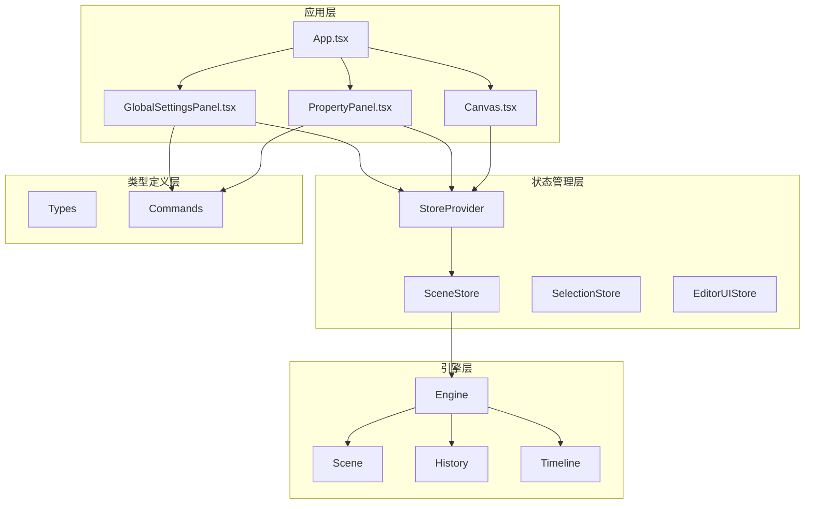
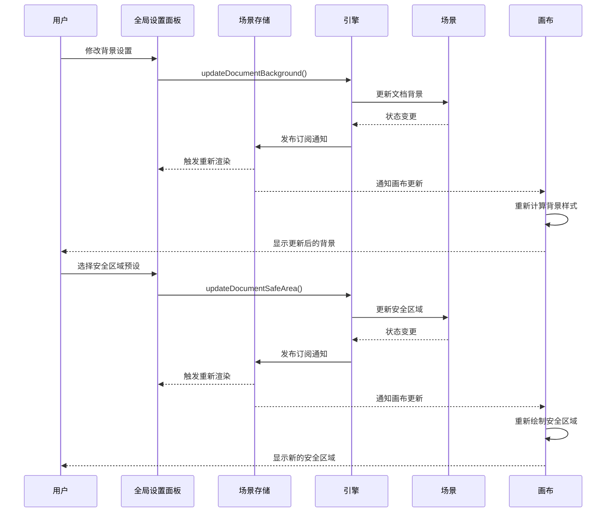
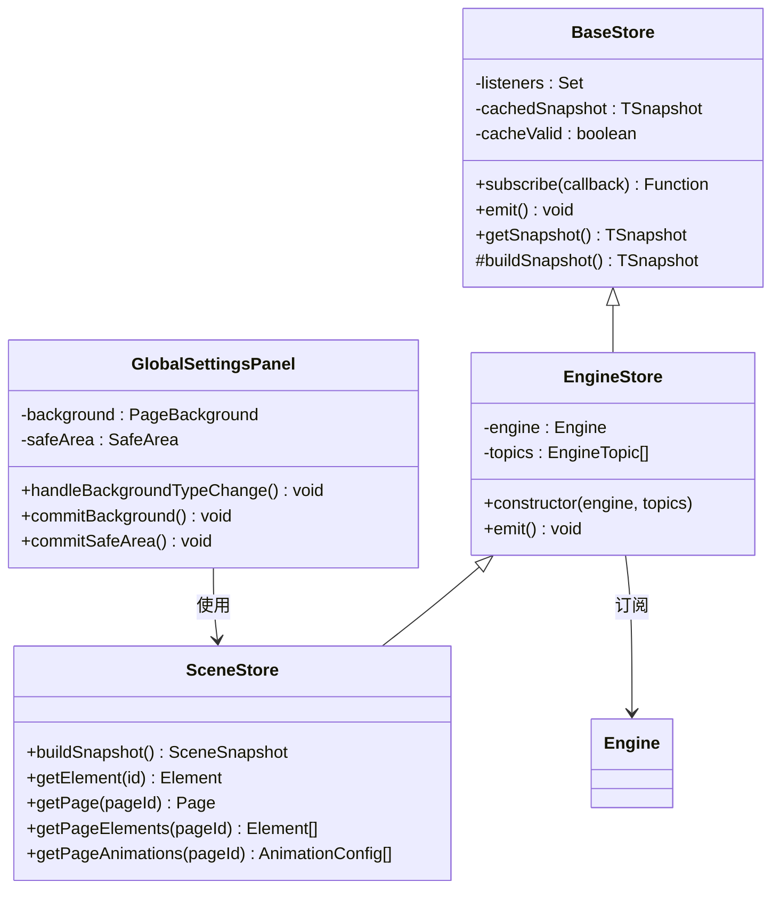
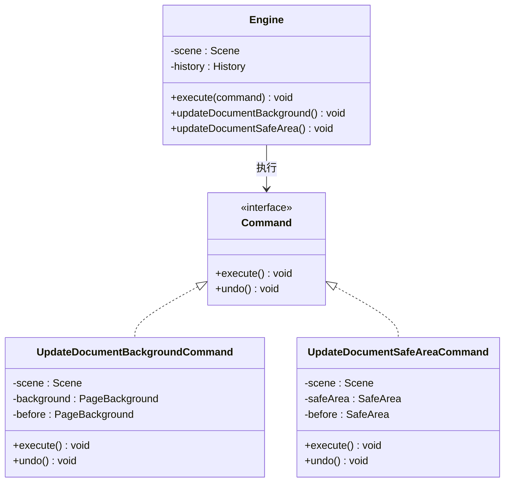
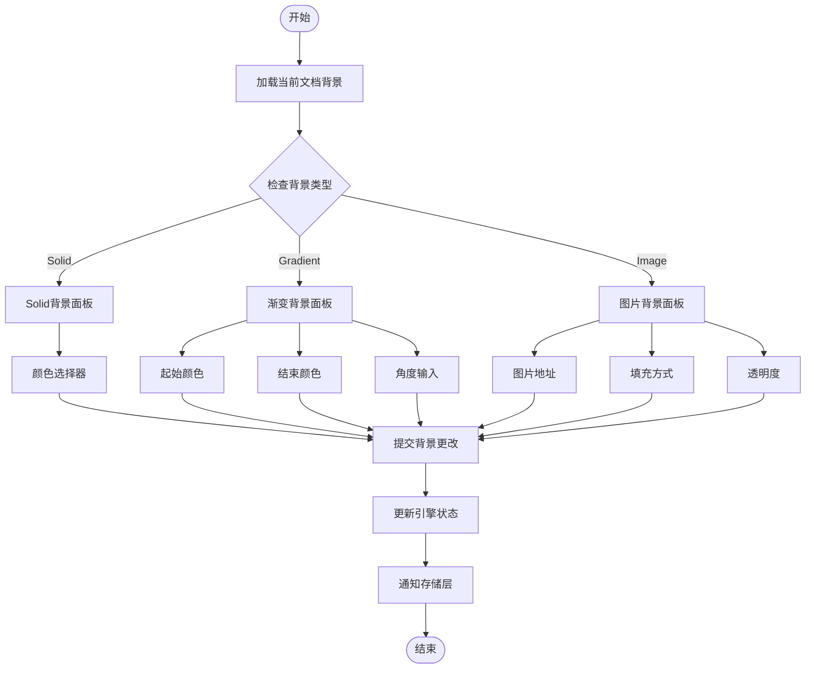
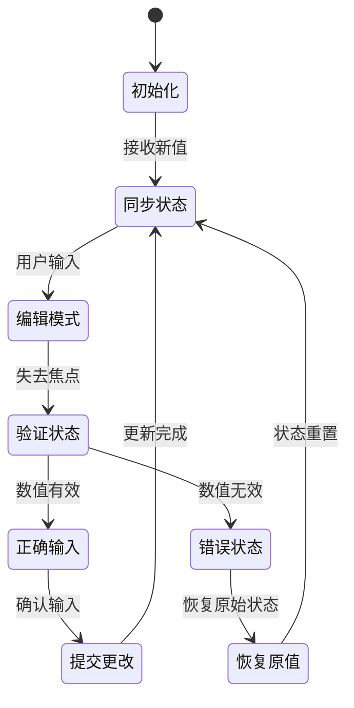
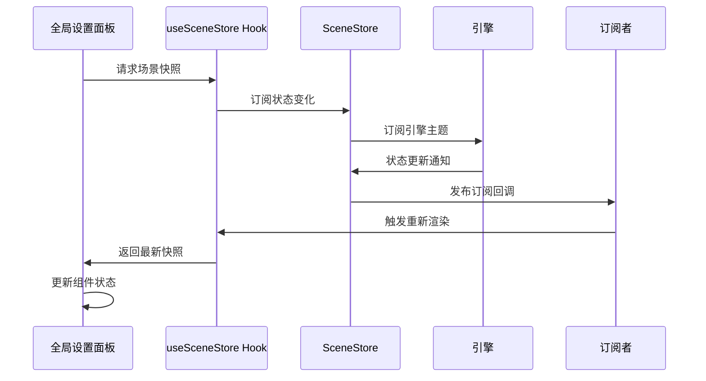
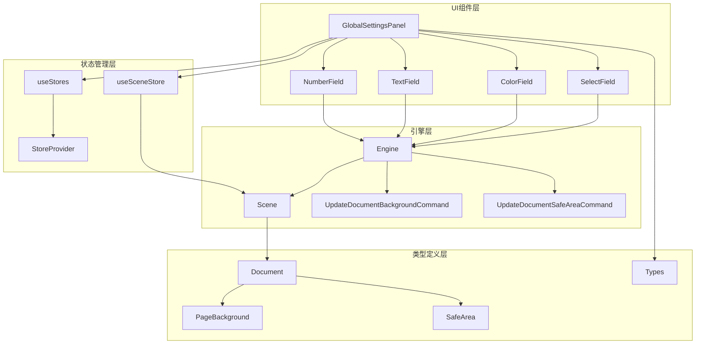

# 全局设置面板

<cite>
**本文档引用的文件**
- [src/components/GlobalSettingsPanel.tsx](file://src/components/GlobalSettingsPanel.tsx)
- [src/App.tsx](file://src/App.tsx)
- [src/store/index.ts](file://src/store/index.ts)
- [src/store/baseStore.ts](file://src/store/baseStore.ts)
- [src/store/sceneStore.ts](file://src/store/sceneStore.ts)
- [src/store/hooks.ts](file://src/store/hooks.ts)
- [src/types/index.ts](file://src/types/index.ts)
- [src/engine/index.ts](file://src/engine/index.ts)
- [src/engine/engine.ts](file://src/engine/engine.ts)
- [src/engine/commands.ts](file://src/engine/commands.ts)
- [src/components/Canvas.tsx](file://src/components/Canvas.tsx)
- [src/components/PropertyPanel.tsx](file://src/components/PropertyPanel.tsx)
- [src/main.tsx](file://src/main.tsx)
</cite>

## 目录
1. [简介](#简介)
2. [项目结构](#项目结构)
3. [核心组件](#核心组件)
4. [架构概览](#架构概览)
5. [详细组件分析](#详细组件分析)
6. [依赖关系分析](#依赖关系分析)
7. [性能考虑](#性能考虑)
8. [故障排除指南](#故障排除指南)
9. [结论](#结论)

## 简介

全局设置面板是滑动编辑器中的一个关键功能模块，允许用户配置整个文档的全局属性。该面板提供了背景设置和安全区域配置两大核心功能，所有页面都会继承这些全局设置。

该组件采用React函数式组件设计，结合自定义Hook和状态管理模式，实现了响应式的用户界面与引擎状态的双向同步。通过命令模式和发布订阅机制，确保了用户操作能够正确地更新底层数据结构，并实时反映在画布渲染中。

## 项目结构

滑动编辑器采用模块化架构设计，全局设置面板作为UI层组件之一，与其他核心组件协同工作：

**图表来源**
- [src/App.tsx:1-350](file://src/App.tsx#L1-L350)
- [src/components/GlobalSettingsPanel.tsx:1-339](file://src/components/GlobalSettingsPanel.tsx#L1-L339)
- [src/store/index.ts:1-35](file://src/store/index.ts#L1-L35)

**章节来源**
- [src/App.tsx:1-350](file://src/App.tsx#L1-L350)
- [src/components/GlobalSettingsPanel.tsx:1-339](file://src/components/GlobalSettingsPanel.tsx#L1-L339)

## 核心组件

### 全局设置面板架构

全局设置面板采用分层设计模式，包含以下核心组件：

1. **主面板组件**：负责整体布局和状态管理
2. **字段组件**：提供可复用的输入控件
3. **预设系统**：管理安全区域预设值
4. **命令执行器**：处理用户操作与引擎交互

### 数据流架构

**图表来源**
- [src/components/GlobalSettingsPanel.tsx:32-160](file://src/components/GlobalSettingsPanel.tsx#L32-L160)
- [src/engine/engine.ts:88-96](file://src/engine/engine.ts#L88-L96)
- [src/store/sceneStore.ts:15-33](file://src/store/sceneStore.ts#L15-L33)

**章节来源**
- [src/components/GlobalSettingsPanel.tsx:32-160](file://src/components/GlobalSettingsPanel.tsx#L32-L160)
- [src/engine/engine.ts:88-96](file://src/engine/engine.ts#L88-L96)

## 架构概览

### 状态管理模式

全局设置面板采用基于发布订阅的状态管理模式：

**图表来源**
- [src/store/baseStore.ts:6-50](file://src/store/baseStore.ts#L6-L50)
- [src/store/sceneStore.ts:15-58](file://src/store/sceneStore.ts#L15-L58)
- [src/components/GlobalSettingsPanel.tsx:32-160](file://src/components/GlobalSettingsPanel.tsx#L32-L160)

### 命令模式实现

全局设置面板通过命令模式与引擎交互：

**图表来源**
- [src/engine/commands.ts:224-254](file://src/engine/commands.ts#L224-L254)
- [src/engine/engine.ts:98-103](file://src/engine/engine.ts#L98-L103)

**章节来源**
- [src/engine/commands.ts:224-254](file://src/engine/commands.ts#L224-L254)
- [src/engine/engine.ts:98-103](file://src/engine/engine.ts#L98-L103)

## 详细组件分析

### 主面板组件分析

#### 组件结构

全局设置面板采用函数式组件设计，包含以下主要部分：

1. **状态管理**：使用React的useState和useCallback Hook管理本地状态
2. **数据绑定**：通过useStores和useSceneStore Hook连接到全局状态
3. **事件处理**：提供完整的用户交互处理机制
4. **渲染逻辑**：根据当前文档状态动态渲染不同的配置选项

#### 背景设置功能

**图表来源**
- [src/components/GlobalSettingsPanel.tsx:52-136](file://src/components/GlobalSettingsPanel.tsx#L52-L136)
- [src/components/GlobalSettingsPanel.tsx:38-43](file://src/components/GlobalSettingsPanel.tsx#L38-L43)

#### 安全区域配置功能

安全区域功能提供了预设值管理和自定义配置两种模式：

| 预设名称 | 上边距 | 右边距 | 下边距 | 左边距 | 用途 |
|---------|--------|--------|--------|--------|------|
| None | 0 | 0 | 0 | 0 | 无安全区域 |
| Standard (20px) | 20 | 20 | 20 | 20 | 标准安全区域 |
| Wide (40px) | 40 | 40 | 40 | 40 | 宽松安全区域 |
| Action Safe (5%) | 27 | 48 | 27 | 48 | 动作安全区域 |

**章节来源**
- [src/components/GlobalSettingsPanel.tsx:11-30](file://src/components/GlobalSettingsPanel.tsx#L11-L30)
- [src/components/GlobalSettingsPanel.tsx:138-157](file://src/components/GlobalSettingsPanel.tsx#L138-L157)

### 字段组件系统

#### 输入控件抽象

全局设置面板实现了统一的字段组件系统，支持多种数据类型的输入：

1. **数字字段**：NumberField - 处理数值输入，支持最小值、最大值和步长限制
2. **文本字段**：TextField - 处理字符串输入，支持即时验证
3. **颜色字段**：ColorField - 提供颜色选择器和颜色值输入
4. **选择字段**：SelectField - 处理枚举值选择

#### 本地状态管理

每个字段组件都实现了本地状态管理机制：

**图表来源**
- [src/components/GlobalSettingsPanel.tsx:188-225](file://src/components/GlobalSettingsPanel.tsx#L188-L225)
- [src/components/GlobalSettingsPanel.tsx:236-265](file://src/components/GlobalSettingsPanel.tsx#L236-L265)

**章节来源**
- [src/components/GlobalSettingsPanel.tsx:173-338](file://src/components/GlobalSettingsPanel.tsx#L173-L338)

### 存储层集成

#### 状态订阅机制

全局设置面板通过自定义Hook与存储层集成：

**图表来源**
- [src/store/hooks.ts:9-11](file://src/store/hooks.ts#L9-L11)
- [src/store/sceneStore.ts:15-18](file://src/store/sceneStore.ts#L15-L18)

#### 快照缓存策略

存储层实现了智能缓存机制：

| 缓存状态 | 描述 | 性能影响 |
|---------|------|----------|
| 缓存有效 | 快照已更新且未过期 | 最佳性能 |
| 缓存无效 | 状态已变更需要重建 | 中等性能开销 |
| 首次访问 | 无缓存需要初始化 | 初始性能开销 |

**章节来源**
- [src/store/baseStore.ts:25-31](file://src/store/baseStore.ts#L25-L31)
- [src/store/sceneStore.ts:20-33](file://src/store/sceneStore.ts#L20-L33)

## 依赖关系分析

### 组件间依赖关系

**图表来源**
- [src/components/GlobalSettingsPanel.tsx:1-339](file://src/components/GlobalSettingsPanel.tsx#L1-L339)
- [src/store/index.ts:24-31](file://src/store/index.ts#L24-L31)
- [src/engine/index.ts:9-19](file://src/engine/index.ts#L9-L19)

### 外部依赖分析

全局设置面板依赖以下外部库：

| 依赖库 | 版本 | 用途 | 重要性 |
|-------|------|------|--------|
| react | ^18.3.1 | 核心UI框架 | 必需 |
| react-dom | ^18.3.1 | DOM渲染 | 必需 |
| gsap | ^3.15.0 | 动画支持 | 可选 |
| react-moveable | ^0.56.0 | 元素操作 | 可选 |

**章节来源**
- [src/components/GlobalSettingsPanel.tsx:1-5](file://src/components/GlobalSettingsPanel.tsx#L1-L5)
- [src/main.tsx:12-13](file://src/main.tsx#L12-L13)

## 性能考虑

### 渲染优化策略

1. **局部状态管理**：每个字段组件维护独立的本地状态，避免不必要的全局重渲染
2. **回调函数缓存**：使用useCallback Hook缓存事件处理器，减少函数重新创建
3. **条件渲染**：根据背景类型动态渲染相应的配置面板，避免渲染不相关的DOM节点

### 内存管理

1. **状态清理**：组件卸载时自动清理订阅和事件监听器
2. **缓存策略**：智能缓存场景快照，避免重复计算
3. **资源释放**：动画引擎资源在组件销毁时自动释放

### 性能监控建议

| 性能指标 | 监控方法 | 优化建议 |
|---------|----------|----------|
| 渲染频率 | React DevTools Profiler | 减少不必要的重渲染 |
| 内存使用 | 浏览器开发者工具 | 检查内存泄漏 |
| 交互响应 | 性能面板 | 优化事件处理函数 |

## 故障排除指南

### 常见问题及解决方案

#### 背景设置不生效

**问题描述**：修改背景设置后画布没有更新

**可能原因**：
1. 引擎命令执行失败
2. 状态订阅未正确触发
3. 画布渲染逻辑错误

**解决步骤**：
1. 检查控制台是否有错误信息
2. 验证引擎命令是否正确执行
3. 确认存储层订阅是否正常工作

#### 安全区域显示异常

**问题描述**：安全区域边界线显示不正确

**可能原因**：
1. 安全区域数值计算错误
2. CSS样式计算问题
3. 画布尺寸不匹配

**解决步骤**：
1. 验证安全区域数值范围（必须≥0）
2. 检查CSS样式计算逻辑
3. 确认画布容器尺寸

#### 输入验证错误

**问题描述**：数值输入框显示错误的提示信息

**可能原因**：
1. 数值转换失败
2. 边界值检查逻辑错误
3. 本地状态同步问题

**解决步骤**：
1. 添加数值格式验证
2. 实现边界值检查
3. 确保状态同步机制正常工作

**章节来源**
- [src/components/GlobalSettingsPanel.tsx:194-201](file://src/components/GlobalSettingsPanel.tsx#L194-L201)
- [src/components/Canvas.tsx:148-173](file://src/components/Canvas.tsx#L148-L173)

## 结论

全局设置面板作为滑动编辑器的核心UI组件，成功实现了以下目标：

1. **功能完整性**：提供了全面的全局设置功能，包括背景配置和安全区域管理
2. **用户体验**：通过直观的界面设计和实时反馈，提升了用户的操作体验
3. **架构合理性**：采用模块化设计和清晰的职责分离，便于维护和扩展
4. **性能表现**：通过优化的状态管理和渲染策略，确保了良好的性能表现

该组件为整个编辑器提供了稳定的全局配置能力，是构建高质量内容创作工具的重要基础。其设计模式和实现方案可以作为类似编辑器项目的参考模板。