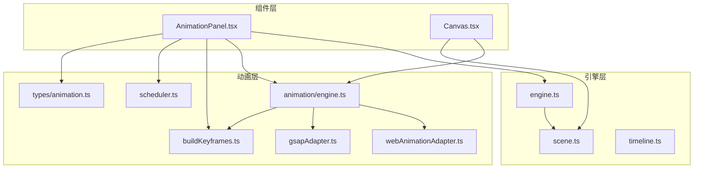
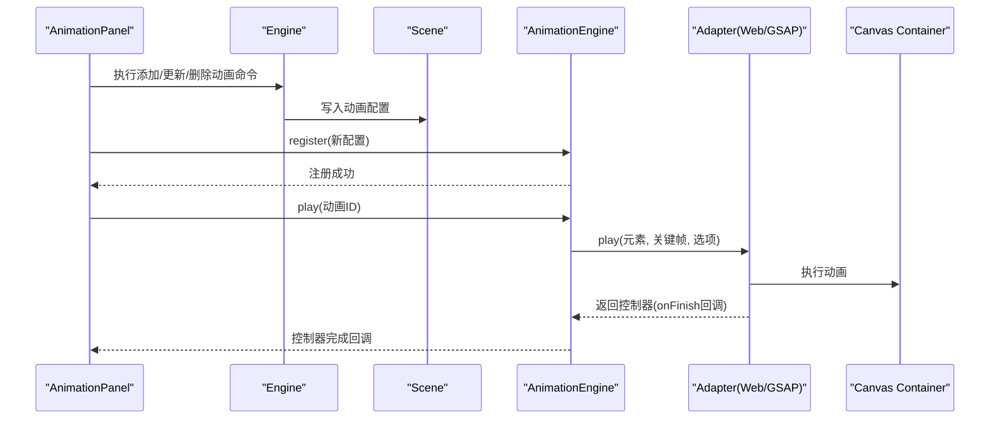
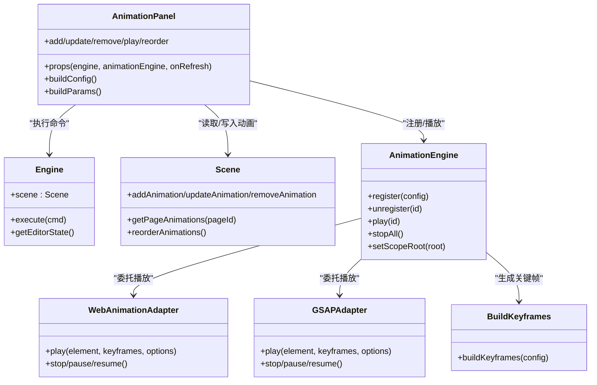

# 动画面板 (AnimationPanel)

<cite>
**本文引用的文件**
- [AnimationPanel.tsx](file://src/components/AnimationPanel.tsx)
- [engine.ts](file://src/engine/engine.ts)
- [scene.ts](file://src/engine/scene.ts)
- [timeline.ts](file://src/engine/timeline.ts)
- [animation.ts](file://src/types/animation.ts)
- [buildKeyframes.ts](file://src/animation/buildKeyframes.ts)
- [scheduler.ts](file://src/animation/scheduler.ts)
- [engine.ts](file://src/animation/engine.ts)
- [webAnimationAdapter.ts](file://src/animation/webAnimationAdapter.ts)
- [gsapAdapter.ts](file://src/animation/gsapAdapter.ts)
- [Canvas.tsx](file://src/components/Canvas.tsx)
</cite>

## 目录
1. [简介](#简介)
2. [项目结构](#项目结构)
3. [核心组件](#核心组件)
4. [架构总览](#架构总览)
5. [详细组件分析](#详细组件分析)
6. [依赖关系分析](#依赖关系分析)
7. [性能考量](#性能考量)
8. [故障排查指南](#故障排查指南)
9. [结论](#结论)

## 简介
本文件为动画面板组件（AnimationPanel）的全面技术文档，聚焦以下目标：
- 动画效果配置与时间轴管理：解释如何选择进入、强调、退出三类动画，以及参数化配置。
- 与动画引擎交互：记录组件如何从动画引擎获取元素动画状态与可用动画效果，并进行注册/注销。
- 动画参数编辑：涵盖时长、延迟、缓动函数、重复次数等参数的编辑机制。
- 预览与播放控制：说明单个动画播放、从当前步骤开始播放、以及与Canvas的同步机制。
- 动画序列管理：介绍多动画组合、批次执行模型、步骤与批次的关系。
- 与Canvas的同步：解释动画作用域绑定、DOM查询策略及实时更新。

## 项目结构
AnimationPanel位于组件层，与引擎层（Engine/Scene）、动画层（AnimationEngine/Adapter）协同工作，同时与Canvas进行DOM层面的联动。

图表来源
- [AnimationPanel.tsx:1-857](file://src/components/AnimationPanel.tsx#L1-L857)
- [engine.ts:1-54](file://src/engine/engine.ts#L1-L54)
- [scene.ts:1-273](file://src/engine/scene.ts#L1-L273)
- [animation/engine.ts:1-120](file://src/animation/engine.ts#L1-L120)
- [webAnimationAdapter.ts:1-67](file://src/animation/webAnimationAdapter.ts#L1-L67)
- [gsapAdapter.ts:1-140](file://src/animation/gsapAdapter.ts#L1-L140)
- [buildKeyframes.ts:1-125](file://src/animation/buildKeyframes.ts#L1-L125)
- [scheduler.ts:1-160](file://src/animation/scheduler.ts#L1-L160)
- [types/animation.ts:1-113](file://src/types/animation.ts#L1-L113)
- [Canvas.tsx:1-191](file://src/components/Canvas.tsx#L1-L191)

章节来源
- [AnimationPanel.tsx:1-857](file://src/components/AnimationPanel.tsx#L1-L857)
- [engine.ts:1-54](file://src/engine/engine.ts#L1-L54)
- [scene.ts:1-273](file://src/engine/scene.ts#L1-L273)
- [animation/engine.ts:1-120](file://src/animation/engine.ts#L1-L120)
- [Canvas.tsx:1-191](file://src/components/Canvas.tsx#L1-L191)

## 核心组件
- AnimationPanel：负责动画列表展示、表单配置、拖拽排序、播放控制、与动画引擎的注册/更新/删除交互。
- AnimationEngine：持有动画配置、构建关键帧、委托适配器执行播放/暂停/停止等生命周期操作。
- WebAnimationAdapter/GSAPAdapter：适配器层，分别使用Web Animations API或GSAP实现播放控制。
- buildKeyframes：根据动画类型与参数生成WAAPI兼容的关键帧数组。
- scheduler：将动画序列转换为“步骤-批次”模型，支持点击驱动的顺序播放。
- Scene：管理页面元素与动画配置的CRUD，提供按页查询动画列表的能力。
- Canvas：通过setScopeRoot限定动画作用域，确保在编辑容器内正确匹配元素。

章节来源
- [AnimationPanel.tsx:1-857](file://src/components/AnimationPanel.tsx#L1-L857)
- [animation/engine.ts:1-120](file://src/animation/engine.ts#L1-L120)
- [buildKeyframes.ts:1-125](file://src/animation/buildKeyframes.ts#L1-L125)
- [scheduler.ts:1-160](file://src/animation/scheduler.ts#L1-L160)
- [scene.ts:1-273](file://src/engine/scene.ts#L1-L273)
- [Canvas.tsx:1-191](file://src/components/Canvas.tsx#L1-L191)

## 架构总览
AnimationPanel作为UI入口，协调Engine与AnimationEngine：
- 读取Scene中的动画配置，构建可拖拽的动画列表。
- 基于用户输入构建AnimationConfig，通过命令模式写入Scene并注册到AnimationEngine。
- 播放控制通过AnimationEngine.play触发，适配器层负责实际动画执行。
- Canvas通过setScopeRoot限制DOM查询范围，保证动画目标元素正确。

图表来源
- [AnimationPanel.tsx:203-245](file://src/components/AnimationPanel.tsx#L203-L245)
- [animation/engine.ts:52-70](file://src/animation/engine.ts#L52-L70)
- [webAnimationAdapter.ts:15-43](file://src/animation/webAnimationAdapter.ts#L15-L43)
- [gsapAdapter.ts:16-60](file://src/animation/gsapAdapter.ts#L16-L60)
- [Canvas.tsx:25-32](file://src/components/Canvas.tsx#L25-L32)

## 详细组件分析

### 动画面板功能与界面
- 动画列表：基于Scene.getPageAnimations(pageId)渲染，支持拖拽重排；每个条目显示名称、效果、所属元素、时长、起始关系（点击/与前一个/在前一个之后）。
- 表单区域：支持新增或编辑动画，字段包括名称、效果、起始类型、时长、延迟、缓动、重复次数、启用开关、以及针对不同效果的参数（方向/距离、缩放范围、旋转角度、亮度等）。
- 播放控制：单个播放、从当前步骤开始播放；编辑态高亮提示，禁用未选中元素时的操作按钮。
- 步骤与批次：通过buildClickSteps将动画序列组织为ClickStep，内部以批次（同一时间并发）与步骤（用户点击推进）分层。

章节来源
- [AnimationPanel.tsx:375-548](file://src/components/AnimationPanel.tsx#L375-L548)
- [AnimationPanel.tsx:555-746](file://src/components/AnimationPanel.tsx#L555-L746)
- [scheduler.ts:13-49](file://src/animation/scheduler.ts#L13-L49)

### 动画效果分类与参数
- 效果分类：进入（fadeIn/zoomIn/slideIn/flyIn/rotateIn）、强调（pulse/shake/blink/scale/highlight）、退出（fadeOut/zoomOut/slideOut/flyOut/rotateOut）。
- 参数需求：部分效果需要额外参数（滑动/飞行的方向与距离、缩放起止值、旋转角度、高亮亮度），组件根据效果动态显示对应参数控件。
- 默认参数：针对每种效果提供合理的默认参数，便于快速添加。

章节来源
- [AnimationPanel.tsx:48-79](file://src/components/AnimationPanel.tsx#L48-L79)
- [AnimationPanel.tsx:136-154](file://src/components/AnimationPanel.tsx#L136-L154)
- [AnimationPanel.tsx:156-183](file://src/components/AnimationPanel.tsx#L156-L183)

### 与动画引擎交互
- 注册/更新/删除：通过AddAnimationCommand/UpdateAnimationCommand/RemoveAnimationCommand写入Scene，随后调用AnimationEngine.register/register/unregister同步到引擎侧。
- 播放控制：handlePlay/handlePlayFromHere分别触发单动画播放或从当前步骤开始播放；播放完成后自动停止所有动画。
- 起始类型自动修复：拖拽重排后，根据相邻动画自动修正起始类型（click/withPrev/afterPrev）。

章节来源
- [AnimationPanel.tsx:203-263](file://src/components/AnimationPanel.tsx#L203-L263)
- [AnimationPanel.tsx:304-328](file://src/components/AnimationPanel.tsx#L304-L328)
- [scene.ts:179-233](file://src/engine/scene.ts#L179-L233)

### 关键帧构建与适配器
- 关键帧生成：buildKeyframes根据效果与参数生成WAAPI兼容的关键帧数组，覆盖透明度、位移、缩放、旋转、滤镜等属性。
- 适配器层：WebAnimationAdapter直接使用element.animate；GSAPAdapter将关键帧映射为GSAP fromTo语法，支持更丰富的缓动与属性解析。
- 作用域绑定：Canvas通过setScopeRoot将动画作用域限定在编辑容器内，避免跨容器误触。

章节来源
- [buildKeyframes.ts:7-109](file://src/animation/buildKeyframes.ts#L7-L109)
- [webAnimationAdapter.ts:15-43](file://src/animation/webAnimationAdapter.ts#L15-L43)
- [gsapAdapter.ts:16-60](file://src/animation/gsapAdapter.ts#L16-L60)
- [Canvas.tsx:25-32](file://src/components/Canvas.tsx#L25-L32)

### 时间轴与序列管理
- ClickStep模型：将动画序列划分为“步骤”，步骤由“批次”组成；批次内并发，批次间顺序执行。
- 起始关系：click表示新步骤开始；withPrev表示加入当前批次；afterPrev表示在当前步骤内开启新批次。
- 自动修复：拖拽后根据索引与前一动画自动调整起始类型，保证序列连续性。

章节来源
- [scheduler.ts:13-49](file://src/animation/scheduler.ts#L13-L49)
- [scheduler.ts:56-159](file://src/animation/scheduler.ts#L56-L159)
- [AnimationPanel.tsx:81-85](file://src/components/AnimationPanel.tsx#L81-L85)

### 与Canvas的同步机制
- DOM查询策略：AnimationEngine.queryElement通过[data-element-id]选择器定位元素，若设置了scopeRoot则限定在容器内查询。
- 实时更新：Canvas在挂载时设置scopeRoot，在卸载时清空；当元素被选中或动画配置变化时，通过onRefresh触发重绘。
- 元素标识：Canvas渲染元素时使用data-element-id，确保动画目标与渲染元素一一对应。

章节来源
- [animation/engine.ts:24-30](file://src/animation/engine.ts#L24-L30)
- [Canvas.tsx:106-125](file://src/components/Canvas.tsx#L106-L125)

## 依赖关系分析

图表来源
- [AnimationPanel.tsx:87-215](file://src/components/AnimationPanel.tsx#L87-L215)
- [engine.ts:7-19](file://src/engine/engine.ts#L7-L19)
- [scene.ts:212-233](file://src/engine/scene.ts#L212-L233)
- [animation/engine.ts:33-70](file://src/animation/engine.ts#L33-L70)
- [webAnimationAdapter.ts:12-43](file://src/animation/webAnimationAdapter.ts#L12-L43)
- [gsapAdapter.ts:13-60](file://src/animation/gsapAdapter.ts#L13-L60)
- [buildKeyframes.ts:7-9](file://src/animation/buildKeyframes.ts#L7-L9)

章节来源
- [AnimationPanel.tsx:87-215](file://src/components/AnimationPanel.tsx#L87-L215)
- [engine.ts:7-19](file://src/engine/engine.ts#L7-L19)
- [scene.ts:212-233](file://src/engine/scene.ts#L212-L233)
- [animation/engine.ts:33-70](file://src/animation/engine.ts#L33-L70)
- [webAnimationAdapter.ts:12-43](file://src/animation/webAnimationAdapter.ts#L12-L43)
- [gsapAdapter.ts:13-60](file://src/animation/gsapAdapter.ts#L13-L60)
- [buildKeyframes.ts:7-9](file://src/animation/buildKeyframes.ts#L7-L9)

## 性能考量
- 关键帧生成为纯函数，避免DOM访问，复杂度与参数数量线性相关。
- 适配器层在播放前会清理同元素上已有动画，避免叠加导致的性能问题。
- 拖拽重排后自动修复起始类型，减少无效序列带来的执行开销。
- Canvas作用域限定可避免不必要的DOM遍历，提升查询效率。

## 故障排查指南
- 动画不生效
  - 检查元素是否被选中且存在对应[data-element-id]属性。
  - 确认AnimationEngine.setScopeRoot已正确设置到Canvas容器。
  - 参考路径：[Canvas.tsx:25-32](file://src/components/Canvas.tsx#L25-L32)，[animation/engine.ts:24-30](file://src/animation/engine.ts#L24-L30)
- 播放无响应
  - 确认AnimationEngine.register已调用，且配置id有效。
  - 检查适配器是否正确初始化（Web或GSAP）。
  - 参考路径：[AnimationPanel.tsx:211](file://src/components/AnimationPanel.tsx#L211)，[animation/engine.ts:52-70](file://src/animation/engine.ts#L52-L70)
- 拖拽后顺序异常
  - 检查fixStartType逻辑是否正确应用到被移动项。
  - 参考路径：[AnimationPanel.tsx:317-323](file://src/components/AnimationPanel.tsx#L317-L323)，[AnimationPanel.tsx:81-85](file://src/components/AnimationPanel.tsx#L81-L85)
- 缓动或参数不生效
  - 确认Easing与参数映射正确，必要时检查适配器的easing映射。
  - 参考路径：[AnimationPanel.tsx:489-501](file://src/components/AnimationPanel.tsx#L489-L501)，[gsapAdapter.ts:128-138](file://src/animation/gsapAdapter.ts#L128-L138)

## 结论
AnimationPanel提供了完整的动画配置与播放体验，结合Scene与AnimationEngine实现了从UI到执行层的清晰职责分离。通过ClickStep与批次模型，系统支持复杂的动画序列编排；通过作用域绑定与适配器抽象，兼顾了浏览器原生能力与第三方库的灵活性。建议在团队协作中保持配置字段与关键帧生成的一致性，确保跨平台与跨适配器的稳定性。