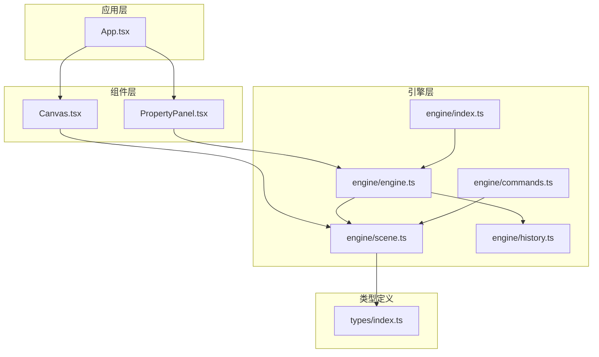
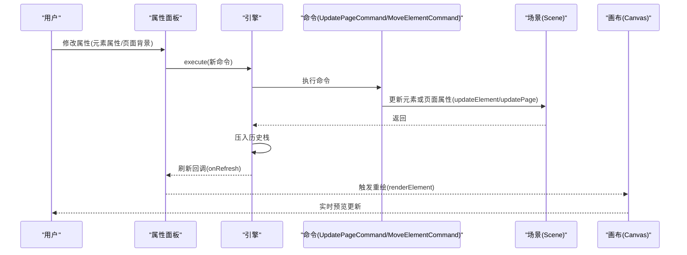
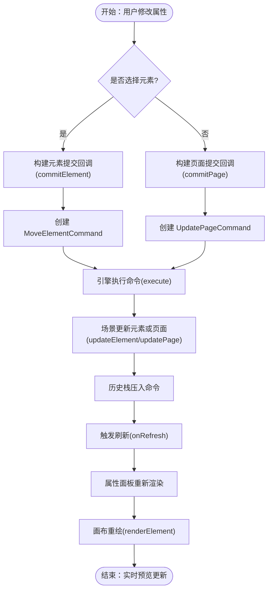
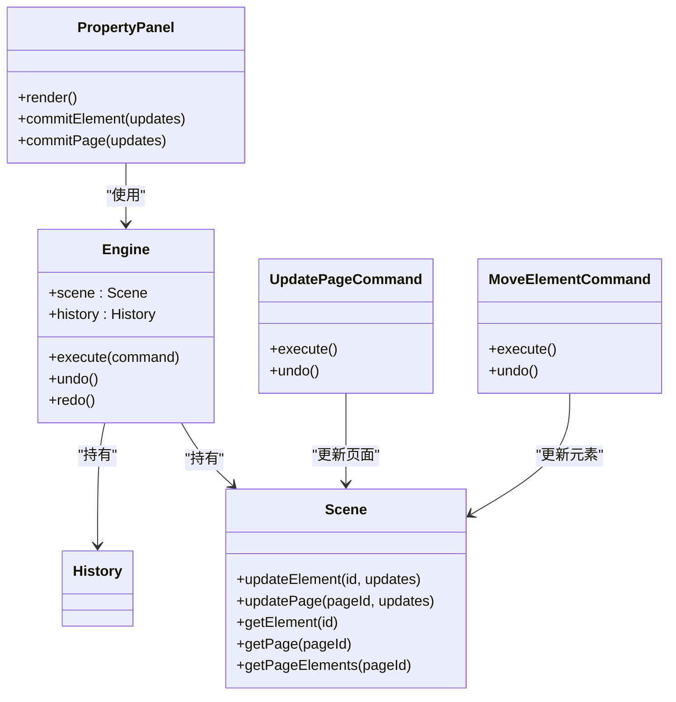

# 属性面板 (PropertyPanel)

<cite>
**本文引用的文件**
- [PropertyPanel.tsx](file://src/components/PropertyPanel.tsx)
- [engine/index.ts](file://src/engine/index.ts)
- [engine/engine.ts](file://src/engine/engine.ts)
- [engine/scene.ts](file://src/engine/scene.ts)
- [engine/commands.ts](file://src/engine/commands.ts)
- [engine/history.ts](file://src/engine/history.ts)
- [types/index.ts](file://src/types/index.ts)
- [App.tsx](file://src/App.tsx)
- [Canvas.tsx](file://src/components/Canvas.tsx)
</cite>

## 更新摘要
**变更内容**
- 新增页面级背景编辑功能，支持纯色、渐变和图片背景
- 添加页面背景切换机制，允许启用或禁用每页自定义背景
- 新增PageBackgroundEditor组件，提供完整的背景编辑界面
- 新增UpdatePageCommand命令，专门处理页面级别属性更新
- 扩展属性面板在无元素选择时的显示逻辑

## 目录
1. [简介](#简介)
2. [项目结构](#项目结构)
3. [核心组件](#核心组件)
4. [架构总览](#架构总览)
5. [详细组件分析](#详细组件分析)
6. [依赖关系分析](#依赖关系分析)
7. [性能考量](#性能考量)
8. [故障排查指南](#故障排查指南)
9. [结论](#结论)
10. [附录](#附录)

## 简介
本文件系统性地记录了属性面板组件（PropertyPanel）的设计与实现，涵盖以下关键主题：
- 元素属性编辑与实时预览联动
- 根据选中元素类型动态渲染不同属性表单
- 页面级背景编辑功能，支持纯色、渐变和图片背景
- 属性编辑器控件：文本输入、颜色选择器、数值调节器、下拉选择等
- 属性变更处理流程：从用户输入到命令执行的完整链路
- 不同元素类型的属性差异：形状元素的填充与描边、文本元素的字体与对齐、图片元素的裁剪等
- 属性验证与默认值处理机制
- 与引擎系统的双向数据绑定

## 项目结构
属性面板位于组件层，通过引擎层与场景状态交互，并与画布渲染层协同实现"所见即所得"的实时预览。

**图表来源**
- [App.tsx:1-344](file://src/App.tsx#L1-L344)
- [PropertyPanel.tsx:1-475](file://src/components/PropertyPanel.tsx#L1-L475)
- [Canvas.tsx:1-191](file://src/components/Canvas.tsx#L1-L191)
- [engine/engine.ts:1-54](file://src/engine/engine.ts#L1-L54)
- [engine/scene.ts:1-288](file://src/engine/scene.ts#L1-L288)
- [engine/commands.ts:1-370](file://src/engine/commands.ts#L1-L370)
- [engine/history.ts:1-45](file://src/engine/history.ts#L1-L45)
- [engine/index.ts:1-16](file://src/engine/index.ts#L1-L16)
- [types/index.ts:1-191](file://src/types/index.ts#L1-L191)

**章节来源**
- [App.tsx:1-344](file://src/App.tsx#L1-L344)
- [PropertyPanel.tsx:1-475](file://src/components/PropertyPanel.tsx#L1-L475)
- [engine/index.ts:1-16](file://src/engine/index.ts#L1-L16)

## 核心组件
- 属性面板（PropertyPanel）
  - 负责读取当前选中元素，按元素类型动态渲染属性表单
  - **新增**：当未选择任何元素时，显示页面级背景编辑界面
  - 提供通用控件：数值字段、文本字段、颜色选择器、下拉选择
  - 将用户输入转换为命令并提交给引擎执行，触发刷新以驱动画布重绘
- **新增**：页面背景编辑器（PageBackgroundEditor）
  - 支持纯色背景、渐变背景和图片背景三种类型
  - 提供完整的背景配置界面，包括颜色、角度、渐变色停点、图片源、适配模式和不透明度
- 引擎（Engine）
  - 统一的状态入口与命令执行器，负责调用命令并维护历史栈
- 场景（Scene）
  - 存储文档、页面、元素与动画等数据，提供元素增删改查与父子关系维护
- **新增**：页面更新命令（UpdatePageCommand）
  - 专门处理页面级别属性更新的可撤销命令，保存前后状态用于撤销/重做
- 类型系统（Element、ShapeElement、TextElement、ImageElement、PageBackground）
  - 定义元素结构与属性约束，包括页面背景类型定义，确保属性面板渲染与引擎操作的一致性

**章节来源**
- [PropertyPanel.tsx:12-77](file://src/components/PropertyPanel.tsx#L12-L77)
- [PropertyPanel.tsx:387-474](file://src/components/PropertyPanel.tsx#L387-L474)
- [engine/engine.ts:29-48](file://src/engine/engine.ts#L29-L48)
- [engine/scene.ts:108-135](file://src/engine/scene.ts#L108-L135)
- [engine/commands.ts:198-222](file://src/engine/commands.ts#L198-L222)
- [types/index.ts:72-90](file://src/types/index.ts#L72-L90)

## 架构总览
属性面板与引擎、场景、命令之间的交互如下：

**图表来源**
- [PropertyPanel.tsx:35-41](file://src/components/PropertyPanel.tsx#L35-L41)
- [engine/engine.ts:29-32](file://src/engine/engine.ts#L29-L32)
- [engine/commands.ts:37-43](file://src/engine/commands.ts#L37-L43)
- [engine/scene.ts:108-135](file://src/engine/scene.ts#L108-L135)
- [Canvas.tsx:118-123](file://src/components/Canvas.tsx#L118-L123)

## 详细组件分析

### 属性面板（PropertyPanel）功能与实现
- **动态表单渲染**
  - 依据选中元素类型（shape/text/image），分别渲染对应属性区域
  - **新增**：当未选择任何元素时，显示页面级背景编辑界面
  - 变换区（Transform）：统一展示位置、尺寸、旋转、透明度等通用属性
- **页面背景编辑功能**
  - **新增**：显示页面名称编辑区域
  - **新增**：提供页面背景开关，支持启用/禁用每页自定义背景
  - **新增**：根据开关状态显示或隐藏页面背景编辑器
  - **新增**：支持纯色、渐变和图片三种背景类型
- 控件体系
  - 数值字段（NumberField）：支持最小值、最大值、步长限制；失焦时校验并提交
  - 文本字段（TextField）：适用于字符串属性，失焦提交
  - 颜色字段（ColorField）：支持颜色选择器与文本输入两种方式，便于快速编辑
  - 下拉选择（SelectField）：用于枚举值属性，如形状类型、文本对齐、图片对象适配模式、背景类型
- 提交与刷新
  - 每次属性变更通过回调生成命令并提交给引擎，随后触发刷新以驱动画布重绘

**章节来源**
- [PropertyPanel.tsx:37-92](file://src/components/PropertyPanel.tsx#L37-L92)
- [PropertyPanel.tsx:90-142](file://src/components/PropertyPanel.tsx#L90-L142)
- [PropertyPanel.tsx:144-182](file://src/components/PropertyPanel.tsx#L144-L182)
- [PropertyPanel.tsx:184-219](file://src/components/PropertyPanel.tsx#L184-L219)
- [PropertyPanel.tsx:221-255](file://src/components/PropertyPanel.tsx#L221-L255)

### 页面背景编辑器（PageBackgroundEditor）实现
- **功能概述**
  - 支持三种背景类型：纯色（solid）、渐变（gradient）、图片（image）
  - 提供完整的背景配置界面，包括颜色、角度、渐变色停点、图片源、适配模式和不透明度
- **类型切换机制**
  - 当用户选择新的背景类型时，自动创建对应的默认配置
  - 纯色背景：默认白色
  - 渐变背景：默认角度135度，蓝色到紫色渐变
  - 图片背景：空源，覆盖适配，不透明度1
- **控件实现**
  - 类型选择下拉框：切换背景类型
  - 纯色背景：颜色选择器
  - 渐变背景：角度数值输入、起始色和结束色选择器
  - 图片背景：图片URL输入、适配模式选择、不透明度滑块

**章节来源**
- [PropertyPanel.tsx:387-474](file://src/components/PropertyPanel.tsx#L387-L474)

### 形状元素（ShapeElement）属性
- 属性差异
  - 形状类型：矩形、圆形、三角形
  - 填充色（fill）、描边色（stroke）、描边宽度（strokeWidth）
- 表单渲染
  - 使用下拉选择设置形状类型
  - 使用颜色字段设置填充与描边
  - 使用数值字段设置描边宽度

**章节来源**
- [PropertyPanel.tsx:257-281](file://src/components/PropertyPanel.tsx#L257-L281)
- [types/index.ts:27-33](file://src/types/index.ts#L27-L33)

### 文本元素（TextElement）属性
- 属性差异
  - 文本内容（text）、字号（fontSize）、字体颜色（color）、对齐方式（align）
- 表单渲染
  - 文本字段编辑内容
  - 数值字段编辑字号
  - 颜色字段编辑颜色
  - 下拉选择编辑对齐方式（左/中/右）

**章节来源**
- [PropertyPanel.tsx:283-307](file://src/components/PropertyPanel.tsx#L283-L307)
- [types/index.ts:35-42](file://src/types/index.ts#L35-L42)

### 图片元素（ImageElement）属性
- 属性差异
  - 图片地址（src）、对象适配模式（objectFit：cover/contain/fill）
- 表单渲染
  - 文本字段编辑图片地址
  - 下拉选择编辑对象适配模式

**章节来源**
- [PropertyPanel.tsx:309-331](file://src/components/PropertyPanel.tsx#L309-L331)
- [types/index.ts:44-48](file://src/types/index.ts#L44-L48)

### 属性编辑器控件实现要点
- 数值字段（NumberField）
  - 本地状态与受控值同步，失焦时进行数字校验，失败则回滚到原值
  - 支持最小值、最大值、步长参数
- 文本字段（TextField）
  - 失焦提交，保证输入完成后再写入
- 颜色字段（ColorField）
  - 同时支持颜色选择器与文本输入，便于快速切换
- 下拉选择（SelectField）
  - 枚举选项由组件内部定义，提交时强制为合法值

**章节来源**
- [PropertyPanel.tsx:90-142](file://src/components/PropertyPanel.tsx#L90-L142)
- [PropertyPanel.tsx:144-182](file://src/components/PropertyPanel.tsx#L144-L182)
- [PropertyPanel.tsx:184-219](file://src/components/PropertyPanel.tsx#L184-L219)
- [PropertyPanel.tsx:221-255](file://src/components/PropertyPanel.tsx#L221-L255)

### 属性变更处理流程（从用户输入到命令执行）
- 用户在属性面板修改某项属性
- 属性面板生成提交回调（commit），接收更新键值对
- **新增**：根据操作类型选择相应的命令类型
  - 元素属性更新：MoveElementCommand
  - **新增**：页面属性更新：UpdatePageCommand
- 回调创建命令并通过引擎执行
- 引擎将命令压入历史栈，以便撤销/重做
- 引擎触发刷新回调，属性面板重新渲染，画布重绘

**图表来源**
- [PropertyPanel.tsx:21-35](file://src/components/PropertyPanel.tsx#L21-L35)
- [engine/engine.ts:29-32](file://src/engine/engine.ts#L29-L32)
- [engine/commands.ts:37-43](file://src/engine/commands.ts#L37-L43)
- [engine/scene.ts:108-135](file://src/engine/scene.ts#L108-L135)
- [Canvas.tsx:118-123](file://src/components/Canvas.tsx#L118-L123)

### 属性验证与默认值处理
- 输入验证
  - 数值字段在失焦时进行数字校验，非法输入回滚到原值
  - 下拉选择仅接受预定义枚举值
- 默认值
  - **新增**：页面背景默认值处理
    - 新建页面时，默认使用文档全局背景设置
    - 页面背景类型切换时，自动创建对应类型的默认配置
  - 新建元素时，各类型元素具有合理的默认属性值（例如形状的尺寸、颜色、描边宽度；文本的字号、颜色、对齐；图片的适配模式）
- 类型约束
  - 类型系统严格定义元素属性，包括页面背景类型，避免运行期错误

**章节来源**
- [PropertyPanel.tsx:111-118](file://src/components/PropertyPanel.tsx#L111-L118)
- [PropertyPanel.tsx:221-255](file://src/components/PropertyPanel.tsx#L221-L255)
- [PropertyPanel.tsx:394-411](file://src/components/PropertyPanel.tsx#L394-L411)
- [Canvas.tsx:130-190](file://src/components/Canvas.tsx#L130-L190)
- [types/index.ts:10-54](file://src/types/index.ts#L10-L54)

### 与引擎系统的双向数据绑定
- 单向数据流
  - 属性面板从引擎读取当前选中元素与编辑状态，渲染受控表单
  - 用户输入通过命令提交到引擎，引擎更新场景状态
- 刷新机制
  - 引擎执行命令后触发刷新回调，属性面板重新读取最新状态并渲染
- 选择状态
  - 画布点击或拖拽选择元素，更新编辑器状态中的选中ID，属性面板随之切换渲染
- **新增**：页面背景数据绑定
  - 属性面板读取当前页面背景设置，支持自定义背景与全局背景的切换
  - 页面背景变更通过UpdatePageCommand提交，确保撤销/重做功能

**章节来源**
- [PropertyPanel.tsx:12-33](file://src/components/PropertyPanel.tsx#L12-L33)
- [engine/engine.ts:21-27](file://src/engine/engine.ts#L21-L27)
- [engine/engine.ts:29-32](file://src/engine/engine.ts#L29-L32)
- [Canvas.tsx:71-77](file://src/components/Canvas.tsx#L71-L77)

## 依赖关系分析
- 组件依赖
  - PropertyPanel 依赖引擎（Engine）以获取选中元素与执行命令
  - PropertyPanel 依赖类型系统（Element/ShapeElement/TextElement/ImageElement/PageBackground）以确定渲染分支
  - **新增**：PropertyPanel 依赖 UpdatePageCommand 进行页面属性更新
- 引擎依赖
  - Engine 依赖 History 维护命令历史
  - Engine 依赖 Scene 进行数据读写
  - **新增**：命令（UpdatePageCommand）依赖 Scene 的 updatePage 方法
  - 命令（MoveElementCommand）依赖 Scene 的 updateElement 方法
- 应用集成
  - App 将属性面板与画布并列布局，右侧切换"属性"和"动画"面板
  - App 通过版本号驱动动画引擎与画布刷新

**图表来源**
- [engine/engine.ts:7-49](file://src/engine/engine.ts#L7-L49)
- [engine/scene.ts:54-58](file://src/engine/scene.ts#L54-L58)
- [engine/commands.ts:198-222](file://src/engine/commands.ts#L198-L222)
- [engine/commands.ts:20-44](file://src/engine/commands.ts#L20-L44)
- [PropertyPanel.tsx:35-41](file://src/components/PropertyPanel.tsx#L35-L41)

**章节来源**
- [engine/engine.ts:1-54](file://src/engine/engine.ts#L1-L54)
- [engine/scene.ts:1-288](file://src/engine/scene.ts#L1-L288)
- [engine/commands.ts:1-370](file://src/engine/commands.ts#L1-L370)
- [PropertyPanel.tsx:1-475](file://src/components/PropertyPanel.tsx#L1-L475)

## 性能考量
- 渲染优化
  - 属性面板按元素类型分支渲染，避免不必要的子树重建
  - **新增**：页面背景编辑界面采用条件渲染，仅在需要时显示
  - 数值字段在失焦时才提交，减少频繁重绘
- 命令粒度
  - MoveElementCommand 仅针对属性更新，命令体积小、执行快
  - **新增**：UpdatePageCommand 专门处理页面属性更新，避免误操作
- 刷新策略
  - 通过版本号与刷新回调控制刷新频率，避免过度重绘
- 数据一致性
  - 引擎统一入口执行命令，保证状态一致性与可追踪性

## 故障排查指南
- 无元素被选中
  - 现象：属性面板显示页面背景编辑界面
  - 处理：在画布中点击选择一个元素，或使用页面背景编辑功能
- **新增**：页面背景切换问题
  - 现象：启用/禁用页面自定义背景无效
  - 处理：确认页面存在且有全局背景设置；检查 UpdatePageCommand 是否正确执行
- **新增**：背景类型切换异常
  - 现象：切换背景类型后配置丢失
  - 处理：确认类型切换逻辑正常工作，检查 PageBackgroundEditor 的状态管理
- 输入无效数值
  - 现象：数值字段失焦后回滚到原值
  - 处理：检查最小/最大值与步长设置，确保输入符合范围
- 颜色值格式异常
  - 现象：颜色字段无法正确应用
  - 处理：确认颜色值格式符合预期（如十六进制或CSS颜色名）
- 撤销/重做不可用
  - 现象：菜单禁用
  - 处理：确认已执行过至少一次可撤销命令
- 画布未更新
  - 现象：修改属性后未看到变化
  - 处理：确认引擎执行命令后触发了刷新回调；检查版本号是否递增

**章节来源**
- [PropertyPanel.tsx:15-30](file://src/components/PropertyPanel.tsx#L15-L30)
- [PropertyPanel.tsx:111-118](file://src/components/PropertyPanel.tsx#L111-L118)
- [engine/history.ts:32-38](file://src/engine/history.ts#L32-L38)
- [App.tsx:24-26](file://src/App.tsx#L24-L26)

## 结论
属性面板通过清晰的控件体系与严格的命令执行链路，实现了对多类型元素属性的高效编辑与实时预览。**新增的页面级背景编辑功能**进一步增强了属性面板的能力，使其能够处理文档级别的背景设置和页面级别的个性化定制。其设计遵循单向数据流与命令式更新原则，配合引擎的历史管理与场景数据模型，确保了编辑体验的稳定性与可追溯性。未来可在以下方面进一步增强：
- 增加属性级校验与错误提示
- 支持批量选择与多元素属性编辑
- 提供更丰富的控件（如渐变、阴影、边距等）
- **新增**：扩展页面背景编辑功能，支持更多背景类型和效果

## 附录
- 关键路径参考
  - 属性面板渲染与提交：[PropertyPanel.tsx:12-77](file://src/components/PropertyPanel.tsx#L12-L77)，[PropertyPanel.tsx:35-41](file://src/components/PropertyPanel.tsx#L35-L41)
  - **新增**：页面背景编辑界面：[PropertyPanel.tsx:37-92](file://src/components/PropertyPanel.tsx#L37-L92)
  - **新增**：页面背景编辑器：[PropertyPanel.tsx:387-474](file://src/components/PropertyPanel.tsx#L387-L474)
  - 命令执行与历史管理：[engine/engine.ts:29-48](file://src/engine/engine.ts#L29-L48)，[engine/history.ts:7-30](file://src/engine/history.ts#L7-L30)
  - 场景更新逻辑：[engine/scene.ts:108-135](file://src/engine/scene.ts#L108-L135)
  - **新增**：页面更新逻辑：[engine/scene.ts:54-58](file://src/engine/scene.ts#L54-L58)
  - 元素类型定义：[types/index.ts:10-54](file://src/types/index.ts#L10-L54)
  - **新增**：页面背景类型定义：[types/index.ts:72-90](file://src/types/index.ts#L72-L90)
  - 应用集成与刷新：[App.tsx:24-26](file://src/App.tsx#L24-L26)，[Canvas.tsx:118-123](file://src/components/Canvas.tsx#L118-L123)