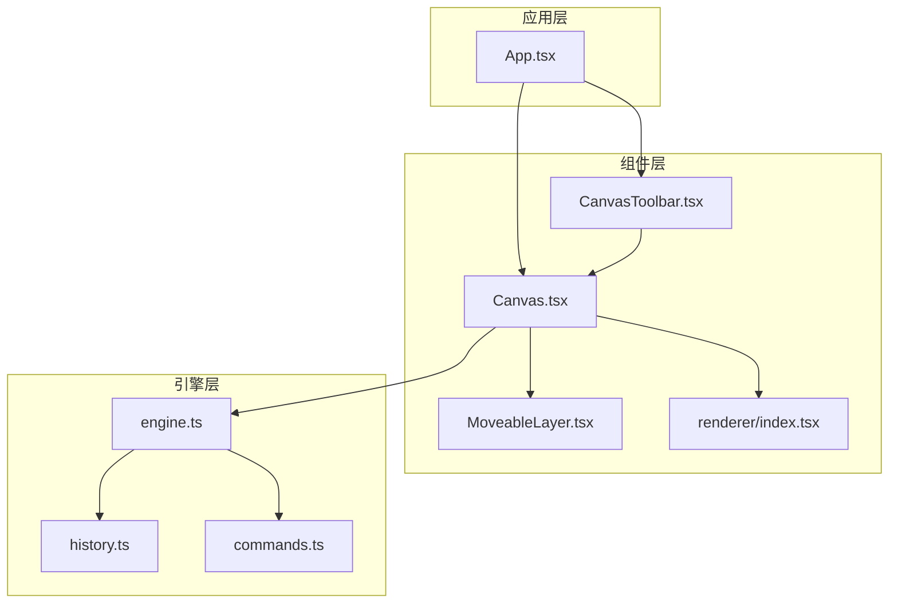
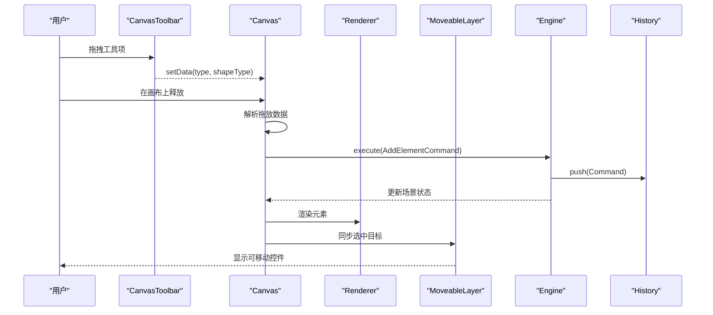
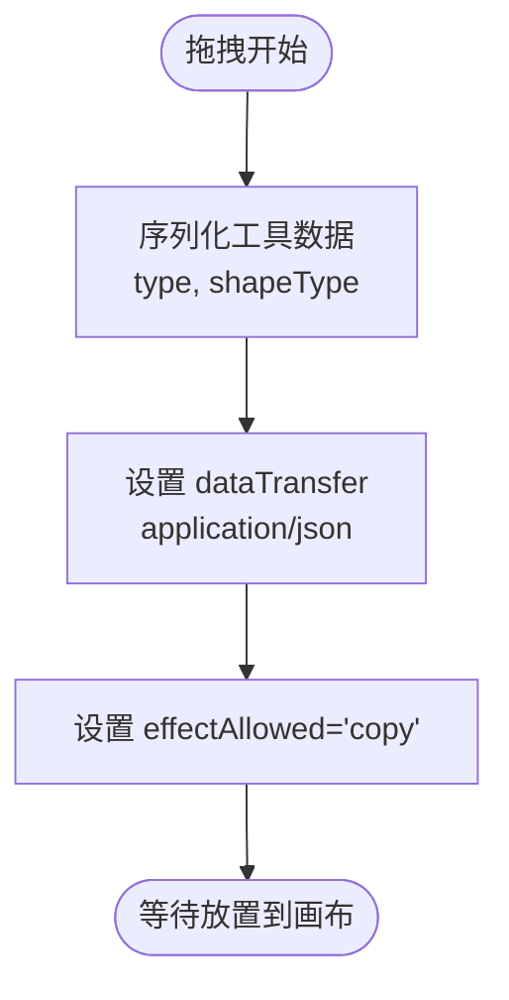
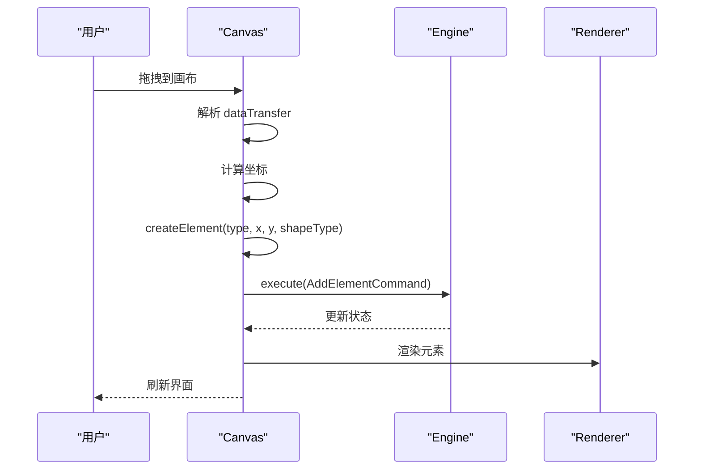
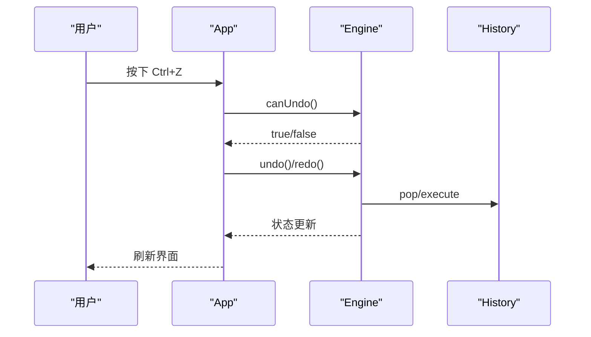
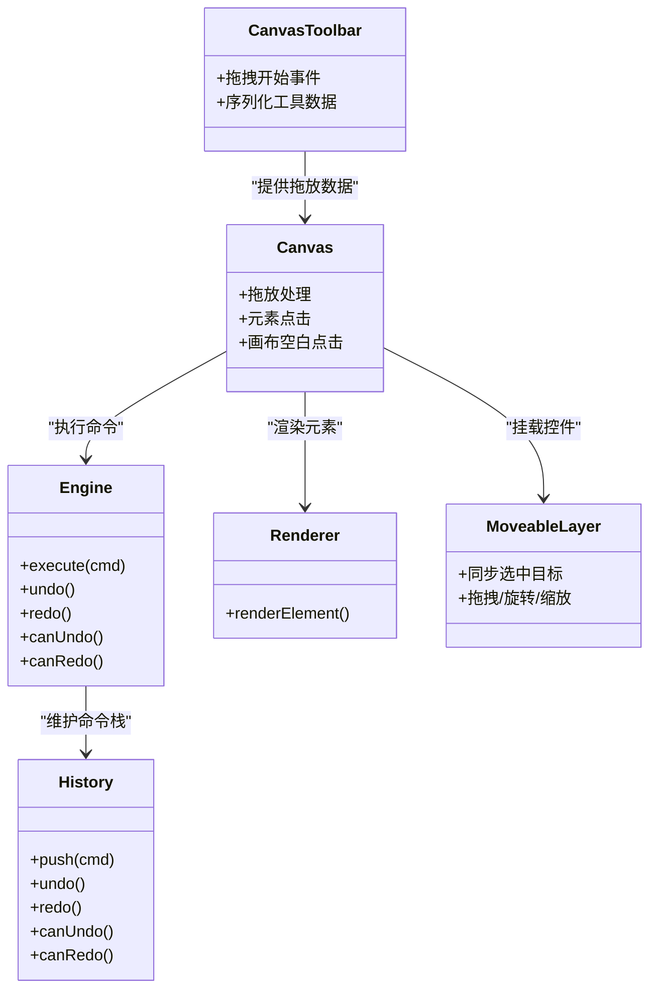

# 画布工具栏 (CanvasToolbar)

<cite>
**本文引用的文件列表**
- [CanvasToolbar.tsx](file://src/components/CanvasToolbar.tsx)
- [Canvas.tsx](file://src/components/Canvas.tsx)
- [App.tsx](file://src/App.tsx)
- [engine.ts](file://src/engine/engine.ts)
- [history.ts](file://src/engine/history.ts)
- [commands.ts](file://src/engine/commands.ts)
- [types/index.ts](file://src/types/index.ts)
- [renderer/index.tsx](file://src/renderer/index.tsx)
- [MoveableLayer.tsx](file://src/components/MoveableLayer.tsx)
</cite>

## 目录
1. [简介](#简介)
2. [项目结构](#项目结构)
3. [核心组件](#核心组件)
4. [架构总览](#架构总览)
5. [详细组件分析](#详细组件分析)
6. [依赖关系分析](#依赖关系分析)
7. [性能考量](#性能考量)
8. [故障排查指南](#故障排查指南)
9. [结论](#结论)
10. [附录](#附录)

## 简介
本文件为画布工具栏组件（CanvasToolbar）提供系统化、可操作的技术文档。内容涵盖：
- 工具按钮的排列与交互方式
- 工具栏提供的编辑工具类型（形状、文本、图片）
- 工具切换的状态管理与视觉反馈机制
- 撤销/重做按钮的实现与快捷键支持
- 全屏预览、清空画布等高级功能的按钮实现
- 工具栏的自定义与扩展机制
- 与 Canvas 组件的协作关系与事件传递

## 项目结构
CanvasToolbar 位于组件层，作为应用界面的一部分，与 Canvas、App、Engine 等模块协同工作。其职责是通过拖拽方式向画布注入元素，同时配合应用层的撤销/重做、全屏预览等功能按钮使用。

图表来源
- [App.tsx:155-284](file://src/App.tsx#L155-L284)
- [CanvasToolbar.tsx:18-65](file://src/components/CanvasToolbar.tsx#L18-L65)
- [Canvas.tsx:22-127](file://src/components/Canvas.tsx#L22-L127)
- [engine.ts:7-49](file://src/engine/engine.ts#L7-L49)
- [history.ts:3-44](file://src/engine/history.ts#L3-L44)
- [commands.ts:4-18](file://src/engine/commands.ts#L4-L18)
- [renderer/index.tsx:189-202](file://src/renderer/index.tsx#L189-L202)
- [MoveableLayer.tsx:15-35](file://src/components/MoveableLayer.tsx#L15-L35)

章节来源
- [App.tsx:155-284](file://src/App.tsx#L155-L284)
- [CanvasToolbar.tsx:18-65](file://src/components/CanvasToolbar.tsx#L18-L65)
- [Canvas.tsx:22-127](file://src/components/Canvas.tsx#L22-L127)

## 核心组件
- CanvasToolbar：提供“矩形”“圆形”“三角形”“文本”“图片”五类元素的拖拽入口，用于向画布添加元素。
- Canvas：承载画布区域，处理拖放事件、元素点击、画布空白处点击取消选择等逻辑，并与渲染器和可移动层协作。
- Engine：统一的状态与命令执行中枢，提供撤销/重做能力；App 层负责键盘快捷键与按钮触发。
- 命令体系：AddElementCommand 等命令封装了可撤销的操作，History 负责栈式管理。
- 渲染器：根据元素类型渲染形状、文本、图片等，支持选中态的外框提示。
- 可移动层：在选中元素时提供拖拽、旋转、缩放的交互与吸附。

章节来源
- [CanvasToolbar.tsx:3-16](file://src/components/CanvasToolbar.tsx#L3-L16)
- [Canvas.tsx:34-90](file://src/components/Canvas.tsx#L34-L90)
- [engine.ts:7-49](file://src/engine/engine.ts#L7-L49)
- [history.ts:3-44](file://src/engine/history.ts#L3-L44)
- [commands.ts:4-18](file://src/engine/commands.ts#L4-L18)
- [renderer/index.tsx:189-202](file://src/renderer/index.tsx#L189-L202)
- [MoveableLayer.tsx:15-35](file://src/components/MoveableLayer.tsx#L15-L35)

## 架构总览
CanvasToolbar 通过 HTML5 拖放 API 将元素元数据（类型、形状类型）传递给 Canvas。Canvas 在 drop 事件中解析数据，构造元素并交由 Engine 执行命令，从而完成元素的创建与状态更新。撤销/重做由 Engine 的 History 管理，App 提供键盘快捷键与按钮控制。

图表来源
- [CanvasToolbar.tsx:19-26](file://src/components/CanvasToolbar.tsx#L19-L26)
- [Canvas.tsx:44-69](file://src/components/Canvas.tsx#L44-L69)
- [commands.ts:4-18](file://src/engine/commands.ts#L4-L18)
- [engine.ts:29-32](file://src/engine/engine.ts#L29-L32)
- [renderer/index.tsx:189-202](file://src/renderer/index.tsx#L189-L202)
- [MoveableLayer.tsx:24-35](file://src/components/MoveableLayer.tsx#L24-L35)

## 详细组件分析

### CanvasToolbar 组件
- 功能定位：提供元素拖拽入口，当前支持“矩形”“圆形”“三角形”“文本”“图片”五类工具。
- 排列与交互：每个工具项以可拖拽的卡片形式展示，包含图标与标签；拖拽开始时序列化类型信息写入 dataTransfer。
- 数据结构：工具项接口包含标签、类型、形状类型（仅形状工具）、图标。
- 视觉样式：固定高度、边框、圆角、间距与颜色，保证一致的视觉反馈。

图表来源
- [CanvasToolbar.tsx:19-26](file://src/components/CanvasToolbar.tsx#L19-L26)

章节来源
- [CanvasToolbar.tsx:3-16](file://src/components/CanvasToolbar.tsx#L3-L16)
- [CanvasToolbar.tsx:18-65](file://src/components/CanvasToolbar.tsx#L18-L65)

### Canvas 组件与拖放协作
- 拖放处理：在画布容器上注册 onDragOver 与 onDrop 事件；onDrop 中解析 dataTransfer，计算落点坐标，调用 createElement 构造元素，再通过 Engine 执行 AddElementCommand 并更新选中状态。
- 元素点击：点击元素时更新选中 ID 列表，触发刷新；点击画布空白处或可移动控件外部时清空选中。
- 与渲染器：遍历页面元素，调用渲染器按类型绘制；选中元素显示蓝色选中框。
- 与可移动层：在渲染完成后挂载 MoveableLayer，基于选中元素同步可移动控件。

图表来源
- [Canvas.tsx:39-69](file://src/components/Canvas.tsx#L39-L69)
- [Canvas.tsx:118-124](file://src/components/Canvas.tsx#L118-L124)
- [renderer/index.tsx:189-202](file://src/renderer/index.tsx#L189-L202)

章节来源
- [Canvas.tsx:34-90](file://src/components/Canvas.tsx#L34-L90)
- [Canvas.tsx:118-124](file://src/components/Canvas.tsx#L118-L124)

### 撤销/重做与快捷键支持
- 撤销/重做：Engine 提供 undo/redo/canUndo/canRedo 方法；History 维护命令栈，push 时清空重做栈。
- 快捷键：App 监听全局键盘事件，支持 Ctrl/Cmd+Z 撤销、Ctrl/Cmd+Shift+Z 或 Ctrl/Cmd+Y 重做；删除键删除选中元素。
- 按钮：顶部工具条提供 Undo/Redo 按钮，禁用态随 canUndo/canRedo 动态变化。

图表来源
- [App.tsx:108-150](file://src/App.tsx#L108-L150)
- [engine.ts:34-48](file://src/engine/engine.ts#L34-L48)
- [history.ts:12-30](file://src/engine/history.ts#L12-L30)

章节来源
- [App.tsx:108-150](file://src/App.tsx#L108-L150)
- [engine.ts:29-48](file://src/engine/engine.ts#L29-L48)
- [history.ts:3-44](file://src/engine/history.ts#L3-L44)

### 全屏预览与清空画布
- 全屏预览：顶部“Full Preview”按钮清空选中并打开预览模态，用于查看最终效果。
- 清空画布：当前实现未直接暴露“清空画布”按钮；可通过删除选中元素或在命令层扩展相应命令实现。

章节来源
- [App.tsx:257-275](file://src/App.tsx#L257-L275)
- [App.tsx:127-145](file://src/App.tsx#L127-L145)

### 工具切换与状态管理
- 工具模式：类型定义中包含 select、pan、shape、text、image 等工具模式；当前 CanvasToolbar 仅提供元素拖拽入口，未直接切换工具模式。
- 选中态：Canvas 根据 EditorState.selectedElementIds 控制元素选中态与 MoveableLayer 的目标同步。
- 视觉反馈：选中元素显示蓝色选中框；按钮禁用态随 canUndo/canRedo 动态变化。

章节来源
- [types/index.ts:142-149](file://src/types/index.ts#L142-L149)
- [Canvas.tsx:71-90](file://src/components/Canvas.tsx#L71-L90)
- [renderer/index.tsx:173-187](file://src/renderer/index.tsx#L173-L187)
- [App.tsx:169-208](file://src/App.tsx#L169-L208)

### 自定义与扩展机制
- 新增工具：在 CanvasToolbar 的工具项数组中添加新条目，指定类型与形状类型（如需要），并在 Canvas.createElement 分支中支持该类型。
- 新增命令：在 commands.ts 中新增对应命令类，实现 execute/undo；在 engine.ts 中通过 execute 推入 History。
- 事件扩展：可在 Canvas 上扩展更多拖放与点击行为，例如双击编辑、右键菜单等。

章节来源
- [CanvasToolbar.tsx:10-16](file://src/components/CanvasToolbar.tsx#L10-L16)
- [Canvas.tsx:130-190](file://src/components/Canvas.tsx#L130-L190)
- [commands.ts:4-18](file://src/engine/commands.ts#L4-L18)
- [engine.ts:29-32](file://src/engine/engine.ts#L29-L32)

## 依赖关系分析
- CanvasToolbar 依赖 React 的 DragEvent 类型，输出标准化的拖放数据。
- Canvas 依赖 Engine 的命令执行与场景状态，依赖 Renderer 进行元素渲染，依赖 MoveableLayer 提供可移动控件。
- Engine 依赖 History 与命令集合，提供统一的状态更新与撤销/重做能力。
- App 作为顶层容器，协调 Engine、AnimationEngine、UI 按钮与快捷键。

图表来源
- [CanvasToolbar.tsx:18-65](file://src/components/CanvasToolbar.tsx#L18-L65)
- [Canvas.tsx:22-127](file://src/components/Canvas.tsx#L22-L127)
- [engine.ts:7-49](file://src/engine/engine.ts#L7-L49)
- [history.ts:3-44](file://src/engine/history.ts#L3-L44)
- [renderer/index.tsx:189-202](file://src/renderer/index.tsx#L189-L202)
- [MoveableLayer.tsx:15-35](file://src/components/MoveableLayer.tsx#L15-L35)

章节来源
- [CanvasToolbar.tsx:18-65](file://src/components/CanvasToolbar.tsx#L18-L65)
- [Canvas.tsx:22-127](file://src/components/Canvas.tsx#L22-L127)
- [engine.ts:7-49](file://src/engine/engine.ts#L7-L49)
- [history.ts:3-44](file://src/engine/history.ts#L3-L44)
- [renderer/index.tsx:189-202](file://src/renderer/index.tsx#L189-L202)
- [MoveableLayer.tsx:15-35](file://src/components/MoveableLayer.tsx#L15-L35)

## 性能考量
- 拖放解析：Canvas 在 drop 时进行 JSON 解析与边界检查，建议保持数据结构简洁，避免大对象传输。
- 渲染开销：元素数量增多时，渲染器与 MoveableLayer 的同步可能成为瓶颈；可通过虚拟化或分页策略优化。
- 命令栈：History 栈深度与命令复杂度影响撤销/重做的性能，建议对批量操作合并命令或限制历史深度。

## 故障排查指南
- 拖放无效：确认 Canvas 已注册 onDragOver 与 onDrop；检查 dataTransfer 是否正确设置。
- 元素未创建：检查 createElement 分支是否覆盖工具类型；确认 Engine.execute 成功推入命令。
- 选中态异常：检查 EditorState.selectedElementIds 是否被正确更新；确认 MoveableLayer 的目标同步。
- 撤销/重做不可用：确认 History 栈状态；检查 canUndo/canRedo 的返回值与按钮禁用态。

章节来源
- [Canvas.tsx:39-69](file://src/components/Canvas.tsx#L39-L69)
- [Canvas.tsx:71-90](file://src/components/Canvas.tsx#L71-L90)
- [engine.ts:34-48](file://src/engine/engine.ts#L34-L48)
- [history.ts:12-30](file://src/engine/history.ts#L12-L30)

## 结论
CanvasToolbar 通过简单直观的拖放交互，将元素快速注入画布；Canvas 负责落点计算与命令执行，Engine 提供统一的状态与撤销/重做能力。当前实现聚焦于基础元素拖放与撤销/重做，未包含工具切换与缩放/平移等编辑工具；可通过扩展命令与工具项实现更丰富的编辑体验。

## 附录
- 术语
  - 工具模式：select、pan、shape、text、image
  - 命令：可执行与撤销的操作单元
  - 历史栈：撤销/重做所依赖的命令序列