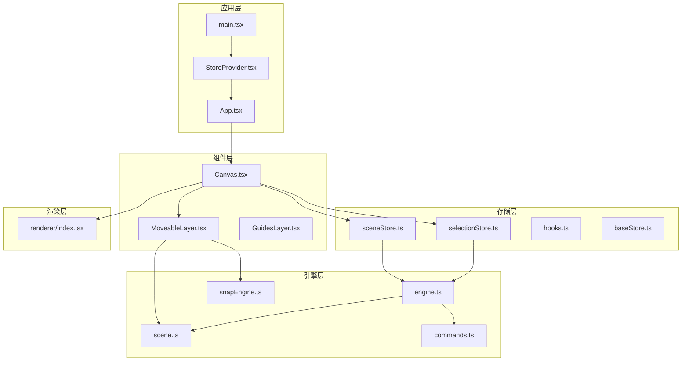
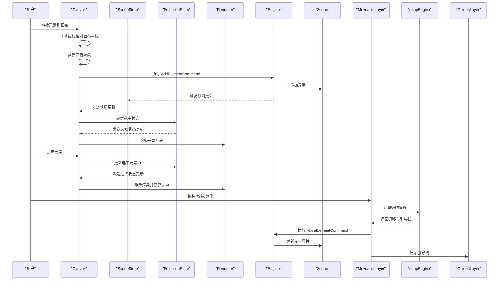
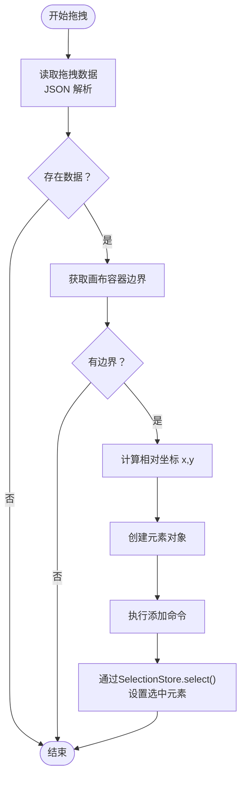
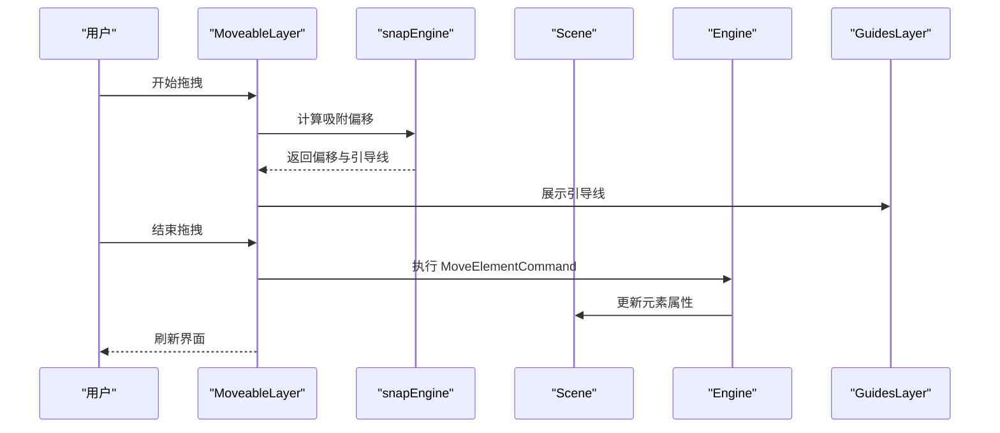
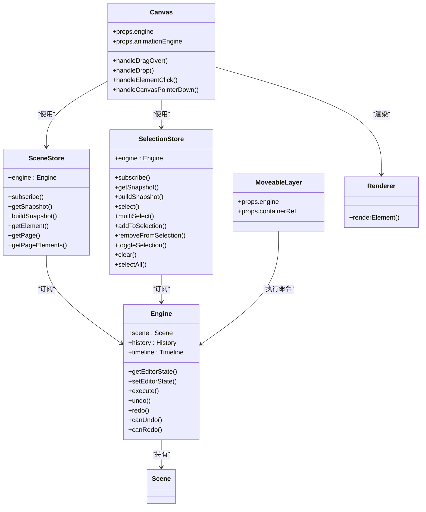

# 画布组件 (Canvas)

<cite>
**本文档引用的文件**
- [Canvas.tsx](file://src/components/Canvas.tsx)
- [engine.ts](file://src/engine/engine.ts)
- [scene.ts](file://src/engine/scene.ts)
- [commands.ts](file://src/engine/commands.ts)
- [index.tsx](file://src/renderer/index.tsx)
- [MoveableLayer.tsx](file://src/components/MoveableLayer.tsx)
- [snapEngine.ts](file://src/engine/snapEngine.ts)
- [GuidesLayer.tsx](file://src/components/GuidesLayer.tsx)
- [App.tsx](file://src/App.tsx)
- [index.ts](file://src/types/index.ts)
- [sceneStore.ts](file://src/store/sceneStore.ts)
- [selectionStore.ts](file://src/store/selectionStore.ts)
- [StoreProvider.tsx](file://src/store/StoreProvider.tsx)
- [hooks.ts](file://src/store/hooks.ts)
- [baseStore.ts](file://src/store/baseStore.ts)
- [main.tsx](file://src/main.tsx)
</cite>

## 更新摘要
**变更内容**
- Canvas组件现在使用SceneStore和SelectionStore进行元素渲染和选择处理
- 替代原有的全局Engine快照访问模式
- 通过React的useSyncExternalStore钩子实现响应式数据流
- StoreProvider提供集中化的状态管理上下文

## 目录
1. [简介](#简介)
2. [项目结构](#项目结构)
3. [核心组件](#核心组件)
4. [架构总览](#架构总览)
5. [详细组件分析](#详细组件分析)
6. [依赖关系分析](#依赖关系分析)
7. [性能考虑](#性能考虑)
8. [故障排除指南](#故障排除指南)
9. [结论](#结论)
10. [附录](#附录)

## 简介
本文件为画布组件（Canvas）的详细技术文档，涵盖其核心功能、接口定义、坐标系统、元素渲染机制、事件处理流程以及拖拽交互的实现细节。重点说明从拖拽放置元素到命令执行的完整流程，并记录画布的样式配置与响应式设计策略。文档同时提供可直接定位到源码位置的路径引用，便于开发者快速查阅与验证。

**更新** Canvas组件现已采用新的Store架构，通过SceneStore和SelectionStore提供响应式的状态管理，替代原有的全局Engine快照访问模式。

## 项目结构
Canvas 组件位于组件层，负责承载页面元素的渲染与交互；其数据模型由新的Store架构管理，包括SceneStore和SelectionStore；命令层通过命令对象实现撤销/重做；渲染层负责将元素以 React 节点形式输出；移动控制层（MoveableLayer）提供拖拽、旋转、缩放等编辑能力；吸附与引导线层（snapEngine 与 GuidesLayer）提供对齐与视觉反馈。

**图表来源**
- [main.tsx:15-20](file://src/main.tsx#L15-L20)
- [StoreProvider.tsx:26-40](file://src/store/StoreProvider.tsx#L26-L40)
- [App.tsx:19-25](file://src/App.tsx#L19-L25)
- [Canvas.tsx:21-24](file://src/components/Canvas.tsx#L21-L24)
- [sceneStore.ts:15-33](file://src/store/sceneStore.ts#L15-L33)
- [selectionStore.ts:12-26](file://src/store/selectionStore.ts#L12-L26)

**章节来源**
- [main.tsx:15-20](file://src/main.tsx#L15-L20)
- [StoreProvider.tsx:26-40](file://src/store/StoreProvider.tsx#L26-L40)
- [Canvas.tsx:21-24](file://src/components/Canvas.tsx#L21-L24)

## 核心组件
- Canvas：承载画布容器、处理拖拽放置、元素点击选择、背景色渲染与 Moveable 控制层挂载。现在通过useStores钩子访问SceneStore和SelectionStore。
- SceneStore：管理场景数据的响应式存储，提供页面、元素、动画等数据的快照访问。
- SelectionStore：管理选中元素状态的响应式存储，提供选择状态的查询和修改方法。
- MoveableLayer：基于 react-moveable 的可选中元素的拖拽、旋转、缩放控制，集成吸附与引导线。
- Renderer：根据元素类型渲染形状、文本、图片等节点，并支持选择框与占位图。
- Engine/Scene/Commands：管理文档、页面、元素与动画数据，提供命令模式的撤销/重做能力。
- snapEngine/GuidesLayer：提供吸附算法与视觉引导线展示。

**更新** 新增Store架构，通过SceneStore和SelectionStore提供响应式状态管理，替代原有的全局Engine快照访问。

**章节来源**
- [Canvas.tsx:15-128](file://src/components/Canvas.tsx#L15-L128)
- [sceneStore.ts:15-58](file://src/store/sceneStore.ts#L15-L58)
- [selectionStore.ts:12-68](file://src/store/selectionStore.ts#L12-L68)
- [MoveableLayer.tsx:8-188](file://src/components/MoveableLayer.tsx#L8-L188)
- [index.tsx:189-202](file://src/renderer/index.tsx#L189-L202)
- [engine.ts:7-49](file://src/engine/engine.ts#L7-L49)
- [scene.ts:3-247](file://src/engine/scene.ts#L3-L247)
- [commands.ts:4-18](file://src/engine/commands.ts#L4-L18)
- [snapEngine.ts:242-258](file://src/engine/snapEngine.ts#L242-L258)
- [GuidesLayer.tsx:19-65](file://src/components/GuidesLayer.tsx#L19-L65)

## 架构总览
Canvas 作为视图层组件，现在通过Store架构依赖引擎层的数据与命令，渲染层负责具体元素的可视化，移动控制层提供交互能力。版本号（version）用于触发重渲染与同步动画状态。

**图表来源**
- [Canvas.tsx:45-69](file://src/components/Canvas.tsx#L45-L69)
- [Canvas.tsx:71-88](file://src/components/Canvas.tsx#L71-L88)
- [sceneStore.ts:15-33](file://src/store/sceneStore.ts#L15-L33)
- [selectionStore.ts:12-26](file://src/store/selectionStore.ts#L12-L26)
- [index.tsx:189-202](file://src/renderer/index.tsx#L189-L202)
- [engine.ts:29-32](file://src/engine/engine.ts#L29-L32)
- [scene.ts:94-106](file://src/engine/scene.ts#L94-L106)
- [MoveableLayer.tsx:44-183](file://src/components/MoveableLayer.tsx#L44-L183)
- [snapEngine.ts:242-258](file://src/engine/snapEngine.ts#L242-L258)
- [GuidesLayer.tsx:19-65](file://src/components/GuidesLayer.tsx#L19-L65)

## 详细组件分析

### Canvas 组件接口与职责
- Props 接口
  - engine: 引擎实例，提供场景访问、命令执行与历史管理。
  - animationEngine: 动画引擎实例，用于在编辑态下限定动画作用域。
- 核心职责
  - 处理拖拽放置：计算坐标、创建元素、执行添加命令、更新选中状态。
  - 元素点击选择：通过SelectionStore更新编辑器状态中的选中元素ID。
  - 画布背景设置：读取当前页面背景色并渲染容器背景。
  - 渲染元素：通过SceneStore获取元素列表，调用渲染器输出节点。
  - 挂载移动控制层：提供拖拽、旋转、缩放与吸附能力。

**更新** 现在通过useStores钩子访问SceneStore和SelectionStore，替代原有的直接引擎访问。

**章节来源**
- [Canvas.tsx:16-19](file://src/components/Canvas.tsx#L16-L19)
- [Canvas.tsx:21-24](file://src/components/Canvas.tsx#L21-L24)
- [Canvas.tsx:36-38](file://src/components/Canvas.tsx#L36-L38)

### Store架构与响应式数据流
- SceneStore
  - 通过EngineStore基类实现响应式订阅，监听scene主题变化。
  - 提供buildSnapshot方法构建场景快照，包含文档、页面、元素等数据。
  - 提供getElement、getPage等查询方法，简化数据访问。
- SelectionStore
  - 通过EngineStore基类实现响应式订阅，监听editorState主题变化。
  - 提供select、multiSelect、addToSelection等选择操作方法。
  - 提供hasSelection、isSingleSelection等状态查询方法。
- 响应式钩子
  - useSceneStore和useSelectionStore通过useSyncExternalStore实现订阅。
  - 自动处理订阅注册、取消和快照缓存。

**新增** Store架构提供了更清晰的状态管理，通过响应式订阅实现组件自动更新。

**章节来源**
- [sceneStore.ts:15-58](file://src/store/sceneStore.ts#L15-L58)
- [selectionStore.ts:12-68](file://src/store/selectionStore.ts#L12-L68)
- [hooks.ts:9-15](file://src/store/hooks.ts#L9-L15)
- [baseStore.ts:39-50](file://src/store/baseStore.ts#L39-L50)

### 坐标系统与渲染机制
- 画布坐标系
  - 画布容器尺寸固定为 960x540，采用绝对定位布局。
  - 鼠标坐标通过 clientX/Y 减去容器边界矩形左上角偏移，得到元素放置的相对坐标。
- 元素渲染
  - 通过SceneStore.getSnapshot()获取元素列表，渲染器根据元素类型分别生成 SVG 形状、文本容器或图片节点。
  - 通过 CSS transform 实现旋转，通过绝对定位实现平移与尺寸控制。
  - 通过SelectionStore.getSnapshot()获取选中状态，通过外层边框高亮显示。
- 事件处理
  - 元素节点绑定点击事件，阻止冒泡后调用Canvas的点击处理器。
  - 画布容器绑定指针按下事件，若点击空白区域则通过SelectionStore.clear()清空选中。

**更新** 渲染机制现在完全基于Store提供的快照数据，通过useSceneStore和useSelectionStore钩子实现响应式更新。

**章节来源**
- [Canvas.tsx:58-62](file://src/components/Canvas.tsx#L58-L62)
- [Canvas.tsx:116-121](file://src/components/Canvas.tsx#L116-L121)
- [Canvas.tsx:71-88](file://src/components/Canvas.tsx#L71-L88)

### 拖拽交互实现细节
- handleDragOver
  - 设置 dropEffect 为 copy，允许放置。
- handleDrop
  - 从拖拽数据中解析元素类型与形状类型。
  - 计算相对画布坐标，创建元素对象。
  - 执行添加命令，通过SelectionStore.select()更新选中状态。
- 元素创建流程
  - 根据类型分支创建不同元素对象，填充默认尺寸与样式。
  - 生成唯一 ID 并返回给命令执行器。

**图表来源**
- [Canvas.tsx:45-69](file://src/components/Canvas.tsx#L45-L69)
- [Canvas.tsx:128-188](file://src/components/Canvas.tsx#L128-L188)

**章节来源**
- [Canvas.tsx:45-69](file://src/components/Canvas.tsx#L45-L69)
- [Canvas.tsx:128-188](file://src/components/Canvas.tsx#L128-L188)

### 元素点击选择与画布空白处点击
- handleElementClick
  - 通过SelectionStore.select()将选中元素ID写入编辑器状态。
- handleCanvasPointerDown
  - 若点击目标不在元素或控制框上，则通过SelectionStore.clear()清空选中集合。

**更新** 选择逻辑现在通过SelectionStore的响应式方法实现，替代原有的直接引擎状态修改。

**章节来源**
- [Canvas.tsx:71-88](file://src/components/Canvas.tsx#L71-L88)

### 移动控制层与吸附机制
- MoveableLayer
  - 监听选中元素变化，动态更新目标节点并同步边界。
  - 支持拖拽、旋转、缩放事件，结合 snapEngine 计算吸附偏移。
  - 在拖拽/旋转/缩放结束时，执行 MoveElementCommand 更新场景数据。
- snapEngine
  - 提供边缘对齐、中心对齐与等间距吸附三种优先级。
  - 返回吸附偏移与引导线信息，MoveableLayer 应用到 DOM 并展示 GuidesLayer。
- GuidesLayer
  - 根据引导线类型与种类绘制水平/垂直引导线，颜色区分对齐方式。

**图表来源**
- [MoveableLayer.tsx:44-183](file://src/components/MoveableLayer.tsx#L44-L183)
- [snapEngine.ts:242-258](file://src/engine/snapEngine.ts#L242-L258)
- [GuidesLayer.tsx:19-65](file://src/components/GuidesLayer.tsx#L19-L65)

**章节来源**
- [MoveableLayer.tsx:15-188](file://src/components/MoveableLayer.tsx#L15-L188)
- [snapEngine.ts:35-258](file://src/engine/snapEngine.ts#L35-L258)
- [GuidesLayer.tsx:19-65](file://src/components/GuidesLayer.tsx#L19-L65)

### 命令执行与撤销/重做
- AddElementCommand
  - 执行：向当前页面添加元素。
  - 撤销：删除该元素。
- MoveElementCommand
  - 执行：更新元素的 x/y/width/height/rotation 等属性。
  - 撤销：回滚到变更前的状态。
- Engine
  - 提供 execute、undo、redo、canUndo、canRedo 等方法，维护历史栈。

**章节来源**
- [commands.ts:4-18](file://src/engine/commands.ts#L4-L18)
- [commands.ts:20-44](file://src/engine/commands.ts#L20-L44)
- [engine.ts:29-48](file://src/engine/engine.ts#L29-L48)

### 类型与数据模型
- 元素类型
  - BaseElement：通用字段（位置、尺寸、旋转、透明度、可见性、父子关系）。
  - ShapeElement、TextElement、ImageElement、GroupElement：扩展字段与约束。
- 文档与页面
  - Document：包含页面集合、节点集合、结构项与当前页ID。
  - Page：包含背景色、元素映射、动画映射。
- 编辑器状态
  - EditorState：选中元素ID数组、视口、工具模式、悬停元素ID。

**章节来源**
- [index.ts:12-54](file://src/types/index.ts#L12-L54)
- [index.ts:69-84](file://src/types/index.ts#L69-L84)
- [index.ts:144-158](file://src/types/index.ts#L144-L158)

## 依赖关系分析

**图表来源**
- [engine.ts:7-49](file://src/engine/engine.ts#L7-L49)
- [sceneStore.ts:15-58](file://src/store/sceneStore.ts#L15-L58)
- [selectionStore.ts:12-68](file://src/store/selectionStore.ts#L12-L68)
- [Canvas.tsx:21-24](file://src/components/Canvas.tsx#L21-L24)
- [MoveableLayer.tsx:15-188](file://src/components/MoveableLayer.tsx#L15-L188)
- [index.tsx:189-202](file://src/renderer/index.tsx#L189-L202)

**章节来源**
- [engine.ts:7-49](file://src/engine/engine.ts#L7-L49)
- [sceneStore.ts:15-58](file://src/store/sceneStore.ts#L15-L58)
- [selectionStore.ts:12-68](file://src/store/selectionStore.ts#L12-L68)
- [Canvas.tsx:21-24](file://src/components/Canvas.tsx#L21-L24)
- [MoveableLayer.tsx:15-188](file://src/components/MoveableLayer.tsx#L15-L188)
- [index.tsx:189-202](file://src/renderer/index.tsx#L189-L202)

## 性能考虑
- 渲染优化
  - 通过useSyncExternalStore钩子实现细粒度的响应式更新，只在相关数据变化时重新渲染。
  - SceneStore和SelectionStore使用快照缓存，避免重复计算。
- 事件处理
  - 事件回调使用 useCallback 缓存，降低子组件重渲染频率。
- DOM 查询
  - MoveableLayer 仅查询选中元素对应的 DOM 节点，避免全局扫描。
- 动画作用域
  - 在编辑态限定动画作用域，避免影响非目标元素。

**更新** 新的Store架构提供了更好的性能表现，通过细粒度的订阅机制和快照缓存减少了不必要的重渲染。

## 故障排除指南
- 拖拽放置无效
  - 检查拖拽数据是否为合法 JSON，且包含类型与形状类型。
  - 确认画布容器存在边界矩形，否则无法计算相对坐标。
- 选中状态异常
  - 确保元素节点包含 data-element-id 属性，点击事件需阻止冒泡。
  - 画布空白处点击应通过SelectionStore.clear()清空选中集合。
- 移动控制不可用
  - 确认选中元素已正确映射到 Moveable 的 target。
  - 检查 snapEngine 是否返回有效偏移，引导线是否正确渲染。
- 动画播放异常
  - 确认 animationEngine 的作用域根节点已设置到画布容器。
- Store访问错误
  - 确保Canvas组件在StoreProvider上下文中使用。
  - 检查useStores钩子是否正确调用。

**更新** 新增Store相关的故障排除指南，包括上下文访问和状态管理问题。

**章节来源**
- [Canvas.tsx:45-69](file://src/components/Canvas.tsx#L45-L69)
- [Canvas.tsx:71-88](file://src/components/Canvas.tsx#L71-L88)
- [MoveableLayer.tsx:24-35](file://src/components/MoveableLayer.tsx#L24-L35)
- [snapEngine.ts:242-258](file://src/engine/snapEngine.ts#L242-L258)
- [GuidesLayer.tsx:19-65](file://src/components/GuidesLayer.tsx#L19-L65)
- [Canvas.tsx:27-32](file://src/components/Canvas.tsx#L27-L32)
- [StoreProvider.tsx:42-48](file://src/store/StoreProvider.tsx#L42-L48)

## 结论
Canvas 组件通过新的Store架构实现了拖拽放置、元素选择、渲染与交互控制。新的SceneStore和SelectionStore提供了响应式的状态管理，替代原有的全局Engine快照访问模式，提升了代码的可维护性和性能。借助命令模式与历史管理，系统具备良好的可撤销/重做能力；通过吸附与引导线提升了编辑体验。整体设计遵循关注点分离原则，便于扩展与维护。

**更新** 新的Store架构显著改进了状态管理的清晰度和性能表现，为后续功能扩展奠定了坚实基础。

## 附录

### 使用场景与最佳实践
- 拖拽放置元素
  - 从组件面板拖拽到画布，自动创建元素并选中。
  - 可在放置后立即进行移动、旋转或缩放操作。
- 画布背景设置
  - 页面背景色来自SceneStore提供的快照数据，Canvas 渲染容器背景色。
- 响应式设计
  - 画布容器固定尺寸，外部容器通过 Flex 布局自适应窗口。
  - 动画作用域限定在画布容器内，确保编辑态下的动画行为一致。
- Store使用最佳实践
  - 在组件中通过useStores钩子访问多个Store实例。
  - 使用useSceneStore和useSelectionStore钩子获取最新快照。
  - 避免在组件内部直接访问Store实例的方法，通过钩子获取数据。

**更新** 新增Store架构的使用指南和最佳实践。

**章节来源**
- [Canvas.tsx:106-127](file://src/components/Canvas.tsx#L106-L127)
- [App.tsx:28-36](file://src/App.tsx#L28-L36)
- [StoreProvider.tsx:26-40](file://src/store/StoreProvider.tsx#L26-L40)
- [hooks.ts:9-15](file://src/store/hooks.ts#L9-L15)