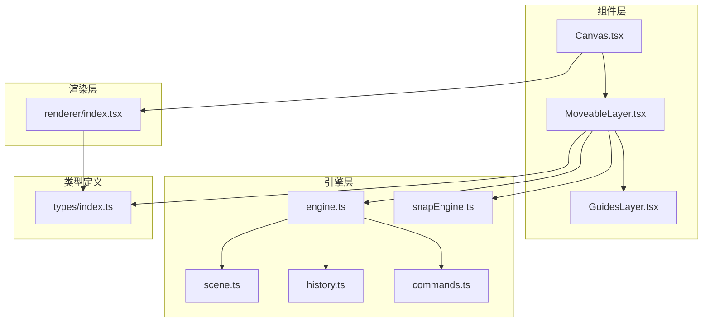
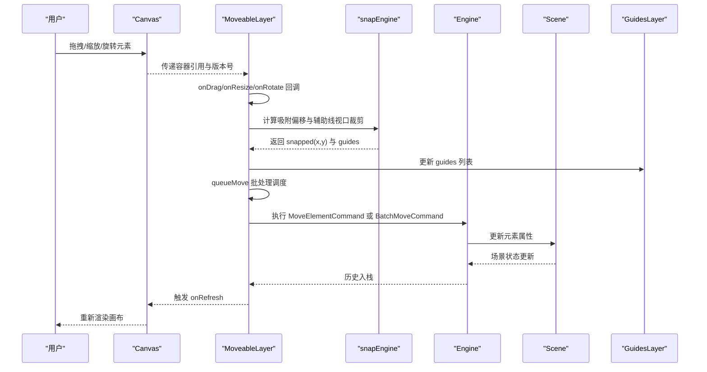
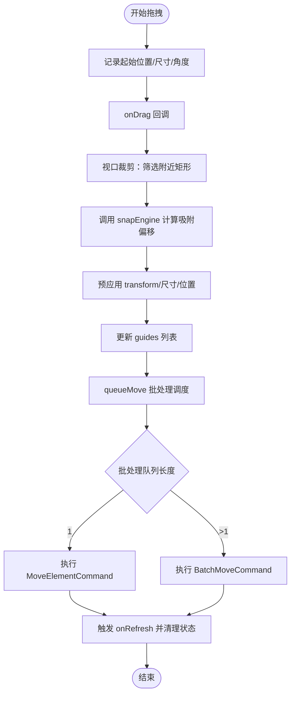
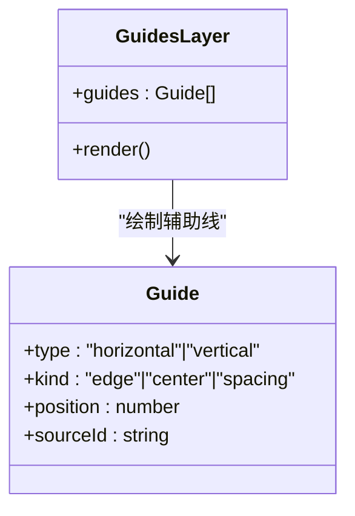
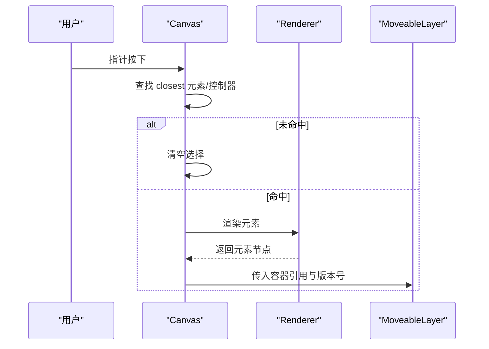
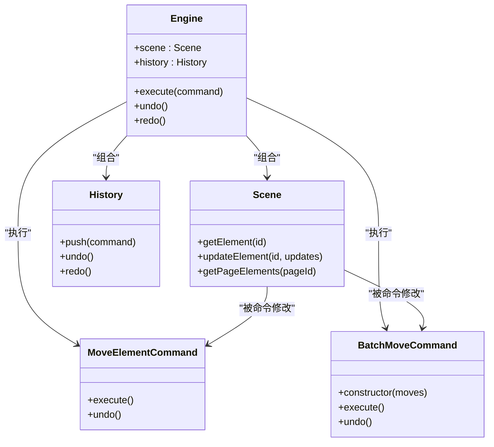
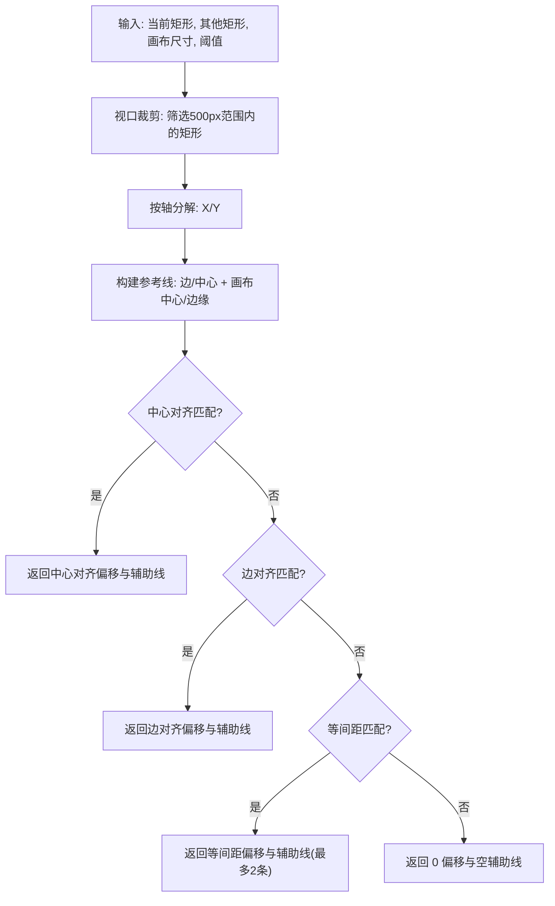
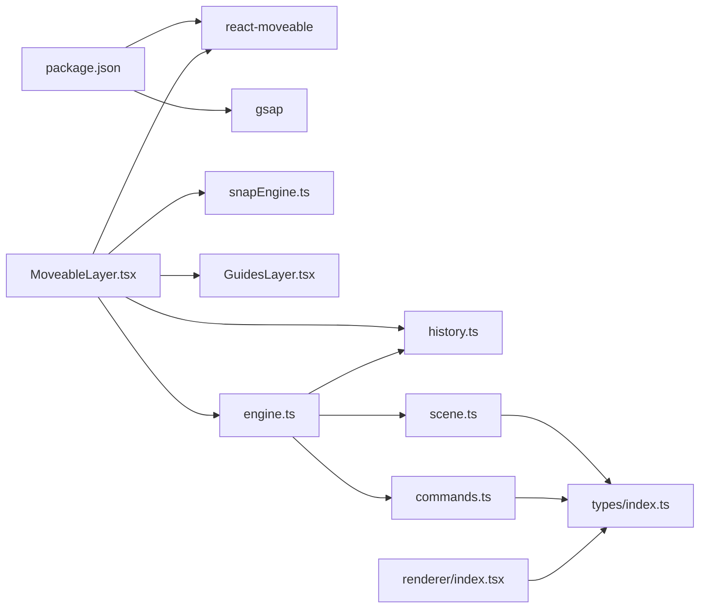

# 移动控制层 (MoveableLayer)

<cite>
**本文引用的文件**
- [MoveableLayer.tsx](file://src/components/MoveableLayer.tsx)
- [Canvas.tsx](file://src/components/Canvas.tsx)
- [GuidesLayer.tsx](file://src/components/GuidesLayer.tsx)
- [engine.ts](file://src/engine/engine.ts)
- [scene.ts](file://src/engine/scene.ts)
- [commands.ts](file://src/engine/commands.ts)
- [history.ts](file://src/engine/history.ts)
- [snapEngine.ts](file://src/engine/snapEngine.ts)
- [useEngineSnapshot.ts](file://src/hooks/useEngineSnapshot.ts)
- [index.tsx](file://src/renderer/index.tsx)
- [index.ts](file://src/types/index.ts)
- [package.json](file://package.json)
</cite>

## 目录
1. [简介](#简介)
2. [项目结构](#项目结构)
3. [核心组件](#核心组件)
4. [架构总览](#架构总览)
5. [详细组件分析](#详细组件分析)
6. [依赖关系分析](#依赖关系分析)
7. [性能考量](#性能考量)
8. [故障排查指南](#故障排查指南)
9. [结论](#结论)
10. [附录](#附录)

## 简介
本文件为移动控制层组件（MoveableLayer）的全面技术文档，聚焦以下目标：
- 详述 MoveableLayer 的功能：元素拖拽、缩放、旋转等变换控制
- 记录 react-moveable 库的集成与配置（控制点显示与交互）
- 解释元素变换的实时反馈机制（边界检测与约束处理）
- 多选元素的批量变换与对齐辅助线（GuidesLayer）
- 变换命令生成与历史记录机制
- 变换精度与性能优化的实现细节
- 与 Canvas 组件的坐标转换与事件处理

## 项目结构
移动控制层位于组件层，与引擎层、渲染层协同工作，形成"选择-控制-执行-回显"的闭环。

图表来源
- [Canvas.tsx:1-191](file://src/components/Canvas.tsx#L1-L191)
- [MoveableLayer.tsx:1-211](file://src/components/MoveableLayer.tsx#L1-L211)
- [GuidesLayer.tsx:1-66](file://src/components/GuidesLayer.tsx#L1-L66)
- [engine.ts:1-54](file://src/engine/engine.ts#L1-L54)
- [scene.ts:1-273](file://src/engine/scene.ts#L1-L273)
- [history.ts:1-45](file://src/engine/history.ts#L1-L45)
- [commands.ts:1-312](file://src/engine/commands.ts#L1-L312)
- [snapEngine.ts:1-259](file://src/engine/snapEngine.ts#L1-L259)
- [useEngineSnapshot.ts:1-13](file://src/hooks/useEngineSnapshot.ts#L1-L13)
- [index.tsx:1-314](file://src/renderer/index.tsx#L1-L314)
- [index.ts:1-159](file://src/types/index.ts#L1-L159)

章节来源
- [Canvas.tsx:1-191](file://src/components/Canvas.tsx#L1-L191)
- [MoveableLayer.tsx:1-211](file://src/components/MoveableLayer.tsx#L1-L211)
- [engine.ts:1-54](file://src/engine/engine.ts#L1-L54)

## 核心组件
- MoveableLayer：基于 react-moveable 的可编辑控制层，负责拖拽、缩放、旋转的实时反馈与最终命令提交；集成 snapEngine 实现吸附与对齐辅助线；支持批处理优化的多元素变换。
- Canvas：承载页面画布与元素渲染，负责点击取消选择、拖放新增元素、事件穿透到 Moveable 控制器。
- GuidesLayer：在 Canvas 上绘制吸附/对齐辅助线，区分边对齐、中心对齐、等间距三种类型。
- Engine/Scene/History/Commands：引擎与命令系统，统一管理场景数据、命令执行与撤销重做。
- Renderer：元素渲染器，提供元素的视觉呈现与选择框。
- Types：统一的数据模型与命令接口定义。

章节来源
- [MoveableLayer.tsx:1-211](file://src/components/MoveableLayer.tsx#L1-L211)
- [GuidesLayer.tsx:1-66](file://src/components/GuidesLayer.tsx#L1-L66)
- [engine.ts:1-54](file://src/engine/engine.ts#L1-L54)
- [scene.ts:1-273](file://src/engine/scene.ts#L1-L273)
- [history.ts:1-45](file://src/engine/history.ts#L1-L45)
- [commands.ts:1-312](file://src/engine/commands.ts#L1-L312)
- [index.tsx:1-314](file://src/renderer/index.tsx#L1-L314)
- [index.ts:1-159](file://src/types/index.ts#L1-L159)

## 架构总览
移动控制层通过 React 组件与引擎层解耦，使用命令模式将用户交互转化为可撤销的历史记录。吸附与对齐由独立的 snapEngine 提供，保证变换精度与视觉反馈一致。新增的批处理机制显著提升了多元素变换的性能表现。

图表来源
- [MoveableLayer.tsx:54-68](file://src/components/MoveableLayer.tsx#L54-L68)
- [MoveableLayer.tsx:120-141](file://src/components/MoveableLayer.tsx#L120-L141)
- [MoveableLayer.tsx:154-159](file://src/components/MoveableLayer.tsx#L154-L159)
- [MoveableLayer.tsx:179-205](file://src/components/MoveableLayer.tsx#L179-L205)
- [snapEngine.ts:242-259](file://src/engine/snapEngine.ts#L242-L259)
- [engine.ts:29-32](file://src/engine/engine.ts#L29-L32)
- [scene.ts:108-135](file://src/engine/scene.ts#L108-L135)
- [GuidesLayer.tsx:19-65](file://src/components/GuidesLayer.tsx#L19-L65)

## 详细组件分析

### MoveableLayer 组件
- 功能职责
  - 将选中元素映射为 react-moveable 的 target，启用拖拽、旋转、缩放能力
  - 在拖拽/缩放/旋转过程中，实时计算吸附偏移与对齐辅助线，并通过 GuidesLayer 渲染
  - 在结束时提交 MoveElementCommand 或 BatchMoveCommand，写入场景并触发刷新
- 关键交互
  - onDragStart/onDrag/onDragEnd：记录起始位置，计算吸附偏移，预应用最终位置以避免视觉跳变，提交命令
  - onRotateStart/onRotate/onRotateEnd：记录起始角度，实时应用 transform，结束时提交命令
  - onResizeStart/onResize/onResizeEnd：记录起始尺寸与位移，预应用最终宽高与位移，提交命令
- 吸附与对齐
  - 使用 snapEngine 计算当前矩形与其他矩形的边/中心对齐与等间距对齐，返回 guides
  - 通过 ref 存储每次变换的起始状态，确保吸附与命令提交的一致性
- 版本同步
  - 通过 version prop 驱动 useEffect 调用 updateRect，使 Moveable 与引擎状态保持一致
- **批处理优化**：新增 queueMove 函数，使用微任务队列合并多个变换操作，提升多元素变换性能

图表来源
- [MoveableLayer.tsx:54-68](file://src/components/MoveableLayer.tsx#L54-L68)
- [MoveableLayer.tsx:93-101](file://src/components/MoveableLayer.tsx#L93-L101)
- [MoveableLayer.tsx:120-141](file://src/components/MoveableLayer.tsx#L120-L141)
- [MoveableLayer.tsx:179-205](file://src/components/MoveableLayer.tsx#L179-L205)

章节来源
- [MoveableLayer.tsx:15-35](file://src/components/MoveableLayer.tsx#L15-L35)
- [MoveableLayer.tsx:44-211](file://src/components/MoveableLayer.tsx#L44-L211)

### GuidesLayer 组件
- 功能职责
  - 根据 guides 数组绘制水平/垂直辅助线，区分边对齐、中心对齐、等间距三类
  - 使用半透明颜色编码不同 kind，便于视觉识别
- 渲染策略
  - 无 guides 时不渲染任何元素
  - 通过绝对定位覆盖画布，禁用指针事件，避免干扰底层交互

图表来源
- [GuidesLayer.tsx:19-65](file://src/components/GuidesLayer.tsx#L19-L65)
- [index.ts:90-101](file://src/types/index.ts#L90-L101)

章节来源
- [GuidesLayer.tsx:1-66](file://src/components/GuidesLayer.tsx#L1-L66)
- [index.ts:90-101](file://src/types/index.ts#L90-L101)

### Canvas 组件
- 功能职责
  - 承载页面画布，渲染所有元素
  - 处理画布级事件：拖放新增元素、点击空白处取消选择
  - 作为 MoveableLayer 的容器，向其传递容器引用与版本号
- 事件处理
  - onPointerDown：若点击目标不在元素或控制器上，则清空选择
  - onDrop：解析拖入数据，创建元素并提交 AddElementCommand

图表来源
- [Canvas.tsx:79-90](file://src/components/Canvas.tsx#L79-L90)
- [Canvas.tsx:118-124](file://src/components/Canvas.tsx#L118-L124)
- [index.tsx:189-202](file://src/renderer/index.tsx#L189-L202)

章节来源
- [Canvas.tsx:22-128](file://src/components/Canvas.tsx#L22-L128)
- [index.tsx:189-202](file://src/renderer/index.tsx#L189-L202)

### 引擎与命令系统
- Engine：持有 Scene、History、Timeline，提供执行命令、撤销重做、查询状态的能力
- Scene：管理文档、页面、元素、动画等数据，提供增删改查与父子关系维护
- History：维护撤销/重做栈，支持清空与状态查询
- MoveElementCommand：记录元素变换前的状态，执行时更新元素属性，undo 时回滚
- **BatchMoveCommand**：**新增** 批量移动命令，支持同时更新多个元素的状态，显著提升多元素变换性能

图表来源
- [engine.ts:7-49](file://src/engine/engine.ts#L7-L49)
- [scene.ts:108-135](file://src/engine/scene.ts#L108-L135)
- [history.ts:3-44](file://src/engine/history.ts#L3-L44)
- [commands.ts:20-44](file://src/engine/commands.ts#L20-L44)
- [commands.ts:70-100](file://src/engine/commands.ts#L70-L100)

章节来源
- [engine.ts:1-54](file://src/engine/engine.ts#L1-L54)
- [scene.ts:1-273](file://src/engine/scene.ts#L1-L273)
- [history.ts:1-45](file://src/engine/history.ts#L1-L45)
- [commands.ts:1-312](file://src/engine/commands.ts#L1-L312)

### 吸附与对齐算法（snapEngine）
- 输入输出
  - 输入：当前矩形、其他矩形集合、画布尺寸、吸附阈值
  - 输出：新的 x/y 与 guides
- 策略优先级
  - 中心对齐（优先级1）
  - 边对齐（优先级2）
  - 等间距（分布/延续，优先级3）
- 辅助线类型
  - kind：edge/center/spacing
  - type：horizontal/vertical
- **性能优化**
  - **视口裁剪**：只对距离在500px范围内的矩形进行吸附计算，大幅减少计算量
  - 对于等间距检查，按轴排序后 O(n) 遍历相邻矩形
  - dedupSnapLines 去重，限制最多两条辅助线

图表来源
- [snapEngine.ts:158-240](file://src/engine/snapEngine.ts#L158-L240)
- [snapEngine.ts:242-259](file://src/engine/snapEngine.ts#L242-L259)
- [index.ts:90-101](file://src/types/index.ts#L90-L101)

章节来源
- [snapEngine.ts:1-259](file://src/engine/snapEngine.ts#L1-L259)
- [index.ts:90-101](file://src/types/index.ts#L90-L101)

### 与 Canvas 的坐标转换与事件处理
- 坐标转换
  - Canvas 使用绝对定位的 960×540 容器，元素渲染样式包含 left/top/transform
  - MoveableLayer 通过容器引用查询 DOM，将引擎中的元素映射为 DOM 节点进行控制
- 事件处理
  - Canvas 在指针按下时查找 closest 元素或控制器，若均不命中则清空选择
  - MoveableLayer 在拖拽/缩放/旋转过程中直接修改 DOM 样式，结束后通过命令系统持久化

章节来源
- [Canvas.tsx:106-127](file://src/components/Canvas.tsx#L106-L127)
- [index.tsx:14-27](file://src/renderer/index.tsx#L14-L27)
- [MoveableLayer.tsx:24-35](file://src/components/MoveableLayer.tsx#L24-L35)

## 依赖关系分析
- 外部依赖
  - react-moveable：提供拖拽/缩放/旋转控制与控制点渲染
  - gsap：动画适配（在动画模块中使用）
- 内部依赖
  - MoveableLayer 依赖 Engine、snapEngine、GuidesLayer、useEngineSnapshot
  - Engine 依赖 Scene、History、Timeline
  - Scene 依赖 types 定义的 Element/Page/Document 结构
  - Renderer 依赖 types 定义的 Element 类型与渲染函数

图表来源
- [package.json:12-19](file://package.json#L12-L19)
- [MoveableLayer.tsx:1-6](file://src/components/MoveableLayer.tsx#L1-L6)
- [engine.ts:1-6](file://src/engine/engine.ts#L1-L6)
- [scene.ts:1](file://src/engine/scene.ts#L1)
- [history.ts:1](file://src/engine/history.ts#L1)
- [commands.ts:1](file://src/engine/commands.ts#L1)
- [index.tsx:1-3](file://src/renderer/index.tsx#L1-L3)
- [index.ts:1](file://src/types/index.ts#L1)
- [useEngineSnapshot.ts:1-13](file://src/hooks/useEngineSnapshot.ts#L1-L13)

章节来源
- [package.json:1-34](file://package.json#L1-L34)
- [MoveableLayer.tsx:1-211](file://src/components/MoveableLayer.tsx#L1-L211)
- [engine.ts:1-54](file://src/engine/engine.ts#L1-L54)

## 性能考量
- **批处理优化**
  - 新增 queueMove 函数，使用微任务队列合并多个变换操作
  - 当队列中只有一个元素时执行 MoveElementCommand，多个元素时执行 BatchMoveCommand
  - 显著减少命令执行次数，提升多元素变换性能
- **空间优化**
  - 视口裁剪：只对距离在500px范围内的矩形进行吸附计算
  - 预计算其他矩形：在 useEffect 中缓存页面所有元素的矩形信息
  - 限制等间距辅助线数量：最多返回2条辅助线
- **DOM 更新**
  - 在拖拽/缩放/旋转过程中仅修改 transform/left/top/style，避免频繁重排
  - 结束时一次性提交命令，降低多次渲染成本
- **版本同步**
  - 通过 useEngineSnapshot 钩子驱动 updateRect，避免不必要的重绘
- **内存优化**
  - 使用 useRef 缓存吸附结果和起始状态，避免重复计算
  - 批处理队列在微任务完成后自动清理

**更新** 新增批处理能力和空间优化机制，显著提升多元素变换性能

章节来源
- [MoveableLayer.tsx:54-68](file://src/components/MoveableLayer.tsx#L54-L68)
- [MoveableLayer.tsx:93-101](file://src/components/MoveableLayer.tsx#L93-L101)
- [MoveableLayer.tsx:31-33](file://src/components/MoveableLayer.tsx#L31-L33)
- [commands.ts:70-100](file://src/engine/commands.ts#L70-L100)
- [snapEngine.ts:77-156](file://src/engine/snapEngine.ts#L77-L156)
- [useEngineSnapshot.ts:4-12](file://src/hooks/useEngineSnapshot.ts#L4-L12)

## 故障排查指南
- 无法拖拽/缩放/旋转
  - 检查是否正确设置 target：当 selectedElementIds 为空或 DOM 查询不到元素时，target 为 null
  - 确认容器引用 containerRef 正确传递给 MoveableLayer
- 辅助线不显示
  - 确保 onDrag 回调中正确更新 guides，并在 onDragEnd 清空
  - 检查 GuidesLayer 是否接收到了非空的 guides 数组
- 变换后位置不准确
  - 确认 onDragEnd 使用 snapped 位置而非 lastEvent 的 left/top
  - 检查 snapEngine 的阈值与参考对象集合
- 撤销/重做无效
  - 确认执行了 engine.execute(command) 并将命令入栈
  - 检查 MoveElementCommand/BatchMoveCommand 的 before 状态是否正确记录
- **批处理问题**
  - 检查 queueMove 函数是否正确收集变换操作
  - 确认批处理队列在微任务中正确执行
  - 验证 BatchMoveCommand 是否正确处理多个元素的更新

章节来源
- [MoveableLayer.tsx:46-211](file://src/components/MoveableLayer.tsx#L46-L211)
- [GuidesLayer.tsx:19-20](file://src/components/GuidesLayer.tsx#L19-L20)
- [engine.ts:29-32](file://src/engine/engine.ts#L29-L32)
- [commands.ts:20-100](file://src/engine/commands.ts#L20-L100)

## 结论
MoveableLayer 通过 react-moveable 提供直观的元素变换控制，结合 snapEngine 的吸附与对齐算法，实现了高精度的视觉反馈。**新增的批处理机制**显著提升了多元素变换的性能表现，而**空间优化策略**（视口裁剪、预计算缓存）有效减少了计算开销。配合引擎层的命令系统与历史记录，用户可以进行可靠的批量变换与精确控制。Canvas 作为容器与渲染载体，确保了交互与渲染的一致性。整体设计在功能完整性与性能之间取得良好平衡。

## 附录
- 关键流程图与类图已在前述章节中给出，建议结合源码路径进一步查阅具体实现细节。
- **新增功能**：批处理命令（BatchMoveCommand）、视口裁剪优化、微任务队列机制
- **性能提升**：多元素变换性能提升、内存使用优化、计算复杂度降低