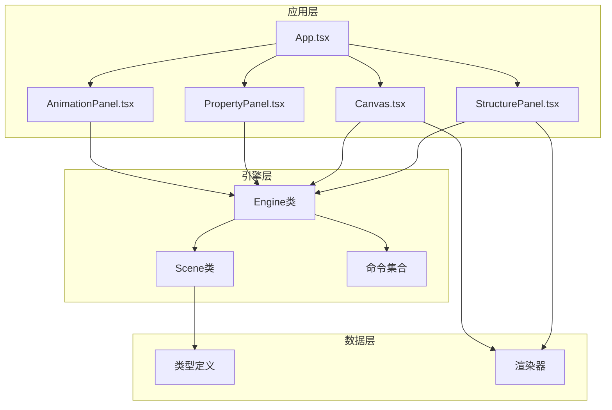
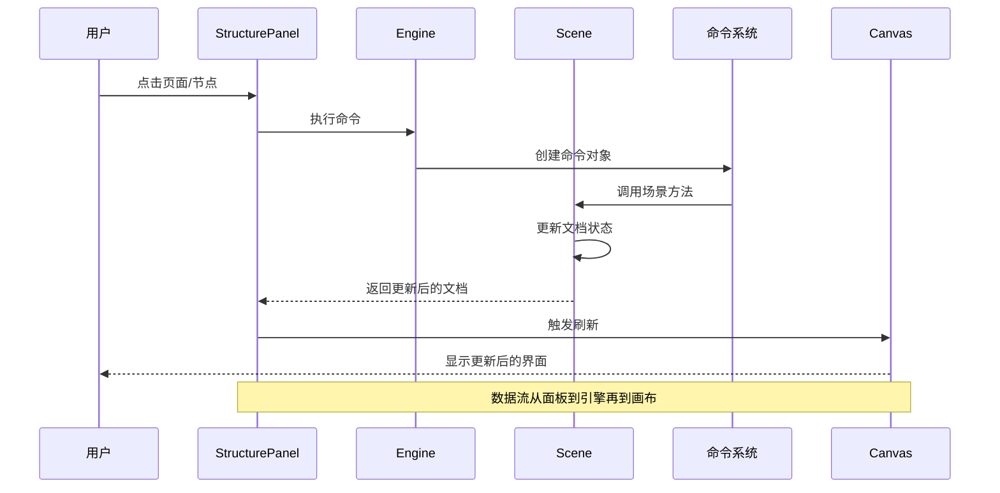
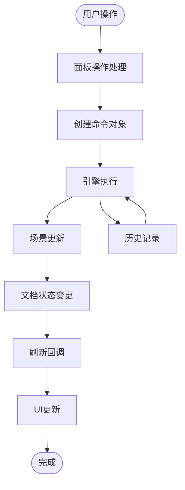
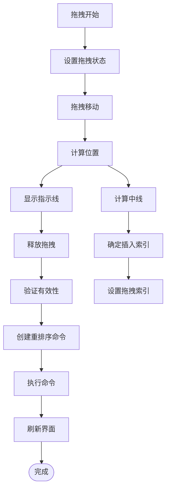
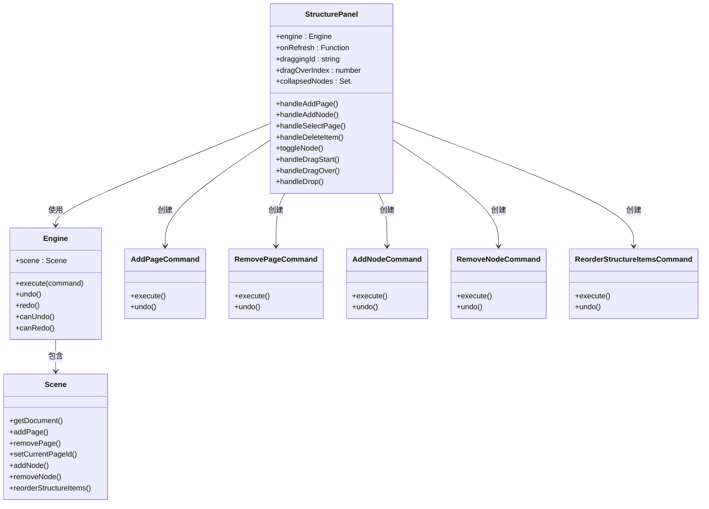

# 结构面板 (StructurePanel)

<cite>
**本文档引用的文件**
- [StructurePanel.tsx](file://src/components/StructurePanel.tsx)
- [engine.ts](file://src/engine/engine.ts)
- [scene.ts](file://src/engine/scene.ts)
- [commands.ts](file://src/engine/commands.ts)
- [Canvas.tsx](file://src/components/Canvas.tsx)
- [App.tsx](file://src/App.tsx)
- [types/index.ts](file://src/types/index.ts)
- [renderer/index.tsx](file://src/renderer/index.tsx)
- [PropertyPanel.tsx](file://src/components/PropertyPanel.tsx)
- [AnimationPanel.tsx](file://src/components/AnimationPanel.tsx)
- [animation/engine.ts](file://src/animation/engine.ts)
</cite>

## 目录
1. [简介](#简介)
2. [项目结构](#项目结构)
3. [核心组件](#核心组件)
4. [架构概览](#架构概览)
5. [详细组件分析](#详细组件分析)
6. [依赖分析](#依赖分析)
7. [性能考虑](#性能考虑)
8. [故障排除指南](#故障排除指南)
9. [结论](#结论)

## 简介

StructurePanel（结构面板）是滑动编辑器中的核心组件之一，负责管理文档的页面和元素结构。该组件提供了完整的页面管理和节点树展示功能，允许用户通过直观的界面操作文档结构，包括页面的增删改查、元素的组织管理以及拖拽排序等高级功能。

该组件采用React函数式组件设计，结合命令模式和引擎系统，实现了响应式的文档结构管理。通过与Canvas组件的紧密协作，StructurePanel确保了页面选择、元素操作和视觉反馈的一致性。

## 项目结构

结构面板位于组件目录中，与引擎系统、渲染器和应用主组件协同工作：

**图表来源**
- [App.tsx:282](file://src/App.tsx#L282)
- [StructurePanel.tsx:32](file://src/components/StructurePanel.tsx#L32)
- [engine.ts:7](file://src/engine/engine.ts#L7)

**章节来源**
- [StructurePanel.tsx:1-400](file://src/components/StructurePanel.tsx#L1-L400)
- [App.tsx:155-340](file://src/App.tsx#L155-L340)

## 核心组件

### StructurePanel 组件

StructurePanel是一个功能完整的结构管理组件，主要特性包括：

#### 主要功能
- **页面管理**：添加、删除页面，切换当前页面
- **节点管理**：添加、删除节点，控制节点展开/折叠
- **拖拽排序**：支持页面和节点的拖拽重新排列
- **缩略图预览**：显示页面内容的缩略图
- **实时状态同步**：与引擎系统保持数据一致性

#### 关键属性
- `engine`: 引擎实例，提供文档操作能力
- `onRefresh`: 刷新回调函数，用于触发UI更新

#### 数据结构
组件使用ProcessedItem接口来处理结构项：
- `index`: 在结构数组中的位置
- `type`: 'node' 或 'page'
- `id`: 唯一标识符
- `visible`: 是否可见
- `indent`: 缩进级别

**章节来源**
- [StructurePanel.tsx:13-31](file://src/components/StructurePanel.tsx#L13-L31)
- [StructurePanel.tsx:18-24](file://src/components/StructurePanel.tsx#L18-L24)

## 架构概览

结构面板采用分层架构设计，确保关注点分离和可维护性：

**图表来源**
- [StructurePanel.tsx:48-91](file://src/components/StructurePanel.tsx#L48-L91)
- [engine.ts:29](file://src/engine/engine.ts#L29)
- [scene.ts:10](file://src/engine/scene.ts#L10)

### 引擎交互流程

结构面板通过引擎系统与底层数据进行交互：

**图表来源**
- [engine.ts:29](file://src/engine/engine.ts#L29)
- [commands.ts:166](file://src/engine/commands.ts#L166)

**章节来源**
- [engine.ts:29-48](file://src/engine/engine.ts#L29-L48)
- [commands.ts:166-188](file://src/engine/commands.ts#L166-L188)

## 详细组件分析

### 页面管理功能

#### 添加页面
用户点击"+ Page"按钮时，组件会：
1. 生成唯一页面ID
2. 计算页面数量并设置名称
3. 创建AddPageCommand命令
4. 通过引擎执行命令
5. 触发onRefresh回调

#### 删除页面
用户点击页面右侧删除按钮时：
1. 获取目标页面在结构数组中的索引
2. 创建RemovePageCommand命令
3. 执行命令并刷新界面

#### 页面选择
点击页面项时：
1. 调用engine.scene.setCurrentPageId()
2. 设置当前页面为选中状态
3. 触发界面刷新

**章节来源**
- [StructurePanel.tsx:48-91](file://src/components/StructurePanel.tsx#L48-L91)
- [scene.ts:46-50](file://src/engine/scene.ts#L46-L50)

### 节点管理功能

#### 节点展开/折叠
节点具有可折叠特性：
- 使用collapsedNodes Set跟踪折叠状态
- 通过toggleNode()方法切换状态
- 折叠状态影响页面项的可见性计算

#### 节点删除
点击节点右侧删除按钮时：
1. 获取节点在结构数组中的索引
2. 创建RemoveNodeCommand命令
3. 执行命令并刷新界面

#### 节点渲染
节点渲染包含：
- 展开/折叠图标
- 节点名称显示
- 删除按钮
- 缩进处理

**章节来源**
- [StructurePanel.tsx:39-46](file://src/components/StructurePanel.tsx#L39-L46)
- [StructurePanel.tsx:257-317](file://src/components/StructurePanel.tsx#L257-L317)

### 拖拽排序机制

结构面板支持完整的拖拽排序功能：

#### 拖拽开始
- 设置draggingId为被拖拽项ID
- 计算拖拽偏移量
- 标记拖拽状态

#### 拖拽过程
- 监听dragOver事件
- 计算拖拽位置的中线
- 设置dragOverIndex为插入位置
- 显示拖拽指示线

#### 拖拽结束
- 验证拖拽有效性
- 查找原始索引和目标索引
- 创建ReorderStructureItemsCommand命令
- 执行命令并刷新界面

**图表来源**
- [StructurePanel.tsx:93-145](file://src/components/StructurePanel.tsx#L93-L145)

**章节来源**
- [StructurePanel.tsx:93-145](file://src/components/StructurePanel.tsx#L93-L145)

### 节点树渲染逻辑

组件实现了智能的节点树渲染算法：

#### 结构项预处理
遍历doc.structureItems数组，为每个项计算：
- 可见性：折叠节点不显示其子页面
- 缩进：页面相对于其父节点的缩进
- 类型：区分页面和节点

#### 渲染策略
- 页面项：显示缩略图和名称
- 节点项：显示展开/折叠图标和名称
- 选中状态：高亮显示当前页面
- 拖拽状态：半透明效果

**章节来源**
- [StructurePanel.tsx:147-167](file://src/components/StructurePanel.tsx#L147-L167)
- [StructurePanel.tsx:223-386](file://src/components/StructurePanel.tsx#L223-L386)

### 与Canvas组件的联动

结构面板与Canvas组件通过以下方式协同工作：

#### 页面切换联动
- 结构面板选择新页面时，Canvas显示对应页面内容
- Canvas根据当前页面ID渲染元素

#### 数据同步机制
- 通过engine.scene.getDocument()获取最新文档状态
- 使用onRefresh回调触发界面更新
- 确保结构面板和画布显示一致的数据

#### 缩略图渲染
- Canvas使用renderThumbnail()渲染页面缩略图
- 缩略图尺寸：160x90像素
- 按比例缩放960x540画布内容

**章节来源**
- [Canvas.tsx:34-37](file://src/components/Canvas.tsx#L34-L37)
- [renderer/index.tsx:300-313](file://src/renderer/index.tsx#L300-L313)

### API接口说明

#### 组件属性
| 属性名 | 类型 | 必需 | 描述 |
|--------|------|------|------|
| engine | Engine | 是 | 引擎实例，提供文档操作能力 |
| onRefresh | () => void | 是 | 刷新回调函数 |

#### 事件回调
- `onRefresh`: 当文档状态改变时触发UI刷新

#### 内部方法
- `handleAddPage()`: 添加新页面
- `handleAddNode()`: 添加新节点
- `handleSelectPage(pageId)`: 选择页面
- `handleDeleteItem(index)`: 删除结构项
- `toggleNode(nodeId)`: 切换节点展开状态

**章节来源**
- [StructurePanel.tsx:13-16](file://src/components/StructurePanel.tsx#L13-L16)
- [StructurePanel.tsx:48-91](file://src/components/StructurePanel.tsx#L48-L91)

## 依赖分析

### 组件间依赖关系

**图表来源**
- [StructurePanel.tsx:32](file://src/components/StructurePanel.tsx#L32)
- [engine.ts:7](file://src/engine/engine.ts#L7)
- [scene.ts:3](file://src/engine/scene.ts#L3)
- [commands.ts:166](file://src/engine/commands.ts#L166)

### 外部依赖

#### React生态系统
- React Hooks：useState, useCallback, useRef
- React DragEvent：处理拖拽事件
- React Node：DOM节点操作

#### 第三方库
- @dnd-kit/core：拖拽排序功能
- @dnd-kit/sortable：可排序列表
- @dnd-kit/utilities：拖拽工具函数

**章节来源**
- [StructurePanel.tsx:1](file://src/components/StructurePanel.tsx#L1)
- [AnimationPanel.tsx:20](file://src/components/AnimationPanel.tsx#L20)

## 性能考虑

### 渲染优化
- **虚拟滚动**：对于大量页面和节点的情况，可以考虑实现虚拟滚动
- **状态最小化**：仅在必要时更新状态，避免不必要的重渲染
- **事件防抖**：拖拽事件处理使用useCallback优化

### 内存管理
- **Set数据结构**：使用Set存储折叠状态，提供O(1)查找性能
- **引用优化**：使用useRef存储拖拽偏移量，避免重复计算
- **事件清理**：组件卸载时自动清理事件监听器

### 数据结构选择
- **结构数组**：使用数组存储结构项，支持快速随机访问
- **映射表**：页面和节点使用对象映射，提供O(1)查找
- **不可变更新**：命令模式确保状态变更的可预测性

## 故障排除指南

### 常见问题及解决方案

#### 页面无法删除
**症状**：点击删除按钮无反应
**可能原因**：
- 结构数组索引计算错误
- 命令执行失败
- 文档状态未更新

**解决步骤**：
1. 检查handleDeleteItem()中的索引查找逻辑
2. 验证RemovePageCommand或RemoveNodeCommand的构造参数
3. 确认engine.execute()调用成功

#### 拖拽排序异常
**症状**：拖拽后顺序错误或位置不对
**可能原因**：
- dragOverIndex计算错误
- 插入位置判断逻辑问题
- 命令执行时机不当

**解决步骤**：
1. 检查handleDragOver()中的中线计算
2. 验证handleDrop()中的索引调整逻辑
3. 确认ReorderStructureItemsCommand的参数正确

#### 页面缩略图显示异常
**症状**：页面缩略图不显示或显示错误
**可能原因**：
- renderThumbnail()函数问题
- 元素渲染配置错误
- 缩放比例计算错误

**解决步骤**：
1. 检查renderThumbnail()函数的元素类型判断
2. 验证缩略图尺寸常量定义
3. 确认transform缩放计算

**章节来源**
- [StructurePanel.tsx:82-91](file://src/components/StructurePanel.tsx#L82-L91)
- [StructurePanel.tsx:100-145](file://src/components/StructurePanel.tsx#L100-L145)
- [renderer/index.tsx:300-313](file://src/renderer/index.tsx#L300-L313)

## 结论

StructurePanel组件是一个设计精良的结构管理组件，它成功地将复杂的文档结构管理功能封装在一个易于使用的界面中。通过采用命令模式和引擎系统，组件实现了数据驱动的状态管理和可撤销的操作能力。

组件的主要优势包括：
- **直观的用户界面**：清晰的页面和节点层次结构
- **完整的功能覆盖**：支持所有必要的结构管理操作
- **良好的性能表现**：优化的渲染和状态管理
- **强健的错误处理**：完善的边界条件检查

未来可以考虑的改进方向：
- 实现搜索和过滤功能
- 添加批量操作支持
- 优化大量数据的渲染性能
- 增加键盘快捷键支持

该组件为整个滑动编辑器提供了坚实的基础，确保了用户体验的一致性和数据的完整性。