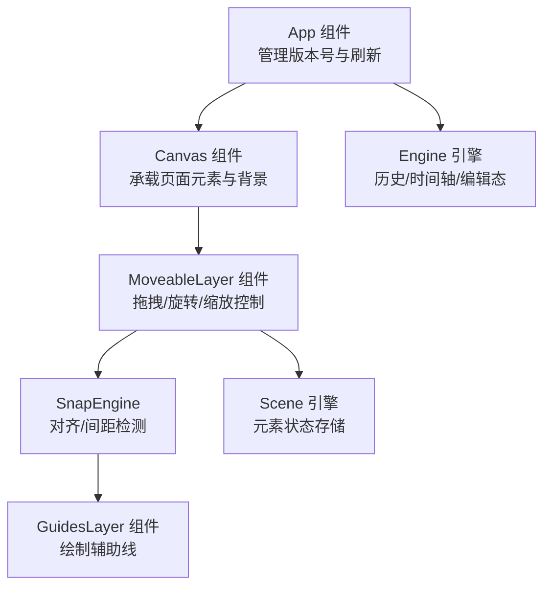
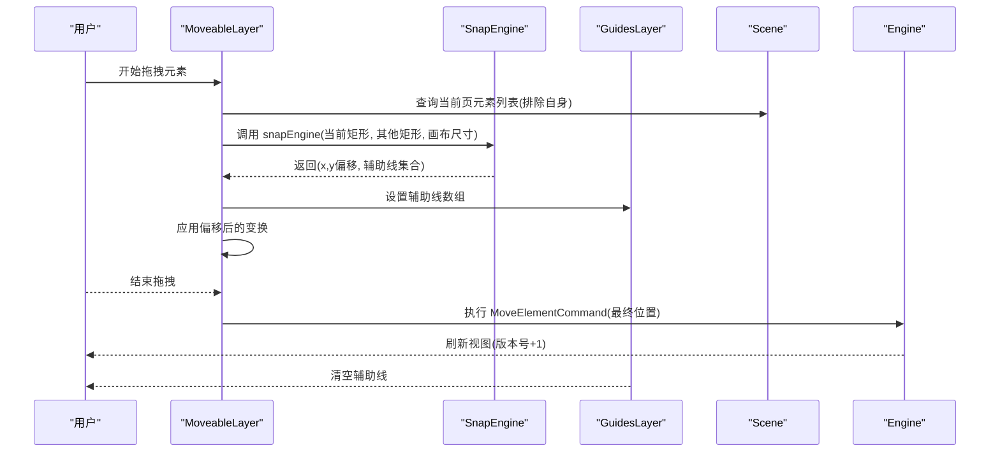
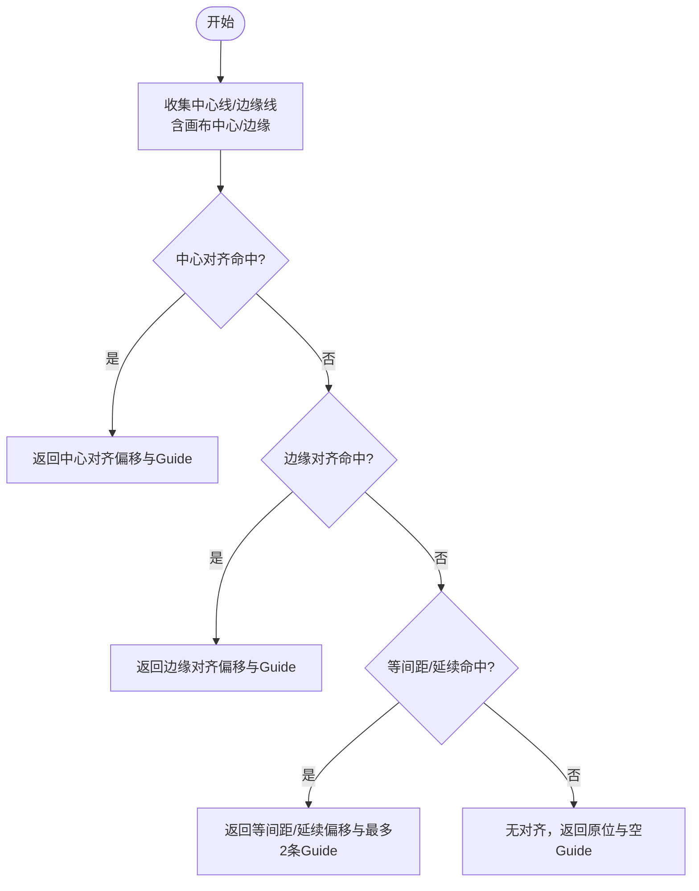
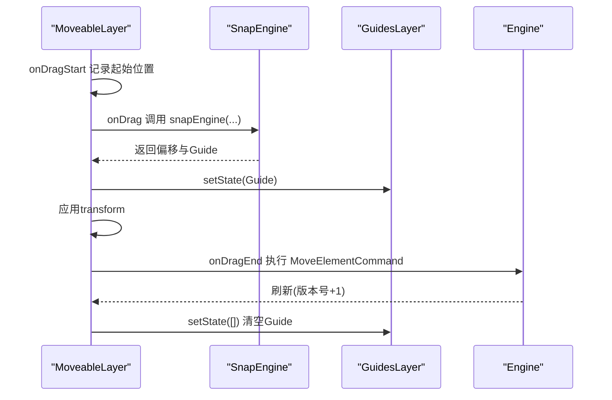
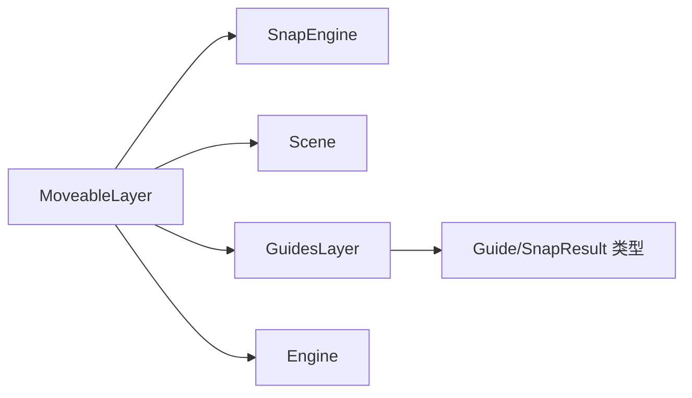

# 辅助线层 (GuidesLayer)

<cite>
**本文引用的文件**
- [GuidesLayer.tsx](file://src/components/GuidesLayer.tsx)
- [snapEngine.ts](file://src/engine/snapEngine.ts)
- [MoveableLayer.tsx](file://src/components/MoveableLayer.tsx)
- [scene.ts](file://src/engine/scene.ts)
- [commands.ts](file://src/engine/commands.ts)
- [Canvas.tsx](file://src/components/Canvas.tsx)
- [index.ts](file://src/types/index.ts)
- [engine.ts](file://src/engine/engine.ts)
- [App.tsx](file://src/App.tsx)
</cite>

## 目录
1. [简介](#简介)
2. [项目结构](#项目结构)
3. [核心组件](#核心组件)
4. [架构总览](#架构总览)
5. [详细组件分析](#详细组件分析)
6. [依赖关系分析](#依赖关系分析)
7. [性能考量](#性能考量)
8. [故障排查指南](#故障排查指南)
9. [结论](#结论)
10. [附录](#附录)

## 简介
本文件聚焦于“辅助线层”（GuidesLayer）组件及其协同系统，完整阐述以下内容：
- 对齐辅助线与网格线的绘制机制
- 对齐检测算法：元素边缘对齐、中心对齐、等间距/延续对齐等模式
- 辅助线的动态显示与隐藏机制，以及与移动控制层的协调
- 网格系统的配置项：网格间距、对齐阈值等
- 辅助线的颜色、样式与可见性控制
- 对齐约束的数学计算与性能优化策略
- 与引擎系统的数据同步与状态管理

## 项目结构
GuidesLayer 是一个轻量的渲染组件，负责在画布上绘制水平/垂直辅助线；其数据由 SnapEngine 提供，由 MoveableLayer 在拖拽过程中实时计算并传递给 GuidesLayer 渲染。

图表来源
- [App.tsx:156-342](file://src/App.tsx#L156-L342)
- [Canvas.tsx:92-128](file://src/components/Canvas.tsx#L92-L128)
- [MoveableLayer.tsx:15-189](file://src/components/MoveableLayer.tsx#L15-L189)
- [snapEngine.ts:242-259](file://src/engine/snapEngine.ts#L242-L259)
- [GuidesLayer.tsx:19-66](file://src/components/GuidesLayer.tsx#L19-L66)
- [scene.ts:10-173](file://src/engine/scene.ts#L10-L173)
- [engine.ts:7-54](file://src/engine/engine.ts#L7-L54)

章节来源
- [GuidesLayer.tsx:19-66](file://src/components/GuidesLayer.tsx#L19-L66)
- [snapEngine.ts:242-259](file://src/engine/snapEngine.ts#L242-L259)
- [MoveableLayer.tsx:15-189](file://src/components/MoveableLayer.tsx#L15-L189)
- [scene.ts:10-173](file://src/engine/scene.ts#L10-L173)
- [engine.ts:7-54](file://src/engine/engine.ts#L7-L54)
- [Canvas.tsx:92-128](file://src/components/Canvas.tsx#L92-L128)
- [App.tsx:156-342](file://src/App.tsx#L156-L342)

## 核心组件
- GuidesLayer：接收一组 Guide 数据，渲染水平/垂直辅助线，支持不同对齐类型的视觉区分。
- SnapEngine：核心对齐算法，提供边缘对齐、中心对齐、等间距/延续对齐，并返回偏移量与辅助线集合。
- MoveableLayer：与 react-moveable 集成，监听拖拽事件，调用 SnapEngine 计算对齐，更新 GuidesLayer 的显示，并在结束时提交命令到引擎。
- Scene：引擎场景层，提供元素查询、更新等能力，被 MoveableLayer 用于构建其他元素的参考集合。
- Engine：顶层引擎，维护编辑态、历史栈、时间轴等，驱动全局刷新。

章节来源
- [GuidesLayer.tsx:19-66](file://src/components/GuidesLayer.tsx#L19-L66)
- [snapEngine.ts:242-259](file://src/engine/snapEngine.ts#L242-L259)
- [MoveableLayer.tsx:15-189](file://src/components/MoveableLayer.tsx#L15-L189)
- [scene.ts:10-173](file://src/engine/scene.ts#L10-L173)
- [engine.ts:7-54](file://src/engine/engine.ts#L7-L54)

## 架构总览
下图展示从用户拖拽到辅助线渲染的端到端流程，以及与引擎的数据同步。

图表来源
- [MoveableLayer.tsx:61-111](file://src/components/MoveableLayer.tsx#L61-L111)
- [snapEngine.ts:242-259](file://src/engine/snapEngine.ts#L242-L259)
- [GuidesLayer.tsx:19-66](file://src/components/GuidesLayer.tsx#L19-L66)
- [scene.ts:169-173](file://src/engine/scene.ts#L169-L173)
- [commands.ts:20-44](file://src/engine/commands.ts#L20-L44)
- [engine.ts:29-32](file://src/engine/engine.ts#L29-L32)

## 详细组件分析

### GuidesLayer 组件
- 功能职责
  - 接收 Guide 数组，按类型渲染水平或垂直线段。
  - 按对齐类型设置颜色：边缘对齐蓝色、中心对齐绿色、等间距/延续对齐琥珀色。
  - 透明度统一为 0.9，线宽为 1 像素，覆盖整个画布区域。
- 渲染策略
  - 使用绝对定位容器，z-index 100，指针事件禁用，避免干扰交互。
  - 每条辅助线使用独立 div，键名包含类型、对齐类型、位置与索引，便于 React diff。
- 可见性控制
  - 当 Guide 数组为空时直接返回 null，不渲染任何辅助线，实现“自动隐藏”。

章节来源
- [GuidesLayer.tsx:19-66](file://src/components/GuidesLayer.tsx#L19-L66)

### SnapEngine 对齐算法
- 输入输出
  - 输入：当前矩形、其他矩形集合、画布尺寸、可选阈值（默认 5）。
  - 输出：新的 x/y 坐标与一组 Guide。
- 对齐优先级
  1) 中心对齐：比较当前元素中心与目标元素中心的距离，满足阈值则返回中心对齐 Guide。
  2) 边缘对齐：比较当前元素左右边缘与目标元素左右边缘的距离，满足阈值则返回边缘对齐 Guide。
  3) 等间距/延续对齐：在相邻元素之间寻找相等间隔或延续间隙，返回最多两条参考线（对应两个端点）。
- 关键函数
  - findSnap：在候选线上查找最小距离偏移，支持多线匹配去重。
  - findEqualSpacing：O(n) 遍历排序后的相邻元素，计算分布与延续两种模式下的期望位置，取最小距离偏移。
  - solveAxis：分别处理 x/y 轴，合并结果并转换为 Guide 类型。
  - snapEngine：分别求解 x/y 轴，合并为最终 Guide 集合与偏移坐标。

图表来源
- [snapEngine.ts:158-240](file://src/engine/snapEngine.ts#L158-L240)
- [snapEngine.ts:39-70](file://src/engine/snapEngine.ts#L39-L70)
- [snapEngine.ts:77-156](file://src/engine/snapEngine.ts#L77-L156)

章节来源
- [snapEngine.ts:11-16](file://src/engine/snapEngine.ts#L11-L16)
- [snapEngine.ts:39-70](file://src/engine/snapEngine.ts#L39-L70)
- [snapEngine.ts:77-156](file://src/engine/snapEngine.ts#L77-L156)
- [snapEngine.ts:158-240](file://src/engine/snapEngine.ts#L158-L240)
- [snapEngine.ts:242-259](file://src/engine/snapEngine.ts#L242-L259)

### MoveableLayer 协调机制
- 目标选择与同步
  - 根据引擎编辑态中的选中元素 ID，查询 DOM 获取目标元素，必要时通过 requestAnimationFrame 更新 moveable 框架。
- 拖拽过程
  - onDragStart：记录拖拽起始位置。
  - onDrag：构建当前矩形（左/上/宽/高），调用 SnapEngine 获取偏移与 Guide，预计算 transform 并设置 GuidesLayer 的 Guide 列表。
  - onDragEnd：使用 SnapEngine 的最终偏移作为真实落点，执行 MoveElementCommand 提交到引擎，清空 Guide。
- 旋转/缩放
  - 旋转/缩放事件仅更新 DOM 样式，不改变引擎状态；最终在结束事件中提交命令。

图表来源
- [MoveableLayer.tsx:54-111](file://src/components/MoveableLayer.tsx#L54-L111)
- [snapEngine.ts:242-259](file://src/engine/snapEngine.ts#L242-L259)
- [commands.ts:20-44](file://src/engine/commands.ts#L20-L44)

章节来源
- [MoveableLayer.tsx:15-189](file://src/components/MoveableLayer.tsx#L15-L189)

### 类型与数据模型
- Guide 类型
  - type：horizontal 或 vertical
  - kind：edge、center、spacing
  - position：像素坐标
  - sourceId：来源标识（元素 ID、画布或间距来源）
- SnapResult
  - x/y：对齐后的新坐标
  - guides：对齐参考线集合
- Rect
  - 用于 SnapEngine 的输入矩形，包含 id、x、y、width、height

章节来源
- [index.ts:90-101](file://src/types/index.ts#L90-L101)

### 与引擎系统的数据同步与状态管理
- 版本号驱动刷新
  - App 维护 version，Canvas 与 MoveableLayer 接收 version 作为依赖，当引擎执行命令或撤销/重做时，App 调用 refresh 将 version +1，触发 MoveableLayer 的 useEffect 同步 moveable 框架。
- 编辑态与选中元素
  - Engine 提供编辑态（selectedElementIds、viewport、toolMode 等），MoveableLayer 读取选中元素 ID，动态构建目标集合。
- 历史与命令
  - MoveableLayer 在拖拽结束时执行 MoveElementCommand，写入引擎历史栈，支持撤销/重做。

章节来源
- [App.tsx:18-27](file://src/App.tsx#L18-L27)
- [Canvas.tsx:34-37](file://src/components/Canvas.tsx#L34-L37)
- [engine.ts:21-27](file://src/engine/engine.ts#L21-L27)
- [commands.ts:20-44](file://src/engine/commands.ts#L20-L44)

## 依赖关系分析
- 组件耦合
  - MoveableLayer 依赖 SnapEngine 与 Scene，向 GuidesLayer 注入 Guide。
  - GuidesLayer 仅依赖 Guide 类型，保持纯渲染。
- 外部依赖
  - react-moveable：提供拖拽/旋转/缩放控制与事件回调。
  - DOM 查询：MoveableLayer 通过容器查询选中元素，确保与引擎元素一致。
- 循环依赖
  - 未发现循环依赖；组件间单向数据流清晰。

图表来源
- [MoveableLayer.tsx:15-189](file://src/components/MoveableLayer.tsx#L15-L189)
- [snapEngine.ts:242-259](file://src/engine/snapEngine.ts#L242-L259)
- [GuidesLayer.tsx:19-66](file://src/components/GuidesLayer.tsx#L19-L66)
- [scene.ts:10-173](file://src/engine/scene.ts#L10-L173)
- [index.ts:90-101](file://src/types/index.ts#L90-L101)
- [engine.ts:7-54](file://src/engine/engine.ts#L7-L54)

章节来源
- [MoveableLayer.tsx:15-189](file://src/components/MoveableLayer.tsx#L15-L189)
- [snapEngine.ts:242-259](file://src/engine/snapEngine.ts#L242-L259)
- [GuidesLayer.tsx:19-66](file://src/components/GuidesLayer.tsx#L19-L66)
- [scene.ts:10-173](file://src/engine/scene.ts#L10-L173)
- [index.ts:90-101](file://src/types/index.ts#L90-L101)
- [engine.ts:7-54](file://src/engine/engine.ts#L7-L54)

## 性能考量
- 时间复杂度
  - solveAxis：对每个轴遍历其他元素构建参考线，再对当前候选位置进行扫描，整体近似 O(n)（n 为其他元素数量）。
  - findEqualSpacing：先排序 O(n log n)，再一次线性扫描，整体 O(n log n)。
  - dedupSnapLines：按位置去重，O(n)。
- 空间复杂度
  - 主要为临时数组与去重集合，空间开销与元素数量线性相关。
- 优化建议
  - 阈值参数化：将阈值从硬编码改为可配置，允许根据画布缩放或设备像素比调整。
  - 参考线缓存：若元素集合稳定，可缓存中心线/边缘线，减少重复构建。
  - 分帧处理：在高频拖拽中，对 SnapEngine 的调用可节流/防抖，降低重排压力。
  - 仅渲染必要 Guide：限制同时显示的 Guide 数量（例如最多 2 条），避免视觉过载。
  - DOM 合并与 transform：MoveableLayer 已通过 transform 预计算偏移，避免频繁布局计算。

[本节为通用性能讨论，无需特定文件来源]

## 故障排查指南
- 辅助线不显示
  - 检查 MoveableLayer 是否正确设置 GuidesLayer 的 Guide 列表，确认 onDrag 事件中已调用 snapEngine 并 setState。
  - 确认 GuidesLayer 的 props.guides 非空，否则会返回 null 不渲染。
- 对齐无效
  - 检查阈值是否过大导致无法命中；默认阈值为 5，可在调用 snapEngine 时传入更小值。
  - 确认当前元素与其他元素的相对位置是否满足边缘/中心/等间距条件。
- 拖拽结束后位置异常
  - 确认 onDragEnd 使用了 SnapEngine 的最终偏移，而非 moveable 默认的 left/top。
  - 检查 MoveElementCommand 是否成功执行并提交到引擎。
- 选中元素不响应
  - 确认 App 的版本号变化触发了 MoveableLayer 的 useEffect，使其调用 updateRect 同步框架。
  - 确认 DOM 容器内存在 data-element-id 属性，且与引擎中的元素 ID 匹配。

章节来源
- [MoveableLayer.tsx:61-111](file://src/components/MoveableLayer.tsx#L61-L111)
- [GuidesLayer.tsx:19-21](file://src/components/GuidesLayer.tsx#L19-L21)
- [snapEngine.ts:242-259](file://src/engine/snapEngine.ts#L242-L259)
- [commands.ts:20-44](file://src/engine/commands.ts#L20-L44)
- [App.tsx:25-37](file://src/App.tsx#L25-L37)

## 结论
GuidesLayer 通过与 SnapEngine 和 MoveableLayer 的紧密协作，实现了高效、直观的对齐辅助线渲染。算法层面采用优先级策略与阈值控制，保证在复杂场景下仍能快速给出最优对齐参考。通过版本号驱动的刷新与命令系统，实现了与引擎状态的无缝同步。未来可在阈值配置、参考线缓存与分帧处理等方面进一步优化，以提升在大规模元素场景下的性能与交互体验。

[本节为总结性内容，无需特定文件来源]

## 附录

### 配置与参数
- 对齐阈值
  - 默认值：5（像素）
  - 作用：决定对齐检测的容差范围，越小越严格，越大越容易吸附。
  - 使用方式：在调用 snapEngine 时传入 threshold 参数。
- 网格系统
  - 当前实现未内置网格线绘制逻辑；可通过扩展 SnapEngine，在画布边缘/中心线基础上增加固定间距的参考线集合，再映射为 Guide 渲染。
- 辅助线样式
  - 颜色：边缘对齐蓝色、中心对齐绿色、等间距/延续对齐琥珀色。
  - 透明度：0.9
  - 线宽：1 像素
  - 方向：水平/垂直

章节来源
- [snapEngine.ts:242-259](file://src/engine/snapEngine.ts#L242-L259)
- [GuidesLayer.tsx:7-17](file://src/components/GuidesLayer.tsx#L7-L17)