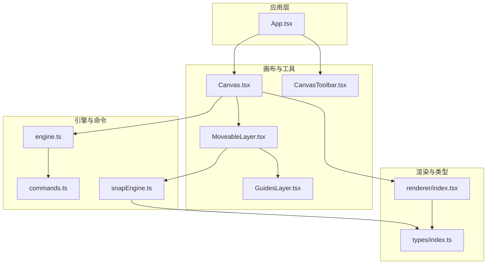
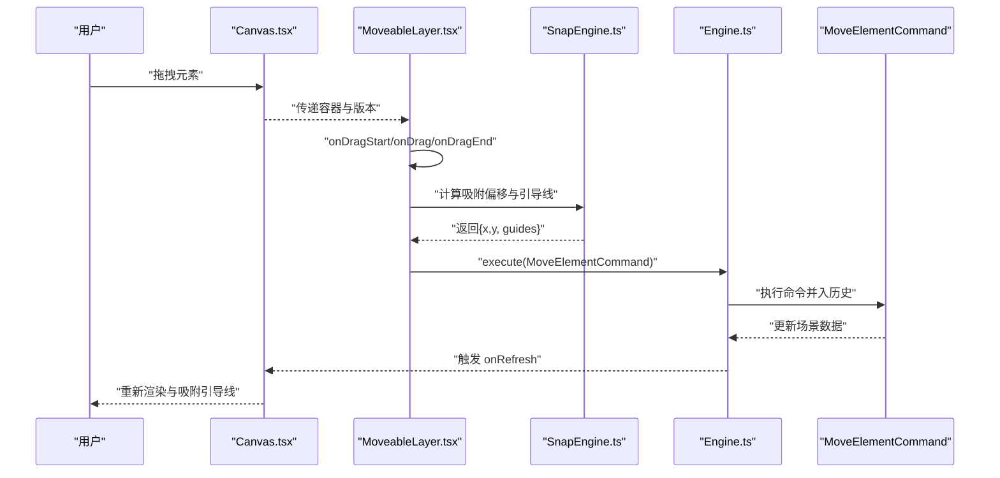
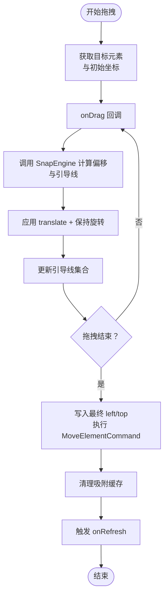
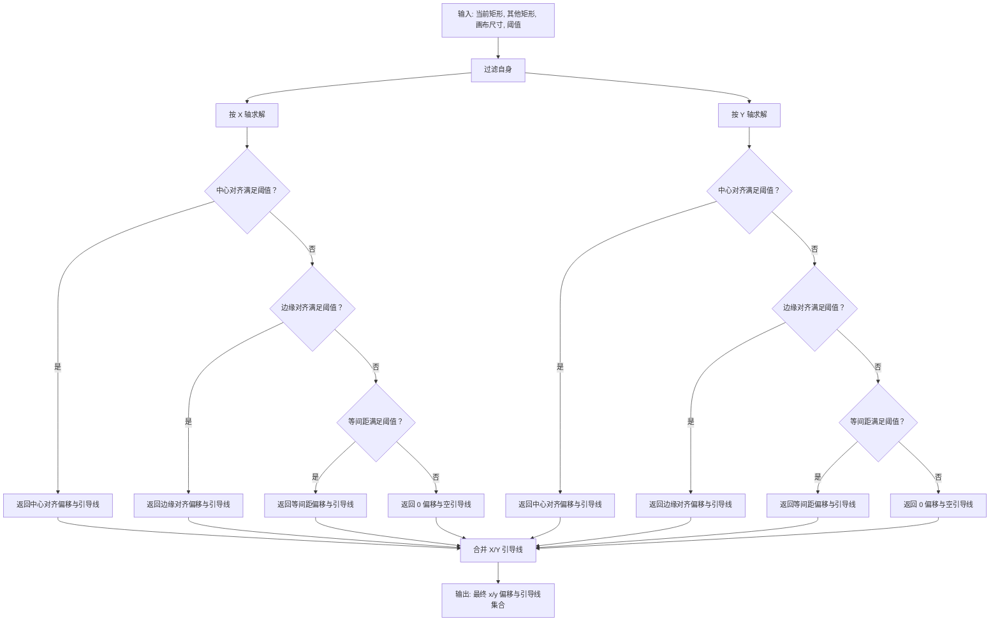
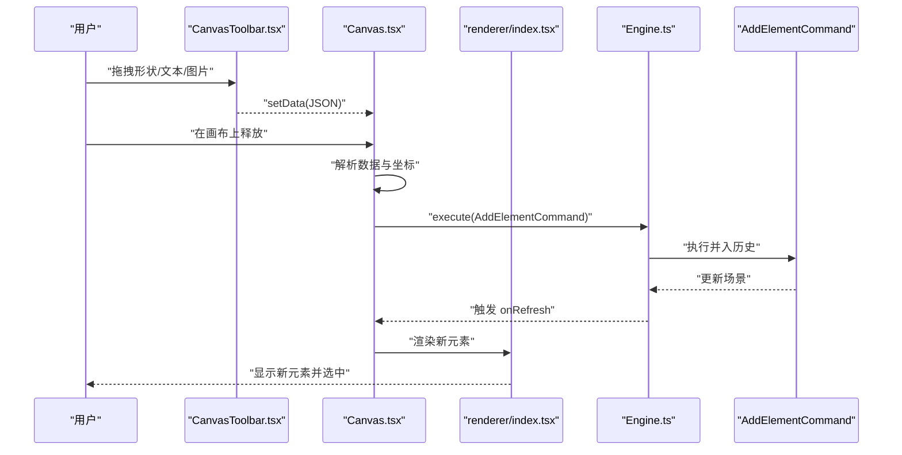
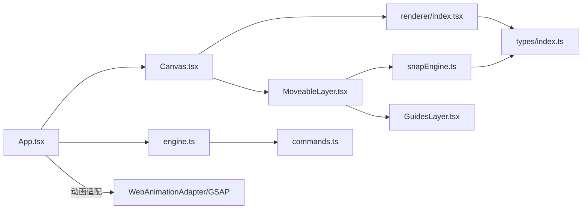

# 交互系统

<cite>
**本文引用的文件**
- [src/components/MoveableLayer.tsx](file://src/components/MoveableLayer.tsx)
- [src/engine/snapEngine.ts](file://src/engine/snapEngine.ts)
- [src/components/Canvas.tsx](file://src/components/Canvas.tsx)
- [src/components/CanvasToolbar.tsx](file://src/components/CanvasToolbar.tsx)
- [src/components/GuidesLayer.tsx](file://src/components/GuidesLayer.tsx)
- [src/engine/engine.ts](file://src/engine/engine.ts)
- [src/engine/commands.ts](file://src/engine/commands.ts)
- [src/types/index.ts](file://src/types/index.ts)
- [src/renderer/index.tsx](file://src/renderer/index.tsx)
- [src/App.tsx](file://src/App.tsx)
- [package.json](file://package.json)
</cite>

## 目录
1. [简介](#简介)
2. [项目结构](#项目结构)
3. [核心组件](#核心组件)
4. [架构总览](#架构总览)
5. [详细组件分析](#详细组件分析)
6. [依赖关系分析](#依赖关系分析)
7. [性能考量](#性能考量)
8. [故障排查指南](#故障排查指南)
9. [结论](#结论)
10. [附录](#附录)

## 简介
本技术文档围绕交互系统展开，重点阐述拖拽交互、选择与编辑机制、键盘快捷键支持、移动端适配策略，以及 MoveableLayer 的元素变换、SnapEngine 的对齐吸附机制与画布交互事件处理。文档同时覆盖交互状态管理、用户体验优化、性能考虑、扩展指南、自定义交互模式实现方法与集成示例，并记录跨平台兼容性与无障碍访问支持。

## 项目结构
交互系统由“视图层组件 + 引擎与命令 + 类型与渲染器”构成，采用分层设计：Canvas 负责承载元素与事件；MoveableLayer 提供拖拽/旋转/缩放能力；SnapEngine 实现吸附与引导线；App 层负责全局状态与快捷键；Renderer 将元素渲染到画布；Engine/Commands 统一管理状态变更与历史。

**图表来源**
- [src/App.tsx:1-344](file://src/App.tsx#L1-L344)
- [src/components/Canvas.tsx:1-191](file://src/components/Canvas.tsx#L1-L191)
- [src/components/CanvasToolbar.tsx:1-66](file://src/components/CanvasToolbar.tsx#L1-L66)
- [src/components/MoveableLayer.tsx:1-189](file://src/components/MoveableLayer.tsx#L1-L189)
- [src/components/GuidesLayer.tsx:1-66](file://src/components/GuidesLayer.tsx#L1-L66)
- [src/engine/engine.ts:1-54](file://src/engine/engine.ts#L1-L54)
- [src/engine/commands.ts:1-280](file://src/engine/commands.ts#L1-L280)
- [src/engine/snapEngine.ts:1-259](file://src/engine/snapEngine.ts#L1-L259)
- [src/renderer/index.tsx:1-314](file://src/renderer/index.tsx#L1-L314)
- [src/types/index.ts:1-159](file://src/types/index.ts#L1-L159)

**章节来源**
- [src/App.tsx:1-344](file://src/App.tsx#L1-L344)
- [src/components/Canvas.tsx:1-191](file://src/components/Canvas.tsx#L1-L191)
- [src/components/CanvasToolbar.tsx:1-66](file://src/components/CanvasToolbar.tsx#L1-L66)
- [src/components/MoveableLayer.tsx:1-189](file://src/components/MoveableLayer.tsx#L1-L189)
- [src/components/GuidesLayer.tsx:1-66](file://src/components/GuidesLayer.tsx#L1-L66)
- [src/engine/engine.ts:1-54](file://src/engine/engine.ts#L1-L54)
- [src/engine/commands.ts:1-280](file://src/engine/commands.ts#L1-L280)
- [src/engine/snapEngine.ts:1-259](file://src/engine/snapEngine.ts#L1-L259)
- [src/renderer/index.tsx:1-314](file://src/renderer/index.tsx#L1-L314)
- [src/types/index.ts:1-159](file://src/types/index.ts#L1-L159)

## 核心组件
- 画布 Canvas：承载页面元素、处理拖放与点击事件、触发选择与刷新。
- MoveableLayer：基于 react-moveable 的可选中元素变换层，提供拖拽、旋转、缩放与吸附。
- SnapEngine：对齐吸附算法，生成吸附偏移与引导线。
- GuidesLayer：在吸附时绘制水平/垂直引导线。
- Engine/Commands：统一的状态变更入口（execute），支持撤销/重做与命令对象化。
- Renderer：将元素渲染为 DOM/SVG，附加选择框与事件。
- App：全局状态、快捷键监听、动画调度与预览控制。

**章节来源**
- [src/components/Canvas.tsx:1-191](file://src/components/Canvas.tsx#L1-L191)
- [src/components/MoveableLayer.tsx:1-189](file://src/components/MoveableLayer.tsx#L1-L189)
- [src/engine/snapEngine.ts:1-259](file://src/engine/snapEngine.ts#L1-L259)
- [src/components/GuidesLayer.tsx:1-66](file://src/components/GuidesLayer.tsx#L1-L66)
- [src/engine/engine.ts:1-54](file://src/engine/engine.ts#L1-L54)
- [src/engine/commands.ts:1-280](file://src/engine/commands.ts#L1-L280)
- [src/renderer/index.tsx:1-314](file://src/renderer/index.tsx#L1-L314)
- [src/App.tsx:107-150](file://src/App.tsx#L107-L150)

## 架构总览
交互系统以“命令驱动的状态机”为核心，所有 UI 操作最终通过命令执行，保证可撤销与状态一致性。MoveableLayer 在用户拖拽过程中实时调用 SnapEngine 计算吸附位置与引导线，再通过命令持久化最终状态。

**图表来源**
- [src/components/Canvas.tsx:79-90](file://src/components/Canvas.tsx#L79-L90)
- [src/components/MoveableLayer.tsx:54-111](file://src/components/MoveableLayer.tsx#L54-L111)
- [src/engine/snapEngine.ts:242-259](file://src/engine/snapEngine.ts#L242-L259)
- [src/engine/engine.ts:29-40](file://src/engine/engine.ts#L29-L40)
- [src/engine/commands.ts:20-44](file://src/engine/commands.ts#L20-L44)

## 详细组件分析

### MoveableLayer：元素变换与吸附
- 选择同步：根据编辑器状态中的选中 ID 列表查询 DOM 元素，设置为 Moveable 的目标。
- 变换回调：
  - 拖拽：计算吸附后的 x/y，预设 transform 并更新引导线。
  - 旋转：直接应用 transform。
  - 缩放：更新宽高与 transform。
- 结束阶段：使用吸附结果覆盖最后位置，执行 MoveElementCommand，清空吸附缓存并触发刷新。
- 吸附数据：通过 SnapEngine 返回的 guides 渲染 GuidesLayer。

**图表来源**
- [src/components/MoveableLayer.tsx:24-111](file://src/components/MoveableLayer.tsx#L24-L111)
- [src/engine/snapEngine.ts:242-259](file://src/engine/snapEngine.ts#L242-L259)
- [src/engine/commands.ts:20-44](file://src/engine/commands.ts#L20-L44)

**章节来源**
- [src/components/MoveableLayer.tsx:15-189](file://src/components/MoveableLayer.tsx#L15-L189)

### SnapEngine：对齐吸附机制
- 输入：当前矩形、其他矩形、画布尺寸、吸附阈值。
- 策略优先级：
  1) 中心对齐：匹配中心线。
  2) 边缘对齐：匹配左右/上下边缘。
  3) 等间距分布：相邻元素之间的等距或延续对齐。
- 输出：x/y 偏移量与引导线数组（含类型、种类与位置）。

**图表来源**
- [src/engine/snapEngine.ts:39-259](file://src/engine/snapEngine.ts#L39-L259)

**章节来源**
- [src/engine/snapEngine.ts:1-259](file://src/engine/snapEngine.ts#L1-L259)
- [src/types/index.ts:90-101](file://src/types/index.ts#L90-L101)

### 画布 Canvas：事件处理与选择
- 拖放：接收工具栏拖出的数据，计算相对坐标，创建元素并加入场景，设置选中状态。
- 点击：点击空白区域取消选择，点击元素设置为唯一选中。
- 动画作用域：将动画引擎的作用域限定在当前画布容器内，确保动画目标正确。

**图表来源**
- [src/components/CanvasToolbar.tsx:18-26](file://src/components/CanvasToolbar.tsx#L18-L26)
- [src/components/Canvas.tsx:44-69](file://src/components/Canvas.tsx#L44-L69)
- [src/engine/commands.ts:4-18](file://src/engine/commands.ts#L4-L18)
- [src/renderer/index.tsx:189-202](file://src/renderer/index.tsx#L189-L202)

**章节来源**
- [src/components/Canvas.tsx:1-191](file://src/components/Canvas.tsx#L1-L191)
- [src/components/CanvasToolbar.tsx:1-66](file://src/components/CanvasToolbar.tsx#L1-L66)
- [src/renderer/index.tsx:1-314](file://src/renderer/index.tsx#L1-L314)

### 引导线 GuidesLayer：吸附可视化
- 根据 SnapEngine 返回的引导线集合绘制水平/垂直线段，区分中心、边缘、等间距三类颜色。
- 作为绝对定位层叠加在画布之上，不参与事件捕获。

**章节来源**
- [src/components/GuidesLayer.tsx:1-66](file://src/components/GuidesLayer.tsx#L1-L66)
- [src/engine/snapEngine.ts:242-259](file://src/engine/snapEngine.ts#L242-L259)

### 键盘快捷键支持：撤销/重做与删除
- 支持组合键撤销与重做，阻止默认行为。
- 支持 Delete/Backspace 删除选中元素，仅当不在输入控件内时生效。

**章节来源**
- [src/App.tsx:107-150](file://src/App.tsx#L107-L150)

### 移动端适配策略
- 使用 Pointer 事件处理触摸与鼠标一致的交互语义。
- Canvas 容器具备滚动与缩放能力，配合渲染器的绝对定位与 transform，保证元素在不同设备上的布局稳定性。
- 工具栏采用拖放方式添加元素，适合触摸场景。

**章节来源**
- [src/components/Canvas.tsx:79-90](file://src/components/Canvas.tsx#L79-L90)
- [src/components/CanvasToolbar.tsx:18-26](file://src/components/CanvasToolbar.tsx#L18-L26)
- [src/renderer/index.tsx:14-27](file://src/renderer/index.tsx#L14-L27)

### 交互状态管理与用户体验优化
- 版本号驱动刷新：Canvas 与 MoveableLayer 通过版本号与 useEffect 同步 Moveable 框架，避免外部状态变更导致的 UI 不一致。
- 即时反馈：拖拽过程预设 transform，减少视觉跳变；吸附结束后再写入 left/top，避免“回弹”。
- 引导线即时呈现：吸附命中时立即绘制引导线，提升对齐精度感知。

**章节来源**
- [src/components/MoveableLayer.tsx:24-35](file://src/components/MoveableLayer.tsx#L24-L35)
- [src/components/MoveableLayer.tsx:80-83](file://src/components/MoveableLayer.tsx#L80-L83)
- [src/components/MoveableLayer.tsx:94-99](file://src/components/MoveableLayer.tsx#L94-L99)

### 性能考量
- 吸附计算复杂度：每轴最多遍历一次其他元素，时间复杂度近似 O(n)，阈值与去重逻辑降低无效匹配。
- DOM 更新最小化：拖拽阶段仅更新 transform 与少量样式，结束阶段一次性写入 left/top/宽高/旋转，减少回流。
- 命令批处理：通过 History 管理命令栈，避免频繁重绘。

**章节来源**
- [src/engine/snapEngine.ts:77-156](file://src/engine/snapEngine.ts#L77-L156)
- [src/components/MoveableLayer.tsx:76-82](file://src/components/MoveableLayer.tsx#L76-L82)

### 扩展指南与自定义交互模式
- 自定义吸附规则：在 SnapEngine 中新增策略（如对角线、网格吸附），扩展输入与输出接口，保持与现有引导线体系兼容。
- 自定义变换约束：在 MoveableLayer 的 onDrag/onRotate/onResize 中注入自定义逻辑（如固定角度、比例锁定），并在结束时封装为新的命令对象。
- 新增工具模式：在 EditorState 中扩展 ToolMode，结合 CanvasToolbar 与 App 的快捷键映射，实现“手型/选择/图形/文本/图片”等模式切换。
- 事件扩展：在 Canvas 上增加手势识别（双指缩放、长按菜单）与多点触控交互，注意与 Pointer 事件协同。

**章节来源**
- [src/engine/snapEngine.ts:11-16](file://src/engine/snapEngine.ts#L11-L16)
- [src/engine/commands.ts:20-44](file://src/engine/commands.ts#L20-L44)
- [src/types/index.ts:142-149](file://src/types/index.ts#L142-L149)
- [src/components/CanvasToolbar.tsx:10-16](file://src/components/CanvasToolbar.tsx#L10-L16)
- [src/App.tsx:107-150](file://src/App.tsx#L107-L150)

### 集成示例
- 在现有 Canvas 中接入自定义吸附：调用 SnapEngine 并将返回的 guides 传给 GuidesLayer。
- 在 App 中注册新的快捷键：在键盘事件处理器中判断组合键与当前焦点，派发对应命令。
- 在 Renderer 中扩展元素类型：新增 render 函数分支与选择框样式，确保 transform 与选择框一致。

**章节来源**
- [src/components/MoveableLayer.tsx:68-74](file://src/components/MoveableLayer.tsx#L68-L74)
- [src/App.tsx:107-150](file://src/App.tsx#L107-L150)
- [src/renderer/index.tsx:189-202](file://src/renderer/index.tsx#L189-L202)

### 跨平台兼容性与无障碍访问
- 跨平台：依赖 Pointer 事件与 CSS transform，兼容桌面端鼠标与移动端触摸；Canvas 容器具备滚动与缩放能力。
- 无障碍：为按钮与控件提供语义标签与键盘可达性；为图像提供替代文本；为引导线等装饰元素避免干扰可访问性树。

**章节来源**
- [src/components/Canvas.tsx:79-90](file://src/components/Canvas.tsx#L79-L90)
- [src/renderer/index.tsx:145-156](file://src/renderer/index.tsx#L145-L156)

## 依赖关系分析
- 组件依赖：Canvas 依赖 Renderer；MoveableLayer 依赖 SnapEngine 与 GuidesLayer；App 依赖 Engine 与动画调度。
- 外部依赖：react-moveable 提供变换能力；GSAP 与 Web Animations API 用于动画播放与控制。

**图表来源**
- [src/App.tsx:1-344](file://src/App.tsx#L1-L344)
- [src/components/Canvas.tsx:1-191](file://src/components/Canvas.tsx#L1-L191)
- [src/components/MoveableLayer.tsx:1-189](file://src/components/MoveableLayer.tsx#L1-L189)
- [src/components/GuidesLayer.tsx:1-66](file://src/components/GuidesLayer.tsx#L1-L66)
- [src/engine/engine.ts:1-54](file://src/engine/engine.ts#L1-L54)
- [src/engine/commands.ts:1-280](file://src/engine/commands.ts#L1-L280)
- [src/engine/snapEngine.ts:1-259](file://src/engine/snapEngine.ts#L1-L259)
- [src/renderer/index.tsx:1-314](file://src/renderer/index.tsx#L1-L314)
- [src/types/index.ts:1-159](file://src/types/index.ts#L1-L159)
- [package.json:12-32](file://package.json#L12-L32)

**章节来源**
- [package.json:12-32](file://package.json#L12-L32)

## 性能考量
- 吸附算法：O(n) 遍历其他元素，阈值与去重减少无效匹配；建议在大场景下限制吸附范围或延迟计算。
- DOM 更新：拖拽阶段仅 transform，结束阶段批量写入；避免在高频回调中进行昂贵的布局测量。
- 历史管理：命令对象化与不可变更新，减少不必要的重渲染；版本号驱动的批量刷新优于细粒度更新。

[本节为通用指导，无需特定文件来源]

## 故障排查指南
- 拖拽后元素“回弹”：确认在 onDragEnd 中先写入 left/top 再清除 transform。
- 未触发吸附：检查 SnapEngine 输入参数（当前矩形、其他矩形、画布尺寸）是否正确；确认阈值设置合理。
- 选择状态不同步：检查版本号与 useEffect 是否正确触发 Moveable.updateRect。
- 快捷键无效：确认键盘事件未被输入控件捕获；组合键判定逻辑需区分 Ctrl/Meta。

**章节来源**
- [src/components/MoveableLayer.tsx:89-111](file://src/components/MoveableLayer.tsx#L89-L111)
- [src/engine/snapEngine.ts:242-259](file://src/engine/snapEngine.ts#L242-L259)
- [src/components/MoveableLayer.tsx:24-35](file://src/components/MoveableLayer.tsx#L24-L35)
- [src/App.tsx:107-150](file://src/App.tsx#L107-L150)

## 结论
该交互系统以命令驱动的状态机为核心，结合 react-moveable 的变换能力与 SnapEngine 的吸附算法，实现了高效、直观且可扩展的编辑体验。通过版本号驱动的刷新与引导线可视化，提升了对齐精度与操作反馈。未来可在吸附策略、工具模式与移动端手势方面进一步扩展，同时持续关注性能与可访问性。

[本节为总结性内容，无需特定文件来源]

## 附录
- 关键类型与命令参考：见类型定义与命令实现文件。
- 依赖库：react-moveable、GSAP、Web Animations API。

**章节来源**
- [src/types/index.ts:1-159](file://src/types/index.ts#L1-L159)
- [src/engine/commands.ts:1-280](file://src/engine/commands.ts#L1-L280)
- [package.json:12-32](file://package.json#L12-L32)