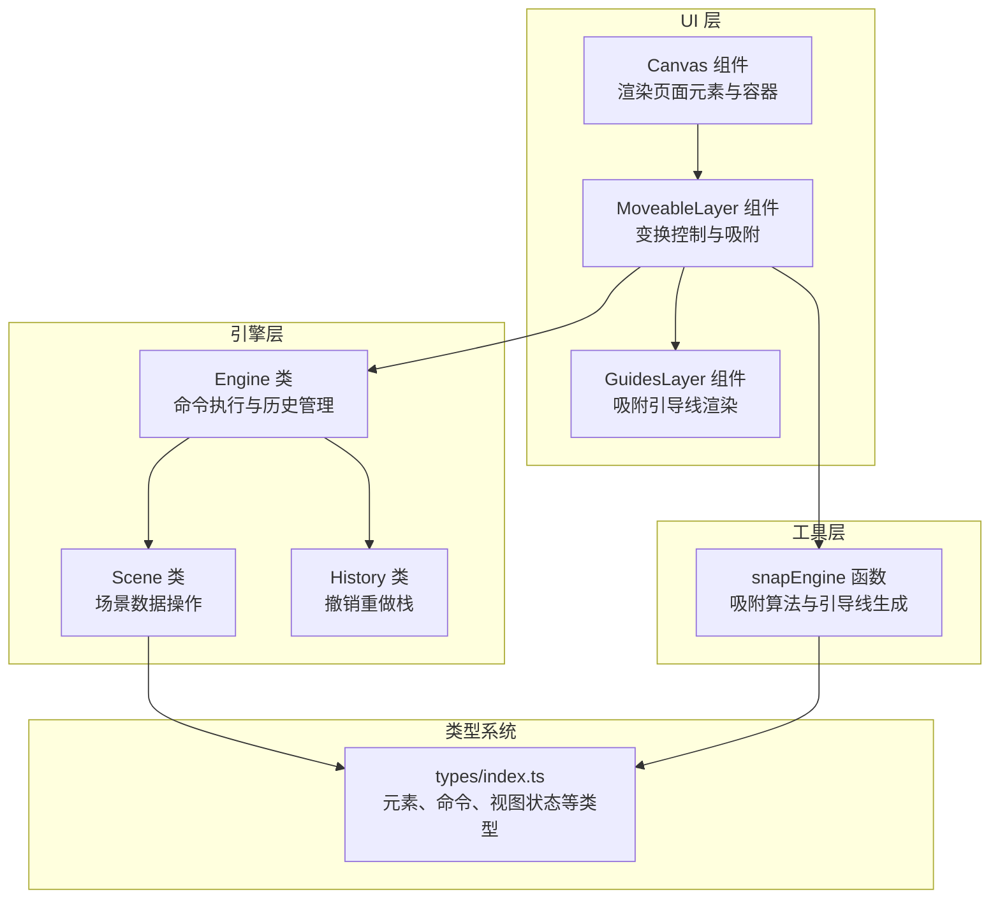
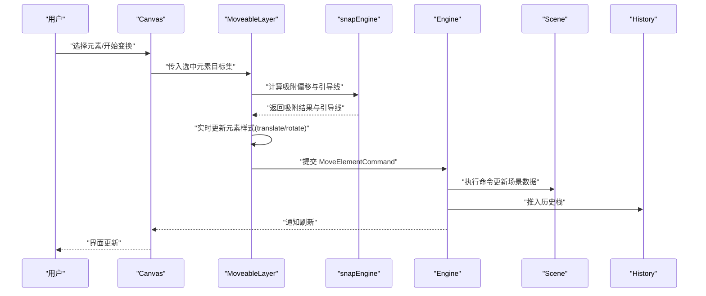
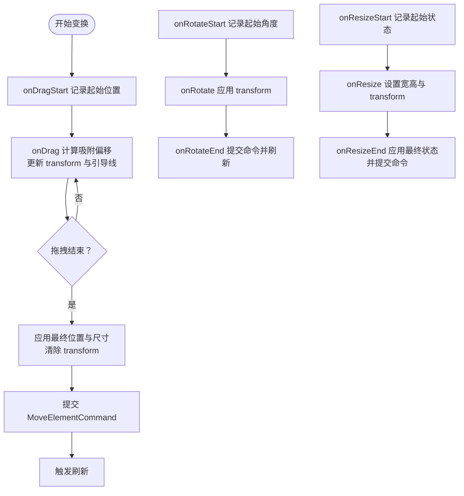
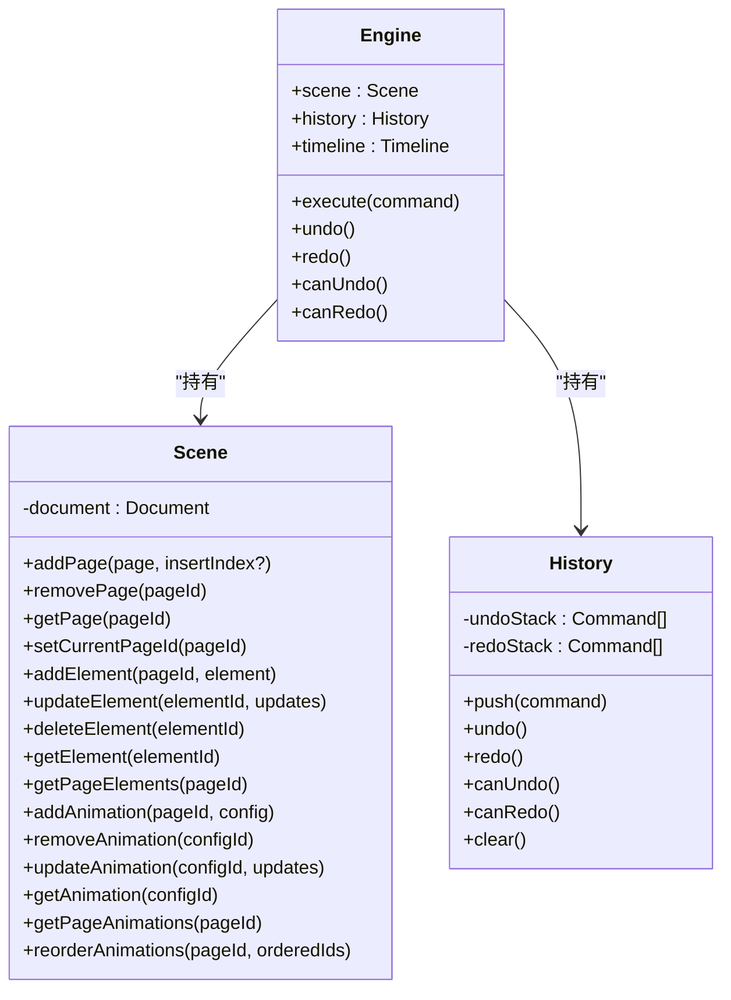
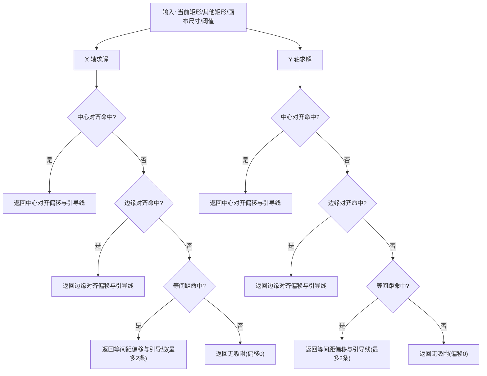
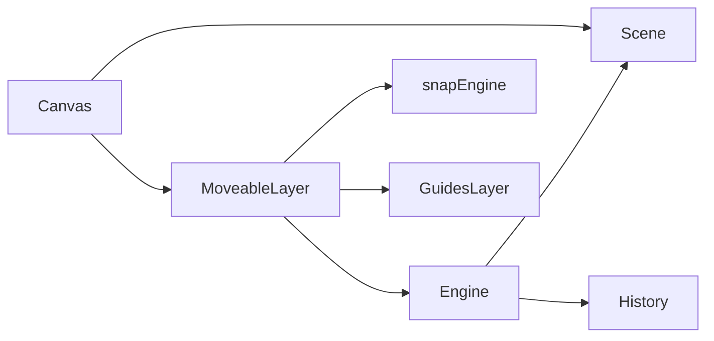

# 元素变换控制

<cite>
**本文档引用的文件**
- [MoveableLayer.tsx](file://src/components/MoveableLayer.tsx)
- [GuidesLayer.tsx](file://src/components/GuidesLayer.tsx)
- [Canvas.tsx](file://src/components/Canvas.tsx)
- [engine.ts](file://src/engine/engine.ts)
- [history.ts](file://src/engine/history.ts)
- [commands.ts](file://src/engine/commands.ts)
- [snapEngine.ts](file://src/engine/snapEngine.ts)
- [scene.ts](file://src/engine/scene.ts)
- [index.ts](file://src/types/index.ts)
- [App.tsx](file://src/App.tsx)
</cite>

## 目录
1. [简介](#简介)
2. [项目结构](#项目结构)
3. [核心组件](#核心组件)
4. [架构总览](#架构总览)
5. [详细组件分析](#详细组件分析)
6. [依赖关系分析](#依赖关系分析)
7. [性能考虑](#性能考虑)
8. [故障排除指南](#故障排除指南)
9. [结论](#结论)
10. [附录](#附录)

## 简介
本技术文档围绕元素变换控制功能展开，重点解析 MoveableLayer 组件的实现原理、元素变换的触发机制与控制点交互，涵盖缩放、旋转、移动与自由变换的完整流程，包括变换矩阵计算、约束条件与实时预览。文档还详细说明了变换状态管理、变换历史记录与撤销重做支持，并提供可扩展的自定义方法、性能优化策略以及变换精度控制、响应式设计与跨设备兼容性建议。

## 项目结构
该编辑器采用分层架构：UI 层负责渲染与交互，引擎层负责场景数据与命令执行，类型系统提供统一的数据契约。元素变换控制位于 UI 层的 MoveableLayer 组件中，通过 react-moveable 提供拖拽、旋转、缩放等交互能力，并结合 snapEngine 实现吸附对齐与引导线显示。

图表来源
- [Canvas.tsx:22-128](file://src/components/Canvas.tsx#L22-L128)
- [MoveableLayer.tsx:15-188](file://src/components/MoveableLayer.tsx#L15-L188)
- [GuidesLayer.tsx:19-65](file://src/components/GuidesLayer.tsx#L19-L65)
- [engine.ts:7-49](file://src/engine/engine.ts#L7-L49)
- [history.ts:3-44](file://src/engine/history.ts#L3-L44)
- [scene.ts:3-247](file://src/engine/scene.ts#L3-L247)
- [snapEngine.ts:242-258](file://src/engine/snapEngine.ts#L242-L258)
- [index.ts:10-159](file://src/types/index.ts#L10-L159)

章节来源
- [Canvas.tsx:22-128](file://src/components/Canvas.tsx#L22-L128)
- [engine.ts:7-49](file://src/engine/engine.ts#L7-L49)
- [index.ts:10-159](file://src/types/index.ts#L10-L159)

## 核心组件
- MoveableLayer：基于 react-moveable 的元素变换控制层，负责处理拖拽、旋转、缩放事件，实时更新元素位置与样式，并在结束时提交命令到引擎。
- GuidesLayer：吸附引导线渲染层，根据 snapEngine 返回的引导线绘制水平/垂直线段。
- Canvas：画布容器，承载页面元素与 MoveableLayer，负责选择状态与点击事件处理。
- Engine/History/Scene：引擎与历史管理，提供命令执行、撤销重做与场景数据操作。
- snapEngine：吸附算法，提供边缘对齐、中心对齐与等间距吸附，并返回引导线信息。

章节来源
- [MoveableLayer.tsx:15-188](file://src/components/MoveableLayer.tsx#L15-L188)
- [GuidesLayer.tsx:19-65](file://src/components/GuidesLayer.tsx#L19-L65)
- [Canvas.tsx:22-128](file://src/components/Canvas.tsx#L22-L128)
- [engine.ts:7-49](file://src/engine/engine.ts#L7-L49)
- [history.ts:3-44](file://src/engine/history.ts#L3-L44)
- [scene.ts:3-247](file://src/engine/scene.ts#L3-L247)
- [snapEngine.ts:242-258](file://src/engine/snapEngine.ts#L242-L258)

## 架构总览
元素变换控制的整体流程如下：
- 用户在 Canvas 中选择元素，MoveableLayer 基于选中元素目标集初始化 react-moveable 控制器。
- 在拖拽/旋转/缩放过程中，MoveableLayer 计算吸附偏移并实时更新元素样式，同时收集引导线。
- 变换结束时，MoveableLayer 将最终状态提交为 MoveElementCommand，由 Engine 执行并推入 History 栈。
- App 层通过版本号驱动刷新，确保 UI 与场景数据同步。

图表来源
- [MoveableLayer.tsx:44-184](file://src/components/MoveableLayer.tsx#L44-L184)
- [snapEngine.ts:242-258](file://src/engine/snapEngine.ts#L242-L258)
- [engine.ts:29-48](file://src/engine/engine.ts#L29-L48)
- [scene.ts:108-135](file://src/engine/scene.ts#L108-L135)

## 详细组件分析

### MoveableLayer 组件分析
- 目标集与版本同步：根据引擎编辑状态中的选中元素 ID，从容器中查询对应 DOM 并设置为 react-moveable 的 target；每次版本变化时调用 updateRect 同步控制器边界。
- 拖拽流程：
  - onDragStart：记录起始位置，用于计算 translate 偏移。
  - onDrag：调用 snapEngine 计算吸附后的 x/y，缓存吸附结果；根据起始位置计算 dx/dy 并设置 transform 以实现平滑预览；同时更新 GuidesLayer 的引导线。
  - onDragEnd：使用缓存的吸附结果覆盖最终位置，避免 moveable 内部坐标与自定义 snap 不一致导致的视觉跳变；提交 MoveElementCommand 更新场景数据；清理吸附缓存并触发刷新。
- 旋转流程：
  - onRotateStart：记录起始角度。
  - onRotate：直接应用 transform 以实时预览。
  - onRotateEnd：提交 MoveElementCommand 更新旋转值并刷新。
- 缩放流程：
  - onResizeStart：记录起始 x/y/宽高，用于计算最终位置。
  - onResize：设置宽高与 transform。
  - onResizeEnd：预应用最终 left/top/宽高，清除 transform 以避免视觉跳变；提交 MoveElementCommand 更新位置与尺寸并刷新。
- 引导线：通过 setGuides 将 snapEngine 返回的引导线传递给 GuidesLayer 渲染。

图表来源
- [MoveableLayer.tsx:54-183](file://src/components/MoveableLayer.tsx#L54-L183)

章节来源
- [MoveableLayer.tsx:15-188](file://src/components/MoveableLayer.tsx#L15-L188)

### GuidesLayer 组件分析
- 根据 Guide 数组渲染吸附引导线，区分水平与垂直线，颜色按 kind 区分：中心对齐绿色、边缘对齐蓝色、等间距琥珀色。
- 通过绝对定位与 pointer-events: none 确保引导线不影响交互，且层级高于元素。

章节来源
- [GuidesLayer.tsx:19-65](file://src/components/GuidesLayer.tsx#L19-L65)

### Canvas 组件分析
- 作为画布容器，固定尺寸 960x540，承载页面背景与所有元素。
- 处理元素点击选择与画布空白区域点击取消选择。
- 将 MoveableLayer 注入容器，保证变换控制层与元素 DOM 对齐。

章节来源
- [Canvas.tsx:22-128](file://src/components/Canvas.tsx#L22-L128)

### 引擎与历史管理
- Engine：封装 Scene、History、Timeline，提供 execute、undo、redo、canUndo、canRedo 等接口。
- History：维护 undo/redo 栈，执行 undo 时调用命令的 undo 方法并推入 redo 栈，redo 则相反。
- Scene：提供元素增删改查、动画 CRUD、页面与节点管理等场景数据操作。

图表来源
- [engine.ts:7-49](file://src/engine/engine.ts#L7-L49)
- [history.ts:3-44](file://src/engine/history.ts#L3-L44)
- [scene.ts:3-247](file://src/engine/scene.ts#L3-L247)

章节来源
- [engine.ts:7-49](file://src/engine/engine.ts#L7-L49)
- [history.ts:3-44](file://src/engine/history.ts#L3-L44)
- [scene.ts:3-247](file://src/engine/scene.ts#L3-L247)

### 命令系统与 MoveElementCommand
- MoveElementCommand：在构造时捕获元素变更前的状态，执行时调用 Scene.updateElement 更新元素属性，undo 时回滚到之前状态。
- 该命令被 MoveableLayer 在拖拽/旋转/缩放结束时提交，确保每次变换都可撤销重做。

章节来源
- [commands.ts:20-44](file://src/engine/commands.ts#L20-L44)

### 吸附算法与引导线生成
- 输入：当前矩形、其他矩形集合、画布尺寸、吸附阈值。
- 算法优先级：
  1) 中心对齐：匹配相邻元素或画布中心。
  2) 边缘对齐：匹配相邻元素或画布边缘。
  3) 等间距：检测相邻元素之间的空隙，支持分布与延续两种模式。
- 输出：偏移量与最多两条引导线（限制为两条以避免视觉干扰），最终位置为原位置 + 偏移量。

图表来源
- [snapEngine.ts:158-240](file://src/engine/snapEngine.ts#L158-L240)
- [snapEngine.ts:242-258](file://src/engine/snapEngine.ts#L242-L258)

章节来源
- [snapEngine.ts:1-259](file://src/engine/snapEngine.ts#L1-L259)

### 变换矩阵与实时预览
- 拖拽：通过 transform: translate(dx, dy) 实现平移预览，同时缓存吸附后的最终位置，结束时应用 left/top 与清除 transform，避免视觉跳变。
- 旋转：直接应用 transform: rotate(angle)，保持预览流畅。
- 缩放：设置元素宽高与 transform，结束时同样预应用最终状态并清除 transform。

章节来源
- [MoveableLayer.tsx:61-100](file://src/components/MoveableLayer.tsx#L61-L100)
- [MoveableLayer.tsx:119-133](file://src/components/MoveableLayer.tsx#L119-L133)
- [MoveableLayer.tsx:147-171](file://src/components/MoveableLayer.tsx#L147-L171)

### 变换状态管理与版本驱动
- App 层通过版本号 state 驱动 Canvas 与 MoveableLayer 的重新渲染，确保外部状态（如撤销/重做、属性面板修改）同步到 UI。
- MoveableLayer 在版本变化时调用 updateRect，使控制器边界与最新 DOM 对齐。

章节来源
- [App.tsx:24-26](file://src/App.tsx#L24-L26)
- [MoveableLayer.tsx:32-34](file://src/components/MoveableLayer.tsx#L32-L34)

### 撤销重做支持
- 每次变换结束时，MoveableLayer 提交 MoveElementCommand 至 Engine，Engine 将命令推入 History 栈。
- 用户可通过键盘快捷键或按钮触发 undo/redo，Engine 调用命令的 undo/execute 方法并刷新 UI。

章节来源
- [engine.ts:29-48](file://src/engine/engine.ts#L29-L48)
- [history.ts:7-30](file://src/engine/history.ts#L7-L30)
- [App.tsx:108-150](file://src/App.tsx#L108-L150)

## 依赖关系分析
- MoveableLayer 依赖：
  - Engine：获取编辑状态、执行命令。
  - snapEngine：计算吸附偏移与引导线。
  - GuidesLayer：渲染吸附引导线。
- Engine 依赖：
  - Scene：场景数据操作。
  - History：撤销重做栈。
- Canvas 依赖：
  - MoveableLayer：注入变换控制层。
  - renderer：渲染元素（在 Canvas 中调用）。

图表来源
- [MoveableLayer.tsx:15-188](file://src/components/MoveableLayer.tsx#L15-L188)
- [engine.ts:7-49](file://src/engine/engine.ts#L7-L49)
- [history.ts:3-44](file://src/engine/history.ts#L3-L44)
- [scene.ts:3-247](file://src/engine/scene.ts#L3-L247)
- [Canvas.tsx:22-128](file://src/components/Canvas.tsx#L22-L128)

章节来源
- [MoveableLayer.tsx:15-188](file://src/components/MoveableLayer.tsx#L15-L188)
- [engine.ts:7-49](file://src/engine/engine.ts#L7-L49)
- [history.ts:3-44](file://src/engine/history.ts#L3-L44)
- [scene.ts:3-247](file://src/engine/scene.ts#L3-L247)
- [Canvas.tsx:22-128](file://src/components/Canvas.tsx#L22-L128)

## 性能考虑
- 事件节流与防抖：在高频拖拽/缩放过程中，建议对 onDrag/onResize 的回调进行节流，减少 transform 更新频率。
- DOM 查询优化：MoveableLayer 通过容器引用一次性查询选中元素，避免重复选择器查询。
- 历史栈管理：History 栈过大时可考虑合并相邻相似命令，降低内存占用。
- 引导线渲染：GuidesLayer 使用绝对定位与 pointer-events: none，避免影响交互性能。
- 版本驱动刷新：通过版本号驱动刷新，避免不必要的全量重渲染。

[本节为通用性能建议，不直接分析具体文件]

## 故障排除指南
- 变换后位置异常跳变：
  - 检查 onDragEnd/onResizeEnd 是否正确预应用最终 left/top，并在提交命令前清除 transform。
  - 确认 snapEngine 返回的吸附结果是否被正确使用。
- 引导线不显示：
  - 确认 onDrag/onResize 中是否调用 setGuides 更新引导线数组。
  - 检查 GuidesLayer 是否接收到了非空的引导线数组。
- 撤销/重做无效：
  - 确认 MoveableLayer 是否在变换结束时提交了 MoveElementCommand。
  - 检查 Engine.history 栈是否正确推入命令。
- 选中元素无法变换：
  - 确认 Canvas 的选择逻辑是否正确设置 selectedElementIds。
  - 检查 MoveableLayer 的 target 是否为空（当没有选中元素时）。

章节来源
- [MoveableLayer.tsx:84-111](file://src/components/MoveableLayer.tsx#L84-L111)
- [MoveableLayer.tsx:154-183](file://src/components/MoveableLayer.tsx#L154-L183)
- [GuidesLayer.tsx:19-65](file://src/components/GuidesLayer.tsx#L19-L65)
- [engine.ts:29-48](file://src/engine/engine.ts#L29-L48)
- [Canvas.tsx:71-90](file://src/components/Canvas.tsx#L71-L90)

## 结论
MoveableLayer 通过 react-moveable 提供了直观的元素变换交互，结合 snapEngine 的吸附算法与 GuidesLayer 的引导线渲染，实现了高精度、可预览的变换体验。配合 Engine/History 的命令执行与撤销重做机制，确保了编辑过程的可控与可恢复。通过版本驱动刷新与合理的性能优化策略，可在复杂场景下保持流畅的用户体验。

[本节为总结性内容，不直接分析具体文件]

## 附录

### 自定义方法与扩展
- 扩展吸附类型：可在 snapEngine 中增加新的吸附规则（如对角线、网格吸附），并返回对应的引导线。
- 自定义变换约束：在 MoveableLayer 的 onDrag/onResize 回调中加入额外约束（如最小/最大尺寸、比例锁定），并在提交命令前校验。
- 增强撤销粒度：将多次微小变换合并为单个命令，减少历史栈压力。

[本节为概念性扩展建议，不直接分析具体文件]

### 变换精度控制
- 吸附阈值：通过 snapEngine 的 threshold 参数调整吸附灵敏度，默认为 5 像素。
- 坐标取整：在提交命令前对 x/y/宽高进行四舍五入，避免浮点误差累积。
- 角度步进：在旋转时按度数步进（如 15°），提升对齐一致性。

章节来源
- [snapEngine.ts:242-258](file://src/engine/snapEngine.ts#L242-L258)

### 响应式设计与跨设备兼容性
- 固定画布尺寸：Canvas 使用固定宽高（960x540），适配常见演示分辨率。
- 缩放与滚动：可通过编辑器视口参数（Viewport.zoom）实现缩放，但需注意变换坐标与吸附计算的一致性。
- 触摸设备：react-moveable 支持触摸事件，建议在移动端启用合适的阈值与手势策略。

章节来源
- [Canvas.tsx:106-127](file://src/components/Canvas.tsx#L106-L127)
- [index.ts:136-149](file://src/types/index.ts#L136-L149)