# 元素选择与编辑

<cite>
**本文档引用的文件**
- [Canvas.tsx](file://src/components/Canvas.tsx)
- [MoveableLayer.tsx](file://src/components/MoveableLayer.tsx)
- [GuidesLayer.tsx](file://src/components/GuidesLayer.tsx)
- [renderer/index.tsx](file://src/renderer/index.tsx)
- [engine/engine.ts](file://src/engine/engine.ts)
- [engine/scene.ts](file://src/engine/scene.ts)
- [engine/commands.ts](file://src/engine/commands.ts)
- [engine/snapEngine.ts](file://src/engine/snapEngine.ts)
- [types/index.ts](file://src/types/index.ts)
- [App.tsx](file://src/App.tsx)
- [package.json](file://package.json)
</cite>

## 目录
1. [简介](#简介)
2. [项目结构](#项目结构)
3. [核心组件](#核心组件)
4. [架构总览](#架构总览)
5. [详细组件分析](#详细组件分析)
6. [依赖关系分析](#依赖关系分析)
7. [性能考量](#性能考量)
8. [故障排除指南](#故障排除指南)
9. [结论](#结论)
10. [附录](#附录)

## 简介
本技术文档聚焦于“元素选择与编辑”功能，深入解析以下方面：
- 元素点击选择机制、多选支持与取消选择逻辑
- 事件处理流程：handleElementClick 与 handleCanvasPointerDown 的职责与交互
- 选择状态管理与视觉反馈（选择框与编辑控制点）
- MoveableLayer 的集成方式与选择框显示
- 选择模式扩展、自定义选择行为与批量操作支持
- 键盘快捷键、无障碍访问与用户体验优化策略

## 项目结构
该编辑器采用分层架构：
- 视图层：Canvas、MoveableLayer、GuidesLayer、Renderer
- 引擎层：Engine、Scene、History、Timeline、Commands
- 类型与工具：Types、SnapEngine
- 应用入口：App

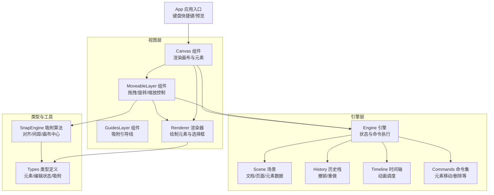

图表来源
- [Canvas.tsx:1-128](file://src/components/Canvas.tsx#L1-L128)
- [MoveableLayer.tsx:15-188](file://src/components/MoveableLayer.tsx#L15-L188)
- [GuidesLayer.tsx:19-65](file://src/components/GuidesLayer.tsx#L19-L65)
- [renderer/index.tsx:189-202](file://src/renderer/index.tsx#L189-L202)
- [engine/engine.ts:7-49](file://src/engine/engine.ts#L7-L49)
- [engine/scene.ts:3-247](file://src/engine/scene.ts#L3-L247)
- [engine/commands.ts:20-44](file://src/engine/commands.ts#L20-L44)
- [engine/snapEngine.ts:242-258](file://src/engine/snapEngine.ts#L242-L258)
- [types/index.ts:144-159](file://src/types/index.ts#L144-L159)
- [App.tsx:107-150](file://src/App.tsx#L107-L150)

章节来源
- [Canvas.tsx:1-128](file://src/components/Canvas.tsx#L1-L128)
- [engine/engine.ts:7-49](file://src/engine/engine.ts#L7-L49)
- [types/index.ts:144-159](file://src/types/index.ts#L144-L159)

## 核心组件
- Canvas：承载画布容器，负责元素渲染、点击选择、画布空白处取消选择、拖拽放置新元素。
- MoveableLayer：基于 react-moveable 的可编辑层，提供拖拽、旋转、缩放、吸附与引导线展示。
- GuidesLayer：在 MoveableLayer 上叠加显示吸附引导线。
- Renderer：根据元素类型渲染 SVG/文本/图片，并在被选中时绘制选择框。
- Engine：统一的状态管理与命令执行中枢，维护 EditorState 与历史栈。
- Scene：文档/页面/元素的数据层，提供增删改查与动画管理。
- Commands：具体可撤销/重做的命令集合，如 MoveElementCommand。
- SnapEngine：吸附算法，计算对齐/间距/画布中心等偏移与引导线。
- Types：统一的类型定义，包括 EditorState、Element、Guide、SnapResult 等。

章节来源
- [renderer/index.tsx:189-202](file://src/renderer/index.tsx#L189-L202)
- [engine/engine.ts:7-49](file://src/engine/engine.ts#L7-L49)
- [engine/scene.ts:3-247](file://src/engine/scene.ts#L3-L247)
- [engine/commands.ts:20-44](file://src/engine/commands.ts#L20-L44)
- [engine/snapEngine.ts:242-258](file://src/engine/snapEngine.ts#L242-L258)
- [types/index.ts:144-159](file://src/types/index.ts#L144-L159)

## 架构总览
元素选择与编辑的端到端流程如下：
- 用户点击元素或画布空白区域触发选择状态变更
- Renderer 根据 EditorState.selectedElementIds 决定是否渲染选择框
- MoveableLayer 基于选中元素集合更新目标，显示控制框与控制点
- 拖拽/旋转/缩放过程中通过 SnapEngine 计算吸附偏移，实时更新引导线
- 执行 MoveElementCommand 将最终状态写入 Scene 并入历史栈

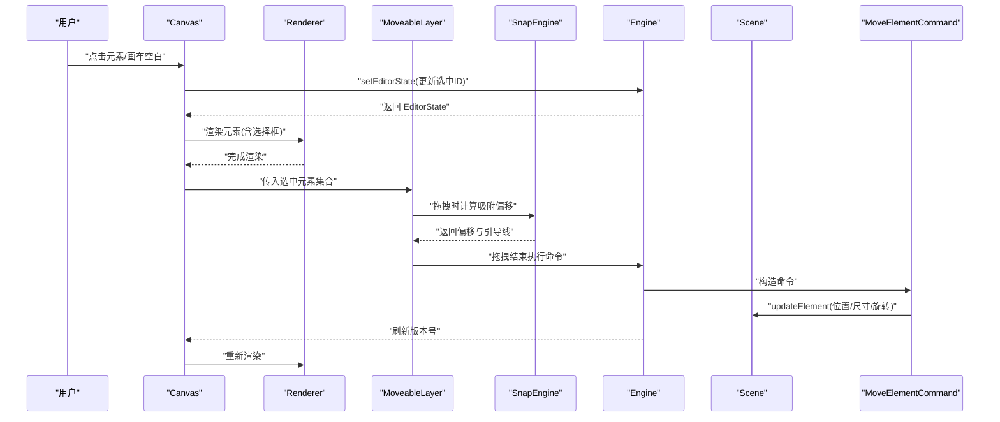

图表来源
- [Canvas.tsx:71-90](file://src/components/Canvas.tsx#L71-L90)
- [renderer/index.tsx:189-202](file://src/renderer/index.tsx#L189-L202)
- [MoveableLayer.tsx:24-35](file://src/components/MoveableLayer.tsx#L24-L35)
- [MoveableLayer.tsx:61-110](file://src/components/MoveableLayer.tsx#L61-L110)
- [engine/snapEngine.ts:242-258](file://src/engine/snapEngine.ts#L242-L258)
- [engine/engine.ts:29-32](file://src/engine/engine.ts#L29-L32)
- [engine/commands.ts:20-44](file://src/engine/commands.ts#L20-L44)

## 详细组件分析

### Canvas 组件：元素点击选择与画布取消选择
- handleElementClick：接收元素 ID，调用 Engine.setEditorState 将其设为唯一选中，随后触发 onRefresh 刷新。
- handleCanvasPointerDown：当 PointerDown 且未命中元素或 Moveable 控制框时，清空选中列表，实现“点击空白取消选择”。

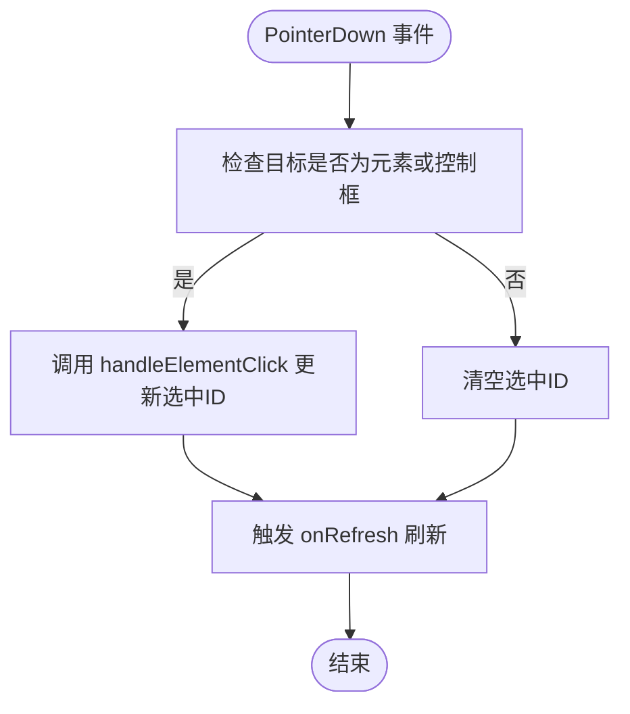

图表来源
- [Canvas.tsx:71-90](file://src/components/Canvas.tsx#L71-L90)

章节来源
- [Canvas.tsx:71-90](file://src/components/Canvas.tsx#L71-L90)

### Renderer：选择状态与视觉反馈
- 渲染函数 renderElement 根据元素类型调用对应渲染器（形状/文本/图片），并在被选中时附加选择框。
- 选择框由 SelectionOutline 组件绘制，使用绝对定位与蓝色边框突出显示当前选中元素。

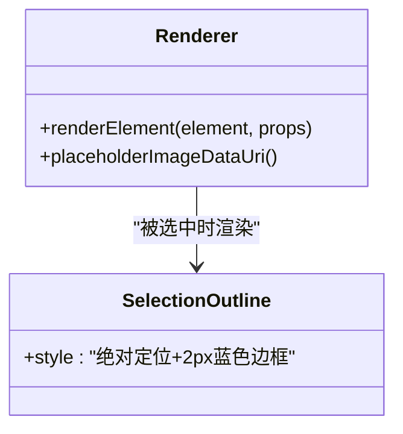

图表来源
- [renderer/index.tsx:189-202](file://src/renderer/index.tsx#L189-L202)
- [renderer/index.tsx:173-187](file://src/renderer/index.tsx#L173-L187)

章节来源
- [renderer/index.tsx:189-202](file://src/renderer/index.tsx#L189-L202)
- [renderer/index.tsx:173-187](file://src/renderer/index.tsx#L173-L187)

### MoveableLayer：集成与控制点
- 目标绑定：根据 EditorState.selectedElementIds 在容器内查询对应 DOM，设置为 Moveable 的 target。
- 编辑能力：启用 draggable、rotatable、resizable，origin=false、keepRatio=false。
- 事件链路：
  - onDragStart/onDrag/onDragEnd：记录起始位置，计算吸附偏移，预应用 transform/left/top，最终执行 MoveElementCommand。
  - onRotateStart/onRotate/onRotateEnd：实时更新 transform，结束后持久化旋转值。
  - onResizeStart/onResize/onResizeEnd：更新宽高与 transform，结束后持久化位置与尺寸。
- 同步更新：useEffect 监听版本号，必要时调用 updateRect 以同步外部状态变化（撤销/重做/属性面板）。

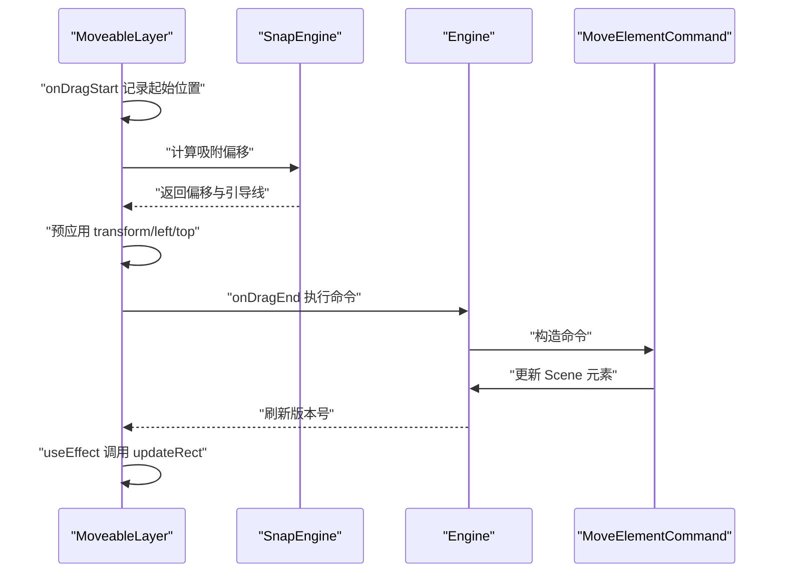

图表来源
- [MoveableLayer.tsx:54-111](file://src/components/MoveableLayer.tsx#L54-L111)
- [MoveableLayer.tsx:119-134](file://src/components/MoveableLayer.tsx#L119-L134)
- [MoveableLayer.tsx:147-183](file://src/components/MoveableLayer.tsx#L147-L183)
- [engine/snapEngine.ts:242-258](file://src/engine/snapEngine.ts#L242-L258)
- [engine/engine.ts:29-32](file://src/engine/engine.ts#L29-L32)
- [engine/commands.ts:20-44](file://src/engine/commands.ts#L20-L44)

章节来源
- [MoveableLayer.tsx:15-188](file://src/components/MoveableLayer.tsx#L15-L188)
- [engine/snapEngine.ts:242-258](file://src/engine/snapEngine.ts#L242-L258)
- [engine/commands.ts:20-44](file://src/engine/commands.ts#L20-L44)

### GuidesLayer：吸附引导线
- 接收 MoveableLayer 传递的 Guide 数组，按水平/垂直方向绘制不同颜色的引导线，用于可视化吸附结果。
- 透明度与层级确保不遮挡内容，仅作为视觉提示。

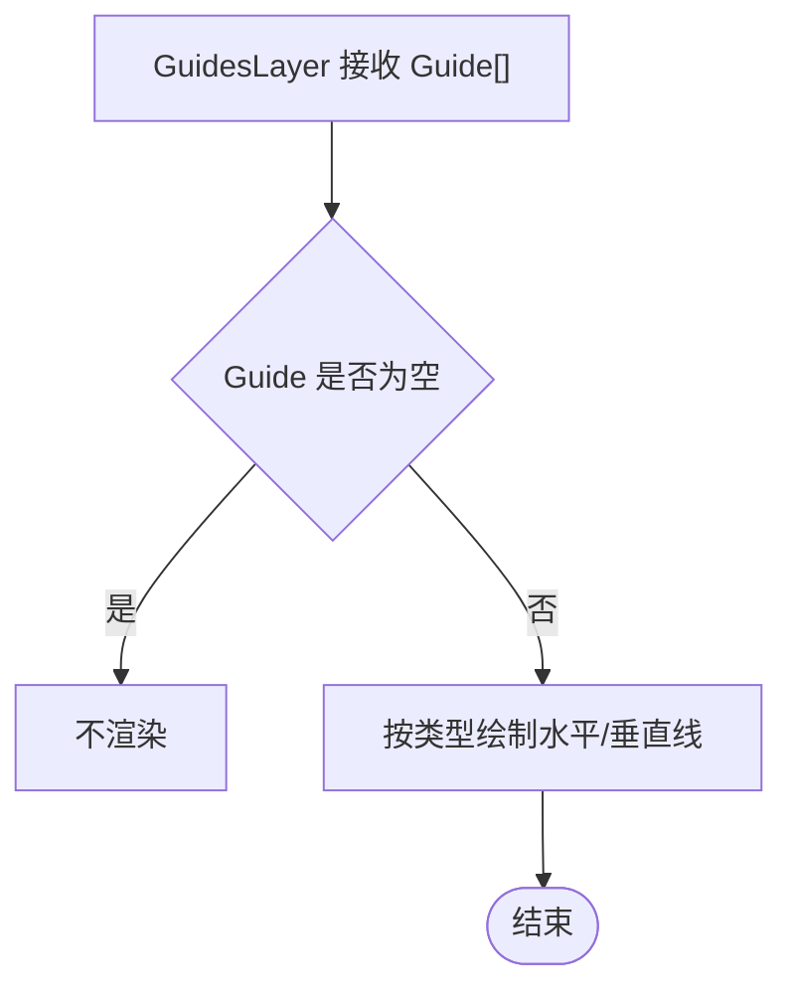

图表来源
- [GuidesLayer.tsx:19-65](file://src/components/GuidesLayer.tsx#L19-L65)

章节来源
- [GuidesLayer.tsx:19-65](file://src/components/GuidesLayer.tsx#L19-L65)

### Engine 与 Scene：状态与数据
- Engine：持有 EditorState（包含 selectedElementIds）、Scene、History、Timeline；提供 setEditorState、execute、undo、redo。
- Scene：封装文档/页面/元素的增删改查与动画管理，支持父子关系维护与结构重排。

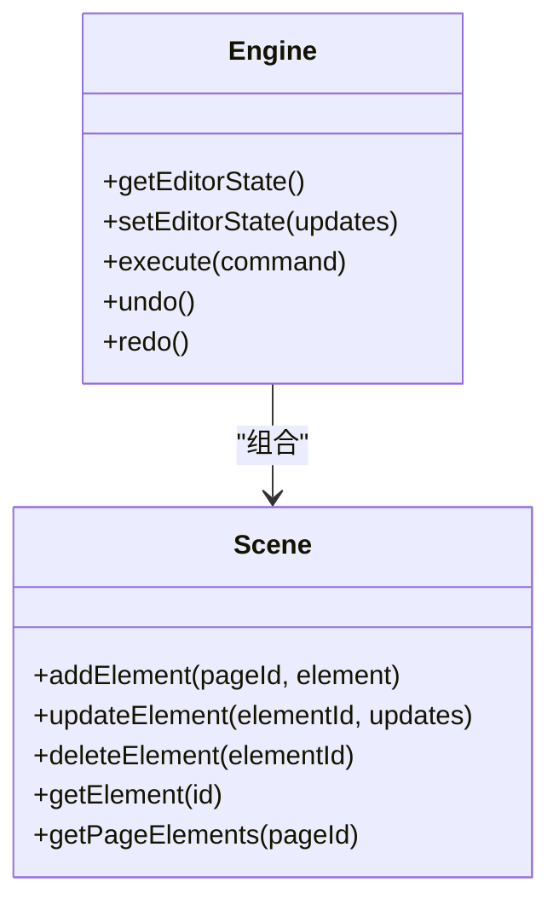

图表来源
- [engine/engine.ts:7-49](file://src/engine/engine.ts#L7-L49)
- [engine/scene.ts:94-159](file://src/engine/scene.ts#L94-L159)

章节来源
- [engine/engine.ts:7-49](file://src/engine/engine.ts#L7-L49)
- [engine/scene.ts:94-159](file://src/engine/scene.ts#L94-L159)

### 命令与历史：MoveElementCommand
- MoveElementCommand 在执行时记录元素修改前的状态，以便撤销时恢复；执行后更新 Scene 对应元素属性。

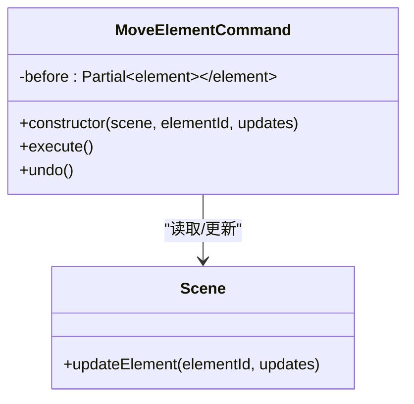

图表来源
- [engine/commands.ts:20-44](file://src/engine/commands.ts#L20-L44)
- [engine/scene.ts:108-135](file://src/engine/scene.ts#L108-L135)

章节来源
- [engine/commands.ts:20-44](file://src/engine/commands.ts#L20-L44)
- [engine/scene.ts:108-135](file://src/engine/scene.ts#L108-L135)

### 吸附算法：SnapEngine
- 输入：当前矩形、其他矩形、画布尺寸、阈值
- 输出：新的 x/y 与 Guide[]（水平/垂直、边缘/中心/间距）
- 算法优先级：中心对齐 > 边缘对齐 > 等间距（分布/延续）
- 导出：用于 MoveableLayer 的拖拽过程，实时更新偏移与引导线

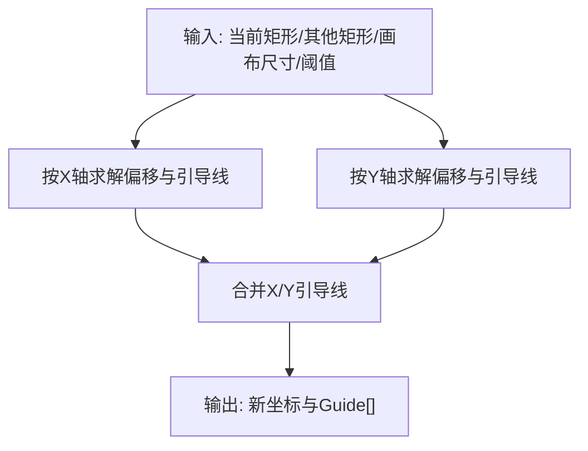

图表来源
- [engine/snapEngine.ts:242-258](file://src/engine/snapEngine.ts#L242-L258)
- [engine/snapEngine.ts:158-240](file://src/engine/snapEngine.ts#L158-L240)

章节来源
- [engine/snapEngine.ts:242-258](file://src/engine/snapEngine.ts#L242-L258)
- [engine/snapEngine.ts:158-240](file://src/engine/snapEngine.ts#L158-L240)

### 键盘快捷键与批量操作
- Ctrl/Cmd+Z：撤销（若可撤销）
- Ctrl/Cmd+Shift+Z 或 Ctrl/Cmd+Y：重做（若可重做）
- Delete/Backspace：删除当前选中元素（需确保焦点不在输入控件上）
- 可扩展：可在 App 的键盘监听中增加多选（如 Shift+点击）或批量操作（如 Ctrl+A 全选）

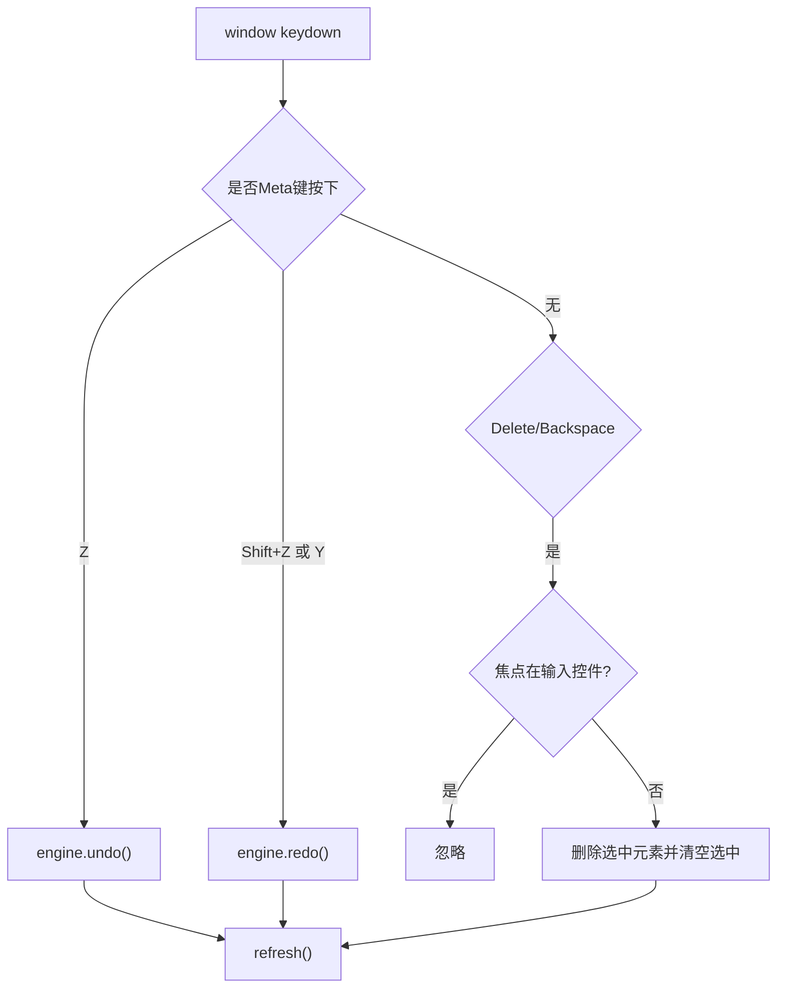

图表来源
- [App.tsx:107-150](file://src/App.tsx#L107-L150)

章节来源
- [App.tsx:107-150](file://src/App.tsx#L107-L150)

## 依赖关系分析
- Canvas 依赖 Engine 提供 EditorState 与命令执行；依赖 Renderer 渲染元素；依赖 MoveableLayer 展示控制框。
- MoveableLayer 依赖 Engine 执行命令；依赖 SnapEngine 计算吸附；依赖 GuidesLayer 显示引导线。
- Engine 依赖 Scene 进行数据操作；依赖 History 实现撤销/重做。
- Renderer 依赖 Types 定义元素类型；依赖 EditorState 判断选中状态。
- App 作为顶层容器，集中处理键盘快捷键与预览开关。

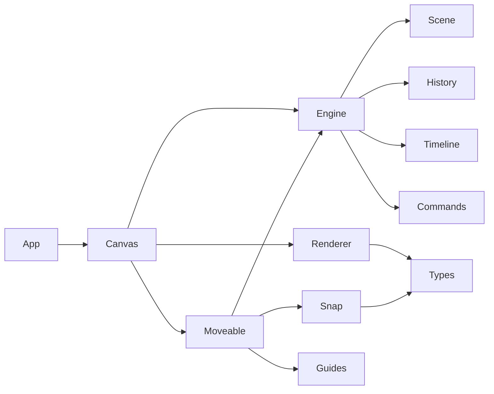

图表来源
- [Canvas.tsx:1-128](file://src/components/Canvas.tsx#L1-L128)
- [MoveableLayer.tsx:15-188](file://src/components/MoveableLayer.tsx#L15-L188)
- [GuidesLayer.tsx:19-65](file://src/components/GuidesLayer.tsx#L19-L65)
- [renderer/index.tsx:189-202](file://src/renderer/index.tsx#L189-L202)
- [engine/engine.ts:7-49](file://src/engine/engine.ts#L7-L49)
- [engine/scene.ts:3-247](file://src/engine/scene.ts#L3-L247)
- [engine/commands.ts:20-44](file://src/engine/commands.ts#L20-L44)
- [engine/snapEngine.ts:242-258](file://src/engine/snapEngine.ts#L242-L258)
- [types/index.ts:144-159](file://src/types/index.ts#L144-L159)
- [App.tsx:107-150](file://src/App.tsx#L107-L150)

章节来源
- [package.json:12-20](file://package.json#L12-L20)

## 性能考量
- 版本号驱动的同步：Canvas 通过 version 与 MoveableLayer 的 useEffect 协同，避免不必要的重绘与重复 updateRect。
- 事件节流：Moveable 的拖拽/旋转/缩放事件频繁触发，建议在业务层进行防抖/节流（当前实现已通过预应用样式减少闪烁）。
- DOM 查询：MoveableLayer 使用容器内查询选中元素，避免全局扫描；SnapEngine 仅对其他矩形进行比较，复杂度与元素数量线性相关。
- 渲染优化：Renderer 仅在被选中时附加选择框，避免额外开销。

[本节为通用性能讨论，无需特定文件来源]

## 故障排除指南
- 无法取消选择
  - 检查 Canvas.handleCanvasPointerDown 是否正确识别非元素/非控制框节点。
  - 确认事件冒泡被阻止（如需要）。
- 选择框不显示
  - 确认 EditorState.selectedElementIds 包含目标元素 ID。
  - 确认 Renderer.renderElement 正确传入 isSelected。
- 拖拽无效或位置异常
  - 检查 MoveableLayer.onDragStart 是否正确记录起始位置。
  - 确认 onDragEnd 后是否执行了 MoveElementCommand 并刷新版本号。
- 吸附不生效
  - 检查 SnapEngine 输入参数（当前矩形、其他矩形、画布尺寸、阈值）。
  - 确认 GuidesLayer 正常接收并渲染 Guide[]。

章节来源
- [Canvas.tsx:79-90](file://src/components/Canvas.tsx#L79-L90)
- [renderer/index.tsx:189-202](file://src/renderer/index.tsx#L189-L202)
- [MoveableLayer.tsx:54-111](file://src/components/MoveableLayer.tsx#L54-L111)
- [engine/snapEngine.ts:242-258](file://src/engine/snapEngine.ts#L242-L258)

## 结论
本系统通过清晰的分层设计实现了稳定的元素选择与编辑体验：
- Canvas 负责选择与取消选择的入口
- Renderer 提供即时的视觉反馈
- MoveableLayer 集成强大的编辑能力与吸附算法
- Engine/Scene/Commands 提供一致的状态与可撤销操作
- App 层统一处理快捷键与全局状态

未来可扩展方向：
- 多选支持：在 Canvas 中扩展 handleElementClick 支持 Shift/Control 多选
- 批量操作：在 Engine 中新增批量命令与批量撤销
- 自定义选择行为：通过 Types 扩展 EditorState 字段，如选择模式、选择过滤器
- 无障碍增强：为选择框添加可访问标签与键盘导航

[本节为总结性内容，无需特定文件来源]

## 附录
- 关键类型与状态
  - EditorState：包含 selectedElementIds、viewport、toolMode、hoveredElementId
  - Element：统一元素接口，包含基础属性与类型字段
  - Guide/SnapResult：吸附结果与引导线定义
- 依赖库
  - react-moveable：提供拖拽/旋转/缩放控制与控制点
  - gsap：动画适配器（用于动画模块）

章节来源
- [types/index.ts:144-159](file://src/types/index.ts#L144-L159)
- [types/index.ts:90-101](file://src/types/index.ts#L90-L101)
- [package.json:12-20](file://package.json#L12-L20)