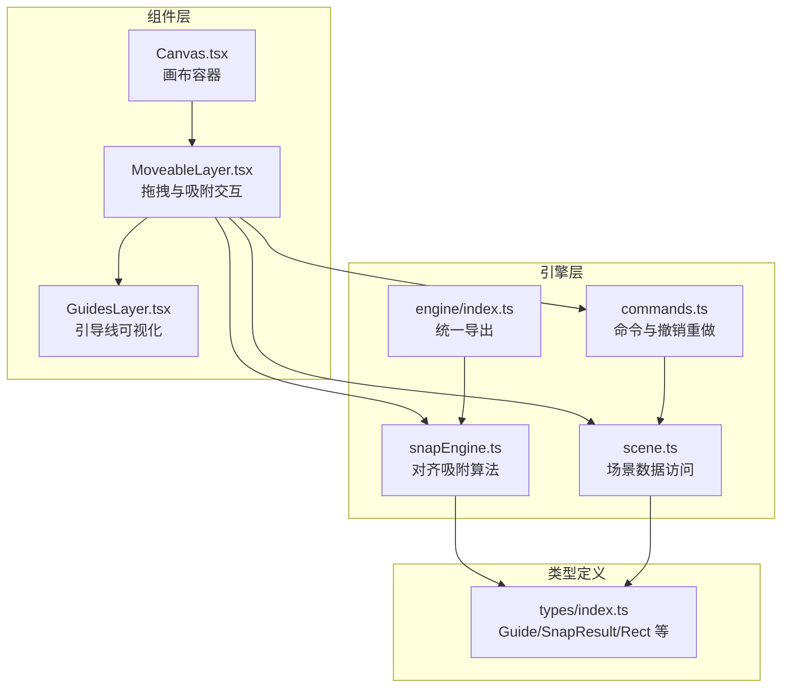
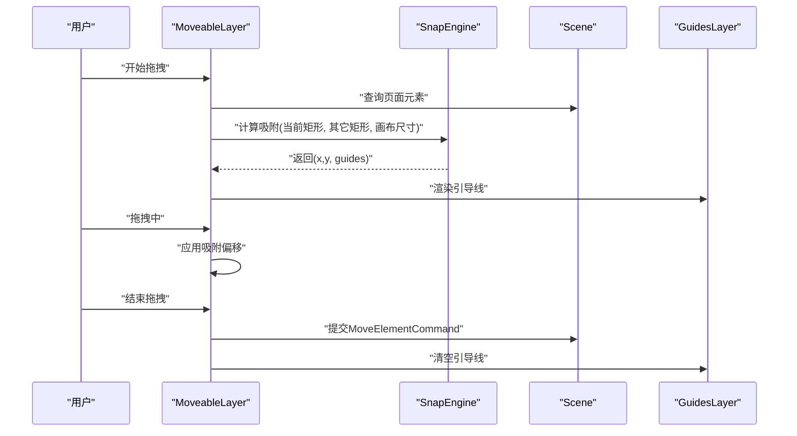
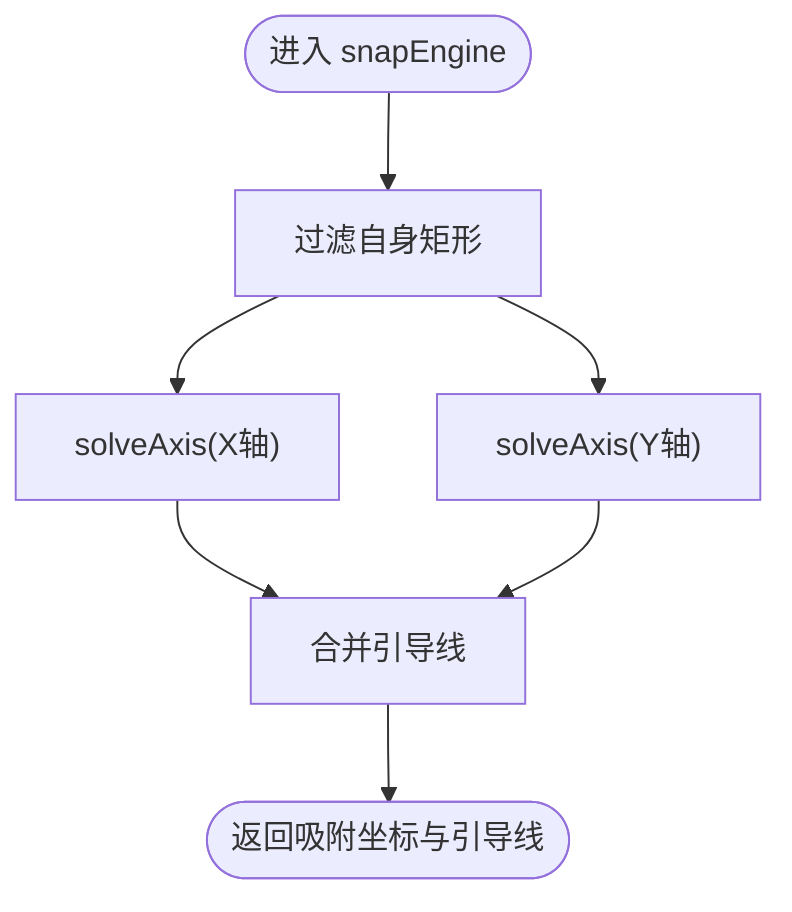
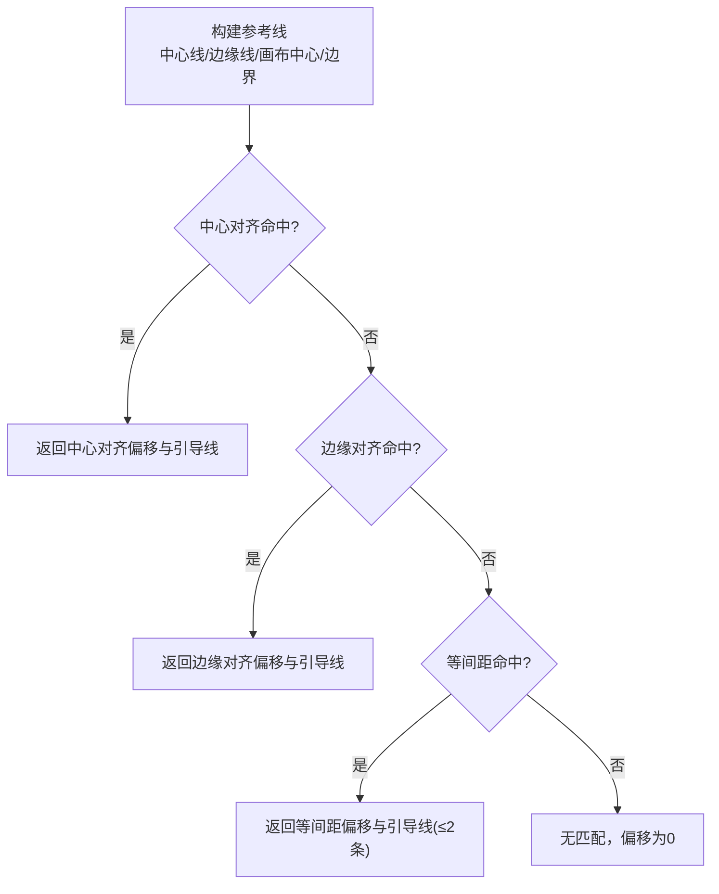
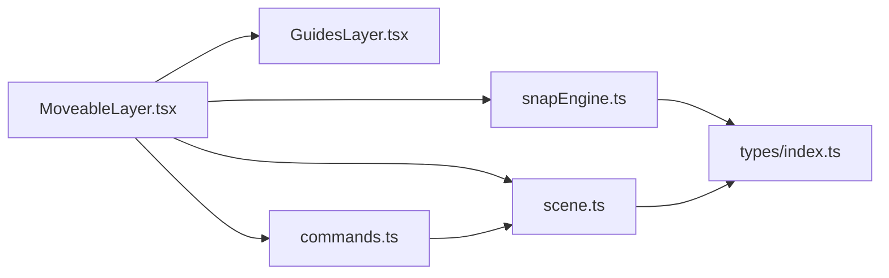

# 对齐吸附引擎

<cite>
**本文引用的文件**
- [src/engine/snapEngine.ts](file://src/engine/snapEngine.ts)
- [src/engine/index.ts](file://src/engine/index.ts)
- [src/components/MoveableLayer.tsx](file://src/components/MoveableLayer.tsx)
- [src/components/GuidesLayer.tsx](file://src/components/GuidesLayer.tsx)
- [src/components/Canvas.tsx](file://src/components/Canvas.tsx)
- [src/types/index.ts](file://src/types/index.ts)
- [src/engine/scene.ts](file://src/engine/scene.ts)
- [src/engine/commands.ts](file://src/engine/commands.ts)
- [package.json](file://package.json)
</cite>

## 目录
1. [简介](#简介)
2. [项目结构](#项目结构)
3. [核心组件](#核心组件)
4. [架构总览](#架构总览)
5. [详细组件分析](#详细组件分析)
6. [依赖关系分析](#依赖关系分析)
7. [性能考量](#性能考量)
8. [故障排查指南](#故障排查指南)
9. [结论](#结论)
10. [附录](#附录)

## 简介
本技术文档围绕对齐吸附引擎（SnapEngine）展开，系统性阐述其算法实现、对齐规则与吸附机制，覆盖元素对齐检测、间距计算与自动吸附流程，并给出配置项、扩展点、自定义规则、性能优化策略以及与前端渲染层的集成方式。目标是帮助开发者在现有架构下快速理解、使用并扩展对齐吸附能力。

## 项目结构
对齐吸附引擎位于引擎子模块中，通过统一导出入口暴露给上层组件使用；吸附结果会驱动可视化引导线层进行实时反馈；拖拽交互由可移动组件层承接并在拖拽过程中调用引擎计算吸附位移。



图表来源
- [src/components/Canvas.tsx:124](file://src/components/Canvas.tsx#L124)
- [src/components/MoveableLayer.tsx:46-186](file://src/components/MoveableLayer.tsx#L46-L186)
- [src/components/GuidesLayer.tsx:19-65](file://src/components/GuidesLayer.tsx#L19-L65)
- [src/engine/snapEngine.ts:242-258](file://src/engine/snapEngine.ts#L242-L258)
- [src/engine/index.ts:8-15](file://src/engine/index.ts#L8-L15)
- [src/engine/scene.ts:161-173](file://src/engine/scene.ts#L161-L173)
- [src/engine/commands.ts:20-44](file://src/engine/commands.ts#L20-L44)
- [src/types/index.ts:90-101](file://src/types/index.ts#L90-L101)

章节来源
- [src/components/Canvas.tsx:124](file://src/components/Canvas.tsx#L124)
- [src/components/MoveableLayer.tsx:46-186](file://src/components/MoveableLayer.tsx#L46-L186)
- [src/components/GuidesLayer.tsx:19-65](file://src/components/GuidesLayer.tsx#L19-L65)
- [src/engine/snapEngine.ts:242-258](file://src/engine/snapEngine.ts#L242-L258)
- [src/engine/index.ts:8-15](file://src/engine/index.ts#L8-L15)
- [src/engine/scene.ts:161-173](file://src/engine/scene.ts#L161-L173)
- [src/engine/commands.ts:20-44](file://src/engine/commands.ts#L20-L44)
- [src/types/index.ts:90-101](file://src/types/index.ts#L90-L101)

## 核心组件
- 对齐吸附引擎（SnapEngine）
  - 输入：当前矩形、其他矩形集合、画布尺寸、吸附阈值
  - 输出：吸附后的坐标与引导线集合
  - 关键接口：snapEngine、Rect、SnapInput、SnapResult、Guide
- 可视化引导线层（GuidesLayer）
  - 根据吸附结果绘制水平/垂直引导线，区分中心对齐、边缘对齐、间距对齐三类
- 拖拽交互层（MoveableLayer）
  - 在拖拽过程中调用引擎计算吸附位移，更新DOM样式并最终提交命令
- 场景数据（Scene）
  - 提供页面元素查询、元素更新等能力，为吸附提供上下文数据
- 命令系统（Commands）
  - 将最终吸附结果以命令形式提交，支持撤销/重做

章节来源
- [src/engine/snapEngine.ts:3-16](file://src/engine/snapEngine.ts#L3-L16)
- [src/engine/snapEngine.ts:242-258](file://src/engine/snapEngine.ts#L242-L258)
- [src/components/GuidesLayer.tsx:7-17](file://src/components/GuidesLayer.tsx#L7-L17)
- [src/components/MoveableLayer.tsx:67-82](file://src/components/MoveableLayer.tsx#L67-L82)
- [src/engine/scene.ts:161-173](file://src/engine/scene.ts#L161-L173)
- [src/engine/commands.ts:20-44](file://src/engine/commands.ts#L20-L44)
- [src/types/index.ts:90-101](file://src/types/index.ts#L90-L101)

## 架构总览
对齐吸附的端到端流程如下：
- 用户在画布上拖拽元素
- MoveableLayer在拖拽事件中收集当前元素与其它元素的矩形信息
- 调用 snapEngine 计算吸附偏移与引导线
- MoveableLayer应用吸附偏移并显示引导线
- 拖拽结束时，将最终位置提交为命令，写入场景状态



图表来源
- [src/components/MoveableLayer.tsx:67-111](file://src/components/MoveableLayer.tsx#L67-L111)
- [src/engine/snapEngine.ts:242-258](file://src/engine/snapEngine.ts#L242-L258)
- [src/engine/scene.ts:161-173](file://src/engine/scene.ts#L161-L173)
- [src/components/GuidesLayer.tsx:19-65](file://src/components/GuidesLayer.tsx#L19-L65)

## 详细组件分析

### SnapEngine 算法实现
- 数据结构
  - Rect：元素矩形（含id、x、y、width、height）
  - SnapInput：输入参数（当前矩形、其它矩形、画布尺寸、阈值）
  - SnapResult：输出结果（吸附后x/y、引导线数组）
  - Guide：引导线（类型：水平/垂直；种类：边缘/中心/间距；位置；来源id）
- 核心流程
  - 过滤自身，构建参考线（中心线、边缘线、画布中心/边界）
  - 优先级策略：中心对齐 → 边缘对齐 → 等间距（分布/延续）
  - 对每个轴分别求解，合并结果
- 关键函数
  - dedupSnapLines：去重参考线
  - findSnap：在阈值内寻找最佳对齐偏移
  - findEqualSpacing：计算等间距（分布/延续），仅检查相邻元素
  - solveAxis：按轴求解（x/y），返回偏移与引导线
  - snapEngine：整合两轴结果，返回最终吸附坐标与引导线



图表来源
- [src/engine/snapEngine.ts:242-258](file://src/engine/snapEngine.ts#L242-L258)

章节来源
- [src/engine/snapEngine.ts:3-16](file://src/engine/snapEngine.ts#L3-L16)
- [src/engine/snapEngine.ts:23-33](file://src/engine/snapEngine.ts#L23-L33)
- [src/engine/snapEngine.ts:39-70](file://src/engine/snapEngine.ts#L39-L70)
- [src/engine/snapEngine.ts:77-156](file://src/engine/snapEngine.ts#L77-L156)
- [src/engine/snapEngine.ts:158-240](file://src/engine/snapEngine.ts#L158-L240)
- [src/engine/snapEngine.ts:242-258](file://src/engine/snapEngine.ts#L242-L258)

### 对齐规则与吸附机制
- 中心对齐（优先级1）
  - 当前元素中心与其它元素中心或画布中心的距离小于阈值时触发
  - 返回中心对齐引导线
- 边缘对齐（优先级2）
  - 当前元素左右边缘与其它元素左右边缘或画布左右边缘的距离小于阈值时触发
  - 返回边缘对齐引导线
- 等间距（优先级3）
  - 在X/Y轴上，对相邻元素的间隙进行等间距分布或延续对齐
  - 支持“分布”（居中于相邻元素之间）与“延续”（向左/右延续相同间隙）
  - 结果最多保留两条引导线



图表来源
- [src/engine/snapEngine.ts:158-240](file://src/engine/snapEngine.ts#L158-L240)

章节来源
- [src/engine/snapEngine.ts:158-240](file://src/engine/snapEngine.ts#L158-L240)

### 引导线可视化（GuidesLayer）
- 渲染逻辑
  - 水平引导线：沿top方向绘制，position对应y
  - 垂直引导线：沿left方向绘制，position对应x
  - 不同对齐类型使用不同颜色：中心对齐（绿色）、边缘对齐（蓝色）、间距对齐（琥珀色）
- 显示条件
  - 当吸附结果包含引导线时显示；拖拽结束时清空

章节来源
- [src/components/GuidesLayer.tsx:7-17](file://src/components/GuidesLayer.tsx#L7-L17)
- [src/components/GuidesLayer.tsx:19-65](file://src/components/GuidesLayer.tsx#L19-L65)

### 拖拽交互与吸附集成（MoveableLayer）
- 事件链路
  - onDragStart：记录起始位置
  - onDrag：调用 snapEngine 获取吸附坐标与引导线，应用transform偏移，更新guides
  - onDragEnd：使用吸附后的最终坐标提交 MoveElementCommand，刷新UI
- 数据来源
  - 从 Scene 查询当前页所有元素，排除当前元素作为参考
  - 画布尺寸固定为960×540（可在调用处调整）

章节来源
- [src/components/MoveableLayer.tsx:46-186](file://src/components/MoveableLayer.tsx#L46-L186)
- [src/engine/scene.ts:161-173](file://src/engine/scene.ts#L161-L173)

### 类型与数据模型
- Guide：引导线类型与属性
- SnapResult：吸附结果
- Rect/SnapInput：吸附输入数据结构
- 元素类型：BaseElement/ShapeElement/TextElement/ImageElement/GroupElement

```mermaid
classDiagram
class Guide {
+type : "horizontal"|"vertical"
+kind : "edge"|"center"|"spacing"
+position : number
+sourceId : string
}
class SnapResult {
+x : number
+y : number
+guides : Guide[]
}
class Rect {
+id : string
+x : number
+y : number
+width : number
+height : number
}
class SnapInput {
+currentRect : Rect
+otherRects : Rect[]
+canvasSize : {width : number, height : number}
+threshold : number
}
```

图表来源
- [src/types/index.ts:90-101](file://src/types/index.ts#L90-L101)
- [src/engine/snapEngine.ts:3-16](file://src/engine/snapEngine.ts#L3-L16)

章节来源
- [src/types/index.ts:90-101](file://src/types/index.ts#L90-L101)
- [src/engine/snapEngine.ts:3-16](file://src/engine/snapEngine.ts#L3-L16)

## 依赖关系分析
- 组件耦合
  - MoveableLayer 依赖 SnapEngine 与 Scene，负责事件采集与命令提交
  - GuidesLayer 仅依赖 Guide 列表，与引擎解耦
- 外部依赖
  - react-moveable：提供拖拽、旋转、缩放交互
  - 类型与工具：React、TypeScript



图表来源
- [src/components/MoveableLayer.tsx:4-6](file://src/components/MoveableLayer.tsx#L4-L6)
- [src/engine/snapEngine.ts:1-1](file://src/engine/snapEngine.ts#L1-L1)
- [src/engine/scene.ts:1-1](file://src/engine/scene.ts#L1-L1)
- [src/components/GuidesLayer.tsx:1-1](file://src/components/GuidesLayer.tsx#L1-L1)
- [src/engine/commands.ts:1-2](file://src/engine/commands.ts#L1-L2)
- [src/types/index.ts:1-2](file://src/types/index.ts#L1-L2)

章节来源
- [src/components/MoveableLayer.tsx:4-6](file://src/components/MoveableLayer.tsx#L4-L6)
- [src/engine/snapEngine.ts:1-1](file://src/engine/snapEngine.ts#L1-L1)
- [src/engine/scene.ts:1-1](file://src/engine/scene.ts#L1-L1)
- [src/components/GuidesLayer.tsx:1-1](file://src/components/GuidesLayer.tsx#L1-L1)
- [src/engine/commands.ts:1-2](file://src/engine/commands.ts#L1-L2)
- [src/types/index.ts:1-2](file://src/types/index.ts#L1-L2)
- [package.json:12-32](file://package.json#L12-L32)

## 性能考量
- 时间复杂度
  - findEqualSpacing：对n个元素按轴排序后O(n)，适合相邻元素等间距检测
  - findSnap：对参考线遍历，整体近似O(n)
  - solveAxis：两轴独立求解，整体近似O(n)
- 优化建议
  - 缓存参考线：若元素未变化，可复用中心线/边缘线集合
  - 阈值调优：根据画布缩放与像素精度动态调整阈值
  - 引导线裁剪：限制每轴引导线数量，避免过多渲染
  - 采样频率：在高频拖拽事件中节流/防抖引擎调用
  - 数据过滤：仅在选中元素拖拽时启用吸附，减少无关计算

[本节为通用性能指导，不直接分析具体文件]

## 故障排查指南
- 拖拽无吸附效果
  - 检查 MoveableLayer 是否正确传入 otherRects 与 canvasSize
  - 确认 snapEngine 的阈值是否过大导致无法命中
- 引导线不显示
  - 确认 onDrag 中是否设置 guides
  - 检查 GuidesLayer 是否接收到了非空的 guides 数组
- 拖拽结束后位置异常
  - 确认 onDragEnd 使用了吸附后的最终坐标
  - 检查命令提交是否成功且未被后续操作覆盖
- 自身吸附问题
  - 确认过滤自身矩形的逻辑是否生效

章节来源
- [src/components/MoveableLayer.tsx:67-111](file://src/components/MoveableLayer.tsx#L67-L111)
- [src/components/GuidesLayer.tsx:19-65](file://src/components/GuidesLayer.tsx#L19-L65)
- [src/engine/snapEngine.ts:245-246](file://src/engine/snapEngine.ts#L245-L246)

## 结论
对齐吸附引擎采用“中心对齐 → 边缘对齐 → 等间距”的优先级策略，结合阈值控制与引导线可视化，实现了直观、高效的布局对齐体验。通过清晰的接口与解耦的组件设计，既便于集成到现有拖拽框架中，也为后续扩展新的对齐类型与算法提供了良好基础。

[本节为总结性内容，不直接分析具体文件]

## 附录

### 配置选项与使用要点
- 阈值（threshold）
  - 控制吸附触发的容差范围，默认值在引擎内部设定
  - 可在调用 snapEngine 时传入自定义阈值
- 画布尺寸（canvasSize）
  - 用于画布中心/边界的参考线生成
  - MoveableLayer 示例中固定为960×540，可根据实际画布调整
- 引导线颜色与类型
  - 中心对齐：绿色
  - 边缘对齐：蓝色
  - 间距对齐：琥珀色

章节来源
- [src/engine/snapEngine.ts:243-243](file://src/engine/snapEngine.ts#L243-L243)
- [src/components/MoveableLayer.tsx:68-72](file://src/components/MoveableLayer.tsx#L68-L72)
- [src/components/GuidesLayer.tsx:7-17](file://src/components/GuidesLayer.tsx#L7-L17)

### 扩展与定制
- 新增对齐类型
  - 在 solveAxis 中增加新的参考线与匹配逻辑，并在 findSnap 或专用函数中实现
  - 返回新的 Guide.kind 并在 GuidesLayer 中添加对应颜色
- 自定义对齐规则
  - 调整阈值、参考线来源（如网格、对角线等）
  - 在 MoveableLayer 中注入额外的参考元素集合
- 集成其他对齐算法
  - 将新算法封装为独立函数，保持与现有 findSnap/findEqualSpacing 的一致返回格式
  - 在 solveAxis 的优先级顺序中插入新规则

章节来源
- [src/engine/snapEngine.ts:158-240](file://src/engine/snapEngine.ts#L158-L240)
- [src/components/GuidesLayer.tsx:7-17](file://src/components/GuidesLayer.tsx#L7-L17)
- [src/components/MoveableLayer.tsx:37-42](file://src/components/MoveableLayer.tsx#L37-L42)

### 对齐精度与用户体验
- 精度控制
  - 通过阈值与去重逻辑保证吸附稳定，避免频繁抖动
  - 对等间距结果限制引导线数量，提升视觉清晰度
- 视觉指示器
  - 引导线颜色与类型明确区分对齐方式
  - 拖拽过程中的实时反馈降低认知负担
- 交互优化
  - 拖拽结束时预应用最终坐标，避免视觉回弹
  - 仅在必要时启用吸附，减少不必要的计算

章节来源
- [src/engine/snapEngine.ts:23-33](file://src/engine/snapEngine.ts#L23-L33)
- [src/engine/snapEngine.ts:225-226](file://src/engine/snapEngine.ts#L225-L226)
- [src/components/MoveableLayer.tsx:94-99](file://src/components/MoveableLayer.tsx#L94-L99)
- [src/components/GuidesLayer.tsx:19-65](file://src/components/GuidesLayer.tsx#L19-L65)