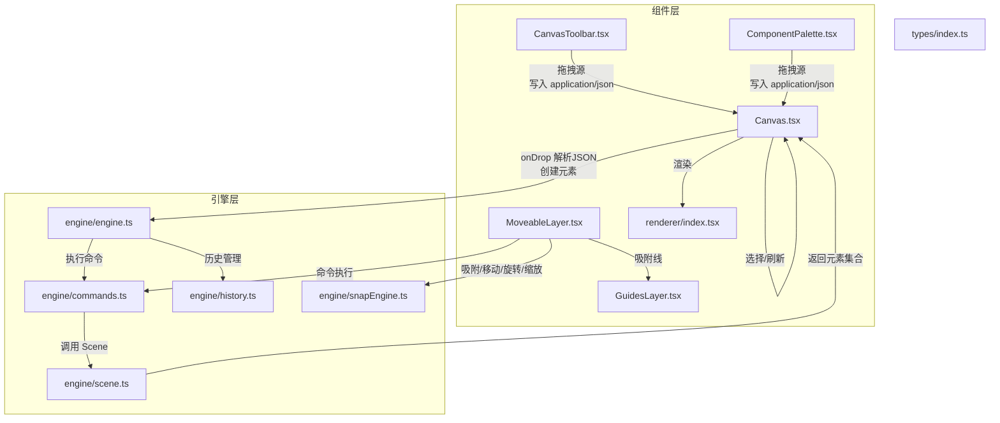
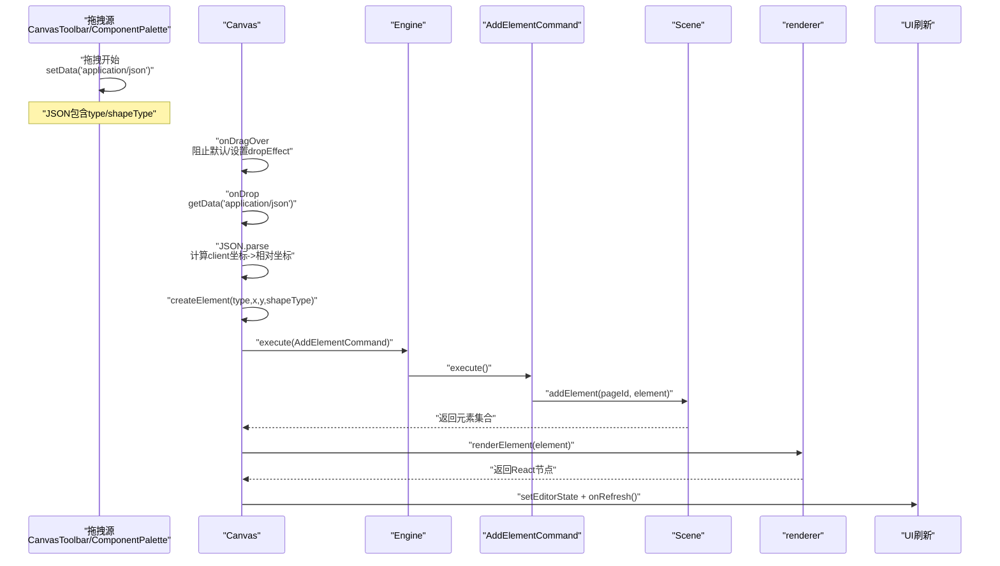
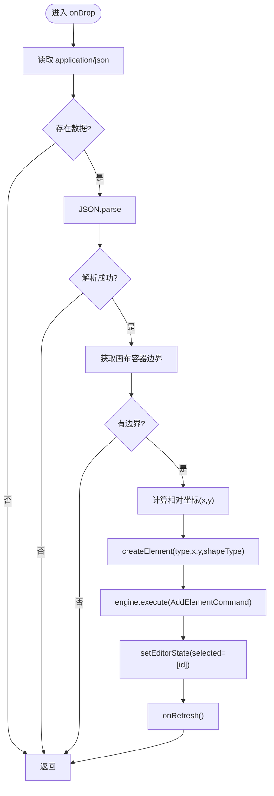
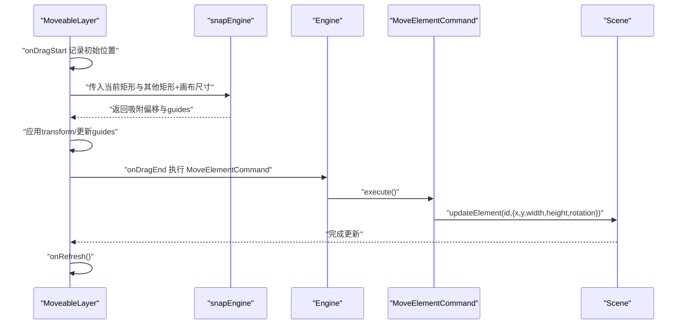
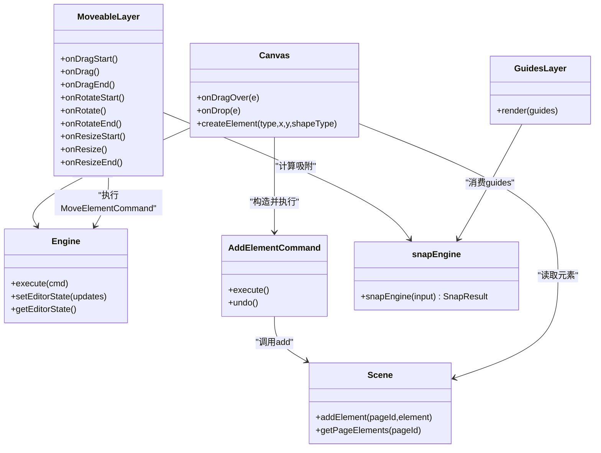

# 拖拽交互

<cite>
**本文引用的文件列表**
- [Canvas.tsx](file://src/components/Canvas.tsx)
- [CanvasToolbar.tsx](file://src/components/CanvasToolbar.tsx)
- [ComponentPalette.tsx](file://src/components/ComponentPalette.tsx)
- [MoveableLayer.tsx](file://src/components/MoveableLayer.tsx)
- [GuidesLayer.tsx](file://src/components/GuidesLayer.tsx)
- [renderer/index.tsx](file://src/renderer/index.tsx)
- [engine/scene.ts](file://src/engine/scene.ts)
- [engine/engine.ts](file://src/engine/engine.ts)
- [engine/commands.ts](file://src/engine/commands.ts)
- [engine/history.ts](file://src/engine/history.ts)
- [engine/snapEngine.ts](file://src/engine/snapEngine.ts)
- [types/index.ts](file://src/types/index.ts)
</cite>

## 目录
1. [简介](#简介)
2. [项目结构与职责划分](#项目结构与职责划分)
3. [核心组件与交互流程](#核心组件与交互流程)
4. [架构总览](#架构总览)
5. [详细组件解析](#详细组件解析)
6. [依赖关系分析](#依赖关系分析)
7. [性能与可扩展性](#性能与可扩展性)
8. [故障排查指南](#故障排查指南)
9. [结论](#结论)

## 简介
本技术文档聚焦于 Canvas 组件中的“拖拽放置”实现机制，系统性阐述从拖拽源（工具栏/组件板）到画布目标区域的完整流程：事件处理、数据传输格式、坐标转换与位置计算、元素类型识别、边界检测与吸附、命令执行与状态更新、视觉反馈与错误处理策略，并给出扩展点、自定义行为实现与性能优化建议，同时覆盖跨浏览器与移动端适配思路。

## 项目结构与职责划分
- 组件层
  - Canvas：承载画布容器、接收拖放事件、渲染元素、触发选择与刷新。
  - CanvasToolbar/ComponentPalette：提供拖拽源，封装拖拽数据写入。
  - MoveableLayer：基于 react-moveable 的可选中/可拖拽/可旋转/可缩放交互层，负责元素的移动、旋转、缩放与吸附。
  - GuidesLayer：吸附引导线可视化层。
  - renderer：元素渲染器，负责将元素映射为 React/SVG/DOM 结构并提供选择框等视觉反馈。
- 引擎层
  - Engine：统一的状态变更入口，封装命令执行、历史栈与编辑态。
  - Scene：文档/页面/元素的数据模型与 CRUD。
  - 命令集：AddElementCommand、MoveElementCommand 等，保证可撤销/重做。
  - History：命令历史栈。
  - snapEngine：吸附算法，提供对齐/居中/间距等吸附结果。
- 类型系统
  - types/index.ts：定义 Element、ShapeElement、TextElement、ImageElement 等类型与 EditorState、Viewport、ToolMode 等编辑态。

图表来源
- [Canvas.tsx:39-69](file://src/components/Canvas.tsx#L39-L69)
- [CanvasToolbar.tsx:19-26](file://src/components/CanvasToolbar.tsx#L19-L26)
- [ComponentPalette.tsx:19-26](file://src/components/ComponentPalette.tsx#L19-L26)
- [engine/engine.ts:29-32](file://src/engine/engine.ts#L29-L32)
- [engine/commands.ts:4-18](file://src/engine/commands.ts#L4-L18)
- [engine/scene.ts:94-106](file://src/engine/scene.ts#L94-L106)
- [engine/snapEngine.ts:242-258](file://src/engine/snapEngine.ts#L242-L258)
- [renderer/index.tsx:189-202](file://src/renderer/index.tsx#L189-L202)
- [MoveableLayer.tsx:46-183](file://src/components/MoveableLayer.tsx#L46-L183)
- [GuidesLayer.tsx:19-65](file://src/components/GuidesLayer.tsx#L19-L65)

章节来源
- [Canvas.tsx:22-128](file://src/components/Canvas.tsx#L22-L128)
- [types/index.ts:10-54](file://src/types/index.ts#L10-L54)

## 核心组件与交互流程
- 拖拽源（工具栏/组件板）
  - 在拖拽开始时，将元素类型信息序列化为 JSON 并写入 dataTransfer，格式包含 type 与 shapeType（当 type 为 shape 时）。
- 画布目标区域
  - onDragOver 阻止默认行为并设置 dropEffect；onDrop 读取 application/json 数据，进行 JSON 解析与校验，计算鼠标在画布内的相对坐标，创建元素并执行命令，更新编辑态与刷新视图。
- 元素创建
  - 根据 type 分支创建不同类型的元素对象，设置基础属性与默认尺寸/样式。
- 命令执行与状态更新
  - 通过 Engine.execute 执行 AddElementCommand，写入历史栈；更新选中元素 ID 并触发 onRefresh。
- 视觉反馈
  - renderer 渲染元素并绘制选择框；MoveableLayer 提供拖拽/旋转/缩放控制与吸附线；GuidesLayer 展示吸附线。

章节来源
- [CanvasToolbar.tsx:19-26](file://src/components/CanvasToolbar.tsx#L19-L26)
- [ComponentPalette.tsx:19-26](file://src/components/ComponentPalette.tsx#L19-L26)
- [Canvas.tsx:39-69](file://src/components/Canvas.tsx#L39-L69)
- [Canvas.tsx:130-191](file://src/components/Canvas.tsx#L130-L191)
- [engine/engine.ts:29-32](file://src/engine/engine.ts#L29-L32)
- [engine/commands.ts:4-18](file://src/engine/commands.ts#L4-L18)
- [renderer/index.tsx:189-202](file://src/renderer/index.tsx#L189-L202)
- [MoveableLayer.tsx:46-183](file://src/components/MoveableLayer.tsx#L46-L183)
- [GuidesLayer.tsx:19-65](file://src/components/GuidesLayer.tsx#L19-L65)

## 架构总览
下图展示从拖拽源到画布落点的关键交互路径与数据流。

图表来源
- [CanvasToolbar.tsx:19-26](file://src/components/CanvasToolbar.tsx#L19-L26)
- [ComponentPalette.tsx:19-26](file://src/components/ComponentPalette.tsx#L19-L26)
- [Canvas.tsx:39-69](file://src/components/Canvas.tsx#L39-L69)
- [Canvas.tsx:130-191](file://src/components/Canvas.tsx#L130-L191)
- [engine/engine.ts:29-32](file://src/engine/engine.ts#L29-L32)
- [engine/commands.ts:4-18](file://src/engine/commands.ts#L4-L18)
- [engine/scene.ts:94-106](file://src/engine/scene.ts#L94-L106)
- [renderer/index.tsx:189-202](file://src/renderer/index.tsx#L189-L202)

## 详细组件解析

### Canvas 组件：拖拽放置实现
- 事件处理
  - onDragOver：阻止默认行为并设置 dropEffect 为 copy，确保拖放行为被允许。
  - onDrop：读取 application/json，解析为 { type, shapeType? }，若无数据或解析失败则直接返回。
- 坐标转换与位置计算
  - 获取画布容器的边界矩形，使用 e.clientX/Y 减去 rect.left/top 得到相对坐标 (x, y)。
- 元素类型识别与创建
  - createElement 根据 type 创建 ShapeElement、TextElement 或 ImageElement，并设置默认宽高、颜色、文本等。
- 命令执行与状态更新
  - 使用 AddElementCommand 将元素添加到当前页；更新选中元素 ID；触发 onRefresh 刷新视图。
- 错误处理
  - 对空数据、JSON 解析异常进行早返回；对无容器边界的情况进行保护性返回。

图表来源
- [Canvas.tsx:44-69](file://src/components/Canvas.tsx#L44-L69)
- [Canvas.tsx:130-191](file://src/components/Canvas.tsx#L130-L191)

章节来源
- [Canvas.tsx:39-69](file://src/components/Canvas.tsx#L39-L69)
- [Canvas.tsx:130-191](file://src/components/Canvas.tsx#L130-L191)

### 拖拽源：CanvasToolbar 与 ComponentPalette
- 拖拽源负责在拖拽开始时将元素元信息写入 dataTransfer：
  - 写入 MIME 类型 application/json；
  - 内容包含 type 与 shapeType（当 type 为 shape 时）；
  - 设置 effectAllowed 为 copy，明确拖放语义。

章节来源
- [CanvasToolbar.tsx:19-26](file://src/components/CanvasToolbar.tsx#L19-L26)
- [ComponentPalette.tsx:19-26](file://src/components/ComponentPalette.tsx#L19-L26)

### 元素渲染与选择反馈
- renderer.renderElement 根据元素类型分别渲染 Shape、Text、Image，并为选中元素绘制蓝色外框。
- 通过 data-element-id 属性与 MoveableLayer 协作，实现选择与交互同步。

章节来源
- [renderer/index.tsx:189-202](file://src/renderer/index.tsx#L189-L202)
- [renderer/index.tsx:75-91](file://src/renderer/index.tsx#L75-L91)
- [renderer/index.tsx:110-124](file://src/renderer/index.tsx#L110-L124)
- [renderer/index.tsx:134-159](file://src/renderer/index.tsx#L134-L159)

### 可选中/拖拽/吸附交互层：MoveableLayer 与 GuidesLayer
- MoveableLayer
  - 通过 react-moveable 提供拖拽、旋转、缩放能力；
  - onDrag/onDragEnd/onRotate/onResize 等回调中，结合 snapEngine 进行吸附计算，实时更新吸附线与元素位置；
  - 最终通过 MoveElementCommand 更新场景元素属性并触发刷新。
- GuidesLayer
  - 根据吸附结果绘制水平/垂直吸附线，区分中心、边缘、间距三类，颜色不同以示区分。

图表来源
- [MoveableLayer.tsx:46-183](file://src/components/MoveableLayer.tsx#L46-L183)
- [engine/snapEngine.ts:242-258](file://src/engine/snapEngine.ts#L242-L258)
- [engine/commands.ts:20-44](file://src/engine/commands.ts#L20-L44)
- [engine/scene.ts:108-135](file://src/engine/scene.ts#L108-L135)

章节来源
- [MoveableLayer.tsx:46-183](file://src/components/MoveableLayer.tsx#L46-L183)
- [GuidesLayer.tsx:19-65](file://src/components/GuidesLayer.tsx#L19-L65)
- [engine/snapEngine.ts:242-258](file://src/engine/snapEngine.ts#L242-L258)

### 命令模式与历史管理
- AddElementCommand/MoveElementCommand/DeleteElementCommand 等命令封装了具体操作与撤销逻辑；
- Engine.execute 负责执行命令并将命令压入历史栈；
- History 提供 undo/redo 能力，支持撤销/重做。

章节来源
- [engine/commands.ts:4-18](file://src/engine/commands.ts#L4-L18)
- [engine/commands.ts:20-44](file://src/engine/commands.ts#L20-L44)
- [engine/engine.ts:29-48](file://src/engine/engine.ts#L29-L48)
- [engine/history.ts:3-44](file://src/engine/history.ts#L3-L44)

### 数据模型与类型系统
- Element/ShapeElement/TextElement/ImageElement 定义了元素的结构与字段；
- EditorState/Viewport/ToolMode 描述编辑态与视口状态；
- Scene/Page/Document 提供文档与页面的数据模型。

章节来源
- [types/index.ts:10-54](file://src/types/index.ts#L10-L54)
- [types/index.ts:136-149](file://src/types/index.ts#L136-L149)
- [engine/scene.ts:3-247](file://src/engine/scene.ts#L3-L247)

## 依赖关系分析
- Canvas 依赖
  - 引擎：Engine.execute、Scene.getPageElements、EditorState；
  - 渲染器：renderElement；
  - 命令：AddElementCommand；
  - 类型：Element/ShapeElement/TextElement/ImageElement。
- MoveableLayer 依赖
  - snapEngine：吸附算法；
  - 命令：MoveElementCommand；
  - 类型：Guide/SnapResult。
- GuidesLayer 依赖
  - Guide 类型与颜色映射。

图表来源
- [Canvas.tsx:44-69](file://src/components/Canvas.tsx#L44-L69)
- [engine/engine.ts:29-32](file://src/engine/engine.ts#L29-L32)
- [engine/commands.ts:4-18](file://src/engine/commands.ts#L4-L18)
- [engine/scene.ts:94-106](file://src/engine/scene.ts#L94-L106)
- [MoveableLayer.tsx:46-183](file://src/components/MoveableLayer.tsx#L46-L183)
- [engine/snapEngine.ts:242-258](file://src/engine/snapEngine.ts#L242-L258)
- [GuidesLayer.tsx:19-65](file://src/components/GuidesLayer.tsx#L19-L65)

章节来源
- [Canvas.tsx:22-128](file://src/components/Canvas.tsx#L22-L128)
- [MoveableLayer.tsx:15-35](file://src/components/MoveableLayer.tsx#L15-L35)

## 性能与可扩展性
- 性能优化建议
  - 拖拽源数据仅包含必要字段（type/shapeType），避免大体积 JSON，降低解析成本。
  - 在 Canvas 中对空数据与无效解析进行早返回，减少后续开销。
  - MoveableLayer 的吸附计算按需触发，避免在高频拖拽中重复计算；可通过节流/防抖进一步优化。
  - 渲染层按需更新：仅在版本号变化或选中状态变化时触发 updateRect，减少不必要的重排。
  - 大量元素场景下，可考虑虚拟化渲染或分页加载。
- 可扩展性
  - 新增元素类型：在 Canvas.createElement 与 renderer.renderElement 中分别新增分支；在命令集中补充对应命令。
  - 自定义吸附规则：扩展 snapEngine 的输入/输出，增加新的吸附优先级或约束。
  - 自定义拖拽行为：在 Canvas 上扩展 onDrag/onDragOver 回调，实现吸附预览、多选拖拽、拖拽预览等。

[本节为通用指导，不直接分析具体文件，故无章节来源]

## 故障排查指南
- 常见问题与定位
  - 拖放无效：检查 onDragOver 是否阻止默认行为且 dropEffect 设置正确；确认 onDrop 能读取到 application/json。
  - JSON 解析失败：确认拖拽源写入的 JSON 结构与 Canvas 期望一致（包含 type/shapeType）。
  - 坐标异常：确认画布容器存在且可获取边界；确保 e.clientX/Y 与 rect.left/top 的差值计算正确。
  - 元素未创建：检查 createElement 的 type 分支与默认属性是否正确；确认 AddElementCommand 已执行且 Scene.addElement 成功。
  - 无法撤销/重做：确认 Engine.execute 已调用且历史栈非空；检查命令的 undo/redo 实现。
- 建议的日志与断点
  - 在 onDrop 开始处打印原始 JSON 字符串与解析后的对象；
  - 在 createElement 前后打印坐标与元素对象；
  - 在命令执行前后打印历史栈长度与元素集合变化。

章节来源
- [Canvas.tsx:39-69](file://src/components/Canvas.tsx#L39-L69)
- [Canvas.tsx:130-191](file://src/components/Canvas.tsx#L130-L191)
- [engine/engine.ts:29-32](file://src/engine/engine.ts#L29-L32)
- [engine/history.ts:3-44](file://src/engine/history.ts#L3-L44)

## 结论
Canvas 的拖拽放置机制以简洁的事件处理与命令模式为核心，配合渲染层与吸附层，实现了从拖拽源到画布落点的完整闭环。通过标准化的数据传输格式、严格的坐标转换与位置计算、完善的命令执行与历史管理，系统具备良好的可维护性与可扩展性。未来可在吸附算法、渲染性能与移动端适配上持续优化，以满足更复杂的交互需求。