# 元素渲染系统

<cite>
**本文档引用的文件**
- [src/renderer/index.tsx](file://src/renderer/index.tsx)
- [src/components/Canvas.tsx](file://src/components/Canvas.tsx)
- [src/types/index.ts](file://src/types/index.ts)
- [src/engine/scene.ts](file://src/engine/scene.ts)
- [src/engine/engine.ts](file://src/engine/engine.ts)
- [src/components/MoveableLayer.tsx](file://src/components/MoveableLayer.tsx)
- [src/engine/snapEngine.ts](file://src/engine/snapEngine.ts)
- [src/engine/commands.ts](file://src/engine/commands.ts)
- [src/types/animation.ts](file://src/types/animation.ts)
- [src/App.tsx](file://src/App.tsx)
- [README.md](file://README.md)
</cite>

## 目录
1. [简介](#简介)
2. [项目结构](#项目结构)
3. [核心组件](#核心组件)
4. [架构概览](#架构概览)
5. [详细组件分析](#详细组件分析)
6. [依赖关系分析](#依赖关系分析)
7. [性能考虑](#性能考虑)
8. [故障排除指南](#故障排除指南)
9. [结论](#结论)

## 简介

元素渲染系统是课件编辑器的核心组件，负责将抽象的元素数据转换为可视化的用户界面。该系统采用React组件化架构，支持多种元素类型（形状、文本、图片），提供实时交互功能，并与动画系统深度集成。

系统的主要特点包括：
- 多元素类型支持：形状、文本、图片和分组元素
- 实时渲染管道：从数据到DOM的完整渲染流程
- 交互式编辑：拖拽、缩放、旋转等操作
- 性能优化：轻量级缩略图渲染和选择状态管理
- 动画集成：与Web Animation API的无缝协作

## 项目结构

元素渲染系统位于项目的`src`目录下，主要由以下模块组成：

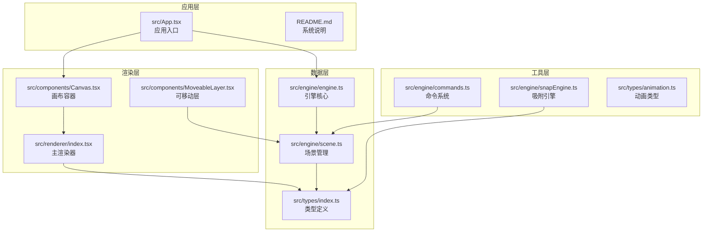

**图表来源**
- [src/renderer/index.tsx:1-314](file://src/renderer/index.tsx#L1-L314)
- [src/components/Canvas.tsx:1-191](file://src/components/Canvas.tsx#L1-L191)
- [src/types/index.ts:1-159](file://src/types/index.ts#L1-L159)

**章节来源**
- [src/renderer/index.tsx:1-314](file://src/renderer/index.tsx#L1-L314)
- [src/components/Canvas.tsx:1-191](file://src/components/Canvas.tsx#L1-L191)
- [src/types/index.ts:1-159](file://src/types/index.ts#L1-L159)

## 核心组件

### 渲染器架构

渲染系统采用分层架构设计，每个元素类型都有专门的渲染函数：

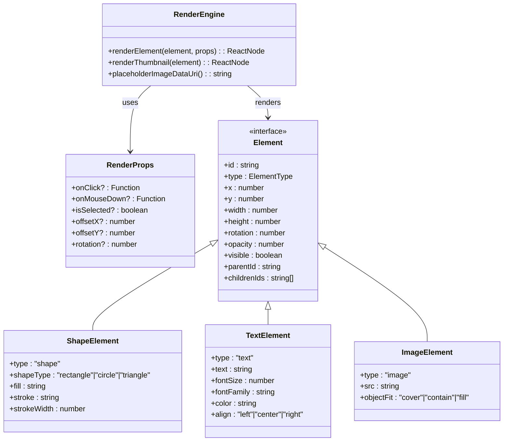

**图表来源**
- [src/renderer/index.tsx:5-202](file://src/renderer/index.tsx#L5-L202)
- [src/types/index.ts:12-54](file://src/types/index.ts#L12-L54)

### 数据流架构

渲染系统遵循单向数据流原则，确保状态的一致性和可预测性：

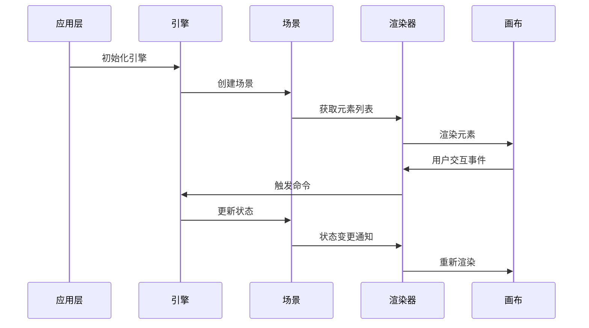

**图表来源**
- [src/App.tsx:11-344](file://src/App.tsx#L11-L344)
- [src/engine/engine.ts:7-54](file://src/engine/engine.ts#L7-L54)
- [src/engine/scene.ts:3-273](file://src/engine/scene.ts#L3-L273)

**章节来源**
- [src/renderer/index.tsx:189-202](file://src/renderer/index.tsx#L189-L202)
- [src/types/index.ts:10-54](file://src/types/index.ts#L10-L54)

## 架构概览

### 渲染管道工作流程

元素渲染系统采用流水线架构，每个元素都通过统一的渲染管道进行处理：

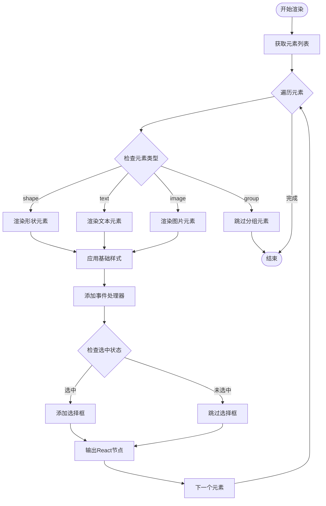

**图表来源**
- [src/renderer/index.tsx:189-202](file://src/renderer/index.tsx#L189-L202)
- [src/renderer/index.tsx:29-92](file://src/renderer/index.tsx#L29-L92)
- [src/renderer/index.tsx:94-125](file://src/renderer/index.tsx#L94-L125)
- [src/renderer/index.tsx:127-160](file://src/renderer/index.tsx#L127-L160)

### 缓存机制设计

系统实现了多层次的缓存策略以提升渲染性能：

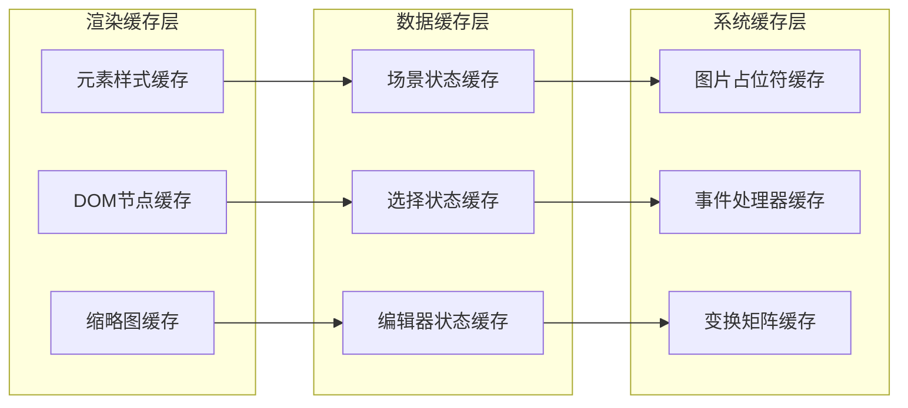

**图表来源**
- [src/renderer/index.tsx:162-171](file://src/renderer/index.tsx#L162-L171)
- [src/components/Canvas.tsx:71-90](file://src/components/Canvas.tsx#L71-L90)

**章节来源**
- [src/renderer/index.tsx:14-27](file://src/renderer/index.tsx#L14-L27)
- [src/components/Canvas.tsx:34-37](file://src/components/Canvas.tsx#L34-L37)

## 详细组件分析

### 主渲染器组件

主渲染器负责将元素数据转换为React组件，支持所有元素类型的渲染：

#### 形状元素渲染

形状元素渲染器支持矩形、圆形和三角形三种基本几何图形：

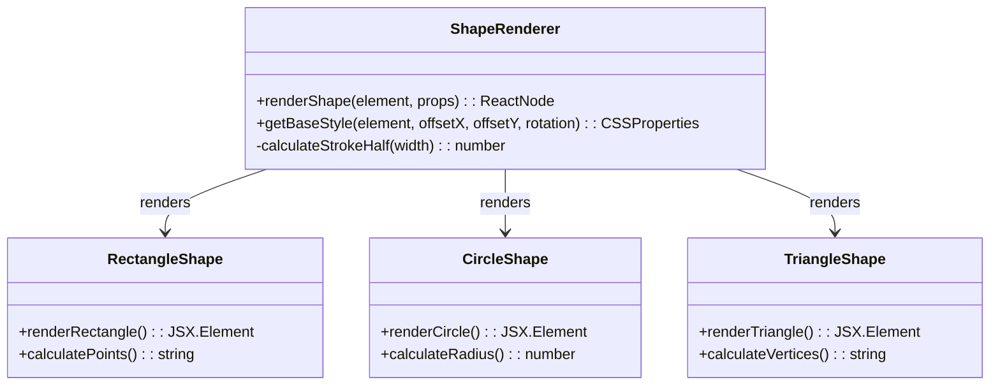

**图表来源**
- [src/renderer/index.tsx:29-92](file://src/renderer/index.tsx#L29-L92)
- [src/renderer/index.tsx:36-73](file://src/renderer/index.tsx#L36-L73)

#### 文本元素渲染

文本元素渲染器提供了完整的文本显示功能，包括对齐、字体和颜色控制：

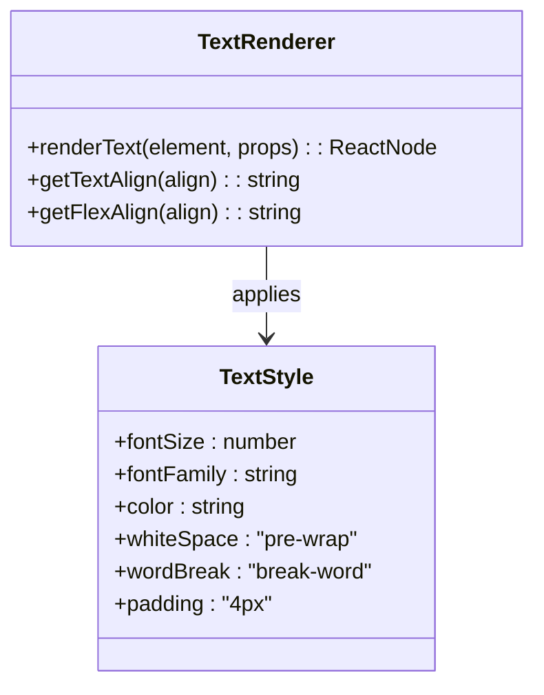

**图表来源**
- [src/renderer/index.tsx:94-125](file://src/renderer/index.tsx#L94-L125)
- [src/renderer/index.tsx:95-108](file://src/renderer/index.tsx#L95-L108)

#### 图片元素渲染

图片元素渲染器支持多种图片显示模式和错误处理机制：

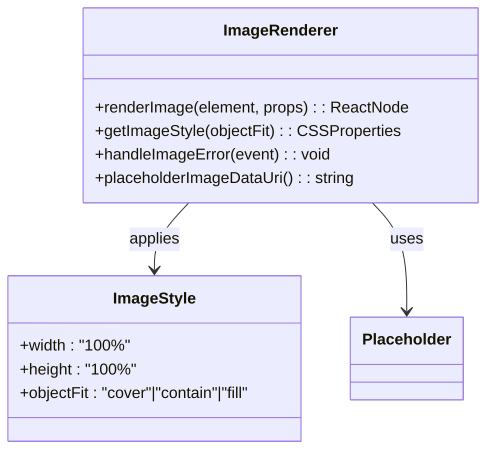

**图表来源**
- [src/renderer/index.tsx:127-160](file://src/renderer/index.tsx#L127-L160)
- [src/renderer/index.tsx:128-132](file://src/renderer/index.tsx#L128-L132)
- [src/renderer/index.tsx:162-171](file://src/renderer/index.tsx#L162-L171)

**章节来源**
- [src/renderer/index.tsx:29-160](file://src/renderer/index.tsx#L29-L160)

### 画布组件

画布组件作为渲染系统的容器，负责管理渲染环境和用户交互：

#### 画布渲染流程

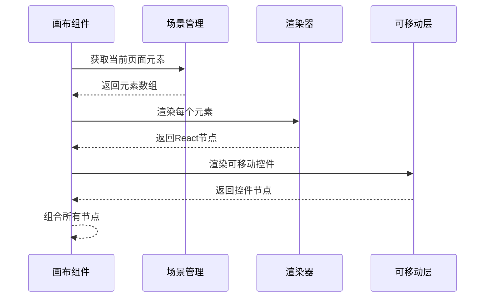

**图表来源**
- [src/components/Canvas.tsx:34-37](file://src/components/Canvas.tsx#L34-L37)
- [src/components/Canvas.tsx:118-124](file://src/components/Canvas.tsx#L118-L124)

#### 事件处理机制

画布组件实现了完整的事件处理系统：

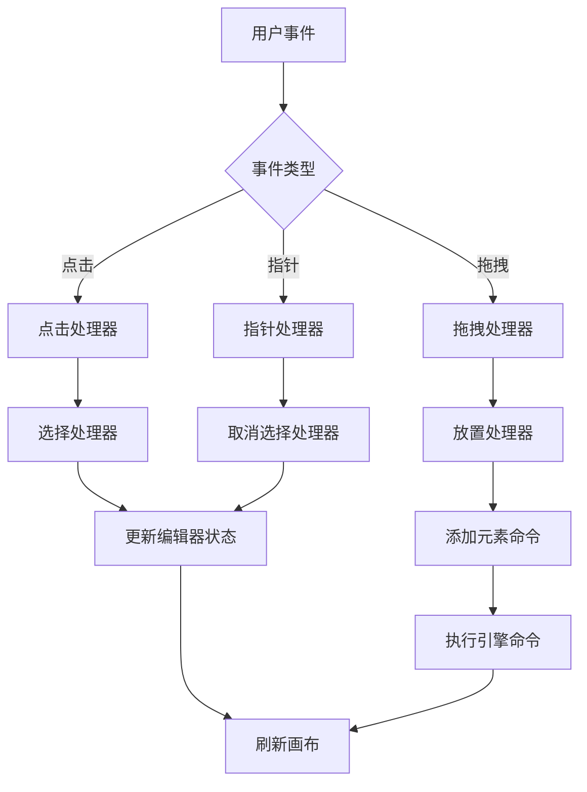

**图表来源**
- [src/components/Canvas.tsx:39-69](file://src/components/Canvas.tsx#L39-L69)
- [src/components/Canvas.tsx:71-90](file://src/components/Canvas.tsx#L71-L90)

**章节来源**
- [src/components/Canvas.tsx:22-128](file://src/components/Canvas.tsx#L22-L128)

### 可移动层组件

可移动层组件提供了高级编辑功能，包括拖拽、缩放和旋转：

#### 移动控制流程

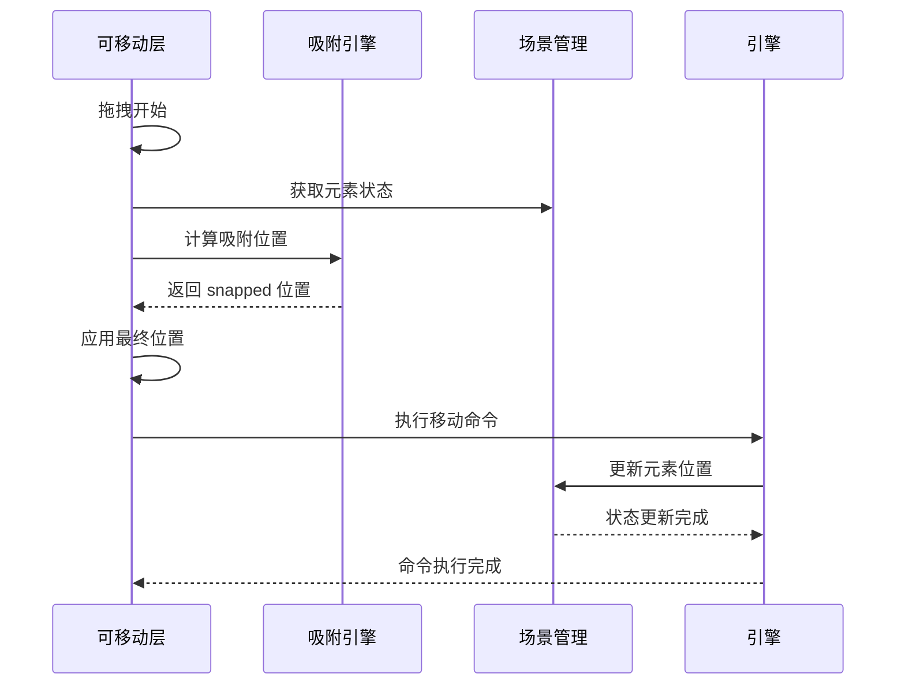

**图表来源**
- [src/components/MoveableLayer.tsx:54-111](file://src/components/MoveableLayer.tsx#L54-L111)
- [src/components/MoveableLayer.tsx:112-134](file://src/components/MoveableLayer.tsx#L112-L134)

#### 吸附算法实现

吸附引擎实现了智能的对齐和间距计算：

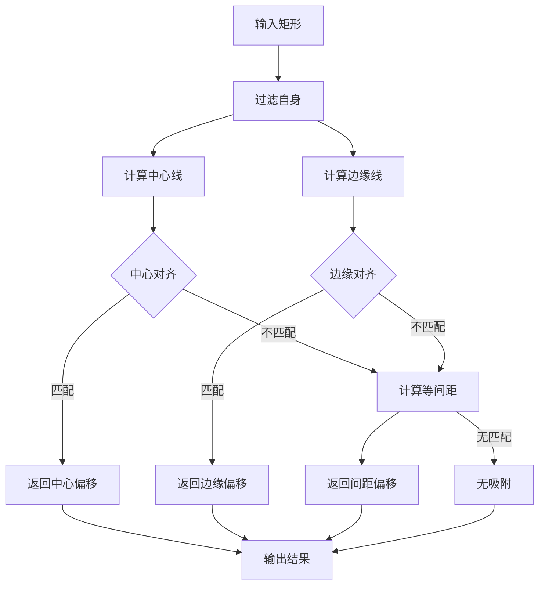

**图表来源**
- [src/engine/snapEngine.ts:242-258](file://src/engine/snapEngine.ts#L242-L258)
- [src/engine/snapEngine.ts:158-240](file://src/engine/snapEngine.ts#L158-L240)

**章节来源**
- [src/components/MoveableLayer.tsx:15-189](file://src/components/MoveableLayer.tsx#L15-L189)
- [src/engine/snapEngine.ts:3-259](file://src/engine/snapEngine.ts#L3-L259)

### 类型系统

系统采用了严格的TypeScript类型定义，确保类型安全和开发体验：

#### 元素类型层次结构

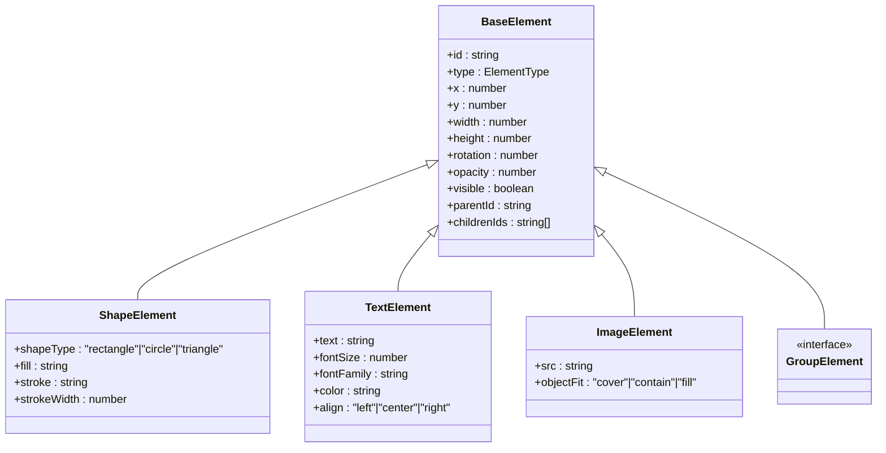

**图表来源**
- [src/types/index.ts:12-54](file://src/types/index.ts#L12-L54)
- [src/types/index.ts:27-52](file://src/types/index.ts#L27-L52)

#### 动画类型系统

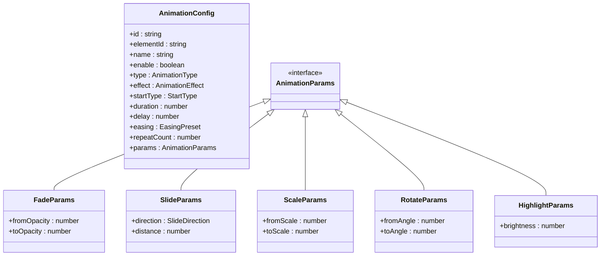

**图表来源**
- [src/types/animation.ts:26-88](file://src/types/animation.ts#L26-L88)
- [src/types/animation.ts:41-70](file://src/types/animation.ts#L41-L70)

**章节来源**
- [src/types/index.ts:10-159](file://src/types/index.ts#L10-L159)
- [src/types/animation.ts:1-113](file://src/types/animation.ts#L1-L113)

## 依赖关系分析

### 组件依赖图

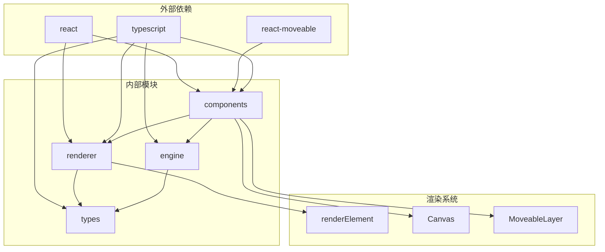

**图表来源**
- [src/renderer/index.tsx:1-3](file://src/renderer/index.tsx#L1-L3)
- [src/components/Canvas.tsx:1-8](file://src/components/Canvas.tsx#L1-L8)

### 数据流向分析

系统遵循清晰的数据流向原则：

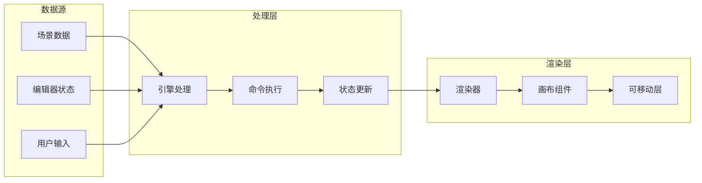

**图表来源**
- [src/engine/engine.ts:29-48](file://src/engine/engine.ts#L29-L48)
- [src/engine/commands.ts:4-68](file://src/engine/commands.ts#L4-L68)

**章节来源**
- [src/engine/engine.ts:1-54](file://src/engine/engine.ts#L1-L54)
- [src/engine/commands.ts:1-280](file://src/engine/commands.ts#L1-L280)

## 性能考虑

### 渲染性能优化

系统实现了多项性能优化策略：

#### 虚拟化渲染
- 使用React的key属性确保元素的稳定标识
- 避免不必要的重渲染，仅在状态变化时更新相关元素

#### 轻量级渲染
- 提供缩略图渲染器用于结构面板，减少DOM节点数量
- 选择状态渲染采用CSS边框而非复杂DOM结构

#### 缓存策略
- 图片占位符使用data URI缓存，避免重复请求
- 事件处理器使用useCallback优化，减少函数重建

### 内存管理

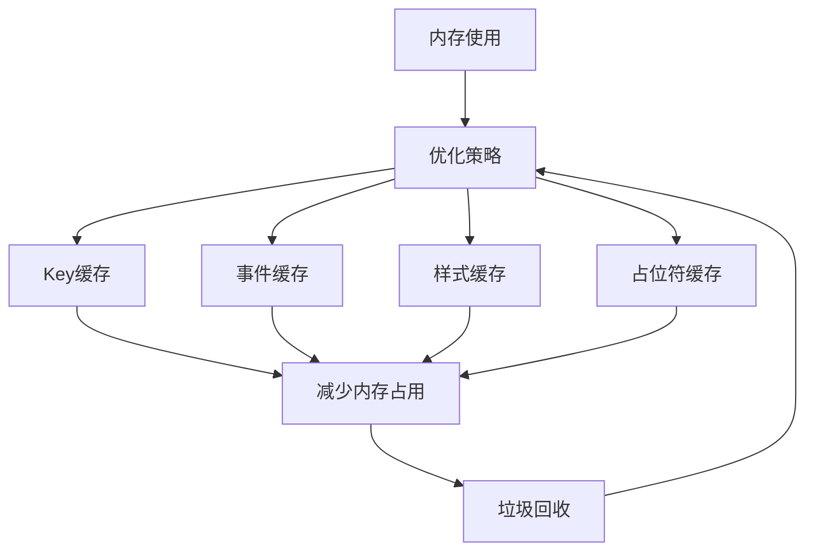

### 性能监控建议

1. **渲染计数监控**：跟踪每次渲染的元素数量和时间
2. **内存使用监控**：监控图片缓存和DOM节点数量
3. **事件处理监控**：监控拖拽和缩放操作的响应时间
4. **动画性能监控**：监控Web Animation API的执行效率

## 故障排除指南

### 常见问题诊断

#### 渲染异常问题

**问题症状**：元素无法正确显示或显示异常

**可能原因**：
1. 元素数据格式不正确
2. 样式计算错误
3. 事件处理器冲突

**解决方法**：
1. 检查元素类型和必需字段
2. 验证样式计算逻辑
3. 确认事件处理器的正确绑定

#### 交互功能问题

**问题症状**：拖拽、缩放或旋转功能失效

**可能原因**：
1. Moveable组件配置错误
2. 吸附引擎计算异常
3. 命令执行失败

**解决方法**：
1. 检查Moveable组件的target属性
2. 验证snapEngine的输入参数
3. 确认命令对象的正确性

#### 性能问题

**问题症状**：渲染缓慢或内存泄漏

**可能原因**：
1. 过多的DOM节点
2. 频繁的状态更新
3. 缓存未正确清理

**解决方法**：
1. 实施虚拟化渲染
2. 优化状态更新频率
3. 实现适当的缓存清理机制

**章节来源**
- [src/renderer/index.tsx:150-156](file://src/renderer/index.tsx#L150-L156)
- [src/components/MoveableLayer.tsx:84-111](file://src/components/MoveableLayer.tsx#L84-L111)

## 结论

元素渲染系统是一个高度模块化和可扩展的架构，具有以下优势：

### 技术优势
- **类型安全**：完整的TypeScript类型系统确保代码质量
- **模块化设计**：清晰的职责分离便于维护和扩展
- **性能优化**：多层缓存和优化策略确保流畅的用户体验
- **可扩展性**：插件化的架构支持自定义元素类型

### 架构特点
- **单向数据流**：确保状态一致性和可预测性
- **命令模式**：支持撤销/重做功能
- **事件驱动**：响应式的用户交互处理
- **动画集成**：与Web Animation API深度集成

### 发展方向
1. **虚拟化渲染**：进一步优化大量元素的渲染性能
2. **WebGL支持**：考虑使用WebGL加速复杂图形渲染
3. **多平台适配**：支持移动端和触摸设备
4. **AI集成**：结合AI技术提供智能布局和内容生成

该系统为课件编辑器提供了坚实的技术基础，通过持续的优化和扩展，能够满足不断增长的功能需求和性能要求。