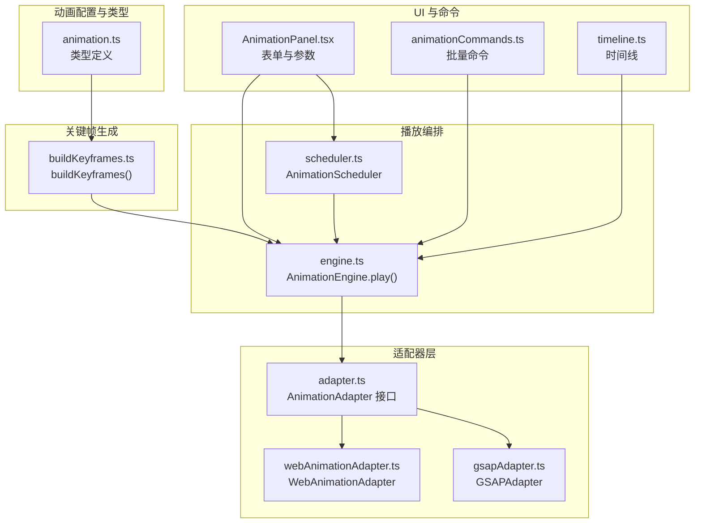
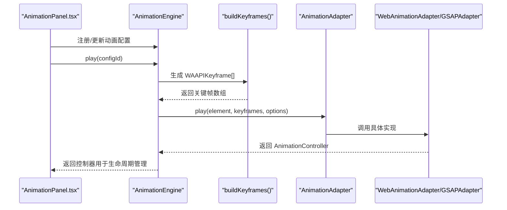
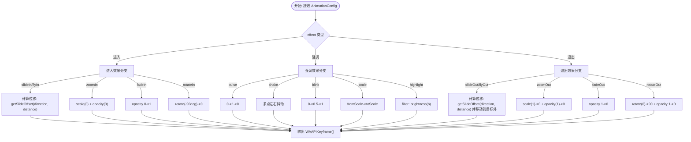
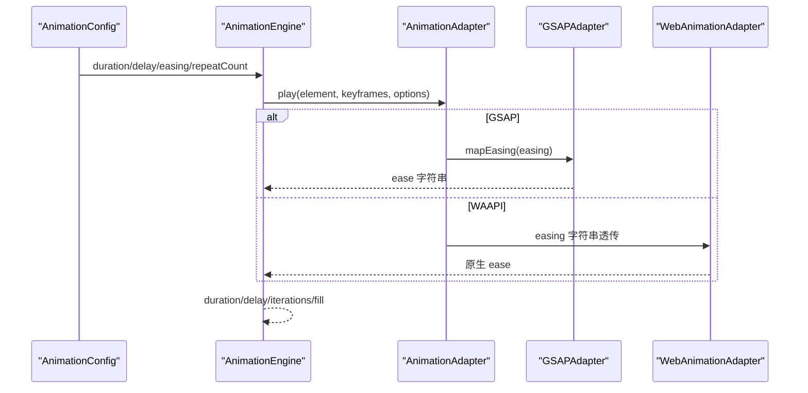
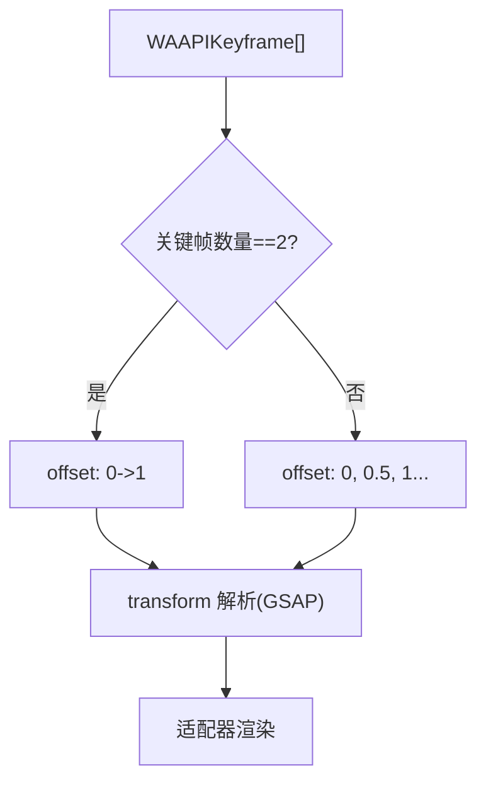
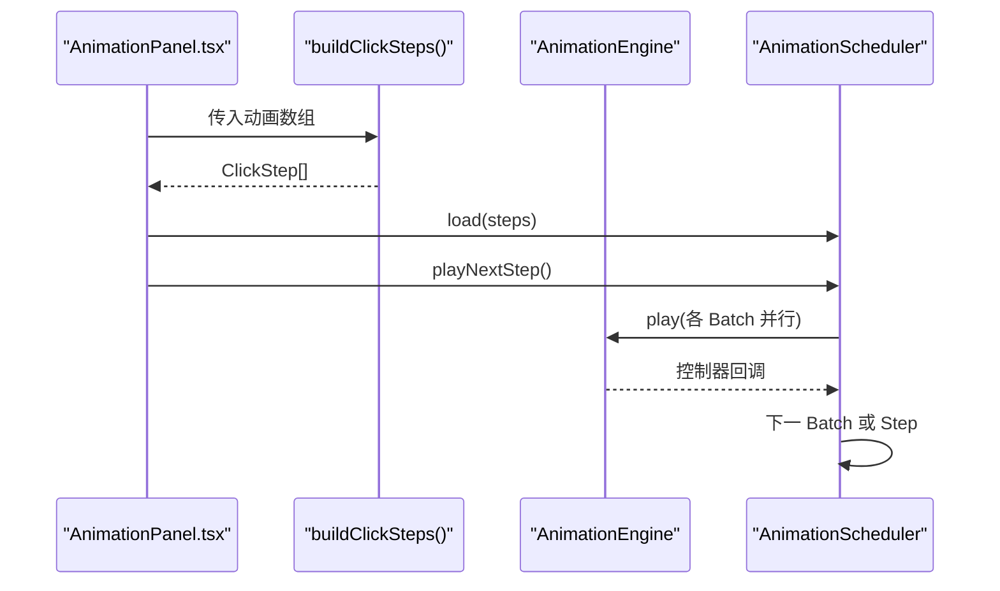
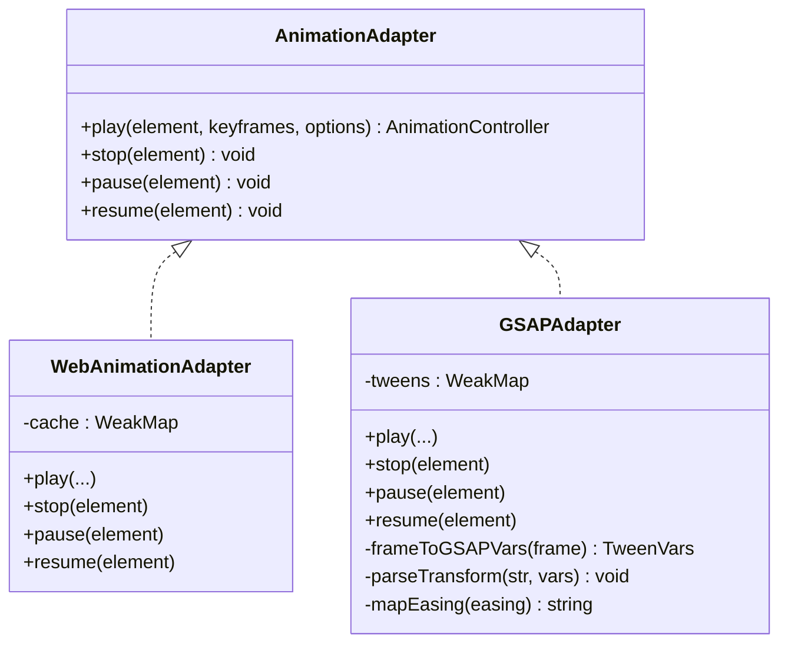
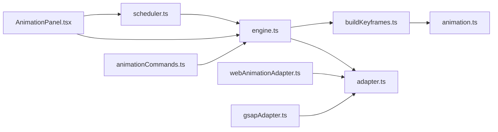

# 关键帧生成

<cite>
**本文引用的文件**
- [buildKeyframes.ts](file://src/animation/buildKeyframes.ts)
- [engine.ts](file://src/animation/engine.ts)
- [adapter.ts](file://src/animation/adapter.ts)
- [webAnimationAdapter.ts](file://src/animation/webAnimationAdapter.ts)
- [gsapAdapter.ts](file://src/animation/gsapAdapter.ts)
- [scheduler.ts](file://src/animation/scheduler.ts)
- [animation.ts](file://src/types/animation.ts)
- [AnimationPanel.tsx](file://src/components/AnimationPanel.tsx)
- [animationCommands.ts](file://src/engine/animationCommands.ts)
- [timeline.ts](file://src/engine/timeline.ts)
- [README.md](file://README.md)
</cite>

## 目录
1. [简介](#简介)
2. [项目结构](#项目结构)
3. [核心组件](#核心组件)
4. [架构总览](#架构总览)
5. [详细组件分析](#详细组件分析)
6. [依赖分析](#依赖分析)
7. [性能考虑](#性能考虑)
8. [故障排查指南](#故障排查指南)
9. [结论](#结论)
10. [附录](#附录)

## 简介
本技术文档聚焦于“关键帧生成系统”，围绕 buildKeyframes 函数的算法实现与关键帧计算逻辑展开，系统性说明不同动画类型的参数转换、插值计算与关键帧序列生成；解释缓动函数映射、时间轴映射与动画曲线构建；给出配置项、自定义参数与调试技巧，并记录与动画配置的对应关系及性能优化策略。该系统采用“配置驱动 + 适配器模式”的架构：通过统一的动画配置对象生成 WAAPI 兼容的关键帧，再由适配器层将关键帧映射到原生 Web Animations API 或第三方库（如 GSAP），从而实现跨平台、可扩展的动画播放能力。

## 项目结构
关键帧生成系统位于 src/animation 目录，配合类型定义、调度器与面板组件共同构成完整的动画工作流。核心文件包括：
- buildKeyframes.ts：关键帧生成的核心算法
- engine.ts：动画生命周期管理与播放编排
- adapter.ts、webAnimationAdapter.ts、gsapAdapter.ts：适配器接口与具体实现
- scheduler.ts：基于“步骤/批次”的执行模型
- animation.ts：动画配置与关键帧类型定义
- AnimationPanel.tsx：动画配置与参数输入界面
- animationCommands.ts、timeline.ts：命令与时间线辅助类
- README.md：步骤/批次执行模型说明

图表来源
- [buildKeyframes.ts:1-125](file://src/animation/buildKeyframes.ts#L1-L125)
- [engine.ts:1-120](file://src/animation/engine.ts#L1-L120)
- [adapter.ts:1-27](file://src/animation/adapter.ts#L1-L27)
- [webAnimationAdapter.ts:1-67](file://src/animation/webAnimationAdapter.ts#L1-L67)
- [gsapAdapter.ts:1-140](file://src/animation/gsapAdapter.ts#L1-L140)
- [scheduler.ts:1-160](file://src/animation/scheduler.ts#L1-L160)
- [animation.ts:1-113](file://src/types/animation.ts#L1-L113)
- [AnimationPanel.tsx:1-857](file://src/components/AnimationPanel.tsx#L1-L857)
- [animationCommands.ts:1-44](file://src/engine/animationCommands.ts#L1-L44)
- [timeline.ts:1-66](file://src/engine/timeline.ts#L1-L66)

章节来源
- [README.md:1-15](file://README.md#L1-L15)
- [animation.ts:1-113](file://src/types/animation.ts#L1-L113)

## 核心组件
- buildKeyframes：将 AnimationConfig 映射为 WAAPIKeyframe 序列，覆盖进入、强调、退出三类效果，支持方向、距离、缩放、旋转、亮度等参数化控制。
- AnimationEngine：注册/注销动画配置，查询元素，调用 buildKeyframes 生成关键帧并委托适配器播放。
- AnimationAdapter 及其实现：抽象播放接口，WebAnimationAdapter 使用原生 animate，GSAPAdapter 将 WAAPI 关键帧映射为 GSAP fromTo。
- AnimationScheduler：根据 startType 构建 ClickStep 与 AnimationBatch，实现“步骤/批次”串并行执行模型。
- 类型系统：AnimationConfig、AnimationEffect、WAAPIKeyframe、AnimationOptions 等，确保配置与关键帧格式一致。

章节来源
- [buildKeyframes.ts:7-109](file://src/animation/buildKeyframes.ts#L7-L109)
- [engine.ts:9-118](file://src/animation/engine.ts#L9-L118)
- [adapter.ts:7-26](file://src/animation/adapter.ts#L7-L26)
- [webAnimationAdapter.ts:12-66](file://src/animation/webAnimationAdapter.ts#L12-L66)
- [gsapAdapter.ts:13-139](file://src/animation/gsapAdapter.ts#L13-L139)
- [scheduler.ts:56-159](file://src/animation/scheduler.ts#L56-L159)
- [animation.ts:26-88](file://src/types/animation.ts#L26-L88)

## 架构总览
下图展示从配置到播放的关键路径：UI 输入配置 → 构建关键帧 → 选择适配器 → 播放控制器回调 → 生命周期管理。

图表来源
- [AnimationPanel.tsx:265-276](file://src/components/AnimationPanel.tsx#L265-L276)
- [engine.ts:53-70](file://src/animation/engine.ts#L53-L70)
- [buildKeyframes.ts:7-9](file://src/animation/buildKeyframes.ts#L7-L9)
- [adapter.ts:12-16](file://src/animation/adapter.ts#L12-L16)
- [webAnimationAdapter.ts:15-43](file://src/animation/webAnimationAdapter.ts#L15-L43)
- [gsapAdapter.ts:16-60](file://src/animation/gsapAdapter.ts#L16-L60)

## 详细组件分析

### buildKeyframes 算法与关键帧计算
- 输入：AnimationConfig.effect 与 AnimationConfig.params
- 输出：WAAPIKeyframe[]，包含 offset（0~1）、transform、opacity、filter 等属性
- 算法要点：
  - 分类处理：进入（fadeIn/zoomIn/slideIn/flyIn/rotateIn）、强调（pulse/shake/blink/scale/highlight）、退出（fadeOut/zoomOut/slideOut/flyOut/rotateOut）
  - 参数转换：
    - 方向与距离：slideIn/flyIn/slideOut/flyOut 使用 getSlideOffset(direction, distance) 计算初始位移
    - 缩放：scale 效果使用 fromScale/toScale
    - 旋转：rotateIn/rotateOut 使用 fromAngle/toAngle
    - 亮度：highlight 使用 brightness 值
  - 插值与时间轴：
    - 多关键帧按 offset 线性分布（如 pulse 有 0、0.5、1）
    - 两关键帧时默认首尾两端
  - 默认返回空数组兜底

图表来源
- [buildKeyframes.ts:11-109](file://src/animation/buildKeyframes.ts#L11-L109)
- [buildKeyframes.ts:111-124](file://src/animation/buildKeyframes.ts#L111-L124)

章节来源
- [buildKeyframes.ts:7-109](file://src/animation/buildKeyframes.ts#L7-L109)
- [animation.ts:41-70](file://src/types/animation.ts#L41-L70)

### 动画类型与参数转换
- 进入类（Enter）
  - fadeIn：opacity 从 0 到 1
  - zoomIn：scale 从 0 到 1，同时 opacity 从 0 到 1
  - slideIn/flyIn：根据方向与距离计算初始偏移，最终归零
  - rotateIn：旋转从 -90° 到 0°，同时透明度从 0 到 1
- 强调类（Emphasis）
  - pulse：在 0.5 处放大到 1.1 后回到 1
  - shake：在偶数偏移处左右抖动
  - blink：在中点闪烁
  - scale：从 fromScale 到 toScale
  - highlight：在中点应用 brightness
- 退出类（Exit）
  - fadeOut：opacity 从 1 到 0
  - zoomOut：scale 从 1 到 0，同时 opacity 从 1 到 0
  - slideOut/flyOut：从当前位置移动到指定方向外
  - rotateOut：旋转到 90°，同时 opacity 从 1 到 0

章节来源
- [buildKeyframes.ts:14-104](file://src/animation/buildKeyframes.ts#L14-L104)
- [animation.ts:6-12](file://src/types/animation.ts#L6-L12)
- [animation.ts:41-70](file://src/types/animation.ts#L41-L70)

### 缓动函数与时间轴映射
- 缓动映射（GSAPAdapter）
  - 将 WAAPI 预设映射到 GSAP ease 字符串，如 linear/ease-in/ease-out/ease-in-out/bounce/elastic
- 时间轴映射（AnimationEngine）
  - 将配置中的秒级 duration/delay 转换为毫秒传给适配器
  - iterations 来自 repeatCount
  - fill 默认设置为 both

图表来源
- [engine.ts:61-69](file://src/animation/engine.ts#L61-L69)
- [gsapAdapter.ts:128-138](file://src/animation/gsapAdapter.ts#L128-L138)
- [webAnimationAdapter.ts:23-29](file://src/animation/webAnimationAdapter.ts#L23-L29)

章节来源
- [engine.ts:61-69](file://src/animation/engine.ts#L61-L69)
- [gsapAdapter.ts:128-138](file://src/animation/gsapAdapter.ts#L128-L138)
- [webAnimationAdapter.ts:23-29](file://src/animation/webAnimationAdapter.ts#L23-L29)

### 关键帧序列生成与插值
- 两关键帧：首尾两端（0 和 1）
- 多关键帧：按 offset 线性分布（如 pulse 在 0、0.5、1）
- transform 解析：GSAPAdapter 将 translate/scale/rotate 字符串解析为 x/y/scale/rotation 等属性，便于 GSAP 渲染

图表来源
- [buildKeyframes.ts:11-109](file://src/animation/buildKeyframes.ts#L11-L109)
- [gsapAdapter.ts:87-123](file://src/animation/gsapAdapter.ts#L87-L123)

章节来源
- [buildKeyframes.ts:11-109](file://src/animation/buildKeyframes.ts#L11-L109)
- [gsapAdapter.ts:87-123](file://src/animation/gsapAdapter.ts#L87-L123)

### 步骤/批次执行模型与 UI 配置
- 步骤（Step）：用户点击触发的一组动画
- 批次（Batch）：Step 内串行执行的动画组
- 并行：Batch 内所有动画同时播放
- startType 规则：
  - click：开启新 Step
  - withPrev：加入当前 Batch（并行）
  - afterPrev：在当前 Step 新建 Batch（串行）

图表来源
- [AnimationPanel.tsx:92](file://src/components/AnimationPanel.tsx#L92)
- [scheduler.ts:13-49](file://src/animation/scheduler.ts#L13-L49)
- [scheduler.ts:79-108](file://src/animation/scheduler.ts#L79-L108)
- [README.md:6-14](file://README.md#L6-L14)

章节来源
- [scheduler.ts:56-159](file://src/animation/scheduler.ts#L56-L159)
- [AnimationPanel.tsx:92](file://src/components/AnimationPanel.tsx#L92)
- [README.md:6-14](file://README.md#L6-L14)

### 适配器与播放控制
- AnimationAdapter：统一 play/stop/pause/resume 接口
- WebAnimationAdapter：基于 element.animate，缓存 Animation 实例，事件监听 finish/cancel
- GSAPAdapter：将关键帧映射为 fromTo，解析 transform 组件，映射 easing，缓存 Tween 实例

图表来源
- [adapter.ts:7-26](file://src/animation/adapter.ts#L7-L26)
- [webAnimationAdapter.ts:12-66](file://src/animation/webAnimationAdapter.ts#L12-L66)
- [gsapAdapter.ts:13-139](file://src/animation/gsapAdapter.ts#L13-L139)

章节来源
- [adapter.ts:7-26](file://src/animation/adapter.ts#L7-L26)
- [webAnimationAdapter.ts:12-66](file://src/animation/webAnimationAdapter.ts#L12-L66)
- [gsapAdapter.ts:13-139](file://src/animation/gsapAdapter.ts#L13-L139)

### 配置项、自定义参数与调试技巧
- 配置项（AnimationConfig）
  - id、elementId、name、enable、type、effect、startType、duration、delay、easing、repeatCount、params
- 参数类型（AnimationParams）
  - FadeParams、SlideParams、ScaleParams、RotateParams、HighlightParams
- 自定义参数
  - 方向与距离：slideIn/flyIn/slideOut/flyOut
  - 缩放范围：fromScale/toScale
  - 旋转角度：fromAngle/toAngle
  - 亮度系数：brightness
- 调试技巧
  - 使用 AnimationPanel 的“播放”和“从这里播放”按钮快速验证
  - 通过 repeatCount 与 delay 调整节奏
  - 在 GSAPAdapter 中检查 easing 映射是否符合预期
  - 在 WebAnimationAdapter 中确认 fill 设置为 both 以保持首尾状态

章节来源
- [animation.ts:26-70](file://src/types/animation.ts#L26-L70)
- [AnimationPanel.tsx:136-154](file://src/components/AnimationPanel.tsx#L136-L154)
- [AnimationPanel.tsx:265-302](file://src/components/AnimationPanel.tsx#L265-L302)
- [engine.ts:61-69](file://src/animation/engine.ts#L61-L69)

## 依赖分析
- buildKeyframes 依赖类型定义（effect、params）
- AnimationEngine 依赖 buildKeyframes 与 AnimationAdapter
- AnimationScheduler 依赖 AnimationEngine 与类型定义
- GSAPAdapter 依赖 GSAP 库，需注意包大小与按需引入
- UI 层通过 AnimationPanel.tsx 与引擎交互，负责参数收集与命令派发

图表来源
- [buildKeyframes.ts:1](file://src/animation/buildKeyframes.ts#L1)
- [engine.ts:1-3](file://src/animation/engine.ts#L1-L3)
- [adapter.ts:1](file://src/animation/adapter.ts#L1)
- [webAnimationAdapter.ts:1-6](file://src/animation/webAnimationAdapter.ts#L1-L6)
- [gsapAdapter.ts:1](file://src/animation/gsapAdapter.ts#L1)
- [scheduler.ts:1-2](file://src/animation/scheduler.ts#L1-L2)
- [animation.ts:1-3](file://src/types/animation.ts#L1-L3)
- [AnimationPanel.tsx:1-18](file://src/components/AnimationPanel.tsx#L1-L18)
- [animationCommands.ts:1-4](file://src/engine/animationCommands.ts#L1-L4)

章节来源
- [buildKeyframes.ts:1-125](file://src/animation/buildKeyframes.ts#L1-L125)
- [engine.ts:1-120](file://src/animation/engine.ts#L1-L120)
- [adapter.ts:1-27](file://src/animation/adapter.ts#L1-L27)
- [webAnimationAdapter.ts:1-67](file://src/animation/webAnimationAdapter.ts#L1-L67)
- [gsapAdapter.ts:1-140](file://src/animation/gsapAdapter.ts#L1-L140)
- [scheduler.ts:1-160](file://src/animation/scheduler.ts#L1-L160)
- [animation.ts:1-113](file://src/types/animation.ts#L1-L113)
- [AnimationPanel.tsx:1-857](file://src/components/AnimationPanel.tsx#L1-L857)
- [animationCommands.ts:1-44](file://src/engine/animationCommands.ts#L1-L44)

## 性能考虑
- 关键帧数量控制：尽量减少中间关键帧数量，避免复杂贝塞尔曲线导致的重绘开销
- 适配器选择：原生 Web Animations API 在现代浏览器中性能稳定；GSAP 提供更丰富的缓动与特性，但需权衡包体积
- 并行与串行：利用批次模型将不冲突的动画并行播放，减少总时长
- 缓存复用：适配器层对 Animation/Tween 实例进行 WeakMap 缓存，避免重复创建
- 参数范围：限制方向与距离、缩放与角度范围，避免极端值导致的布局抖动或 GPU 压力

## 故障排查指南
- 关键帧为空：检查 effect 是否为未覆盖的枚举值，或参数缺失
- 位移异常：确认方向与距离参数是否正确传递至 getSlideOffset
- 旋转/缩放不生效：检查 transform 字符串是否被适配器正确解析（GSAPAdapter 的 parseTransform）
- 缓动不匹配：核对 easing 名称是否在 mapEasing 中存在映射
- 播放无响应：确认元素选择器与作用域（scopeRoot）是否正确，以及控制器回调是否绑定

章节来源
- [buildKeyframes.ts:106-109](file://src/animation/buildKeyframes.ts#L106-L109)
- [buildKeyframes.ts:111-124](file://src/animation/buildKeyframes.ts#L111-L124)
- [gsapAdapter.ts:107-123](file://src/animation/gsapAdapter.ts#L107-L123)
- [gsapAdapter.ts:128-138](file://src/animation/gsapAdapter.ts#L128-L138)
- [engine.ts:24-30](file://src/animation/engine.ts#L24-L30)

## 结论
关键帧生成系统通过 buildKeyframes 将配置转化为 WAAPI 兼容的关键帧，结合 AnimationEngine 的生命周期管理与 AnimationScheduler 的步骤/批次模型，实现了灵活可控的动画播放流程。适配器层保证了与原生 Web Animations API 和第三方库（如 GSAP）的无缝对接。通过合理的参数设计、缓动映射与执行模型，系统在易用性与性能之间取得平衡，适合在课件编辑器等场景中进行高效动画创作与预览。

## 附录
- 术语
  - 关键帧：WAAPIKeyframe，包含 offset 与 CSS 属性
  - 步骤/批次：ClickStep/AnimationBatch，用于组织播放顺序
  - 适配器：AnimationAdapter 抽象，WebAnimationAdapter/GSAPAdapter 实现
- 参考
  - README 对步骤/批次模型的说明

章节来源
- [README.md:6-14](file://README.md#L6-L14)