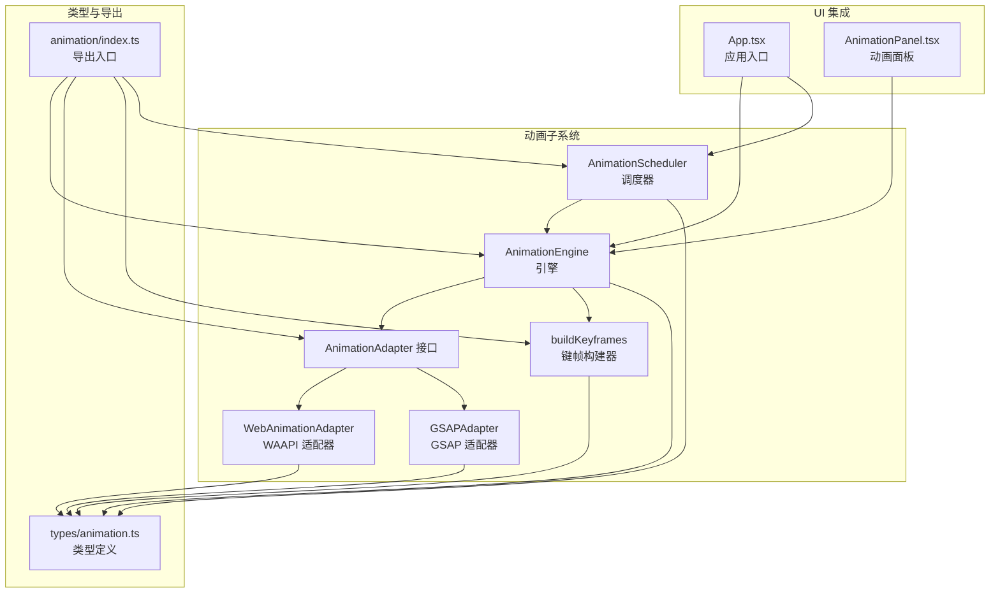
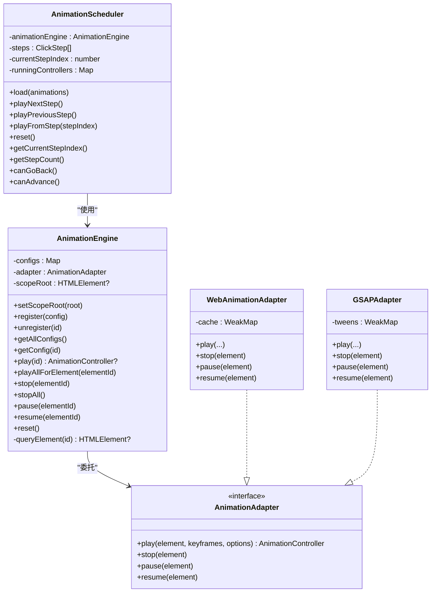
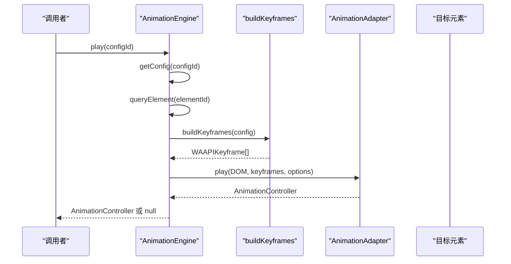
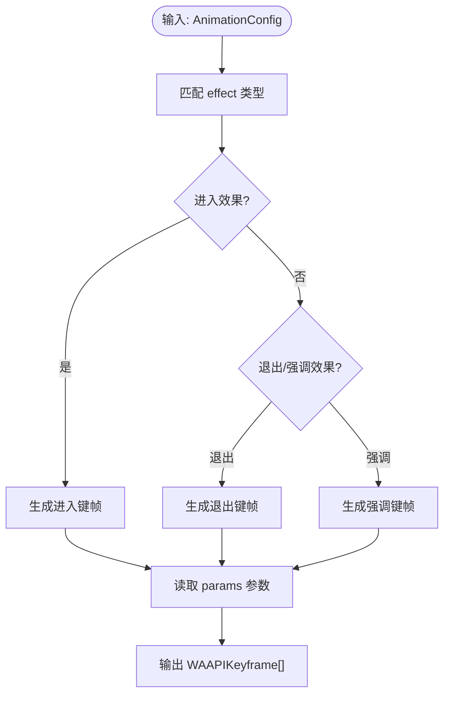
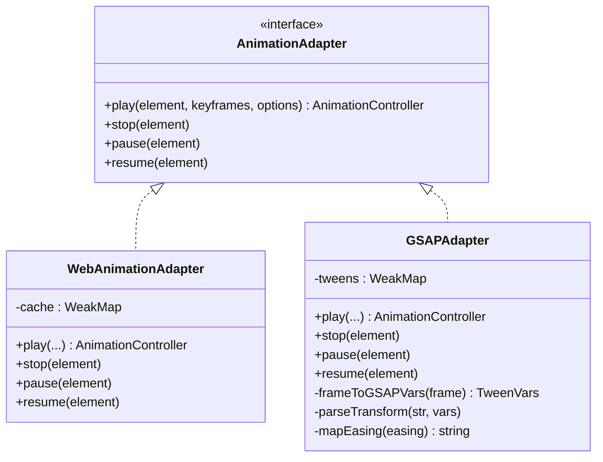
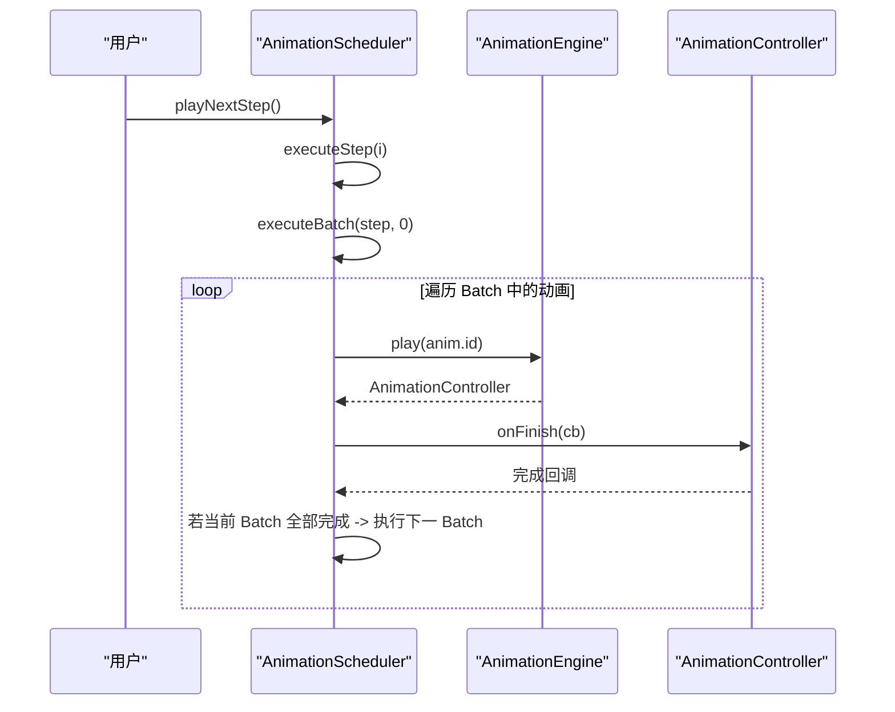
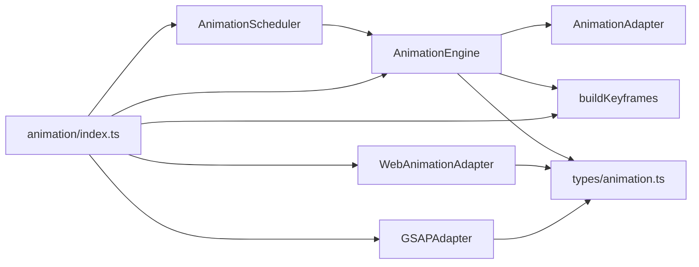

# 动画引擎核心

<cite>
**本文引用的文件列表**
- [engine.ts](file://src/animation/engine.ts)
- [adapter.ts](file://src/animation/adapter.ts)
- [webAnimationAdapter.ts](file://src/animation/webAnimationAdapter.ts)
- [gsapAdapter.ts](file://src/animation/gsapAdapter.ts)
- [buildKeyframes.ts](file://src/animation/buildKeyframes.ts)
- [scheduler.ts](file://src/animation/scheduler.ts)
- [animation.ts](file://src/types/animation.ts)
- [index.ts](file://src/animation/index.ts)
- [AnimationPanel.tsx](file://src/components/AnimationPanel.tsx)
- [App.tsx](file://src/App.tsx)
- [README.md](file://README.md)
</cite>

## 目录
1. [简介](#简介)
2. [项目结构](#项目结构)
3. [核心组件](#核心组件)
4. [架构总览](#架构总览)
5. [详细组件分析](#详细组件分析)
6. [依赖关系分析](#依赖关系分析)
7. [性能考量](#性能考量)
8. [故障排查指南](#故障排查指南)
9. [结论](#结论)
10. [附录：使用示例与最佳实践](#附录使用示例与最佳实践)

## 简介
本文件面向“动画引擎核心”模块，系统性阐述 AnimationEngine 类的设计架构与实现原理，覆盖配置管理、生命周期控制、DOM 查询机制；详解注册、播放、停止、暂停等核心方法的调用链路与错误处理；说明动画配置的存储机制、作用域根元素的作用与元素查询策略；给出动画控制器的使用示例、错误处理机制与性能优化建议，并总结与适配器的交互模式与最佳实践。

## 项目结构
动画子系统位于 src/animation 目录，包含引擎、适配器、键帧构建器与调度器；类型定义位于 src/types/animation.ts；UI 层通过 AnimationPanel.tsx 与 App.tsx 进行集成。

图表来源
- [engine.ts:1-120](file://src/animation/engine.ts#L1-L120)
- [adapter.ts:1-27](file://src/animation/adapter.ts#L1-L27)
- [webAnimationAdapter.ts:1-67](file://src/animation/webAnimationAdapter.ts#L1-L67)
- [gsapAdapter.ts:1-140](file://src/animation/gsapAdapter.ts#L1-L140)
- [buildKeyframes.ts:1-125](file://src/animation/buildKeyframes.ts#L1-L125)
- [scheduler.ts:1-160](file://src/animation/scheduler.ts#L1-L160)
- [animation.ts:1-113](file://src/types/animation.ts#L1-L113)
- [index.ts:1-8](file://src/animation/index.ts#L1-L8)
- [App.tsx:1-344](file://src/App.tsx#L1-L344)
- [AnimationPanel.tsx:1-857](file://src/components/AnimationPanel.tsx#L1-L857)

章节来源
- [engine.ts:1-120](file://src/animation/engine.ts#L1-L120)
- [index.ts:1-8](file://src/animation/index.ts#L1-L8)

## 核心组件
- AnimationEngine：动画生命周期与配置管理的核心，负责注册、查询、播放、停止、暂停、重置等操作，并委托适配器执行实际动画。
- AnimationAdapter 接口：抽象底层动画库（WAAPI 或 GSAP），统一播放、停止、暂停、恢复等能力。
- WebAnimationAdapter/GSAPAdapter：具体适配器实现，分别基于原生 Web Animations API 和 GSAP。
- buildKeyframes：将 AnimationConfig 转换为 WAAPI 兼容的键帧数组。
- AnimationScheduler：基于“Step/Batch 并行/串行”的批处理执行模型，驱动动画按用户点击逐步播放。
- 类型系统：定义动画配置、效果、起始类型、缓动、键帧格式、控制器接口等。

章节来源
- [engine.ts:1-120](file://src/animation/engine.ts#L1-L120)
- [adapter.ts:1-27](file://src/animation/adapter.ts#L1-L27)
- [webAnimationAdapter.ts:1-67](file://src/animation/webAnimationAdapter.ts#L1-L67)
- [gsapAdapter.ts:1-140](file://src/animation/gsapAdapter.ts#L1-L140)
- [buildKeyframes.ts:1-125](file://src/animation/buildKeyframes.ts#L1-L125)
- [scheduler.ts:1-160](file://src/animation/scheduler.ts#L1-L160)
- [animation.ts:1-113](file://src/types/animation.ts#L1-L113)

## 架构总览
AnimationEngine 作为门面，持有适配器实例与配置映射表；play 时先解析配置、构建键帧，再委托适配器创建并返回控制器；stop/pause/resume 委托适配器；支持按元素批量播放与全局停止；通过 setScopeRoot 限制 DOM 查询范围，便于在预览容器等场景中隔离选择。

图表来源
- [engine.ts:9-119](file://src/animation/engine.ts#L9-L119)
- [adapter.ts:7-26](file://src/animation/adapter.ts#L7-L26)
- [webAnimationAdapter.ts:12-66](file://src/animation/webAnimationAdapter.ts#L12-L66)
- [gsapAdapter.ts:13-82](file://src/animation/gsapAdapter.ts#L13-L82)
- [scheduler.ts:56-159](file://src/animation/scheduler.ts#L56-L159)

## 详细组件分析

### AnimationEngine 设计与实现
- 配置管理
  - 使用 Map 存储 AnimationConfig，键为 config.id，值为配置对象。
  - 提供 register/unregister/getAllConfigs/getConfig 等方法，支持按 id 查询与批量读取。
- 生命周期控制
  - play：校验配置存在与目标元素存在，构建键帧，转换单位（秒到毫秒），委托适配器播放并返回控制器。
  - stop/stopAll/pause/resume：通过适配器统一管理元素上的动画。
  - reset：先 stopAll，再清空配置。
- DOM 查询机制
  - queryElement 基于 [data-element-id="..."] 选择器定位元素；若设置了 scopeRoot，则限定在该根节点内查询，避免跨容器误选。
  - playAllForElement：根据 elementId 过滤所有配置并逐个播放，返回控制器数组。
- 错误处理
  - 若配置不存在或元素未找到，play 返回 null；调用方需自行判断并决定是否回退或提示。
  - 适配器层对无键帧或已存在动画的情况进行安全处理（如 WAAPI 适配器会取消旧动画，GSAP 适配器会 kill 旧 tween）。

图表来源
- [engine.ts:52-70](file://src/animation/engine.ts#L52-L70)
- [buildKeyframes.ts:7-9](file://src/animation/buildKeyframes.ts#L7-L9)

章节来源
- [engine.ts:9-119](file://src/animation/engine.ts#L9-L119)

### 键帧构建器 buildKeyframes
- 将 AnimationConfig.effect 与 params 转换为 WAAPIKeyframe 数组，纯函数，不依赖 DOM。
- 支持进入/退出/强调三类效果，包含透明度、缩放、平移、旋转、闪烁、抖动、高亮等常用动画。
- 滑行动画根据方向与距离计算初始偏移量；缩放/旋转/高亮等效果通过参数动态生成。

图表来源
- [buildKeyframes.ts:11-109](file://src/animation/buildKeyframes.ts#L11-L109)

章节来源
- [buildKeyframes.ts:1-125](file://src/animation/buildKeyframes.ts#L1-L125)

### 适配器体系
- AnimationAdapter 接口统一了播放、停止、暂停、恢复的契约。
- WebAnimationAdapter
  - 使用 element.animate 创建原生 Web Animations API 动画，通过 WeakMap 缓存 Animation 实例。
  - 提供 finish/cancel/pause/play/onFinish 等控制器方法。
- GSAPAdapter
  - 使用 gsap.fromTo 将首尾两帧映射为 from/to 变量，转换缓动与时间单位，维护 WeakMap 记录 Tween。
  - 对 transform 字符串进行解析，拆分为 x/y/rotation/scale 等属性，兼容常见变换组合。
  - 提供缓动映射，将 WAAPI 预设名称映射到 GSAP ease 字符串。

图表来源
- [adapter.ts:7-26](file://src/animation/adapter.ts#L7-L26)
- [webAnimationAdapter.ts:12-66](file://src/animation/webAnimationAdapter.ts#L12-L66)
- [gsapAdapter.ts:13-139](file://src/animation/gsapAdapter.ts#L13-L139)

章节来源
- [adapter.ts:1-27](file://src/animation/adapter.ts#L1-L27)
- [webAnimationAdapter.ts:1-67](file://src/animation/webAnimationAdapter.ts#L1-L67)
- [gsapAdapter.ts:1-140](file://src/animation/gsapAdapter.ts#L1-L140)

### 调度器 AnimationScheduler
- Step/Batch 执行模型
  - Step：用户一次点击触发的一组动画集合。
  - Batch：Step 内串行执行的动画组；同一 Batch 内动画并行播放。
  - startType 决定动画如何加入 Step/Batch：
    - click：开启新 Step；
    - withPrev：加入当前 Batch（与前一动画并行）；
    - afterPrev：在当前 Step 开启新 Batch（等待上一 Batch 结束）。
- 关键流程
  - load：基于 AnimationConfig 数组构建 ClickStep[]。
  - playNextStep：推进到下一个 Step，内部按 Batch 顺序执行。
  - playPreviousStep：回退并重放当前 Step。
  - reset：清理运行中的控制器与状态。
- 控制器管理
  - 维护 runningControllers 映射，监听每个动画完成事件以推进后续 Batch。

图表来源
- [scheduler.ts:72-108](file://src/animation/scheduler.ts#L72-L108)

章节来源
- [scheduler.ts:1-160](file://src/animation/scheduler.ts#L1-L160)

### 类型系统与数据模型
- AnimationConfig：包含 id、elementId、name、enable、type、effect、startType、duration/delay/easing/repeatCount、params 等字段。
- AnimationEffect：涵盖 enter/emphasis/exit 三类效果。
- WAAPIKeyframe：W3C Web Animations API 兼容的键帧格式。
- AnimationOptions：动画选项，含 duration、delay、easing、fill、iterations。
- AnimationController：统一的生命周期控制接口。
- ClickStep/AnimationBatch：调度器的数据结构，用于组织 Step/Batch。

章节来源
- [animation.ts:26-113](file://src/types/animation.ts#L26-L113)

## 依赖关系分析
- AnimationEngine 依赖：
  - AnimationAdapter 接口（通过构造注入）。
  - buildKeyframes：将配置转换为键帧。
  - DOM 查询：通过 querySelector 与可选的 scopeRoot。
- 适配器实现：
  - WebAnimationAdapter：WeakMap 缓存原生 Animation。
  - GSAPAdapter：WeakMap 缓存 Tween，解析 transform 字符串与 easing 映射。
- 调度器：
  - 依赖 AnimationEngine 的 play 方法与控制器的 onFinish 回调。
- 导出入口：
  - index.ts 暴露 AnimationEngine、buildKeyframes、AnimationScheduler、WebAnimationAdapter、GSAPAdapter 以及类型别名。

图表来源
- [engine.ts:1-3](file://src/animation/engine.ts#L1-L3)
- [index.ts:1-8](file://src/animation/index.ts#L1-L8)

章节来源
- [index.ts:1-8](file://src/animation/index.ts#L1-L8)

## 性能考量
- 键帧构建为纯函数，避免重复计算，适合在 UI 层缓存结果。
- 适配器层使用 WeakMap 缓存动画实例，避免内存泄漏；在 play 前先 stop 旧动画，减少资源占用。
- 调度器按 Batch 并行、Step 串行，合理安排动画并发度，降低卡顿。
- setScopeRoot 限制查询范围，避免全页面扫描，提升查找效率。
- 建议：
  - 大量动画时优先使用 withPrev 合并到同一 Batch，减少串行等待。
  - 长序列动画使用 afterPrev 分段，避免一次性创建过多控制器。
  - 在预览模式下设置 scopeRoot，确保仅在容器内查询元素。

[本节为通用性能建议，无需特定文件引用]

## 故障排查指南
- 播放返回 null
  - 可能原因：配置不存在或元素未找到。
  - 处理建议：在调用方检查返回值并提示用户选择有效元素或重新配置。
- 动画不生效
  - 检查元素是否存在且具有可动画的样式（如 transform/opacity）。
  - 确认适配器可用（WAAPI 或 GSAP 已正确引入）。
- 并发冲突
  - 多个动画同时作用于同一元素时，后播放的动画会覆盖之前的动画（适配器内部会先停止旧动画）。
- 调度异常
  - 确保 startType 与预期一致；click 会开启新 Step，withPrev 与前一动画并行，afterPrev 新建 Batch。
  - 使用 AnimationScheduler 的 canGoBack/canAdvance 判断边界。

章节来源
- [engine.ts:52-70](file://src/animation/engine.ts#L52-L70)
- [webAnimationAdapter.ts:20-31](file://src/animation/webAnimationAdapter.ts#L20-L31)
- [gsapAdapter.ts:21-31](file://src/animation/gsapAdapter.ts#L21-L31)
- [scheduler.ts:135-137](file://src/animation/scheduler.ts#L135-L137)

## 结论
AnimationEngine 通过清晰的职责划分与适配器模式，实现了配置驱动的动画播放体系；结合 buildKeyframes 的纯函数键帧生成与 AnimationScheduler 的 Step/Batch 执行模型，既保证了易用性也兼顾了可扩展性。通过 setScopeRoot 与 WeakMap 缓存等细节，提升了在复杂场景下的稳定性与性能。

[本节为总结性内容，无需特定文件引用]

## 附录：使用示例与最佳实践

### 使用示例（从 UI 集成角度）
- 在 App.tsx 中创建 AnimationEngine 与 AnimationScheduler，并在动画面板激活时加载页面动画配置，切换回属性面板或预览时重置。
- 在 AnimationPanel.tsx 中：
  - 添加/更新/删除动画时同步到 Engine 与 AnimationEngine。
  - 单个动画播放时先 stopAll，播放完成后再次 stopAll。
  - “从这里播放”功能：定位包含该动画的 Step，从第一个 Batch 开始播放该 Step 内所有动画。

章节来源
- [App.tsx:13-85](file://src/App.tsx#L13-L85)
- [AnimationPanel.tsx:203-302](file://src/components/AnimationPanel.tsx#L203-L302)

### 与适配器的交互模式
- 注入式适配器：通过构造函数注入 WebAnimationAdapter 或 GSAPAdapter，便于在不同环境切换。
- 控制器统一：无论 WAAPI 还是 GSAP，均返回统一的 AnimationController，简化上层调用。
- 最佳实践：
  - 在开发阶段优先使用 WebAnimationAdapter，便于调试与兼容性验证。
  - 生产环境可切换至 GSAPAdapter，获得更丰富的缓动与性能优势。
  - 对 transform 字符串进行规范化，避免复杂组合导致解析失败。

章节来源
- [index.ts:1-8](file://src/animation/index.ts#L1-L8)
- [webAnimationAdapter.ts:12-66](file://src/animation/webAnimationAdapter.ts#L12-L66)
- [gsapAdapter.ts:13-139](file://src/animation/gsapAdapter.ts#L13-L139)

### Step/Batch 执行模型说明
- README 中明确 Step 与 Batch 的语义：Step 由用户点击触发，Batch 内动画并行，Batch 间串行。
- 调度器根据 startType 自动分组，click 开启新 Step，withPrev 加入当前 Batch，afterPrev 新建 Batch。

章节来源
- [README.md:6-14](file://README.md#L6-L14)
- [scheduler.ts:13-48](file://src/animation/scheduler.ts#L13-L48)