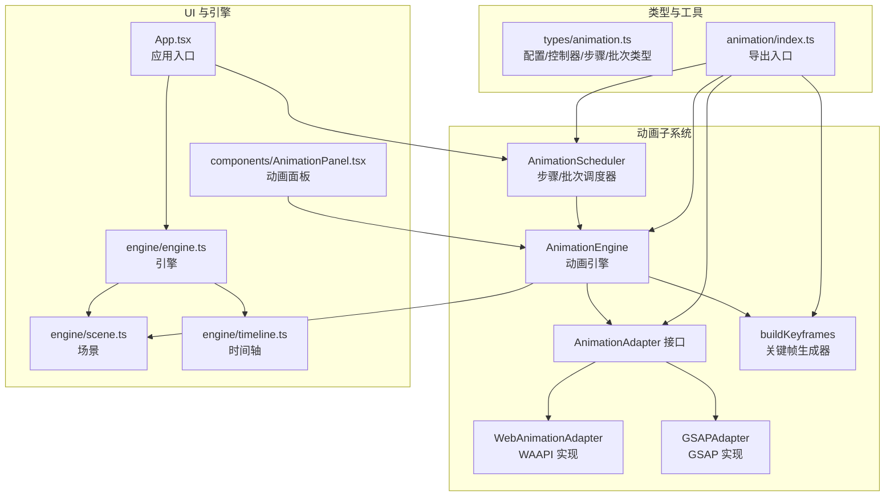
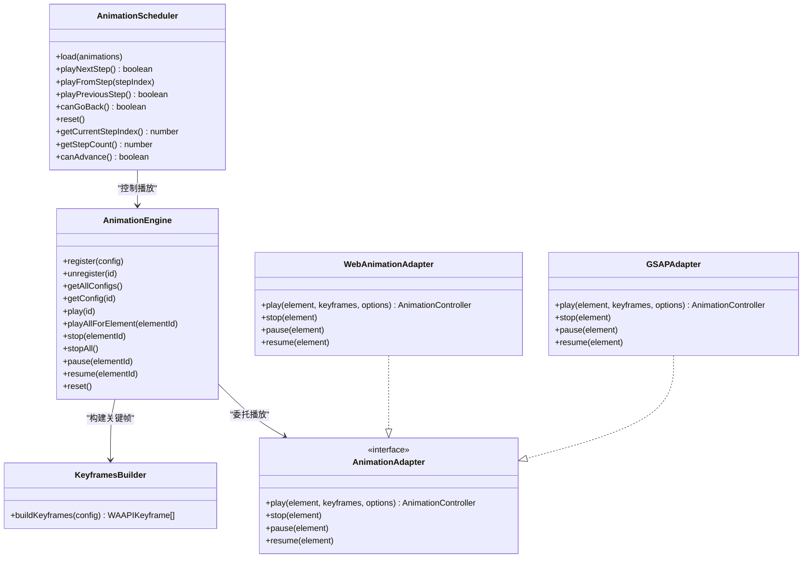
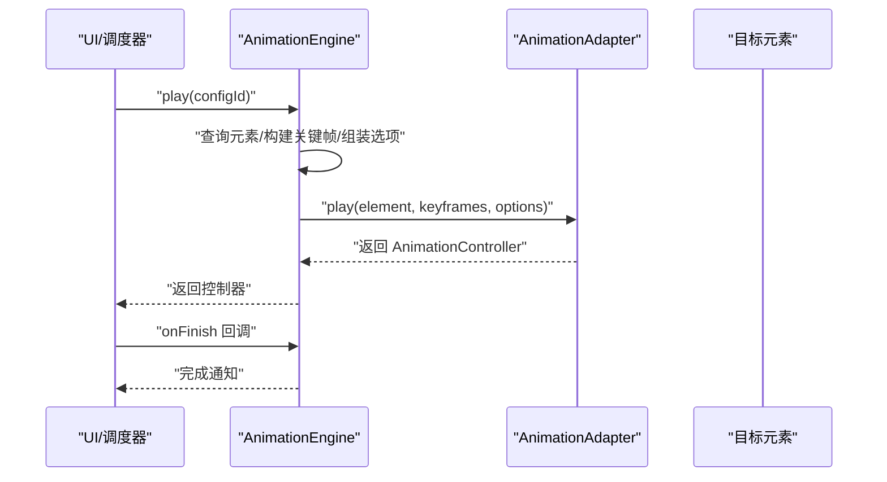
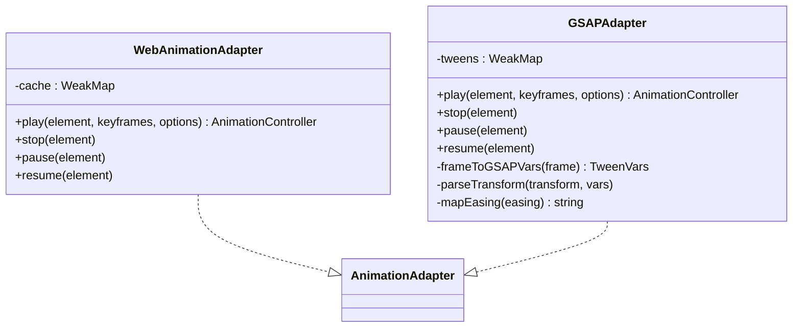
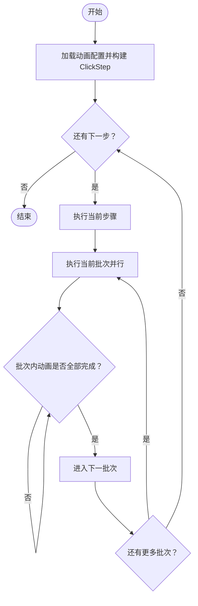
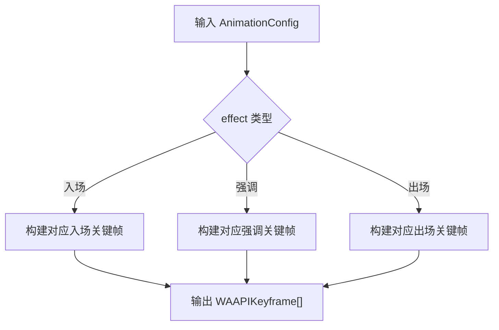
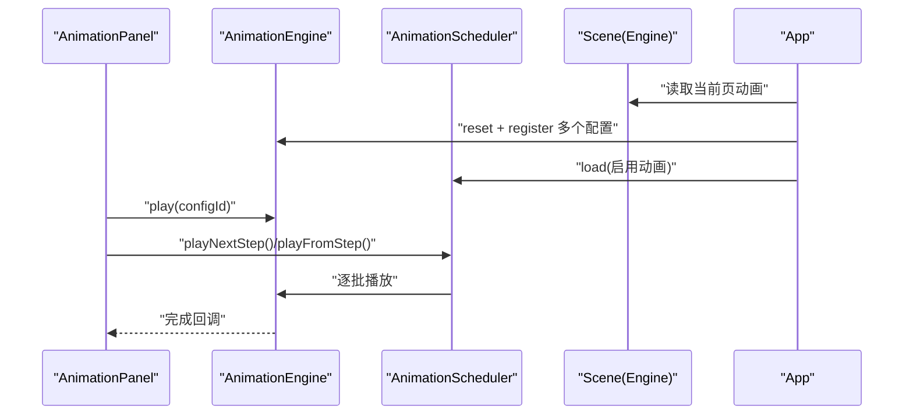
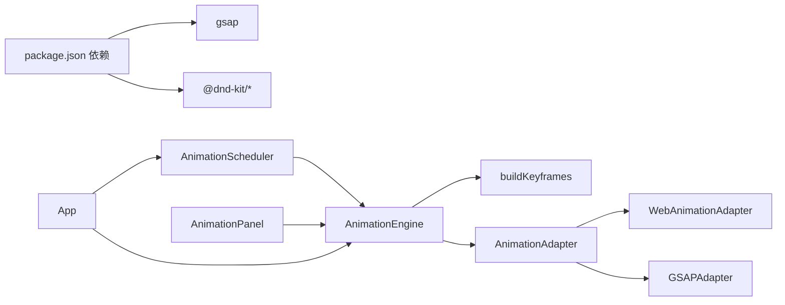

# 动画系统

<cite>
**本文引用的文件**
- [src/animation/engine.ts](file://src/animation/engine.ts)
- [src/animation/adapter.ts](file://src/animation/adapter.ts)
- [src/animation/webAnimationAdapter.ts](file://src/animation/webAnimationAdapter.ts)
- [src/animation/gsapAdapter.ts](file://src/animation/gsapAdapter.ts)
- [src/animation/scheduler.ts](file://src/animation/scheduler.ts)
- [src/animation/buildKeyframes.ts](file://src/animation/buildKeyframes.ts)
- [src/animation/index.ts](file://src/animation/index.ts)
- [src/types/animation.ts](file://src/types/animation.ts)
- [src/components/AnimationPanel.tsx](file://src/components/AnimationPanel.tsx)
- [src/App.tsx](file://src/App.tsx)
- [src/engine/engine.ts](file://src/engine/engine.ts)
- [src/engine/scene.ts](file://src/engine/scene.ts)
- [src/engine/timeline.ts](file://src/engine/timeline.ts)
- [package.json](file://package.json)
- [README.md](file://README.md)
</cite>

## 目录
1. [简介](#简介)
2. [项目结构](#项目结构)
3. [核心组件](#核心组件)
4. [架构总览](#架构总览)
5. [详细组件分析](#详细组件分析)
6. [依赖关系分析](#依赖关系分析)
7. [性能考量](#性能考量)
8. [故障排查指南](#故障排查指南)
9. [结论](#结论)
10. [附录](#附录)

## 简介
本动画系统围绕“配置驱动 + 适配器 + 调度器”的架构设计，提供统一的动画生命周期管理与播放控制能力。系统通过构建 WAAPI 兼容的关键帧，将不同动画配置映射到底层动画库（Web Animations API 或 GSAP），并通过“步骤/批次”执行模型实现可交互的分步演示流程。该文档面向开发者与产品同学，既解释实现原理，也给出使用方法、调试技巧与性能优化建议。

## 项目结构
动画系统位于 src/animation 目录，类型定义在 src/types/animation.ts，UI 集成在 src/components/AnimationPanel.tsx，应用入口在 src/App.tsx，并与引擎系统（Scene/Engine/Timeline）协同工作。

图表来源
- [src/animation/engine.ts:1-120](file://src/animation/engine.ts#L1-L120)
- [src/animation/adapter.ts:1-27](file://src/animation/adapter.ts#L1-L27)
- [src/animation/webAnimationAdapter.ts:1-67](file://src/animation/webAnimationAdapter.ts#L1-L67)
- [src/animation/gsapAdapter.ts:1-140](file://src/animation/gsapAdapter.ts#L1-L140)
- [src/animation/scheduler.ts:1-160](file://src/animation/scheduler.ts#L1-L160)
- [src/animation/buildKeyframes.ts:1-125](file://src/animation/buildKeyframes.ts#L1-L125)
- [src/animation/index.ts:1-8](file://src/animation/index.ts#L1-L8)
- [src/types/animation.ts:1-113](file://src/types/animation.ts#L1-L113)
- [src/components/AnimationPanel.tsx:1-857](file://src/components/AnimationPanel.tsx#L1-L857)
- [src/App.tsx:38-95](file://src/App.tsx#L38-L95)
- [src/engine/engine.ts:1-54](file://src/engine/engine.ts#L1-L54)
- [src/engine/scene.ts:1-273](file://src/engine/scene.ts#L1-L273)
- [src/engine/timeline.ts:1-66](file://src/engine/timeline.ts#L1-L66)

章节来源
- [README.md:1-15](file://README.md#L1-L15)
- [src/animation/index.ts:1-8](file://src/animation/index.ts#L1-L8)

## 核心组件
- AnimationEngine：持有动画配置、查询元素、构建关键帧、委托适配器播放/暂停/停止，并提供批量播放与重置能力。
- AnimationAdapter 接口：抽象底层动画库差异，统一 play/stop/pause/resume 与完成回调。
- WebAnimationAdapter/GSAPAdapter：分别基于原生 Web Animations API 与 GSAP 实现适配器。
- AnimationScheduler：基于 ClickStep/AnimationBatch 的“步骤-批次”执行模型，支持串行批次与并行动画。
- buildKeyframes：根据 AnimationEffect 和参数生成 WAAPI 兼容关键帧数组。
- 类型系统：AnimationConfig、AnimationController、AnimationBatch、ClickStep 等，确保配置与运行时行为一致。

章节来源
- [src/animation/engine.ts:9-119](file://src/animation/engine.ts#L9-L119)
- [src/animation/adapter.ts:7-26](file://src/animation/adapter.ts#L7-L26)
- [src/animation/webAnimationAdapter.ts:12-66](file://src/animation/webAnimationAdapter.ts#L12-L66)
- [src/animation/gsapAdapter.ts:13-139](file://src/animation/gsapAdapter.ts#L13-L139)
- [src/animation/scheduler.ts:56-159](file://src/animation/scheduler.ts#L56-L159)
- [src/animation/buildKeyframes.ts:7-124](file://src/animation/buildKeyframes.ts#L7-L124)
- [src/types/animation.ts:26-113](file://src/types/animation.ts#L26-L113)

## 架构总览
系统采用“配置驱动 + 适配器 + 调度器”的分层架构：
- 配置层：AnimationConfig 描述动画效果、参数、起始类型、时序与重复次数。
- 关键帧层：buildKeyframes 将配置转换为 WAAPI 兼容的关键帧。
- 引擎层：AnimationEngine 统一注册/播放/暂停/停止，屏蔽底层差异。
- 适配层：WebAnimationAdapter/GSAPAdapter 提供具体播放实现。
- 调度层：AnimationScheduler 基于步骤与批次组织播放序列。

图表来源
- [src/animation/engine.ts:9-119](file://src/animation/engine.ts#L9-L119)
- [src/animation/adapter.ts:7-26](file://src/animation/adapter.ts#L7-L26)
- [src/animation/webAnimationAdapter.ts:12-66](file://src/animation/webAnimationAdapter.ts#L12-L66)
- [src/animation/gsapAdapter.ts:13-139](file://src/animation/gsapAdapter.ts#L13-L139)
- [src/animation/scheduler.ts:56-159](file://src/animation/scheduler.ts#L56-L159)
- [src/animation/buildKeyframes.ts:7-9](file://src/animation/buildKeyframes.ts#L7-L9)

## 详细组件分析

### AnimationEngine：生命周期与播放控制
- 注册/注销：以 id 为键维护 AnimationConfig 映射，支持批量播放与按元素播放。
- 查询元素：支持设置作用域根节点，限定 DOM 查询范围，便于预览容器隔离。
- 播放控制：将配置转换为 WAAPI 兼容选项（时长、延迟、缓动、填充、迭代次数），调用适配器播放；返回 AnimationController 用于 finish/cancel/pause/play/onFinish。
- 批量操作：stopAll/pause/resume/reset 清理与重置全部动画。

图表来源
- [src/animation/engine.ts:53-70](file://src/animation/engine.ts#L53-L70)
- [src/animation/adapter.ts:12-16](file://src/animation/adapter.ts#L12-L16)

章节来源
- [src/animation/engine.ts:9-119](file://src/animation/engine.ts#L9-L119)

### 适配器模式：WebAnimationAdapter vs GSAPAdapter
- 共同点
  - 都实现 AnimationAdapter 接口，提供 play/stop/pause/resume 与完成回调。
  - 在 play 前会取消该元素上已存在的动画实例，避免叠加。
- 差异点
  - WebAnimationAdapter：直接使用 element.animate，缓存原生 Animation 对象，事件监听 finish/cancel。
  - GSAPAdapter：将首尾关键帧映射为 from/to 变量，使用 GSAP.fromTo，缓存 Tween 对象，事件使用 onComplete。
  - 参数映射：GSAPAdapter 需要解析 transform 字符串（translate/scale/rotate）与 easing 名称映射。

图表来源
- [src/animation/webAnimationAdapter.ts:12-66](file://src/animation/webAnimationAdapter.ts#L12-L66)
- [src/animation/gsapAdapter.ts:13-139](file://src/animation/gsapAdapter.ts#L13-L139)
- [src/animation/adapter.ts:7-26](file://src/animation/adapter.ts#L7-L26)

章节来源
- [src/animation/webAnimationAdapter.ts:12-66](file://src/animation/webAnimationAdapter.ts#L12-L66)
- [src/animation/gsapAdapter.ts:13-139](file://src/animation/gsapAdapter.ts#L13-L139)

### 步骤执行模型与批次处理机制
- ClickStep/AnimationBatch：将一组动画按“点击开始/与前一同播/在前一后新开一批次”组织为步骤与批次。
- 执行策略：用户点击推进一步；每步内批次顺序执行，批次内动画并行播放；批次完成后进入下一批次。
- 控制流：调度器维护当前步骤索引与运行中的控制器集合，利用每个动画的 onFinish 回调推进批次。

图表来源
- [src/animation/scheduler.ts:56-108](file://src/animation/scheduler.ts#L56-L108)
- [src/animation/scheduler.ts:135-137](file://src/animation/scheduler.ts#L135-L137)

章节来源
- [src/animation/scheduler.ts:13-49](file://src/animation/scheduler.ts#L13-L49)
- [src/animation/scheduler.ts:56-159](file://src/animation/scheduler.ts#L56-L159)
- [README.md:6-15](file://README.md#L6-L15)

### 关键帧生成器：从配置到 WAAPI
- 输入：AnimationConfig.effect 与 params。
- 输出：WAAPIKeyframe[]，包含 offset 与属性键值。
- 支持：入场/强调/出场效果，如 fadeIn/zoomIn/slideIn/flyIn/rotateIn、pulse/shake/blink/scale/highlight、fadeOut/zoomOut/slideOut/flyOut/rotateOut。
- 参数化：slide/fly 使用方向与距离，scale 使用起止缩放，rotate 使用起止角度，highlight 使用亮度系数。

图表来源
- [src/animation/buildKeyframes.ts:7-124](file://src/animation/buildKeyframes.ts#L7-L124)

章节来源
- [src/animation/buildKeyframes.ts:7-124](file://src/animation/buildKeyframes.ts#L7-L124)
- [src/types/animation.ts:6-12](file://src/types/animation.ts#L6-L12)
- [src/types/animation.ts:41-70](file://src/types/animation.ts#L41-L70)

### 与引擎系统的集成与 UI 协作
- App.tsx：在动画面板激活且非预览模式时，根据当前页面动画重建 AnimationEngine 并创建 AnimationScheduler；随动画变化自动重载。
- AnimationPanel.tsx：提供动画增删改查、拖拽排序、参数表单、单个播放、从某处播放等功能；与 AnimationEngine 同步配置。
- Engine/Scene：提供动画的增删改查与排序，作为动画配置的数据源。

图表来源
- [src/App.tsx:38-95](file://src/App.tsx#L38-L95)
- [src/components/AnimationPanel.tsx:265-302](file://src/components/AnimationPanel.tsx#L265-L302)
- [src/engine/scene.ts:179-233](file://src/engine/scene.ts#L179-L233)
- [src/engine/engine.ts:29-40](file://src/engine/engine.ts#L29-L40)

章节来源
- [src/App.tsx:38-95](file://src/App.tsx#L38-L95)
- [src/components/AnimationPanel.tsx:87-302](file://src/components/AnimationPanel.tsx#L87-L302)
- [src/engine/scene.ts:179-233](file://src/engine/scene.ts#L179-L233)
- [src/engine/engine.ts:29-40](file://src/engine/engine.ts#L29-L40)

## 依赖关系分析
- 运行时依赖：GSAP 由适配器使用；UI 依赖 React 与 @dnd-kit 实现拖拽与排序。
- 内部耦合：AnimationEngine 依赖 buildKeyframes 与 AnimationAdapter；AnimationScheduler 依赖 AnimationEngine；UI 通过 App 与 AnimationPanel 协同。

图表来源
- [package.json:12-20](file://package.json#L12-L20)
- [src/animation/engine.ts:1-3](file://src/animation/engine.ts#L1-L3)
- [src/animation/scheduler.ts:1-2](file://src/animation/scheduler.ts#L1-L2)
- [src/components/AnimationPanel.tsx:1-10](file://src/components/AnimationPanel.tsx#L1-L10)
- [src/App.tsx:38-53](file://src/App.tsx#L38-L53)

章节来源
- [package.json:12-20](file://package.json#L12-L20)
- [src/animation/engine.ts:1-3](file://src/animation/engine.ts#L1-L3)
- [src/animation/scheduler.ts:1-2](file://src/animation/scheduler.ts#L1-L2)
- [src/components/AnimationPanel.tsx:1-10](file://src/components/AnimationPanel.tsx#L1-L10)
- [src/App.tsx:38-53](file://src/App.tsx#L38-L53)

## 性能考量
- 并发与串行：批次内并行播放多个动画，批次间串行，减少等待时间，提升整体流畅度。
- 缓存与复用：适配器内部使用 WeakMap 缓存动画实例，避免重复创建与内存泄漏。
- 事件与清理：完成或回退时及时 cancel/kill，避免残留动画占用资源。
- DOM 查询范围：通过 setScopeRoot 限制查询范围，降低选择器开销，尤其在复杂预览容器中。
- 关键帧数量：尽量使用少量关键帧表达效果，减少渲染压力。
- 缓动与迭代：合理设置 easing 与 iterations，避免过度抖动或重复播放导致卡顿。

## 故障排查指南
- 元素未找到
  - 现象：play 返回空，无法播放。
  - 排查：确认 elementId 是否正确；若使用预览容器，检查 setScopeRoot 是否设置正确。
  - 参考路径：[src/animation/engine.ts:24-30](file://src/animation/engine.ts#L24-L30)
- 适配器不生效
  - 现象：调用 play 无动画。
  - 排查：确认传入的 AnimationAdapter 实例是否正确；检查 keyframes 是否为空；GSAP 依赖是否安装。
  - 参考路径：[src/animation/webAnimationAdapter.ts:15-43](file://src/animation/webAnimationAdapter.ts#L15-L43)，[src/animation/gsapAdapter.ts:16-60](file://src/animation/gsapAdapter.ts#L16-L60)，[package.json:16](file://package.json#L16)
- 批次执行异常
  - 现象：点击下一步无反应或提前进入下一批次。
  - 排查：确认 buildClickSteps 的 startType 设置；检查每个动画的 onFinish 回调是否被触发。
  - 参考路径：[src/animation/scheduler.ts:13-49](file://src/animation/scheduler.ts#L13-L49)，[src/animation/scheduler.ts:79-108](file://src/animation/scheduler.ts#L79-L108)
- 调试技巧
  - 在 UI 层打印当前步骤/批次索引与动画 id 列表，核对执行顺序。
  - 使用 AnimationController 的 onFinish 回调进行链式验证。
  - 在 App.tsx 中观察 scheduler 的 reset/load 流程，确保数据同步。

章节来源
- [src/animation/engine.ts:24-30](file://src/animation/engine.ts#L24-L30)
- [src/animation/webAnimationAdapter.ts:15-43](file://src/animation/webAnimationAdapter.ts#L15-L43)
- [src/animation/gsapAdapter.ts:16-60](file://src/animation/gsapAdapter.ts#L16-L60)
- [src/animation/scheduler.ts:13-49](file://src/animation/scheduler.ts#L13-L49)
- [src/animation/scheduler.ts:79-108](file://src/animation/scheduler.ts#L79-L108)
- [package.json:16](file://package.json#L16)

## 结论
该动画系统通过清晰的分层与接口抽象，实现了配置驱动、跨库适配与可交互的步骤/批次播放模型。WebAnimationAdapter 适合轻量与原生需求，GSAPAdapter 提供更丰富的缓动与高级特性。结合 UI 面板与引擎系统，可高效地完成动画配置、预览与演示。

## 附录

### 动画配置示例（字段说明）
- id：动画唯一标识
- elementId：绑定的元素 id
- name/type/effect/startType/duration/delay/easing/repeatCount/params
- enable：是否启用
- 参考类型定义：[src/types/animation.ts:26-39](file://src/types/animation.ts#L26-L39)

章节来源
- [src/types/animation.ts:26-39](file://src/types/animation.ts#L26-L39)

### 播放控制方法清单
- AnimationEngine
  - register/unregister/getAllConfigs/getConfig
  - play/playAllForElement/stop/stopAll/pause/resume/reset
  - setScopeRoot
  - 参考路径：[src/animation/engine.ts:32-118](file://src/animation/engine.ts#L32-L118)
- AnimationController
  - finish/cancel/pause/play/onFinish
  - 参考路径：[src/types/animation.ts:92-98](file://src/types/animation.ts#L92-L98)
- AnimationScheduler
  - load/playNextStep/playFromStep/playPreviousStep/canGoBack/reset/getCurrentStepIndex/getStepCount/canAdvance
  - 参考路径：[src/animation/scheduler.ts:66-159](file://src/animation/scheduler.ts#L66-L159)

章节来源
- [src/animation/engine.ts:32-118](file://src/animation/engine.ts#L32-L118)
- [src/types/animation.ts:92-98](file://src/types/animation.ts#L92-L98)
- [src/animation/scheduler.ts:66-159](file://src/animation/scheduler.ts#L66-L159)

### 创建动画效果的步骤指南
- 在 AnimationPanel 中选择元素，填写名称、效果、起始类型、时长、延迟、缓动与重复次数。
- 根据效果需要设置参数（如滑入方向与距离、缩放起止、旋转角度、高亮亮度）。
- 保存后，引擎会注册该配置；在动画标签页激活时，App 自动重建调度器并同步状态。
- 参考路径：[src/components/AnimationPanel.tsx:185-215](file://src/components/AnimationPanel.tsx#L185-L215)，[src/App.tsx:38-74](file://src/App.tsx#L38-L74)

章节来源
- [src/components/AnimationPanel.tsx:185-215](file://src/components/AnimationPanel.tsx#L185-L215)
- [src/App.tsx:38-74](file://src/App.tsx#L38-L74)

### 最佳实践
- 使用 setScopeRoot 将预览容器作为作用域，避免全局选择器干扰。
- 合理设置 startType：仅在需要独立步骤时使用 click，否则使用 withPrev/afterPrev。
- 批次内动画尽量保持时长与延迟一致，保证视觉节奏。
- 对复杂缓动优先使用 GSAPAdapter，对简单过渡可使用 WebAnimationAdapter。
- 在 UI 层统一 stopAll，避免多动画叠加造成冲突。

章节来源
- [src/animation/engine.ts:19-22](file://src/animation/engine.ts#L19-L22)
- [src/animation/scheduler.ts:13-49](file://src/animation/scheduler.ts#L13-L49)
- [src/animation/gsapAdapter.ts:13-139](file://src/animation/gsapAdapter.ts#L13-L139)
- [src/animation/webAnimationAdapter.ts:12-66](file://src/animation/webAnimationAdapter.ts#L12-L66)