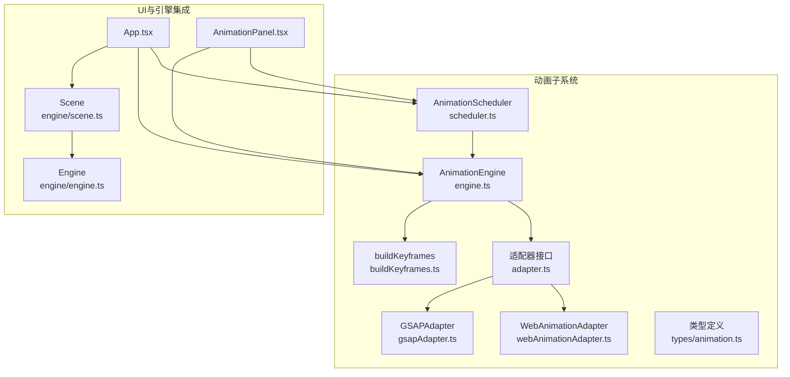
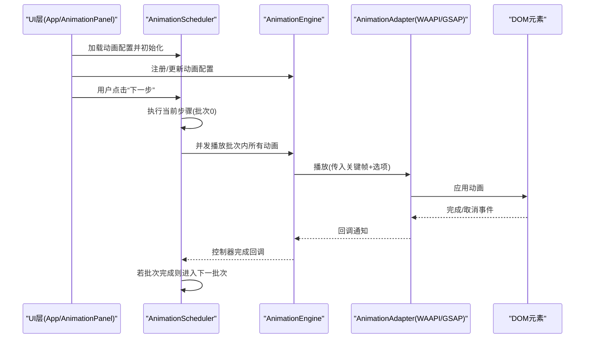
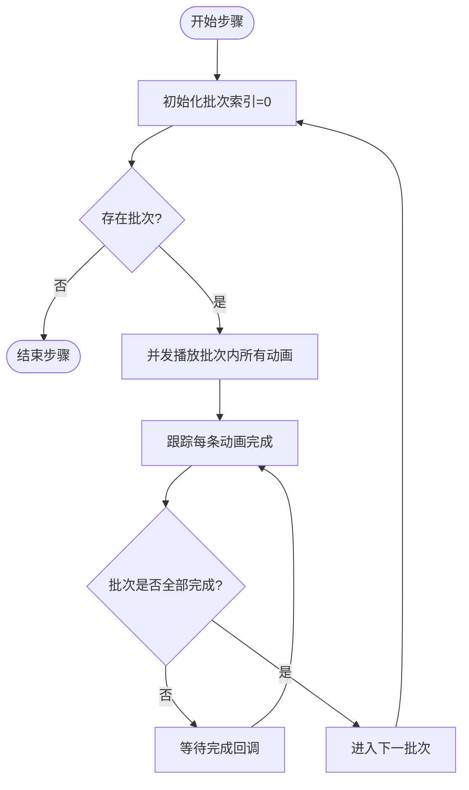
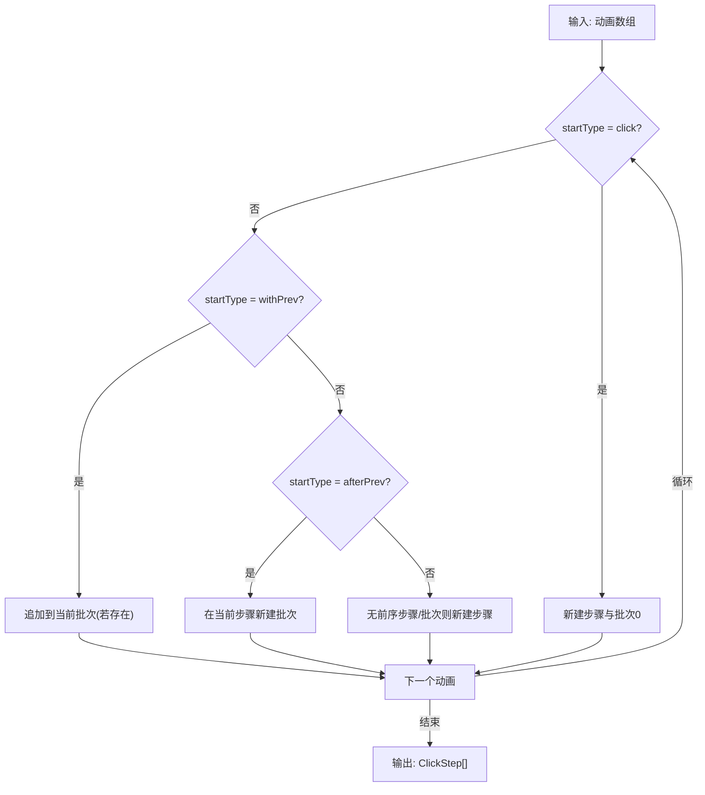
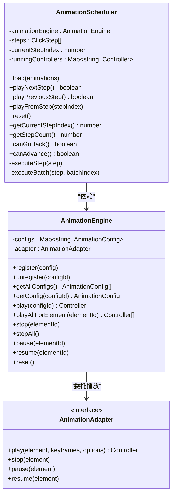
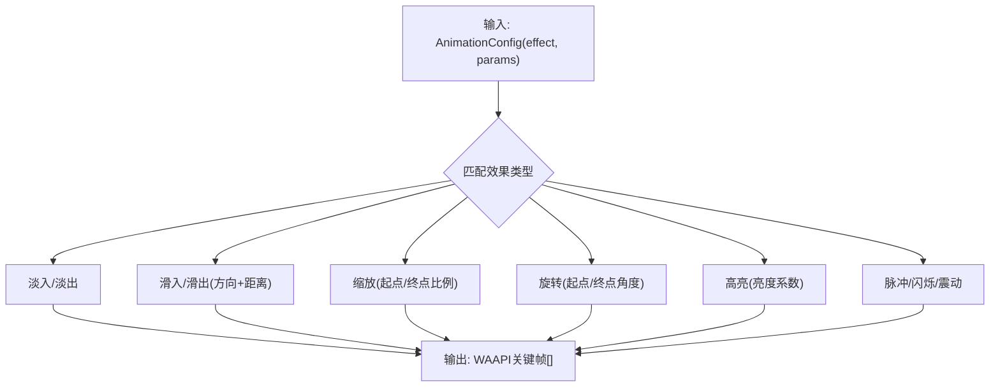
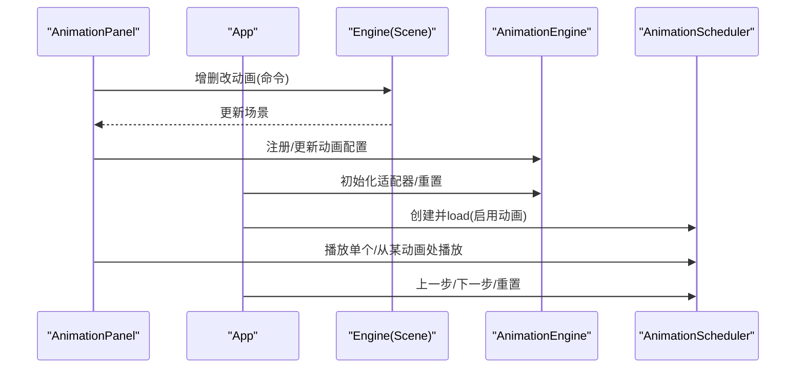
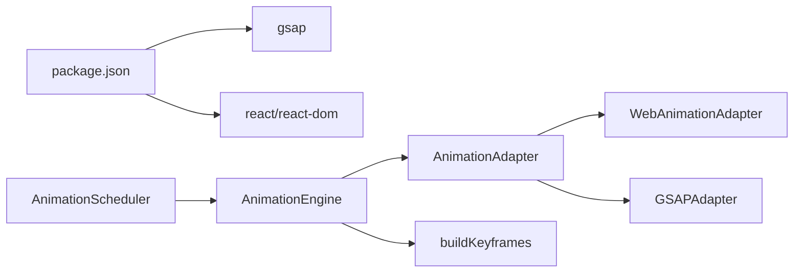

# 动画调度器

<cite>
**本文引用的文件**
- [src/animation/scheduler.ts](file://src/animation/scheduler.ts)
- [src/animation/engine.ts](file://src/animation/engine.ts)
- [src/animation/adapter.ts](file://src/animation/adapter.ts)
- [src/animation/webAnimationAdapter.ts](file://src/animation/webAnimationAdapter.ts)
- [src/animation/gsapAdapter.ts](file://src/animation/gsapAdapter.ts)
- [src/animation/buildKeyframes.ts](file://src/animation/buildKeyframes.ts)
- [src/animation/index.ts](file://src/animation/index.ts)
- [src/types/animation.ts](file://src/types/animation.ts)
- [src/components/AnimationPanel.tsx](file://src/components/AnimationPanel.tsx)
- [src/App.tsx](file://src/App.tsx)
- [src/engine/engine.ts](file://src/engine/engine.ts)
- [src/engine/scene.ts](file://src/engine/scene.ts)
- [package.json](file://package.json)
</cite>

## 目录
1. [简介](#简介)
2. [项目结构](#项目结构)
3. [核心组件](#核心组件)
4. [架构总览](#架构总览)
5. [详细组件分析](#详细组件分析)
6. [依赖关系分析](#依赖关系分析)
7. [性能考量](#性能考量)
8. [故障排查指南](#故障排查指南)
9. [结论](#结论)
10. [附录](#附录)

## 简介
本技术文档围绕动画调度器展开，系统性阐述其“步骤执行模型”与“批次处理机制”，解释动画队列管理、并发控制与时间轴协调策略；说明调度器如何处理多动画同步播放、优先级管理与资源分配；并提供调度策略的配置项、性能优化建议与调试方法，以及与引擎系统的集成方式与扩展点。

## 项目结构
动画子系统位于 src/animation 下，包含适配器抽象、引擎、关键帧构建与调度器等模块；类型定义集中在 src/types/animation.ts；UI 集成在 src/components/AnimationPanel.tsx 与 src/App.tsx 中。

图表来源
- [src/animation/adapter.ts:1-27](file://src/animation/adapter.ts#L1-L27)
- [src/animation/webAnimationAdapter.ts:1-67](file://src/animation/webAnimationAdapter.ts#L1-L67)
- [src/animation/gsapAdapter.ts:1-140](file://src/animation/gsapAdapter.ts#L1-L140)
- [src/animation/engine.ts:1-120](file://src/animation/engine.ts#L1-L120)
- [src/animation/buildKeyframes.ts:1-125](file://src/animation/buildKeyframes.ts#L1-L125)
- [src/animation/scheduler.ts:1-160](file://src/animation/scheduler.ts#L1-L160)
- [src/types/animation.ts:1-113](file://src/types/animation.ts#L1-L113)
- [src/components/AnimationPanel.tsx:1-857](file://src/components/AnimationPanel.tsx#L1-L857)
- [src/App.tsx:1-344](file://src/App.tsx#L1-L344)
- [src/engine/scene.ts:1-273](file://src/engine/scene.ts#L1-L273)
- [src/engine/engine.ts:1-54](file://src/engine/engine.ts#L1-L54)

章节来源
- [src/animation/scheduler.ts:1-160](file://src/animation/scheduler.ts#L1-L160)
- [src/animation/engine.ts:1-120](file://src/animation/engine.ts#L1-L120)
- [src/animation/adapter.ts:1-27](file://src/animation/adapter.ts#L1-L27)
- [src/animation/webAnimationAdapter.ts:1-67](file://src/animation/webAnimationAdapter.ts#L1-L67)
- [src/animation/gsapAdapter.ts:1-140](file://src/animation/gsapAdapter.ts#L1-L140)
- [src/animation/buildKeyframes.ts:1-125](file://src/animation/buildKeyframes.ts#L1-L125)
- [src/types/animation.ts:1-113](file://src/types/animation.ts#L1-L113)
- [src/components/AnimationPanel.tsx:1-857](file://src/components/AnimationPanel.tsx#L1-L857)
- [src/App.tsx:1-344](file://src/App.tsx#L1-L344)
- [src/engine/scene.ts:1-273](file://src/engine/scene.ts#L1-L273)
- [src/engine/engine.ts:1-54](file://src/engine/engine.ts#L1-L54)

## 核心组件
- 调度器 AnimationScheduler：实现“步骤-批次-并发”的三层执行模型，负责按用户点击推进步骤，步骤内批次顺序执行，批次内动画并发播放，并在批次全部完成后进入下一批次。
- 引擎 AnimationEngine：注册/注销动画配置、查询元素、构建关键帧、委托适配器播放/暂停/停止/恢复，并提供全局停止能力。
- 适配器 AnimationAdapter：抽象底层动画库（Web Animations API 或 GSAP），统一播放生命周期回调与控制接口。
- 关键帧构建 buildKeyframes：根据动画效果与参数生成 WAAPI 兼容的关键帧数组。
- 类型系统 types/animation.ts：定义动画配置、关键帧、控制器、批次与步骤等数据结构与枚举。

章节来源
- [src/animation/scheduler.ts:51-160](file://src/animation/scheduler.ts#L51-L160)
- [src/animation/engine.ts:9-120](file://src/animation/engine.ts#L9-L120)
- [src/animation/adapter.ts:7-26](file://src/animation/adapter.ts#L7-L26)
- [src/animation/buildKeyframes.ts:7-125](file://src/animation/buildKeyframes.ts#L7-L125)
- [src/types/animation.ts:26-113](file://src/types/animation.ts#L26-L113)

## 架构总览
调度器通过 AnimationEngine 统一管理动画生命周期，使用 AnimationAdapter 抽象不同底层实现；UI 层通过 App.tsx 与 AnimationPanel.tsx 将场景中的动画配置加载到引擎并驱动调度器。

图表来源
- [src/App.tsx:38-95](file://src/App.tsx#L38-L95)
- [src/components/AnimationPanel.tsx:265-302](file://src/components/AnimationPanel.tsx#L265-L302)
- [src/animation/scheduler.ts:72-108](file://src/animation/scheduler.ts#L72-L108)
- [src/animation/engine.ts:52-70](file://src/animation/engine.ts#L52-L70)
- [src/animation/webAnimationAdapter.ts:15-43](file://src/animation/webAnimationAdapter.ts#L15-L43)
- [src/animation/gsapAdapter.ts:16-60](file://src/animation/gsapAdapter.ts#L16-L60)

## 详细组件分析

### 步骤-批次-并发执行模型
- 步骤 ClickStep：由若干批次组成，步骤在用户点击时触发。
- 批次 AnimationBatch：批次内所有动画并发播放；批次间顺序执行。
- 并发控制：调度器为每个动画启动播放后，收集未完成集合，等待所有动画完成后再进入下一批次。
- 回退与重播：支持回退到上一步并重新执行当前步骤；会取消当前运行中的所有动画控制器。

图表来源
- [src/animation/scheduler.ts:79-108](file://src/animation/scheduler.ts#L79-L108)

章节来源
- [src/animation/scheduler.ts:51-160](file://src/animation/scheduler.ts#L51-L160)

### 动画队列管理与起始类型
- 起始类型 StartType：click（新步骤）、withPrev（同一批次，紧随前一个）、afterPrev（新批次，跟随前一个）。
- 构建 ClickStep：遍历动画配置，依据起始类型划分批次与步骤，确保首个非点击动画也会被纳入新步骤，避免静默丢弃。

图表来源
- [src/animation/scheduler.ts:13-49](file://src/animation/scheduler.ts#L13-L49)

章节来源
- [src/animation/scheduler.ts:13-49](file://src/animation/scheduler.ts#L13-L49)

### 并发控制与资源分配
- 并发策略：批次内所有动画控制器同时启动，使用 Map 记录正在运行的控制器，以 ID 为键，便于取消与清理。
- 资源回收：步骤切换或回退时，先取消所有运行中控制器，再清空映射，防止内存泄漏与残留动画。
- 生命周期：控制器提供 onFinish 回调，用于减少未完成计数并在批次全部完成后推进到下一阶段。

图表来源
- [src/animation/scheduler.ts:56-160](file://src/animation/scheduler.ts#L56-L160)
- [src/animation/engine.ts:9-120](file://src/animation/engine.ts#L9-L120)
- [src/animation/adapter.ts:7-26](file://src/animation/adapter.ts#L7-L26)

章节来源
- [src/animation/scheduler.ts:56-160](file://src/animation/scheduler.ts#L56-L160)
- [src/animation/engine.ts:9-120](file://src/animation/engine.ts#L9-L120)

### 关键帧构建与效果映射
- buildKeyframes：根据 Effect 与参数生成 WAAPI 兼容的关键帧数组，覆盖进入、强调、退出三类效果。
- 参数化：滑动/缩放/旋转/高亮等效果通过参数动态计算初始与目标状态。
- 适配器差异：WebAnimationAdapter 使用原生 animate；GSAPAdapter 将关键帧映射为 fromTo 变量，进行平移/缩放/旋转解析与缓动映射。

图表来源
- [src/animation/buildKeyframes.ts:7-125](file://src/animation/buildKeyframes.ts#L7-L125)

章节来源
- [src/animation/buildKeyframes.ts:7-125](file://src/animation/buildKeyframes.ts#L7-L125)
- [src/animation/webAnimationAdapter.ts:15-43](file://src/animation/webAnimationAdapter.ts#L15-L43)
- [src/animation/gsapAdapter.ts:16-139](file://src/animation/gsapAdapter.ts#L16-L139)

### 与引擎系统的集成与扩展点
- App.tsx：在动画面板激活时，将当前页面动画配置同步至 AnimationEngine，并创建 AnimationScheduler 实例；提供“上一步/下一步/重置”按钮驱动调度器。
- AnimationPanel.tsx：提供单动画播放、从某动画处播放整步的能力；拖拽排序时自动修复起始类型。
- Scene/Engine：提供动画增删改查与重排，配合命令模式 BatchAnimationCommand，保证编辑操作的可撤销/可重做。

图表来源
- [src/App.tsx:38-95](file://src/App.tsx#L38-L95)
- [src/components/AnimationPanel.tsx:203-328](file://src/components/AnimationPanel.tsx#L203-L328)
- [src/engine/scene.ts:179-233](file://src/engine/scene.ts#L179-L233)
- [src/engine/engine.ts:29-40](file://src/engine/engine.ts#L29-L40)

章节来源
- [src/App.tsx:38-95](file://src/App.tsx#L38-L95)
- [src/components/AnimationPanel.tsx:203-328](file://src/components/AnimationPanel.tsx#L203-L328)
- [src/engine/scene.ts:179-233](file://src/engine/scene.ts#L179-L233)
- [src/engine/engine.ts:29-40](file://src/engine/engine.ts#L29-L40)

## 依赖关系分析
- 运行时依赖：项目通过 package.json 引入 GSAP 作为可选适配器，React 生态用于 UI。
- 内部耦合：调度器仅依赖 AnimationEngine 接口；AnimationEngine 依赖 AnimationAdapter 接口；buildKeyframes 与适配器解耦。
- 外部适配器：WebAnimationAdapter 使用浏览器原生 Web Animations API；GSAPAdapter 使用 GSAP 库进行高性能动画。

图表来源
- [package.json:12-32](file://package.json#L12-L32)
- [src/animation/scheduler.ts:56-64](file://src/animation/scheduler.ts#L56-L64)
- [src/animation/engine.ts:9-17](file://src/animation/engine.ts#L9-L17)
- [src/animation/webAnimationAdapter.ts:12-13](file://src/animation/webAnimationAdapter.ts#L12-L13)
- [src/animation/gsapAdapter.ts:1-2](file://src/animation/gsapAdapter.ts#L1-L2)

章节来源
- [package.json:12-32](file://package.json#L12-L32)
- [src/animation/scheduler.ts:56-64](file://src/animation/scheduler.ts#L56-L64)
- [src/animation/engine.ts:9-17](file://src/animation/engine.ts#L9-L17)
- [src/animation/webAnimationAdapter.ts:12-13](file://src/animation/webAnimationAdapter.ts#L12-L13)
- [src/animation/gsapAdapter.ts:1-2](file://src/animation/gsapAdapter.ts#L1-L2)

## 性能考量
- 并发批处理：批次内并发播放可提升整体吞吐，但需注意 DOM 查询与关键帧构建开销；建议批量注册动画后一次性调度。
- 控制器复用与清理：使用 WeakMap 缓存底层动画实例，避免重复创建；回退/重置时及时 cancel 并清理映射。
- 适配器选择：Web Animations API 更轻量，GSAP 提供更丰富的缓动与插件生态；根据需求选择。
- 关键帧优化：尽量复用参数化的关键帧生成逻辑，避免重复计算；对复杂变换（如 translate/scale/rotate）在 GSAP 侧进行解析与合并。
- UI 刷新：在动画播放期间避免频繁重排与样式抖动；必要时使用 requestAnimationFrame 合并更新。

## 故障排查指南
- 动画不播放
  - 检查元素是否存在：AnimationEngine 在播放前会查询元素，若不存在则返回空；确认元素 ID 与 data-element-id 匹配。
  - 检查配置是否注册：确保在 AnimationEngine 中已注册对应 id 的动画配置。
  - 检查适配器可用性：确认适配器已正确注入且底层 API 可用。
- 回退异常
  - 回退时会取消所有运行中控制器并清空映射；若出现残留动画，检查控制器 onFinish 回调是否正确触发。
- 批次卡住
  - 若某个动画无法完成，会导致批次无法推进；检查该动画的控制器 onFinish 是否被调用，或是否存在底层播放失败。
- 调试建议
  - 在 AnimationPanel 中使用“播放单个/从某动画处播放”验证局部问题。
  - 在 App.tsx 中观察调度器状态变化与进度提示，定位步骤/批次问题。
  - 对于 GSAP 适配器，检查缓动映射与 fromTo 参数转换是否正确。

章节来源
- [src/animation/engine.ts:24-30](file://src/animation/engine.ts#L24-L30)
- [src/animation/engine.ts:52-70](file://src/animation/engine.ts#L52-L70)
- [src/animation/scheduler.ts:115-133](file://src/animation/scheduler.ts#L115-L133)
- [src/components/AnimationPanel.tsx:265-302](file://src/components/AnimationPanel.tsx#L265-L302)
- [src/App.tsx:87-105](file://src/App.tsx#L87-L105)

## 结论
动画调度器通过“步骤-批次-并发”的分层模型，实现了清晰的时序控制与高效的并发执行。结合适配器抽象与关键帧构建，系统在保持可扩展性的同时兼顾性能与易用性。通过合理的配置与调试流程，可稳定支撑多动画同步播放与复杂交互场景。

## 附录

### 调度策略配置选项
- 起始类型（StartType）
  - click：新步骤开始
  - withPrev：与前一动画同一批次
  - afterPrev：在前一动画之后的新批次
- 动画参数（Effect + Params）
  - 滑入/滑出：方向与距离
  - 缩放：起止比例
  - 旋转：起止角度
  - 高亮：亮度系数
- 时间与重复
  - 持续时间、延迟、缓动、重复次数

章节来源
- [src/types/animation.ts:14-39](file://src/types/animation.ts#L14-L39)
- [src/animation/buildKeyframes.ts:11-125](file://src/animation/buildKeyframes.ts#L11-L125)

### 扩展点与最佳实践
- 新增适配器：实现 AnimationAdapter 接口，即可无缝接入 AnimationEngine。
- 自定义关键帧：在 buildKeyframes 中新增效果分支，保持 WAAPI 兼容格式。
- 批量命令：使用 BatchAnimationCommand 将多次变更合并为单一命令，提升历史管理效率。
- UI 集成：在 App.tsx 与 AnimationPanel.tsx 中维护调度器生命周期与状态同步。

章节来源
- [src/animation/adapter.ts:7-26](file://src/animation/adapter.ts#L7-L26)
- [src/animation/buildKeyframes.ts:7-125](file://src/animation/buildKeyframes.ts#L7-L125)
- [src/engine/animationCommands.ts:14-44](file://src/engine/animationCommands.ts#L14-L44)
- [src/App.tsx:38-95](file://src/App.tsx#L38-L95)
- [src/components/AnimationPanel.tsx:203-328](file://src/components/AnimationPanel.tsx#L203-L328)