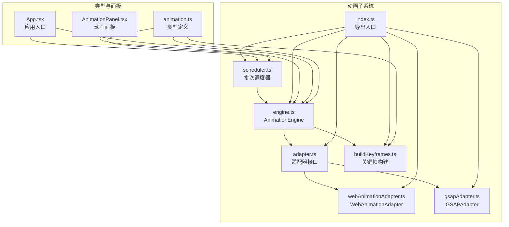
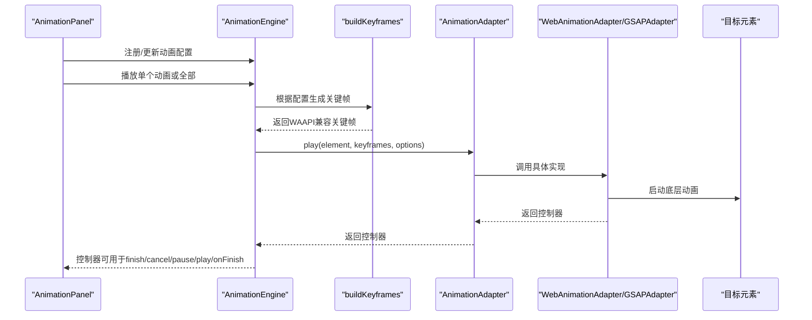
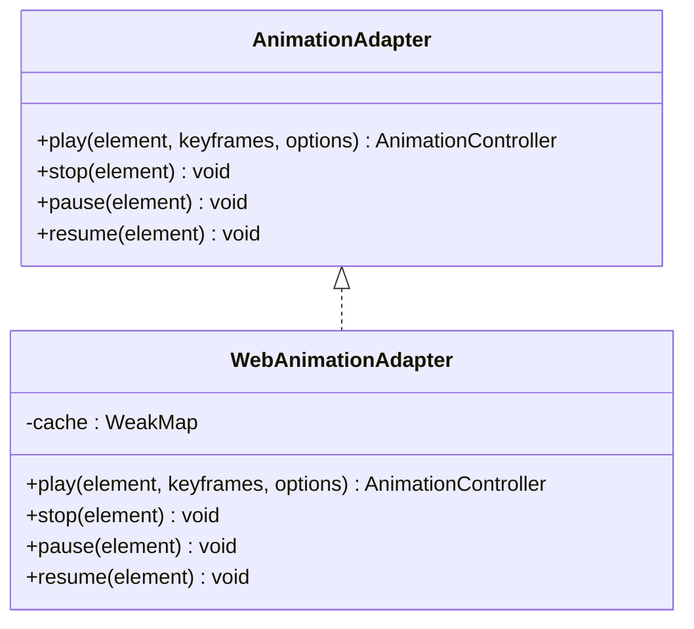
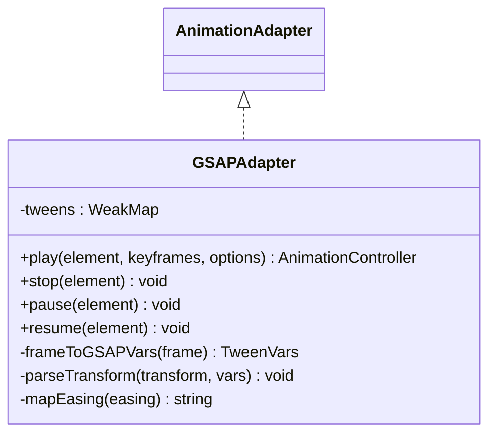
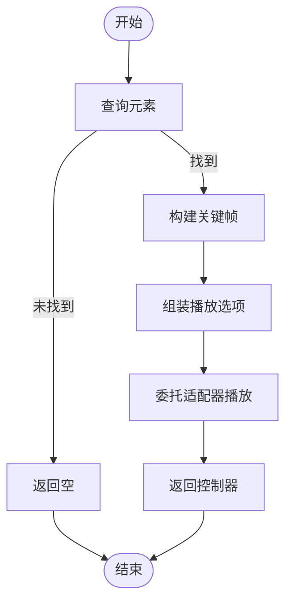
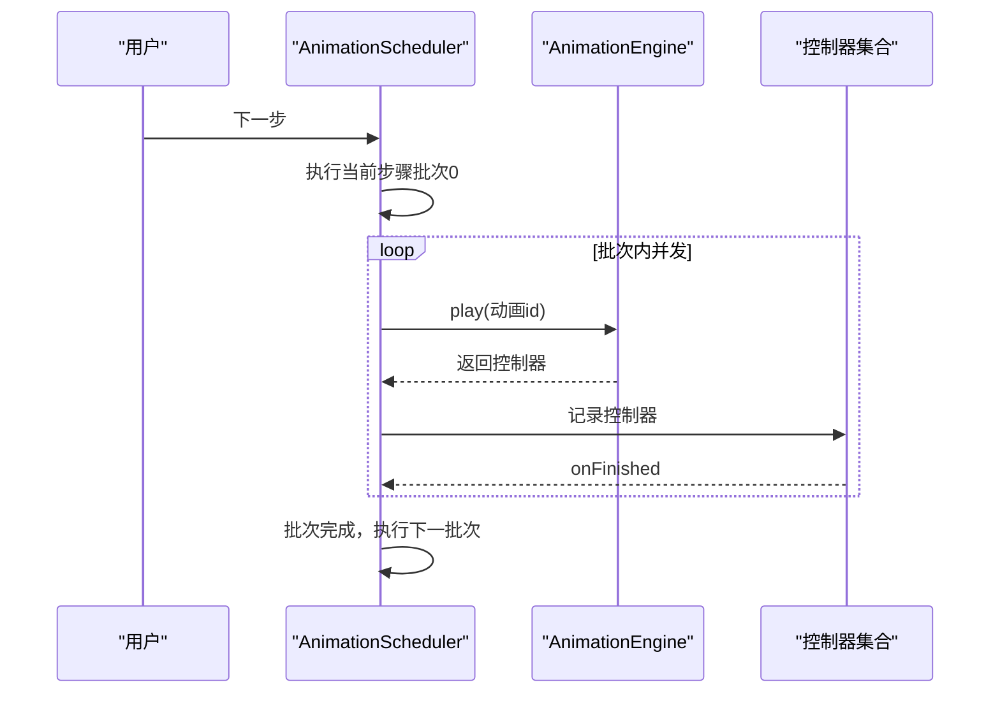
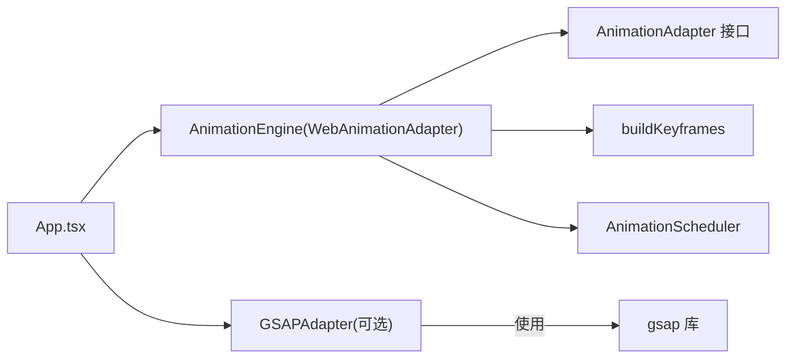

# 动画适配器

<cite>
**本文档引用的文件**
- [adapter.ts](file://src/animation/adapter.ts)
- [webAnimationAdapter.ts](file://src/animation/webAnimationAdapter.ts)
- [gsapAdapter.ts](file://src/animation/gsapAdapter.ts)
- [engine.ts](file://src/animation/engine.ts)
- [buildKeyframes.ts](file://src/animation/buildKeyframes.ts)
- [scheduler.ts](file://src/animation/scheduler.ts)
- [index.ts](file://src/animation/index.ts)
- [animation.ts](file://src/types/animation.ts)
- [AnimationPanel.tsx](file://src/components/AnimationPanel.tsx)
- [App.tsx](file://src/App.tsx)
- [package.json](file://package.json)
</cite>

## 目录
1. [简介](#简介)
2. [项目结构](#项目结构)
3. [核心组件](#核心组件)
4. [架构总览](#架构总览)
5. [详细组件分析](#详细组件分析)
6. [依赖关系分析](#依赖关系分析)
7. [性能考量](#性能考量)
8. [故障排查指南](#故障排查指南)
9. [结论](#结论)
10. [附录](#附录)

## 简介
本技术文档围绕动画适配器系统展开，系统通过统一的适配器接口抽象底层动画实现，当前包含两种实现：
- WebAnimationAdapter：基于原生 Web Animations API（element.animate）
- GSAPAdapter：基于第三方库 GSAP

系统采用“配置驱动 + 关键帧构建 + 批次调度”的模式，支持多种动画效果（进入、强调、退出），并通过批次模型实现“点击触发、分步执行”的教学演示流程。

## 项目结构
动画子系统位于 src/animation 目录，类型定义位于 src/types/animation.ts，UI 面板位于 src/components/AnimationPanel.tsx，应用入口在 src/App.tsx 中初始化默认适配器。

图表来源
- [adapter.ts:1-27](file://src/animation/adapter.ts#L1-L27)
- [webAnimationAdapter.ts:1-67](file://src/animation/webAnimationAdapter.ts#L1-L67)
- [gsapAdapter.ts:1-140](file://src/animation/gsapAdapter.ts#L1-L140)
- [engine.ts:1-120](file://src/animation/engine.ts#L1-L120)
- [buildKeyframes.ts:1-125](file://src/animation/buildKeyframes.ts#L1-L125)
- [scheduler.ts:1-160](file://src/animation/scheduler.ts#L1-L160)
- [index.ts:1-8](file://src/animation/index.ts#L1-L8)
- [animation.ts:1-113](file://src/types/animation.ts#L1-L113)
- [AnimationPanel.tsx:1-857](file://src/components/AnimationPanel.tsx#L1-L857)
- [App.tsx:1-344](file://src/App.tsx#L1-L344)

章节来源
- [index.ts:1-8](file://src/animation/index.ts#L1-L8)
- [animation.ts:1-113](file://src/types/animation.ts#L1-L113)

## 核心组件
- 适配器接口（AnimationAdapter）：定义统一的播放、停止、暂停、恢复能力，以及返回的控制器接口（AnimationController）。
- WebAnimationAdapter：基于原生 Web Animations API 的实现，使用 element.animate 构建动画，并通过 WeakMap 缓存 Animation 实例。
- GSAPAdapter：基于 GSAP 的实现，将 WAAPI 风格的关键帧映射到 GSAP 的 fromTo 语法，解析 transform 并进行缓存。
- AnimationEngine：持有适配器实例，负责注册/注销动画配置、查询元素、构建关键帧、调用适配器播放与生命周期管理。
- buildKeyframes：根据 AnimationEffect 和参数生成 WAAPI 兼容的关键帧数组。
- AnimationScheduler：将动画配置转换为“步骤-批次”模型，实现点击逐步执行、批次内并发等行为。
- 类型系统：定义动画类型、效果、起始方式、缓动预设、关键帧格式、控制器接口等。

章节来源
- [adapter.ts:7-26](file://src/animation/adapter.ts#L7-L26)
- [webAnimationAdapter.ts:12-66](file://src/animation/webAnimationAdapter.ts#L12-L66)
- [gsapAdapter.ts:13-139](file://src/animation/gsapAdapter.ts#L13-L139)
- [engine.ts:9-119](file://src/animation/engine.ts#L9-L119)
- [buildKeyframes.ts:7-125](file://src/animation/buildKeyframes.ts#L7-L125)
- [scheduler.ts:56-160](file://src/animation/scheduler.ts#L56-L160)
- [animation.ts:26-98](file://src/types/animation.ts#L26-L98)

## 架构总览
系统采用“配置驱动 + 关键帧构建 + 适配器抽象 + 调度执行”的分层架构。上层通过 AnimationPanel 定义动画配置，AnimationEngine 将配置转换为关键帧并委托适配器执行；AnimationScheduler 将多个动画组织为“步骤-批次”序列，按用户交互逐步播放。

图表来源
- [AnimationPanel.tsx:203-215](file://src/components/AnimationPanel.tsx#L203-L215)
- [engine.ts:53-70](file://src/animation/engine.ts#L53-L70)
- [buildKeyframes.ts:7-9](file://src/animation/buildKeyframes.ts#L7-L9)
- [webAnimationAdapter.ts:15-43](file://src/animation/webAnimationAdapter.ts#L15-L43)
- [gsapAdapter.ts:16-60](file://src/animation/gsapAdapter.ts#L16-L60)

## 详细组件分析

### 适配器接口设计与统一抽象
- 设计理念：通过 AnimationAdapter 抽象底层实现差异，使上层仅依赖统一接口，便于替换与扩展。
- 统一能力：
  - play(element, keyframes, options)：返回 AnimationController，用于 finish/cancel/pause/play/onFinish
  - stop/pause/resume：对元素上的动画进行控制
- 优势：解耦 UI 层与动画引擎，支持多实现并存。

章节来源
- [adapter.ts:7-26](file://src/animation/adapter.ts#L7-L26)

### WebAnimationAdapter（原生 Web Animations API）
- 实现要点：
  - 使用 element.animate 构建动画，传入 duration/delay/easing/fill/iterations 等选项
  - 通过 WeakMap 缓存每个元素对应的 Animation 实例，便于 stop/pause/resume
  - 控制器封装 finish/cancel/pause/play/onFinish 事件监听
- 生命周期与事件：
  - finish/cancel 事件均触发回调，确保完成时清理
- 适用场景：无需额外依赖、浏览器原生支持、轻量级需求

图表来源
- [adapter.ts:7-26](file://src/animation/adapter.ts#L7-L26)
- [webAnimationAdapter.ts:12-66](file://src/animation/webAnimationAdapter.ts#L12-L66)

章节来源
- [webAnimationAdapter.ts:12-66](file://src/animation/webAnimationAdapter.ts#L12-L66)

### GSAPAdapter（第三方库集成）
- 实现要点：
  - 将 WAAPI 风格关键帧映射为 GSAP fromTo 语法
  - 解析 transform 字符串为 x/y/scale/rotation 等属性
  - 缓存 gsap.core.Tween 实例，支持 kill/pause/play
  - 映射常用缓动名称（如 linear/ease-in/ease-out/ease-in-out/bounce/elastic）
- 性能与特性：
  - 支持更丰富的缓动与高级特性（如弹性、弹跳）
  - 对 transform 的解析简化了复杂变换的表达
- 适用场景：需要丰富缓动与复杂变换、对性能有更高要求的场景

图表来源
- [adapter.ts:7-26](file://src/animation/adapter.ts#L7-L26)
- [gsapAdapter.ts:13-139](file://src/animation/gsapAdapter.ts#L13-L139)

章节来源
- [gsapAdapter.ts:13-139](file://src/animation/gsapAdapter.ts#L13-L139)

### AnimationEngine（动画引擎）
- 职责：
  - 注册/注销动画配置、查询元素、构建关键帧、委托适配器播放
  - 提供 playAllForElement、stop、stopAll、pause、resume、reset 等批量控制
  - 将配置中的秒转换为毫秒传递给适配器
- 作用域控制：可设置 scopeRoot 限制 DOM 查询范围，便于预览容器等场景

图表来源
- [engine.ts:24-70](file://src/animation/engine.ts#L24-L70)
- [buildKeyframes.ts:7-9](file://src/animation/buildKeyframes.ts#L7-L9)

章节来源
- [engine.ts:9-119](file://src/animation/engine.ts#L9-L119)

### buildKeyframes（关键帧构建）
- 输入：AnimationConfig.effect 与 params
- 输出：WAAPIKeyframe[]（含 offset 与 CSS 属性）
- 支持效果：
  - 进入：fadeIn、zoomIn、slideIn、flyIn、rotateIn
  - 强调：pulse、shake、blink、scale、highlight
  - 退出：fadeOut、zoomOut、slideOut、flyOut、rotateOut
- 特殊处理：
  - slide/fly 方向与距离计算
  - highlight 使用 filter: brightness
  - scale 使用 transform: scale()

章节来源
- [buildKeyframes.ts:7-125](file://src/animation/buildKeyframes.ts#L7-L125)

### AnimationScheduler（批次调度器）
- 步骤-批次模型：
  - 步骤（Step）：用户点击触发一次
  - 批次（Batch）：步骤内顺序执行，批次内并发
  - 起始方式（StartType）：click（新步骤）、withPrev（同批次）、afterPrev（新批次）
- 行为：
  - playNextStep：推进到下一步骤
  - playPreviousStep：回退并重播当前步骤
  - load/reset：加载/重置步骤序列
  - 基于控制器的 onFinish 回调实现批次内并发完成后的自动推进

图表来源
- [scheduler.ts:72-108](file://src/animation/scheduler.ts#L72-L108)
- [scheduler.ts:115-133](file://src/animation/scheduler.ts#L115-L133)

章节来源
- [scheduler.ts:56-160](file://src/animation/scheduler.ts#L56-L160)

### 类型系统与配置
- 动画类型与效果：enter/emphasis/exit 三类，涵盖常见展示需求
- 起始方式：click/withPrev/afterPrev
- 缓动预设：linear/ease-in/ease-out/ease-in-out/bounce/elastic
- 关键帧格式：WAAPIKeyframe，支持 offset 与任意 CSS 属性
- 控制器接口：finish/cancel/pause/play/onFinish

章节来源
- [animation.ts:4-113](file://src/types/animation.ts#L4-L113)

## 依赖关系分析
- 适配器选择：App.tsx 默认使用 WebAnimationAdapter；可通过替换构造函数切换至 GSAPAdapter
- 第三方依赖：GSAP 在 package.json 中声明为依赖
- 导出入口：animation/index.ts 统一导出适配器、引擎、构建器与调度器

图表来源
- [App.tsx:13-16](file://src/App.tsx#L13-L16)
- [package.json:16](file://package.json#L16)
- [index.ts:1-8](file://src/animation/index.ts#L1-L8)

章节来源
- [App.tsx:13-16](file://src/App.tsx#L13-L16)
- [package.json:16](file://package.json#L16)
- [index.ts:1-8](file://src/animation/index.ts#L1-L8)

## 性能考量
- WebAnimationAdapter
  - 优点：零外部依赖、浏览器原生支持、内存占用低
  - 限制：缓动种类有限，transform 解析不强
- GSAPAdapter
  - 优点：缓动丰富、性能优化好、transform 解析完善
  - 成本：引入第三方库，包体增大
- 通用建议
  - 大规模并发动画优先考虑 GSAP
  - 简单场景优先使用原生 Web Animations
  - 注意控制器缓存与事件清理，避免内存泄漏

[本节为通用性能讨论，不直接分析特定文件]

## 故障排查指南
- 无法播放动画
  - 检查元素是否存在（queryElement 返回 null）
  - 确认配置 enable=true 且元素存在 data-element-id 属性
- 动画冲突
  - WebAnimationAdapter 使用 WeakMap 缓存 Animation，重复 play 会先 stop
  - GSAPAdapter 同理，重复 play 会 kill 原 Tween
- 回调未触发
  - WebAnimationAdapter 的 onFinish 监听 finish/cancel 事件
  - GSAPAdapter 的 onFinish 通过 onComplete 事件回调
- 调度异常
  - 确认 buildClickSteps 正确生成步骤与批次
  - 检查控制器 onFinish 是否正确移除与推进

章节来源
- [engine.ts:53-70](file://src/animation/engine.ts#L53-L70)
- [webAnimationAdapter.ts:38-42](file://src/animation/webAnimationAdapter.ts#L38-L42)
- [gsapAdapter.ts:56-59](file://src/animation/gsapAdapter.ts#L56-L59)
- [scheduler.ts:89-108](file://src/animation/scheduler.ts#L89-L108)

## 结论
该动画适配器系统通过统一接口与清晰的分层设计，实现了从配置到执行的完整链路。WebAnimationAdapter 适合轻量与原生场景，GSAPAdapter 则满足更复杂的动画需求。结合 AnimationScheduler 的批次模型，系统能够良好地支撑教学演示与交互式动画场景。

[本节为总结性内容，不直接分析特定文件]

## 附录

### 适配器选择指南
- 选择 WebAnimationAdapter 当：
  - 不希望引入第三方依赖
  - 需要简单、稳定的进入/退出/强调效果
  - 浏览器原生支持即可满足性能
- 选择 GSAPAdapter 当：
  - 需要弹性、弹跳等丰富缓动
  - 需要复杂的 transform 解析与高性能
  - 已有 GSAP 生态或团队熟悉其语法

章节来源
- [webAnimationAdapter.ts:12-66](file://src/animation/webAnimationAdapter.ts#L12-L66)
- [gsapAdapter.ts:13-139](file://src/animation/gsapAdapter.ts#L13-L139)

### 配置参数与使用示例
- 配置项（AnimationConfig）
  - id、elementId、name、enable、type、effect、startType、duration、delay、easing、repeatCount、params
- 关键帧构建（buildKeyframes）
  - 根据 effect 与 params 生成 WAAPIKeyframe[]
- 调度使用（AnimationScheduler）
  - buildClickSteps 将动画数组转为 ClickStep[]
  - load/reset/playNextStep/playPreviousStep 控制执行
- UI 集成（AnimationPanel）
  - 添加/编辑/删除动画配置，支持预览与从某处播放

章节来源
- [animation.ts:26-39](file://src/types/animation.ts#L26-L39)
- [buildKeyframes.ts:7-125](file://src/animation/buildKeyframes.ts#L7-L125)
- [scheduler.ts:13-49](file://src/animation/scheduler.ts#L13-L49)
- [AnimationPanel.tsx:203-302](file://src/components/AnimationPanel.tsx#L203-L302)

### 扩展与自定义策略
- 新增适配器
  - 实现 AnimationAdapter 接口，提供 play/stop/pause/resume 与控制器
  - 在 index.ts 中导出新适配器并在 App.tsx 中替换默认实例
- 自定义关键帧
  - 在 buildKeyframes 中新增 effect 分支，返回 WAAPIKeyframe[]
- 自定义调度
  - 修改 buildClickSteps 或扩展 AnimationScheduler 的执行逻辑
- 类型扩展
  - 在 animation.ts 中扩展 AnimationEffect 与 params 类型

章节来源
- [adapter.ts:7-26](file://src/animation/adapter.ts#L7-L26)
- [buildKeyframes.ts:11-109](file://src/animation/buildKeyframes.ts#L11-L109)
- [scheduler.ts:13-49](file://src/animation/scheduler.ts#L13-L49)
- [animation.ts:6-71](file://src/types/animation.ts#L6-L71)
- [index.ts:1-8](file://src/animation/index.ts#L1-L8)
- [App.tsx:13-16](file://src/App.tsx#L13-L16)