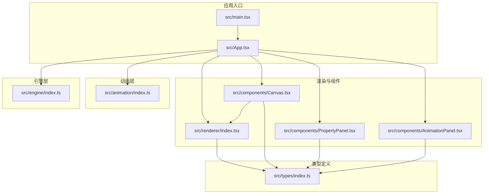
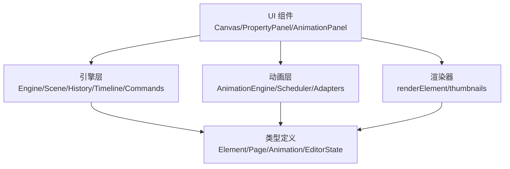
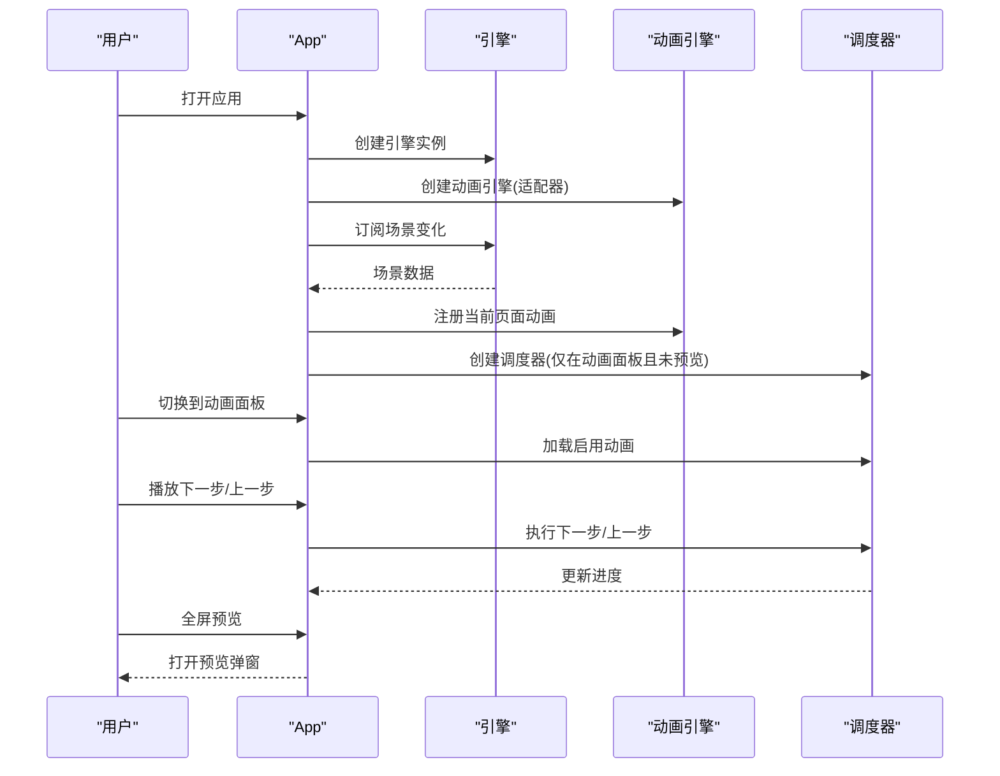
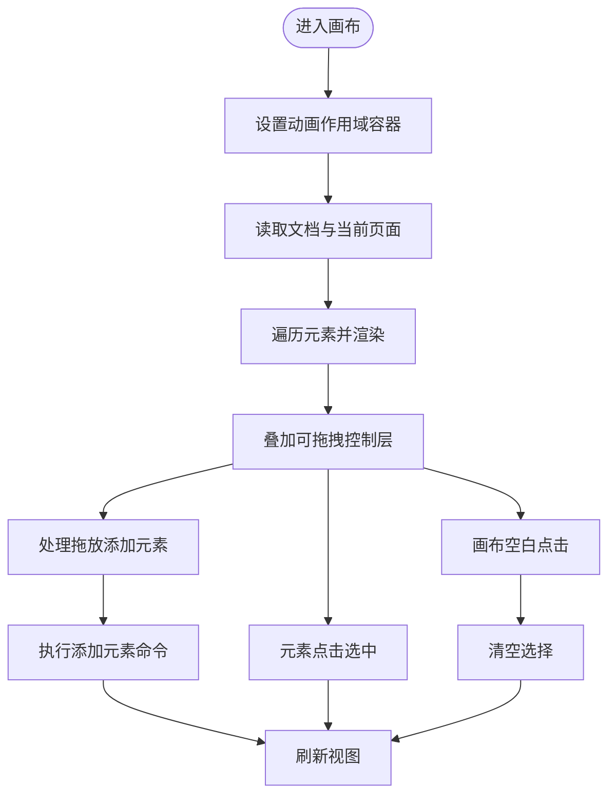
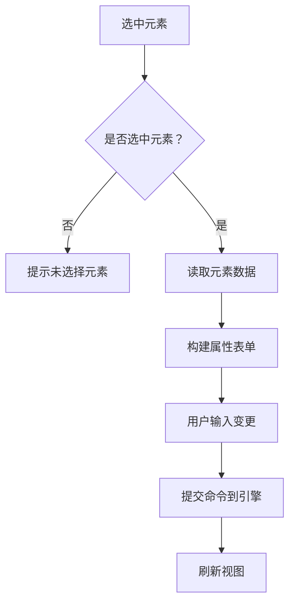
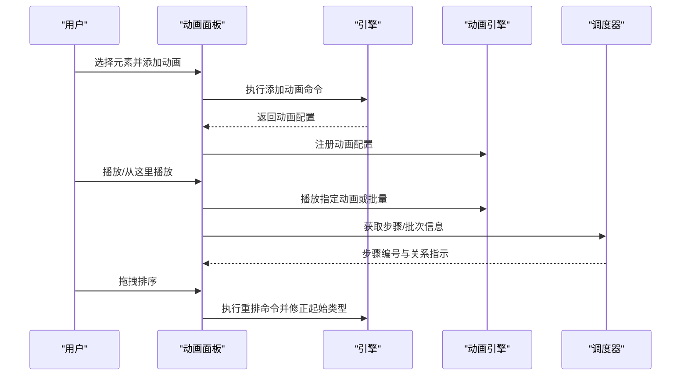
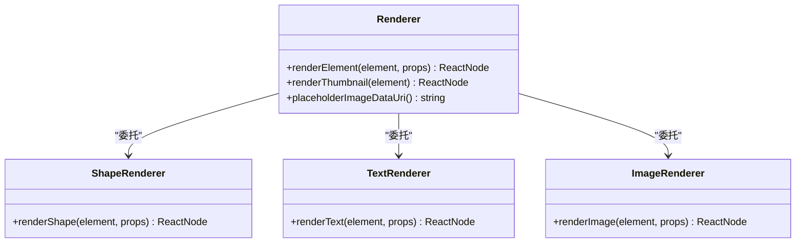
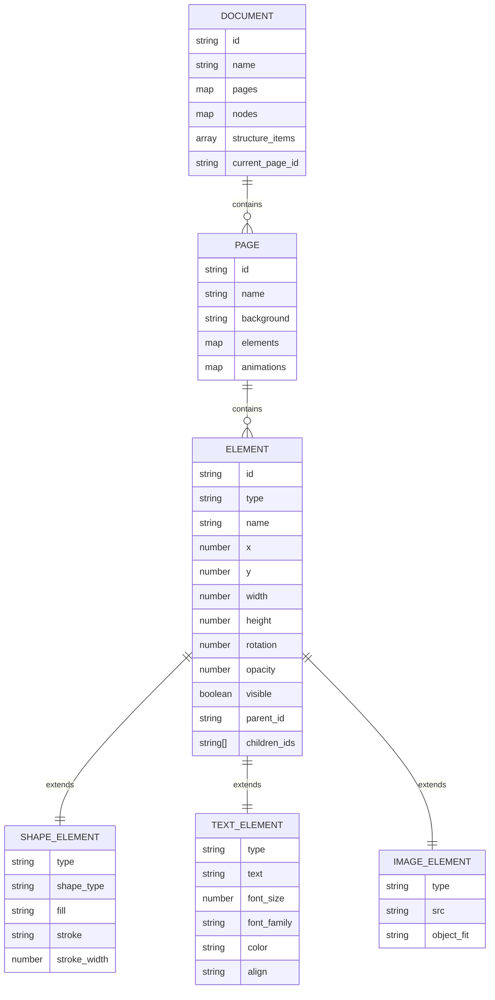
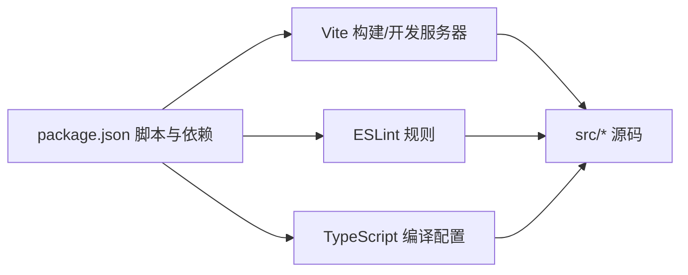

# 开发指南

<cite>
**本文引用的文件**
- [package.json](file://package.json)
- [vite.config.ts](file://vite.config.ts)
- [eslint.config.js](file://eslint.config.js)
- [tsconfig.json](file://tsconfig.json)
- [tsconfig.app.json](file://tsconfig.app.json)
- [tsconfig.node.json](file://tsconfig.node.json)
- [src/main.tsx](file://src/main.tsx)
- [src/App.tsx](file://src/App.tsx)
- [src/engine/index.ts](file://src/engine/index.ts)
- [src/animation/index.ts](file://src/animation/index.ts)
- [src/types/index.ts](file://src/types/index.ts)
- [src/components/Canvas.tsx](file://src/components/Canvas.tsx)
- [src/components/AnimationPanel.tsx](file://src/components/AnimationPanel.tsx)
- [src/components/PropertyPanel.tsx](file://src/components/PropertyPanel.tsx)
- [src/renderer/index.tsx](file://src/renderer/index.tsx)
</cite>

## 目录
1. [简介](#简介)
2. [项目结构](#项目结构)
3. [核心组件](#核心组件)
4. [架构总览](#架构总览)
5. [详细组件分析](#详细组件分析)
6. [依赖分析](#依赖分析)
7. [性能考虑](#性能考虑)
8. [调试与故障排查](#调试与故障排查)
9. [结论](#结论)
10. [附录](#附录)

## 简介
本指南面向参与 AI 课件编辑器项目的开发者，系统性地阐述代码规范、编码标准、最佳实践，以及与开发工具链（ESLint、TypeScript 编译、Vite 构建）相关的配置要点。文档同时覆盖调试技巧、性能优化方法、测试策略建议、开发环境设置、热重载机制、生产构建流程、常见问题与优化方向，以及贡献指南、代码审查标准与发布流程建议。

## 项目结构
该项目采用以功能域划分的目录组织方式：引擎层（engine）、动画层（animation）、渲染器（renderer）、UI 组件（components）、全局类型（types）、应用入口（main/App）等模块清晰分离，便于维护与扩展。

图表来源
- [src/main.tsx:1-10](file://src/main.tsx#L1-L10)
- [src/App.tsx:1-344](file://src/App.tsx#L1-L344)
- [src/engine/index.ts:1-16](file://src/engine/index.ts#L1-L16)
- [src/animation/index.ts:1-8](file://src/animation/index.ts#L1-L8)
- [src/renderer/index.tsx:1-314](file://src/renderer/index.tsx#L1-L314)
- [src/components/Canvas.tsx:1-191](file://src/components/Canvas.tsx#L1-L191)
- [src/components/PropertyPanel.tsx:1-332](file://src/components/PropertyPanel.tsx#L1-L332)
- [src/components/AnimationPanel.tsx:1-857](file://src/components/AnimationPanel.tsx#L1-L857)
- [src/types/index.ts:1-159](file://src/types/index.ts#L1-L159)

章节来源
- [src/main.tsx:1-10](file://src/main.tsx#L1-L10)
- [src/App.tsx:1-344](file://src/App.tsx#L1-L344)

## 核心组件
- 应用根组件负责状态管理、场景与动画引擎初始化、快捷键处理、预览弹窗控制、右侧面板切换与步进播放调度。
- 引擎层提供场景、历史、时间线、命令体系与吸附能力；所有状态变更必须通过命令执行。
- 动画层提供动画引擎、适配器（Web Animation、GSAP）、关键帧构建与调度器。
- 渲染器负责元素绘制、缩略图生成与选择框绘制。
- 组件层包括画布、属性面板、动画面板、结构面板、工具栏、引导线层、可拖拽操作层等。

章节来源
- [src/App.tsx:11-150](file://src/App.tsx#L11-L150)
- [src/engine/index.ts:1-16](file://src/engine/index.ts#L1-L16)
- [src/animation/index.ts:1-8](file://src/animation/index.ts#L1-L8)
- [src/renderer/index.tsx:1-314](file://src/renderer/index.tsx#L1-L314)
- [src/components/Canvas.tsx:1-191](file://src/components/Canvas.tsx#L1-L191)
- [src/components/PropertyPanel.tsx:1-332](file://src/components/PropertyPanel.tsx#L1-L332)
- [src/components/AnimationPanel.tsx:1-857](file://src/components/AnimationPanel.tsx#L1-L857)

## 架构总览
应用采用“引擎-渲染-组件”三层架构：
- 引擎层：无框架绑定，专注数据模型与命令执行，保证状态一致性与可回溯性。
- 动画层：解耦动画执行与渲染，支持多种适配器，统一由调度器驱动。
- 渲染层：基于 React 的轻量渲染器，按元素类型输出对应节点，并提供缩略图能力。
- UI 层：以功能面板与画布为核心，通过事件与命令与引擎交互。

图表来源
- [src/App.tsx:1-344](file://src/App.tsx#L1-L344)
- [src/engine/index.ts:1-16](file://src/engine/index.ts#L1-L16)
- [src/animation/index.ts:1-8](file://src/animation/index.ts#L1-L8)
- [src/renderer/index.tsx:1-314](file://src/renderer/index.tsx#L1-L314)
- [src/types/index.ts:1-159](file://src/types/index.ts#L1-L159)

## 详细组件分析

### 应用主组件（App）
职责与行为
- 初始化编辑引擎与动画引擎，维持版本号以触发重渲染。
- 同步页面动画到动画引擎，自动管理步骤调度器生命周期。
- 处理键盘快捷键（撤销/重做/删除），并在动画标签页时启用步进控制。
- 提供全屏预览弹窗与元素计数展示。

图表来源
- [src/App.tsx:11-150](file://src/App.tsx#L11-L150)
- [src/App.tsx:151-344](file://src/App.tsx#L151-L344)

章节来源
- [src/App.tsx:11-150](file://src/App.tsx#L11-L150)
- [src/App.tsx:151-344](file://src/App.tsx#L151-L344)

### 画布组件（Canvas）
职责与行为
- 设置动画作用域容器，确保编辑态动画目标正确。
- 处理拖放添加元素、点击选中、画布空白处取消选择。
- 遍历页面元素并调用渲染器输出节点，叠加可拖拽控制层。

图表来源
- [src/components/Canvas.tsx:22-128](file://src/components/Canvas.tsx#L22-L128)

章节来源
- [src/components/Canvas.tsx:1-191](file://src/components/Canvas.tsx#L1-L191)

### 属性面板（PropertyPanel）
职责与行为
- 基于选中元素动态渲染属性表单（位置、尺寸、旋转、透明度、形状/文本/图片特有属性）。
- 将用户输入转换为命令并提交到引擎，实现属性变更的可回溯修改。

图表来源
- [src/components/PropertyPanel.tsx:12-77](file://src/components/PropertyPanel.tsx#L12-L77)

章节来源
- [src/components/PropertyPanel.tsx:1-332](file://src/components/PropertyPanel.tsx#L1-L332)

### 动画面板（AnimationPanel）
职责与行为
- 基于元素动画列表提供增删改查与排序（使用拖拽排序库）。
- 支持参数化动画效果（滑入/飞入距离、缩放区间、旋转角度、高亮亮度等）。
- 与调度器协作，支持单动画播放、从某步开始播放、步进控制与进度显示。

图表来源
- [src/components/AnimationPanel.tsx:87-328](file://src/components/AnimationPanel.tsx#L87-L328)
- [src/components/AnimationPanel.tsx:330-356](file://src/components/AnimationPanel.tsx#L330-L356)

章节来源
- [src/components/AnimationPanel.tsx:1-857](file://src/components/AnimationPanel.tsx#L1-L857)

### 渲染器（renderer）
职责与行为
- 根据元素类型输出 SVG 或 DOM 节点，支持选择框绘制与占位图。
- 提供缩略图渲染能力，用于结构面板与预览场景。

图表来源
- [src/renderer/index.tsx:1-314](file://src/renderer/index.tsx#L1-L314)

章节来源
- [src/renderer/index.tsx:1-314](file://src/renderer/index.tsx#L1-L314)

### 类型系统（types）
职责与行为
- 定义元素类型（形状/文本/图片/分组）、文档/页面/节点结构、对齐与缓动函数、动画关键帧与配置、编辑器状态等。
- 提供统一的数据契约，确保引擎、渲染器与 UI 组件之间的类型安全。

图表来源
- [src/types/index.ts:10-159](file://src/types/index.ts#L10-L159)

章节来源
- [src/types/index.ts:1-159](file://src/types/index.ts#L1-L159)

## 依赖分析
- 运行时依赖：React 生态、可拖拽与移动库、GSAP 动画库。
- 开发依赖：Vite、React 插件、ESLint 及相关插件、TypeScript。

图表来源
- [package.json:6-32](file://package.json#L6-L32)

章节来源
- [package.json:1-34](file://package.json#L1-L34)

## 性能考虑
- 渲染与更新
  - 使用不可变数据与最小化状态更新，避免不必要的重渲染。例如通过版本号驱动重渲染，仅在必要时刷新。
  - 在画布与面板中使用局部状态与 useMemo/useCallback，减少子组件重渲染。
- 动画执行
  - 仅在动画标签页且非预览状态下创建/销毁调度器，降低运行时开销。
  - 对已禁用动画进行过滤注册，减少调度器负载。
- 资源加载
  - 图片加载失败时使用占位图，避免重复错误请求。
- 编译与打包
  - 使用严格模式与未使用变量/参数检查，减少冗余代码。
  - 使用 bundler 模式与模块检测，提升打包效率。

章节来源
- [src/App.tsx:24-85](file://src/App.tsx#L24-L85)
- [src/components/Canvas.tsx:127-160](file://src/components/Canvas.tsx#L127-L160)
- [src/renderer/index.tsx:150-171](file://src/renderer/index.tsx#L150-L171)
- [tsconfig.app.json:15-18](file://tsconfig.app.json#L15-L18)

## 调试与故障排查
- 快捷键与撤销/重做
  - 支持 Ctrl/Cmd+Z 撤销、Ctrl/Cmd+Shift+Z 或 Ctrl/Cmd+Y 重做；删除键删除选中元素。
- 动画步进
  - 在动画面板启用步进控制，支持上一步/下一步与重置；键盘事件在窗口级别监听，避免输入框干扰。
- 常见问题
  - 动画不生效：确认元素动画已启用并已注册到动画引擎；检查页面切换后是否重新同步。
  - 画布无法拖放：检查容器尺寸与事件冒泡；确认未处于预览模式。
  - 图片不显示：检查资源地址与跨域策略；使用占位图验证加载路径。

章节来源
- [src/App.tsx:107-150](file://src/App.tsx#L107-L150)
- [src/App.tsx:151-344](file://src/App.tsx#L151-L344)
- [src/components/Canvas.tsx:39-90](file://src/components/Canvas.tsx#L39-L90)
- [src/renderer/index.tsx:145-156](file://src/renderer/index.tsx#L145-L156)

## 结论
本项目以清晰的分层架构与严格的命令执行机制为基础，结合轻量渲染器与可扩展动画层，提供了良好的可维护性与扩展性。遵循本文档的代码规范、配置说明与最佳实践，可显著提升开发效率与质量。

## 附录

### 开发环境设置与脚本
- 启动开发服务器：使用 Vite，默认热重载。
- 构建生产包：先执行 TypeScript 构建，再执行 Vite 构建。
- 预览生产包：启动静态预览服务器。
- 代码检查：运行 ESLint。

章节来源
- [package.json:6-11](file://package.json#L6-L11)
- [vite.config.ts:1-7](file://vite.config.ts#L1-L7)

### ESLint 配置说明
- 规则要点
  - 对 any 类型给出警告，鼓励明确类型约束。
  - 强制使用一致的类型导入风格。
  - React Hooks 规则强制检查，避免违反 Hooks 使用原则。

章节来源
- [eslint.config.js:1-9](file://eslint.config.js#L1-L9)

### TypeScript 编译选项
- 应用编译配置（tsconfig.app.json）
  - 目标与模块：ES2020 与 ESNext，bundler 解析。
  - JSX：react-jsx。
  - 严格模式与未使用检查：开启严格、未使用局部变量与参数、switch 穿透检查。
- Node 工具链配置（tsconfig.node.json）
  - 目标与模块：ES2022 与 ESNext，bundler 解析。
  - 严格模式与未使用检查：开启严格、未使用局部变量与参数、switch 穿透检查。

章节来源
- [tsconfig.app.json:1-22](file://tsconfig.app.json#L1-L22)
- [tsconfig.node.json:1-20](file://tsconfig.node.json#L1-L20)
- [tsconfig.json:1-8](file://tsconfig.json#L1-L8)

### Vite 构建配置
- 插件：React 插件。
- 默认导出：定义配置对象，启用 React 热重载与快速刷新。

章节来源
- [vite.config.ts:1-7](file://vite.config.ts#L1-L7)

### 测试策略建议
- 单元测试
  - 针对命令执行与撤销/重做逻辑进行断言，确保状态一致性。
  - 针对动画调度器的步进与批次关系进行断言。
- 集成测试
  - 覆盖画布拖放、元素选择、属性修改、动画添加与播放的端到端流程。
- UI 测试
  - 使用快照或视觉回归测试工具，验证渲染结果与交互反馈。

### 贡献指南与代码审查标准
- 提交前
  - 运行 ESLint 与 TypeScript 类型检查，修复告警与错误。
  - 运行构建脚本，确保开发与生产构建均通过。
- 代码审查
  - 关注状态变更是否通过命令执行、是否保持不可变性。
  - 关注动画与渲染性能影响，避免在渲染热路径引入重型计算。
  - 关注类型安全与边界条件处理。
- 发布流程建议
  - 版本号管理：语义化版本。
  - 构建产物校验：确保 dist 目录内容完整。
  - 变更日志：记录重大改动与修复。