# 历史记录管理系统

<cite>
**本文档引用的文件**
- [history.ts](file://src/engine/history.ts)
- [engine.ts](file://src/engine/engine.ts)
- [commands.ts](file://src/engine/commands.ts)
- [scene.ts](file://src/engine/scene.ts)
- [index.ts](file://src/engine/index.ts)
- [types/index.ts](file://src/types/index.ts)
- [App.tsx](file://src/App.tsx)
- [main.tsx](file://src/main.tsx)
</cite>

## 目录
1. [简介](#简介)
2. [项目结构](#项目结构)
3. [核心组件](#核心组件)
4. [架构概览](#架构概览)
5. [详细组件分析](#详细组件分析)
6. [依赖关系分析](#依赖关系分析)
7. [性能考虑](#性能考虑)
8. [故障排除指南](#故障排除指南)
9. [结论](#结论)

## 简介

历史记录管理系统是滑动编辑器引擎的核心组件之一，负责管理用户操作的历史状态，支持撤销（Undo）和重做（Redo）功能。该系统基于命令模式设计，通过维护两个栈结构来实现高效的历史记录管理。

系统主要特点：
- 基于命令模式的可逆操作设计
- 双栈结构实现高效的撤销/重做机制
- 支持多种类型的编辑操作（元素、动画、页面等）
- 内存友好的历史记录管理策略
- 完整的边界条件处理

## 项目结构

历史记录管理系统位于 `src/engine/` 目录下，采用模块化设计，包含以下关键文件：

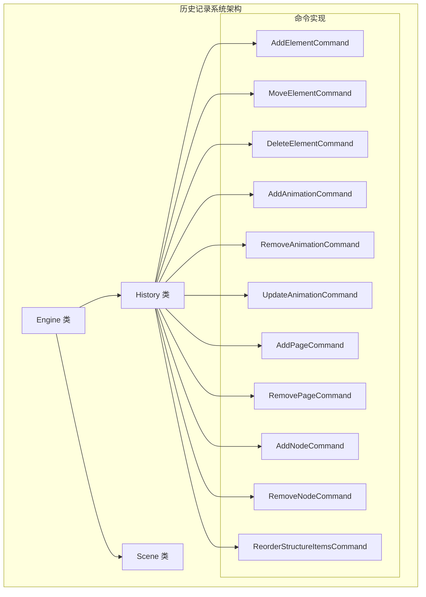

**图表来源**
- [history.ts:1-45](file://src/engine/history.ts#L1-L45)
- [engine.ts:1-54](file://src/engine/engine.ts#L1-L54)
- [commands.ts:1-280](file://src/engine/commands.ts#L1-L280)

**章节来源**
- [history.ts:1-45](file://src/engine/history.ts#L1-L45)
- [engine.ts:1-54](file://src/engine/engine.ts#L1-L54)
- [index.ts:1-16](file://src/engine/index.ts#L1-L16)

## 核心组件

### History 类设计

History 类是历史记录管理的核心，采用双栈结构设计：

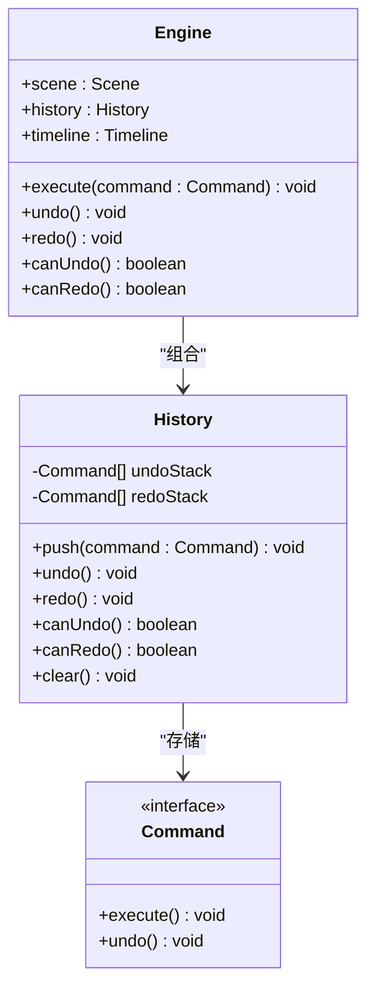

**图表来源**
- [history.ts:3-44](file://src/engine/history.ts#L3-L44)
- [engine.ts:7-49](file://src/engine/engine.ts#L7-L49)
- [types/index.ts:107-110](file://src/types/index.ts#L107-L110)

### 命令接口设计

所有历史记录操作都必须实现 Command 接口：

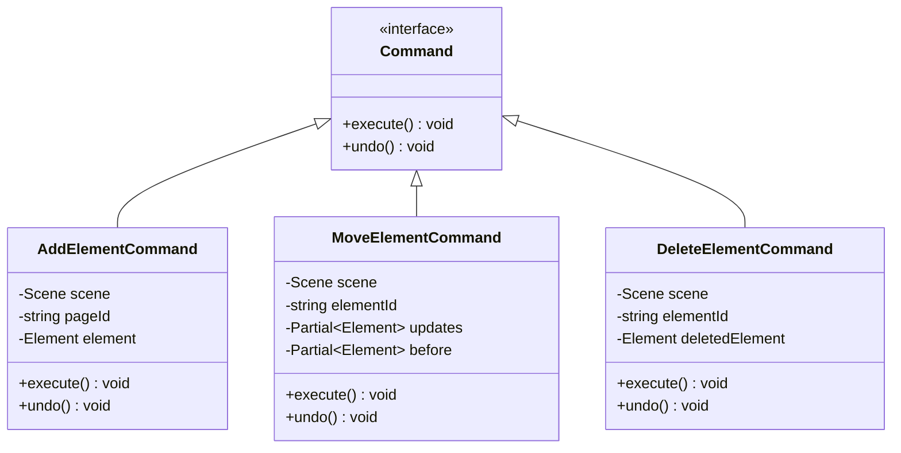

**图表来源**
- [types/index.ts:107-110](file://src/types/index.ts#L107-L110)
- [commands.ts:4-68](file://src/engine/commands.ts#L4-L68)

**章节来源**
- [history.ts:3-44](file://src/engine/history.ts#L3-L44)
- [types/index.ts:107-110](file://src/types/index.ts#L107-L110)
- [commands.ts:1-280](file://src/engine/commands.ts#L1-L280)

## 架构概览

历史记录系统采用分层架构设计，确保职责分离和高内聚低耦合：

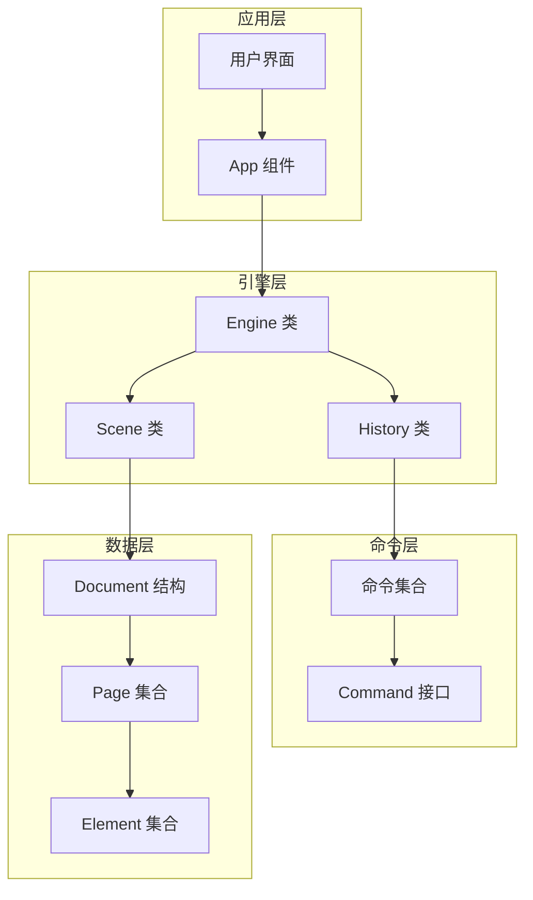

**图表来源**
- [engine.ts:7-19](file://src/engine/engine.ts#L7-L19)
- [history.ts:3-5](file://src/engine/history.ts#L3-L5)
- [scene.ts:3-8](file://src/engine/scene.ts#L3-L8)

### 数据流图

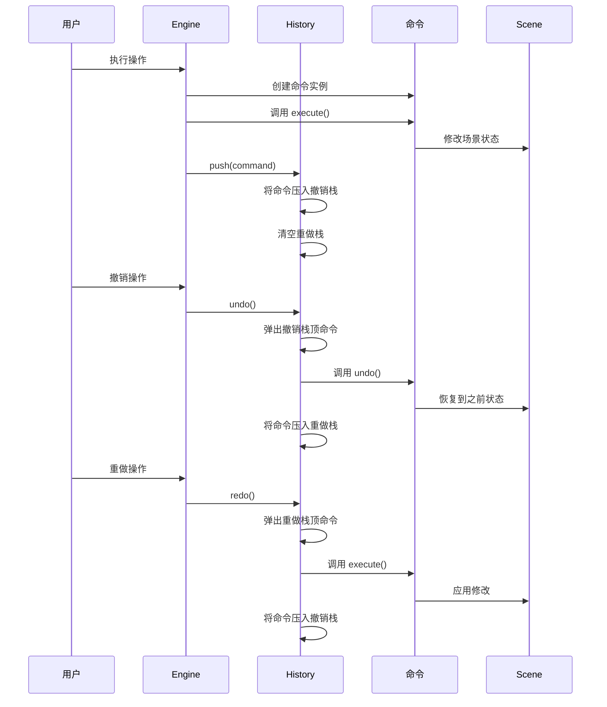

**图表来源**
- [engine.ts:29-32](file://src/engine/engine.ts#L29-L32)
- [history.ts:12-30](file://src/engine/history.ts#L12-L30)

**章节来源**
- [engine.ts:1-54](file://src/engine/engine.ts#L1-L54)
- [history.ts:1-45](file://src/engine/history.ts#L1-L45)

## 详细组件分析

### History 类实现详解

History 类实现了标准的撤销/重做算法，采用双栈设计：

#### 栈结构设计

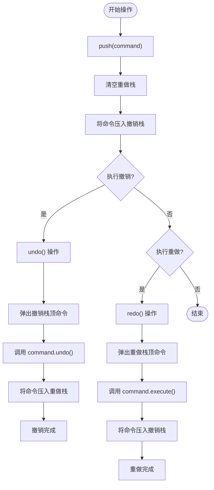

**图表来源**
- [history.ts:7-30](file://src/engine/history.ts#L7-L30)

#### 关键方法分析

**push 方法**：添加新命令到历史记录
- 时间复杂度：O(1)
- 空间复杂度：O(1)
- 功能：将新命令压入撤销栈，并清空重做栈

**undo 方法**：执行撤销操作
- 时间复杂度：O(1)
- 空间复杂度：O(1)
- 边界条件：检查撤销栈是否为空
- 功能：弹出栈顶命令，调用其 undo 方法，然后压入重做栈

**redo 方法**：执行重做操作
- 时间复杂度：O(1)
- 空间复杂度：O(1)
- 边界条件：检查重做栈是否为空
- 功能：弹出栈顶命令，调用其 execute 方法，然后压入撤销栈

**canUndo/canRedo 方法**：状态查询
- 时间复杂度：O(1)
- 功能：检查对应栈的长度来判断是否可以执行相应操作

**clear 方法**：清理历史记录
- 时间复杂度：O(1)
- 功能：清空两个栈，释放内存

**章节来源**
- [history.ts:7-44](file://src/engine/history.ts#L7-L44)

### 命令实现分析

系统提供了多种命令类型，每种命令都实现了 Command 接口：

#### 元素操作命令

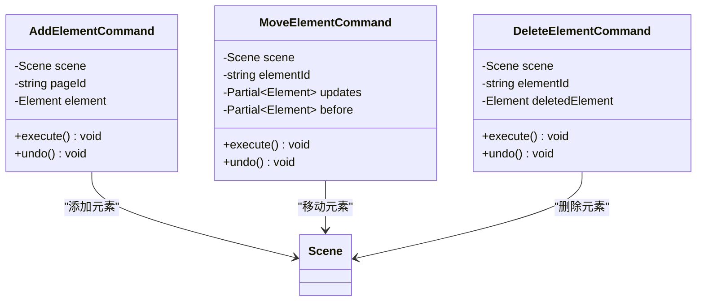

**图表来源**
- [commands.ts:4-68](file://src/engine/commands.ts#L4-L68)

#### 动画操作命令

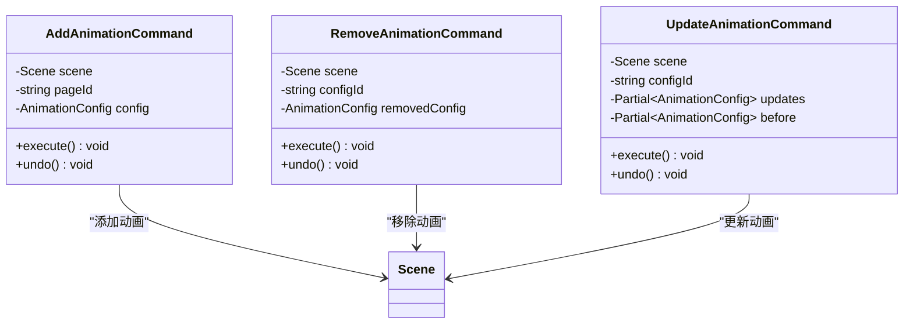

**图表来源**
- [commands.ts:74-139](file://src/engine/commands.ts#L74-L139)

#### 页面和节点操作命令

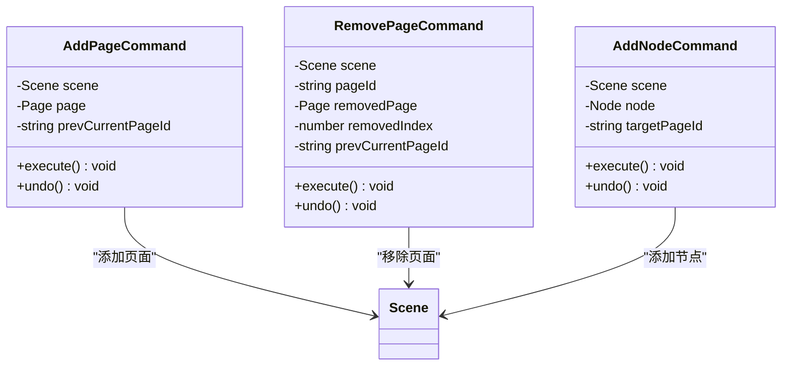

**图表来源**
- [commands.ts:166-232](file://src/engine/commands.ts#L166-L232)

**章节来源**
- [commands.ts:1-280](file://src/engine/commands.ts#L1-L280)

### Engine 类集成

Engine 类作为历史记录系统的协调者，负责管理各个组件之间的交互：

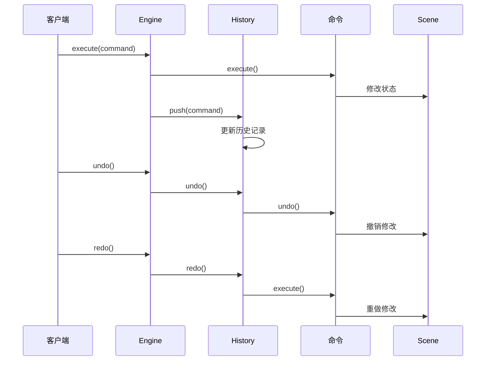

**图表来源**
- [engine.ts:29-48](file://src/engine/engine.ts#L29-L48)

**章节来源**
- [engine.ts:1-54](file://src/engine/engine.ts#L1-L54)

## 依赖关系分析

历史记录系统具有清晰的依赖层次结构：

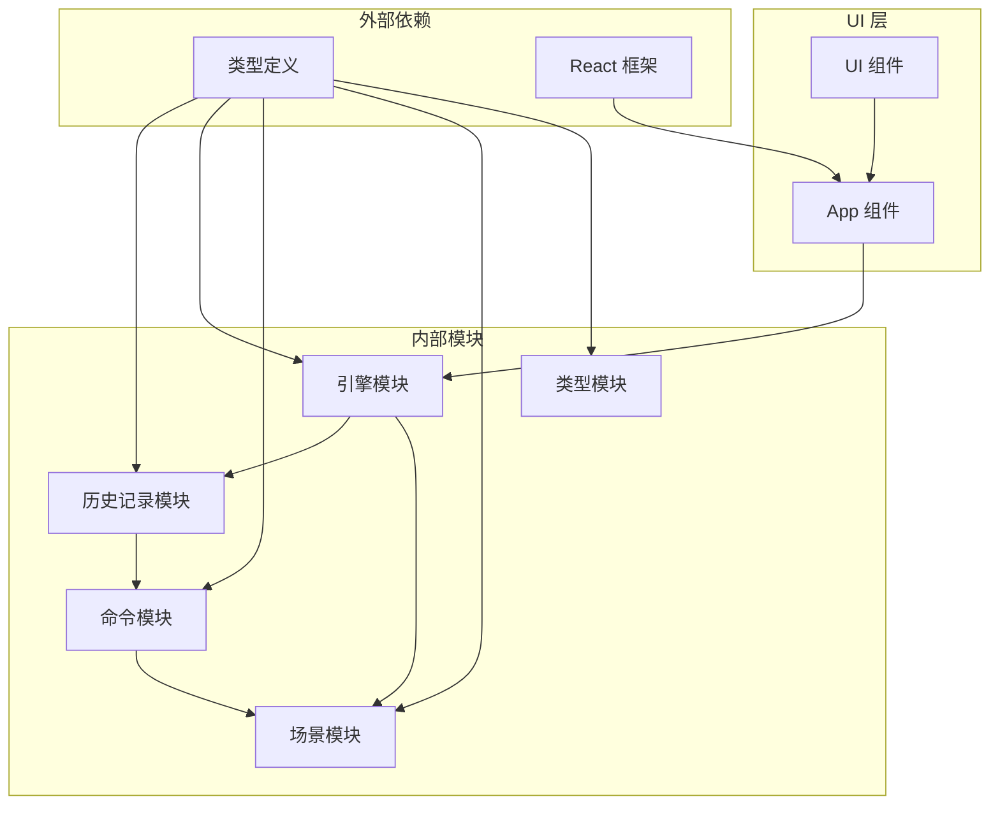

**图表来源**
- [history.ts:1](file://src/engine/history.ts#L1)
- [engine.ts:1](file://src/engine/engine.ts#L1)
- [commands.ts:1](file://src/engine/commands.ts#L1)
- [scene.ts:1](file://src/engine/scene.ts#L1)
- [types/index.ts:1](file://src/types/index.ts#L1)

### 模块间耦合分析

**低耦合设计**：
- History 类与具体命令实现解耦，只依赖 Command 接口
- Engine 类通过组合模式使用 History，便于测试和替换
- Scene 类与命令实现解耦，通过命令对象进行状态修改

**依赖注入**：
- History 类不直接依赖具体命令实现
- Engine 类通过构造函数注入 History 实例
- 命令类通过构造函数注入 Scene 实例

**章节来源**
- [history.ts:1-45](file://src/engine/history.ts#L1-L45)
- [engine.ts:1-54](file://src/engine/engine.ts#L1-L54)
- [commands.ts:1-280](file://src/engine/commands.ts#L1-L280)

## 性能考虑

### 时间复杂度分析

历史记录系统的所有核心操作都具有 O(1) 时间复杂度：

- **push 操作**：O(1) - 数组尾部插入
- **undo 操作**：O(1) - 数组尾部弹出和调用
- **redo 操作**：O(1) - 数组尾部弹出和调用
- **状态查询**：O(1) - 数组长度检查

### 空间复杂度分析

- **内存占用**：O(n) - n 为历史记录数量
- **空间增长**：线性增长，每个命令占用固定内存
- **垃圾回收**：自动垃圾回收，无手动内存管理需求

### 性能优化策略

**内存管理**：
- 使用数组实现栈，避免动态扩容开销
- 及时清理重做栈，减少内存占用
- 命令对象生命周期与历史记录绑定

**边界条件处理**：
- 空栈检查防止数组越界
- 命令执行失败时的状态回滚
- 并发操作的原子性保证

**章节来源**
- [history.ts:7-44](file://src/engine/history.ts#L7-L44)

## 故障排除指南

### 常见问题及解决方案

**问题1：撤销/重做按钮不可用**
- 检查 `canUndo()` 和 `canRedo()` 返回值
- 确认历史记录栈是否正确初始化
- 验证命令对象是否正确实现

**问题2：撤销后状态异常**
- 检查命令的 `undo()` 方法实现
- 确认场景状态的一致性
- 验证命令参数的正确性

**问题3：内存泄漏**
- 确认历史记录的生命周期管理
- 检查命令对象的引用关系
- 验证清理方法的调用

### 调试技巧

**日志记录**：
- 在关键操作前后添加日志
- 记录历史记录栈的状态变化
- 跟踪命令执行的完整流程

**单元测试**：
- 测试撤销/重做序列的正确性
- 验证边界条件的处理
- 检查异常情况的恢复能力

**章节来源**
- [history.ts:12-30](file://src/engine/history.ts#L12-L30)
- [engine.ts:34-48](file://src/engine/engine.ts#L34-L48)

## 结论

历史记录管理系统通过精心设计的架构和实现，成功地提供了高效、可靠的撤销/重做功能。系统的主要优势包括：

**设计优势**：
- 基于命令模式的可扩展架构
- 双栈结构的高效实现
- 清晰的职责分离和低耦合设计

**性能优势**：
- 所有操作均为 O(1) 时间复杂度
- 线性内存增长，易于预测
- 自动垃圾回收机制

**功能完整性**：
- 支持多种类型的编辑操作
- 完善的边界条件处理
- 良好的错误恢复机制

该系统为滑动编辑器提供了坚实的基础，支持用户进行各种复杂的编辑操作，同时保持了良好的性能和可靠性。通过模块化的架构设计，系统易于维护和扩展，为未来的功能增强奠定了良好基础。