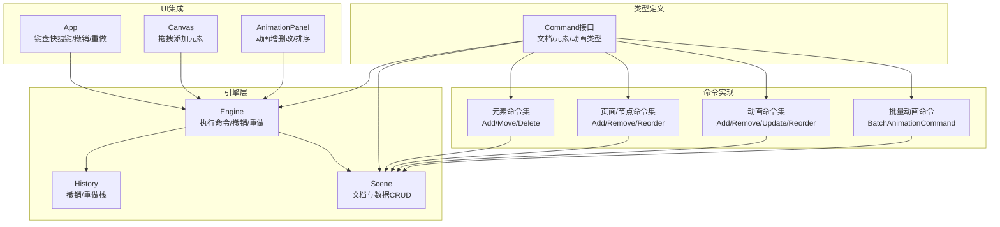
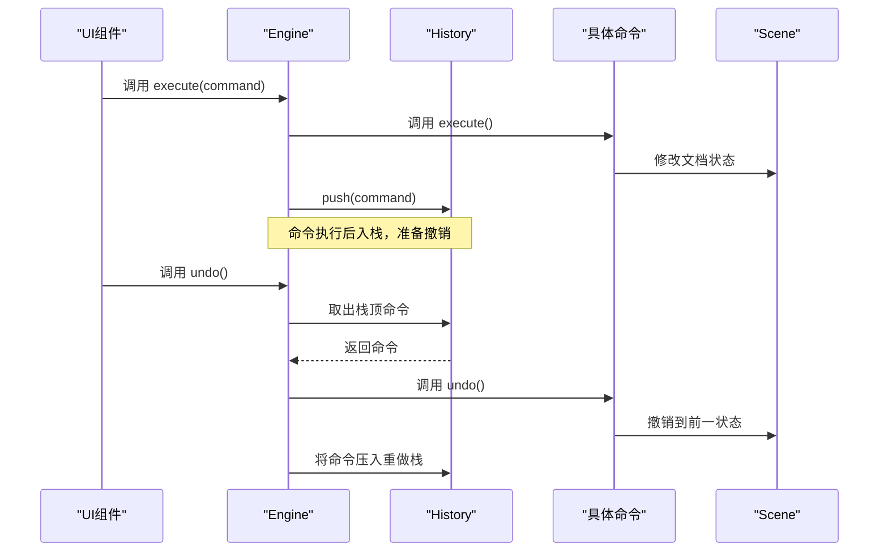
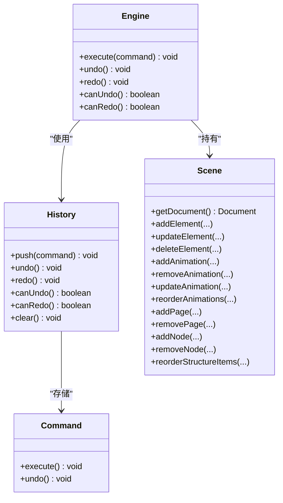
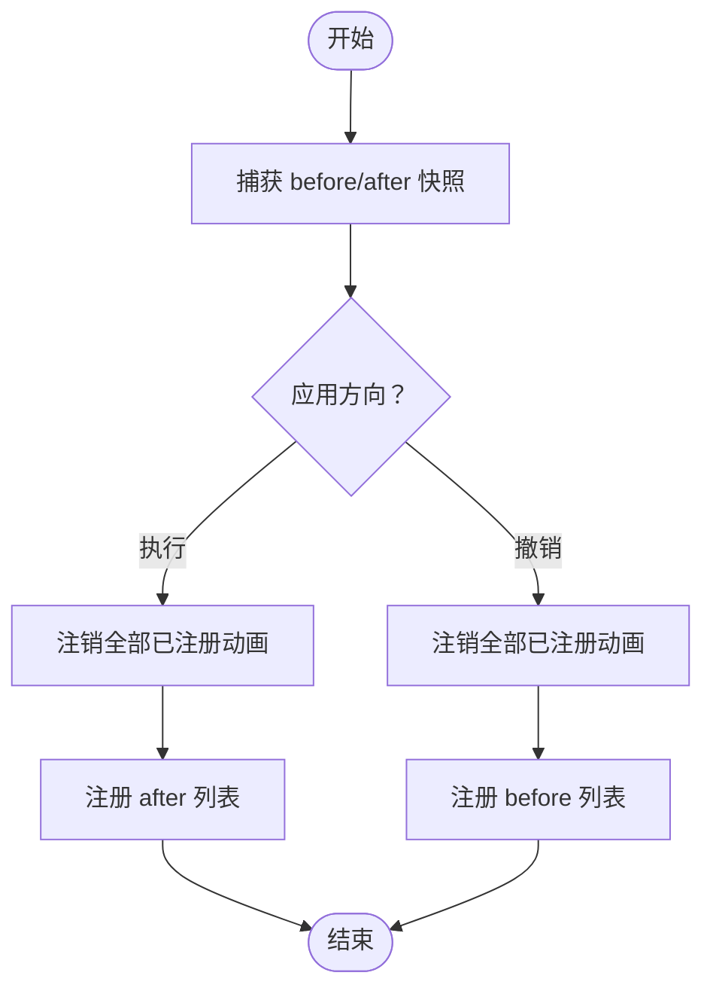
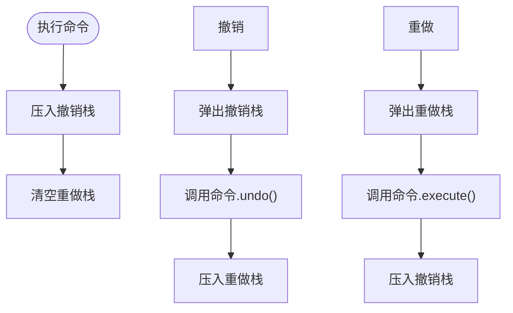
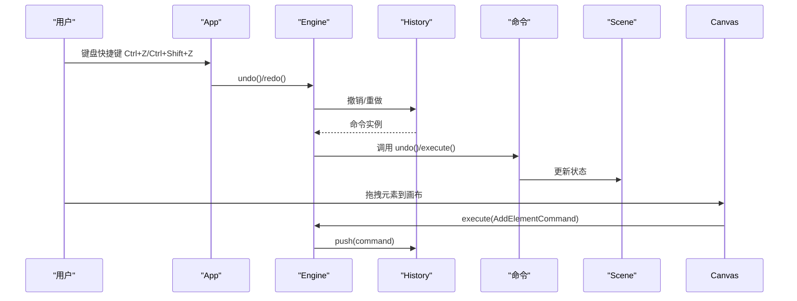
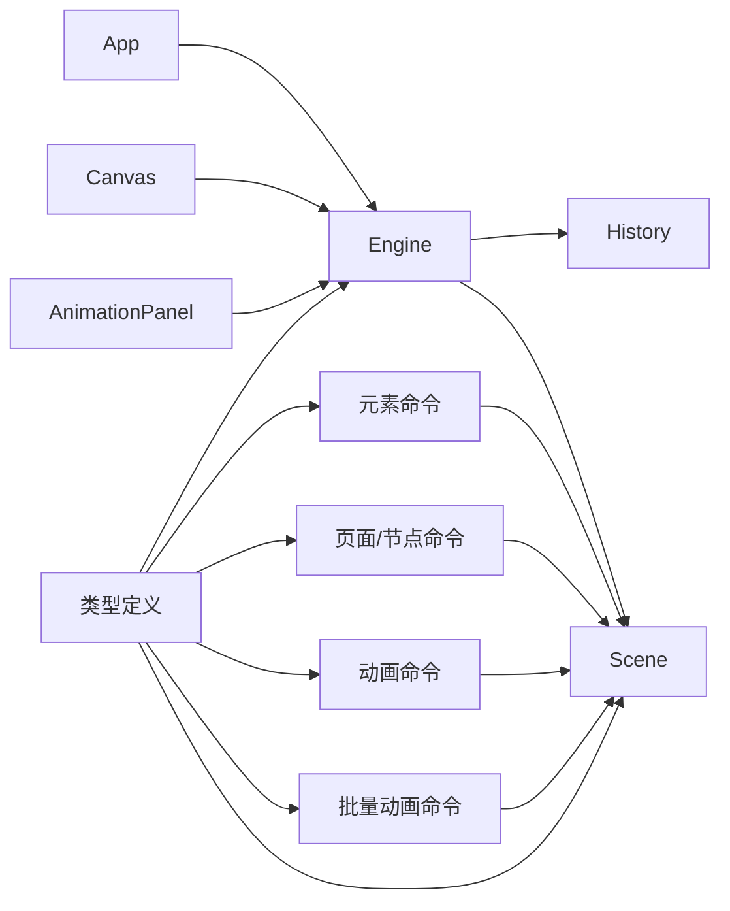

# 命令系统

<cite>
**本文引用的文件列表**
- [commands.ts](file://src/engine/commands.ts)
- [history.ts](file://src/engine/history.ts)
- [engine.ts](file://src/engine/engine.ts)
- [scene.ts](file://src/engine/scene.ts)
- [animationCommands.ts](file://src/engine/animationCommands.ts)
- [index.ts](file://src/types/index.ts)
- [animation.ts](file://src/types/animation.ts)
- [App.tsx](file://src/App.tsx)
- [Canvas.tsx](file://src/components/Canvas.tsx)
- [AnimationPanel.tsx](file://src/components/AnimationPanel.tsx)
- [README.md](file://README.md)
</cite>

## 目录
1. [简介](#简介)
2. [项目结构](#项目结构)
3. [核心组件](#核心组件)
4. [架构总览](#架构总览)
5. [详细组件分析](#详细组件分析)
6. [依赖关系分析](#依赖关系分析)
7. [性能考量](#性能考量)
8. [故障排查指南](#故障排查指南)
9. [结论](#结论)
10. [附录：扩展与最佳实践](#附录扩展与最佳实践)

## 简介
本文件系统性阐述该AI编辑器引擎中的命令系统，包括命令模式的设计原理、Command接口定义、具体命令实现、执行与撤销/重做机制、命令组合与批处理模式、与引擎系统的集成方式、命令链构建与错误处理策略，并提供扩展指南与性能优化建议。文档面向不同技术背景的读者，既提供高层概览也包含代码级细节与可视化图示。

## 项目结构
命令系统位于引擎层，围绕Engine、History、Scene以及一组具体命令类组织，配合类型定义与UI组件协同工作。关键模块如下：
- 引擎与历史：Engine负责对外暴露命令执行入口，History维护撤销/重做栈
- 场景抽象：Scene封装文档与元素/页面/节点/动画的CRUD操作
- 命令实现：涵盖元素、页面/节点、动画等多类命令
- 类型定义：统一的Command接口与文档/元素/动画类型
- UI集成：Canvas与AnimationPanel通过命令驱动编辑行为

图表来源
- [engine.ts:1-54](file://src/engine/engine.ts#L1-L54)
- [history.ts:1-45](file://src/engine/history.ts#L1-L45)
- [scene.ts:1-273](file://src/engine/scene.ts#L1-L273)
- [commands.ts:1-280](file://src/engine/commands.ts#L1-L280)
- [animationCommands.ts:1-44](file://src/engine/animationCommands.ts#L1-L44)
- [index.ts:104-110](file://src/types/index.ts#L104-L110)
- [App.tsx:107-150](file://src/App.tsx#L107-L150)
- [Canvas.tsx:44-78](file://src/components/Canvas.tsx#L44-L78)
- [AnimationPanel.tsx:203-328](file://src/components/AnimationPanel.tsx#L203-L328)

章节来源
- [engine.ts:1-54](file://src/engine/engine.ts#L1-L54)
- [history.ts:1-45](file://src/engine/history.ts#L1-L45)
- [scene.ts:1-273](file://src/engine/scene.ts#L1-L273)
- [commands.ts:1-280](file://src/engine/commands.ts#L1-L280)
- [animationCommands.ts:1-44](file://src/engine/animationCommands.ts#L1-L44)
- [index.ts:104-110](file://src/types/index.ts#L104-L110)
- [App.tsx:107-150](file://src/App.tsx#L107-L150)
- [Canvas.tsx:44-78](file://src/components/Canvas.tsx#L44-L78)
- [AnimationPanel.tsx:203-328](file://src/components/AnimationPanel.tsx#L203-L328)

## 核心组件
- Command接口：定义execute与undo两个方法，所有命令必须实现此接口
- History：维护撤销/重做栈，提供push、undo、redo、canUndo、canRedo、clear等能力
- Engine：对外提供execute、undo、redo、canUndo、canRedo；内部委托History
- Scene：封装文档对象与CRUD操作，是各命令的受控副作用目标
- 具体命令：元素、页面/节点、动画等命令均实现Command接口，内部持有Scene引用以进行数据变更
- 批量动画命令：BatchAnimationCommand捕获动画配置的前后快照，一次性应用或回滚，避免内部注册/注销导致的命令爆炸

章节来源
- [index.ts:104-110](file://src/types/index.ts#L104-L110)
- [history.ts:1-45](file://src/engine/history.ts#L1-L45)
- [engine.ts:1-54](file://src/engine/engine.ts#L1-L54)
- [scene.ts:1-273](file://src/engine/scene.ts#L1-L273)
- [commands.ts:1-280](file://src/engine/commands.ts#L1-L280)
- [animationCommands.ts:1-44](file://src/engine/animationCommands.ts#L1-L44)

## 架构总览
命令系统采用“命令对象 + 历史栈”的经典模式，Engine作为门面协调命令执行与历史管理，Scene作为唯一真实状态源，UI通过命令驱动状态变化，支持撤销/重做与键盘快捷键。

图表来源
- [engine.ts:29-40](file://src/engine/engine.ts#L29-L40)
- [history.ts:7-30](file://src/engine/history.ts#L7-L30)
- [commands.ts:11-17](file://src/engine/commands.ts#L11-L17)

章节来源
- [engine.ts:29-40](file://src/engine/engine.ts#L29-L40)
- [history.ts:7-30](file://src/engine/history.ts#L7-L30)

## 详细组件分析

### 命令接口与类型定义
- Command接口：统一的命令契约，要求实现execute与undo
- 文档/元素/动画类型：定义了Element、Page、Node、AnimationConfig等核心数据结构，用于命令参数与返回值

图表来源
- [index.ts:104-110](file://src/types/index.ts#L104-L110)
- [engine.ts:1-54](file://src/engine/engine.ts#L1-L54)
- [history.ts:1-45](file://src/engine/history.ts#L1-L45)
- [scene.ts:1-273](file://src/engine/scene.ts#L1-L273)

章节来源
- [index.ts:104-110](file://src/types/index.ts#L104-L110)
- [engine.ts:1-54](file://src/engine/engine.ts#L1-L54)
- [history.ts:1-45](file://src/engine/history.ts#L1-L45)
- [scene.ts:1-273](file://src/engine/scene.ts#L1-L273)

### 元素命令族
- AddElementCommand：在指定页面添加元素
- MoveElementCommand：记录变更前状态，更新元素属性
- DeleteElementCommand：删除元素并保存被删除元素以便撤销

这些命令均通过Scene进行状态变更，确保命令可撤销且幂等。

章节来源
- [commands.ts:4-68](file://src/engine/commands.ts#L4-L68)
- [scene.ts:94-159](file://src/engine/scene.ts#L94-L159)

### 页面/节点/结构命令族
- AddPageCommand/RemovePageCommand：页面增删与当前页切换
- AddNodeCommand/RemoveNodeCommand：节点增删与结构项联动
- ReorderStructureItemsCommand：结构项顺序调整

章节来源
- [commands.ts:166-279](file://src/engine/commands.ts#L166-L279)
- [scene.ts:18-88](file://src/engine/scene.ts#L18-L88)

### 动画命令族
- AddAnimationCommand/RemoveAnimationCommand：新增/移除动画配置
- UpdateAnimationCommand：记录变更前状态，更新动画配置
- ReorderAnimationsCommand：按ID顺序重排动画

章节来源
- [commands.ts:74-160](file://src/engine/commands.ts#L74-L160)
- [scene.ts:179-233](file://src/engine/scene.ts#L179-L233)
- [animation.ts:26-39](file://src/types/animation.ts#L26-L39)

### 批量动画命令
- BatchAnimationCommand：捕获动画配置的before/after快照，一次性注册/注销，避免频繁内部注册/注销导致的命令爆炸
- cloneConfigs：深拷贝动画配置数组，保证快照一致性

图表来源
- [animationCommands.ts:5-43](file://src/engine/animationCommands.ts#L5-L43)

章节来源
- [animationCommands.ts:1-44](file://src/engine/animationCommands.ts#L1-L44)

### 历史与撤销/重做机制
- History：维护两个栈，执行命令后清空重做栈，撤销时弹出命令并调用其undo，重做时弹出命令并调用其execute
- Engine：封装History，提供canUndo/canRedo查询与外部调用入口

图表来源
- [history.ts:7-30](file://src/engine/history.ts#L7-L30)
- [engine.ts:29-40](file://src/engine/engine.ts#L29-L40)

章节来源
- [history.ts:1-45](file://src/engine/history.ts#L1-L45)
- [engine.ts:1-54](file://src/engine/engine.ts#L1-L54)

### 命令与引擎系统的集成
- App：监听键盘事件，调用engine.undo()/engine.redo()，并在删除键时执行删除命令
- Canvas：拖拽元素到画布时，构造AddElementCommand并执行
- AnimationPanel：增删改动画、拖拽排序时，构造对应命令并执行，同时同步到AnimationEngine

图表来源
- [App.tsx:107-150](file://src/App.tsx#L107-L150)
- [Canvas.tsx:44-78](file://src/components/Canvas.tsx#L44-L78)
- [AnimationPanel.tsx:203-328](file://src/components/AnimationPanel.tsx#L203-L328)
- [engine.ts:29-40](file://src/engine/engine.ts#L29-L40)
- [history.ts:7-30](file://src/engine/history.ts#L7-L30)

章节来源
- [App.tsx:107-150](file://src/App.tsx#L107-L150)
- [Canvas.tsx:44-78](file://src/components/Canvas.tsx#L44-L78)
- [AnimationPanel.tsx:203-328](file://src/components/AnimationPanel.tsx#L203-L328)
- [engine.ts:29-40](file://src/engine/engine.ts#L29-L40)
- [history.ts:7-30](file://src/engine/history.ts#L7-L30)

### 命令链与组合模式
- 命令链：UI交互通常产生单一命令，避免内部多次注册/注销导致的命令爆炸
- 组合模式：BatchAnimationCommand将多个动画配置的变更合并为单个命令，提升性能与一致性
- 步骤/批次模型：README中说明的“Step/Batch”模型与命令链配合，将用户一次点击触发的动画集合作为一步，批次内并行播放

章节来源
- [animationCommands.ts:9-13](file://src/engine/animationCommands.ts#L9-L13)
- [README.md:6-14](file://README.md#L6-L14)

### 错误处理策略
- 命令内部：多数命令在Scene找不到目标时直接返回（不抛错），保持健壮性
- 历史栈：空栈时撤销/重做直接返回，避免异常
- UI层：按键与命令执行前检查canUndo/canRedo，防止无效操作

章节来源
- [history.ts:12-30](file://src/engine/history.ts#L12-L30)
- [commands.ts:11-17](file://src/engine/commands.ts#L11-L17)
- [App.tsx:171-208](file://src/App.tsx#L171-L208)

## 依赖关系分析
命令系统的关键依赖关系如下：
- Engine依赖History与Scene
- 各命令类依赖Scene以进行状态变更
- UI组件通过命令与Engine交互
- 类型定义为命令与Scene提供契约约束

图表来源
- [engine.ts:1-54](file://src/engine/engine.ts#L1-L54)
- [history.ts:1-45](file://src/engine/history.ts#L1-L45)
- [scene.ts:1-273](file://src/engine/scene.ts#L1-L273)
- [commands.ts:1-280](file://src/engine/commands.ts#L1-L280)
- [animationCommands.ts:1-44](file://src/engine/animationCommands.ts#L1-L44)
- [index.ts:104-110](file://src/types/index.ts#L104-L110)
- [App.tsx:107-150](file://src/App.tsx#L107-L150)
- [Canvas.tsx:44-78](file://src/components/Canvas.tsx#L44-L78)
- [AnimationPanel.tsx:203-328](file://src/components/AnimationPanel.tsx#L203-L328)

章节来源
- [engine.ts:1-54](file://src/engine/engine.ts#L1-L54)
- [history.ts:1-45](file://src/engine/history.ts#L1-L45)
- [scene.ts:1-273](file://src/engine/scene.ts#L1-L273)
- [commands.ts:1-280](file://src/engine/commands.ts#L1-L280)
- [animationCommands.ts:1-44](file://src/engine/animationCommands.ts#L1-L44)
- [index.ts:104-110](file://src/types/index.ts#L104-L110)
- [App.tsx:107-150](file://src/App.tsx#L107-L150)
- [Canvas.tsx:44-78](file://src/components/Canvas.tsx#L44-L78)
- [AnimationPanel.tsx:203-328](file://src/components/AnimationPanel.tsx#L203-L328)

## 性能考量
- 批量命令：BatchAnimationCommand通过一次性注册/注销减少动画引擎内部开销，避免频繁回调导致的命令爆炸
- 快照复制：cloneConfigs浅拷贝动画配置数组，降低内存占用与序列化成本
- 历史栈清理：执行新命令时清空重做栈，避免无意义的重做历史累积
- UI刷新控制：UI通过版本号或状态变更触发局部刷新，避免全量重渲染

章节来源
- [animationCommands.ts:5-7](file://src/engine/animationCommands.ts#L5-L7)
- [history.ts:7-10](file://src/engine/history.ts#L7-L10)
- [App.tsx:24-26](file://src/App.tsx#L24-L26)

## 故障排查指南
- 撤销/重做不可用：检查History.canUndo()/canRedo()状态，确认是否已执行过命令
- 删除元素无效：确认选中元素ID与当前页面一致，检查Scene.findElement逻辑
- 动画未生效：确认AnimationEngine已注册对应配置，且启用状态为true
- 批量动画异常：检查before/after快照是否正确捕获，避免重复注册或遗漏注销

章节来源
- [history.ts:32-38](file://src/engine/history.ts#L32-L38)
- [commands.ts:11-17](file://src/engine/commands.ts#L11-L17)
- [scene.ts:179-233](file://src/engine/scene.ts#L179-L233)
- [animationCommands.ts:35-42](file://src/engine/animationCommands.ts#L35-L42)

## 结论
该命令系统以清晰的接口契约、稳定的撤销/重做机制与良好的UI集成，支撑了元素、页面/节点、动画等多维度的编辑能力。通过批量命令与步骤/批次模型，系统在复杂交互下仍保持高性能与一致性。建议在扩展新命令时遵循现有模式，确保命令可撤销、状态变更集中在Scene，UI通过命令驱动状态变化。

## 附录：扩展与最佳实践

### 如何定义新命令
- 实现Command接口：提供execute与undo方法
- 在构造函数中捕获必要上下文（如Scene、目标ID、更新内容）
- 在execute中调用Scene的相应方法修改状态
- 在undo中恢复到之前的状态（可缓存变更前快照）

参考路径
- [commands.ts:4-68](file://src/engine/commands.ts#L4-L68)
- [scene.ts:94-159](file://src/engine/scene.ts#L94-L159)

### 如何执行命令序列
- 单条命令：engine.execute(new YourCommand(...))
- 多条命令：按顺序多次调用engine.execute，每条命令独立撤销
- 批量命令：使用BatchAnimationCommand将多个动画配置变更合并为单条命令

参考路径
- [engine.ts:29-32](file://src/engine/engine.ts#L29-L32)
- [animationCommands.ts:14-43](file://src/engine/animationCommands.ts#L14-L43)

### 如何管理命令状态
- 使用engine.canUndo()/canRedo()判断可用性
- 在UI按钮或快捷键中根据状态启用/禁用
- 清理历史：history.clear()用于重置状态（谨慎使用）

参考路径
- [engine.ts:42-48](file://src/engine/engine.ts#L42-L48)
- [history.ts:32-43](file://src/engine/history.ts#L32-L43)

### 命令与引擎系统的集成要点
- UI通过命令驱动Engine.execute，History自动管理撤销/重做
- Scene作为唯一真实状态源，命令只负责调用Scene方法
- 对于动画：命令变更配置后，需同步到AnimationEngine

参考路径
- [App.tsx:107-150](file://src/App.tsx#L107-L150)
- [AnimationPanel.tsx:203-328](file://src/components/AnimationPanel.tsx#L203-L328)

### 错误处理与边界条件
- 命令内部对不存在的目标直接返回，避免异常传播
- 历史栈为空时撤销/重做直接返回
- UI层在调用前检查状态，避免无效操作

参考路径
- [history.ts:12-30](file://src/engine/history.ts#L12-L30)
- [commands.ts:11-17](file://src/engine/commands.ts#L11-L17)

### 性能优化建议
- 优先使用批量命令合并多次变更
- 控制命令数量，避免频繁内部注册/注销
- 合理使用快照复制，避免深层拷贝带来的开销
- UI侧减少不必要的全量刷新，按需更新

参考路径
- [animationCommands.ts:5-7](file://src/engine/animationCommands.ts#L5-L7)
- [history.ts:7-10](file://src/engine/history.ts#L7-L10)