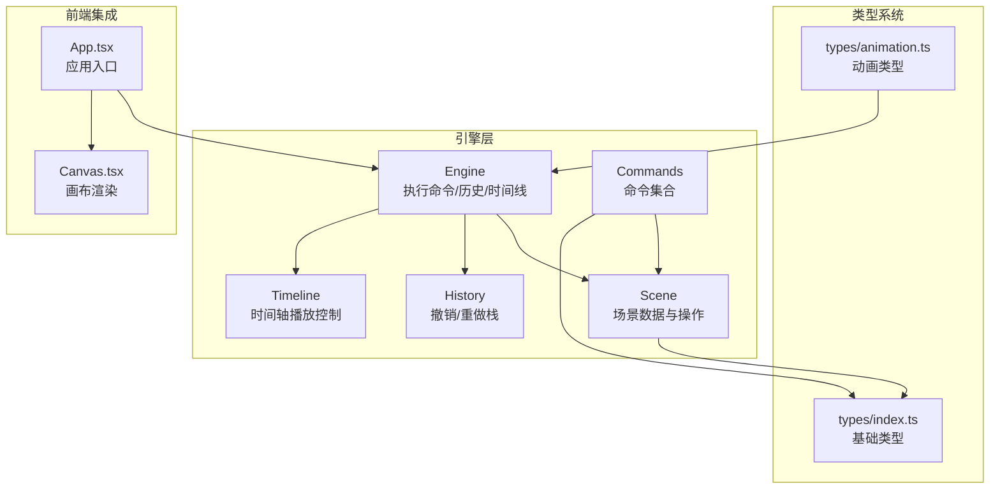
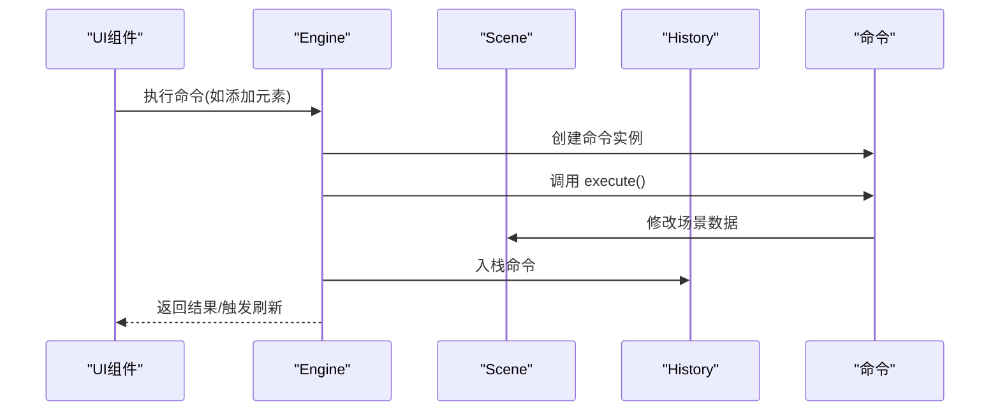
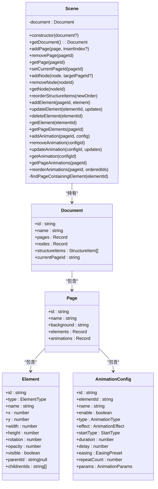
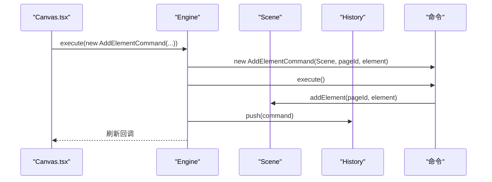
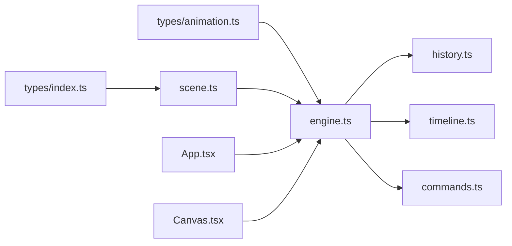

# 场景管理

<cite>
**本文引用的文件列表**
- [scene.ts](file://src/engine/scene.ts)
- [engine.ts](file://src/engine/engine.ts)
- [index.ts](file://src/engine/index.ts)
- [commands.ts](file://src/engine/commands.ts)
- [history.ts](file://src/engine/history.ts)
- [timeline.ts](file://src/engine/timeline.ts)
- [index.ts（类型定义）](file://src/types/index.ts)
- [animation.ts（类型定义）](file://src/types/animation.ts)
- [Canvas.tsx](file://src/components/Canvas.tsx)
- [App.tsx](file://src/App.tsx)
</cite>

## 目录
1. [简介](#简介)
2. [项目结构](#项目结构)
3. [核心组件](#核心组件)
4. [架构总览](#架构总览)
5. [详细组件分析](#详细组件分析)
6. [依赖关系分析](#依赖关系分析)
7. [性能考量](#性能考量)
8. [故障排查指南](#故障排查指南)
9. [结论](#结论)
10. [附录：最佳实践与常见问题](#附录最佳实践与常见问题)

## 简介
本技术文档围绕场景管理系统进行深入解析，重点阐述 Scene 类的设计理念、文档结构管理、元素状态维护与场景状态同步机制；同时详解 createScene 工厂函数的实现、场景初始化流程与状态更新策略，并通过具体代码示例路径说明如何创建场景、管理页面与元素状态。文档还涵盖场景数据模型、状态变更监听机制以及性能优化策略，并提供最佳实践与常见问题解决方案。

## 项目结构
场景管理位于引擎层，采用“框架无关”的设计思想，通过命令模式封装所有状态变更，确保可撤销/重做与状态一致性。前端组件通过引擎暴露的接口与场景交互，实现视图与数据的解耦。

图表来源
- [engine.ts:1-54](file://src/engine/engine.ts#L1-L54)
- [scene.ts:1-273](file://src/engine/scene.ts#L1-L273)
- [commands.ts:1-280](file://src/engine/commands.ts#L1-L280)
- [history.ts:1-45](file://src/engine/history.ts#L1-L45)
- [timeline.ts:1-66](file://src/engine/timeline.ts#L1-L66)
- [index.ts（类型定义）:1-159](file://src/types/index.ts#L1-L159)
- [animation.ts（类型定义）:1-113](file://src/types/animation.ts#L1-L113)
- [App.tsx:1-344](file://src/App.tsx#L1-L344)
- [Canvas.tsx:1-191](file://src/components/Canvas.tsx#L1-L191)

章节来源
- [engine.ts:1-54](file://src/engine/engine.ts#L1-L54)
- [scene.ts:1-273](file://src/engine/scene.ts#L1-L273)
- [index.ts:1-16](file://src/engine/index.ts#L1-L16)

## 核心组件
- Scene：场景数据容器与操作接口，负责文档、页面、节点、元素与动画的增删改查与结构排序。
- Engine：统一的执行器，封装命令执行、历史记录与编辑器状态管理。
- 命令集：以命令对象封装每个操作，支持撤销/重做。
- History：撤销/重做栈，维护命令序列。
- Timeline：时间轴播放控制（当前用于演示与占位）。
- 类型系统：定义元素、页面、文档、动画等核心数据结构与工具类型。

章节来源
- [scene.ts:1-273](file://src/engine/scene.ts#L1-L273)
- [engine.ts:1-54](file://src/engine/engine.ts#L1-L54)
- [commands.ts:1-280](file://src/engine/commands.ts#L1-L280)
- [history.ts:1-45](file://src/engine/history.ts#L1-L45)
- [timeline.ts:1-66](file://src/engine/timeline.ts#L1-L66)
- [index.ts（类型定义）:1-159](file://src/types/index.ts#L1-L159)
- [animation.ts（类型定义）:1-113](file://src/types/animation.ts#L1-L113)

## 架构总览
场景管理采用“命令驱动 + 数据模型 + 视图解耦”的架构：
- 数据模型：Document/Page/Node/Element/AnimationConfig 组成场景数据骨架。
- 操作入口：Engine.execute(command) 统一调度，History 记录命令。
- 视图层：React 组件通过 Engine.scene 读取数据，通过命令修改数据，触发刷新。
- 动画集成：App 将当前页动画同步到动画引擎，支持步骤化预览与播放。

图表来源
- [engine.ts:29-32](file://src/engine/engine.ts#L29-L32)
- [commands.ts:4-18](file://src/engine/commands.ts#L4-L18)
- [scene.ts:108-135](file://src/engine/scene.ts#L108-L135)

章节来源
- [engine.ts:1-54](file://src/engine/engine.ts#L1-L54)
- [commands.ts:1-280](file://src/engine/commands.ts#L1-L280)
- [scene.ts:1-273](file://src/engine/scene.ts#L1-L273)

## 详细组件分析

### Scene 类设计与数据模型
Scene 是场景管理的核心，内部持有 Document 并提供丰富的 CRUD 与结构管理方法。其数据模型由以下类型组成：
- Document：包含 id、name、pages、nodes、structureItems、currentPageId。
- Page：包含 id、name、background、elements、animations。
- Element：BaseElement 及其子类型（shape/text/image/group），支持层级关系（parentId/childrenIds）。
- AnimationConfig：动画配置，包含类型、效果、时序参数等。

设计要点
- 单一职责：集中管理文档结构与元素状态，避免跨模块分散逻辑。
- 结构一致性：通过 structureItems 维护页面/节点顺序，保证 UI 层级与数据一致。
- 父子关系维护：在更新元素 parentId 时自动维护父子链表，确保删除/移动正确性。
- 默认文档：createEmptyDocument 提供最小可用文档，便于初始化。

章节来源
- [scene.ts:3-247](file://src/engine/scene.ts#L3-L247)
- [index.ts（类型定义）:60-84](file://src/types/index.ts#L60-L84)
- [index.ts（类型定义）:12-54](file://src/types/index.ts#L12-L54)
- [animation.ts（类型定义）:26-39](file://src/types/animation.ts#L26-L39)

#### 类关系图

图表来源
- [scene.ts:3-247](file://src/engine/scene.ts#L3-L247)
- [index.ts（类型定义）:60-84](file://src/types/index.ts#L60-L84)
- [index.ts（类型定义）:12-54](file://src/types/index.ts#L12-L54)
- [animation.ts（类型定义）:26-39](file://src/types/animation.ts#L26-L39)

### createScene 工厂函数与场景初始化
- createScene：返回一个新的 Scene 实例，若未传入 Document，则使用 createEmptyDocument 初始化默认文档。
- 场景初始化：默认包含一个名为 “Page 1” 的页面，结构项中包含该页面条目，当前页面 ID 指向默认页面。

章节来源
- [scene.ts:249-272](file://src/engine/scene.ts#L249-L272)

### 页面与节点管理
- 页面管理：addPage/removePage/getPage/setCurrentPageId，维护 pages 字典与结构项数组，确保 currentPageId 有效。
- 节点管理：addNode/removeNode，节点插入到结构项中，可指定目标页面前插入。
- 结构排序：reorderStructureItems 支持拖拽排序，保持 UI 与数据一致。

章节来源
- [scene.ts:18-88](file://src/engine/scene.ts#L18-L88)

### 元素状态维护与层级关系
- 添加元素：addElement 自动将元素加入对应页面的 elements 映射，并维护父组 childrenIds。
- 更新元素：updateElement 支持部分字段更新，当 parentId 变更时自动维护父子链表。
- 删除元素：deleteElement 清理父子关系，递归处理子元素的 parentId 归零。
- 查询元素：getElement 在所有页面中查找元素，getPageElements 获取页面内全部元素。

章节来源
- [scene.ts:94-173](file://src/engine/scene.ts#L94-L173)

### 动画配置管理
- 添加/删除/更新/查询：addAnimation/removeAnimation/updateAnimation/getAnimation。
- 排序：reorderAnimations 按给定 ID 序列重建动画映射，保证播放顺序可控。
- 集合访问：getPageAnimations 获取页面动画列表。

章节来源
- [scene.ts:179-233](file://src/engine/scene.ts#L179-L233)
- [animation.ts（类型定义）:26-39](file://src/types/animation.ts#L26-L39)

### 命令与状态同步机制
- 命令封装：AddElementCommand、MoveElementCommand、DeleteElementCommand、AddAnimationCommand、RemoveAnimationCommand、UpdateAnimationCommand、ReorderAnimationsCommand、AddPageCommand、RemovePageCommand、AddNodeCommand、RemoveNodeCommand、ReorderStructureItemsCommand。
- 撤销/重做：命令对象自带 undo 方法，History 维护撤销/重做栈，Engine.execute 调用后入栈。
- 状态同步：App 中通过版本号驱动刷新，Canvas 读取当前页元素与选中状态，实现视图与数据的解耦。

图表来源
- [Canvas.tsx:64](file://src/components/Canvas.tsx#L64)
- [engine.ts:29-32](file://src/engine/engine.ts#L29-L32)
- [commands.ts:4-18](file://src/engine/commands.ts#L4-L18)
- [scene.ts:108-135](file://src/engine/scene.ts#L108-L135)

章节来源
- [commands.ts:1-280](file://src/engine/commands.ts#L1-L280)
- [history.ts:1-45](file://src/engine/history.ts#L1-L45)
- [engine.ts:29-48](file://src/engine/engine.ts#L29-L48)
- [Canvas.tsx:34-77](file://src/components/Canvas.tsx#L34-L77)

### 时间线与动画集成
- Timeline：提供播放/暂停/跳转能力，当前作为演示使用。
- App 同步：根据当前页动画列表注册到动画引擎，支持步骤化预览与进度跟踪。

章节来源
- [timeline.ts:1-66](file://src/engine/timeline.ts#L1-L66)
- [App.tsx:28-74](file://src/App.tsx#L28-L74)

## 依赖关系分析
- Scene 依赖 types 定义的数据结构。
- Engine 依赖 Scene、History、Timeline，并通过命令执行器统一调度。
- 前端组件通过 Engine 读取数据并派发命令，实现视图与数据解耦。
- 命令对象依赖 Scene 进行数据变更，History 保存命令以便撤销/重做。

图表来源
- [index.ts（类型定义）:1-159](file://src/types/index.ts#L1-L159)
- [animation.ts（类型定义）:1-113](file://src/types/animation.ts#L1-L113)
- [scene.ts:1-273](file://src/engine/scene.ts#L1-L273)
- [engine.ts:1-54](file://src/engine/engine.ts#L1-L54)
- [history.ts:1-45](file://src/engine/history.ts#L1-L45)
- [timeline.ts:1-66](file://src/engine/timeline.ts#L1-L66)
- [commands.ts:1-280](file://src/engine/commands.ts#L1-L280)
- [App.tsx:1-344](file://src/App.tsx#L1-L344)
- [Canvas.tsx:1-191](file://src/components/Canvas.tsx#L1-L191)

章节来源
- [index.ts:1-16](file://src/engine/index.ts#L1-L16)
- [engine.ts:1-54](file://src/engine/engine.ts#L1-L54)
- [scene.ts:1-273](file://src/engine/scene.ts#L1-L273)

## 性能考量
- 数据结构选择
  - pages/nodes/elements/animations 使用字典映射，查找与更新复杂度为 O(1)，适合频繁读写场景。
  - structureItems 为数组，维护顺序与层级，插入/删除为 O(n)（splice），但整体开销可控。
- 父子关系维护
  - 更新 parentId 时仅维护父组 childrenIds，避免全量扫描，复杂度 O(1)。
- 查询优化
  - getElement 通过遍历 pages 查找元素，最坏 O(p)（p 为页面数）。可通过二级索引（如按页面缓存元素映射）进一步优化。
- 刷新策略
  - App 使用版本号驱动刷新，避免不必要的重渲染；Canvas 仅读取当前页元素与选中状态，降低渲染压力。
- 动画同步
  - 仅注册启用的动画，减少动画引擎负担；步骤化预览按需加载，避免全量计算。

[本节为通用性能建议，不直接分析具体文件，故无章节来源]

## 故障排查指南
- 无法撤销/重做
  - 检查 History 栈是否为空，确认 Engine.execute 是否被调用。
  - 章节来源
    - [history.ts:12-30](file://src/engine/history.ts#L12-L30)
    - [engine.ts:29-48](file://src/engine/engine.ts#L29-L48)
- 元素删除后子元素异常
  - 确认 deleteElement 是否清理了 parentId 与父组 childrenIds。
  - 章节来源
    - [scene.ts:137-159](file://src/engine/scene.ts#L137-L159)
- 父子关系错乱
  - 更新 parentId 后检查父组 childrenIds 是否包含子元素。
  - 章节来源
    - [scene.ts:121-134](file://src/engine/scene.ts#L121-L134)
- 当前页面丢失
  - removePage 后若 currentPageId 与被删页面相同，会尝试设置第一个页面为当前页面。
  - 章节来源
    - [scene.ts:31-40](file://src/engine/scene.ts#L31-L40)
- 动画未生效
  - 确认动画已启用且已注册到动画引擎；检查当前页是否切换。
  - 章节来源
    - [App.tsx:28-74](file://src/App.tsx#L28-L74)
    - [scene.ts:179-233](file://src/engine/scene.ts#L179-L233)

## 结论
场景管理系统以 Scene 为核心，结合命令模式与历史栈，实现了稳定的状态变更与可撤销/重做能力。通过清晰的数据模型与严格的父子关系维护，系统在复杂场景下仍能保持一致性与可维护性。前端通过版本号驱动刷新，实现视图与数据的解耦。配合动画引擎的步骤化预览，为教学课件制作提供了高效、直观的创作体验。

[本节为总结性内容，不直接分析具体文件，故无章节来源]

## 附录：最佳实践与常见问题

### 最佳实践
- 使用命令封装所有状态变更，避免直接修改 Scene 内部状态。
- 在更新元素属性时，优先使用 updateElement 的部分更新，减少不必要的重绘。
- 管理父子关系时，先更新 parentId，再维护父组 childrenIds，确保一致性。
- 页面与节点的插入/删除应同步更新 structureItems，保证 UI 层级与数据一致。
- 动画管理遵循“启用才注册”的原则，减少动画引擎负担。

### 常见问题
- 问：为什么删除页面后当前页面为空？
  - 答：removePage 会在删除当前页面时尝试设置第一个页面为当前页面；若无页面则置空。可在业务层确保至少保留一个页面。
  - 章节来源
    - [scene.ts:31-40](file://src/engine/scene.ts#L31-L40)
- 问：如何批量移动元素而不触发多次重绘？
  - 答：将多次 updateElement 合并为一次命令或在 UI 层合并刷新事件，减少版本号变化次数。
  - 章节来源
    - [commands.ts:20-44](file://src/engine/commands.ts#L20-L44)
    - [App.tsx:24-26](file://src/App.tsx#L24-L26)
- 问：如何在多页面场景下避免元素查找冲突？
  - 答：使用 getPageElements 或在命令中显式传入 pageId，避免跨页面误操作。
  - 章节来源
    - [scene.ts:169-173](file://src/engine/scene.ts#L169-L173)

### 代码示例路径（不展示具体代码）
- 创建场景与初始化
  - [createScene 工厂函数:270-272](file://src/engine/scene.ts#L270-L272)
  - [默认文档创建:249-268](file://src/engine/scene.ts#L249-L268)
- 管理页面与节点
  - [添加页面:18-29](file://src/engine/scene.ts#L18-L29)
  - [移除页面:31-40](file://src/engine/scene.ts#L31-L40)
  - [添加节点:56-69](file://src/engine/scene.ts#L56-L69)
  - [移除节点:71-76](file://src/engine/scene.ts#L71-L76)
  - [结构排序:86-88](file://src/engine/scene.ts#L86-L88)
- 管理元素状态
  - [添加元素:94-106](file://src/engine/scene.ts#L94-L106)
  - [更新元素:108-135](file://src/engine/scene.ts#L108-L135)
  - [删除元素:137-159](file://src/engine/scene.ts#L137-L159)
  - [查询元素:161-173](file://src/engine/scene.ts#L161-L173)
- 管理动画
  - [添加动画:179-183](file://src/engine/scene.ts#L179-L183)
  - [删除动画:185-192](file://src/engine/scene.ts#L185-L192)
  - [更新动画:194-202](file://src/engine/scene.ts#L194-L202)
  - [查询动画:204-210](file://src/engine/scene.ts#L204-L210)
  - [重排动画:218-233](file://src/engine/scene.ts#L218-L233)
- 命令与撤销/重做
  - [添加元素命令:4-18](file://src/engine/commands.ts#L4-L18)
  - [移动元素命令:20-44](file://src/engine/commands.ts#L20-L44)
  - [删除元素命令:46-68](file://src/engine/commands.ts#L46-L68)
  - [历史栈:1-45](file://src/engine/history.ts#L1-L45)
- 视图集成
  - [从引擎读取文档与元素:34-37](file://src/components/Canvas.tsx#L34-L37)
  - [通过命令添加元素:64-66](file://src/components/Canvas.tsx#L64-L66)
  - [键盘快捷键与撤销/重做:108-150](file://src/App.tsx#L108-L150)