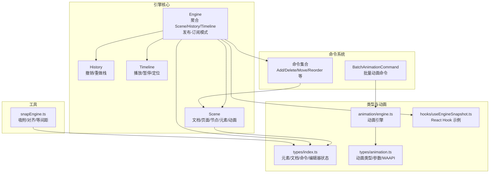
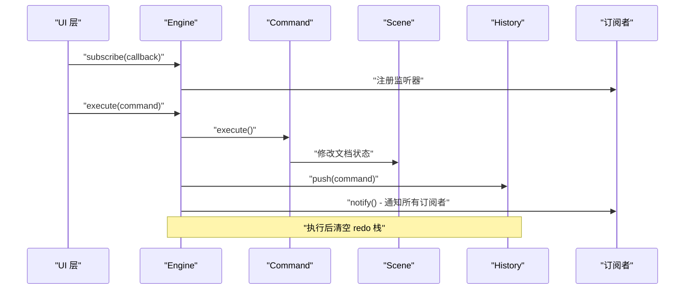
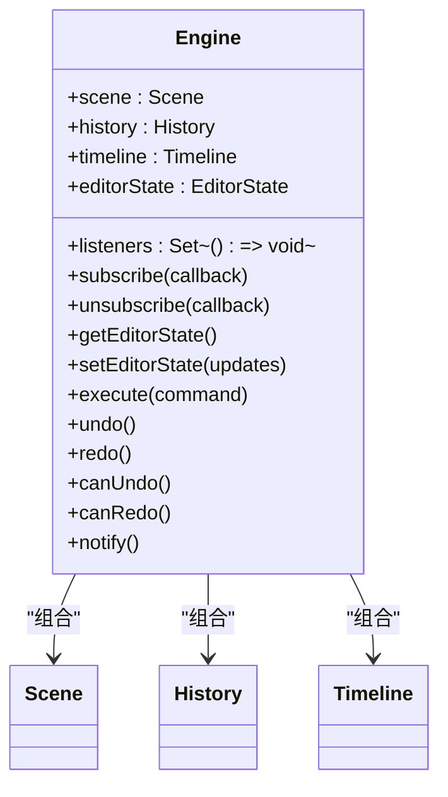
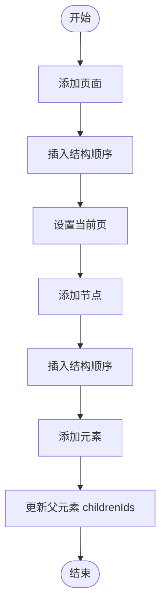
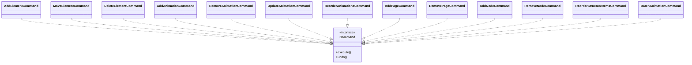
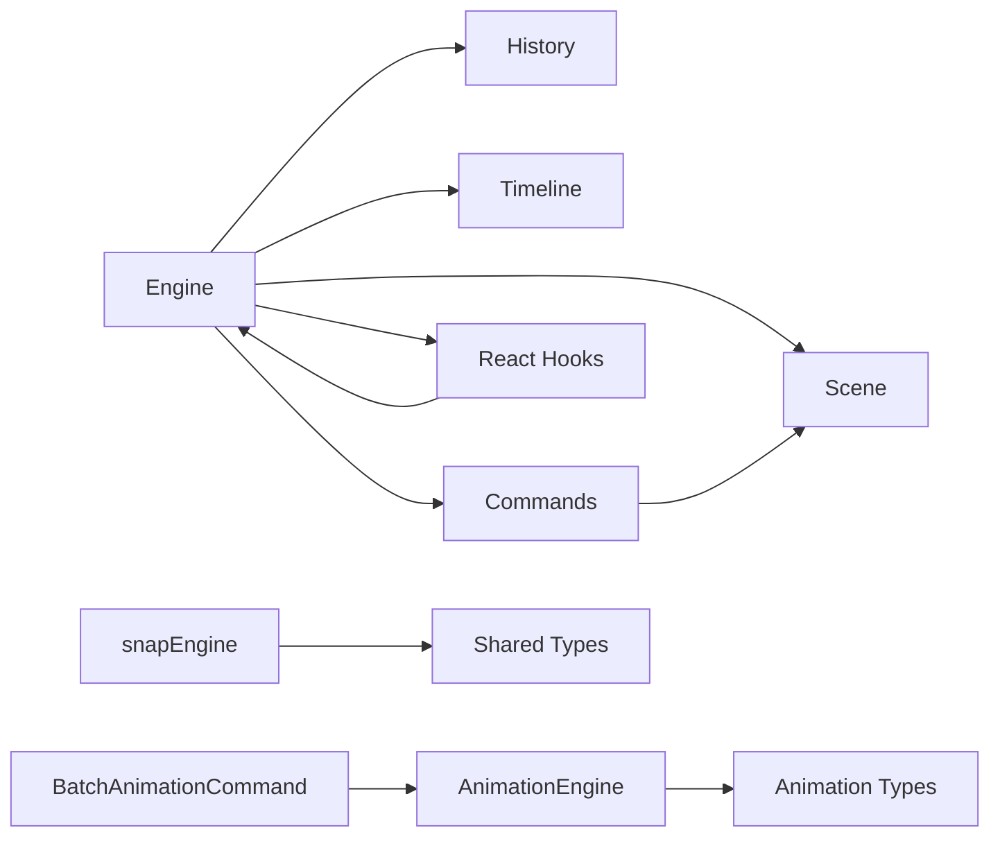

# 引擎系统

<cite>
**本文引用的文件列表**
- [engine.ts](file://src/engine/engine.ts)
- [scene.ts](file://src/engine/scene.ts)
- [history.ts](file://src/engine/history.ts)
- [timeline.ts](file://src/engine/timeline.ts)
- [commands.ts](file://src/engine/commands.ts)
- [animationCommands.ts](file://src/engine/animationCommands.ts)
- [snapEngine.ts](file://src/engine/snapEngine.ts)
- [index.ts](file://src/engine/index.ts)
- [index.ts](file://src/types/index.ts)
- [animation.ts](file://src/types/animation.ts)
- [engine.ts](file://src/animation/engine.ts)
- [useEngineSnapshot.ts](file://src/hooks/useEngineSnapshot.ts)
- [README.md](file://README.md)
- [package.json](file://package.json)
</cite>

## 目录
1. [简介](#简介)
2. [项目结构](#项目结构)
3. [核心组件](#核心组件)
4. [架构总览](#架构总览)
5. [详细组件分析](#详细组件分析)
6. [依赖关系分析](#依赖关系分析)
7. [性能考量](#性能考量)
8. [故障排查指南](#故障排查指南)
9. [结论](#结论)
10. [附录](#附录)

## 简介
本技术文档面向"引擎系统"的使用者与维护者，系统性阐述以下主题：
- Engine 核心类的职责、控制流与扩展点
- Scene 场景管理机制：页面、节点、元素、动画的增删改查与结构排序
- 命令系统与撤销/重做历史记录管理
- 时间轴功能的实现与播放控制
- **发布-订阅模式的状态管理与性能优化**
- 状态同步机制与与编辑器视图层的协作
- 与其他组件（动画引擎、吸附系统）的关系
- 常见问题与最佳实践

本系统采用"框架无关"的核心引擎模块，通过命令模式统一状态变更入口，保证可追踪、可回放、可并行扩展。**最新版本引入了发布-订阅模式，显著提升了状态变更通知的性能和可扩展性。**

## 项目结构
引擎系统位于 src/engine 目录，核心文件包括：
- engine.ts：引擎主入口，聚合 Scene、History、Timeline 并暴露统一 API，**新增发布-订阅机制**
- scene.ts：场景数据模型与操作，封装文档、页面、节点、元素、动画的 CRUD
- history.ts：撤销/重做栈，遵循 LIFO 行为
- timeline.ts：时间轴播放器，基于 requestAnimationFrame 的增量推进
- commands.ts：命令集合，覆盖元素、动画、页面、节点与结构项
- animationCommands.ts：批量动画命令，用于动画面板交互的批处理
- snapEngine.ts：吸附与对齐算法，支持边对齐、中心对齐、等间距分布
- types/index.ts：共享类型定义（元素、文档、命令、编辑器状态等）
- types/animation.ts：动画系统类型（效果、参数、WAAPI 兼容键帧等）
- animation/engine.ts：动画引擎，负责注册/注销配置、构建键帧、委托适配器播放
- hooks/useEngineSnapshot.ts：React Hook，演示发布-订阅模式的使用
- index.ts：导出引擎 API 与工具

**图表来源**
- [engine.ts:1-79](file://src/engine/engine.ts#L1-L79)
- [scene.ts:1-273](file://src/engine/scene.ts#L1-L273)
- [history.ts:1-45](file://src/engine/history.ts#L1-L45)
- [timeline.ts:1-66](file://src/engine/timeline.ts#L1-L66)
- [commands.ts:1-312](file://src/engine/commands.ts#L1-L312)
- [animationCommands.ts:1-44](file://src/engine/animationCommands.ts#L1-L44)
- [snapEngine.ts:1-259](file://src/engine/snapEngine.ts#L1-L259)
- [index.ts:1-16](file://src/engine/index.ts#L1-L16)
- [index.ts:1-159](file://src/types/index.ts#L1-L159)
- [animation.ts:1-113](file://src/types/animation.ts#L1-L113)
- [engine.ts:1-120](file://src/animation/engine.ts#L1-L120)
- [useEngineSnapshot.ts:1-13](file://src/hooks/useEngineSnapshot.ts#L1-L13)

## 核心组件
本节聚焦 Engine、Scene、History、Timeline 的职责与交互方式。

- Engine
  - 聚合场景、历史与时间轴，提供统一入口
  - **新增发布-订阅机制**：通过 subscribe/unsubscribe 管理状态变更监听器
  - 暴露执行命令、撤销/重做、查询编辑器状态等方法
  - 通过命令执行后入栈历史，驱动状态变更，并通知所有订阅者

- Scene
  - 维护 Document 结构（pages、nodes、structureItems、currentPageId）
  - 提供页面、节点、元素、动画的增删改查与排序
  - 支持父子关系维护（Group 子元素自动同步）

- History
  - 双栈结构：undoStack/redoStack
  - 执行命令后清空 redo 栈，保持一致性
  - 提供 canUndo/canRedo 查询

- Timeline
  - 基于 RAF 的增量推进，支持 play/pause/seek
  - 当前时间与持续时间分离，便于外部控制

**章节来源**
- [engine.ts:7-79](file://src/engine/engine.ts#L7-L79)
- [scene.ts:3-273](file://src/engine/scene.ts#L3-L273)
- [history.ts:3-45](file://src/engine/history.ts#L3-L45)
- [timeline.ts:1-66](file://src/engine/timeline.ts#L1-L66)

## 架构总览
下图展示引擎内部组件与外部依赖的关系，以及命令执行与历史记录的流向。**最新版本展示了发布-订阅模式如何优化状态通知流程。**

**图表来源**
- [engine.ts:23-35](file://src/engine/engine.ts#L23-L35)
- [engine.ts:51-55](file://src/engine/engine.ts#L51-L55)
- [history.ts:7-10](file://src/engine/history.ts#L7-L10)
- [commands.ts:11-17](file://src/engine/commands.ts#L11-L17)

## 详细组件分析

### Engine 核心类
- 职责
  - 组合 Scene、History、Timeline
  - 统一命令执行入口，确保所有状态变更经由命令
  - **发布-订阅模式**：管理状态变更监听器，提供高效的通知机制
  - 提供编辑器状态读取与更新能力
- 关键方法
  - subscribe(callback): 注册状态变更监听器
  - unsubscribe(callback): 移除状态变更监听器
  - execute(command): 执行命令并入历史，通知所有订阅者
  - undo()/redo(): 撤销/重做，通知所有订阅者
  - getEditorState()/setEditorState(): 读写编辑器状态，通知所有订阅者
- 设计要点
  - 仅通过命令修改 Scene，保证历史可追踪
  - **发布-订阅模式**：避免直接耦合，支持多个独立组件订阅状态变更
  - 编辑器状态与场景数据分离，遵循架构规则

**图表来源**
- [engine.ts:7-79](file://src/engine/engine.ts#L7-L79)

**章节来源**
- [engine.ts:7-79](file://src/engine/engine.ts#L7-L79)

### Scene 场景管理机制
- 文档结构
  - Document 包含 pages、nodes、structureItems、currentPageId
  - structureItems 作为全局顺序容器，支持页面与节点的拖拽排序
- 页面管理
  - addPage/removePage/getPage/setCurrentPageId
  - 新增页面时自动插入结构顺序；当前页删除时自动切换
- 节点管理
  - addNode/removeNode/getNode
  - 支持指定目标页面插入，否则追加到末尾
- 元素管理
  - addElement/updateElement/deleteElement/getElement/getPageElements
  - 自动维护父子关系：父 group 的 childrenIds 同步更新
- 动画管理
  - addAnimation/removeAnimation/updateAnimation/getAnimation/getPageAnimations/reorderAnimations
  - 通过 page.animations 记录，支持按 id 更新与重排
- 复杂度
  - 元素查找在所有页面中遍历，时间复杂度 O(P)，P 为页面数
  - 结构重排与动画重排为 O(N)

**图表来源**
- [scene.ts:18-88](file://src/engine/scene.ts#L18-L88)
- [scene.ts:94-159](file://src/engine/scene.ts#L94-L159)

**章节来源**
- [scene.ts:3-273](file://src/engine/scene.ts#L3-L273)

### 命令系统与撤销/重做
- 命令接口
  - Command 接口：execute()/undo()
- 典型命令
  - 元素：AddElementCommand、MoveElementCommand、DeleteElementCommand
  - 动画：AddAnimationCommand、RemoveAnimationCommand、UpdateAnimationCommand、ReorderAnimationsCommand
  - 页面/节点/结构：AddPageCommand、RemovePageCommand、AddNodeCommand、RemoveNodeCommand、ReorderStructureItemsCommand
- 批量动画命令
  - BatchAnimationCommand：捕获前后快照，一次性应用，避免内部注册/反注册导致的命令爆炸
- 历史记录
  - History.push(command) 将命令压入 undo 栈，清空 redo 栈
  - undo()/redo() 通过调用命令的 undo()/execute() 实现状态回退/恢复
  - canUndo()/canRedo() 提供可用性判断

**图表来源**
- [commands.ts:4-312](file://src/engine/commands.ts#L4-L312)
- [animationCommands.ts:14-43](file://src/engine/animationCommands.ts#L14-L43)

**章节来源**
- [commands.ts:1-312](file://src/engine/commands.ts#L1-L312)
- [animationCommands.ts:1-44](file://src/engine/animationCommands.ts#L1-L44)
- [history.ts:1-45](file://src/engine/history.ts#L1-L45)

### 时间轴功能与播放控制
- 关键属性
  - currentTime/duration/playState
  - 使用 requestAnimationFrame 驱动增量推进
- 方法
  - play(): 开始播放，记录起始时间戳，递归 tick
  - pause(): 停止播放并取消 RAF
  - seek(time): 定位到指定时间，限制在 [0, duration]
- 流程
  - tick 中计算 delta，累加到 currentTime
  - 到达 duration 后自动停止
  - 若仍在播放，则继续下一帧

**图表来源**
- [timeline.ts:25-64](file://src/engine/timeline.ts#L25-L64)

**章节来源**
- [timeline.ts:1-66](file://src/engine/timeline.ts#L1-L66)

### 发布-订阅模式与状态同步机制
- 发布-订阅模式
  - Engine 维护 listeners Set，存储所有订阅回调函数
  - subscribe(callback) 注册监听器，unsubscribe(callback) 移除监听器
  - notify() 方法遍历所有监听器并触发回调，实现广播式通知
- 编辑器状态 EditorState
  - 包含选中元素、视口位置与缩放、工具模式、悬停元素等
  - 通过 getEditorState()/setEditorState() 读写
- 与 Scene 的解耦
  - EditorState 与 Scene 数据分离，避免直接耦合
  - UI 层根据 EditorState 控制视图渲染与交互
- 与命令的配合
  - 所有状态变更必须通过命令执行，History 保证可回溯
  - **性能优化**：发布-订阅模式允许 UI 组件独立订阅所需状态，避免全量重新渲染

**章节来源**
- [engine.ts:12-35](file://src/engine/engine.ts#L12-L35)
- [engine.ts:41-44](file://src/engine/engine.ts#L41-L44)
- [engine.ts:51-55](file://src/engine/engine.ts#L51-L55)
- [index.ts:144-159](file://src/types/index.ts#L144-L159)
- [engine.ts:21-27](file://src/engine/engine.ts#L21-L27)

### 与其他组件的关系
- 与动画引擎
  - AnimationEngine 负责根据 AnimationConfig 构建键帧并委托适配器播放
  - BatchAnimationCommand 通过 AnimationEngine 的 register/unregister 应用批量变更
- 与吸附系统
  - snapEngine 提供吸附/对齐/等间距算法，返回 Guides 与偏移，辅助 UI 进行元素对齐
- 与类型系统
  - types/index.ts 定义元素、文档、命令、编辑器状态
  - types/animation.ts 定义动画类型、参数、WAAPI 键帧格式
- **与 React 集成**
  - useEngineSnapshot Hook 演示了如何在 React 组件中使用发布-订阅模式
  - 通过 subscribe 订阅引擎状态变化，实现响应式 UI 更新

**章节来源**
- [engine.ts:1-120](file://src/animation/engine.ts#L1-L120)
- [animationCommands.ts:14-43](file://src/engine/animationCommands.ts#L14-L43)
- [snapEngine.ts:1-259](file://src/engine/snapEngine.ts#L1-L259)
- [index.ts:1-159](file://src/types/index.ts#L1-L159)
- [animation.ts:1-113](file://src/types/animation.ts#L1-L113)
- [useEngineSnapshot.ts:1-13](file://src/hooks/useEngineSnapshot.ts#L1-L13)

## 依赖关系分析
- 内部依赖
  - Engine 依赖 Scene、History、Timeline
  - 命令依赖 Scene 进行状态变更
  - 批量动画命令依赖 AnimationEngine 的注册/反注册
  - **新增**：React Hook 依赖 Engine 的发布-订阅机制
- 外部依赖
  - React 生态与第三方库（如 GSAP）通过动画适配器接入
  - Vite/TypeScript 构建链路

**图表来源**
- [engine.ts:1-6](file://src/engine/engine.ts#L1-L6)
- [commands.ts:1-3](file://src/engine/commands.ts#L1-L3)
- [animationCommands.ts:1-4](file://src/engine/animationCommands.ts#L1-L4)
- [engine.ts:1-3](file://src/animation/engine.ts#L1-L3)
- [snapEngine.ts:1-2](file://src/engine/snapEngine.ts#L1-L2)
- [index.ts:1-2](file://src/types/index.ts#L1-L2)
- [animation.ts:1-2](file://src/types/animation.ts#L1-L2)
- [useEngineSnapshot.ts:1-2](file://src/hooks/useEngineSnapshot.ts#L1-L2)

**章节来源**
- [package.json:12-32](file://package.json#L12-L32)

## 性能考量
- 命令执行路径
  - 命令执行为 O(1) 或 O(单对象赋值/数组 splice)，受具体命令影响
- 元素查找
  - Scene.getElement 遍历所有页面，时间复杂度 O(P)；若频繁查找，建议引入索引或缓存
- 动画批量应用
  - BatchAnimationCommand 通过先 unregister 再 register，减少中间状态变更次数
- 时间轴播放
  - RAF 增量推进，delta 计算稳定；注意在高负载时可能丢帧，必要时降低刷新频率或合并更新
- **发布-订阅模式性能优化**
  - **Set 数据结构**：使用 Set 存储监听器，提供 O(1) 的添加和删除操作
  - **批量通知**：notify() 方法一次性遍历所有监听器，避免重复计算
  - **按需订阅**：UI 组件只订阅需要的状态，减少不必要的渲染
  - **内存管理**：及时调用 unsubscribe 移除不再使用的监听器，防止内存泄漏

**章节来源**
- [engine.ts:13](file://src/engine/engine.ts#L13)
- [engine.ts:31-35](file://src/engine/engine.ts#L31-L35)

## 故障排查指南
- 执行命令后无法撤销
  - 确认命令已通过 Engine.execute(command) 触发
  - 检查 History.push 是否被调用，redo 栈是否被意外清空
- 撤销/重做无效
  - 确认命令的 undo()/execute() 实现正确，且 Scene 的状态变更逻辑无副作用
- 元素父子关系异常
  - 检查 MoveElementCommand/UpdateElement 对 parentId 的处理与父元素 childrenIds 的同步
- 动画未生效
  - 确认 AnimationEngine 已注册配置，元素选择器匹配成功
  - 检查 AnimationConfig 参数（duration、delay、easing、repeatCount）是否合理
- 时间轴卡顿
  - 检查是否存在大量同步更新；考虑合并更新或降低 RAF 频率
- **发布-订阅模式问题**
  - **订阅失效**：确认在组件卸载时调用 unsubscribe 移除监听器
  - **内存泄漏**：检查是否有重复订阅同一回调函数的情况
  - **通知不触发**：确认在状态变更后调用了 notify() 方法
  - **性能问题**：检查监听器数量，避免过度订阅

**章节来源**
- [history.ts:7-30](file://src/engine/history.ts#L7-L30)
- [commands.ts:11-67](file://src/engine/commands.ts#L11-L67)
- [scene.ts:118-134](file://src/engine/scene.ts#L118-L134)
- [engine.ts:53-70](file://src/animation/engine.ts#L53-L70)
- [timeline.ts:46-64](file://src/engine/timeline.ts#L46-L64)
- [engine.ts:23-35](file://src/engine/engine.ts#L23-L35)

## 结论
该引擎系统以命令模式为核心，实现了可追踪、可撤销的状态变更；Scene 提供了完整的文档与元素生命周期管理；History 保障了回溯能力；Timeline 提供了基础的时间轴播放控制；**最新版本引入的发布-订阅模式显著提升了状态管理的性能和可扩展性**；与动画引擎、吸附系统协同，形成从数据到表现的一体化架构。通过框架无关的设计，系统具备良好的扩展性与可维护性。

## 附录

### API 一览（方法与用途）
- Engine
  - subscribe(callback): 注册状态变更监听器
  - unsubscribe(callback): 移除状态变更监听器
  - execute(command): 执行命令并入历史，通知所有订阅者
  - undo()/redo(): 撤销/重做，通知所有订阅者
  - canUndo()/canRedo(): 查询可用性
  - getEditorState()/setEditorState(): 读写编辑器状态，通知所有订阅者
- Scene
  - 页面：addPage/removePage/getPage/setCurrentPageId
  - 节点：addNode/removeNode/getNode
  - 元素：addElement/updateElement/deleteElement/getElement/getPageElements
  - 动画：addAnimation/removeAnimation/updateAnimation/getAnimation/getPageAnimations/reorderAnimations
  - 结构：reorderStructureItems
- History
  - push(command)/undo()/redo()/canUndo()/canRedo()/clear()
- Timeline
  - getCurrentTime()/getDuration()/isPlaying()/play()/pause()/seek()

**章节来源**
- [engine.ts:23-79](file://src/engine/engine.ts#L23-L79)
- [scene.ts:10-273](file://src/engine/scene.ts#L10-L273)
- [history.ts:7-44](file://src/engine/history.ts#L7-L44)
- [timeline.ts:9-64](file://src/engine/timeline.ts#L9-L64)

### 使用模式与最佳实践
- 所有状态变更必须通过命令执行，避免绕过 History
- 批量动画变更优先使用 BatchAnimationCommand，减少命令数量
- 元素移动/层级变更时，确保父元素 childrenIds 同步
- 动画配置应与元素选择器一致，避免播放失败
- 时间轴控制应与 UI 交互解耦，通过 seek 定位而非直接修改时间
- **发布-订阅模式最佳实践**
  - **按需订阅**：UI 组件只订阅需要的状态，避免全量订阅
  - **及时清理**：在组件卸载时调用 unsubscribe 移除监听器
  - **避免重复订阅**：确保同一回调函数不会被重复添加
  - **错误处理**：在回调函数中添加适当的错误处理逻辑
- **React 集成模式**
  - 使用 useEngineSnapshot Hook 简化订阅流程
  - 在 useEffect 中注册和清理监听器
  - 通过状态变量触发组件重新渲染

**章节来源**
- [animationCommands.ts:14-43](file://src/engine/animationCommands.ts#L14-L43)
- [scene.ts:118-134](file://src/engine/scene.ts#L118-L134)
- [engine.ts:53-70](file://src/animation/engine.ts#L53-L70)
- [useEngineSnapshot.ts:1-13](file://src/hooks/useEngineSnapshot.ts#L1-L13)