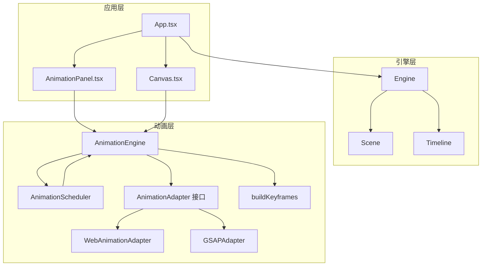
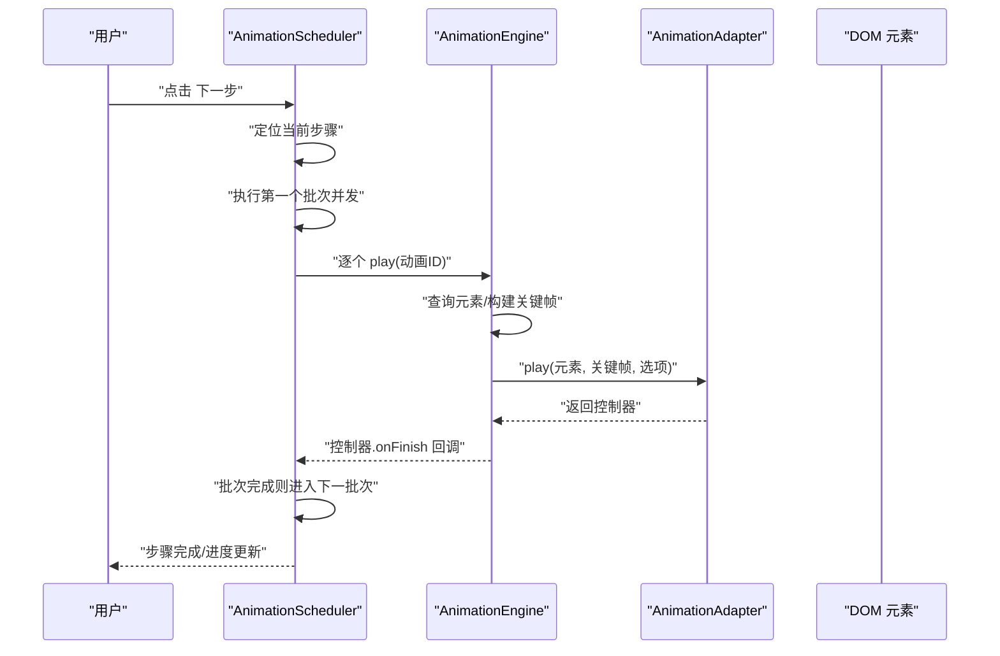
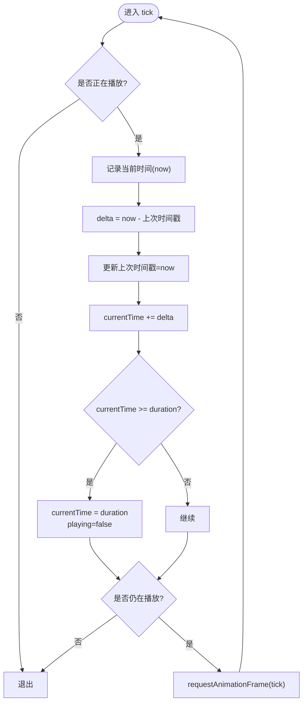
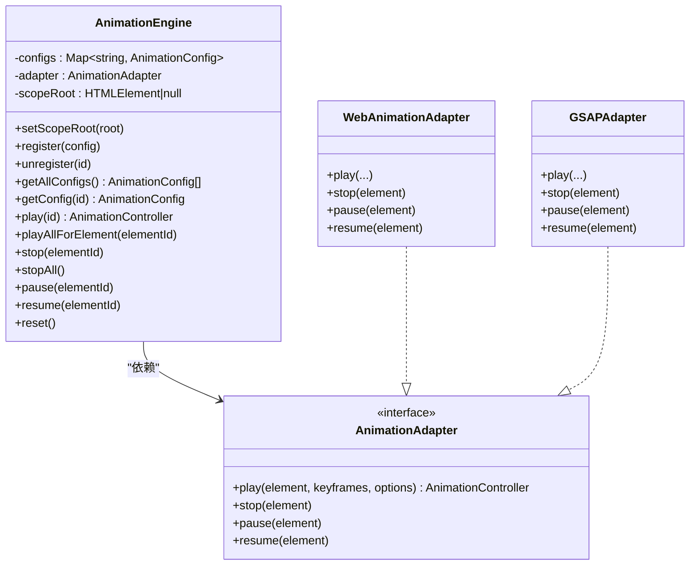
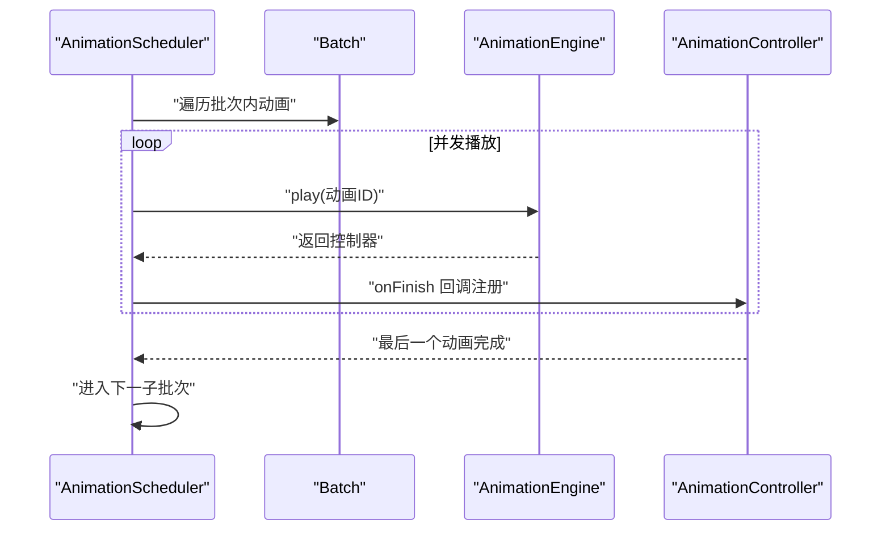
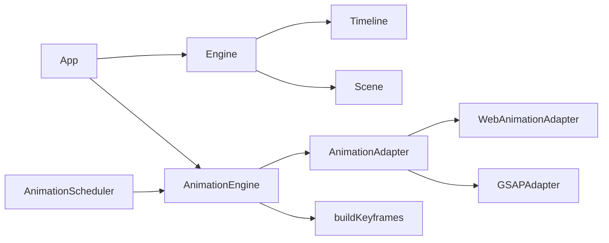

# 时间轴系统

<cite>
**本文引用的文件**
- [src/engine/timeline.ts](file://src/engine/timeline.ts)
- [src/animation/engine.ts](file://src/animation/engine.ts)
- [src/animation/scheduler.ts](file://src/animation/scheduler.ts)
- [src/animation/buildKeyframes.ts](file://src/animation/buildKeyframes.ts)
- [src/animation/adapter.ts](file://src/animation/adapter.ts)
- [src/animation/webAnimationAdapter.ts](file://src/animation/webAnimationAdapter.ts)
- [src/animation/gsapAdapter.ts](file://src/animation/gsapAdapter.ts)
- [src/types/animation.ts](file://src/types/animation.ts)
- [src/engine/engine.ts](file://src/engine/engine.ts)
- [src/engine/scene.ts](file://src/engine/scene.ts)
- [src/components/AnimationPanel.tsx](file://src/components/AnimationPanel.tsx)
- [src/components/Canvas.tsx](file://src/components/Canvas.tsx)
- [src/App.tsx](file://src/App.tsx)
</cite>

## 目录
1. [简介](#简介)
2. [项目结构](#项目结构)
3. [核心组件](#核心组件)
4. [架构总览](#架构总览)
5. [详细组件分析](#详细组件分析)
6. [依赖关系分析](#依赖关系分析)
7. [性能考量](#性能考量)
8. [故障排查指南](#故障排查指南)
9. [结论](#结论)
10. [附录：使用与扩展指南](#附录使用与扩展指南)

## 简介
本技术文档围绕“时间轴系统”展开，重点解释 Timeline 类的设计理念、时间轴数据结构与动画时间管理机制；阐述时间轴的创建、元素动画绑定与播放控制流程；给出时间轴与动画系统的集成方式、帧率控制与性能优化策略，并提供使用指南与扩展开发建议。读者可据此理解从“时间轴驱动的分步播放”到“具体元素动画执行”的完整链路。

## 项目结构
时间轴系统位于引擎层（engine）与动画层（animation）之间，通过调度器（AnimationScheduler）组织“步骤-批次-动画”的执行模型，配合动画引擎（AnimationEngine）与适配器（WebAnimationAdapter/GSAPAdapter）完成对 DOM 元素的具体动画播放。

图表来源
- [src/App.tsx:1-344](file://src/App.tsx#L1-L344)
- [src/engine/engine.ts:1-54](file://src/engine/engine.ts#L1-L54)
- [src/engine/timeline.ts:1-66](file://src/engine/timeline.ts#L1-L66)
- [src/engine/scene.ts:1-273](file://src/engine/scene.ts#L1-L273)
- [src/animation/engine.ts:1-120](file://src/animation/engine.ts#L1-L120)
- [src/animation/scheduler.ts:1-160](file://src/animation/scheduler.ts#L1-L160)
- [src/animation/adapter.ts:1-27](file://src/animation/adapter.ts#L1-L27)
- [src/animation/webAnimationAdapter.ts:1-67](file://src/animation/webAnimationAdapter.ts#L1-L67)
- [src/animation/gsapAdapter.ts:1-140](file://src/animation/gsapAdapter.ts#L1-L140)
- [src/animation/buildKeyframes.ts:1-125](file://src/animation/buildKeyframes.ts#L1-L125)

章节来源
- [src/App.tsx:1-344](file://src/App.tsx#L1-L344)
- [src/engine/engine.ts:1-54](file://src/engine/engine.ts#L1-L54)
- [src/engine/timeline.ts:1-66](file://src/engine/timeline.ts#L1-L66)
- [src/engine/scene.ts:1-273](file://src/engine/scene.ts#L1-L273)
- [src/animation/engine.ts:1-120](file://src/animation/engine.ts#L1-L120)
- [src/animation/scheduler.ts:1-160](file://src/animation/scheduler.ts#L1-L160)
- [src/animation/adapter.ts:1-27](file://src/animation/adapter.ts#L1-L27)
- [src/animation/webAnimationAdapter.ts:1-67](file://src/animation/webAnimationAdapter.ts#L1-L67)
- [src/animation/gsapAdapter.ts:1-140](file://src/animation/gsapAdapter.ts#L1-L140)
- [src/animation/buildKeyframes.ts:1-125](file://src/animation/buildKeyframes.ts#L1-L125)

## 核心组件
- Timeline：负责时间轴的当前时间推进、播放/暂停、跳转等基础能力，采用 requestAnimationFrame 驱动的时间循环。
- AnimationEngine：持有动画配置集合，构建关键帧，委托适配器执行播放/停止/暂停/恢复。
- AnimationScheduler：实现“步骤-批次-并发/串行”的分步播放模型，按用户点击逐步执行。
- AnimationAdapter 及其实现：抽象底层动画库差异，统一对外接口；提供 WebAnimationAdapter 与 GSAPAdapter。
- buildKeyframes：根据动画效果类型与参数生成 WAAPI 兼容的关键帧数组。
- Scene/Engine：提供页面级动画配置的读取与注册，供动画层消费。

章节来源
- [src/engine/timeline.ts:1-66](file://src/engine/timeline.ts#L1-L66)
- [src/animation/engine.ts:1-120](file://src/animation/engine.ts#L1-L120)
- [src/animation/scheduler.ts:1-160](file://src/animation/scheduler.ts#L1-L160)
- [src/animation/buildKeyframes.ts:1-125](file://src/animation/buildKeyframes.ts#L1-L125)
- [src/animation/adapter.ts:1-27](file://src/animation/adapter.ts#L1-L27)
- [src/animation/webAnimationAdapter.ts:1-67](file://src/animation/webAnimationAdapter.ts#L1-L67)
- [src/animation/gsapAdapter.ts:1-140](file://src/animation/gsapAdapter.ts#L1-L140)
- [src/engine/engine.ts:1-54](file://src/engine/engine.ts#L1-L54)
- [src/engine/scene.ts:175-233](file://src/engine/scene.ts#L175-L233)

## 架构总览
时间轴系统以“步骤（Step）-批次（Batch）-动画（Animation）”三层结构组织播放序列。步骤由用户点击触发，批次内动画并发执行，批次间顺序执行。动画引擎负责把配置转换为关键帧并交由适配器执行。

图表来源
- [src/animation/scheduler.ts:72-108](file://src/animation/scheduler.ts#L72-L108)
- [src/animation/engine.ts:52-70](file://src/animation/engine.ts#L52-L70)
- [src/animation/adapter.ts:7-26](file://src/animation/adapter.ts#L7-L26)

章节来源
- [src/animation/scheduler.ts:51-108](file://src/animation/scheduler.ts#L51-L108)
- [src/animation/engine.ts:52-70](file://src/animation/engine.ts#L52-L70)
- [src/animation/adapter.ts:7-26](file://src/animation/adapter.ts#L7-L26)

## 详细组件分析

### Timeline 组件分析
- 设计理念
  - 基于 requestAnimationFrame 的时间推进，使用 performance.now 计算帧间隔，保证时间精度与流畅性。
  - 内部维护当前时间、持续时间、播放状态、上一帧时间戳与 rAF 句柄，避免重复启动。
- 数据结构与复杂度
  - 时间推进为 O(1) 每帧，tick 循环在播放期间每帧执行一次。
- 处理逻辑
  - play：若未在播放则标记播放中并启动 tick。
  - pause：取消 rAF 并清空句柄。
  - seek：限制在 [0, duration] 区间内。
  - tick：计算 delta，累加到 currentTime，到达时长后自动停止。
- 错误处理与边界
  - 重复 play 不会重复启动；seek 边界保护；pause 时若无 rAF 句柄安全返回。
- 性能影响
  - 使用 rAF 自然跟随浏览器刷新率，避免过度绘制；注意在高负载场景下应减少同时运行的动画数量。

图表来源
- [src/engine/timeline.ts:46-64](file://src/engine/timeline.ts#L46-L64)

章节来源
- [src/engine/timeline.ts:1-66](file://src/engine/timeline.ts#L1-L66)

### AnimationEngine 组件分析
- 职责
  - 管理 AnimationConfig 注册/注销/查询；根据配置构建关键帧；委托适配器执行播放/停止/暂停/恢复。
- 关键流程
  - register/unregister/getAllConfigs/getConfig：维护配置映射。
  - play：查询元素、构建关键帧、组装动画选项（ms 级）、调用适配器 play 并返回控制器。
  - playAllForElement：批量播放某元素的所有已注册动画。
  - stop/pause/resume/stopAll/reset：对元素或全部元素进行生命周期控制。
- 与 DOM 的耦合
  - 通过 queryElement 支持作用域根节点（scopeRoot），便于预览容器内的元素选择。
- 与适配器的关系
  - 通过构造函数注入适配器，解耦底层动画库。

图表来源
- [src/animation/engine.ts:9-119](file://src/animation/engine.ts#L9-L119)
- [src/animation/adapter.ts:7-26](file://src/animation/adapter.ts#L7-L26)
- [src/animation/webAnimationAdapter.ts:12-66](file://src/animation/webAnimationAdapter.ts#L12-L66)
- [src/animation/gsapAdapter.ts:13-82](file://src/animation/gsapAdapter.ts#L13-L82)

章节来源
- [src/animation/engine.ts:1-120](file://src/animation/engine.ts#L1-L120)
- [src/animation/adapter.ts:1-27](file://src/animation/adapter.ts#L1-L27)
- [src/animation/webAnimationAdapter.ts:1-67](file://src/animation/webAnimationAdapter.ts#L1-L67)
- [src/animation/gsapAdapter.ts:1-140](file://src/animation/gsapAdapter.ts#L1-L140)

### AnimationScheduler 组件分析
- 设计模型
  - 步骤（Step）：由用户点击触发；批次（Batch）：同一步骤内的多个批次；批次内动画并发执行，批次间顺序执行。
- 关键算法
  - buildClickSteps：根据动画的 startType 将动画归入步骤与批次，确保首动画非 click 时也能起始新步骤。
  - executeBatch：并发播放批次内所有动画，等待最后一个动画完成后再进入下一子批次。
  - playNextStep/playPreviousStep/canGoBack/reset：提供步骤级的前进/回退/重置能力。
- 生命周期与并发
  - 使用 Map 维护运行中的控制器，onFinish 回调中清理并判断批次是否完成。
  - 回退时会取消当前运行中的所有动画，再重新执行目标步骤。

图表来源
- [src/animation/scheduler.ts:79-108](file://src/animation/scheduler.ts#L79-L108)
- [src/animation/scheduler.ts:13-49](file://src/animation/scheduler.ts#L13-L49)

章节来源
- [src/animation/scheduler.ts:1-160](file://src/animation/scheduler.ts#L1-L160)

### 关键帧构建与效果映射
- buildKeyframes：根据 effect 与 params 生成 WAAPI 兼容的关键帧数组，覆盖进入/强调/退出三类效果。
- 效果映射
  - 进入：fadeIn、zoomIn、slideIn、flyIn、rotateIn
  - 强调：pulse、shake、blink、scale、highlight
  - 退出：fadeOut、zoomOut、slideOut、flyOut、rotateOut
- 参数化支持
  - slide/fly：方向与距离
  - scale：起止缩放
  - rotate：起止角度
  - highlight：亮度系数

章节来源
- [src/animation/buildKeyframes.ts:1-125](file://src/animation/buildKeyframes.ts#L1-L125)
- [src/types/animation.ts:4-112](file://src/types/animation.ts#L4-L112)

### 与应用层的集成
- App.tsx
  - 在动画面板激活时创建 AnimationScheduler，加载当前页面启用的动画配置，维护步骤进度。
  - 提供“重置/上一步/下一步”按钮，驱动调度器前进或回退。
  - 同步 Scene 中的动画配置到 AnimationEngine，确保注册状态与页面一致。
- AnimationPanel.tsx
  - 提供单动画播放、从指定动画开始播放的功能；与调度器协同实现“从这里播放”。
- Canvas.tsx
  - 设置 AnimationEngine 的作用域根节点，确保动画只作用于画布容器内元素。

章节来源
- [src/App.tsx:28-74](file://src/App.tsx#L28-L74)
- [src/App.tsx:76-105](file://src/App.tsx#L76-L105)
- [src/components/AnimationPanel.tsx:265-302](file://src/components/AnimationPanel.tsx#L265-L302)
- [src/components/Canvas.tsx:25-32](file://src/components/Canvas.tsx#L25-L32)

## 依赖关系分析
- 组件耦合
  - Engine 持有 Timeline 与 Scene；App 负责装配 AnimationEngine 与 AnimationScheduler。
  - AnimationEngine 依赖 AnimationAdapter 抽象，具体实现为 WebAnimationAdapter 或 GSAPAdapter。
  - AnimationScheduler 依赖 AnimationEngine，负责步骤与批次的执行编排。
- 外部依赖
  - GSAPAdapter 依赖外部 GSAP 库；WebAnimationAdapter 依赖原生 Web Animations API。
- 潜在循环依赖
  - 当前模块间为单向依赖，无明显循环。

图表来源
- [src/engine/engine.ts:7-18](file://src/engine/engine.ts#L7-L18)
- [src/App.tsx:13-16](file://src/App.tsx#L13-L16)
- [src/animation/engine.ts:9-17](file://src/animation/engine.ts#L9-L17)
- [src/animation/scheduler.ts:56-64](file://src/animation/scheduler.ts#L56-L64)
- [src/animation/adapter.ts:7-26](file://src/animation/adapter.ts#L7-L26)
- [src/animation/webAnimationAdapter.ts:12-43](file://src/animation/webAnimationAdapter.ts#L12-L43)
- [src/animation/gsapAdapter.ts:13-60](file://src/animation/gsapAdapter.ts#L13-L60)
- [src/animation/buildKeyframes.ts:7-9](file://src/animation/buildKeyframes.ts#L7-L9)

章节来源
- [src/engine/engine.ts:1-54](file://src/engine/engine.ts#L1-L54)
- [src/App.tsx:1-344](file://src/App.tsx#L1-L344)
- [src/animation/engine.ts:1-120](file://src/animation/engine.ts#L1-L120)
- [src/animation/scheduler.ts:1-160](file://src/animation/scheduler.ts#L1-L160)
- [src/animation/adapter.ts:1-27](file://src/animation/adapter.ts#L1-L27)
- [src/animation/webAnimationAdapter.ts:1-67](file://src/animation/webAnimationAdapter.ts#L1-L67)
- [src/animation/gsapAdapter.ts:1-140](file://src/animation/gsapAdapter.ts#L1-L140)
- [src/animation/buildKeyframes.ts:1-125](file://src/animation/buildKeyframes.ts#L1-L125)

## 性能考量
- 帧率控制
  - 使用 requestAnimationFrame 驱动时间推进与动画渲染，自然跟随显示器刷新率，避免强制刷新导致掉帧。
- 并发与资源
  - 批次内并发播放多个动画时，注意元素数量与关键帧复杂度，避免同时过多动画造成主线程阻塞。
- 作用域与选择器
  - 通过 setScopeRoot 将 DOM 查询限定在画布容器内，减少无关元素匹配开销。
- 缓存与复用
  - WebAnimationAdapter 使用 WeakMap 缓存 Animation 实例；GSAPAdapter 缓存 Tween 实例，便于快速暂停/恢复与回收。
- 适配器切换
  - 若需更强的性能或更丰富的缓动曲线，可考虑使用 GSAPAdapter；若追求轻量与原生兼容，使用 WebAnimationAdapter。

## 故障排查指南
- 动画不生效
  - 检查元素选择器是否正确（确认 scopeRoot 设置与元素 data-element-id 属性）。
  - 确认 AnimationEngine 已注册对应配置且元素存在。
- 播放异常卡顿
  - 减少同时播放的动画数量；简化关键帧与复杂变换；避免频繁布局抖动。
- 回退/重置无效
  - 确保 AnimationScheduler 的 reset 被调用；检查控制器是否被正确 cancel。
- 步骤错位
  - 检查 buildClickSteps 的 startType 是否符合预期；必要时手动修正相邻动画的 startType。

章节来源
- [src/components/Canvas.tsx:25-32](file://src/components/Canvas.tsx#L25-L32)
- [src/animation/engine.ts:24-30](file://src/animation/engine.ts#L24-L30)
- [src/animation/scheduler.ts:139-146](file://src/animation/scheduler.ts#L139-L146)
- [src/animation/scheduler.ts:13-49](file://src/animation/scheduler.ts#L13-L49)

## 结论
时间轴系统通过“步骤-批次-动画”的分步执行模型，结合 AnimationEngine 与适配器，实现了从配置到播放的清晰链路。Timeline 提供了基础的时间推进能力，而 AnimationScheduler 则将用户交互与动画序列有效衔接。通过合理的帧率控制、作用域限定与适配器选择，可在保证体验的同时兼顾性能。

## 附录：使用与扩展指南

### 使用指南
- 初始化与装配
  - 在应用入口创建 AnimationEngine 并注入适配器；在动画面板激活时创建 AnimationScheduler 并加载页面启用的动画配置。
- 创建与绑定动画
  - 在 AnimationPanel 中选择元素与效果，设置起始类型、时长、延迟、缓动与重复次数；保存后注册到 AnimationEngine。
- 播放控制
  - 单动画播放：调用 AnimationEngine.play 返回控制器，监听 onFinish 完成清理。
  - 分步播放：使用 AnimationScheduler 的 playNextStep/playPreviousStep 控制步骤前进/回退。
  - 从某动画开始播放：查找所在步骤，依次播放该步骤内所有动画。
- 作用域与预览
  - Canvas 中设置 scopeRoot，确保动画仅作用于画布容器；预览模式下注意停止所有动画并重置调度器。

章节来源
- [src/App.tsx:28-74](file://src/App.tsx#L28-L74)
- [src/components/AnimationPanel.tsx:203-215](file://src/components/AnimationPanel.tsx#L203-L215)
- [src/components/AnimationPanel.tsx:265-302](file://src/components/AnimationPanel.tsx#L265-L302)
- [src/components/Canvas.tsx:25-32](file://src/components/Canvas.tsx#L25-L32)

### 扩展开发建议
- 新增动画效果
  - 在 types/animation.ts 中扩展 AnimationEffect 与参数类型；在 buildKeyframes 中新增分支生成关键帧。
- 新增适配器
  - 实现 AnimationAdapter 接口，封装第三方动画库；在 App 中注入新适配器以替换默认实现。
- 时间轴增强
  - Timeline 可扩展为多轨道、可拖拽时间线、节拍器等；与 AnimationScheduler 协作实现更复杂的播放控制。
- 性能优化
  - 对高频动画使用 GPU 加速属性（如 transform/filter）；合并关键帧减少重排；在移动端使用更轻量的适配器。
- 交互与可视化
  - 在 AnimationPanel 中增加时间轴预览条、播放进度指示与步骤导航；支持键盘快捷键与触控手势。

章节来源
- [src/types/animation.ts:4-112](file://src/types/animation.ts#L4-L112)
- [src/animation/buildKeyframes.ts:11-109](file://src/animation/buildKeyframes.ts#L11-L109)
- [src/animation/adapter.ts:7-26](file://src/animation/adapter.ts#L7-L26)
- [src/App.tsx:13-16](file://src/App.tsx#L13-L16)