# 核心引擎

<cite>
**本文档引用的文件**
- [engine.ts](file://src/engine/engine.ts)
- [scene.ts](file://src/engine/scene.ts)
- [history.ts](file://src/engine/history.ts)
- [timeline.ts](file://src/engine/timeline.ts)
- [commands.ts](file://src/engine/commands.ts)
- [animationCommands.ts](file://src/engine/animationCommands.ts)
- [index.ts](file://src/engine/index.ts)
- [types/index.ts](file://src/types/index.ts)
- [types/animation.ts](file://src/types/animation.ts)
- [snapEngine.ts](file://src/engine/snapEngine.ts)
- [README.md](file://README.md)
</cite>

## 目录
1. [简介](#简介)
2. [项目结构](#项目结构)
3. [核心组件](#核心组件)
4. [架构概览](#架构概览)
5. [详细组件分析](#详细组件分析)
6. [依赖关系分析](#依赖关系分析)
7. [性能考虑](#性能考虑)
8. [故障排除指南](#故障排除指南)
9. [结论](#结论)

## 简介

核心引擎是AI课件编辑器的中央控制单元，负责协调场景管理、历史记录和时间轴播放等功能。该引擎采用命令模式设计，确保所有状态变更都通过统一的执行管道进行，从而保证数据一致性和可撤销性。

引擎的核心设计理念包括：
- **单一职责原则**：每个子系统专注于特定功能领域
- **命令模式**：所有状态变更都封装为可撤销的命令对象
- **分层架构**：清晰分离业务逻辑和表现层
- **框架无关性**：核心引擎不依赖任何特定UI框架

## 项目结构

项目采用模块化架构，核心引擎位于`src/engine/`目录下，包含以下主要模块：

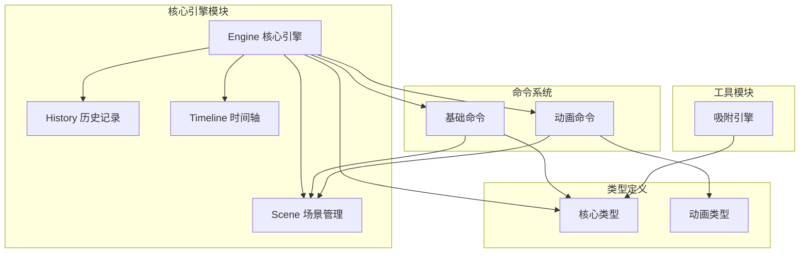

**图表来源**
- [engine.ts:1-54](file://src/engine/engine.ts#L1-L54)
- [scene.ts:1-273](file://src/engine/scene.ts#L1-L273)
- [history.ts:1-45](file://src/engine/history.ts#L1-L45)
- [timeline.ts:1-66](file://src/engine/timeline.ts#L1-L66)

**章节来源**
- [engine.ts:1-54](file://src/engine/engine.ts#L1-L54)
- [index.ts:1-16](file://src/engine/index.ts#L1-L16)

## 核心组件

### Engine 类设计架构

Engine 类是整个系统的核心控制器，采用组合模式设计，聚合了三个核心子系统：

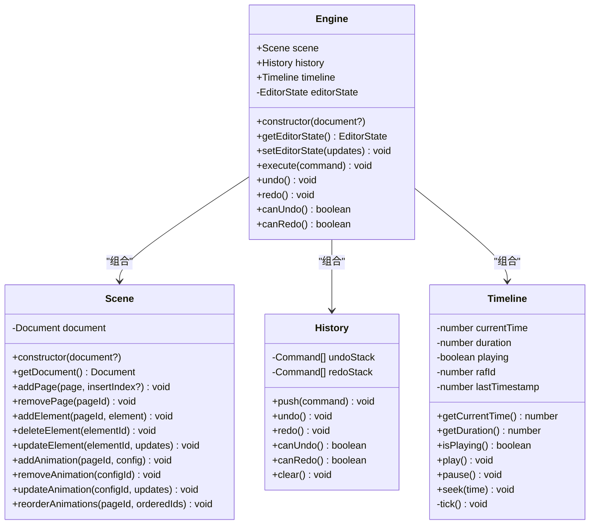

**图表来源**
- [engine.ts:7-49](file://src/engine/engine.ts#L7-L49)
- [scene.ts:3-247](file://src/engine/scene.ts#L3-L247)
- [history.ts:3-44](file://src/engine/history.ts#L3-L44)
- [timeline.ts:1-65](file://src/engine/timeline.ts#L1-L65)

### 构造函数初始化过程

Engine 构造函数执行严格的初始化顺序，确保系统在启动时处于一致状态：

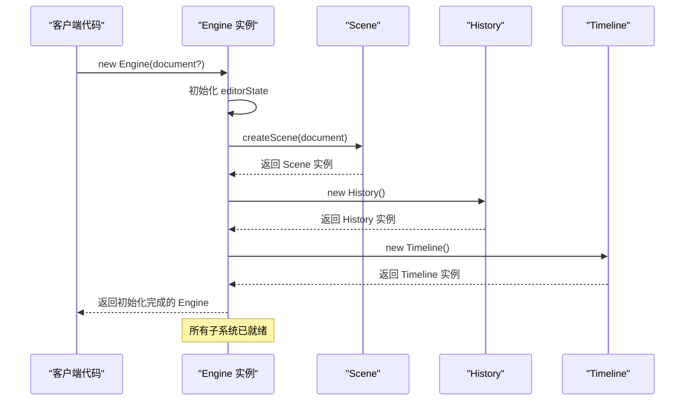

**图表来源**
- [engine.ts:14-19](file://src/engine/engine.ts#L14-L19)

**章节来源**
- [engine.ts:14-19](file://src/engine/engine.ts#L14-L19)

## 架构概览

核心引擎采用分层架构设计，实现了清晰的关注点分离：

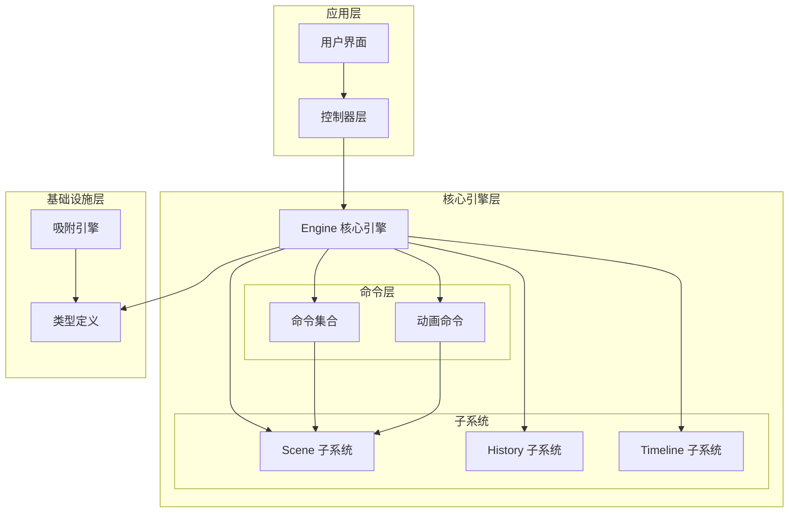

**图表来源**
- [engine.ts:1-54](file://src/engine/engine.ts#L1-L54)
- [index.ts:1-16](file://src/engine/index.ts#L1-L16)

### 数据流架构

引擎内部的数据流遵循单向数据流原则，确保状态变更的可预测性：

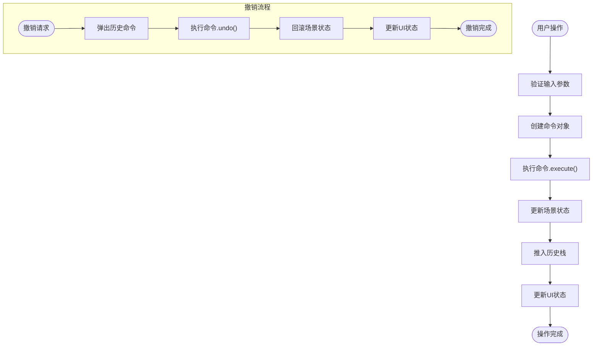

**图表来源**
- [engine.ts:29-32](file://src/engine/engine.ts#L29-L32)
- [history.ts:7-20](file://src/engine/history.ts#L7-L20)

## 详细组件分析

### Engine 类详细分析

#### 核心方法实现

**execute 方法执行机制**：
- 接收 Command 对象作为参数
- 调用命令的 execute() 方法执行实际操作
- 将命令推入历史记录栈以便后续撤销

**撤销/重做功能调用流程**：
- undo() 方法从撤销栈弹出最近的命令并执行其 undo() 方法
- redo() 方法从重做栈弹出命令并重新执行其 execute() 方法
- canUndo() 和 canRedo() 提供状态查询能力

**编辑器状态管理**：
- getEditorState() 返回当前编辑器状态的副本
- setEditorState() 支持部分状态更新，保持其他属性不变

#### 状态管理模式

编辑器状态独立于场景数据，遵循架构规则3：

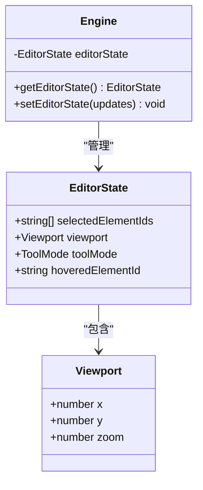

**图表来源**
- [types/index.ts:144-149](file://src/types/index.ts#L144-L149)
- [engine.ts:21-27](file://src/engine/engine.ts#L21-L27)

**章节来源**
- [engine.ts:21-48](file://src/engine/engine.ts#L21-L48)

### Scene 子系统分析

Scene 子系统负责管理文档结构和元素状态，提供完整的CRUD操作：

#### 页面管理功能

页面管理支持完整的增删改查操作：

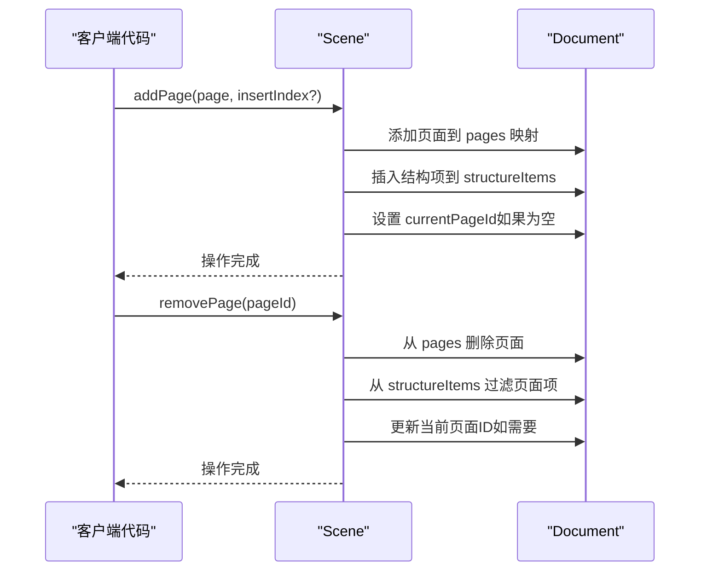

**图表来源**
- [scene.ts:18-40](file://src/engine/scene.ts#L18-L40)

#### 元素管理功能

元素管理支持复杂的层级关系维护：

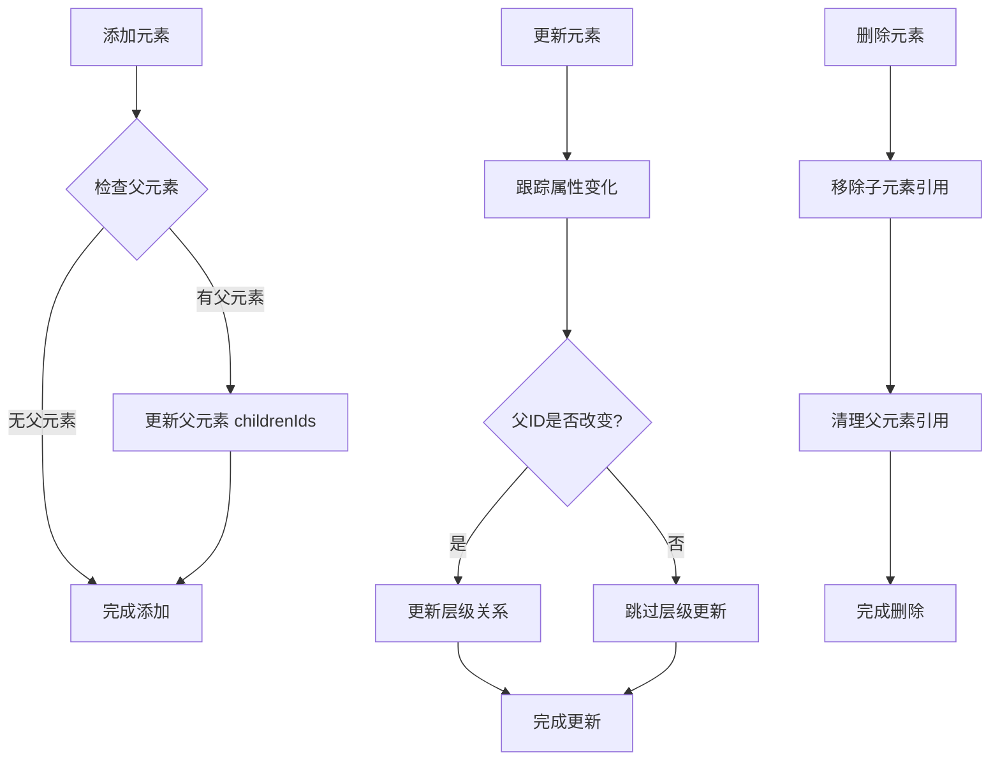

**图表来源**
- [scene.ts:94-159](file://src/engine/scene.ts#L94-L159)

**章节来源**
- [scene.ts:18-247](file://src/engine/scene.ts#L18-L247)

### History 子系统分析

History 子系统实现双栈撤销/重做机制：

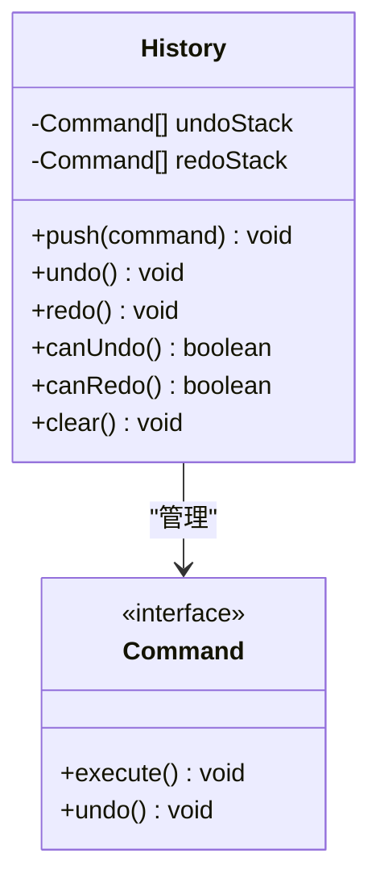

**图表来源**
- [history.ts:3-44](file://src/engine/history.ts#L3-L44)

#### 撤销/重做算法

撤销操作的核心流程：

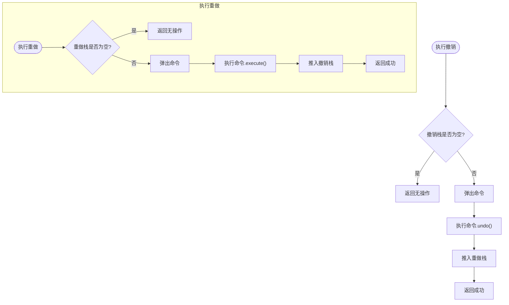

**图表来源**
- [history.ts:12-30](file://src/engine/history.ts#L12-L30)

**章节来源**
- [history.ts:3-44](file://src/engine/history.ts#L3-L44)

### Timeline 子系统分析

Timeline 子系统提供动画播放控制：

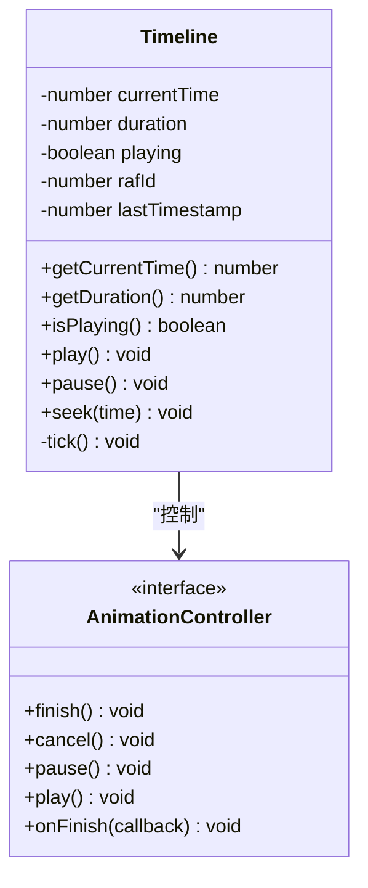

**图表来源**
- [timeline.ts:1-65](file://src/engine/timeline.ts#L1-L65)

#### 动画播放机制

时间轴播放采用requestAnimationFrame优化：

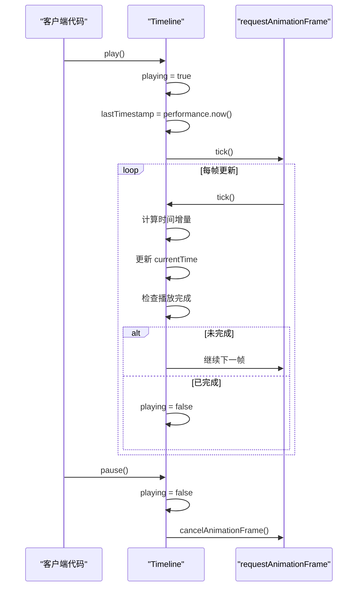

**图表来源**
- [timeline.ts:25-64](file://src/engine/timeline.ts#L25-L64)

**章节来源**
- [timeline.ts:1-66](file://src/engine/timeline.ts#L1-L66)

### 命令系统分析

命令系统实现统一的状态变更接口：

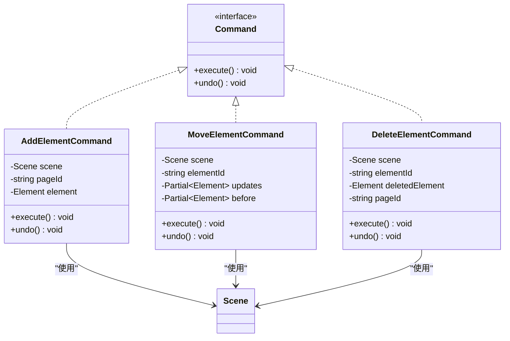

**图表来源**
- [commands.ts:4-68](file://src/engine/commands.ts#L4-L68)

#### 命令执行流程

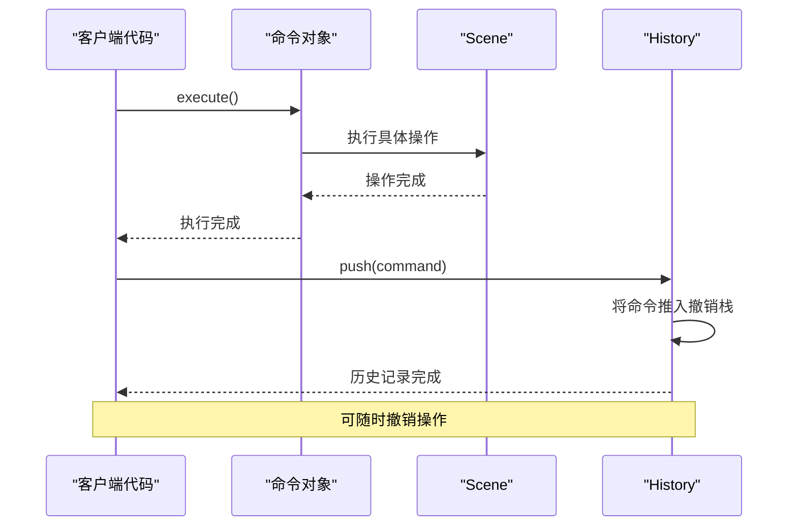

**图表来源**
- [commands.ts:11-17](file://src/engine/commands.ts#L11-L17)
- [engine.ts:29-32](file://src/engine/engine.ts#L29-L32)

**章节来源**
- [commands.ts:1-280](file://src/engine/commands.ts#L1-L280)

## 依赖关系分析

核心引擎的依赖关系体现了清晰的层次结构：

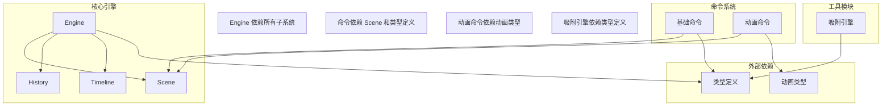

**图表来源**
- [engine.ts:1-5](file://src/engine/engine.ts#L1-L5)
- [commands.ts:1-2](file://src/engine/commands.ts#L1-L2)
- [animationCommands.ts:1-3](file://src/engine/animationCommands.ts#L1-L3)

### 循环依赖检测

经过分析，核心引擎不存在循环依赖：
- Engine 不依赖命令模块
- Scene 不依赖 Engine
- History 和 Timeline 独立存在
- 命令模块只依赖 Scene 和类型定义
- 动画命令模块依赖动画类型定义

**章节来源**
- [index.ts:1-16](file://src/engine/index.ts#L1-L16)

## 性能考虑

### 内存管理

- 使用不可变更新策略避免意外的状态共享
- 命令对象在历史栈中保持引用，便于撤销操作
- 时间轴使用requestAnimationFrame优化渲染性能

### 并发处理

- 命令执行采用同步模式，确保操作原子性
- 撤销/重做操作按历史顺序执行
- 时间轴播放使用单线程模型避免竞态条件

### 最佳实践建议

1. **命令设计原则**：
   - 每个命令应该封装单一的业务操作
   - 命令必须实现完整的撤销逻辑
   - 避免在命令中直接修改全局状态

2. **状态管理**：
   - 使用部分更新避免不必要的状态重建
   - 编辑器状态与场景状态分离管理
   - 合理使用缓存减少重复计算

3. **性能优化**：
   - 大量元素操作时考虑批处理
   - 合理设置时间轴刷新频率
   - 使用防抖技术优化频繁操作

## 故障排除指南

### 常见问题及解决方案

**问题1：命令执行后状态未更新**
- 检查命令是否正确实现 execute() 和 undo() 方法
- 确认命令对象是否通过 Engine.execute() 执行
- 验证历史记录栈是否正常工作

**问题2：撤销操作失败**
- 检查命令对象是否正确保存了撤销状态
- 确认历史记录栈中是否存在对应命令
- 验证命令的 undo() 方法实现是否完整

**问题3：时间轴播放异常**
- 检查时间轴状态是否正确初始化
- 确认requestAnimationFrame回调是否正常执行
- 验证播放状态切换逻辑

**章节来源**
- [history.ts:12-30](file://src/engine/history.ts#L12-L30)
- [timeline.ts:25-40](file://src/engine/timeline.ts#L25-L40)

## 结论

核心引擎通过精心设计的架构实现了高度模块化的状态管理系统。其关键优势包括：

1. **统一的命令执行模型**：所有状态变更都通过命令对象执行，确保操作的一致性和可预测性

2. **完善的撤销/重做机制**：双栈设计提供了灵活的版本控制能力

3. **清晰的职责分离**：场景管理、历史记录和时间轴播放各司其职，便于维护和扩展

4. **类型安全保证**：完整的TypeScript类型定义确保编译时错误检测

5. **框架无关性**：核心引擎不依赖任何特定UI框架，便于集成到不同应用场景

该设计为AI课件编辑器提供了坚实的技术基础，支持复杂动画编辑和交互式内容创作需求。通过遵循本文档的最佳实践，开发者可以有效地扩展和维护这一核心系统。