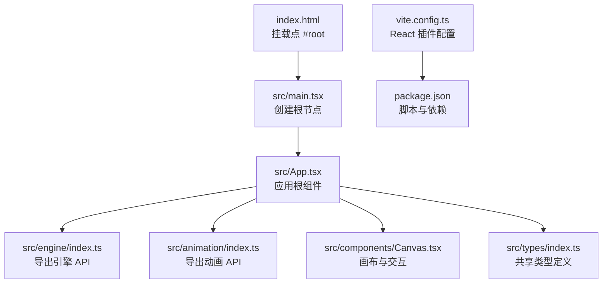
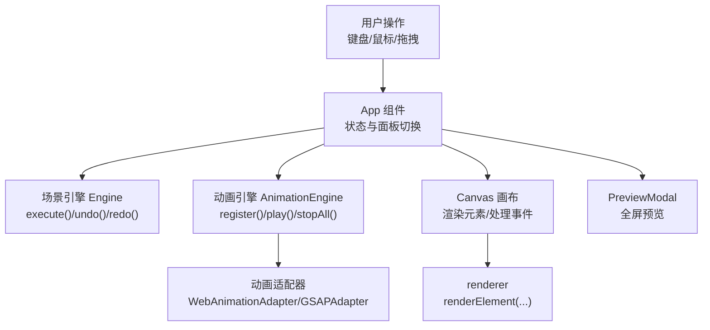
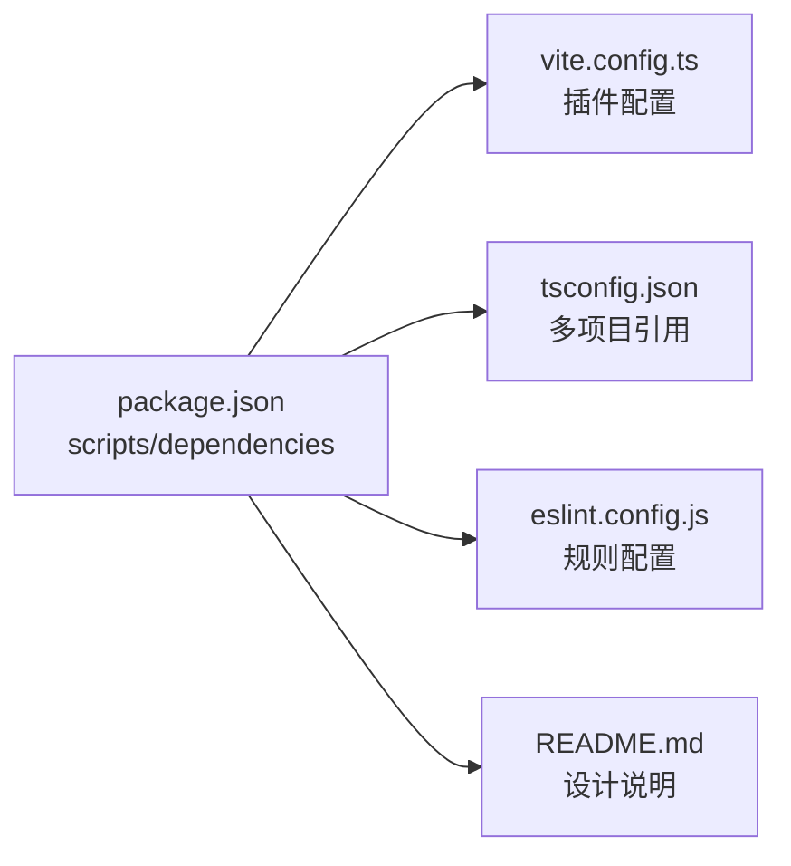

# 快速开始

<cite>
**本文引用的文件**   
- [package.json](file://package.json)
- [vite.config.ts](file://vite.config.ts)
- [index.html](file://index.html)
- [src/main.tsx](file://src/main.tsx)
- [src/App.tsx](file://src/App.tsx)
- [src/engine/index.ts](file://src/engine/index.ts)
- [src/engine/engine.ts](file://src/engine/engine.ts)
- [src/animation/index.ts](file://src/animation/index.ts)
- [src/animation/engine.ts](file://src/animation/engine.ts)
- [src/components/Canvas.tsx](file://src/components/Canvas.tsx)
- [src/types/index.ts](file://src/types/index.ts)
- [tsconfig.json](file://tsconfig.json)
- [eslint.config.js](file://eslint.config.js)
- [README.md](file://README.md)
</cite>

## 目录
1. [简介](#简介)
2. [项目结构](#项目结构)
3. [核心组件](#核心组件)
4. [架构总览](#架构总览)
5. [详细组件分析](#详细组件分析)
6. [依赖分析](#依赖分析)
7. [性能考虑](#性能考虑)
8. [故障排除指南](#故障排除指南)
9. [结论](#结论)
10. [附录](#附录)

## 简介
本指南面向首次接触 AI 课件编辑器项目的开发者，帮助你在最短时间内完成环境准备、依赖安装、本地开发服务器启动与基础操作体验。项目采用 React + Vite + TypeScript 技术栈，核心围绕“场景引擎 + 动画引擎”的双引擎架构，支持拖拽添加元素、属性面板编辑、动画编排与分步预览。

## 项目结构
项目采用按功能域划分的目录组织方式：引擎层（engine）、动画层（animation）、组件层（components）、渲染层（renderer）、状态与类型（store、types）。入口文件通过 HTML 引入主应用，Vite 负责开发服务器与构建打包。

图表来源
- [index.html:1-14](file://index.html#L1-L14)
- [src/main.tsx:1-10](file://src/main.tsx#L1-L10)
- [src/App.tsx:1-344](file://src/App.tsx#L1-L344)
- [src/engine/index.ts:1-16](file://src/engine/index.ts#L1-L16)
- [src/animation/index.ts:1-8](file://src/animation/index.ts#L1-L8)
- [src/components/Canvas.tsx:1-191](file://src/components/Canvas.tsx#L1-L191)
- [src/types/index.ts:1-159](file://src/types/index.ts#L1-L159)
- [vite.config.ts:1-7](file://vite.config.ts#L1-L7)
- [package.json:1-34](file://package.json#L1-L34)

章节来源
- [index.html:1-14](file://index.html#L1-L14)
- [src/main.tsx:1-10](file://src/main.tsx#L1-L10)
- [src/App.tsx:1-344](file://src/App.tsx#L1-L344)
- [vite.config.ts:1-7](file://vite.config.ts#L1-L7)
- [package.json:1-34](file://package.json#L1-L34)

## 核心组件
- 应用入口与根组件
  - 入口 HTML 挂载点为 #root，由 main.tsx 渲染 App。
  - App 组合了场景引擎、动画引擎、右侧属性/动画面板、画布与工具栏，并处理撤销/重做、键盘快捷键、全屏预览等交互。
- 场景引擎
  - 提供文档、页面、元素、动画、历史与时间轴的统一管理；所有状态变更必须通过命令对象执行，保证可回溯与可预测性。
- 动画引擎
  - 负责动画生命周期管理，根据配置构建关键帧并通过适配器播放（Web Animations 或 GSAP），支持按元素批量播放、暂停、恢复与停止。
- 画布与组件
  - Canvas 负责元素渲染、拖拽放置、点击选择、指针事件处理；配合 MoveableLayer 实现拖拽调整与选中框显示。

章节来源
- [src/main.tsx:1-10](file://src/main.tsx#L1-L10)
- [src/App.tsx:1-344](file://src/App.tsx#L1-L344)
- [src/engine/index.ts:1-16](file://src/engine/index.ts#L1-L16)
- [src/engine/engine.ts:1-54](file://src/engine/engine.ts#L1-L54)
- [src/animation/index.ts:1-8](file://src/animation/index.ts#L1-L8)
- [src/animation/engine.ts:1-120](file://src/animation/engine.ts#L1-L120)
- [src/components/Canvas.tsx:1-191](file://src/components/Canvas.tsx#L1-L191)

## 架构总览
下图展示了从浏览器到引擎与组件的调用链路，以及动画调度与适配器的协作关系。

图表来源
- [src/App.tsx:1-344](file://src/App.tsx#L1-L344)
- [src/engine/engine.ts:1-54](file://src/engine/engine.ts#L1-L54)
- [src/animation/engine.ts:1-120](file://src/animation/engine.ts#L1-L120)
- [src/animation/index.ts:1-8](file://src/animation/index.ts#L1-L8)
- [src/components/Canvas.tsx:1-191](file://src/components/Canvas.tsx#L1-L191)

## 详细组件分析

### 启动流程与开发服务器
- 开发服务器
  - 使用 Vite 提供的开发服务器，自动热更新与 TypeScript 支持。
  - 命令：在项目根目录执行开发脚本。
  - 预期行为：浏览器打开默认地址，页面显示应用界面。
- 构建与预览
  - 构建产物输出至 dist 目录；预览服务用于验证生产构建效果。

章节来源
- [package.json:6-11](file://package.json#L6-L11)
- [vite.config.ts:1-7](file://vite.config.ts#L1-L7)
- [index.html:1-14](file://index.html#L1-L14)

### 应用根组件与面板交互
- 右侧面板
  - 属性面板：编辑当前选中元素的属性。
  - 动画面板：查看/编辑页面动画，支持分步播放与进度指示。
- 键盘快捷键
  - Ctrl/Cmd+Z：撤销；Ctrl/Cmd+Y 或 Ctrl/Cmd+Shift+Z：重做。
  - Delete/Backspace：删除选中元素（需确保未处于输入状态）。
- 全屏预览
  - 打开预览模态，进入只读播放态，支持“Step / Batch”模型的逐步播放。

章节来源
- [src/App.tsx:1-344](file://src/App.tsx#L1-L344)

### 场景引擎与命令系统
- 设计要点
  - 所有状态变更必须通过命令对象执行，保证可撤销与可追踪。
  - 提供添加/移动/删除元素、添加/移除/更新动画、页面与结构管理等命令集。
- 关键接口
  - 执行命令、撤销、重做、查询可操作性。
  - 访问场景数据（文档、页面、元素、动画）与编辑器状态（选中、视口、工具模式）。

章节来源
- [src/engine/index.ts:1-16](file://src/engine/index.ts#L1-L16)
- [src/engine/engine.ts:1-54](file://src/engine/engine.ts#L1-L54)

### 动画引擎与调度
- 功能职责
  - 注册/注销动画配置，构建关键帧，委托适配器播放与控制。
  - 支持按元素批量播放、全局停止、暂停/恢复与重置。
- 调度模型
  - “Step / Batch”执行模型：Step 代表一次点击触发的动画集合；Batch 为 Step 内部串行执行的动画组，Batch 内动画并行播放。
  - 仅当动画起始类型为点击时开启新 Step。

章节来源
- [src/animation/engine.ts:1-120](file://src/animation/engine.ts#L1-L120)
- [README.md:6-14](file://README.md#L6-L14)

### 画布与元素渲染
- 交互能力
  - 拖拽放置：从组件面板拖入元素到画布，自动计算坐标并创建元素。
  - 点击选择：点击元素或空白区域以切换选中状态。
  - 指针事件：处理画布空白处按下取消选择。
- 渲染机制
  - 通过渲染器将元素渲染为 DOM，配合 MoveableLayer 显示选中框与调整手柄。

章节来源
- [src/components/Canvas.tsx:1-191](file://src/components/Canvas.tsx#L1-L191)

### 类型与数据模型
- 共享类型
  - 元素类型：形状、文本、图片、组合。
  - 文档/页面/节点/结构项：描述课件的整体结构与当前页。
  - 编辑器状态：选中元素、视口、工具模式、悬停元素。
  - 动画类型：关键帧、缓动函数、动画配置。
- 设计原则
  - 将编辑器状态与场景数据分离，避免耦合。

章节来源
- [src/types/index.ts:1-159](file://src/types/index.ts#L1-L159)

## 依赖分析
- 运行时依赖
  - React 生态与交互库：React、React DOM、react-moveable（拖拽交互）。
  - 拖拽与排序：@dnd-kit 核心与排序工具。
  - 动画：GSAP（可选适配器）。
- 开发依赖
  - Vite 构建工具与 React 插件。
  - TypeScript 与 ESLint 工具链。
- 脚本命令
  - dev：启动开发服务器。
  - build：先执行类型检查再构建。
  - lint：运行代码规范检查。
  - preview：预览生产构建。

图表来源
- [package.json:1-34](file://package.json#L1-L34)
- [vite.config.ts:1-7](file://vite.config.ts#L1-L7)
- [tsconfig.json:1-8](file://tsconfig.json#L1-L8)
- [eslint.config.js:1-9](file://eslint.config.js#L1-L9)
- [README.md:1-15](file://README.md#L1-L15)

章节来源
- [package.json:1-34](file://package.json#L1-L34)
- [vite.config.ts:1-7](file://vite.config.ts#L1-L7)
- [tsconfig.json:1-8](file://tsconfig.json#L1-L8)
- [eslint.config.js:1-9](file://eslint.config.js#L1-L9)
- [README.md:1-15](file://README.md#L1-L15)

## 性能考虑
- 动画播放范围限定
  - 通过设置作用域根节点，使动画查询与播放限定在画布容器内，避免跨容器影响与重复查询。
- 分步播放与批处理
  - Step/Batch 模型减少一次性大量动画的视觉冲击，提升预览体验与调试效率。
- 事件与状态刷新
  - 通过版本号驱动的刷新策略，避免不必要的重渲染，保持界面响应流畅。

章节来源
- [src/animation/engine.ts:19-30](file://src/animation/engine.ts#L19-L30)
- [src/App.tsx:28-74](file://src/App.tsx#L28-L74)
- [README.md:6-14](file://README.md#L6-L14)

## 故障排除指南
- 开发服务器无法启动
  - 确认已安装 Node.js 与包管理器；执行安装依赖后重试。
  - 若端口被占用，修改 Vite 配置或关闭占用进程。
- 页面空白或无内容
  - 检查入口 HTML 是否正确挂载 #root；确认 main.tsx 正常渲染 App。
  - 确认 TypeScript 编译无错误。
- 动画不播放或播放异常
  - 确认元素已在画布上存在且具有 data-element-id 属性。
  - 检查动画配置是否启用，元素 ID 是否匹配。
  - 在动画面板中重置调度器并重新加载动画列表。
- 撤销/重做无效
  - 确认当前操作通过命令执行；非命令路径的状态变更不会进入历史栈。
- 删除元素无效
  - 确保未处于输入状态（输入框/文本域/可编辑元素），否则 Delete/Backspace 不会触发删除命令。

章节来源
- [index.html:1-14](file://index.html#L1-L14)
- [src/main.tsx:1-10](file://src/main.tsx#L1-L10)
- [src/App.tsx:107-150](file://src/App.tsx#L107-L150)
- [src/animation/engine.ts:24-30](file://src/animation/engine.ts#L24-L30)
- [src/engine/engine.ts:29-48](file://src/engine/engine.ts#L29-L48)

## 结论
通过本快速开始指南，你已经完成了环境准备、依赖安装、开发服务器启动与基础操作体验。建议进一步探索以下方向：
- 在属性面板中编辑元素属性，观察画布实时变化。
- 在动画面板中为元素添加动画，使用“下一步/上一步”按钮体验 Step/Batch 播放。
- 查看 README 中关于“Step / Batch”模型的说明，理解动画执行顺序与策略。

## 附录

### 环境要求
- Node.js 与包管理器（如 npm/yarn/pnpm）
- 推荐使用现代浏览器进行开发与调试

章节来源
- [package.json:1-34](file://package.json#L1-L34)

### 依赖安装步骤
- 在项目根目录执行安装命令，等待依赖下载完成。
- 安装完成后，可直接进入开发阶段。

章节来源
- [package.json:1-34](file://package.json#L1-L34)

### 启动开发服务器
- 在项目根目录执行开发脚本，等待浏览器自动打开。
- 预期输出：浏览器显示应用界面，顶部包含撤销/重做、动画控制与全屏预览按钮。

章节来源
- [package.json:6-11](file://package.json#L6-L11)
- [vite.config.ts:1-7](file://vite.config.ts#L1-L7)
- [index.html:1-14](file://index.html#L1-L14)

### 基本使用示例
- 添加元素
  - 从左侧组件面板拖拽“形状/文本/图片”到画布，元素自动创建并选中。
- 编辑属性
  - 切换到“属性”面板，修改所选元素的尺寸、颜色、文字等。
- 编排动画
  - 切换到“动画”面板，为元素添加动画；点击“下一步”逐步预览。
- 全屏预览
  - 点击“全屏预览”，进入只读播放态，体验 Step/Batch 执行模型。

章节来源
- [src/components/Canvas.tsx:44-77](file://src/components/Canvas.tsx#L44-L77)
- [src/App.tsx:28-74](file://src/App.tsx#L28-L74)
- [README.md:6-14](file://README.md#L6-L14)