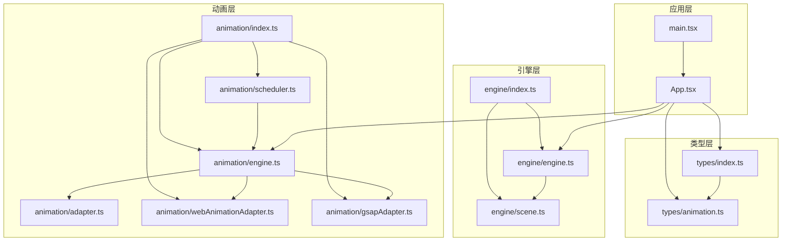
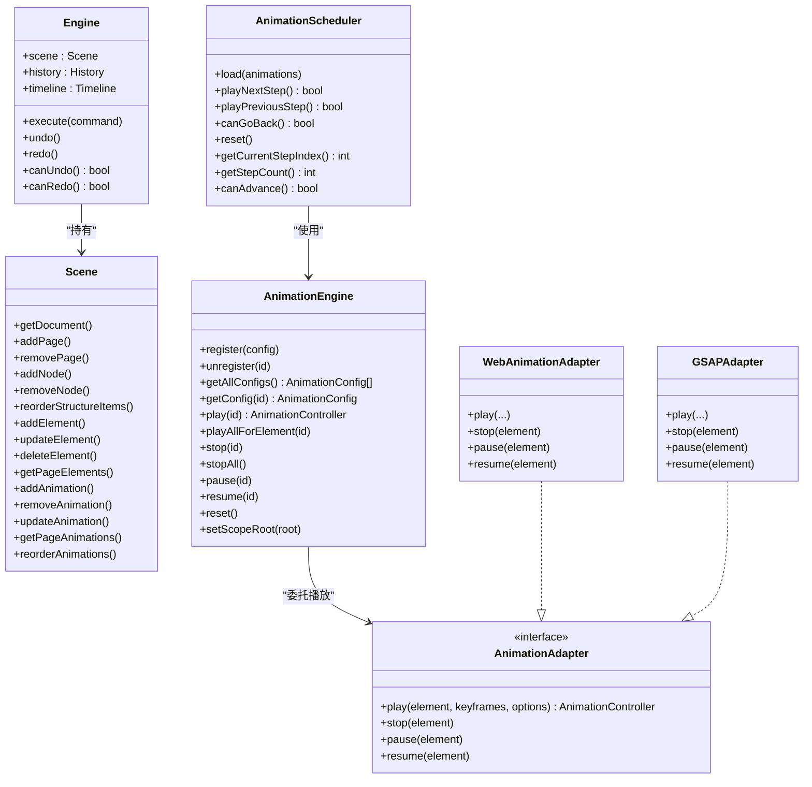
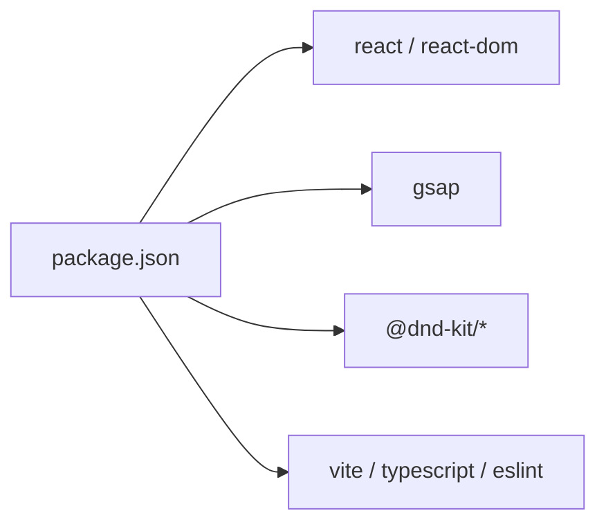

# 插件系统

<cite>
**本文引用的文件**
- [src/main.tsx](file://src/main.tsx)
- [src/App.tsx](file://src/App.tsx)
- [src/engine/index.ts](file://src/engine/index.ts)
- [src/engine/engine.ts](file://src/engine/engine.ts)
- [src/engine/scene.ts](file://src/engine/scene.ts)
- [src/animation/index.ts](file://src/animation/index.ts)
- [src/animation/engine.ts](file://src/animation/engine.ts)
- [src/animation/scheduler.ts](file://src/animation/scheduler.ts)
- [src/animation/adapter.ts](file://src/animation/adapter.ts)
- [src/animation/webAnimationAdapter.ts](file://src/animation/webAnimationAdapter.ts)
- [src/animation/gsapAdapter.ts](file://src/animation/gsapAdapter.ts)
- [src/types/index.ts](file://src/types/index.ts)
- [src/types/animation.ts](file://src/types/animation.ts)
- [package.json](file://package.json)
</cite>

## 目录
1. [简介](#简介)
2. [项目结构](#项目结构)
3. [核心组件](#核心组件)
4. [架构总览](#架构总览)
5. [详细组件分析](#详细组件分析)
6. [依赖分析](#依赖分析)
7. [性能考量](#性能考量)
8. [故障排查指南](#故障排查指南)
9. [结论](#结论)
10. [附录](#附录)

## 简介
本插件系统围绕“引擎-适配器-调度器”三层架构设计，目标是为AI课件等富媒体内容创作提供可扩展、可替换、可测试的动画能力。系统通过统一的动画配置模型与适配器抽象，屏蔽底层动画库差异（如Web Animations API与GSAP），并通过调度器实现“点击步进”的分步演示模式。插件化体现在：
- 扩展点：新增动画效果、新的启动时机、新的参数组合。
- 生命周期：从注册到播放、暂停、恢复、停止、重置。
- 依赖注入：通过构造函数注入适配器实例，便于切换实现或替换为自定义适配器。

该文档将系统阐述设计理念、扩展点、生命周期、注册与依赖注入、开发指南、API说明、最佳实践、示例思路、调试技巧与性能优化，并给出与核心系统的集成方式与通信协议。

## 项目结构
项目采用按功能域划分的组织方式：
- 引擎层（engine）：负责场景状态、命令执行、历史与时间线管理。
- 动画层（animation）：负责动画配置、关键帧构建、播放控制与调度。
- 类型层（types）：定义跨模块共享的数据结构与枚举。
- 应用入口（main.tsx、App.tsx）：装配引擎与动画子系统，协调UI与状态。

图表来源
- [src/main.tsx:1-10](file://src/main.tsx#L1-L10)
- [src/App.tsx:1-344](file://src/App.tsx#L1-L344)
- [src/engine/index.ts:1-16](file://src/engine/index.ts#L1-L16)
- [src/engine/engine.ts:1-54](file://src/engine/engine.ts#L1-L54)
- [src/engine/scene.ts:1-273](file://src/engine/scene.ts#L1-L273)
- [src/animation/index.ts:1-8](file://src/animation/index.ts#L1-L8)
- [src/animation/engine.ts:1-120](file://src/animation/engine.ts#L1-L120)
- [src/animation/scheduler.ts:1-160](file://src/animation/scheduler.ts#L1-L160)
- [src/animation/adapter.ts:1-27](file://src/animation/adapter.ts#L1-L27)
- [src/animation/webAnimationAdapter.ts:1-67](file://src/animation/webAnimationAdapter.ts#L1-L67)
- [src/animation/gsapAdapter.ts:1-140](file://src/animation/gsapAdapter.ts#L1-L140)
- [src/types/index.ts:1-159](file://src/types/index.ts#L1-L159)
- [src/types/animation.ts:1-113](file://src/types/animation.ts#L1-L113)

章节来源
- [src/main.tsx:1-10](file://src/main.tsx#L1-L10)
- [src/App.tsx:1-344](file://src/App.tsx#L1-L344)
- [src/engine/index.ts:1-16](file://src/engine/index.ts#L1-L16)
- [src/animation/index.ts:1-8](file://src/animation/index.ts#L1-L8)
- [src/types/index.ts:1-159](file://src/types/index.ts#L1-L159)
- [src/types/animation.ts:1-113](file://src/types/animation.ts#L1-L113)

## 核心组件
- 引擎（Engine）
  - 职责：持有场景、历史与时间线；统一执行命令；提供撤销/重做能力。
  - 关键方法：execute、undo、redo、canUndo、canRedo。
- 场景（Scene）
  - 职责：维护文档结构、页面、节点、元素与动画配置；提供CRUD与排序操作。
  - 关键方法：addPage/removePage/addNode/removeNode/reorderStructureItems、addElement/updateElement/deleteElement/getElement/getPageElements、addAnimation/removeAnimation/updateAnimation/getAnimation/getPageAnimations/reorderAnimations。
- 动画引擎（AnimationEngine）
  - 职责：注册/注销动画配置；构建关键帧；委托适配器播放/停止/暂停/恢复；统一生命周期管理。
  - 关键方法：register/unregister/getAllConfigs/getConfig/play/playAllForElement/stop/stopAll/pause/resume/reset/setScopeRoot。
- 调度器（AnimationScheduler）
  - 职责：将动画序列转换为“步骤-批次”模型；在用户点击时逐步执行；支持回退与重放。
  - 关键方法：load/playNextStep/playPreviousStep/canGoBack/reset/getCurrentStepIndex/getStepCount/canAdvance。
- 适配器（AnimationAdapter）
  - 抽象：定义统一的播放/停止/暂停/恢复接口，屏蔽底层实现差异。
  - 实现：WebAnimationAdapter（原生WAAPI）、GSAPAdapter（GSAP）。
- 类型系统（types）
  - 定义动画配置、关键帧、参数、调度单元、控制器等核心数据结构与枚举。

章节来源
- [src/engine/engine.ts:1-54](file://src/engine/engine.ts#L1-L54)
- [src/engine/scene.ts:1-273](file://src/engine/scene.ts#L1-L273)
- [src/animation/engine.ts:1-120](file://src/animation/engine.ts#L1-L120)
- [src/animation/scheduler.ts:1-160](file://src/animation/scheduler.ts#L1-L160)
- [src/animation/adapter.ts:1-27](file://src/animation/adapter.ts#L1-L27)
- [src/animation/webAnimationAdapter.ts:1-67](file://src/animation/webAnimationAdapter.ts#L1-L67)
- [src/animation/gsapAdapter.ts:1-140](file://src/animation/gsapAdapter.ts#L1-L140)
- [src/types/index.ts:1-159](file://src/types/index.ts#L1-L159)
- [src/types/animation.ts:1-113](file://src/types/animation.ts#L1-L113)

## 架构总览
系统采用“框架无关”的引擎内核，配合可插拔的动画适配器与调度器，形成清晰的职责边界与扩展点。应用层通过入口文件装配核心对象，UI层通过状态驱动与事件触发调用引擎与动画子系统。

图表来源
- [src/engine/engine.ts:1-54](file://src/engine/engine.ts#L1-L54)
- [src/engine/scene.ts:1-273](file://src/engine/scene.ts#L1-L273)
- [src/animation/engine.ts:1-120](file://src/animation/engine.ts#L1-L120)
- [src/animation/scheduler.ts:1-160](file://src/animation/scheduler.ts#L1-L160)
- [src/animation/adapter.ts:1-27](file://src/animation/adapter.ts#L1-L27)
- [src/animation/webAnimationAdapter.ts:1-67](file://src/animation/webAnimationAdapter.ts#L1-L67)
- [src/animation/gsapAdapter.ts:1-140](file://src/animation/gsapAdapter.ts#L1-L140)

## 详细组件分析

### 引擎与场景（Engine/Scene）
- 设计要点
  - 命令式执行：所有状态变更必须通过命令执行，保证历史可追踪与可撤销。
  - 场景数据模型：以文档为中心，包含页面、节点、元素与动画配置，支持结构重排与元素父子关系维护。
- 生命周期
  - 初始化：创建引擎与场景；初始化编辑态。
  - 执行：执行命令入历史栈；更新场景状态。
  - 撤销/重做：基于历史栈回溯。
- 复杂度
  - 元素/动画查询与更新在当前页范围内进行，平均复杂度与元素数量线性相关。

章节来源
- [src/engine/engine.ts:1-54](file://src/engine/engine.ts#L1-L54)
- [src/engine/scene.ts:1-273](file://src/engine/scene.ts#L1-L273)

### 动画引擎（AnimationEngine）
- 设计要点
  - 配置驱动：通过注册动画配置，构建关键帧后交由适配器播放。
  - 作用域隔离：可通过scopeRoot限制DOM查询范围，便于预览容器等场景。
  - 控制器抽象：返回统一的控制器接口，便于上层编排与生命周期管理。
- 生命周期
  - 注册：register/getAllConfigs/getConfig。
  - 播放：play/playAllForElement；支持按元素批量播放。
  - 停止/暂停/恢复：stop/stopAll/pause/resume。
  - 清理：reset清空并停止所有动画。
- 复杂度
  - 单次播放查询元素与构建关键帧为O(1)+关键帧数量；批量播放为关键帧数量与元素数乘积。

章节来源
- [src/animation/engine.ts:1-120](file://src/animation/engine.ts#L1-L120)

### 调度器（AnimationScheduler）
- 设计要点
  - 步骤-批次模型：将动画序列拆分为“点击步进”，每步内批次并发、批次内顺序串行。
  - 启动类型：click/withPrev/afterPrev决定步与批的划分策略。
  - 回退与重放：支持向前/向后移动，自动清理与重建运行中的控制器。
- 生命周期
  - 加载：load接收启用动画列表，生成步骤。
  - 播放：playNextStep逐步推进；playPreviousStep回退并重放当前步。
  - 状态：canGoBack/canAdvance/getStepCount/getCurrentStepIndex。
  - 清理：reset取消所有控制器并清空状态。
- 复杂度
  - 构建步骤为线性扫描；每步播放涉及批次内并发控制器管理。

章节来源
- [src/animation/scheduler.ts:1-160](file://src/animation/scheduler.ts#L1-L160)

### 适配器与扩展点（AnimationAdapter/WebAnimationAdapter/GSAPAdapter）
- 设计要点
  - 适配器抽象：统一播放/停止/暂停/恢复接口，屏蔽底层差异。
  - 内置实现：WebAnimationAdapter基于WAAPI；GSAPAdapter基于GSAP，提供更丰富的缓动与变换解析。
- 扩展点
  - 新增适配器：实现AnimationAdapter接口即可无缝接入。
  - 新增动画效果：通过扩展动画配置与关键帧构建逻辑（现有代码中关键帧构建位于动画引擎内部，适配器仅消费WAAPI兼容的关键帧）。
- 生命周期
  - 控制器：finish/cancel/pause/play/onFinish，便于上层编排与资源回收。

章节来源
- [src/animation/adapter.ts:1-27](file://src/animation/adapter.ts#L1-L27)
- [src/animation/webAnimationAdapter.ts:1-67](file://src/animation/webAnimationAdapter.ts#L1-L67)
- [src/animation/gsapAdapter.ts:1-140](file://src/animation/gsapAdapter.ts#L1-L140)

### 应用集成与生命周期（App.tsx）
- 设计要点
  - 自动同步：当右侧面板切换至“动画”且非预览时，自动根据当前页动画列表重建动画引擎与调度器。
  - 版本刷新：通过版本号驱动渲染刷新，确保UI与场景状态一致。
  - 键盘快捷键：支持撤销/重做与删除选中元素。
- 生命周期
  - 初始化：创建引擎与动画引擎。
  - 切换面板：根据tab与预览状态创建/销毁调度器与停止所有动画。
  - 变更监听：当动画启用状态或列表变化时，重载调度器并更新进度。

章节来源
- [src/App.tsx:1-344](file://src/App.tsx#L1-L344)

### 数据流与通信协议
- 数据交换格式
  - 动画配置：包含id、elementId、name、enable、type、effect、startType、duration、delay、easing、repeatCount、params等字段。
  - 关键帧：WAAPI兼容的keyframe对象集合，含offset与CSS属性映射。
  - 调度单元：ClickStep与AnimationBatch，描述步与批的结构。
- 通信协议
  - 组件间通信：通过props传递引擎实例与回调；通过状态变量（如版本号）驱动重渲染。
  - 事件绑定：键盘事件处理与按钮点击事件触发引擎命令与动画控制。

章节来源
- [src/types/animation.ts:1-113](file://src/types/animation.ts#L1-L113)
- [src/animation/engine.ts:1-120](file://src/animation/engine.ts#L1-L120)
- [src/App.tsx:1-344](file://src/App.tsx#L1-L344)

## 依赖分析
- 内部依赖
  - App.tsx依赖引擎与动画子系统；引擎依赖场景；动画引擎依赖适配器；调度器依赖动画引擎。
- 外部依赖
  - React与React DOM用于UI渲染；GSAP用于高级动画；@dnd-kit用于拖拽；vite/eslint/typescript用于构建与开发工具链。

图表来源
- [package.json:1-34](file://package.json#L1-L34)

章节来源
- [package.json:1-34](file://package.json#L1-L34)

## 性能考量
- 关键帧构建与播放
  - 将关键帧构建放在动画引擎内部，避免重复计算；对同一元素的批量播放应合并控制器管理。
- DOM查询与作用域
  - 使用setScopeRoot限定查询范围，减少全局DOM扫描开销。
- 并发与串行
  - 调度器的批次内并发与步间串行设计，有助于提升交互体验与资源利用效率。
- 缓存与复用
  - 适配器内部使用WeakMap缓存控制器，避免重复创建与内存泄漏。
- 预览与全屏
  - 预览模式下停止所有动画，避免不必要的渲染压力。

[本节为通用性能建议，不直接分析具体文件]

## 故障排查指南
- 动画未播放
  - 检查元素是否存在于当前页元素集中；确认动画配置已注册且enable为true；确认startType与调度器加载一致。
- 播放异常或卡顿
  - 查看是否同时存在多个适配器实例导致冲突；检查控制器是否正确清理与取消。
- 调度器无法前进/后退
  - 确认当前步索引与步总数；检查是否有运行中的控制器未完成；必要时调用reset重置。
- 预览模式下动画残留
  - 确保预览关闭时调用了stopAll与调度器reset。

章节来源
- [src/animation/engine.ts:1-120](file://src/animation/engine.ts#L1-L120)
- [src/animation/scheduler.ts:1-160](file://src/animation/scheduler.ts#L1-L160)
- [src/App.tsx:1-344](file://src/App.tsx#L1-L344)

## 结论
该插件系统通过“引擎-适配器-调度器”三层架构实现了动画能力的可扩展与可替换。其关键优势在于：
- 明确的扩展点：适配器抽象、配置驱动、调度模型。
- 清晰的生命周期：从注册到播放、暂停、恢复、停止、重置。
- 良好的集成方式：应用层通过入口文件装配核心对象，UI层通过状态与事件驱动。
- 可靠的开发与调试路径：类型系统、控制器接口与调度器状态便于定位问题。

[本节为总结性内容，不直接分析具体文件]

## 附录

### 插件开发指南（面向AI课件）
- 扩展点
  - 新增动画效果：在类型系统中扩展AnimationEffect与参数类型；在关键帧构建处增加对应映射（若需要）。
  - 新增启动时机：在调度器的步骤划分逻辑中增加新startType分支。
  - 新增适配器：实现AnimationAdapter接口，注入到AnimationEngine。
- 依赖注入
  - 在应用层创建适配器实例并传入AnimationEngine构造函数；或通过工厂函数按环境选择不同适配器。
- 生命周期管理
  - 在App.tsx中根据面板状态与预览状态创建/销毁调度器；在版本刷新时同步动画配置。
- 最佳实践
  - 使用enable字段控制动画启用；在预览模式下统一停止所有动画；合理使用批次与步的并发策略。
- 示例思路
  - 在PropertyPanel中添加动画配置项；在AnimationPanel中提供播放/从这里播放按钮；在Canvas中通过data-element-id关联元素。
- 调试技巧
  - 使用控制器的onFinish回调与日志输出；在预览关闭后调用stopAll与reset；检查元素选择与父级关系。
- 性能优化
  - 合理设置duration/delay/easing；避免过多元素同时播放；使用scopeRoot限定查询范围；在批处理中尽量并发。

[本节为概念性指导，不直接分析具体文件]