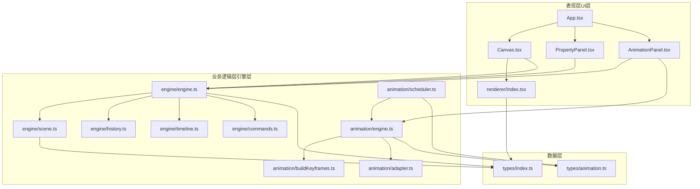
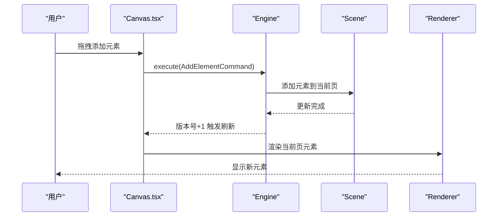
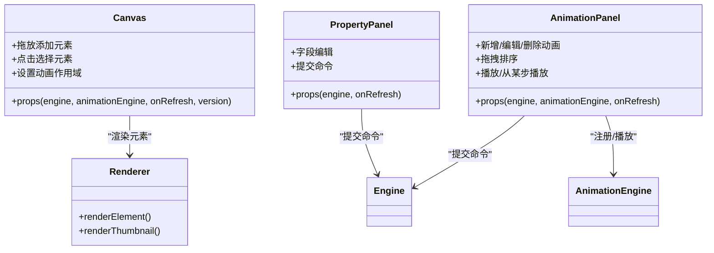
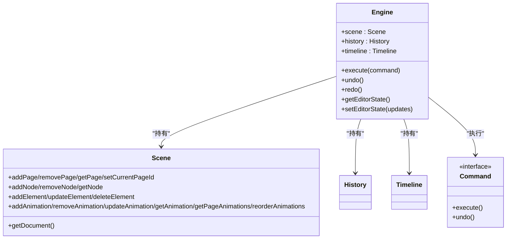
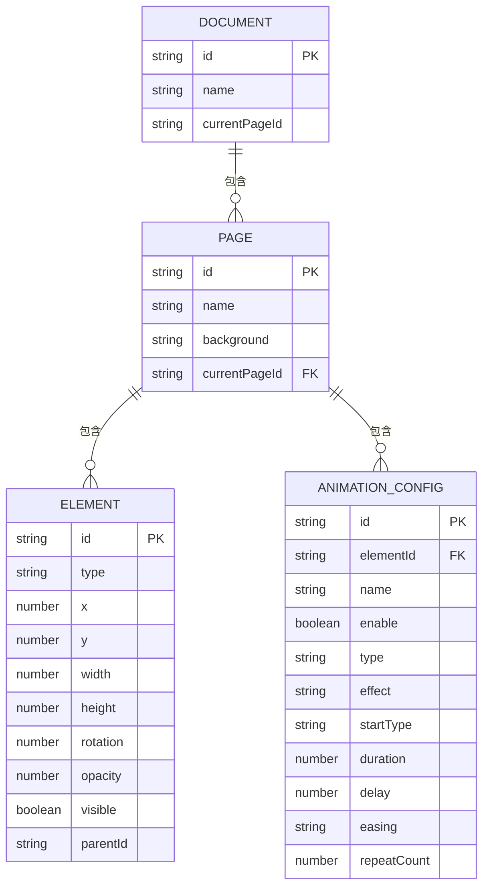
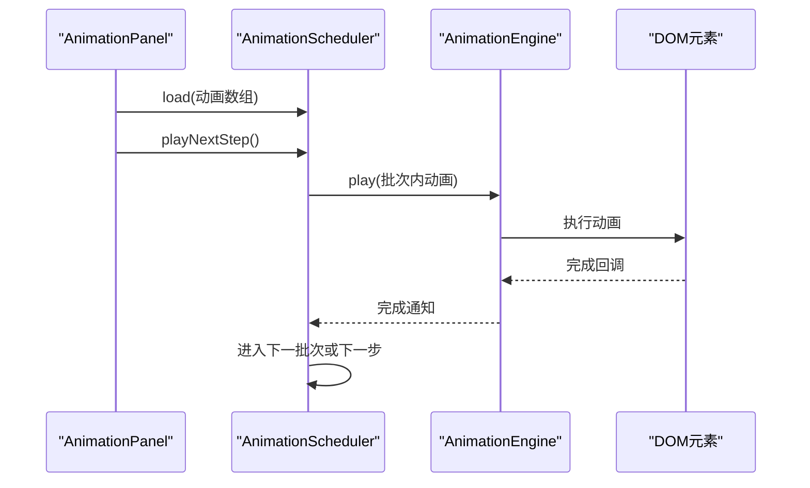
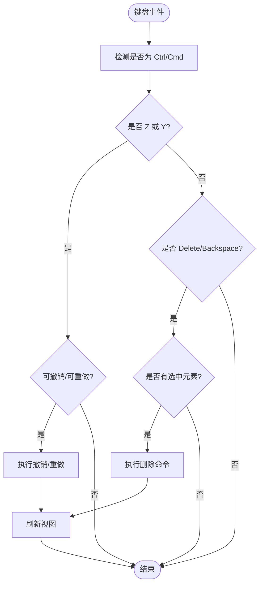
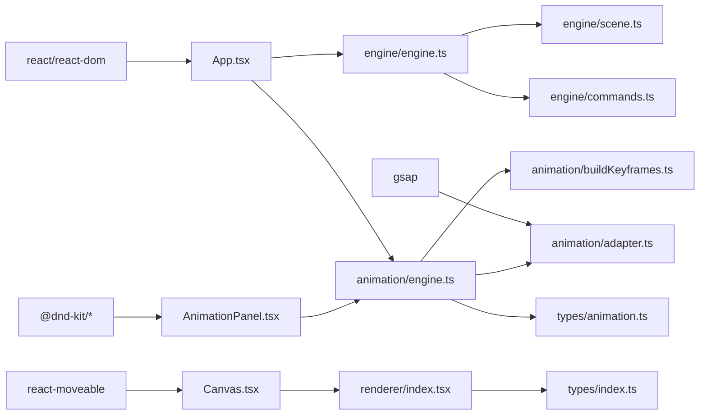

# 分层架构

<cite>
**本文引用的文件**
- [src/App.tsx](file://src/App.tsx)
- [src/main.tsx](file://src/main.tsx)
- [src/engine/index.ts](file://src/engine/index.ts)
- [src/engine/engine.ts](file://src/engine/engine.ts)
- [src/engine/scene.ts](file://src/engine/scene.ts)
- [src/engine/history.ts](file://src/engine/history.ts)
- [src/engine/timeline.ts](file://src/engine/timeline.ts)
- [src/engine/commands.ts](file://src/engine/commands.ts)
- [src/engine/animationCommands.ts](file://src/engine/animationCommands.ts)
- [src/animation/engine.ts](file://src/animation/engine.ts)
- [src/animation/scheduler.ts](file://src/animation/scheduler.ts)
- [src/animation/buildKeyframes.ts](file://src/animation/buildKeyframes.ts)
- [src/animation/adapter.ts](file://src/animation/adapter.ts)
- [src/animation/gsapAdapter.ts](file://src/animation/gsapAdapter.ts)
- [src/animation/webAnimationAdapter.ts](file://src/animation/webAnimationAdapter.ts)
- [src/renderer/index.tsx](file://src/renderer/index.tsx)
- [src/components/Canvas.tsx](file://src/components/Canvas.tsx)
- [src/components/PropertyPanel.tsx](file://src/components/PropertyPanel.tsx)
- [src/components/AnimationPanel.tsx](file://src/components/AnimationPanel.tsx)
- [src/types/index.ts](file://src/types/index.ts)
- [src/types/animation.ts](file://src/types/animation.ts)
- [package.json](file://package.json)
</cite>

## 目录
1. [引言](#引言)
2. [项目结构](#项目结构)
3. [核心组件](#核心组件)
4. [架构总览](#架构总览)
5. [详细组件分析](#详细组件分析)
6. [依赖分析](#依赖分析)
7. [性能考虑](#性能考虑)
8. [故障排查指南](#故障排查指南)
9. [结论](#结论)
10. [附录](#附录)

## 引言
本文件面向“AI课件编辑器”的分层架构，系统化梳理表现层（UI层）、业务逻辑层（引擎层）与数据层（场景与状态）的职责划分、边界定义与交互机制。文档重点解释：
- 各层之间的依赖关系与通信路径（数据流与控制流）
- 分层架构带来的优势：关注点分离、可测试性、可维护性
- 层间接口设计与错误处理策略
- 性能优化建议与在保持分层清晰前提下的高效实现方式

## 项目结构
该工程采用以功能域为导向的组织方式，结合分层思想：
- 表现层：React 组件（Canvas、PropertyPanel、AnimationPanel 等），负责用户交互与渲染
- 业务逻辑层：引擎模块（Engine、Scene、History、Timeline、命令体系），负责状态变更与业务规则
- 数据层：类型定义与场景数据模型（Document/Page/Element/AnimationConfig 等）
- 动画子系统：AnimationEngine、AnimationScheduler、适配器与键帧构建工具
- 渲染器：统一的元素渲染函数，支持缩略图与选中态

图表来源
- [src/App.tsx:11-341](file://src/App.tsx#L11-L341)
- [src/components/Canvas.tsx:22-128](file://src/components/Canvas.tsx#L22-L128)
- [src/components/PropertyPanel.tsx:12-77](file://src/components/PropertyPanel.tsx#L12-L77)
- [src/components/AnimationPanel.tsx:87-549](file://src/components/AnimationPanel.tsx#L87-L549)
- [src/engine/engine.ts:7-49](file://src/engine/engine.ts#L7-L49)
- [src/engine/scene.ts:3-247](file://src/engine/scene.ts#L3-L247)
- [src/engine/history.ts](file://src/engine/history.ts)
- [src/engine/timeline.ts](file://src/engine/timeline.ts)
- [src/engine/commands.ts](file://src/engine/commands.ts)
- [src/animation/engine.ts:9-119](file://src/animation/engine.ts#L9-L119)
- [src/animation/scheduler.ts:56-159](file://src/animation/scheduler.ts#L56-L159)
- [src/animation/buildKeyframes.ts](file://src/animation/buildKeyframes.ts)
- [src/animation/adapter.ts](file://src/animation/adapter.ts)
- [src/renderer/index.tsx:5-202](file://src/renderer/index.tsx#L5-L202)
- [src/types/index.ts:1-159](file://src/types/index.ts#L1-L159)
- [src/types/animation.ts:1-113](file://src/types/animation.ts#L1-L113)

章节来源
- [src/App.tsx:11-341](file://src/App.tsx#L11-L341)
- [src/main.tsx:1-10](file://src/main.tsx#L1-L10)
- [src/engine/index.ts:1-16](file://src/engine/index.ts#L1-L16)
- [src/types/index.ts:1-159](file://src/types/index.ts#L1-L159)
- [src/types/animation.ts:1-113](file://src/types/animation.ts#L1-L113)

## 核心组件
- App：应用入口与顶层协调者，负责初始化引擎与动画引擎，管理版本号驱动重渲染，协调动画调度器生命周期，并处理键盘快捷键与删除等全局行为
- Engine：业务核心，封装 Scene、History、Timeline，提供 execute/undo/redo 能力，统一的状态变更入口
- Scene：框架无关的数据模型与数据访问层，承载 Document/Page/Element/AnimationConfig 的增删改查与结构管理
- AnimationEngine：动画生命周期控制器，注册/播放/停止/暂停动画，委托适配器执行
- AnimationScheduler：批处理执行模型，将动画按“点击步”和“批次”组织，实现逐步推进与回退
- Renderer：统一的元素渲染器，支持形状、文本、图片与缩略图渲染，以及选中态描边
- Panel 组件：PropertyPanel 与 AnimationPanel 将用户输入转化为命令，驱动 Engine 执行

章节来源
- [src/App.tsx:11-341](file://src/App.tsx#L11-L341)
- [src/engine/engine.ts:7-49](file://src/engine/engine.ts#L7-L49)
- [src/engine/scene.ts:3-247](file://src/engine/scene.ts#L3-L247)
- [src/animation/engine.ts:9-119](file://src/animation/engine.ts#L9-L119)
- [src/animation/scheduler.ts:56-159](file://src/animation/scheduler.ts#L56-L159)
- [src/renderer/index.tsx:5-202](file://src/renderer/index.tsx#L5-L202)
- [src/components/PropertyPanel.tsx:12-77](file://src/components/PropertyPanel.tsx#L12-L77)
- [src/components/AnimationPanel.tsx:87-549](file://src/components/AnimationPanel.tsx#L87-L549)

## 架构总览
分层架构遵循“表现层只负责交互与渲染，业务层只负责状态变更与规则，数据层只负责数据模型与持久化载体”的原则。App 作为顶层协调者，将 UI 事件转换为命令，通过 Engine 执行，Engine 再调用 Scene 修改数据，再由 Renderer 基于最新数据进行渲染。

图表来源
- [src/components/Canvas.tsx:44-69](file://src/components/Canvas.tsx#L44-L69)
- [src/engine/engine.ts:29-32](file://src/engine/engine.ts#L29-L32)
- [src/engine/scene.ts:94-106](file://src/engine/scene.ts#L94-L106)
- [src/renderer/index.tsx:189-202](file://src/renderer/index.tsx#L189-L202)

## 详细组件分析

### 表现层（UI层）
- Canvas：承载画布容器，设置动画作用域根节点，处理拖放、点击选择、画布空白区域点击取消选择；将元素渲染交给 Renderer
- PropertyPanel：读取选中元素，提供字段级属性编辑，提交为 MoveElementCommand
- AnimationPanel：读取当前页动画列表，支持新增、编辑、删除、排序、预览播放、从某步播放；与 AnimationEngine 协作

图表来源
- [src/components/Canvas.tsx:22-128](file://src/components/Canvas.tsx#L22-L128)
- [src/components/PropertyPanel.tsx:12-77](file://src/components/PropertyPanel.tsx#L12-L77)
- [src/components/AnimationPanel.tsx:87-549](file://src/components/AnimationPanel.tsx#L87-L549)
- [src/renderer/index.tsx:5-202](file://src/renderer/index.tsx#L5-L202)

章节来源
- [src/components/Canvas.tsx:22-128](file://src/components/Canvas.tsx#L22-L128)
- [src/components/PropertyPanel.tsx:12-77](file://src/components/PropertyPanel.tsx#L12-L77)
- [src/components/AnimationPanel.tsx:87-549](file://src/components/AnimationPanel.tsx#L87-L549)
- [src/renderer/index.tsx:5-202](file://src/renderer/index.tsx#L5-L202)

### 业务逻辑层（引擎层）
- Engine：统一命令入口，维护 EditorState，封装历史栈，提供撤销/重做能力
- Scene：框架无关的数据模型与数据访问层，提供页面、节点、元素、动画的 CRUD 与结构管理
- 命令体系：AddElementCommand、MoveElementCommand、DeleteElementCommand、AddAnimationCommand、UpdateAnimationCommand、ReorderAnimationsCommand 等，所有状态变更必须通过命令执行
- History/Timeline：历史记录与时间线抽象（用于未来扩展）

图表来源
- [src/engine/engine.ts:7-49](file://src/engine/engine.ts#L7-L49)
- [src/engine/scene.ts:3-247](file://src/engine/scene.ts#L3-L247)
- [src/engine/commands.ts](file://src/engine/commands.ts)
- [src/engine/history.ts](file://src/engine/history.ts)
- [src/engine/timeline.ts](file://src/engine/timeline.ts)

章节来源
- [src/engine/engine.ts:7-49](file://src/engine/engine.ts#L7-L49)
- [src/engine/scene.ts:3-247](file://src/engine/scene.ts#L3-L247)
- [src/engine/commands.ts](file://src/engine/commands.ts)
- [src/engine/history.ts](file://src/engine/history.ts)
- [src/engine/timeline.ts](file://src/engine/timeline.ts)

### 数据层（类型与场景）
- types/index.ts：定义 Element/Page/Document/EditorState 等核心类型
- types/animation.ts：定义动画配置、参数、WAAPI 键帧格式、调度相关类型
- Scene 作为数据载体，所有状态变更通过命令写入 Scene

图表来源
- [src/types/index.ts:60-84](file://src/types/index.ts#L60-L84)
- [src/types/index.ts:10-54](file://src/types/index.ts#L10-L54)
- [src/types/animation.ts:26-39](file://src/types/animation.ts#L26-L39)

章节来源
- [src/types/index.ts:60-84](file://src/types/index.ts#L60-L84)
- [src/types/index.ts:10-54](file://src/types/index.ts#L10-L54)
- [src/types/animation.ts:26-39](file://src/types/animation.ts#L26-L39)

### 动画子系统
- AnimationEngine：注册/播放/停止/暂停动画，查询 DOM 元素，构建 WAAPI 键帧，委托适配器执行
- AnimationScheduler：将动画序列解析为 ClickStep 与 AnimationBatch，实现“点击步内批次并发、批次间顺序”的执行模型
- 适配器：WebAnimationAdapter/GSAPAdapter 抽象不同动画后端，便于替换与扩展

图表来源
- [src/components/AnimationPanel.tsx:278-302](file://src/components/AnimationPanel.tsx#L278-L302)
- [src/animation/scheduler.ts:72-108](file://src/animation/scheduler.ts#L72-L108)
- [src/animation/engine.ts:52-70](file://src/animation/engine.ts#L52-L70)

章节来源
- [src/animation/engine.ts:9-119](file://src/animation/engine.ts#L9-L119)
- [src/animation/scheduler.ts:56-159](file://src/animation/scheduler.ts#L56-L159)
- [src/animation/buildKeyframes.ts](file://src/animation/buildKeyframes.ts)
- [src/animation/adapter.ts](file://src/animation/adapter.ts)
- [src/animation/webAnimationAdapter.ts](file://src/animation/webAnimationAdapter.ts)
- [src/animation/gsapAdapter.ts](file://src/animation/gsapAdapter.ts)

### 关键流程：键盘快捷键与删除
- App 监听全局键盘事件，根据 Ctrl/Cmd+Z/Y 或 Delete/Backspace 触发撤销/重做或删除选中元素
- 删除时构造 DeleteElementCommand 并通过 Engine 执行，随后刷新视图

图表来源
- [src/App.tsx:108-150](file://src/App.tsx#L108-L150)
- [src/engine/engine.ts:34-48](file://src/engine/engine.ts#L34-L48)

章节来源
- [src/App.tsx:108-150](file://src/App.tsx#L108-L150)
- [src/engine/engine.ts:34-48](file://src/engine/engine.ts#L34-L48)

## 依赖分析
- 外部依赖：React、React DOM、@dnd-kit（拖拽）、GSAP（动画后端可选）、react-moveable（可移动层）
- 内部依赖：
  - App 依赖 Engine 与 AnimationEngine
  - Canvas/PropertyPanel/AnimationPanel 依赖 Engine
  - AnimationPanel 依赖 AnimationEngine
  - Engine 依赖 Scene、History、Timeline、命令集合
  - AnimationEngine 依赖 buildKeyframes 与适配器
  - Renderer 依赖类型定义

图表来源
- [package.json:12-32](file://package.json#L12-L32)
- [src/App.tsx:1-10](file://src/App.tsx#L1-L10)
- [src/components/AnimationPanel.tsx:1-36](file://src/components/AnimationPanel.tsx#L1-L36)
- [src/animation/gsapAdapter.ts](file://src/animation/gsapAdapter.ts)
- [src/animation/webAnimationAdapter.ts](file://src/animation/webAnimationAdapter.ts)
- [src/animation/engine.ts:1-17](file://src/animation/engine.ts#L1-L17)
- [src/renderer/index.tsx:1-12](file://src/renderer/index.tsx#L1-L12)
- [src/types/index.ts:1-4](file://src/types/index.ts#L1-L4)
- [src/types/animation.ts:1-2](file://src/types/animation.ts#L1-L2)

章节来源
- [package.json:12-32](file://package.json#L12-L32)
- [src/App.tsx:1-10](file://src/App.tsx#L1-L10)

## 性能考虑
- 渲染优化
  - 使用版本号驱动的强制刷新策略，避免细粒度状态分散导致的重复渲染（App 中通过 version 控制）
  - Canvas 仅在需要时重新渲染元素，Renderer 提供轻量缩略图渲染以减少开销
- 动画执行
  - AnimationScheduler 实现“批次并发、步骤串行”，降低同时执行的动画数量，提升流畅度
  - 通过 setScopeRoot 将动画作用域限定在画布容器内，避免全局查询开销
- 命令与历史
  - 所有状态变更经由命令执行，便于批量合并与去抖（例如批量添加动画时可使用 BatchAnimationCommand）
- 可替换适配器
  - 通过适配器抽象，可在浏览器原生 Web Animations 与 GSAP 之间切换，按需选择性能最优方案

章节来源
- [src/App.tsx:24-26](file://src/App.tsx#L24-L26)
- [src/components/Canvas.tsx:27-32](file://src/components/Canvas.tsx#L27-L32)
- [src/animation/scheduler.ts:72-108](file://src/animation/scheduler.ts#L72-L108)
- [src/animation/engine.ts:19-30](file://src/animation/engine.ts#L19-L30)
- [src/engine/animationCommands.ts](file://src/engine/animationCommands.ts)

## 故障排查指南
- 删除无效
  - 确认当前焦点不在输入框；确认存在选中元素；确认执行了 DeleteElementCommand 并刷新
- 撤销/重做不可用
  - 检查 History 栈状态；确保未在输入框中触发快捷键
- 动画不生效
  - 确认 AnimationEngine 已注册对应动画配置；确认元素存在且被正确查询；检查适配器可用性
- 步骤播放异常
  - 确认 AnimationScheduler 的步骤与批次构建正确；检查动画启用状态与起始类型

章节来源
- [src/App.tsx:127-145](file://src/App.tsx#L127-L145)
- [src/engine/engine.ts:42-48](file://src/engine/engine.ts#L42-L48)
- [src/animation/engine.ts:32-50](file://src/animation/engine.ts#L32-L50)
- [src/animation/scheduler.ts:13-49](file://src/animation/scheduler.ts#L13-L49)

## 结论
该分层架构通过明确的职责边界与严格的命令式状态变更，实现了良好的关注点分离与可维护性。表现层专注交互与渲染，业务层集中处理规则与状态，数据层提供稳定的数据模型。配合动画调度与适配器抽象，系统在保持清晰分层的同时具备良好的性能与扩展性。

## 附录
- 关键接口与类型
  - 命令接口：Command（execute/undo）
  - 编辑器状态：EditorState（选中、视口、工具模式、悬停）
  - 动画配置：AnimationConfig、AnimationParams、WAAPIKeyframe、AnimationOptions
- 建议实践
  - 新增功能优先在 Engine/Scene 层实现，保持 UI 无状态
  - 批量操作使用 BatchAnimationCommand 或批量命令组合
  - 动画性能敏感场景优先评估适配器切换与批次拆分策略