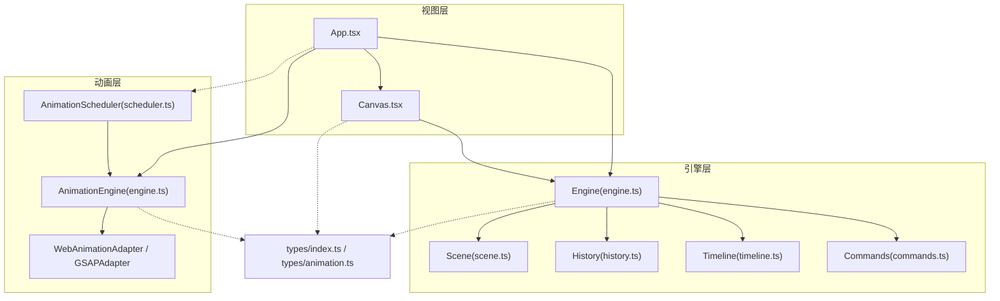
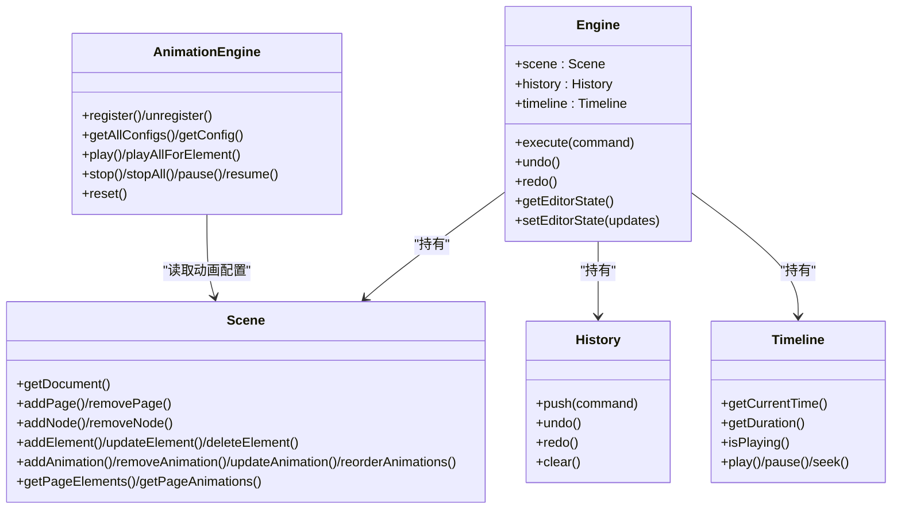
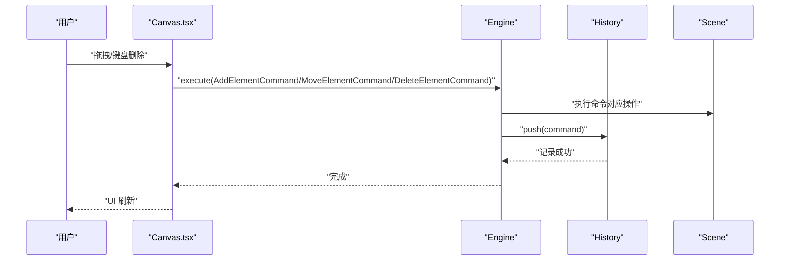
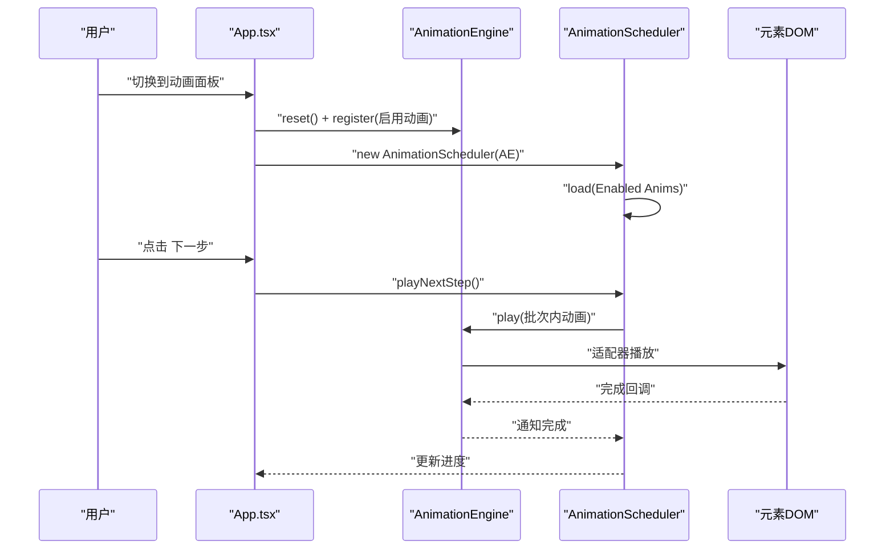
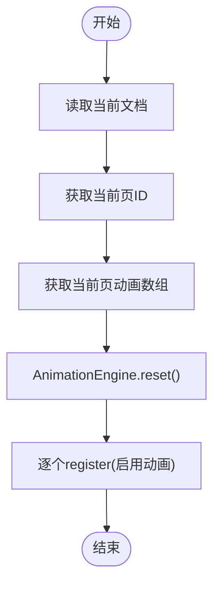
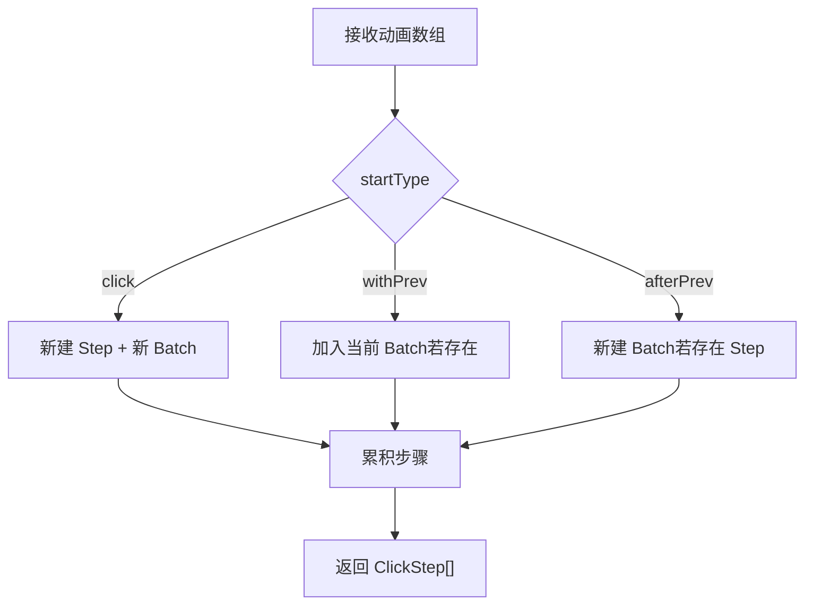
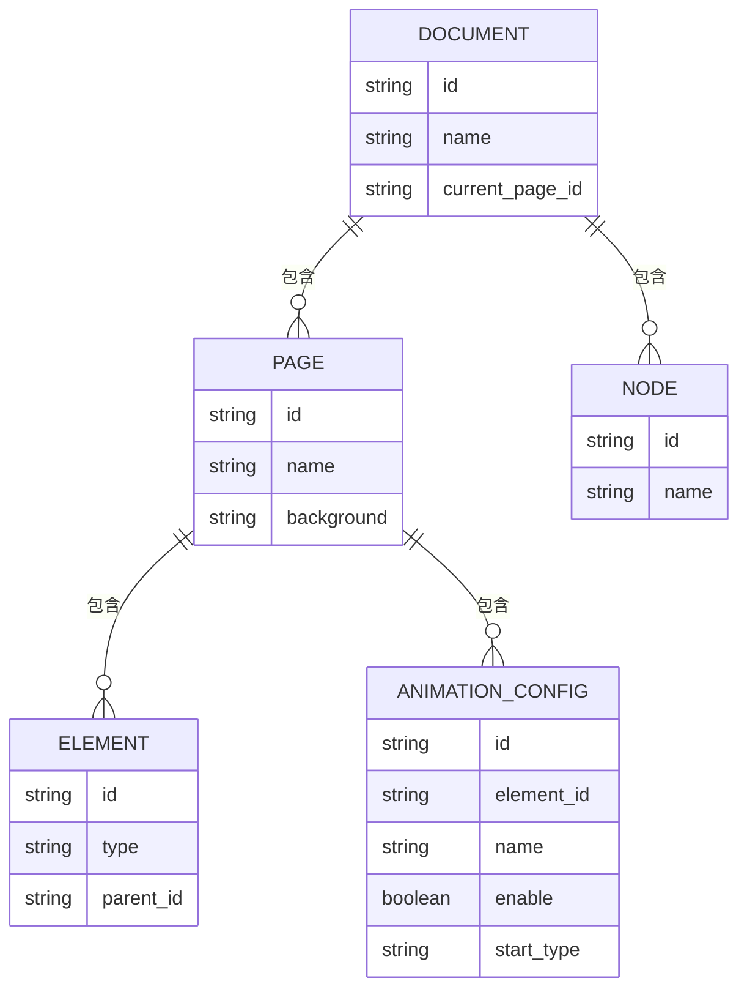
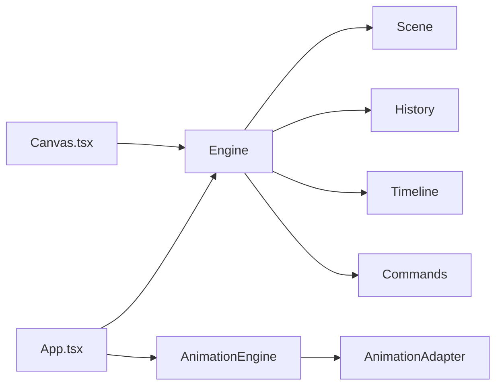

# 数据流

<cite>
**本文引用的文件**
- [src/engine/index.ts](file://src/engine/index.ts)
- [src/engine/engine.ts](file://src/engine/engine.ts)
- [src/engine/scene.ts](file://src/engine/scene.ts)
- [src/engine/history.ts](file://src/engine/history.ts)
- [src/engine/commands.ts](file://src/engine/commands.ts)
- [src/engine/timeline.ts](file://src/engine/timeline.ts)
- [src/types/index.ts](file://src/types/index.ts)
- [src/types/animation.ts](file://src/types/animation.ts)
- [src/App.tsx](file://src/App.tsx)
- [src/main.tsx](file://src/main.tsx)
- [src/components/Canvas.tsx](file://src/components/Canvas.tsx)
- [src/animation/engine.ts](file://src/animation/engine.ts)
- [src/animation/scheduler.ts](file://src/animation/scheduler.ts)
- [src/animation/index.ts](file://src/animation/index.ts)
</cite>

## 目录
1. [简介](#简介)
2. [项目结构](#项目结构)
3. [核心组件](#核心组件)
4. [架构总览](#架构总览)
5. [详细组件分析](#详细组件分析)
6. [依赖关系分析](#依赖关系分析)
7. [性能考量](#性能考量)
8. [故障排查指南](#故障排查指南)
9. [结论](#结论)
10. [附录](#附录)

## 简介
本技术文档围绕 AI 课件编辑器的数据流系统，系统性阐述从用户交互到 UI 更新的完整数据流路径：命令执行、状态变更与视图渲染；解释 Scene 场景管理如何维护文档状态，Engine 引擎如何协调各子系统，以及 AnimationEngine 如何同步动画状态；并提供元素编辑、动画配置与历史记录的具体处理示例，说明数据一致性保证机制、状态同步策略与性能优化方案，同时覆盖数据验证、错误处理与回滚机制。

## 项目结构
编辑器采用“引擎 + 视图”的分层设计：
- 引擎层（engine）：无框架绑定，负责文档状态（Scene）、命令执行（History）、时间轴（Timeline）与命令集（Commands）。
- 动画层（animation）：独立于引擎，通过适配器（WebAnimationAdapter/GSAPAdapter）驱动播放生命周期。
- 类型层（types）：统一定义元素、页面、动画配置等类型。
- 视图层（React 组件）：Canvas、属性面板、动画面板等，负责事件捕获、状态刷新与调度动画。

图表来源
- [src/App.tsx:11-344](file://src/App.tsx#L11-L344)
- [src/components/Canvas.tsx:22-191](file://src/components/Canvas.tsx#L22-L191)
- [src/engine/engine.ts:7-54](file://src/engine/engine.ts#L7-L54)
- [src/engine/scene.ts:3-273](file://src/engine/scene.ts#L3-L273)
- [src/engine/history.ts:3-45](file://src/engine/history.ts#L3-L45)
- [src/engine/timeline.ts:1-66](file://src/engine/timeline.ts#L1-L66)
- [src/engine/commands.ts:4-280](file://src/engine/commands.ts#L4-L280)
- [src/animation/engine.ts:9-120](file://src/animation/engine.ts#L9-L120)
- [src/animation/scheduler.ts:56-160](file://src/animation/scheduler.ts#L56-L160)
- [src/types/index.ts:1-159](file://src/types/index.ts#L1-L159)
- [src/types/animation.ts:1-113](file://src/types/animation.ts#L1-L113)

章节来源
- [src/App.tsx:11-344](file://src/App.tsx#L11-L344)
- [src/components/Canvas.tsx:22-191](file://src/components/Canvas.tsx#L22-L191)
- [src/engine/index.ts:1-16](file://src/engine/index.ts#L1-L16)

## 核心组件
- Engine：集中式执行入口，封装 Scene、History、Timeline，提供 execute/undo/redo 能力。
- Scene：文档状态容器，提供页面、节点、元素与动画的增删改查与层级关系维护。
- History：命令栈，支持撤销/重做与清空。
- Commands：面向具体业务的命令对象，封装可逆操作。
- AnimationEngine：动画生命周期控制器，注册/播放/停止/暂停/重置，委托适配器执行。
- AnimationScheduler：基于“点击步骤 + 并发批次”的编排器，实现分步播放与并发控制。
- 类型系统：统一元素、页面、动画配置与调度模型的类型定义。

章节来源
- [src/engine/engine.ts:7-54](file://src/engine/engine.ts#L7-L54)
- [src/engine/scene.ts:3-273](file://src/engine/scene.ts#L3-L273)
- [src/engine/history.ts:3-45](file://src/engine/history.ts#L3-L45)
- [src/engine/commands.ts:4-280](file://src/engine/commands.ts#L4-L280)
- [src/animation/engine.ts:9-120](file://src/animation/engine.ts#L9-L120)
- [src/animation/scheduler.ts:56-160](file://src/animation/scheduler.ts#L56-L160)
- [src/types/index.ts:107-159](file://src/types/index.ts#L107-L159)
- [src/types/animation.ts:26-113](file://src/types/animation.ts#L26-L113)

## 架构总览
编辑器遵循“命令驱动 + 状态隔离”的架构原则：
- 所有状态变更必须通过 Engine.execute(command) 进入历史栈，确保可回溯。
- EditorState（视口、工具模式、选中集合等）与 Scene 文档状态分离，避免耦合。
- 动画系统独立于引擎，通过 AnimationEngine 与适配器解耦，支持多播放后端。

图表来源
- [src/engine/engine.ts:7-54](file://src/engine/engine.ts#L7-L54)
- [src/engine/scene.ts:3-273](file://src/engine/scene.ts#L3-L273)
- [src/engine/history.ts:3-45](file://src/engine/history.ts#L3-L45)
- [src/engine/timeline.ts:1-66](file://src/engine/timeline.ts#L1-L66)
- [src/animation/engine.ts:9-120](file://src/animation/engine.ts#L9-L120)

## 详细组件分析

### 命令执行与历史回滚（元素编辑）
- 用户在画布拖拽或键盘删除触发命令，Engine.execute(command) 将命令入栈并执行。
- 撤销/重做时，History 弹出命令并调用其 undo()/execute()，实现精确回退。
- 元素编辑命令（如 MoveElementCommand）在执行前保存“之前值”，undo 时恢复。

图表来源
- [src/components/Canvas.tsx:44-77](file://src/components/Canvas.tsx#L44-L77)
- [src/engine/engine.ts:29-32](file://src/engine/engine.ts#L29-L32)
- [src/engine/commands.ts:4-68](file://src/engine/commands.ts#L4-L68)
- [src/engine/scene.ts:94-159](file://src/engine/scene.ts#L94-L159)

章节来源
- [src/engine/engine.ts:29-48](file://src/engine/engine.ts#L29-L48)
- [src/engine/history.ts:7-30](file://src/engine/history.ts#L7-L30)
- [src/engine/commands.ts:20-68](file://src/engine/commands.ts#L20-L68)
- [src/components/Canvas.tsx:44-77](file://src/components/Canvas.tsx#L44-L77)

### 动画配置与分步播放（AnimationEngine + Scheduler）
- App 在右侧面板切换到“动画”时，根据当前页动画列表构建 AnimationEngine 配置并创建 AnimationScheduler。
- Scheduler 将动画按“点击步骤（Step）+ 并发批次（Batch）”组织，Step 内部批次顺序执行，批次内动画并发播放。
- 用户点击“下一步/上一步”推进或回退步骤，Scheduler 负责取消未完成控制器并重放当前步骤。

图表来源
- [src/App.tsx:28-74](file://src/App.tsx#L28-L74)
- [src/animation/engine.ts:32-118](file://src/animation/engine.ts#L32-L118)
- [src/animation/scheduler.ts:56-160](file://src/animation/scheduler.ts#L56-L160)

章节来源
- [src/App.tsx:28-74](file://src/App.tsx#L28-L74)
- [src/animation/engine.ts:32-118](file://src/animation/engine.ts#L32-L118)
- [src/animation/scheduler.ts:56-160](file://src/animation/scheduler.ts#L56-L160)

### 数据一致性与状态同步
- Scene 的元素更新会自动维护父子关系与组内子项列表，避免悬挂引用。
- EditorState 与 Scene 分离，通过版本号驱动 React 刷新，避免跨层状态污染。
- App 使用 useEffect 同步 Scene 动画到 AnimationEngine，确保编辑态与播放态一致。

图表来源
- [src/App.tsx:28-36](file://src/App.tsx#L28-L36)
- [src/animation/engine.ts:115-118](file://src/animation/engine.ts#L115-L118)
- [src/engine/scene.ts:212-233](file://src/engine/scene.ts#L212-L233)

章节来源
- [src/engine/scene.ts:108-135](file://src/engine/scene.ts#L108-L135)
- [src/App.tsx:28-36](file://src/App.tsx#L28-L36)

### 复杂逻辑：动画分步编排（Scheduler）
- buildClickSteps 将动画序列转换为 ClickStep 列表，依据 startType 决定是否开启新 Step 或新 Batch。
- executeBatch 并发启动批次内动画，监听完成回调以推进下一个批次；若无未完成任务则直接进入下一阶段。

图表来源
- [src/animation/scheduler.ts:13-49](file://src/animation/scheduler.ts#L13-L49)

章节来源
- [src/animation/scheduler.ts:56-160](file://src/animation/scheduler.ts#L56-L160)

### 类型与数据模型
- 元素类型（形状/文本/图片/组）与页面结构（pages、nodes、structureItems、currentPageId）由 Document 统一承载。
- 动画配置（AnimationConfig）与调度模型（ClickStep、AnimationBatch）独立于引擎的 Timeline 动画类型。

图表来源
- [src/types/index.ts:77-84](file://src/types/index.ts#L77-L84)
- [src/types/index.ts:69-75](file://src/types/index.ts#L69-L75)
- [src/types/index.ts:64-67](file://src/types/index.ts#L64-L67)
- [src/types/animation.ts:26-39](file://src/types/animation.ts#L26-L39)

章节来源
- [src/types/index.ts:10-159](file://src/types/index.ts#L10-L159)
- [src/types/animation.ts:26-113](file://src/types/animation.ts#L26-L113)

## 依赖关系分析
- App.tsx 依赖 Engine 与 AnimationEngine，负责状态刷新与动画调度。
- Canvas.tsx 仅通过 Engine 与命令进行交互，不直接访问 AnimationEngine，保持职责单一。
- Engine 依赖 Scene、History、Timeline 与 Commands，形成稳定的内聚模块。
- AnimationEngine 依赖适配器接口，通过类型系统与 buildKeyframes 解耦具体播放库。

图表来源
- [src/App.tsx:11-344](file://src/App.tsx#L11-L344)
- [src/components/Canvas.tsx:22-191](file://src/components/Canvas.tsx#L22-L191)
- [src/engine/engine.ts:7-54](file://src/engine/engine.ts#L7-L54)
- [src/animation/engine.ts:9-120](file://src/animation/engine.ts#L9-L120)

章节来源
- [src/App.tsx:11-344](file://src/App.tsx#L11-L344)
- [src/components/Canvas.tsx:22-191](file://src/components/Canvas.tsx#L22-L191)
- [src/engine/engine.ts:7-54](file://src/engine/engine.ts#L7-L54)
- [src/animation/engine.ts:9-120](file://src/animation/engine.ts#L9-L120)

## 性能考量
- 命令执行与历史栈：命令对象轻量，仅保存必要上下文，避免深拷贝开销。
- 动画播放：AnimationEngine 仅在需要时查询 DOM，且通过 setScopeRoot 限定查询范围，降低选择器成本。
- 分步播放：Scheduler 的并发与串行控制减少不必要的等待，提升交互流畅度。
- UI 刷新：通过版本号驱动最小化重渲染，避免全量 diff。

## 故障排查指南
- 撤销/重做无效
  - 检查 History 栈是否为空，确认 Engine.canUndo()/canRedo() 返回值。
  - 确认命令实现了正确的 undo() 行为。
- 删除元素无效
  - 确认 EditorState.selectedElementIds 是否正确设置，键盘事件处理是否拦截。
  - 检查 Scene.deleteElement 是否被调用且元素存在于当前页。
- 动画不播放
  - 确认 AnimationEngine.register 的动画处于启用状态，元素 ID 与 DOM 属性匹配。
  - 检查 setScopeRoot 是否指向正确的容器，适配器是否可用。
- 步骤播放异常
  - 检查 buildClickSteps 的 startType 是否符合预期，Scheduler 的步骤索引与控制器清理是否正确。

章节来源
- [src/engine/history.ts:12-30](file://src/engine/history.ts#L12-L30)
- [src/engine/commands.ts:46-68](file://src/engine/commands.ts#L46-L68)
- [src/App.tsx:108-150](file://src/App.tsx#L108-L150)
- [src/engine/scene.ts:137-159](file://src/engine/scene.ts#L137-L159)
- [src/animation/engine.ts:24-30](file://src/animation/engine.ts#L24-L30)
- [src/animation/scheduler.ts:115-133](file://src/animation/scheduler.ts#L115-L133)

## 结论
该数据流系统以命令为中心，结合 Scene 文档状态与 History 历史栈，确保所有变更可追踪、可回滚；通过 AnimationEngine 与 Scheduler 实现动画的分步与并发控制，配合类型系统与适配器解耦，达成高内聚、低耦合的架构目标。通过版本号驱动的 UI 刷新与作用域限定的 DOM 查询，兼顾了可维护性与性能表现。

## 附录
- 关键流程参考路径
  - 命令执行与撤销：[src/engine/engine.ts#L29-L48:29-48](file://src/engine/engine.ts#L29-L48)，[src/engine/history.ts#L12-L30:12-30](file://src/engine/history.ts#L12-L30)
  - 元素编辑命令：[src/engine/commands.ts#L4-L68:4-68](file://src/engine/commands.ts#L4-L68)
  - 动画注册与播放：[src/animation/engine.ts#L32-L118:32-118](file://src/animation/engine.ts#L32-L118)
  - 分步播放编排：[src/animation/scheduler.ts#L56-L160:56-160](file://src/animation/scheduler.ts#L56-L160)
  - 类型定义：[src/types/index.ts#L107-159:107-159](file://src/types/index.ts#L107-L159)，[src/types/animation.ts#L26-113:26-113](file://src/types/animation.ts#L26-L113)