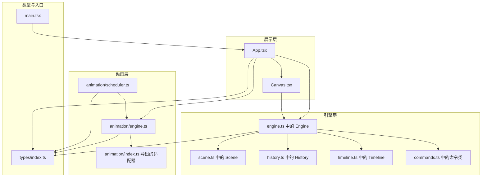
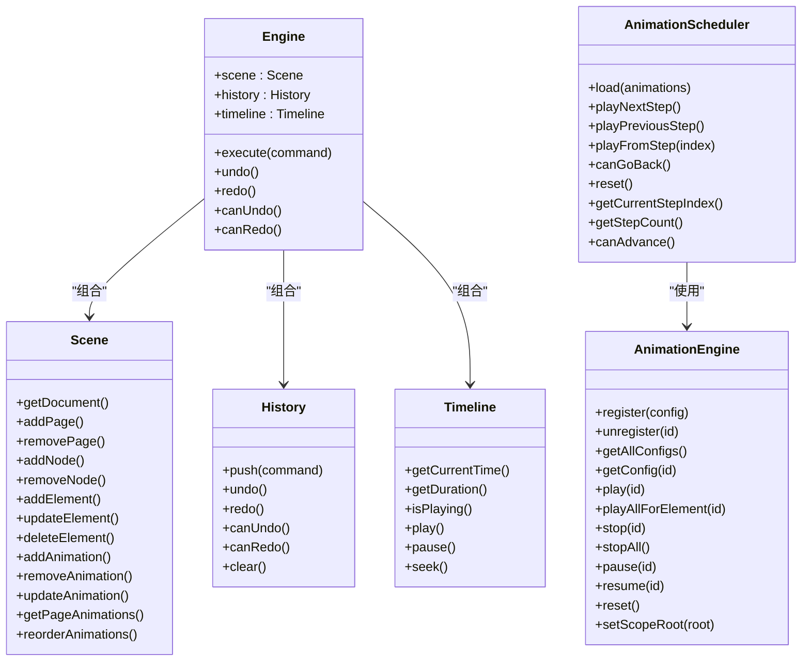
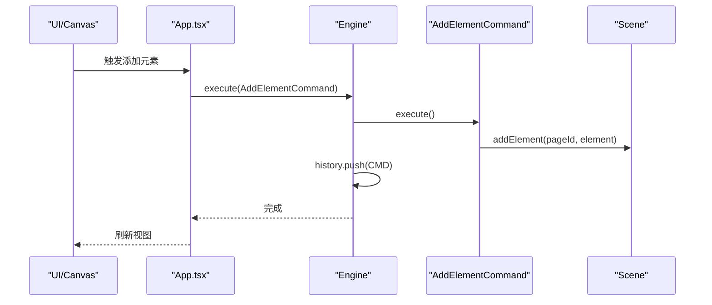
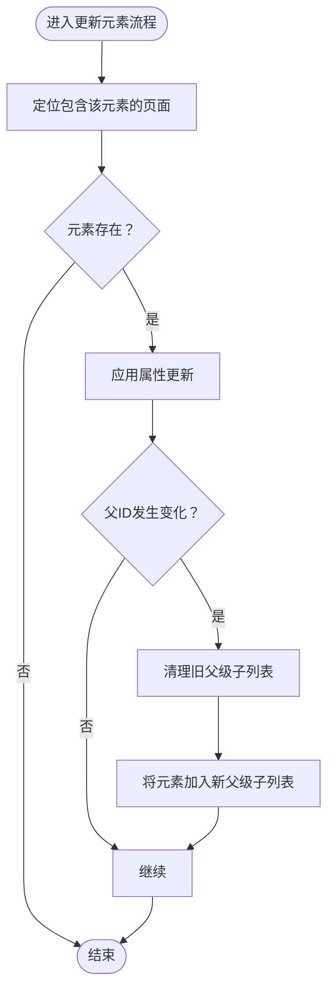
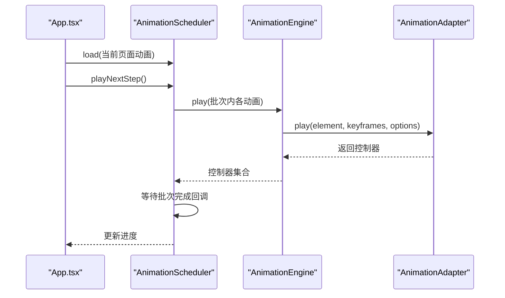
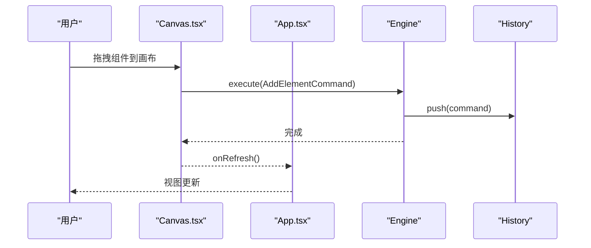
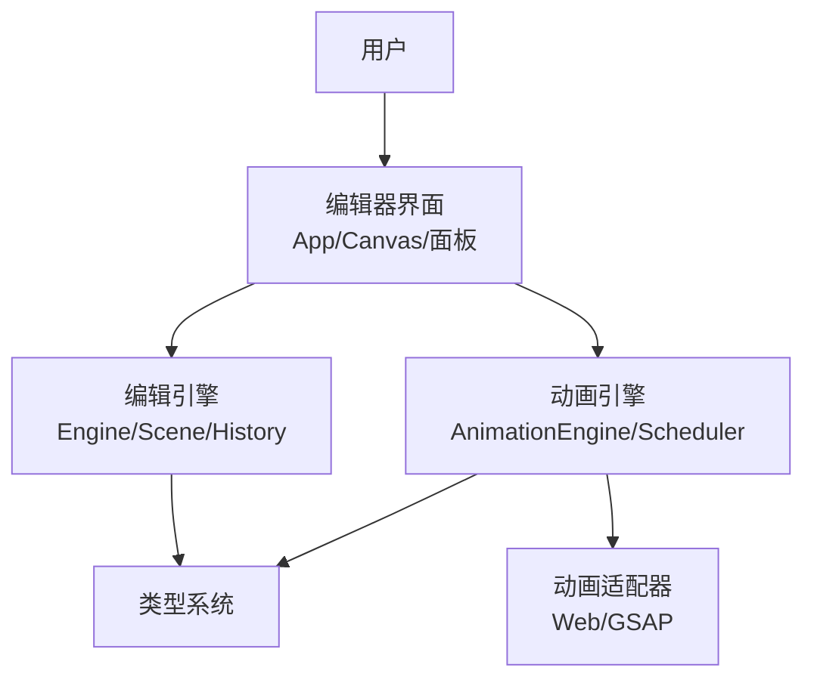
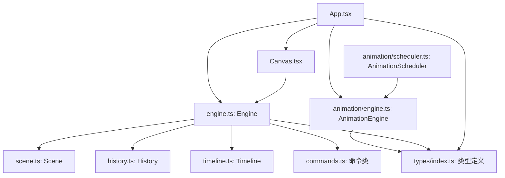

# 核心架构

<cite>
**本文引用的文件**
- [src/engine/index.ts](file://src/engine/index.ts)
- [src/engine/engine.ts](file://src/engine/engine.ts)
- [src/engine/commands.ts](file://src/engine/commands.ts)
- [src/engine/history.ts](file://src/engine/history.ts)
- [src/engine/scene.ts](file://src/engine/scene.ts)
- [src/engine/timeline.ts](file://src/engine/timeline.ts)
- [src/types/index.ts](file://src/types/index.ts)
- [src/App.tsx](file://src/App.tsx)
- [src/components/Canvas.tsx](file://src/components/Canvas.tsx)
- [src/animation/index.ts](file://src/animation/index.ts)
- [src/animation/engine.ts](file://src/animation/engine.ts)
- [src/animation/scheduler.ts](file://src/animation/scheduler.ts)
- [src/main.tsx](file://src/main.tsx)
- [package.json](file://package.json)
- [README.md](file://README.md)
</cite>

## 目录
1. [引言](#引言)
2. [项目结构](#项目结构)
3. [核心组件](#核心组件)
4. [架构总览](#架构总览)
5. [详细组件分析](#详细组件分析)
6. [依赖分析](#依赖分析)
7. [性能考量](#性能考量)
8. [故障排查指南](#故障排查指南)
9. [结论](#结论)
10. [附录](#附录)

## 引言
本技术文档面向“AI课件编辑器”的核心架构，系统性阐述高层设计、架构模式与组件边界；重点解释命令模式在状态变更中的应用、分层架构的设计理念与模块化组织原则；并覆盖组件交互关系、数据流向、集成模式、技术决策与权衡、安全与监控、灾难恢复等横切关注点。文档同时给出系统上下文图与组件分解图，并记录技术栈、第三方依赖与版本兼容性。

## 项目结构
项目采用前端单页应用（React + Vite）与引擎内核解耦的分层组织方式：
- 展示层：React 组件（Canvas、PropertyPanel、AnimationPanel 等），负责 UI 交互与状态刷新。
- 引擎层：独立的编辑引擎（Engine/Scene/History/Timeline），封装所有状态变更与历史管理。
- 动画层：AnimationEngine + Scheduler + Adapter 抽象，支持 Web Animations 与 GSAP 两种适配器。
- 类型层：统一的类型定义（元素、页面、动画、命令、编辑器状态等）。
- 入口层：Vite 构建与 React 渲染入口。

图表来源
- [src/App.tsx:11-344](file://src/App.tsx#L11-L344)
- [src/engine/engine.ts:7-54](file://src/engine/engine.ts#L7-L54)
- [src/engine/scene.ts:3-273](file://src/engine/scene.ts#L3-L273)
- [src/engine/history.ts:3-45](file://src/engine/history.ts#L3-L45)
- [src/engine/timeline.ts:1-66](file://src/engine/timeline.ts#L1-L66)
- [src/engine/commands.ts:4-280](file://src/engine/commands.ts#L4-L280)
- [src/animation/engine.ts:9-120](file://src/animation/engine.ts#L9-L120)
- [src/animation/scheduler.ts:56-160](file://src/animation/scheduler.ts#L56-L160)
- [src/animation/index.ts:1-8](file://src/animation/index.ts#L1-L8)
- [src/types/index.ts:1-159](file://src/types/index.ts#L1-L159)
- [src/main.tsx:1-10](file://src/main.tsx#L1-L10)

章节来源
- [src/App.tsx:11-344](file://src/App.tsx#L11-L344)
- [src/engine/index.ts:1-16](file://src/engine/index.ts#L1-L16)
- [src/types/index.ts:1-159](file://src/types/index.ts#L1-L159)
- [src/main.tsx:1-10](file://src/main.tsx#L1-L10)

## 核心组件
- 引擎核心（Engine）：集中式状态变更入口，封装 Scene、History、Timeline，提供 execute/undo/redo 能力。
- 场景模型（Scene）：承载 Document（页面、节点、元素、动画）与 CRUD 操作，维护当前页面与结构顺序。
- 命令体系（Commands）：围绕 Scene 的具体操作封装为可撤销/重做的命令对象。
- 历史栈（History）：双栈实现的撤销/重做机制。
- 时间轴（Timeline）：轻量时间推进器，用于演示播放节奏控制。
- 动画引擎（AnimationEngine）：注册/查询动画配置，构建关键帧，委托适配器执行。
- 动画调度器（AnimationScheduler）：按“Step/Batch”模型编排动画序列，Step 由用户点击触发，Batch 内并行。
- 类型系统（Types）：统一的元素、页面、动画、命令、编辑器状态等类型定义。
- 展示层（App/Canvas）：React 组件驱动 UI，协调引擎与动画层，处理键盘快捷键与预览模式。

章节来源
- [src/engine/engine.ts:7-54](file://src/engine/engine.ts#L7-L54)
- [src/engine/scene.ts:3-273](file://src/engine/scene.ts#L3-L273)
- [src/engine/commands.ts:4-280](file://src/engine/commands.ts#L4-L280)
- [src/engine/history.ts:3-45](file://src/engine/history.ts#L3-L45)
- [src/engine/timeline.ts:1-66](file://src/engine/timeline.ts#L1-L66)
- [src/animation/engine.ts:9-120](file://src/animation/engine.ts#L9-L120)
- [src/animation/scheduler.ts:56-160](file://src/animation/scheduler.ts#L56-L160)
- [src/types/index.ts:1-159](file://src/types/index.ts#L1-L159)
- [src/App.tsx:11-344](file://src/App.tsx#L11-L344)
- [src/components/Canvas.tsx:22-191](file://src/components/Canvas.tsx#L22-L191)

## 架构总览
系统采用“命令模式 + 分层架构 + 模块化组织”的设计：
- 命令模式：所有状态变更必须通过命令对象执行，保证可撤销/重做与一致性。
- 分层架构：展示层（UI）、引擎层（业务内核）、动画层（渲染与播放抽象）清晰分离。
- 模块化组织：类型定义集中，导出入口统一，便于跨模块复用与测试。

图表来源
- [src/engine/engine.ts:7-54](file://src/engine/engine.ts#L7-L54)
- [src/engine/scene.ts:3-273](file://src/engine/scene.ts#L3-L273)
- [src/engine/history.ts:3-45](file://src/engine/history.ts#L3-L45)
- [src/engine/timeline.ts:1-66](file://src/engine/timeline.ts#L1-L66)
- [src/animation/engine.ts:9-120](file://src/animation/engine.ts#L9-L120)
- [src/animation/scheduler.ts:56-160](file://src/animation/scheduler.ts#L56-L160)

## 详细组件分析

### 引擎与命令模式
- 设计要点
  - 所有状态变更必须经由 Engine.execute(command)，确保历史记录与一致性。
  - 命令对象封装“执行/撤销”逻辑，避免直接修改场景状态。
  - 支持元素、动画、页面、节点与结构的增删改与排序命令。
- 关键流程（撤销/重做）
  - 执行：command.execute() 后压入历史栈。
  - 撤销：弹出命令并调用其 undo()，同时将命令压入重做栈。
  - 重做：从重做栈弹出命令并重新执行。

图表来源
- [src/App.tsx:64-150](file://src/App.tsx#L64-L150)
- [src/engine/engine.ts:29-32](file://src/engine/engine.ts#L29-L32)
- [src/engine/commands.ts:11-17](file://src/engine/commands.ts#L11-L17)
- [src/engine/scene.ts:94-106](file://src/engine/scene.ts#L94-L106)

章节来源
- [src/engine/engine.ts:29-48](file://src/engine/engine.ts#L29-L48)
- [src/engine/commands.ts:4-280](file://src/engine/commands.ts#L4-L280)
- [src/engine/history.ts:7-30](file://src/engine/history.ts#L7-L30)

### 场景模型与数据结构
- 数据模型
  - Document：包含 pages、nodes、structureItems、currentPageId。
  - Page：包含 elements、animations。
  - Element：支持 shape/text/image/group 及层级父子关系。
  - AnimationConfig：支持 keyframes、起始类型（click/withPrev/afterPrev）、缓动等。
- 关键能力
  - 页面与节点的增删改与结构重排。
  - 当前页面元素与动画的增删改与排序。
  - 元素移动时自动维护父子关系与子列表同步。

图表来源
- [src/engine/scene.ts:108-135](file://src/engine/scene.ts#L108-L135)

章节来源
- [src/engine/scene.ts:3-273](file://src/engine/scene.ts#L3-L273)
- [src/types/index.ts:60-159](file://src/types/index.ts#L60-L159)

### 动画引擎与调度器
- 动画引擎（AnimationEngine）
  - 注册/注销动画配置，构建关键帧，委托适配器执行。
  - 提供按元素批量播放、停止、暂停、恢复与全局重置。
- 调度器（AnimationScheduler）
  - 将动画数组转换为 ClickStep 列表，Step 由用户点击触发。
  - Step 内部按 Batch 顺序执行，Batch 内动画并行。
  - 支持前进到下一 Step、回退到上一 Step、从指定 Step 开始播放。
- 适配器
  - WebAnimationAdapter：基于 Web Animations API。
  - GSAPAdapter：基于 GSAP，通过适配器接口屏蔽差异。

图表来源
- [src/App.tsx:28-74](file://src/App.tsx#L28-L74)
- [src/animation/scheduler.ts:72-108](file://src/animation/scheduler.ts#L72-L108)
- [src/animation/engine.ts:53-70](file://src/animation/engine.ts#L53-L70)
- [src/animation/index.ts:1-8](file://src/animation/index.ts#L1-L8)

章节来源
- [src/animation/engine.ts:9-120](file://src/animation/engine.ts#L9-L120)
- [src/animation/scheduler.ts:56-160](file://src/animation/scheduler.ts#L56-L160)
- [src/animation/index.ts:1-8](file://src/animation/index.ts#L1-L8)
- [README.md:4-15](file://README.md#L4-L15)

### 展示层与交互
- App.tsx
  - 初始化 Engine 与 AnimationEngine，维护右侧面板标签、预览开关、步进进度。
  - 键盘快捷键：Ctrl/Cmd+Z 撤销、Ctrl/Cmd+Shift+Z 或 Ctrl/Cmd+Y 重做；Delete/Backspace 删除选中元素。
  - 自动同步当前页面动画到动画引擎，根据面板切换动态创建/销毁调度器。
- Canvas.tsx
  - 拖拽新增元素、点击选择、画布空白处取消选择。
  - 将动画作用域限定在当前画布容器，确保编辑态与预览态一致。

图表来源
- [src/components/Canvas.tsx:44-69](file://src/components/Canvas.tsx#L44-L69)
- [src/App.tsx:108-150](file://src/App.tsx#L108-L150)
- [src/engine/engine.ts:29-32](file://src/engine/engine.ts#L29-L32)
- [src/engine/history.ts:7-10](file://src/engine/history.ts#L7-L10)

章节来源
- [src/App.tsx:11-344](file://src/App.tsx#L11-L344)
- [src/components/Canvas.tsx:22-191](file://src/components/Canvas.tsx#L22-L191)

## 依赖分析
- 技术栈
  - 前端框架：React 18、React DOM
  - 构建工具：Vite
  - 类型系统：TypeScript
  - 拖拽与可移动：@dnd-kit/*、react-moveable
  - 动画：gsap
- 第三方依赖与版本兼容性
  - React 与 React-DOM：保持主版本一致以避免运行时警告。
  - @dnd-kit 与 react-moveable：用于拖拽与可调整布局，注意与 React 版本兼容。
  - gsap：动画库，需与适配器接口匹配。
  - Vite 与 TypeScript：遵循官方推荐版本范围，确保类型与构建稳定性。

章节来源
- [package.json:12-32](file://package.json#L12-L32)

## 性能考量
- 命令执行与历史管理
  - 历史栈为线性存储，撤销/重做复杂度 O(1)，适合频繁操作的编辑器。
- 动画执行模型
  - Step/Batch 模型降低一次性渲染压力，Batch 内并行提升体验。
  - 使用 requestAnimationFrame 推进时间轴，减少主线程阻塞。
- DOM 查询与作用域
  - 通过 setScopeRoot 将动画目标限定在画布容器，避免全局查询开销。
- UI 刷新策略
  - 使用版本号驱动局部刷新，避免不必要的重渲染。

[本节为通用性能建议，不直接分析具体代码文件]

## 故障排查指南
- 撤销/重做无效
  - 检查是否通过 Engine.execute 提交命令；确认 History 栈状态。
- 动画未播放或播放异常
  - 确认元素是否存在且具有 data-element-id；检查 AnimationEngine.setScopeRoot 是否正确设置。
  - 检查动画配置的 elementId 与起始类型（startType）是否合理。
- 快捷键无响应
  - 确认焦点不在输入框；检查事件监听绑定与 preventDefault 使用。
- 预览模式异常
  - 确保 PreviewModal 正确传递 engine 与 animationEngine 实例；检查调度器生命周期管理。

章节来源
- [src/engine/history.ts:12-30](file://src/engine/history.ts#L12-L30)
- [src/animation/engine.ts:20-30](file://src/animation/engine.ts#L20-L30)
- [src/App.tsx:108-150](file://src/App.tsx#L108-L150)
- [src/components/Canvas.tsx:27-32](file://src/components/Canvas.tsx#L27-L32)

## 结论
本架构以命令模式为核心，结合分层与模块化设计，实现了编辑器的状态一致性、可扩展性与可维护性。通过动画调度器的 Step/Batch 模型，有效平衡了交互体验与执行效率。类型系统与统一导出进一步提升了代码复用与测试友好性。后续可在监控埋点、错误边界与持久化方面持续增强。

[本节为总结性内容，不直接分析具体代码文件]

## 附录
- 系统上下文图（概念性）

- 组件分解图（映射实际源码）

图表来源
- [src/App.tsx:11-344](file://src/App.tsx#L11-L344)
- [src/components/Canvas.tsx:22-191](file://src/components/Canvas.tsx#L22-L191)
- [src/engine/engine.ts:7-54](file://src/engine/engine.ts#L7-L54)
- [src/engine/scene.ts:3-273](file://src/engine/scene.ts#L3-L273)
- [src/engine/history.ts:3-45](file://src/engine/history.ts#L3-L45)
- [src/engine/timeline.ts:1-66](file://src/engine/timeline.ts#L1-L66)
- [src/engine/commands.ts:4-280](file://src/engine/commands.ts#L4-L280)
- [src/animation/engine.ts:9-120](file://src/animation/engine.ts#L9-L120)
- [src/animation/scheduler.ts:56-160](file://src/animation/scheduler.ts#L56-L160)
- [src/types/index.ts:1-159](file://src/types/index.ts#L1-L159)