# 核心架构

<cite>
**本文引用的文件**
- [src/engine/index.ts](file://src/engine/index.ts)
- [src/engine/engine.ts](file://src/engine/engine.ts)
- [src/engine/commands.ts](file://src/engine/commands.ts)
- [src/engine/history.ts](file://src/engine/history.ts)
- [src/engine/scene.ts](file://src/engine/scene.ts)
- [src/engine/timeline.ts](file://src/engine/timeline.ts)
- [src/engine/snapEngine.ts](file://src/engine/snapEngine.ts)
- [src/hooks/useEngineSnapshot.ts](file://src/hooks/useEngineSnapshot.ts)
- [src/store/index.ts](file://src/store/index.ts)
- [src/store/StoreProvider.tsx](file://src/store/StoreProvider.tsx)
- [src/store/baseStore.ts](file://src/store/baseStore.ts)
- [src/store/hooks.ts](file://src/store/hooks.ts)
- [src/store/sceneStore.ts](file://src/store/sceneStore.ts)
- [src/store/selectionStore.ts](file://src/store/selectionStore.ts)
- [src/store/editorUIStore.ts](file://src/store/editorUIStore.ts)
- [src/store/historyStore.ts](file://src/store/historyStore.ts)
- [src/store/animationStore.ts](file://src/store/animationStore.ts)
- [src/store/pluginStore.ts](file://src/store/pluginStore.ts)
- [src/store/readme.md](file://src/store/readme.md)
- [src/types/index.ts](file://src/types/index.ts)
- [src/types/animation.ts](file://src/types/animation.ts)
- [src/App.tsx](file://src/App.tsx)
- [src/components/Canvas.tsx](file://src/components/Canvas.tsx)
- [src/animation/index.ts](file://src/animation/index.ts)
- [src/animation/engine.ts](file://src/animation/engine.ts)
- [src/animation/scheduler.ts](file://src/animation/scheduler.ts)
- [src/animation/adapter.ts](file://src/animation/adapter.ts)
- [src/animation/buildKeyframes.ts](file://src/animation/buildKeyframes.ts)
- [src/renderer/index.tsx](file://src/renderer/index.tsx)
- [src/main.tsx](file://src/main.tsx)
- [package.json](file://package.json)
- [README.md](file://README.md)
</cite>

## 更新摘要
**所做更改**
- 新增精确订阅架构章节，详细说明从全局订阅模型迁移到基于Store的精细订阅系统
- 更新核心组件部分，增加StoreProvider、多个专用Store实例和useSyncExternalStore优化
- 新增StoreProvider组件分析，解释上下文提供者模式
- 更新发布-订阅状态管理系统，从全局订阅转向精确订阅
- 新增基于React Hooks的Store订阅机制分析
- 更新架构总览图，反映新的Store架构模式
- 新增Store层组件交互关系图

## 目录
1. [引言](#引言)
2. [项目结构](#项目结构)
3. [核心组件](#核心组件)
4. [架构总览](#架构总览)
5. [详细组件分析](#详细组件分析)
6. [依赖分析](#依赖分析)
7. [性能考量](#性能考量)
8. [故障排查指南](#故障排查指南)
9. [结论](#结论)
10. [附录](#附录)

## 引言
本技术文档面向"AI课件编辑器"的核心架构，系统性阐述高层设计、架构模式与组件边界；重点解释命令模式在状态变更中的应用、分层架构的设计理念与模块化组织原则；并覆盖组件交互关系、数据流向、集成模式、技术决策与权衡、安全与监控、灾难恢复等横切关注点。文档同时给出系统上下文图与组件分解图，并记录技术栈、第三方依赖与版本兼容性。

**更新** 新增精确订阅架构，从全局订阅模型迁移到基于Store的精细订阅系统，包含StoreProvider、多个专用Store实例和useSyncExternalStore优化。这一架构变更显著提升了组件渲染性能和状态管理的精确性。

## 项目结构
项目采用前端单页应用（React + Vite）与引擎内核解耦的分层组织方式：
- 展示层：React 组件（Canvas、PropertyPanel、AnimationPanel 等），负责 UI 交互与状态刷新。
- 引擎层：独立的编辑引擎（Engine/Scene/History/Timeline），封装所有状态变更与历史管理。
- Store层：基于精确订阅的精细状态管理，包含多个专用Store实例和StoreProvider上下文。
- 动画层：AnimationEngine + Scheduler + Adapter 抽象，支持 Web Animations 与 GSAP 两种适配器。
- 类型层：统一的类型定义（元素、页面、动画、命令、编辑器状态等）。
- 入口层：Vite 构建与 React 渲染入口。

```mermaid
graph TB
subgraph "展示层"
APP["App.tsx"]
CANVAS["Canvas.tsx"]
end
subgraph "引擎层"
ENGINE["engine.ts 中的 Engine"]
SCENE["scene.ts 中的 Scene"]
HISTORY["history.ts 中的 History"]
TIMELINE["timeline.ts 中的 Timeline"]
CMDS["commands.ts 中的命令类"]
SNAP["snapEngine.ts 中的 SnapEngine"]
END
subgraph "Store层"
STORE_PROVIDER["StoreProvider.tsx"]
BASE_STORE["baseStore.ts"]
SCENE_STORE["sceneStore.ts"]
SELECTION_STORE["selectionStore.ts"]
EDITOR_UI_STORE["editorUIStore.ts"]
HISTORY_STORE["historyStore.ts"]
ANIMATION_STORE["animationStore.ts"]
PLUGIN_STORE["pluginStore.ts"]
HOOKS["hooks.ts"]
END
subgraph "动画层"
ANIM_ENGINE["animation/engine.ts"]
ANIM_SCHED["animation/scheduler.ts"]
ADAPTERS["animation/index.ts 导出的适配器"]
BUILD_KEYFRAMES["animation/buildKeyframes.ts"]
end
subgraph "类型与入口"
TYPES["types/index.ts"]
TYPES_ANIM["types/animation.ts"]
MAIN["main.tsx"]
end
subgraph "钩子层"
HOOKS_OLD["hooks/useEngineSnapshot.ts"]
END
APP --> STORE_PROVIDER
STORE_PROVIDER --> SCENE_STORE
STORE_PROVIDER --> SELECTION_STORE
STORE_PROVIDER --> EDITOR_UI_STORE
STORE_PROVIDER --> HISTORY_STORE
STORE_PROVIDER --> ANIMATION_STORE
STORE_PROVIDER --> PLUGIN_STORE
APP --> ENGINE
APP --> ANIM_ENGINE
APP --> CANVAS
CANVAS --> ENGINE
ENGINE --> SCENE
ENGINE --> HISTORY
ENGINE --> TIMELINE
ENGINE --> CMDS
ENGINE --> SNAP
ANIM_ENGINE --> ADAPTERS
ANIM_ENGINE --> BUILD_KEYFRAMES
ANIM_SCHED --> ANIM_ENGINE
HOOKS --> BASE_STORE
HOOKS --> SCENE_STORE
HOOKS --> SELECTION_STORE
HOOKS --> EDITOR_UI_STORE
HOOKS --> HISTORY_STORE
HOOKS --> ANIMATION_STORE
HOOKS --> PLUGIN_STORE
HOOKS_OLD --> ENGINE
RENDERER --> TYPES
RENDERER --> TYPES_ANIM
APP --> RENDERER
```

**图表来源**
- [src/App.tsx:1-335](file://src/App.tsx#L1-L335)
- [src/engine/engine.ts:1-79](file://src/engine/engine.ts#L1-L79)
- [src/engine/scene.ts:3-273](file://src/engine/scene.ts#L3-L273)
- [src/engine/history.ts:3-45](file://src/engine/history.ts#L3-L45)
- [src/engine/timeline.ts:1-66](file://src/engine/timeline.ts#L1-L66)
- [src/engine/snapEngine.ts:1-259](file://src/engine/snapEngine.ts#L1-L259)
- [src/store/StoreProvider.tsx:1-49](file://src/store/StoreProvider.tsx#L1-L49)
- [src/store/baseStore.ts:1-51](file://src/store/baseStore.ts#L1-L51)
- [src/store/sceneStore.ts:1-59](file://src/store/sceneStore.ts#L1-L59)
- [src/store/selectionStore.ts:1-69](file://src/store/selectionStore.ts#L1-L69)
- [src/store/editorUIStore.ts:1-53](file://src/store/editorUIStore.ts#L1-L53)
- [src/store/historyStore.ts:1-35](file://src/store/historyStore.ts#L1-L35)
- [src/store/animationStore.ts:1-60](file://src/store/animationStore.ts#L1-L60)
- [src/store/pluginStore.ts:1-100](file://src/store/pluginStore.ts#L1-L100)
- [src/store/hooks.ts:1-32](file://src/store/hooks.ts#L1-L32)
- [src/hooks/useEngineSnapshot.ts:1-23](file://src/hooks/useEngineSnapshot.ts#L1-L23)
- [src/renderer/index.tsx:1-314](file://src/renderer/index.tsx#L1-L314)
- [src/animation/engine.ts:1-120](file://src/animation/engine.ts#L1-L120)
- [src/animation/scheduler.ts:1-160](file://src/animation/scheduler.ts#L1-L160)
- [src/animation/buildKeyframes.ts:1-125](file://src/animation/buildKeyframes.ts#L1-L125)
- [src/types/index.ts:1-159](file://src/types/index.ts#L1-L159)
- [src/types/animation.ts:1-113](file://src/types/animation.ts#L1-L113)
- [src/main.tsx:1-10](file://src/main.tsx#L1-L10)

**章节来源**
- [src/App.tsx:1-335](file://src/App.tsx#L1-L335)
- [src/engine/index.ts:1-16](file://src/engine/index.ts#L1-L16)
- [src/types/index.ts:1-159](file://src/types/index.ts#L1-L159)
- [src/main.tsx:1-10](file://src/main.tsx#L1-L10)

## 核心组件
- 引擎核心（Engine）：集中式状态变更入口，封装 Scene、History、Timeline，提供 execute/undo/redo 能力，维持发布-订阅通知机制。
- 场景模型（Scene）：承载 Document（页面、节点、元素、动画）与 CRUD 操作，维护当前页面与结构顺序。
- 命令体系（Commands）：围绕 Scene 的具体操作封装为可撤销/重做的命令对象。
- 历史栈（History）：双栈实现的撤销/重做机制。
- 时间轴（Timeline）：轻量时间推进器，用于演示播放节奏控制。
- 动画引擎（AnimationEngine）：注册/查询动画配置，构建关键帧，委托适配器执行。
- 动画调度器（AnimationScheduler）：按"Step/Batch"模型编排动画序列，Step 由用户点击触发，Batch 内并行。
- SnapEngine（吸附引擎）：提供智能吸附对齐、间距分布和画布参考线计算。
- StoreProvider：上下文提供者，创建并管理多个专用Store实例，为组件树提供状态访问。
- 精确订阅Store系统：包含SceneStore、SelectionStore、EditorUIStore、HistoryStore、AnimationStore和PluginStore，每个Store监听特定的Engine主题。
- useSyncExternalStore：基于React 18的useSyncExternalStore Hook，提供高性能的外部状态订阅。
- 类型系统（Types）：统一的元素、页面、动画、命令、编辑器状态等类型定义。
- 展示层（App/Canvas）：React 组件驱动 UI，协调引擎与动画层，处理键盘快捷键与预览模式。

**更新** 新增StoreProvider上下文提供者、精确订阅Store系统和useSyncExternalStore Hook，替代原有的全局订阅模型。

**章节来源**
- [src/engine/engine.ts:7-79](file://src/engine/engine.ts#L7-L79)
- [src/engine/scene.ts:3-273](file://src/engine/scene.ts#L3-L273)
- [src/engine/commands.ts:4-280](file://src/engine/commands.ts#L4-L280)
- [src/engine/history.ts:3-45](file://src/engine/history.ts#L3-L45)
- [src/engine/timeline.ts:1-66](file://src/engine/timeline.ts#L1-L66)
- [src/engine/snapEngine.ts:1-259](file://src/engine/snapEngine.ts#L1-L259)
- [src/store/StoreProvider.tsx:1-49](file://src/store/StoreProvider.tsx#L1-L49)
- [src/store/baseStore.ts:1-51](file://src/store/baseStore.ts#L1-L51)
- [src/store/sceneStore.ts:1-59](file://src/store/sceneStore.ts#L1-L59)
- [src/store/selectionStore.ts:1-69](file://src/store/selectionStore.ts#L1-L69)
- [src/store/editorUIStore.ts:1-53](file://src/store/editorUIStore.ts#L1-L53)
- [src/store/historyStore.ts:1-35](file://src/store/historyStore.ts#L1-L35)
- [src/store/animationStore.ts:1-60](file://src/store/animationStore.ts#L1-L60)
- [src/store/pluginStore.ts:1-100](file://src/store/pluginStore.ts#L1-L100)
- [src/store/hooks.ts:1-32](file://src/store/hooks.ts#L1-L32)
- [src/animation/engine.ts:9-120](file://src/animation/engine.ts#L9-L120)
- [src/animation/scheduler.ts:56-160](file://src/animation/scheduler.ts#L56-L160)
- [src/types/index.ts:1-159](file://src/types/index.ts#L1-L159)
- [src/App.tsx:1-335](file://src/App.tsx#L1-L335)
- [src/components/Canvas.tsx:22-186](file://src/components/Canvas.tsx#L22-L186)

## 架构总览
系统采用"命令模式 + 分层架构 + 模块化组织 + 精确订阅"的设计：
- 命令模式：所有状态变更必须通过命令对象执行，保证可撤销/重做与一致性。
- 分层架构：展示层（UI）、引擎层（业务内核）、Store层（精确状态管理）、动画层（渲染与播放抽象）清晰分离。
- 模块化组织：类型定义集中，导出入口统一，便于跨模块复用与测试。
- 精确订阅：通过StoreProvider和多个专用Store实现按需订阅，每个Store只监听相关的Engine主题。

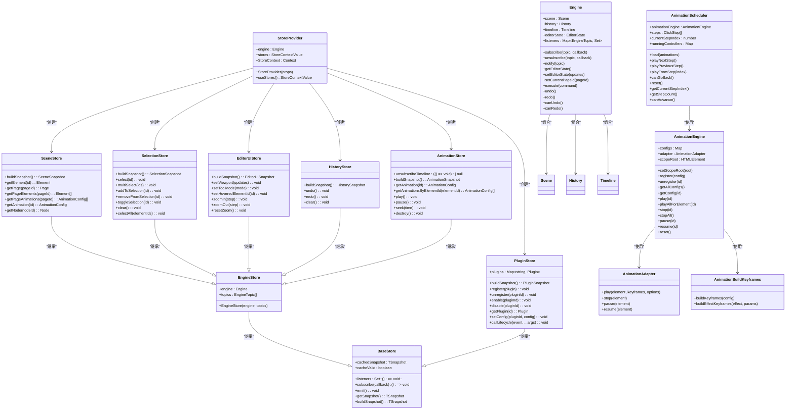

**图表来源**
- [src/engine/engine.ts:7-79](file://src/engine/engine.ts#L7-L79)
- [src/store/StoreProvider.tsx:1-49](file://src/store/StoreProvider.tsx#L1-L49)
- [src/store/baseStore.ts:1-51](file://src/store/baseStore.ts#L1-L51)
- [src/store/sceneStore.ts:1-59](file://src/store/sceneStore.ts#L1-L59)
- [src/store/selectionStore.ts:1-69](file://src/store/selectionStore.ts#L1-L69)
- [src/store/editorUIStore.ts:1-53](file://src/store/editorUIStore.ts#L1-L53)
- [src/store/historyStore.ts:1-35](file://src/store/historyStore.ts#L1-L35)
- [src/store/animationStore.ts:1-60](file://src/store/animationStore.ts#L1-L60)
- [src/store/pluginStore.ts:1-100](file://src/store/pluginStore.ts#L1-L100)
- [src/animation/engine.ts:9-120](file://src/animation/engine.ts#L9-L120)
- [src/animation/scheduler.ts:56-160](file://src/animation/scheduler.ts#L56-L160)
- [src/animation/adapter.ts:1-27](file://src/animation/adapter.ts#L1-L27)
- [src/animation/buildKeyframes.ts:1-125](file://src/animation/buildKeyframes.ts#L1-L125)

## 详细组件分析

### StoreProvider上下文提供者
- 设计要点
  - StoreProvider作为React上下文提供者，创建并管理多个专用Store实例。
  - 使用useMemo确保Store实例在engine依赖不变时保持稳定，避免不必要的重新创建。
  - 提供useStores Hook简化Store访问，确保组件正确获取所需Store实例。
  - Store实例通过依赖注入方式接收Engine实例，建立清晰的依赖关系。
- 关键流程
  - 初始化：StoreProvider接收Engine实例，创建SceneStore、SelectionStore、EditorUIStore、HistoryStore、AnimationStore和PluginStore。
  - 上下文提供：将Store实例包装在React Context中，向子组件提供状态访问能力。
  - 依赖管理：通过engine依赖项控制Store实例的重新创建时机。

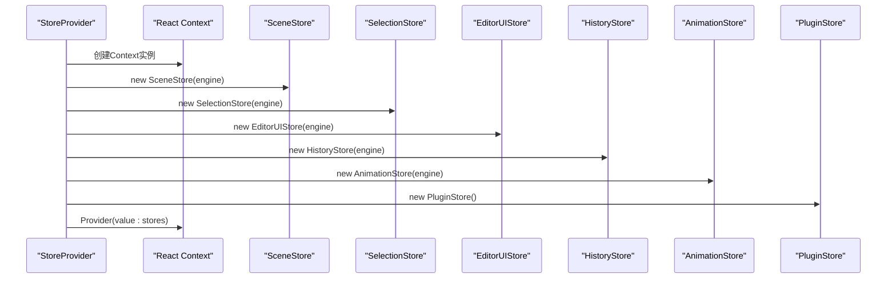

**图表来源**
- [src/store/StoreProvider.tsx:26-40](file://src/store/StoreProvider.tsx#L26-L40)

**章节来源**
- [src/store/StoreProvider.tsx:1-49](file://src/store/StoreProvider.tsx#L1-L49)

### 精确订阅Store系统
- 设计要点
  - BaseStore提供通用的发布-订阅基类，包含监听器集合和快照缓存机制。
  - EngineStore继承BaseStore，自动订阅指定的Engine主题，实现精确的订阅控制。
  - 每个Store只监听相关的Engine主题，避免全局订阅带来的性能问题。
  - 使用useSyncExternalStore Hook实现高性能的外部状态订阅。
- 订阅策略
  - SceneStore：订阅['scene']主题，监听场景变更。
  - SelectionStore：订阅['editorState']主题，监听选择状态变化。
  - EditorUIStore：订阅['editorState']主题，监听UI状态变化。
  - HistoryStore：订阅['history']主题，监听历史状态变化。
  - AnimationStore：订阅['scene']主题和Timeline订阅，监听场景和时间轴变化。

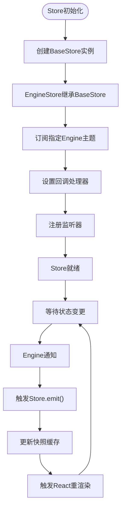

**图表来源**
- [src/store/baseStore.ts:6-34](file://src/store/baseStore.ts#L6-L34)
- [src/store/baseStore.ts:39-50](file://src/store/baseStore.ts#L39-L50)

**章节来源**
- [src/store/baseStore.ts:1-51](file://src/store/baseStore.ts#L1-L51)
- [src/store/hooks.ts:1-32](file://src/store/hooks.ts#L1-L32)

### Store层组件交互关系
- 组件关系
  - StoreProvider作为根组件，创建并管理所有Store实例。
  - 各种Store实例相互独立，通过Engine进行状态同步。
  - React组件通过useStores Hook获取所需的Store实例。
  - useSyncExternalStore Hook负责将Store状态与React组件绑定。
- 数据流
  - Engine状态变更 -> Engine主题通知 -> 相关Store订阅者 -> Store快照更新 -> React组件重渲染。

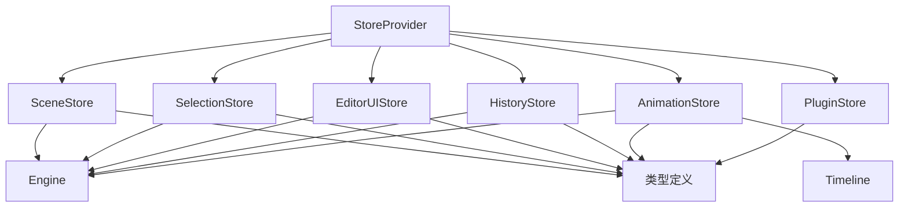

**图表来源**
- [src/store/StoreProvider.tsx:10-17](file://src/store/StoreProvider.tsx#L10-L17)
- [src/store/sceneStore.ts:15-18](file://src/store/sceneStore.ts#L15-L18)
- [src/store/selectionStore.ts:12-14](file://src/store/selectionStore.ts#L12-L14)
- [src/store/editorUIStore.ts:11-13](file://src/store/editorUIStore.ts#L11-L13)
- [src/store/historyStore.ts:9-11](file://src/store/historyStore.ts#L9-L11)
- [src/store/animationStore.ts:13-18](file://src/store/animationStore.ts#L13-L18)

**章节来源**
- [src/store/StoreProvider.tsx:1-49](file://src/store/StoreProvider.tsx#L1-L49)
- [src/store/sceneStore.ts:1-59](file://src/store/sceneStore.ts#L1-L59)
- [src/store/selectionStore.ts:1-69](file://src/store/selectionStore.ts#L1-L69)
- [src/store/editorUIStore.ts:1-53](file://src/store/editorUIStore.ts#L1-L53)
- [src/store/historyStore.ts:1-35](file://src/store/historyStore.ts#L1-L35)
- [src/store/animationStore.ts:1-60](file://src/store/animationStore.ts#L1-L60)
- [src/store/pluginStore.ts:1-100](file://src/store/pluginStore.ts#L1-L100)

### 发布-订阅状态管理系统
- 设计要点
  - 从全局订阅模型迁移到精确订阅模型，每个Store只监听相关主题。
  - Engine的notify方法现在按主题分发通知，避免全局广播。
  - useSyncExternalStore Hook提供高性能的外部状态订阅机制。
  - Store实例通过useMemo保持稳定，避免不必要的重新订阅。
- 关键流程
  - 订阅：Store实例在构造时注册到指定的Engine主题。
  - 通知：Engine按主题通知相关Store，Store更新快照并触发React重渲染。
  - 清理：组件卸载时自动清理Store订阅，防止内存泄漏。

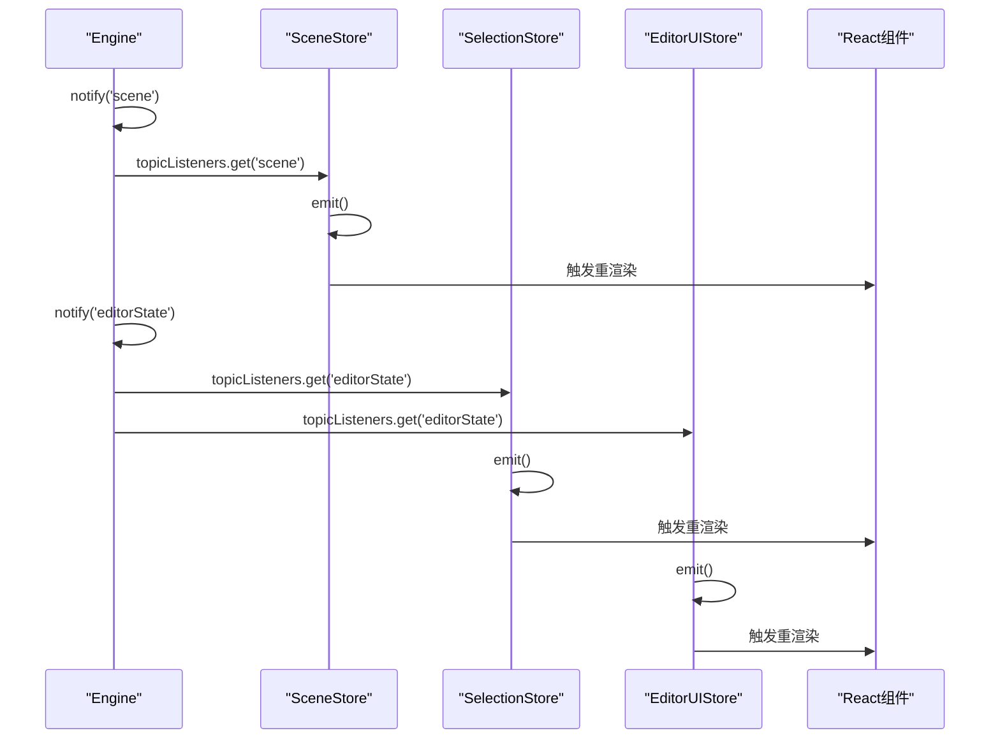

**图表来源**
- [src/engine/engine.ts:32-38](file://src/engine/engine.ts#L32-L38)
- [src/store/baseStore.ts:18-23](file://src/store/baseStore.ts#L18-L23)

**章节来源**
- [src/engine/engine.ts:12-44](file://src/engine/engine.ts#L12-L44)
- [src/hooks/useEngineSnapshot.ts:1-23](file://src/hooks/useEngineSnapshot.ts#L1-L23)
- [src/store/readme.md:49-142](file://src/store/readme.md#L49-L142)

### 基于钩子的Store订阅系统
- 设计要点
  - useSyncExternalStore Hook替代传统的useEngineSnapshot，提供更好的性能。
  - 每个Store都有对应的Hook，如useSceneStore、useSelectionStore等。
  - Hook内部使用store.subscribe和store.getSnapshot提供状态访问。
  - 组件通过useStores Hook获取Store实例，然后使用相应的Hook订阅状态。
- 性能优势
  - 精确订阅：只订阅相关Store，避免全局状态变更的重渲染。
  - 快照缓存：Store内部缓存快照，避免重复计算。
  - React优化：useSyncExternalStore提供更好的并发特性。

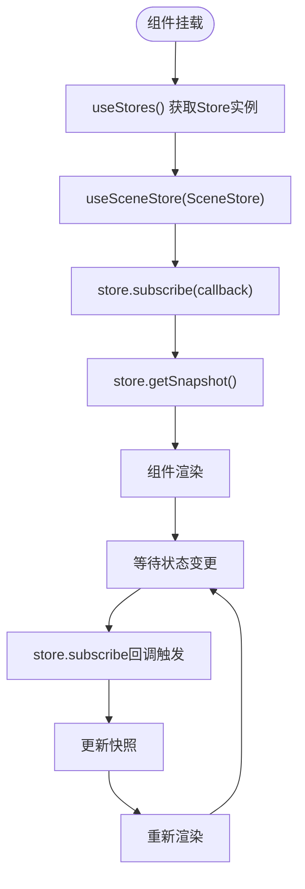

**图表来源**
- [src/store/hooks.ts:9-11](file://src/store/hooks.ts#L9-L11)
- [src/App.tsx:20-24](file://src/App.tsx#L20-L24)

**章节来源**
- [src/store/hooks.ts:1-32](file://src/store/hooks.ts#L1-L32)
- [src/App.tsx:1-335](file://src/App.tsx#L1-L335)

### 引擎与命令模式
- 设计要点
  - 所有状态变更必须经由 Engine.execute(command)，确保历史记录与一致性。
  - 命令对象封装"执行/撤销"逻辑，避免直接修改场景状态。
  - 支持元素、动画、页面、节点与结构的增删改与排序命令。
- 关键流程（撤销/重做）
  - 执行：command.execute() 后压入历史栈并触发通知。
  - 撤销：弹出命令并调用其 undo()，同时将命令压入重做栈并触发通知。
  - 重做：从重做栈弹出命令并重新执行。

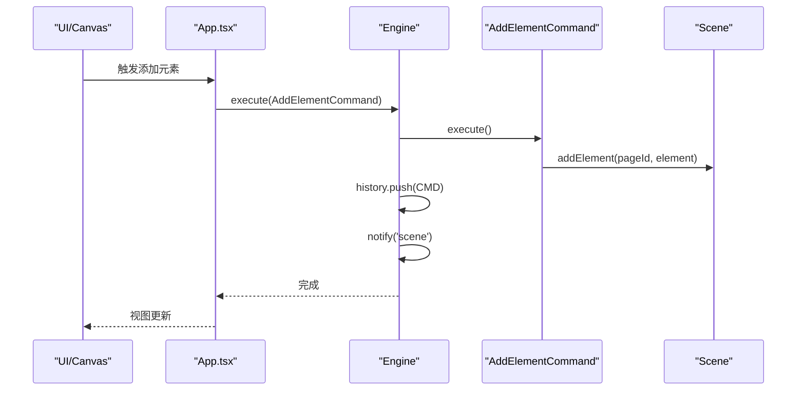

**图表来源**
- [src/App.tsx:134-137](file://src/App.tsx#L134-L137)
- [src/engine/engine.ts:51-55](file://src/engine/engine.ts#L51-L55)
- [src/engine/commands.ts:11-17](file://src/engine/commands.ts#L11-L17)
- [src/engine/scene.ts:94-106](file://src/engine/scene.ts#L94-L106)

**章节来源**
- [src/engine/engine.ts:51-73](file://src/engine/engine.ts#L51-L73)
- [src/engine/commands.ts:4-280](file://src/engine/commands.ts#L4-L280)
- [src/engine/history.ts:7-30](file://src/engine/history.ts#L7-L30)

### 场景模型与数据结构
- 数据模型
  - Document：包含 pages、nodes、structureItems、currentPageId。
  - Page：包含 elements、animations。
  - Element：支持 shape/text/image/group 及层级父子关系。
  - AnimationConfig：支持 keyframes、起始类型（click/withPrev/afterPrev）、缓动等。
- 关键能力
  - 页面与节点的增删改与结构重排。
  - 当前页面元素与动画的增删改与排序。
  - 元素移动时自动维护父子关系与子列表同步。


**图表来源**
- [src/engine/scene.ts:108-135](file://src/engine/scene.ts#L108-L135)

**章节来源**
- [src/engine/scene.ts:3-273](file://src/engine/scene.ts#L3-L273)
- [src/types/index.ts:60-159](file://src/types/index.ts#L60-L159)

### SnapEngine 吸附引擎
- 设计要点
  - 提供智能吸附对齐、间距分布和画布参考线计算。
  - 支持边缘对齐、中心对齐和等间距分布三种吸附模式。
  - 通过阈值参数控制吸附精度，避免过度敏感。
- 核心算法
  - solveAxis：按优先级处理中心对齐、边缘对齐和等间距分布。
  - findSnap：查找最佳对齐位置，返回偏移量和引导线。
  - findEqualSpacing：计算相邻元素间的等间距分布。

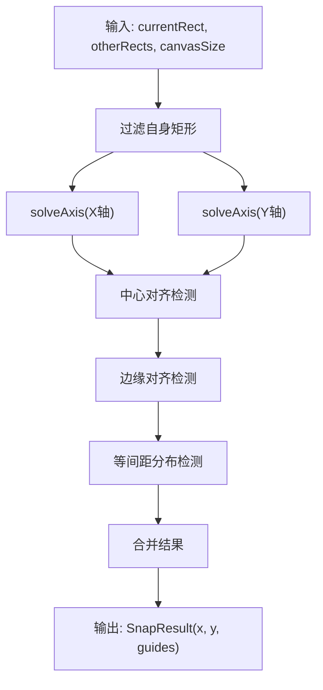

**图表来源**
- [src/engine/snapEngine.ts:242-258](file://src/engine/snapEngine.ts#L242-L258)

**章节来源**
- [src/engine/snapEngine.ts:1-259](file://src/engine/snapEngine.ts#L1-L259)

### 动画引擎与调度器
- 动画引擎（AnimationEngine）
  - 注册/注销动画配置，构建关键帧，委托适配器执行。
  - 提供按元素批量播放、停止、暂停、恢复与全局重置。
  - 支持作用域根节点设置，限制 DOM 查询范围。
- 调度器（AnimationScheduler）
  - 将动画数组转换为 ClickStep 列表，Step 由用户点击触发。
  - Step 内部按 Batch 顺序执行，Batch 内动画并行。
  - 支持前进到下一 Step、回退到上一 Step、从指定 Step 开始播放。
- 适配器
  - WebAnimationAdapter：基于 Web Animations API。
  - GSAPAdapter：基于 GSAP，通过适配器接口屏蔽差异。
- 关键优化
  - buildKeyframes 纯函数实现，无 DOM 依赖，提升性能。
  - 运行时控制器管理，支持精确的生命周期控制。

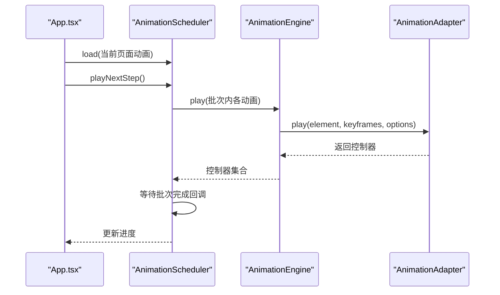

**图表来源**
- [src/App.tsx:28-74](file://src/App.tsx#L28-L74)
- [src/animation/scheduler.ts:72-108](file://src/animation/scheduler.ts#L72-L108)
- [src/animation/engine.ts:53-70](file://src/animation/engine.ts#L53-L70)
- [src/animation/index.ts:1-8](file://src/animation/index.ts#L1-L8)

**章节来源**
- [src/animation/engine.ts:9-120](file://src/animation/engine.ts#L9-L120)
- [src/animation/scheduler.ts:56-160](file://src/animation/scheduler.ts#L56-L160)
- [src/animation/adapter.ts:1-27](file://src/animation/adapter.ts#L1-L27)
- [src/animation/buildKeyframes.ts:1-125](file://src/animation/buildKeyframes.ts#L1-L125)
- [src/animation/index.ts:1-8](file://src/animation/index.ts#L1-L8)
- [README.md:4-15](file://README.md#L4-L15)

### 展示层与交互
- App.tsx
  - 通过StoreProvider提供Store实例，使用useStores Hook获取所需Store。
  - 使用useSceneStore、useSelectionStore、useHistoryStore、useAnimationStore订阅状态。
  - 键盘快捷键：Ctrl/Cmd+Z 撤销、Ctrl/Cmd+Shift+Z 或 Ctrl/Cmd+Y 重做；Delete/Backspace 删除选中元素。
  - 自动同步当前页面动画到动画引擎，根据面板切换动态创建/销毁调度器。
  - 使用Store提供的状态进行响应式更新，避免全量重渲染。
- Canvas.tsx
  - 拖拽新增元素、点击选择、画布空白处取消选择。
  - 将动画作用域限定在当前画布容器，确保编辑态与预览态一致。
  - 通过 renderer 组件渲染各种元素类型，支持选择状态显示。

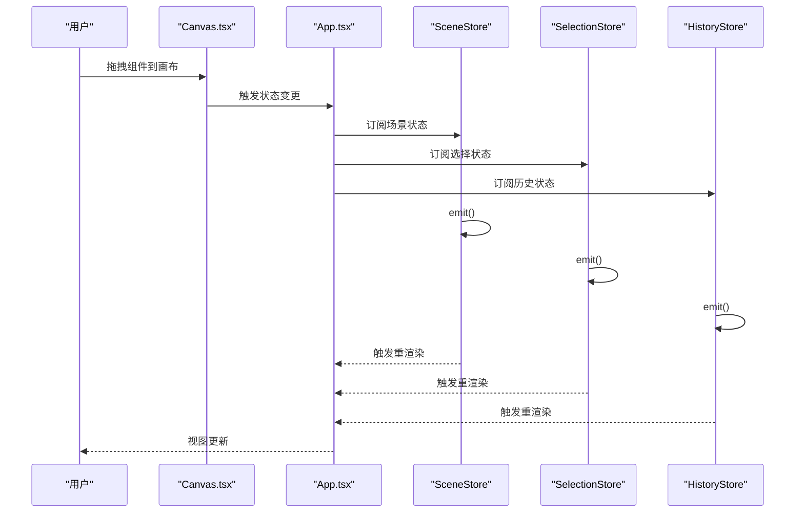

**图表来源**
- [src/components/Canvas.tsx:44-69](file://src/components/Canvas.tsx#L44-L69)
- [src/App.tsx:108-150](file://src/App.tsx#L108-L150)
- [src/store/sceneStore.ts:15-18](file://src/store/sceneStore.ts#L15-L18)
- [src/store/selectionStore.ts:12-14](file://src/store/selectionStore.ts#L12-L14)
- [src/store/historyStore.ts:9-11](file://src/store/historyStore.ts#L9-L11)

**章节来源**
- [src/App.tsx:1-335](file://src/App.tsx#L1-L335)
- [src/components/Canvas.tsx:22-186](file://src/components/Canvas.tsx#L22-L186)
- [src/renderer/index.tsx:189-202](file://src/renderer/index.tsx#L189-L202)

## 依赖分析
- 技术栈
  - 前端框架：React 18、React DOM
  - 构建工具：Vite
  - 类型系统：TypeScript
  - 拖拽与可移动：@dnd-kit/*、react-moveable
  - 动画：gsap
- 第三方依赖与版本兼容性
  - React 与 React-DOM：保持主版本一致以避免运行时警告。
  - @dnd-kit 与 react-moveable：用于拖拽与可调整布局，注意与 React 版本兼容。
  - gsap：动画库，需与适配器接口匹配。
  - Vite 与 TypeScript：遵循官方推荐版本范围，确保类型与构建稳定性。

**章节来源**
- [package.json:12-32](file://package.json#L12-L32)

## 性能考量
- 命令执行与历史管理
  - 历史栈为线性存储，撤销/重做复杂度 O(1)，适合频繁操作的编辑器。
- 精确订阅优化
  - Store层按主题订阅，避免全局广播带来的性能开销。
  - useSyncExternalStore Hook提供更好的并发特性和性能表现。
  - Store实例通过useMemo保持稳定，减少不必要的重新创建。
- 发布-订阅优化
  - useEngineSnapshot Hook提供细粒度更新，避免全量重渲染。
  - 订阅者集合使用 Set，支持高效的添加和删除操作。
- 动画执行模型
  - Step/Batch 模型降低一次性渲染压力，Batch 内并行提升体验。
  - 使用 requestAnimationFrame 推进时间轴，减少主线程阻塞。
  - buildKeyframes 纯函数实现，无 DOM 依赖，提升性能表现。
- DOM 查询与作用域
  - 通过 setScopeRoot 将动画目标限定在画布容器，避免全局查询开销。
- SnapEngine 优化
  - 优先级算法减少不必要的计算，阈值参数控制性能与精度平衡。
  - O(n) 复杂度的等间距分布计算，适合实时交互场景。

**更新** 新增Store层精确订阅架构的性能优化，包括useSyncExternalStore Hook的性能优势、Store实例缓存和按主题订阅的优化效果。

## 故障排查指南
- 撤销/重做无效
  - 检查是否通过 Engine.execute 提交命令；确认 History 栈状态。
- 精确订阅问题
  - 确认StoreProvider正确提供Store实例；检查useStores Hook使用。
  - 验证Store实例的订阅主题是否正确配置。
  - 检查useSyncExternalStore Hook的回调函数是否正确返回快照。
- Store状态不同步
  - 确认Engine主题通知是否正确分发到相关Store。
  - 检查Store的buildSnapshot方法是否正确实现。
  - 验证Store实例的缓存机制是否正常工作。
- 动画未播放或播放异常
  - 确认元素是否存在且具有 data-element-id；检查 AnimationEngine.setScopeRoot 是否正确设置。
  - 检查动画配置的 elementId 与起始类型（startType）是否合理。
- SnapEngine 不工作
  - 确认 Rect 对象包含正确的坐标和尺寸信息。
  - 检查阈值参数设置是否合理，避免过于敏感或不敏感。
- 快捷键无响应
  - 确认焦点不在输入框；检查事件监听绑定与 preventDefault 使用。
- 预览模式异常
  - 确保 PreviewModal 正确传递 engine 与 animationEngine 实例；检查调度器生命周期管理。

**章节来源**
- [src/engine/history.ts:12-30](file://src/engine/history.ts#L12-L30)
- [src/hooks/useEngineSnapshot.ts:6-10](file://src/hooks/useEngineSnapshot.ts#L6-L10)
- [src/engine/engine.ts:23-29](file://src/engine/engine.ts#L23-L29)
- [src/animation/engine.ts:20-30](file://src/animation/engine.ts#L20-L30)
- [src/engine/snapEngine.ts:242-258](file://src/engine/snapEngine.ts#L242-L258)
- [src/App.tsx:105-145](file://src/App.tsx#L105-L145)
- [src/components/Canvas.tsx:27-32](file://src/components/Canvas.tsx#L27-L32)

## 结论
本架构以命令模式为核心，结合分层与模块化设计，实现了编辑器的状态一致性、可扩展性与可维护性。通过新增的精确订阅Store系统，显著提升了响应式更新能力和性能表现。StoreProvider提供统一的Store实例管理，多个专用Store实现按需订阅，useSyncExternalStore Hook提供高性能的状态订阅机制。SnapEngine 吸附引擎提供了智能的布局辅助功能。动画调度器的 Step/Batch 模型有效平衡了交互体验与执行效率。类型系统与统一导出进一步提升了代码复用与测试友好性。新的Store架构在原有基础上增强了响应式更新能力、性能优化和用户体验，通过精确订阅机制和基于Hook的状态管理实现了更精细的状态控制。

**更新** 新架构通过StoreProvider和精确订阅Store系统，在原有基础上增强了响应式更新能力、性能优化和用户体验，通过精确订阅机制和基于Hook的状态管理实现了更精细的状态控制。

## 附录
- 系统上下文图（概念性）
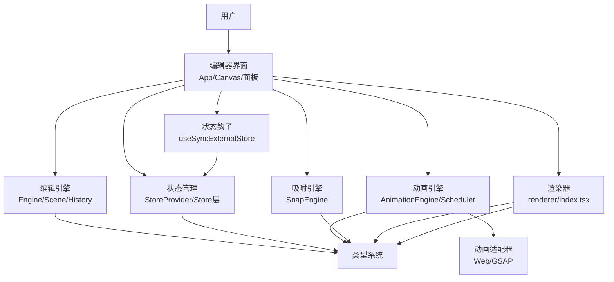

- 组件分解图（映射实际源码）
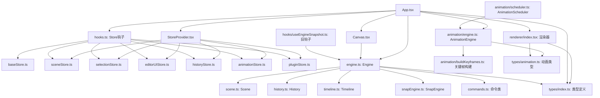

**图表来源**
- [src/App.tsx:1-335](file://src/App.tsx#L1-L335)
- [src/components/Canvas.tsx:22-186](file://src/components/Canvas.tsx#L22-L186)
- [src/store/StoreProvider.tsx:1-49](file://src/store/StoreProvider.tsx#L1-L49)
- [src/store/baseStore.ts:1-51](file://src/store/baseStore.ts#L1-L51)
- [src/store/sceneStore.ts:1-59](file://src/store/sceneStore.ts#L1-L59)
- [src/store/selectionStore.ts:1-69](file://src/store/selectionStore.ts#L1-L69)
- [src/store/editorUIStore.ts:1-53](file://src/store/editorUIStore.ts#L1-L53)
- [src/store/historyStore.ts:1-35](file://src/store/historyStore.ts#L1-L35)
- [src/store/animationStore.ts:1-60](file://src/store/animationStore.ts#L1-L60)
- [src/store/pluginStore.ts:1-100](file://src/store/pluginStore.ts#L1-L100)
- [src/engine/engine.ts:1-79](file://src/engine/engine.ts#L1-L79)
- [src/engine/scene.ts:3-273](file://src/engine/scene.ts#L3-L273)
- [src/engine/history.ts:3-45](file://src/engine/history.ts#L3-L45)
- [src/engine/timeline.ts:1-66](file://src/engine/timeline.ts#L1-L66)
- [src/engine/snapEngine.ts:1-259](file://src/engine/snapEngine.ts#L1-L259)
- [src/engine/commands.ts:4-280](file://src/engine/commands.ts#L4-L280)
- [src/animation/engine.ts:1-120](file://src/animation/engine.ts#L1-L120)
- [src/animation/scheduler.ts:1-160](file://src/animation/scheduler.ts#L1-L160)
- [src/animation/buildKeyframes.ts:1-125](file://src/animation/buildKeyframes.ts#L1-L125)
- [src/types/index.ts:1-159](file://src/types/index.ts#L1-L159)
- [src/types/animation.ts:1-113](file://src/types/animation.ts#L1-L113)
- [src/store/hooks.ts:1-32](file://src/store/hooks.ts#L1-L32)
- [src/hooks/useEngineSnapshot.ts:1-23](file://src/hooks/useEngineSnapshot.ts#L1-L23)
- [src/renderer/index.tsx:1-314](file://src/renderer/index.tsx#L1-L314)