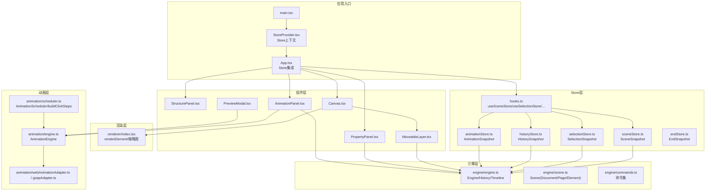
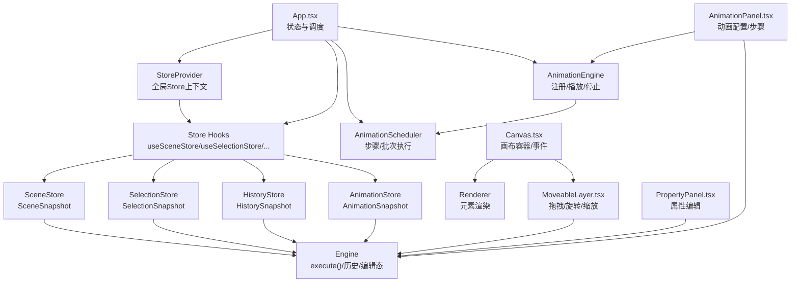
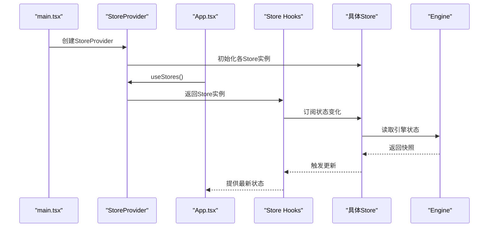
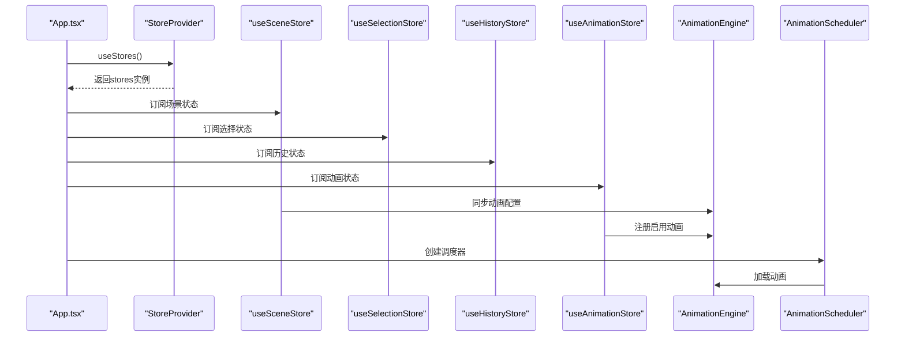
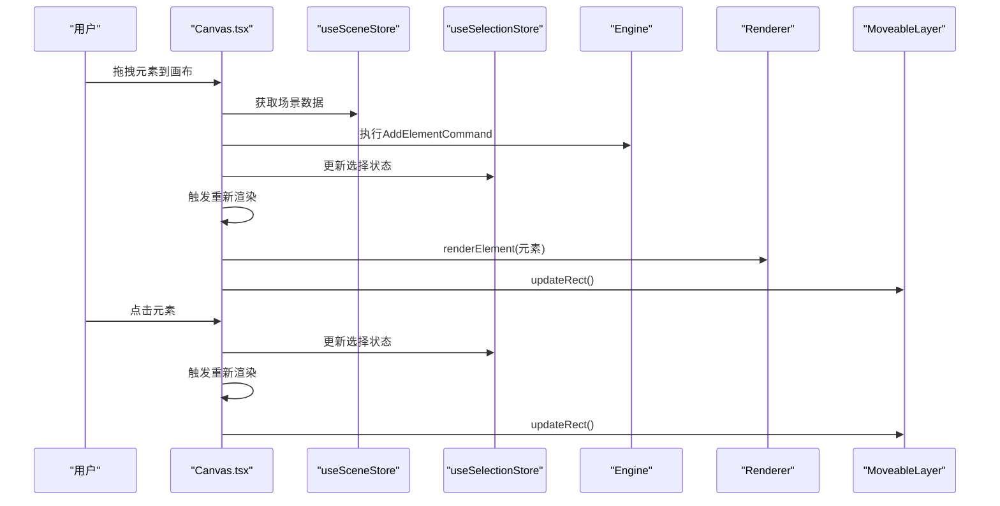
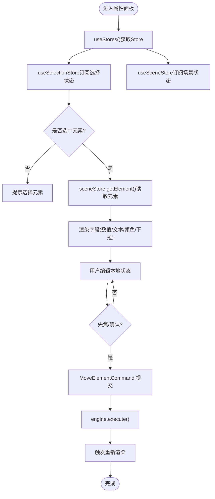
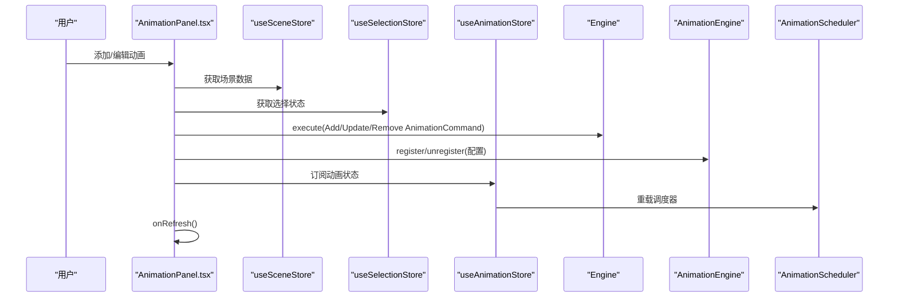
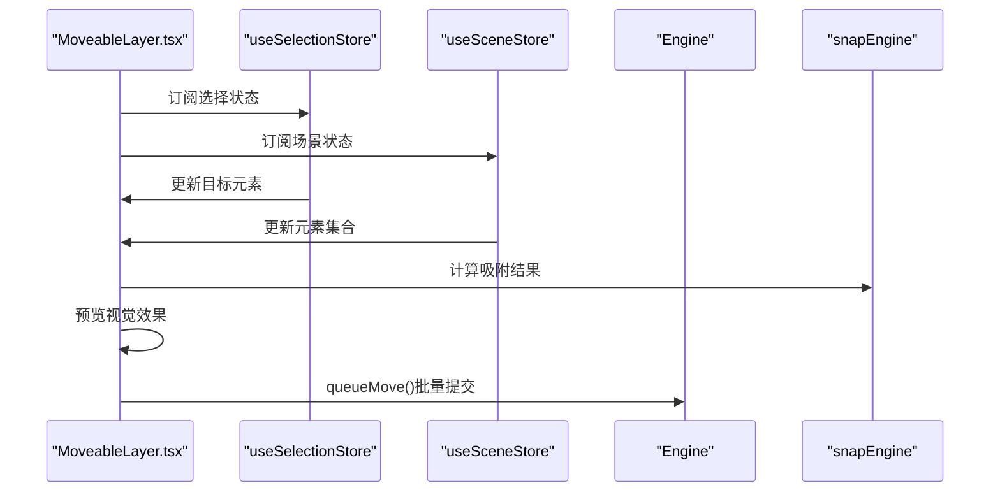
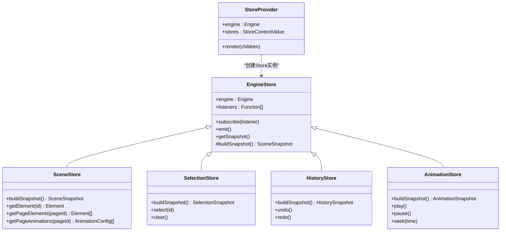
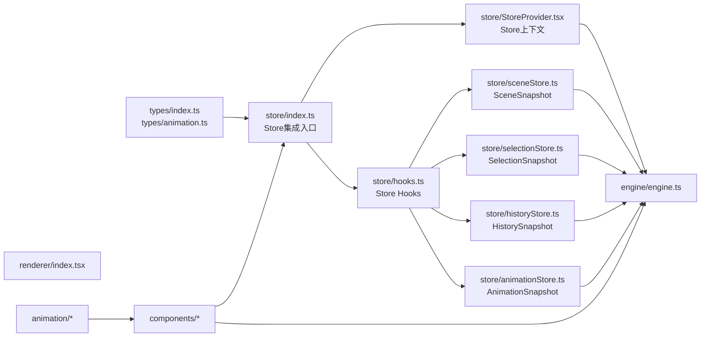

# 组件交互

<cite>
**本文引用的文件**
- [src/App.tsx](file://src/App.tsx)
- [src/main.tsx](file://src/main.tsx)
- [src/store/index.ts](file://src/store/index.ts)
- [src/store/StoreProvider.tsx](file://src/store/StoreProvider.tsx)
- [src/store/hooks.ts](file://src/store/hooks.ts)
- [src/store/sceneStore.ts](file://src/store/sceneStore.ts)
- [src/store/selectionStore.ts](file://src/store/selectionStore.ts)
- [src/store/historyStore.ts](file://src/store/historyStore.ts)
- [src/store/animationStore.ts](file://src/store/animationStore.ts)
- [src/engine/engine.ts](file://src/engine/engine.ts)
- [src/types/index.ts](file://src/types/index.ts)
- [src/types/animation.ts](file://src/types/animation.ts)
- [src/components/Canvas.tsx](file://src/components/Canvas.tsx)
- [src/components/PropertyPanel.tsx](file://src/components/PropertyPanel.tsx)
- [src/components/AnimationPanel.tsx](file://src/components/AnimationPanel.tsx)
- [src/components/MoveableLayer.tsx](file://src/components/MoveableLayer.tsx)
- [src/components/StructurePanel.tsx](file://src/components/StructurePanel.tsx)
- [src/components/PreviewModal.tsx](file://src/components/PreviewModal.tsx)
- [src/renderer/index.tsx](file://src/renderer/index.tsx)
- [src/animation/engine.ts](file://src/animation/engine.ts)
- [src/animation/scheduler.ts](file://src/animation/scheduler.ts)
- [src/animation/index.ts](file://src/animation/index.ts)
</cite>

## 更新摘要
**变更内容**
- 组件现在使用专门的Store Hooks而非全局Engine快照
- App.tsx、Canvas.tsx、AnimationPanel.tsx等组件全面迁移到Store集成模式
- 新增StoreProvider上下文管理和useStores钩子函数
- 移除了直接使用engine.scene的全局快照访问方式
- 增强了组件间的解耦性和状态管理的一致性

## 目录
1. [简介](#简介)
2. [项目结构](#项目结构)
3. [核心组件](#核心组件)
4. [架构总览](#架构总览)
5. [详细组件分析](#详细组件分析)
6. [Store集成机制](#store集成机制)
7. [依赖分析](#依赖分析)
8. [性能考虑](#性能考虑)
9. [故障排查指南](#故障排查指南)
10. [结论](#结论)
11. [附录](#附录)

## 简介
本技术文档聚焦于AI课件编辑器的组件交互机制，系统性阐述主应用组件与各子组件之间的数据传递、事件处理与状态同步方式；深入解析Canvas画布与引擎系统的集成、PropertyPanel属性面板的数据绑定机制、AnimationPanel动画面板的配置同步与步骤调度；并提供典型用户操作的交互流程与时序图，解释组件解耦策略、通信协议与错误传播路径，最后给出生命周期管理、性能优化与调试建议。

**更新重点**：组件现已完全迁移到基于Store Hooks的状态管理模式，替代了之前的全局Engine快照访问方式，提供了更好的组件解耦性和状态管理一致性。

## 项目结构
项目采用"Store-组件-引擎"三层架构：Store层提供响应式状态视图；组件层通过Hooks订阅状态变化；引擎层负责无UI框架的状态与命令执行；动画层通过适配器桥接Web Animations API或第三方库。

**图表来源**
- [src/main.tsx:15-21](file://src/main.tsx#L15-L21)
- [src/store/StoreProvider.tsx:26-40](file://src/store/StoreProvider.tsx#L26-L40)
- [src/store/hooks.ts:9-31](file://src/store/hooks.ts#L9-L31)
- [src/store/sceneStore.ts:15-58](file://src/store/sceneStore.ts#L15-L58)
- [src/store/selectionStore.ts:12-68](file://src/store/selectionStore.ts#L12-L68)
- [src/store/historyStore.ts:9-34](file://src/store/historyStore.ts#L9-L34)
- [src/store/animationStore.ts:13-59](file://src/store/animationStore.ts#L13-L59)

**章节来源**
- [src/main.tsx:1-22](file://src/main.tsx#L1-L22)
- [src/store/index.ts:1-35](file://src/store/index.ts#L1-L35)

## 核心组件
- **主应用App**：集中管理引擎实例、动画引擎与调度器、右侧面板切换、预览模式、键盘快捷键与全局刷新；通过Store Hooks获取场景、选择、历史和动画状态，负责将场景动画同步到动画引擎，并在动画面板激活时自动创建/重载步骤调度器。
- **StoreProvider**：提供全局Store上下文，创建并管理SceneStore、SelectionStore、HistoryStore、AnimationStore等状态存储实例。
- **EngineStore基类**：抽象出通用的状态订阅机制，通过useSyncExternalStore实现React与外部状态源的连接。
- **引擎Engine**：统一的状态变更入口，所有修改必须通过execute(command)进行；维护EditorState（选择、视口、工具等）与历史栈。
- **渲染器Renderer**：根据元素类型输出React/SVG节点，支持选中态描边与缩略图渲染。
- **Canvas画布**：承载页面元素渲染、拖拽新增、点击选择、指针事件穿透控制；通过Store Hooks获取场景数据，设置动画作用域根节点以确保编辑态DOM查询正确。
- **MoveableLayer**：基于react-moveable实现拖拽、旋转、缩放；结合snapEngine进行吸附与引导线；通过Store Hooks读取元素数据，最终通过命令提交位置/尺寸/角度变更。
- **PropertyPanel属性面板**：通过Store Hooks读取当前选中元素，提供字段级双向绑定（本地状态+失焦提交），通过命令更新元素属性。
- **AnimationPanel动画面板**：构建动画配置、与引擎命令交互、与动画引擎注册/注销；使用buildClickSteps生成步骤与批次，支持播放单个/从某步播放。
- **动画引擎AnimationEngine**：持有配置、构建关键帧、委托适配器播放/暂停/停止；可按元素批量播放/停止。
- **调度器AnimationScheduler**：实现"步骤-批次"模型，步骤由用户点击推进，批次内并发、批次间顺序执行。

**章节来源**
- [src/App.tsx:19-335](file://src/App.tsx#L19-L335)
- [src/store/StoreProvider.tsx:26-48](file://src/store/StoreProvider.tsx#L26-L48)
- [src/store/hooks.ts:9-31](file://src/store/hooks.ts#L9-L31)
- [src/engine/engine.ts:7-54](file://src/engine/engine.ts#L7-L54)
- [src/renderer/index.tsx:189-202](file://src/renderer/index.tsx#L189-L202)
- [src/components/Canvas.tsx:21-189](file://src/components/Canvas.tsx#L21-L189)
- [src/components/MoveableLayer.tsx:22-211](file://src/components/MoveableLayer.tsx#L22-L211)
- [src/components/PropertyPanel.tsx:12-334](file://src/components/PropertyPanel.tsx#L12-L334)
- [src/components/AnimationPanel.tsx:87-800](file://src/components/AnimationPanel.tsx#L87-L800)
- [src/animation/engine.ts:9-120](file://src/animation/engine.ts#L9-L120)
- [src/animation/scheduler.ts:56-160](file://src/animation/scheduler.ts#L56-L160)

## 架构总览
下图展示主应用与核心子组件的职责边界与数据流向，突出Store集成模式：

**图表来源**
- [src/store/StoreProvider.tsx:26-48](file://src/store/StoreProvider.tsx#L26-L48)
- [src/store/hooks.ts:9-31](file://src/store/hooks.ts#L9-L31)
- [src/store/sceneStore.ts:15-58](file://src/store/sceneStore.ts#L15-L58)
- [src/store/selectionStore.ts:12-68](file://src/store/selectionStore.ts#L12-L68)
- [src/store/historyStore.ts:9-34](file://src/store/historyStore.ts#L9-L34)
- [src/store/animationStore.ts:13-59](file://src/store/animationStore.ts#L13-L59)

## 详细组件分析

### Store集成模式详解
组件现在通过专门的Store Hooks获取状态，替代了之前的全局Engine快照访问方式：

- **StoreProvider上下文**：在应用根部提供全局Store上下文，创建SceneStore、SelectionStore、HistoryStore、AnimationStore等实例
- **useStores钩子**：统一获取所有Store实例，确保组件间状态访问的一致性
- **EngineStore基类**：实现useSyncExternalStore模式，自动处理状态订阅和更新
- **Store Hooks**：每个Store类型都有对应的Hook函数，如useSceneStore、useSelectionStore等

**图表来源**
- [src/main.tsx:15-21](file://src/main.tsx#L15-L21)
- [src/store/StoreProvider.tsx:26-40](file://src/store/StoreProvider.tsx#L26-L40)
- [src/store/hooks.ts:9-31](file://src/store/hooks.ts#L9-L31)
- [src/store/sceneStore.ts:15-33](file://src/store/sceneStore.ts#L15-L33)

**章节来源**
- [src/store/index.ts:24-35](file://src/store/index.ts#L24-L35)
- [src/store/StoreProvider.tsx:26-48](file://src/store/StoreProvider.tsx#L26-L48)
- [src/store/hooks.ts:9-31](file://src/store/hooks.ts#L9-L31)

### 主应用App与Store集成
- **Store集成**：通过useStores获取sceneStore、selectionStore、historyStore、animationStore实例
- **状态订阅**：使用useSceneStore、useSelectionStore、useHistoryStore、useAnimationStore订阅状态变化
- **场景动画同步**：基于animationStore的currentPageAnimations同步到AnimationEngine
- **动画面板生命周期**：当右侧为"动画"且未开启预览时，创建AnimationScheduler并加载当前页启用动画

**图表来源**
- [src/App.tsx:20-74](file://src/App.tsx#L20-L74)
- [src/store/hooks.ts:9-31](file://src/store/hooks.ts#L9-L31)

**章节来源**
- [src/App.tsx:19-335](file://src/App.tsx#L19-L335)

### Canvas画布与Store集成
- **Store集成**：通过useStores获取sceneStore和selectionStore，使用useSceneStore和useSelectionStore订阅状态
- **事件处理**：拖拽新增、点击选择、空白区域点击等事件通过Store更新状态
- **动画作用域**：在挂载时将AnimationEngine的作用域根设为画布容器，在卸载时清空

**图表来源**
- [src/components/Canvas.tsx:22-88](file://src/components/Canvas.tsx#L22-L88)
- [src/store/hooks.ts:9-31](file://src/store/hooks.ts#L9-L31)

**章节来源**
- [src/components/Canvas.tsx:21-189](file://src/components/Canvas.tsx#L21-L189)

### PropertyPanel属性面板的Store集成
- **Store集成**：通过useStores获取selectionStore和sceneStore，使用useSelectionStore和useSceneStore订阅状态
- **数据来源**：从sceneStore.getElement读取选中元素，从selectionStore.selectedIds获取选中ID
- **双向绑定**：维护本地受控状态，失焦时通过MoveElementCommand提交更新

**图表来源**
- [src/components/PropertyPanel.tsx:12-24](file://src/components/PropertyPanel.tsx#L12-L24)
- [src/store/hooks.ts:9-31](file://src/store/hooks.ts#L9-L31)

**章节来源**
- [src/components/PropertyPanel.tsx:12-334](file://src/components/PropertyPanel.tsx#L12-L334)

### AnimationPanel动画面板的Store集成
- **Store集成**：通过useStores获取sceneStore、selectionStore、animationStore，使用useSceneStore、useSelectionStore、useAnimationStore订阅状态
- **配置构建**：基于sceneStore和selectionStore构建AnimationConfig，自动推导起始类型
- **与引擎同步**：新增/更新/删除动画均通过命令写入场景；同时注册/注销到AnimationEngine
- **与调度器同步**：基于animationStore的currentPageAnimations创建/重载AnimationScheduler

**图表来源**
- [src/components/AnimationPanel.tsx:87-263](file://src/components/AnimationPanel.tsx#L87-L263)
- [src/store/hooks.ts:9-31](file://src/store/hooks.ts#L9-L31)

**章节来源**
- [src/components/AnimationPanel.tsx:87-800](file://src/components/AnimationPanel.tsx#L87-L800)

### MoveableLayer与Store集成
- **Store集成**：通过useStores获取selectionStore和sceneStore，使用useSelectionStore和useSceneStore订阅状态
- **状态同步**：根据selectionSnapshot.selectedIds同步Moveable目标元素
- **吸附功能**：使用sceneSnapshot.currentPageElements构建其他元素矩形集合
- **批量提交**：通过queueMove函数批量提交移动命令，减少性能开销

**图表来源**
- [src/components/MoveableLayer.tsx:22-68](file://src/components/MoveableLayer.tsx#L22-L68)
- [src/store/hooks.ts:9-31](file://src/store/hooks.ts#L9-L31)

**章节来源**
- [src/components/MoveableLayer.tsx:22-211](file://src/components/MoveableLayer.tsx#L22-L211)

### StructurePanel与Store集成
- **Store集成**：通过useStores获取sceneStore，使用useSceneStore订阅状态
- **文档树操作**：支持添加/删除页面与节点、拖拽重排结构项
- **页面缩略图**：通过缩放渲染页面缩略图，便于浏览
- **选择页面**：通过engine.setCurrentPageId更新当前页面ID

**章节来源**
- [src/components/StructurePanel.tsx:32-401](file://src/components/StructurePanel.tsx#L32-L401)

### PreviewModal与Store集成
- **Store集成**：通过useStores获取sceneStore和animationStore，使用useSceneStore和useAnimationStore订阅状态
- **独立预览**：维护自己的预览页面状态，不修改编辑器状态
- **动画同步**：将预览页面的动画注册到共享的AnimationEngine
- **步骤控制**：使用AnimationScheduler控制动画步骤播放

**章节来源**
- [src/components/PreviewModal.tsx:12-356](file://src/components/PreviewModal.tsx#L12-L356)

## Store集成机制

### StoreProvider上下文管理
StoreProvider作为全局状态提供者，负责创建和管理所有Store实例：

- **Store实例化**：在useMemo中创建SceneStore、SelectionStore、HistoryStore、AnimationStore实例
- **上下文提供**：通过React Context提供stores给子组件使用
- **依赖管理**：基于engine依赖创建Store实例，确保引擎状态的一致性

### EngineStore基类设计
EngineStore抽象出通用的状态订阅机制：

- **订阅接口**：实现subscribe方法，使用useSyncExternalStore连接外部状态源
- **快照构建**：通过buildSnapshot方法从引擎状态构建快照
- **状态更新**：通过emit方法通知订阅者状态变化

### Store Hooks统一访问
每个Store类型都有对应的Hook函数，提供统一的状态访问接口：

- **useSceneStore**：获取SceneSnapshot，包含文档、页面、元素等场景信息
- **useSelectionStore**：获取SelectionSnapshot，包含选中元素ID和选择状态
- **useHistoryStore**：获取HistorySnapshot，包含撤销重做状态
- **useAnimationStore**：获取AnimationSnapshot，包含动画播放状态

**图表来源**
- [src/store/StoreProvider.tsx:26-48](file://src/store/StoreProvider.tsx#L26-L48)
- [src/store/sceneStore.ts:15-58](file://src/store/sceneStore.ts#L15-L58)
- [src/store/selectionStore.ts:12-68](file://src/store/selectionStore.ts#L12-L68)
- [src/store/historyStore.ts:9-34](file://src/store/historyStore.ts#L9-L34)
- [src/store/animationStore.ts:13-59](file://src/store/animationStore.ts#L13-L59)

**章节来源**
- [src/store/StoreProvider.tsx:26-48](file://src/store/StoreProvider.tsx#L26-L48)
- [src/store/sceneStore.ts:15-58](file://src/store/sceneStore.ts#L15-L58)
- [src/store/selectionStore.ts:12-68](file://src/store/selectionStore.ts#L12-L68)
- [src/store/historyStore.ts:9-34](file://src/store/historyStore.ts#L9-L34)
- [src/store/animationStore.ts:13-59](file://src/store/animationStore.ts#L13-L59)

## 依赖分析
- **组件耦合**：所有组件现在通过Store Hooks与引擎解耦，通过useStores统一访问Store实例
- **Store依赖**：StoreProvider作为唯一的状态提供者，所有Store实例都依赖于Engine实例
- **外部依赖**：react-moveable用于交互；@dnd-kit用于动画面板的拖拽排序；Web Animations API或GSAP作为动画适配器
- **类型契约**：types/index.ts与types/animation.ts定义了跨层共享的元素、文档、动画配置与调度类型，确保编译期约束

**图表来源**
- [src/store/index.ts:1-35](file://src/store/index.ts#L1-L35)
- [src/store/StoreProvider.tsx:26-40](file://src/store/StoreProvider.tsx#L26-L40)
- [src/store/hooks.ts:9-31](file://src/store/hooks.ts#L9-L31)
- [src/store/sceneStore.ts:15-58](file://src/store/sceneStore.ts#L15-L58)
- [src/store/selectionStore.ts:12-68](file://src/store/selectionStore.ts#L12-L68)
- [src/store/historyStore.ts:9-34](file://src/store/historyStore.ts#L9-L34)
- [src/store/animationStore.ts:13-59](file://src/store/animationStore.ts#L13-L59)

**章节来源**
- [src/types/index.ts:10-159](file://src/types/index.ts#L10-L159)
- [src/types/animation.ts:26-113](file://src/types/animation.ts#L26-L113)
- [src/engine/index.ts:1-16](file://src/engine/index.ts#L1-L16)
- [src/animation/index.ts:1-8](file://src/animation/index.ts#L1-L8)

## 性能考虑
- **Store订阅优化**：通过useSyncExternalStore实现细粒度的状态订阅，只在相关状态变化时触发组件更新
- **批量更新**：MoveableLayer使用queueMove函数批量提交移动命令，减少引擎状态更新频率
- **渲染优化**：使用版本号驱动局部刷新，避免不必要的重渲染；Canvas与MoveableLayer在Store状态变化时统一更新
- **内存管理**：StoreProvider在useMemo中创建Store实例，避免重复创建造成内存浪费
- **动画执行**：AnimationScheduler在批次内并发播放，批次间串行，降低资源竞争；停止/重置时清理控制器集合

## 故障排查指南
- **Store访问错误**
  - 确保在StoreProvider范围内使用Store Hooks
  - 检查useStores是否正确返回Store实例
  - 章节来源：[src/store/StoreProvider.tsx:42-48](file://src/store/StoreProvider.tsx#L42-L48)
- **状态不更新**
  - 检查EngineStore的buildSnapshot方法是否正确实现
  - 确认Engine状态变化时是否调用emit()
  - 章节来源：[src/store/sceneStore.ts:20-33](file://src/store/sceneStore.ts#L20-L33)
- **动画播放异常**
  - 检查AnimationEngine.setScopeRoot是否正确设置
  - 确认AnimationEngine.register的动画配置是否正确
  - 章节来源：[src/components/Canvas.tsx:29-34](file://src/components/Canvas.tsx#L29-L34)
- **拖拽吸附异常**
  - 检查sceneSnapshot.currentPageElements数据是否正确
  - 确认snapEngine输入参数是否符合预期
  - 章节来源：[src/components/MoveableLayer.tsx:49-52](file://src/components/MoveableLayer.tsx#L49-L52)

## 结论
该编辑器通过"Store驱动+适配器"的架构实现了组件间的高内聚低耦合：StoreProvider作为全局状态提供者，EngineStore统一状态与历史，组件层通过Store Hooks实现响应式状态访问，AnimationEngine与Scheduler提供可组合的播放模型。通过Store集成模式替代了之前的全局Engine快照访问方式，提供了更好的组件解耦性和状态管理一致性；通过useSyncExternalStore实现的细粒度订阅机制提升了性能。建议在后续迭代中进一步完善Store的错误边界与日志埋点，增强开发体验与问题定位效率。

## 附录
- **术语**
  - Store：状态存储实例，提供响应式状态视图
  - Store Hooks：用于订阅Store状态的React Hooks函数
  - EngineStore：Store的基类，实现useSyncExternalStore模式
  - 快照：不可变的状态视图，用于组件渲染
- **Store类型参考**
  - SceneStore：场景状态，包含文档、页面、元素等信息
  - SelectionStore：选择状态，包含选中元素ID和选择状态
  - HistoryStore：历史状态，包含撤销重做能力
  - AnimationStore：动画状态，包含动画播放进度和时间线信息
- **Store集成最佳实践**
  - 在组件顶部调用useStores获取所有Store实例
  - 使用对应的Store Hook订阅所需状态
  - 避免在Store中直接操作DOM，保持纯函数特性
  - 合理使用useMemo和useCallback优化性能