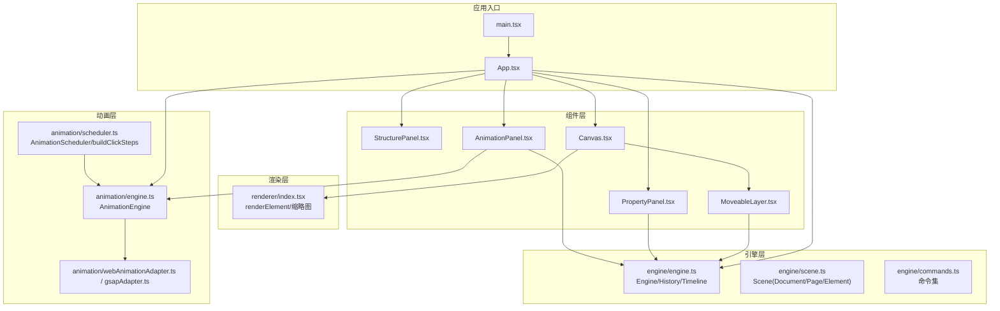
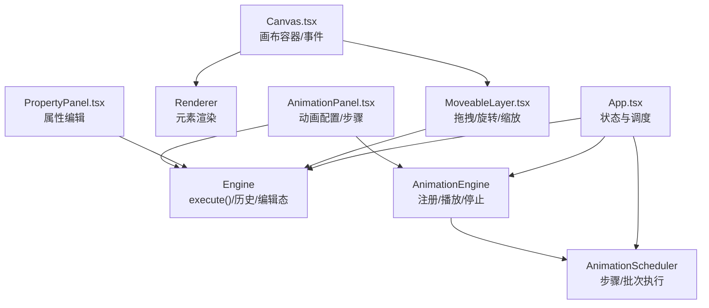
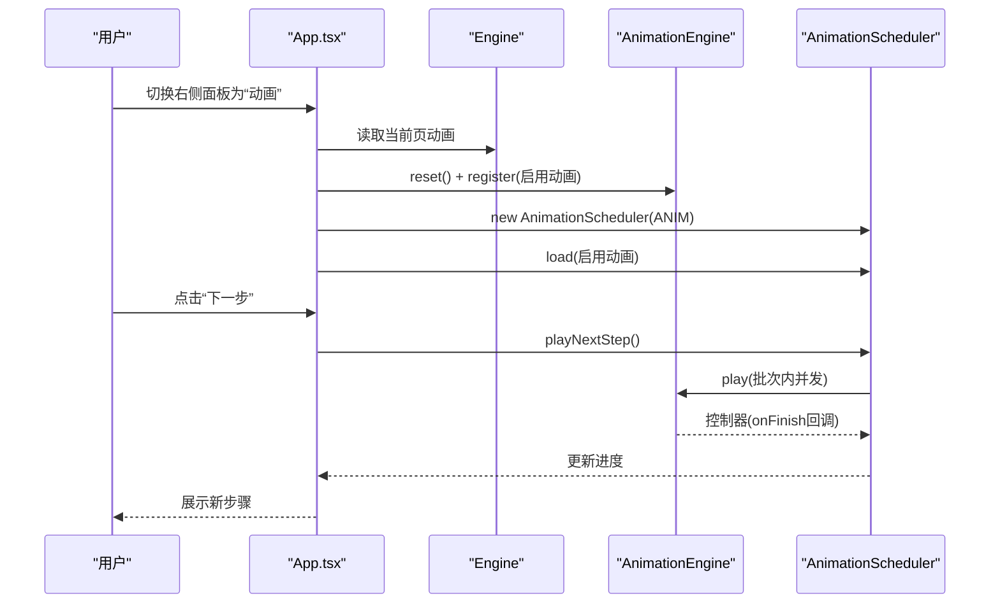
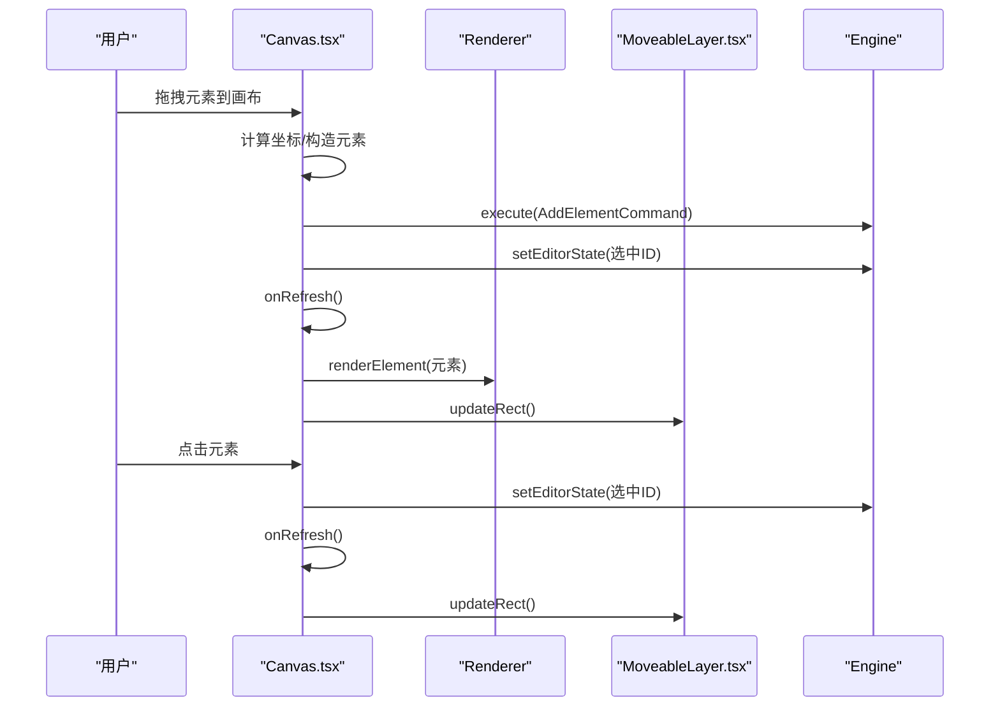
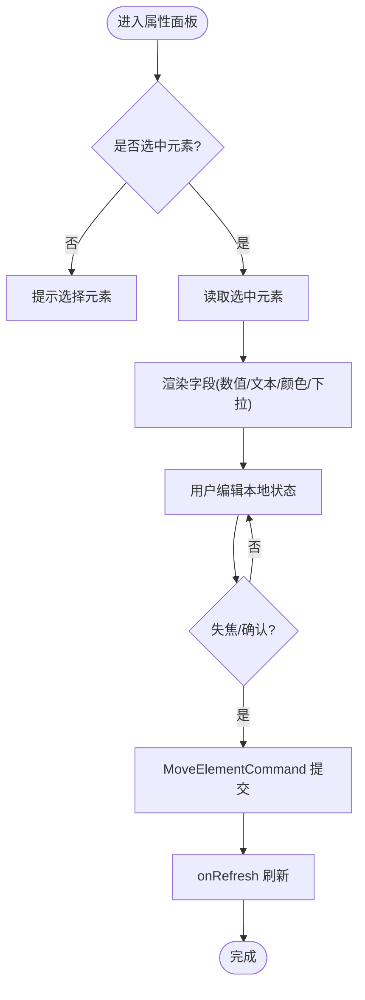
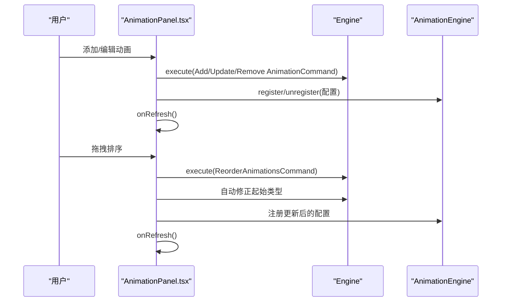
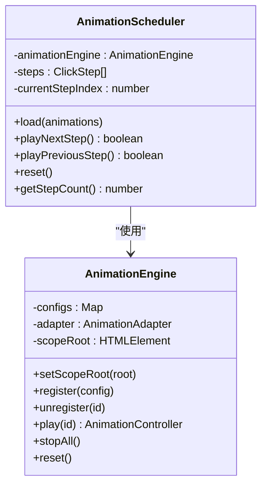
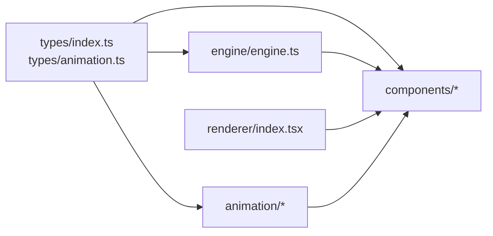

# 组件交互

<cite>
**本文引用的文件**
- [src/App.tsx](file://src/App.tsx)
- [src/main.tsx](file://src/main.tsx)
- [src/engine/engine.ts](file://src/engine/engine.ts)
- [src/engine/index.ts](file://src/engine/index.ts)
- [src/types/index.ts](file://src/types/index.ts)
- [src/types/animation.ts](file://src/types/animation.ts)
- [src/components/Canvas.tsx](file://src/components/Canvas.tsx)
- [src/components/PropertyPanel.tsx](file://src/components/PropertyPanel.tsx)
- [src/components/AnimationPanel.tsx](file://src/components/AnimationPanel.tsx)
- [src/components/MoveableLayer.tsx](file://src/components/MoveableLayer.tsx)
- [src/components/StructurePanel.tsx](file://src/components/StructurePanel.tsx)
- [src/renderer/index.tsx](file://src/renderer/index.tsx)
- [src/animation/engine.ts](file://src/animation/engine.ts)
- [src/animation/scheduler.ts](file://src/animation/scheduler.ts)
- [src/animation/index.ts](file://src/animation/index.ts)
</cite>

## 目录
1. [简介](#简介)
2. [项目结构](#项目结构)
3. [核心组件](#核心组件)
4. [架构总览](#架构总览)
5. [详细组件分析](#详细组件分析)
6. [依赖分析](#依赖分析)
7. [性能考虑](#性能考虑)
8. [故障排查指南](#故障排查指南)
9. [结论](#结论)
10. [附录](#附录)

## 简介
本技术文档聚焦于AI课件编辑器的组件交互机制，系统性阐述主应用组件与各子组件之间的数据传递、事件处理与状态同步方式；深入解析Canvas画布与引擎系统的集成、PropertyPanel属性面板的数据绑定机制、AnimationPanel动画面板的配置同步与步骤调度；并提供典型用户操作的交互流程与时序图，解释组件解耦策略、通信协议与错误传播路径，最后给出生命周期管理、性能优化与调试建议。

## 项目结构
项目采用“引擎-渲染-组件”分层组织：引擎负责无UI框架的状态与命令执行；渲染层负责元素绘制；组件层负责UI交互与状态同步；动画层通过适配器桥接Web Animations API或第三方库。

图表来源
- [src/main.tsx:1-10](file://src/main.tsx#L1-L10)
- [src/App.tsx:11-344](file://src/App.tsx#L11-L344)
- [src/engine/engine.ts:7-54](file://src/engine/engine.ts#L7-L54)
- [src/renderer/index.tsx:189-202](file://src/renderer/index.tsx#L189-L202)
- [src/components/Canvas.tsx:22-128](file://src/components/Canvas.tsx#L22-L128)
- [src/components/MoveableLayer.tsx:15-189](file://src/components/MoveableLayer.tsx#L15-L189)
- [src/components/PropertyPanel.tsx:12-77](file://src/components/PropertyPanel.tsx#L12-L77)
- [src/components/AnimationPanel.tsx:87-549](file://src/components/AnimationPanel.tsx#L87-L549)
- [src/animation/engine.ts:9-120](file://src/animation/engine.ts#L9-L120)
- [src/animation/scheduler.ts:56-160](file://src/animation/scheduler.ts#L56-L160)

章节来源
- [src/main.tsx:1-10](file://src/main.tsx#L1-L10)
- [src/App.tsx:11-344](file://src/App.tsx#L11-L344)

## 核心组件
- 主应用App：集中管理引擎实例、动画引擎与调度器、右侧面板切换、预览模式、键盘快捷键与全局刷新；负责将场景动画同步到动画引擎，并在动画面板激活时自动创建/重载步骤调度器。
- 引擎Engine：统一的状态变更入口，所有修改必须通过execute(command)进行；维护EditorState（选择、视口、工具等）与历史栈。
- 渲染器Renderer：根据元素类型输出React/SVG节点，支持选中态描边与缩略图渲染。
- Canvas画布：承载页面元素渲染、拖拽新增、点击选择、指针事件穿透控制；设置动画作用域根节点以确保编辑态DOM查询正确。
- MoveableLayer：基于react-moveable实现拖拽、旋转、缩放；结合snapEngine进行吸附与引导线；最终通过命令提交位置/尺寸/角度变更。
- PropertyPanel属性面板：读取当前选中元素，提供字段级双向绑定（本地状态+失焦提交），通过命令更新元素属性。
- AnimationPanel动画面板：构建动画配置、与引擎命令交互、与动画引擎注册/注销；使用buildClickSteps生成步骤与批次，支持播放单个/从某步播放。
- 动画引擎AnimationEngine：持有配置、构建关键帧、委托适配器播放/暂停/停止；可按元素批量播放/停止。
- 调度器AnimationScheduler：实现“步骤-批次”模型，步骤由用户点击推进，批次内并发、批次间顺序执行。

章节来源
- [src/App.tsx:11-344](file://src/App.tsx#L11-L344)
- [src/engine/engine.ts:7-54](file://src/engine/engine.ts#L7-L54)
- [src/renderer/index.tsx:189-202](file://src/renderer/index.tsx#L189-L202)
- [src/components/Canvas.tsx:22-128](file://src/components/Canvas.tsx#L22-L128)
- [src/components/MoveableLayer.tsx:15-189](file://src/components/MoveableLayer.tsx#L15-L189)
- [src/components/PropertyPanel.tsx:12-77](file://src/components/PropertyPanel.tsx#L12-L77)
- [src/components/AnimationPanel.tsx:87-549](file://src/components/AnimationPanel.tsx#L87-L549)
- [src/animation/engine.ts:9-120](file://src/animation/engine.ts#L9-L120)
- [src/animation/scheduler.ts:56-160](file://src/animation/scheduler.ts#L56-L160)

## 架构总览
下图展示主应用与核心子组件的职责边界与数据流向：

图表来源
- [src/App.tsx:11-344](file://src/App.tsx#L11-L344)
- [src/engine/engine.ts:29-48](file://src/engine/engine.ts#L29-L48)
- [src/animation/engine.ts:32-118](file://src/animation/engine.ts#L32-L118)
- [src/animation/scheduler.ts:66-158](file://src/animation/scheduler.ts#L66-L158)
- [src/renderer/index.tsx:189-202](file://src/renderer/index.tsx#L189-L202)
- [src/components/Canvas.tsx:22-128](file://src/components/Canvas.tsx#L22-L128)
- [src/components/MoveableLayer.tsx:15-189](file://src/components/MoveableLayer.tsx#L15-L189)
- [src/components/PropertyPanel.tsx:12-77](file://src/components/PropertyPanel.tsx#L12-L77)
- [src/components/AnimationPanel.tsx:87-549](file://src/components/AnimationPanel.tsx#L87-L549)

## 详细组件分析

### 主应用App与子组件的交互
- 全局状态
  - 版本号version用于强制刷新；右侧面板tab切换与预览开关isPreviewOpen影响动画面板行为。
  - 通过useMemo创建Engine与AnimationEngine实例，避免重复重建。
- 场景动画同步
  - 依赖version与engine.scene，将当前页动画注册到AnimationEngine，仅启用项参与。
- 动画面板生命周期
  - 当右侧为“动画”且未开启预览时，创建AnimationScheduler并加载当前页启用动画；离开时重置并停止所有动画。
  - 当动画列表变化时，动态重载调度器并同步进度。
- 步骤控制
  - 提供重置、上一步、下一步按钮，驱动AnimationScheduler推进/回退。
- 键盘快捷键
  - Ctrl/Cmd+Z撤销、Ctrl/Cmd+Shift+Z或Ctrl/Cmd+Y重做；Delete/Backspace删除选中元素。
- 预览模式
  - 打开PreviewModal时，Canvas通过AnimationEngine.setScopeRoot将动画作用域切换至预览容器，保证预览一致性。

图表来源
- [src/App.tsx:28-74](file://src/App.tsx#L28-L74)
- [src/animation/scheduler.ts:72-108](file://src/animation/scheduler.ts#L72-L108)
- [src/animation/engine.ts:52-70](file://src/animation/engine.ts#L52-L70)

章节来源
- [src/App.tsx:11-344](file://src/App.tsx#L11-L344)

### Canvas画布与引擎系统的集成
- 事件链路
  - 拖拽新增：Canvas接收拖拽数据，计算画布坐标，构造元素并通过AddElementCommand写入场景，随后更新编辑态选中并刷新。
  - 点击选择：元素点击回调设置选中ID，刷新后MoveableLayer同步目标。
  - 空白区域点击：取消选中，刷新。
- 动画作用域
  - 在挂载时将AnimationEngine的作用域根设为画布容器，在卸载时清空，确保编辑态DOM查询精准。
- 渲染
  - 使用Renderer按元素类型输出节点，并注入选中态描边与点击回调。

图表来源
- [src/components/Canvas.tsx:39-90](file://src/components/Canvas.tsx#L39-L90)
- [src/renderer/index.tsx:189-202](file://src/renderer/index.tsx#L189-L202)
- [src/components/MoveableLayer.tsx:24-35](file://src/components/MoveableLayer.tsx#L24-L35)
- [src/engine/engine.ts:25-27](file://src/engine/engine.ts#L25-L27)

章节来源
- [src/components/Canvas.tsx:22-128](file://src/components/Canvas.tsx#L22-L128)
- [src/renderer/index.tsx:189-202](file://src/renderer/index.tsx#L189-L202)
- [src/components/MoveableLayer.tsx:15-189](file://src/components/MoveableLayer.tsx#L15-L189)

### PropertyPanel属性面板的数据绑定机制
- 数据来源：读取Engine.getEditorState().selectedElementIds的第一个ID，定位元素并渲染对应字段。
- 双向绑定策略：
  - 数值/文本/颜色/下拉等输入框均维护本地受控状态，失焦时通过MoveElementCommand提交更新。
  - 支持对不同元素类型（形状/文本/图片）渲染差异化字段。
- 提交路径：命令执行后刷新，触发Canvas与MoveableLayer同步更新。

图表来源
- [src/components/PropertyPanel.tsx:12-77](file://src/components/PropertyPanel.tsx#L12-L77)
- [src/components/PropertyPanel.tsx:35-41](file://src/components/PropertyPanel.tsx#L35-L41)
- [src/engine/engine.ts:29-32](file://src/engine/engine.ts#L29-L32)

章节来源
- [src/components/PropertyPanel.tsx:12-332](file://src/components/PropertyPanel.tsx#L12-L332)
- [src/engine/engine.ts:29-32](file://src/engine/engine.ts#L29-L32)

### AnimationPanel动画面板的配置同步
- 配置构建
  - 基于所选元素与表单参数构建AnimationConfig，自动推导起始类型（click/withPrev/afterPrev），默认延迟与重复次数等。
- 与引擎同步
  - 新增/更新/删除动画均通过命令写入场景；同时注册/注销到AnimationEngine，保持配置与播放一致。
- 与调度器同步
  - 当右侧为“动画”且未预览时，根据当前页启用动画创建/重载AnimationScheduler；拖拽排序后自动修复起始类型。
- 播放控制
  - 单个播放、从某步播放、步骤前进/回退；内部使用buildClickSteps将动画映射为步骤与批次。

图表来源
- [src/components/AnimationPanel.tsx:203-263](file://src/components/AnimationPanel.tsx#L203-L263)
- [src/components/AnimationPanel.tsx:304-328](file://src/components/AnimationPanel.tsx#L304-L328)
- [src/animation/engine.ts:32-40](file://src/animation/engine.ts#L32-L40)

章节来源
- [src/components/AnimationPanel.tsx:87-549](file://src/components/AnimationPanel.tsx#L87-L549)
- [src/animation/engine.ts:32-40](file://src/animation/engine.ts#L32-L40)

### Canvas与动画引擎的集成细节
- 作用域根设置
  - Canvas在挂载时调用AnimationEngine.setScopeRoot(slideRef.current)，卸载时清空；确保编辑态DOM查询限定在画布容器内。
- 关键帧与播放
  - AnimationEngine根据配置构建关键帧，转换为WAAPI兼容格式，传入适配器执行；支持按元素批量播放/停止/暂停/恢复。
- 调度器协作
  - App侧创建AnimationScheduler，按步骤/批次驱动AnimationEngine.play；完成后回调推进下一阶段。

图表来源
- [src/animation/engine.ts:9-120](file://src/animation/engine.ts#L9-L120)
- [src/animation/scheduler.ts:56-160](file://src/animation/scheduler.ts#L56-L160)

章节来源
- [src/components/Canvas.tsx:27-32](file://src/components/Canvas.tsx#L27-L32)
- [src/animation/engine.ts:19-30](file://src/animation/engine.ts#L19-L30)
- [src/animation/scheduler.ts:66-158](file://src/animation/scheduler.ts#L66-L158)

### 结构面板与文档树
- 支持添加/删除页面与节点、拖拽重排结构项；页面缩略图通过缩放渲染，便于浏览。
- 选择页面会更新Engine.Scene的当前页ID，从而驱动画布与属性面板联动。

章节来源
- [src/components/StructurePanel.tsx:32-400](file://src/components/StructurePanel.tsx#L32-L400)

## 依赖分析
- 组件耦合
  - App作为协调者，向下依赖Engine与AnimationEngine；Canvas/PropertyPanel/AnimationPanel分别通过命令与引擎交互；MoveableLayer与SnapEngine耦合实现吸附与引导线。
- 外部依赖
  - react-moveable用于交互；@dnd-kit用于动画面板的拖拽排序；Web Animations API或GSAP作为动画适配器。
- 类型契约
  - types/index.ts与types/animation.ts定义了跨层共享的元素、文档、动画配置与调度类型，确保编译期约束。

图表来源
- [src/types/index.ts:10-159](file://src/types/index.ts#L10-L159)
- [src/types/animation.ts:26-113](file://src/types/animation.ts#L26-L113)
- [src/engine/engine.ts:7-54](file://src/engine/engine.ts#L7-L54)
- [src/renderer/index.tsx:189-202](file://src/renderer/index.tsx#L189-L202)
- [src/components/AnimationPanel.tsx:87-549](file://src/components/AnimationPanel.tsx#L87-L549)
- [src/animation/engine.ts:9-120](file://src/animation/engine.ts#L9-L120)

章节来源
- [src/types/index.ts:10-159](file://src/types/index.ts#L10-L159)
- [src/types/animation.ts:26-113](file://src/types/animation.ts#L26-L113)
- [src/engine/index.ts:1-16](file://src/engine/index.ts#L1-L16)
- [src/animation/index.ts:1-8](file://src/animation/index.ts#L1-L8)

## 性能考虑
- 渲染优化
  - 使用版本号version驱动局部刷新，避免不必要的重渲染；Canvas与MoveableLayer在version变化时统一更新，减少多次updateRect调用。
  - PropertyPanel按需渲染字段，仅在选中有元素时显示内容区。
- 动画执行
  - AnimationScheduler在批次内并发播放，批次间串行，降低资源竞争；停止/重置时清理控制器集合，防止残留回调。
  - AnimationEngine按元素批量播放/停止，避免逐元素查询带来的抖动。
- 事件与吸附
  - MoveableLayer在拖拽过程中预计算吸附结果并缓存，拖拽结束再提交命令，减少视觉跳变。
- 内存与作用域
  - Canvas卸载时清空AnimationEngine作用域根，避免DOM泄漏；App切换动画面板时及时stopAll并reset，释放控制器。

[本节为通用性能建议，不直接分析具体文件]

## 故障排查指南
- 无法播放动画
  - 检查元素是否可见/存在对应DOM（AnimationEngine.queryElement）；确认AnimationEngine.setScopeRoot已正确设置。
  - 章节来源
    - [src/animation/engine.ts:24-30](file://src/animation/engine.ts#L24-L30)
    - [src/components/Canvas.tsx:27-32](file://src/components/Canvas.tsx#L27-L32)
- 动画被静默丢弃
  - 若首个动画非click，buildClickSteps会将其视为新步骤起点，避免丢失；检查起始类型推导逻辑。
  - 章节来源
    - [src/animation/scheduler.ts:13-49](file://src/animation/scheduler.ts#L13-L49)
- 撤销/重做无效
  - 确认键盘事件未在输入框内触发；检查Engine.history状态与canUndo/canRedo返回值。
  - 章节来源
    - [src/App.tsx:107-150](file://src/App.tsx#L107-L150)
    - [src/engine/engine.ts:42-48](file://src/engine/engine.ts#L42-L48)
- 拖拽吸附异常
  - 检查snapEngine输入矩形与其它元素集合；确认MoveableLayer在dragStart/drag/dragEnd阶段正确记录与提交。
  - 章节来源
    - [src/components/MoveableLayer.tsx:54-111](file://src/components/MoveableLayer.tsx#L54-L111)
    - [src/components/MoveableLayer.tsx:135-183](file://src/components/MoveableLayer.tsx#L135-L183)

## 结论
该编辑器通过“命令驱动+适配器”的架构实现了组件间的高内聚低耦合：App作为协调者，Engine统一状态与历史，Renderer与组件层负责交互与表现，AnimationEngine与Scheduler提供可组合的播放模型。通过严格的命令协议与作用域控制，确保了数据一致性与可调试性；通过版本号与局部刷新策略提升了性能。建议在后续迭代中进一步完善错误边界与日志埋点，增强开发体验与问题定位效率。

## 附录
- 术语
  - 命令：封装一次原子状态变更，具备execute/undo语义。
  - 关键帧：WAAPI兼容的关键帧对象序列。
  - 步骤/批次：AnimationScheduler的执行模型，步骤由用户点击推进，批次内并发、批次间顺序。
- 类型参考
  - 元素类型与文档结构：见types/index.ts
  - 动画配置与调度类型：见types/animation.ts