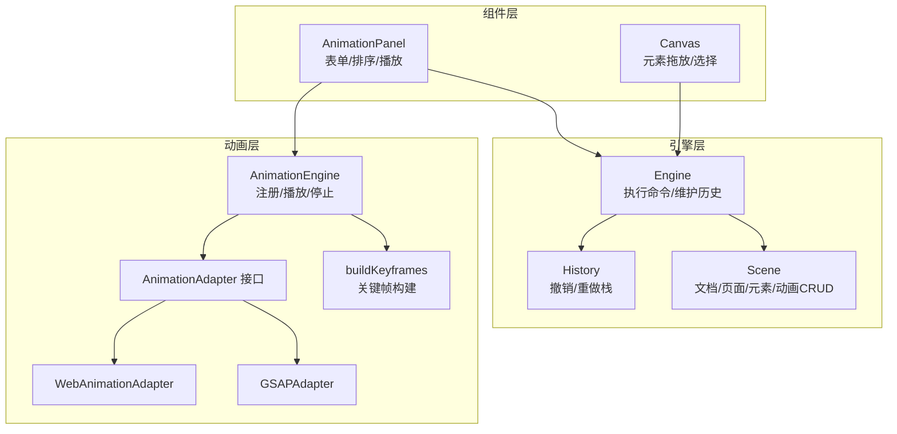
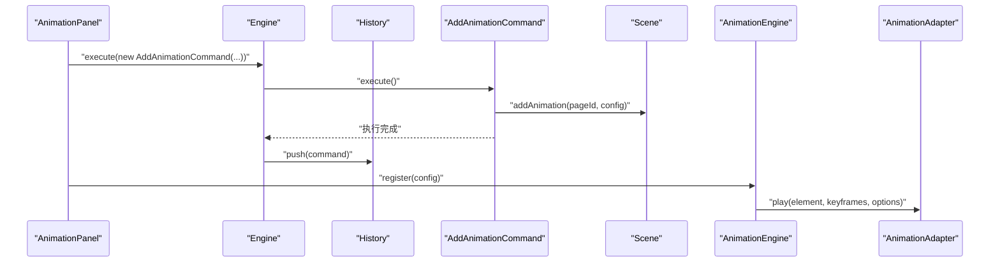
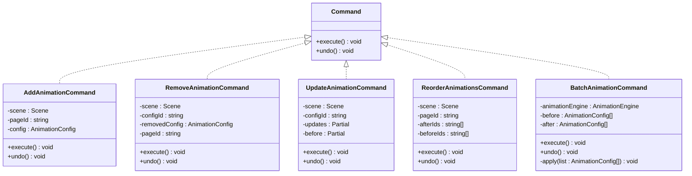
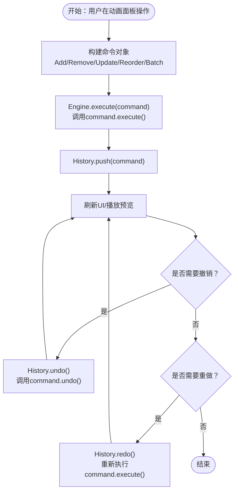
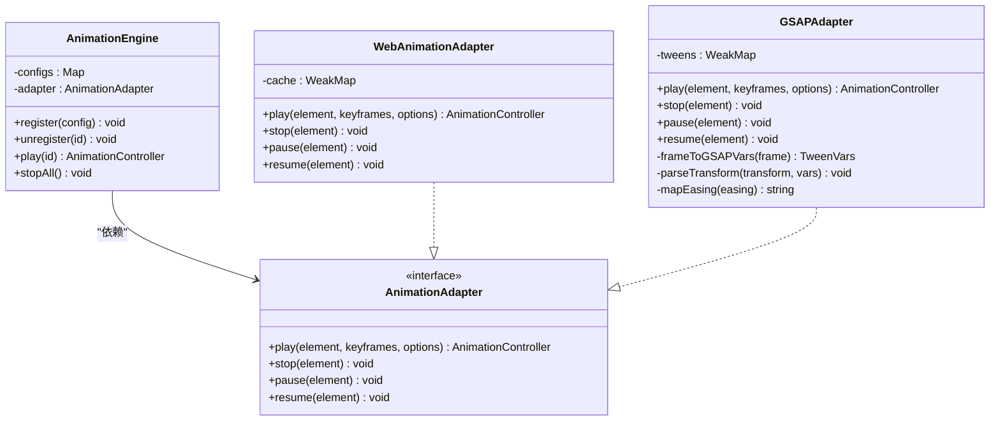
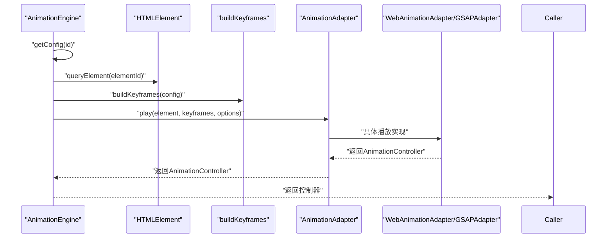
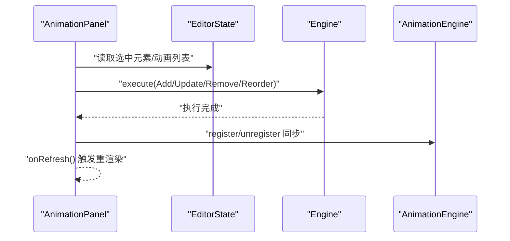
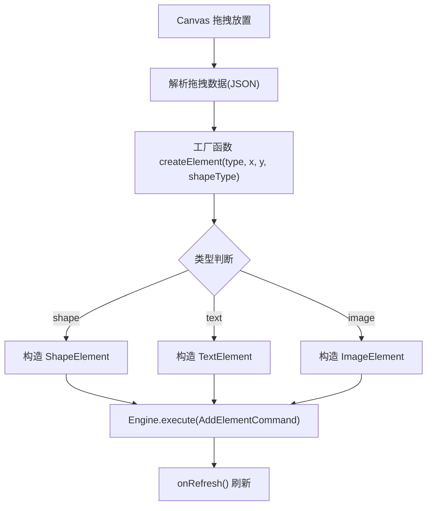
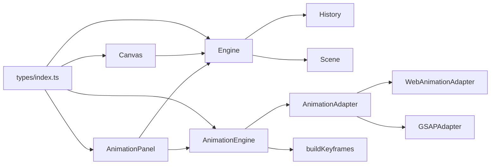

# 设计模式

<cite>
**本文引用的文件**
- [src/engine/commands.ts](file://src/engine/commands.ts)
- [src/engine/animationCommands.ts](file://src/engine/animationCommands.ts)
- [src/engine/history.ts](file://src/engine/history.ts)
- [src/engine/engine.ts](file://src/engine/engine.ts)
- [src/engine/scene.ts](file://src/engine/scene.ts)
- [src/animation/adapter.ts](file://src/animation/adapter.ts)
- [src/animation/gsapAdapter.ts](file://src/animation/gsapAdapter.ts)
- [src/animation/webAnimationAdapter.ts](file://src/animation/webAnimationAdapter.ts)
- [src/animation/engine.ts](file://src/animation/engine.ts)
- [src/animation/buildKeyframes.ts](file://src/animation/buildKeyframes.ts)
- [src/animation/index.ts](file://src/animation/index.ts)
- [src/types/index.ts](file://src/types/index.ts)
- [src/types/animation.ts](file://src/types/animation.ts)
- [src/components/AnimationPanel.tsx](file://src/components/AnimationPanel.tsx)
- [src/components/Canvas.tsx](file://src/components/Canvas.tsx)
</cite>

## 目录
1. [引言](#引言)
2. [项目结构](#项目结构)
3. [核心组件](#核心组件)
4. [架构总览](#架构总览)
5. [详细组件分析](#详细组件分析)
6. [依赖分析](#依赖分析)
7. [性能考虑](#性能考虑)
8. [故障排查指南](#故障排查指南)
9. [结论](#结论)
10. [附录](#附录)

## 引言
本技术文档聚焦于AI课件编辑器中“设计模式”的实现与协作，重点覆盖以下内容：
- 命令模式在引擎系统中的实现：命令对象的创建、执行与撤销机制，历史栈管理与批量命令。
- 适配器模式在动画系统中的应用：统一不同动画库（Web Animations API 与 GSAP）的接口。
- 观察者模式在React组件更新中的作用：通过状态变化驱动UI重渲染。
- 工厂模式在元素创建中的使用：根据拖拽类型与参数生成具体元素实例。

文档将结合代码路径与图示，解释每种设计模式解决的问题、带来的好处，以及模式间的协同关系与最佳实践。

## 项目结构
项目采用按功能域分层的组织方式：
- engine：核心业务引擎，包含命令、历史、场景与时间线等。
- animation：动画引擎与适配器，负责构建关键帧与播放控制。
- components：React组件，承载用户交互与视图更新。
- types：共享类型定义，贯穿引擎与组件层。
- renderer：元素渲染逻辑（与本文主题关联较弱，不展开）。

图表来源
- [src/engine/engine.ts:1-54](file://src/engine/engine.ts#L1-L54)
- [src/engine/history.ts:1-45](file://src/engine/history.ts#L1-L45)
- [src/engine/scene.ts:1-273](file://src/engine/scene.ts#L1-L273)
- [src/animation/engine.ts:1-120](file://src/animation/engine.ts#L1-L120)
- [src/animation/adapter.ts:1-27](file://src/animation/adapter.ts#L1-L27)
- [src/animation/webAnimationAdapter.ts:1-67](file://src/animation/webAnimationAdapter.ts#L1-L67)
- [src/animation/gsapAdapter.ts:1-140](file://src/animation/gsapAdapter.ts#L1-L140)
- [src/animation/buildKeyframes.ts:1-125](file://src/animation/buildKeyframes.ts#L1-L125)
- [src/components/AnimationPanel.tsx:1-857](file://src/components/AnimationPanel.tsx#L1-L857)
- [src/components/Canvas.tsx:1-191](file://src/components/Canvas.tsx#L1-L191)

章节来源
- [src/engine/engine.ts:1-54](file://src/engine/engine.ts#L1-L54)
- [src/animation/engine.ts:1-120](file://src/animation/engine.ts#L1-L120)
- [src/components/AnimationPanel.tsx:1-857](file://src/components/AnimationPanel.tsx#L1-L857)

## 核心组件
- 命令接口与具体命令：定义统一的execute/undo契约，并在场景对象上进行数据变更。
- 历史栈：维护撤销/重做命令序列，支持canUndo/canRedo查询。
- 动画适配器：抽象不同动画库的播放/暂停/恢复/停止能力。
- 动画引擎：注册配置、构建关键帧、委托适配器播放。
- React组件：通过状态变化触发UI更新；在动画面板中以命令形式修改场景与动画引擎。

章节来源
- [src/types/index.ts:107-110](file://src/types/index.ts#L107-L110)
- [src/engine/commands.ts:1-280](file://src/engine/commands.ts#L1-L280)
- [src/engine/history.ts:1-45](file://src/engine/history.ts#L1-L45)
- [src/animation/adapter.ts:1-27](file://src/animation/adapter.ts#L1-L27)
- [src/animation/engine.ts:1-120](file://src/animation/engine.ts#L1-L120)
- [src/components/AnimationPanel.tsx:1-857](file://src/components/AnimationPanel.tsx#L1-L857)

## 架构总览
下图展示了命令模式与适配器模式在系统中的协作关系，以及React组件如何通过命令驱动引擎与动画引擎：

图表来源
- [src/components/AnimationPanel.tsx:203-215](file://src/components/AnimationPanel.tsx#L203-L215)
- [src/engine/engine.ts:29-32](file://src/engine/engine.ts#L29-L32)
- [src/engine/commands.ts:74-88](file://src/engine/commands.ts#L74-L88)
- [src/engine/scene.ts:179-183](file://src/engine/scene.ts#L179-L183)
- [src/animation/engine.ts:52-70](file://src/animation/engine.ts#L52-L70)
- [src/animation/adapter.ts:7-26](file://src/animation/adapter.ts#L7-L26)

## 详细组件分析

### 命令模式：引擎系统中的实现
命令模式用于封装“操作”为对象，使操作请求者与执行者解耦，并支持撤销/重做。在本项目中：
- 命令接口：定义execute与undo两个方法。
- 具体命令：如AddElementCommand、MoveElementCommand、DeleteElementCommand、AddAnimationCommand、RemoveAnimationCommand、UpdateAnimationCommand、ReorderAnimationsCommand等。
- 批量命令：BatchAnimationCommand捕获动画配置的前后快照，避免内部注册/注销导致的命令爆炸。
- 历史管理：History维护两个栈，支持撤销与重做，并提供canUndo/canRedo查询。

图表来源
- [src/types/index.ts:107-110](file://src/types/index.ts#L107-L110)
- [src/engine/commands.ts:74-160](file://src/engine/commands.ts#L74-L160)
- [src/engine/animationCommands.ts:14-43](file://src/engine/animationCommands.ts#L14-L43)

图表来源
- [src/engine/engine.ts:29-48](file://src/engine/engine.ts#L29-L48)
- [src/engine/history.ts:7-30](file://src/engine/history.ts#L7-L30)
- [src/components/AnimationPanel.tsx:203-215](file://src/components/AnimationPanel.tsx#L203-L215)

章节来源
- [src/types/index.ts:107-110](file://src/types/index.ts#L107-L110)
- [src/engine/commands.ts:1-280](file://src/engine/commands.ts#L1-L280)
- [src/engine/animationCommands.ts:1-44](file://src/engine/animationCommands.ts#L1-L44)
- [src/engine/history.ts:1-45](file://src/engine/history.ts#L1-L45)
- [src/engine/engine.ts:1-54](file://src/engine/engine.ts#L1-L54)

### 适配器模式：动画系统的统一接口
适配器模式用于统一不同动画库的接口，使上层无需关心底层实现差异。在本项目中：
- AnimationAdapter接口：定义play/stop/pause/resume方法。
- WebAnimationAdapter：基于原生Web Animations API（element.animate）。
- GSAPAdapter：基于GSAP，将WAAPI风格的关键帧映射到fromTo语法，并处理缓动与变换解析。
- AnimationEngine：持有适配器实例，负责查询DOM元素、构建关键帧并调用适配器播放。

图表来源
- [src/animation/adapter.ts:7-26](file://src/animation/adapter.ts#L7-L26)
- [src/animation/webAnimationAdapter.ts:12-66](file://src/animation/webAnimationAdapter.ts#L12-L66)
- [src/animation/gsapAdapter.ts:13-139](file://src/animation/gsapAdapter.ts#L13-L139)
- [src/animation/engine.ts:9-119](file://src/animation/engine.ts#L9-L119)

图表来源
- [src/animation/engine.ts:52-70](file://src/animation/engine.ts#L52-L70)
- [src/animation/buildKeyframes.ts:7-9](file://src/animation/buildKeyframes.ts#L7-L9)
- [src/animation/webAnimationAdapter.ts:15-43](file://src/animation/webAnimationAdapter.ts#L15-L43)
- [src/animation/gsapAdapter.ts:16-60](file://src/animation/gsapAdapter.ts#L16-L60)

章节来源
- [src/animation/adapter.ts:1-27](file://src/animation/adapter.ts#L1-L27)
- [src/animation/webAnimationAdapter.ts:1-67](file://src/animation/webAnimationAdapter.ts#L1-L67)
- [src/animation/gsapAdapter.ts:1-140](file://src/animation/gsapAdapter.ts#L1-L140)
- [src/animation/engine.ts:1-120](file://src/animation/engine.ts#L1-L120)
- [src/animation/buildKeyframes.ts:1-125](file://src/animation/buildKeyframes.ts#L1-L125)

### 观察者模式：React组件更新
在React中，组件通过状态变化（如selectedElementIds、动画列表等）驱动UI重渲染。例如：
- AnimationPanel：维护本地表单状态与受控字段，读取当前选中元素与动画列表，响应拖拽排序、播放/停止等事件。
- Canvas：根据场景数据渲染元素，响应点击与拖放事件，更新编辑器状态并触发刷新。

图表来源
- [src/components/AnimationPanel.tsx:87-92](file://src/components/AnimationPanel.tsx#L87-L92)
- [src/components/AnimationPanel.tsx:203-215](file://src/components/AnimationPanel.tsx#L203-L215)
- [src/components/Canvas.tsx:34-37](file://src/components/Canvas.tsx#L34-L37)

章节来源
- [src/components/AnimationPanel.tsx:1-857](file://src/components/AnimationPanel.tsx#L1-L857)
- [src/components/Canvas.tsx:1-191](file://src/components/Canvas.tsx#L1-L191)
- [src/types/index.ts:144-149](file://src/types/index.ts#L144-L149)

### 工厂模式：元素创建
Canvas在处理拖拽放置时，根据拖拽数据类型与形状类型，调用工厂函数创建具体元素实例（形状、文本、图片），并将其加入场景。

图表来源
- [src/components/Canvas.tsx:44-69](file://src/components/Canvas.tsx#L44-L69)
- [src/components/Canvas.tsx:130-190](file://src/components/Canvas.tsx#L130-L190)
- [src/engine/commands.ts:4-18](file://src/engine/commands.ts#L4-L18)

章节来源
- [src/components/Canvas.tsx:1-191](file://src/components/Canvas.tsx#L1-L191)
- [src/engine/commands.ts:1-280](file://src/engine/commands.ts#L1-L280)

## 依赖分析
- 命令层依赖场景层：命令在执行时直接调用Scene的方法进行数据变更。
- 引擎层依赖历史层：Engine在执行命令后将命令压入History。
- 动画引擎依赖适配器：AnimationEngine通过适配器播放动画，适配器可替换。
- 组件层依赖引擎与动画引擎：React组件通过命令修改场景与动画配置，并同步到动画引擎。
- 类型层为全栈共享：命令接口、动画配置、编辑器状态等类型在多处复用。

图表来源
- [src/components/AnimationPanel.tsx:1-857](file://src/components/AnimationPanel.tsx#L1-L857)
- [src/components/Canvas.tsx:1-191](file://src/components/Canvas.tsx#L1-L191)
- [src/engine/engine.ts:1-54](file://src/engine/engine.ts#L1-L54)
- [src/engine/history.ts:1-45](file://src/engine/history.ts#L1-L45)
- [src/engine/scene.ts:1-273](file://src/engine/scene.ts#L1-L273)
- [src/animation/engine.ts:1-120](file://src/animation/engine.ts#L1-L120)
- [src/animation/adapter.ts:1-27](file://src/animation/adapter.ts#L1-L27)
- [src/animation/webAnimationAdapter.ts:1-67](file://src/animation/webAnimationAdapter.ts#L1-L67)
- [src/animation/gsapAdapter.ts:1-140](file://src/animation/gsapAdapter.ts#L1-L140)
- [src/animation/buildKeyframes.ts:1-125](file://src/animation/buildKeyframes.ts#L1-L125)
- [src/types/index.ts:1-159](file://src/types/index.ts#L1-L159)

章节来源
- [src/engine/engine.ts:1-54](file://src/engine/engine.ts#L1-L54)
- [src/animation/engine.ts:1-120](file://src/animation/engine.ts#L1-L120)
- [src/types/index.ts:1-159](file://src/types/index.ts#L1-L159)

## 性能考虑
- 关键帧构建纯函数化：buildKeyframes不依赖DOM，减少副作用，便于测试与复用。
- 适配器弱引用缓存：WebAnimationAdapter与GSAPAdapter分别使用WeakMap缓存动画实例或Tween，避免内存泄漏。
- 批量命令：BatchAnimationCommand一次性应用所有动画配置变更，降低多次注册/注销开销。
- DOM查询范围限定：AnimationEngine支持设置scopeRoot，仅在指定容器内查询元素，提升查找效率并避免跨容器干扰。
- 历史栈空间控制：History仅保存必要命令，撤销/重做后清空对应栈顶，避免无限增长。

章节来源
- [src/animation/buildKeyframes.ts:1-125](file://src/animation/buildKeyframes.ts#L1-L125)
- [src/animation/webAnimationAdapter.ts:1-67](file://src/animation/webAnimationAdapter.ts#L1-L67)
- [src/animation/gsapAdapter.ts:1-140](file://src/animation/gsapAdapter.ts#L1-L140)
- [src/engine/animationCommands.ts:1-44](file://src/engine/animationCommands.ts#L1-L44)
- [src/animation/engine.ts:19-22](file://src/animation/engine.ts#L19-L22)
- [src/engine/history.ts:1-45](file://src/engine/history.ts#L1-L45)

## 故障排查指南
- 撤销/重做无效
  - 检查History栈是否为空，确认Engine.canUndo()/canRedo()状态。
  - 章节来源
    - [src/engine/history.ts:32-38](file://src/engine/history.ts#L32-L38)
    - [src/engine/engine.ts:42-48](file://src/engine/engine.ts#L42-L48)
- 动画无法播放
  - 确认AnimationEngine已注册配置且元素存在，检查scopeRoot设置是否正确。
  - 章节来源
    - [src/animation/engine.ts:52-70](file://src/animation/engine.ts#L52-L70)
    - [src/animation/engine.ts:19-22](file://src/animation/engine.ts#L19-L22)
- 适配器播放异常
  - 若使用GSAP，检查easing映射与transform解析是否符合预期；若使用Web Animations，检查fill/iterations等选项。
  - 章节来源
    - [src/animation/gsapAdapter.ts:128-138](file://src/animation/gsapAdapter.ts#L128-L138)
    - [src/animation/webAnimationAdapter.ts:23-29](file://src/animation/webAnimationAdapter.ts#L23-L29)
- 批量动画未生效
  - 确认BatchAnimationCommand的apply流程是否先注销再注册，确保前后状态一致。
  - 章节来源
    - [src/engine/animationCommands.ts:35-42](file://src/engine/animationCommands.ts#L35-L42)

## 结论
本项目通过命令模式实现了可撤销的编辑流程，借助历史栈保障了操作的可控性；通过适配器模式屏蔽了动画库差异，提升了扩展性；通过React的状态驱动实现了组件级的观察者更新；通过工厂模式简化了元素创建流程。这些设计模式相互协作，形成了清晰、可维护且易于扩展的课件编辑器架构。

## 附录
- 相关类型定义
  - 命令接口与编辑器状态：参见类型文件
    - [src/types/index.ts:107-110](file://src/types/index.ts#L107-L110)
    - [src/types/index.ts:144-149](file://src/types/index.ts#L144-L149)
  - 动画配置与关键帧格式：参见类型文件
    - [src/types/animation.ts:26-98](file://src/types/animation.ts#L26-L98)
- 导出入口
  - 动画模块导出：适配器、引擎与工具函数
    - [src/animation/index.ts:1-8](file://src/animation/index.ts#L1-L8)