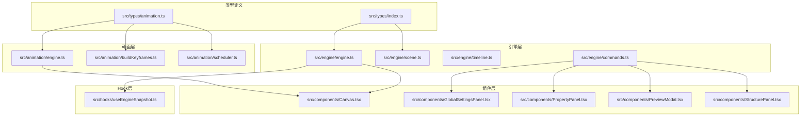
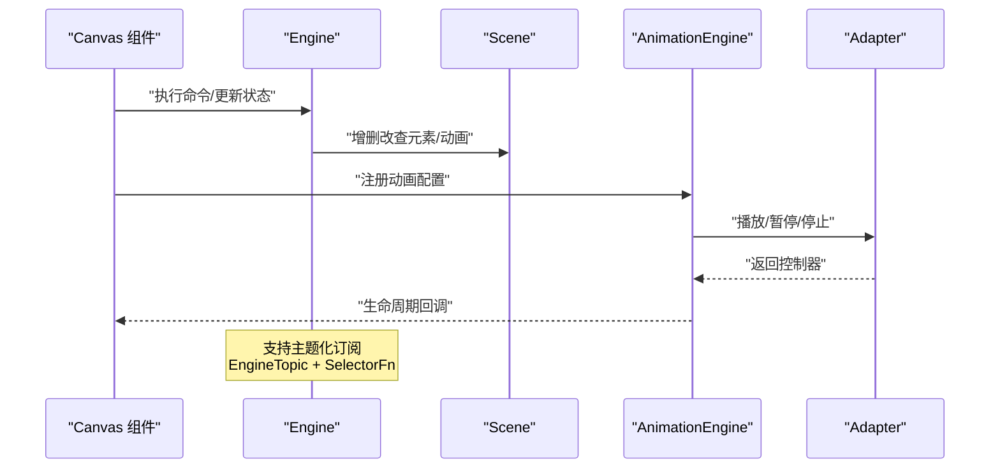
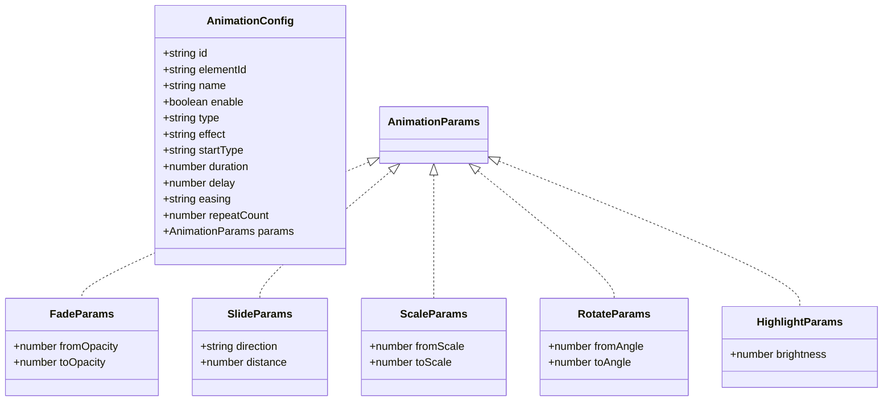
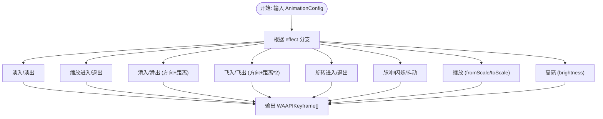
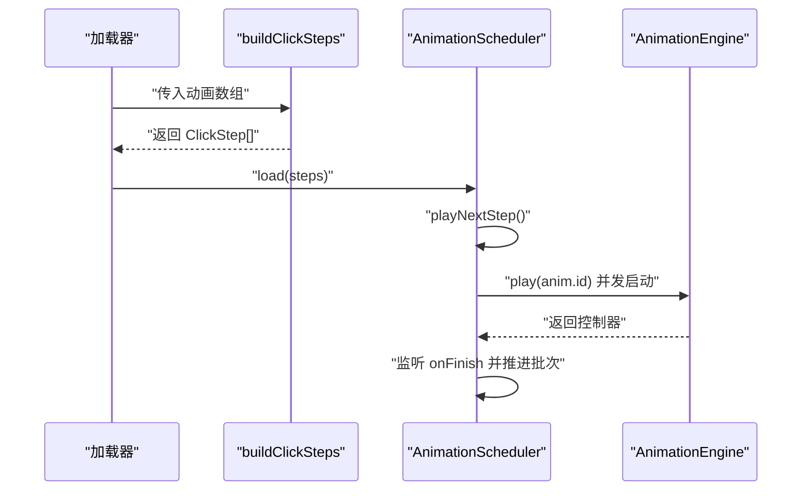
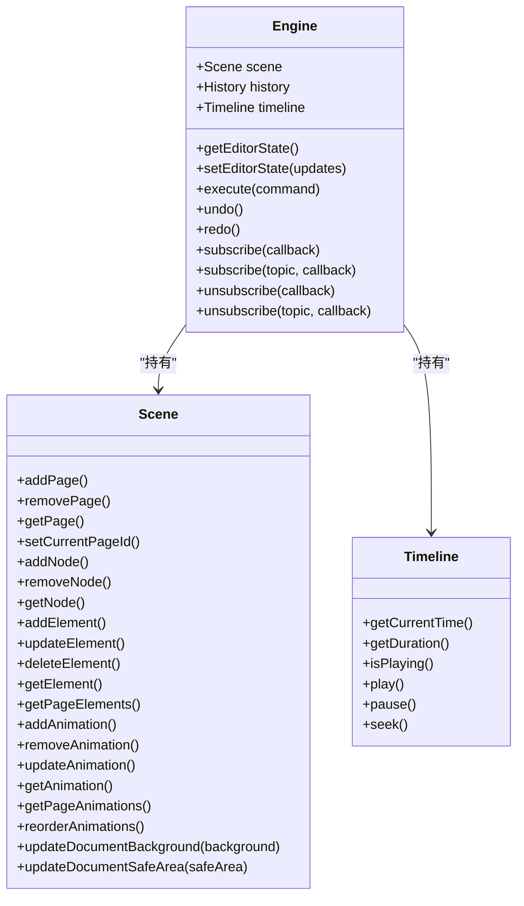
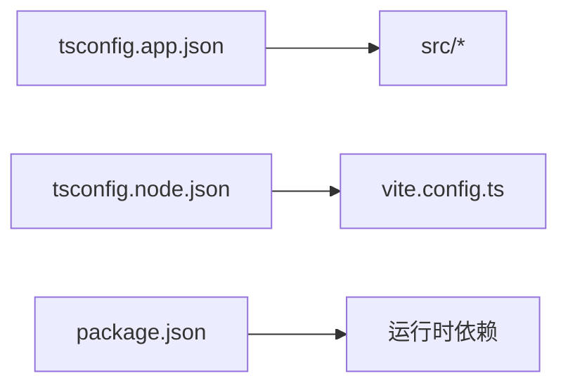

# 类型系统

<cite>
**本文引用的文件**
- [src/types/index.ts](file://src/types/index.ts)
- [src/types/animation.ts](file://src/types/animation.ts)
- [src/engine/engine.ts](file://src/engine/engine.ts)
- [src/engine/scene.ts](file://src/engine/scene.ts)
- [src/engine/timeline.ts](file://src/engine/timeline.ts)
- [src/engine/commands.ts](file://src/engine/commands.ts)
- [src/animation/engine.ts](file://src/animation/engine.ts)
- [src/animation/buildKeyframes.ts](file://src/animation/buildKeyframes.ts)
- [src/animation/scheduler.ts](file://src/animation/scheduler.ts)
- [src/components/Canvas.tsx](file://src/components/Canvas.tsx)
- [src/components/GlobalSettingsPanel.tsx](file://src/components/GlobalSettingsPanel.tsx)
- [src/components/PropertyPanel.tsx](file://src/components/PropertyPanel.tsx)
- [src/components/PreviewModal.tsx](file://src/components/PreviewModal.tsx)
- [src/components/StructurePanel.tsx](file://src/components/StructurePanel.tsx)
- [src/hooks/useEngineSnapshot.ts](file://src/hooks/useEngineSnapshot.ts)
- [package.json](file://package.json)
- [tsconfig.app.json](file://tsconfig.app.json)
- [tsconfig.node.json](file://tsconfig.node.json)
- [tsconfig.json](file://tsconfig.json)
</cite>

## 目录
1. [引言](#引言)
2. [项目结构](#项目结构)
3. [核心组件](#核心组件)
4. [架构总览](#架构总览)
5. [详细组件分析](#详细组件分析)
6. [依赖分析](#依赖分析)
7. [性能考虑](#性能考虑)
8. [故障排查指南](#故障排查指南)
9. [结论](#结论)
10. [附录](#附录)

## 引言
本文件系统性梳理该编辑器工程的类型系统，覆盖 TypeScript 类型定义、接口规范与类型安全保障机制。重点包括：
- 核心数据模型（元素、页面、文档、节点、结构项）
- 元素类型与变体类型（ShapeElement、TextElement、ImageElement、GroupElement）
- 页面背景与安全区域配置类型
- 动画配置类型与调度模型
- 类型推导规则、泛型使用模式与类型守卫
- 类型扩展指南、自定义类型定义与类型测试方法
- 演进策略、向后兼容性与迁移建议
- 类型错误诊断与调试技巧

## 项目结构
类型系统主要分布在以下位置：
- 公共类型：src/types/index.ts
- 动画类型：src/types/animation.ts
- 引擎与场景：src/engine/*
- 动画引擎与调度：src/animation/*
- 组件层：src/components/*
- Hook 层：src/hooks/*



**图表来源**
- [src/types/index.ts:1-191](file://src/types/index.ts#L1-L191)
- [src/types/animation.ts:1-113](file://src/types/animation.ts#L1-L113)
- [src/engine/engine.ts:1-127](file://src/engine/engine.ts#L1-L127)
- [src/engine/scene.ts:1-288](file://src/engine/scene.ts#L1-L288)
- [src/engine/commands.ts:224-254](file://src/engine/commands.ts#L224-L254)
- [src/animation/engine.ts:1-120](file://src/animation/engine.ts#L1-L120)
- [src/animation/buildKeyframes.ts:1-125](file://src/animation/buildKeyframes.ts#L1-L125)
- [src/animation/scheduler.ts:1-160](file://src/animation/scheduler.ts#L1-L160)
- [src/components/Canvas.tsx:1-248](file://src/components/Canvas.tsx#L1-L248)
- [src/components/GlobalSettingsPanel.tsx:1-136](file://src/components/GlobalSettingsPanel.tsx#L1-L136)
- [src/components/PropertyPanel.tsx:37-474](file://src/components/PropertyPanel.tsx#L37-L474)
- [src/components/PreviewModal.tsx:1-388](file://src/components/PreviewModal.tsx#L1-L388)
- [src/components/StructurePanel.tsx:25-224](file://src/components/StructurePanel.tsx#L25-L224)
- [src/hooks/useEngineSnapshot.ts:1-23](file://src/hooks/useEngineSnapshot.ts#L1-L23)

**章节来源**
- [src/types/index.ts:1-191](file://src/types/index.ts#L1-L191)
- [src/types/animation.ts:1-113](file://src/types/animation.ts#L1-L113)
- [src/engine/engine.ts:1-127](file://src/engine/engine.ts#L1-L127)
- [src/engine/scene.ts:1-288](file://src/engine/scene.ts#L1-L288)
- [src/engine/commands.ts:224-254](file://src/engine/commands.ts#L224-L254)
- [src/animation/engine.ts:1-120](file://src/animation/engine.ts#L1-L120)
- [src/animation/buildKeyframes.ts:1-125](file://src/animation/buildKeyframes.ts#L1-L125)
- [src/animation/scheduler.ts:1-160](file://src/animation/scheduler.ts#L1-L160)
- [src/components/Canvas.tsx:1-248](file://src/components/Canvas.tsx#L1-L248)
- [src/components/GlobalSettingsPanel.tsx:1-136](file://src/components/GlobalSettingsPanel.tsx#L1-L136)
- [src/components/PropertyPanel.tsx:37-474](file://src/components/PropertyPanel.tsx#L37-L474)
- [src/components/PreviewModal.tsx:1-388](file://src/components/PreviewModal.tsx#L1-L388)
- [src/components/StructurePanel.tsx:25-224](file://src/components/StructurePanel.tsx#L25-L224)
- [src/hooks/useEngineSnapshot.ts:1-23](file://src/hooks/useEngineSnapshot.ts#L1-L23)

## 核心组件
本节聚焦公共类型与动画类型，说明其职责、关系与约束。

- 元素类型体系
  - 基类：BaseElement，统一坐标、尺寸、旋转、透明度、可见性、父子关系等字段
  - 变体：ShapeElement、TextElement、ImageElement、GroupElement，通过字面量联合类型与只读字段确保类型安全
  - 联合类型 Element = ShapeElement | TextElement | ImageElement | GroupElement，用于多态处理
- 文档与结构
  - Document/Page/Node/StructureItem：以 Record 映射存储，支持 O(1) 查找；结构项列表维护展示顺序
- 页面背景与安全区域
  - **新增** PAGE_DEFAULT_WIDTH/PAGE_DEFAULT_HEIGHT：标准化画布尺寸常量
  - **新增** PageBackground：支持固态颜色、多色停止渐变和图像背景的联合类型
  - **新增** SafeArea：定义页面安全区域的四边距配置
- 拖拽吸附与对齐
  - Guide/SnapResult：对齐参考线与偏移结果，用于移动与对齐交互
- 命令接口
  - Command：execute/undo 约定，配合历史管理
  - **新增** UpdateDocumentBackgroundCommand/UpdateDocumentSafeAreaCommand：专门处理文档级别的背景和安全区域更新
- 动画类型
  - AnimationType、AnimationEffect、StartType、EasingPreset、SlideDirection：枚举化约束
  - AnimationConfig：动画配置主类型，包含时序、参数、重复次数、起始方式等
  - AnimationParams 联合类型：按效果细分参数结构
  - WAAPIKeyframe/AnimationOptions/AnimationController：Web Animations API 兼容层
  - AnimationBatch/ClickStep：点击步骤与批次执行模型
- **新增** 引擎主题与订阅类型
  - EngineTopic：'scene' | 'editorState' | 'history' | 'all'，用于主题化通知
  - SelectorFn<T>：选择器函数类型，用于精确订阅
  - ComparatorFn<T>：比较器函数类型，用于订阅去重

**章节来源**
- [src/types/index.ts:69-116](file://src/types/index.ts#L69-L116)
- [src/types/animation.ts:4-113](file://src/types/animation.ts#L4-L113)
- [src/engine/engine.ts:7-13](file://src/engine/engine.ts#L7-L13)
- [src/engine/commands.ts:224-254](file://src/engine/commands.ts#L224-L254)

## 架构总览
类型系统贯穿"组件层 → 引擎层 → 动画层"的调用链路，确保跨层的数据一致性与行为契约。



**图表来源**
- [src/components/Canvas.tsx:22-128](file://src/components/Canvas.tsx#L22-L128)
- [src/engine/engine.ts:29-48](file://src/engine/engine.ts#L29-L48)
- [src/engine/scene.ts:94-233](file://src/engine/scene.ts#L94-L233)
- [src/animation/engine.ts:53-112](file://src/animation/engine.ts#L53-L112)

## 详细组件分析

### 数据模型与元素类型
- 设计要点
  - 使用字面量联合类型限定元素类型与效果，避免运行时字符串拼写错误
  - 通过只读字段与严格属性集合，减少可变性带来的副作用
  - 使用 Record 映射承载元素与动画集合，提升查找效率
- 关键类型路径
  - 元素基类与变体：[src/types/index.ts:12-54](file://src/types/index.ts#L12-L54)
  - 文档/页面/节点/结构项：[src/types/index.ts:60-84](file://src/types/index.ts#L60-L84)
  - **新增** 页面背景与安全区域：[src/types/index.ts:69-116](file://src/types/index.ts#L69-L116)
  - 拖拽吸附与对齐：[src/types/index.ts:90-101](file://src/types/index.ts#L90-L101)
  - 命令接口：[src/types/index.ts:107-110](file://src/types/index.ts#L107-L110)

```mermaid
classDiagram
class BaseElement {
+string id
+string type
+string name
+number x
+number y
+number width
+number height
+number rotation
+number opacity
+boolean visible
+string|null parentId
+string[] childrenIds
}
class ShapeElement {
+string type
+string shapeType
+string fill
+string stroke
+number strokeWidth
}
class TextElement {
+string type
+string text
+number fontSize
+string fontFamily
+string color
+string align
}
class ImageElement {
+string type
+string src
+string objectFit
}
class GroupElement {
+string type
}
class Element {
}
class PageBackgroundSolid {
+string type
+string color
}
class PageBackgroundGradient {
+string type
+number angle
+{offset : number, color : string}[] stops
}
class PageBackgroundImage {
+string type
+string src
+string fit
+number opacity
}
class PageBackground {
}
class SafeArea {
+number top
+number right
+number bottom
+number left
}
BaseElement <|-- ShapeElement
BaseElement <|-- TextElement
BaseElement <|-- ImageElement
BaseElement <|-- GroupElement
Element <|.. ShapeElement
Element <|.. TextElement
Element <|.. ImageElement
Element <|.. GroupElement
PageBackground <|.. PageBackgroundSolid
PageBackground <|.. PageBackgroundGradient
PageBackground <|.. PageBackgroundImage
```

**图表来源**
- [src/types/index.ts:12-54](file://src/types/index.ts#L12-L54)
- [src/types/index.ts:69-116](file://src/types/index.ts#L69-L116)

**章节来源**
- [src/types/index.ts:12-54](file://src/types/index.ts#L12-L54)
- [src/types/index.ts:69-116](file://src/types/index.ts#L69-L116)

### 页面背景与安全区域配置
- 设计要点
  - **新增** PAGE_DEFAULT_WIDTH 和 PAGE_DEFAULT_HEIGHT 常量提供标准化的画布尺寸
  - **新增** PageBackground 联合类型统一管理页面背景配置，支持三种类型：
    - 固态颜色：PageBackgroundSolid，包含颜色值
    - 多色停止渐变：PageBackgroundGradient，包含角度和颜色停止点数组
    - 图像背景：PageBackgroundImage，包含源地址、填充方式和不透明度
  - **新增** SafeArea 类型定义页面安全区域的四边距配置
  - getBackgroundStyle 函数提供类型安全的背景样式生成
- 关键实现路径
  - 背景样式生成：[src/components/Canvas.tsx:12-32](file://src/components/Canvas.tsx#L12-L32)
  - **新增** 页面背景类型定义：[src/types/index.ts:69-97](file://src/types/index.ts#L69-L97)
  - **新增** 安全区域类型定义：[src/types/index.ts:92-97](file://src/types/index.ts#L92-L97)
  - **新增** 常量定义：[src/types/index.ts:69-70](file://src/types/index.ts#L69-L70)
  - **新增** 背景样式处理（预览模式）：[src/components/PreviewModal.tsx:9-29](file://src/components/PreviewModal.tsx#L9-L29)
  - **新增** 背景样式处理（缩略图模式）：[src/components/StructurePanel.tsx:34-54](file://src/components/StructurePanel.tsx#L34-L54)

```mermaid
classDiagram
class PageBackground {
<<union>>
}
class PageBackgroundSolid {
+string type
+string color
}
class PageBackgroundGradient {
+string type
+number angle
+{offset : number, color : string}[] stops
}
class PageBackgroundImage {
+string type
+string src
+string fit
+number opacity
}
class SafeArea {
+number top
+number right
+number bottom
+number left
}
PageBackground <|.. PageBackgroundSolid
PageBackground <|.. PageBackgroundGradient
PageBackground <|.. PageBackgroundImage
```

**图表来源**
- [src/types/index.ts:69-97](file://src/types/index.ts#L69-L97)

**章节来源**
- [src/types/index.ts:69-97](file://src/types/index.ts#L69-L97)
- [src/components/Canvas.tsx:12-32](file://src/components/Canvas.tsx#L12-L32)
- [src/components/PreviewModal.tsx:9-29](file://src/components/PreviewModal.tsx#L9-L29)
- [src/components/StructurePanel.tsx:34-54](file://src/components/StructurePanel.tsx#L34-L54)

### 动画配置与参数类型
- 设计要点
  - AnimationConfig 将"类型/效果/起始方式/缓动/时长/延迟/重复"等全部收敛到单一配置对象
  - AnimationParams 通过联合类型区分不同效果的参数结构，结合类型守卫在构建阶段进行分支处理
  - WAAPIKeyframe 与 AnimationOptions 保持与 Web Animations API 的兼容性
- 关键类型路径
  - 动画配置与参数：[src/types/animation.ts:26-70](file://src/types/animation.ts#L26-L70)
  - WAAPI 兼容与控制器：[src/types/animation.ts:77-98](file://src/types/animation.ts#L77-L98)
  - 批次与点击步骤：[src/types/animation.ts:104-113](file://src/types/animation.ts#L104-L113)



**图表来源**
- [src/types/animation.ts:26-70](file://src/types/animation.ts#L26-L70)
- [src/types/animation.ts:41-70](file://src/types/animation.ts#L41-L70)

**章节来源**
- [src/types/animation.ts:26-70](file://src/types/animation.ts#L26-L70)
- [src/types/animation.ts:41-70](file://src/types/animation.ts#L41-L70)

### 动画键帧构建流程
- 设计要点
  - buildKeyframes 为纯函数，输入 AnimationConfig，输出 WAAPIKeyframe[]
  - 通过 switch 分发不同效果，利用类型守卫将 params 断言为具体参数类型
  - SlideDirection 与距离计算封装在内部工具函数中，保证可测试性
- 关键实现路径
  - 键帧构建入口：[src/animation/buildKeyframes.ts:7-9](file://src/animation/buildKeyframes.ts#L7-L9)
  - 效果分支与参数断言：[src/animation/buildKeyframes.ts:11-109](file://src/animation/buildKeyframes.ts#L11-L109)
  - 方向与位移计算：[src/animation/buildKeyframes.ts:111-124](file://src/animation/buildKeyframes.ts#L111-L124)



**图表来源**
- [src/animation/buildKeyframes.ts:7-109](file://src/animation/buildKeyframes.ts#L7-L109)

**章节来源**
- [src/animation/buildKeyframes.ts:7-109](file://src/animation/buildKeyframes.ts#L7-L109)

### 动画调度与批次执行模型
- 设计要点
  - buildClickSteps 将动画序列转换为 ClickStep 列表，遵循 startType 决策：click 新建 Step、withPrev 追加到当前 Batch、afterPrev 在当前 Step 新建 Batch
  - AnimationScheduler 实现"Step → Batch → 并发执行"的层次化调度，支持前进/回退与取消
- 关键实现路径
  - 步骤构建：[src/animation/scheduler.ts:13-49](file://src/animation/scheduler.ts#L13-L49)
  - 调度器类与生命周期：[src/animation/scheduler.ts:56-160](file://src/animation/scheduler.ts#L56-L160)



**图表来源**
- [src/animation/scheduler.ts:13-49](file://src/animation/scheduler.ts#L13-L49)
- [src/animation/scheduler.ts:56-160](file://src/animation/scheduler.ts#L56-L160)
- [src/animation/engine.ts:53-112](file://src/animation/engine.ts#L53-L112)

**章节来源**
- [src/animation/scheduler.ts:13-49](file://src/animation/scheduler.ts#L13-L49)
- [src/animation/scheduler.ts:56-160](file://src/animation/scheduler.ts#L56-L160)

### 引擎与场景的数据流
- 设计要点
  - Engine 持有 Scene、History、Timeline，并通过 setEditorState 提供编辑器状态管理
  - Scene 对 Document 进行 CRUD，维护元素与动画的映射与父子关系
  - Timeline 提供时间轴播放/暂停/跳转能力
  - **新增** 支持主题化订阅：EngineTopic 定义主题，SelectorFn/ComparatorFn 为未来精确订阅做准备
  - **新增** 支持文档级别的背景和安全区域更新：updateDocumentBackground/updateDocumentSafeArea
- 关键实现路径
  - 引擎构造与状态：[src/engine/engine.ts:7-49](file://src/engine/engine.ts#L7-L49)
  - 场景元素/动画操作：[src/engine/scene.ts:94-233](file://src/engine/scene.ts#L94-L233)
  - **新增** 文档背景和安全区域更新：[src/engine/scene.ts:14-20](file://src/engine/scene.ts#L14-L20)
  - 时间轴播放循环：[src/engine/timeline.ts:25-64](file://src/engine/timeline.ts#L25-L64)
  - **新增** 主题化订阅：[src/engine/engine.ts:7-13](file://src/engine/engine.ts#L7-L13)



**图表来源**
- [src/engine/engine.ts:7-49](file://src/engine/engine.ts#L7-L49)
- [src/engine/scene.ts:3-288](file://src/engine/scene.ts#L3-L288)
- [src/engine/timeline.ts:1-66](file://src/engine/timeline.ts#L1-L66)

**章节来源**
- [src/engine/engine.ts:7-49](file://src/engine/engine.ts#L7-L49)
- [src/engine/scene.ts:3-288](file://src/engine/scene.ts#L3-L288)
- [src/engine/timeline.ts:1-66](file://src/engine/timeline.ts#L1-L66)

### 组件层与类型绑定
- 设计要点
  - Canvas 接收 Engine 与 AnimationEngine，通过 setScopeRoot 将动画作用域限定在画布容器内
  - 渲染层通过 renderElement 渲染元素，Canvas 负责事件分发与选中状态
  - **新增** useEngineSnapshot/useEngineTopicSnapshot Hook 支持主题化订阅
  - **新增** getBackgroundStyle 函数统一处理不同类型的页面背景样式
  - **新增** 全局设置面板和属性面板支持页面背景和安全区域配置
- 关键实现路径
  - 画布与动画作用域：[src/components/Canvas.tsx:27-32](file://src/components/Canvas.tsx#L27-L32)
  - 元素创建与类型断言：[src/components/Canvas.tsx:130-190](file://src/components/Canvas.tsx#L130-L190)
  - **新增** 背景样式处理：[src/components/Canvas.tsx:12-32](file://src/components/Canvas.tsx#L12-L32)
  - **新增** 全局设置面板集成：[src/components/GlobalSettingsPanel.tsx:32-136](file://src/components/GlobalSettingsPanel.tsx#L32-L136)
  - **新增** 属性面板集成：[src/components/PropertyPanel.tsx:37-474](file://src/components/PropertyPanel.tsx#L37-L474)
  - **新增** 预览模式背景处理：[src/components/PreviewModal.tsx:9-29](file://src/components/PreviewModal.tsx#L9-L29)
  - **新增** 缩略图模式背景处理：[src/components/StructurePanel.tsx:34-54](file://src/components/StructurePanel.tsx#L34-L54)
  - **新增** 引擎快照 Hook：[src/hooks/useEngineSnapshot.ts:14-22](file://src/hooks/useEngineSnapshot.ts#L14-L22)

**章节来源**
- [src/components/Canvas.tsx:27-32](file://src/components/Canvas.tsx#L27-L32)
- [src/components/Canvas.tsx:130-190](file://src/components/Canvas.tsx#L130-L190)
- [src/components/Canvas.tsx:12-32](file://src/components/Canvas.tsx#L12-L32)
- [src/components/GlobalSettingsPanel.tsx:32-136](file://src/components/GlobalSettingsPanel.tsx#L32-L136)
- [src/components/PropertyPanel.tsx:37-474](file://src/components/PropertyPanel.tsx#L37-L474)
- [src/components/PreviewModal.tsx:9-29](file://src/components/PreviewModal.tsx#L9-L29)
- [src/components/StructurePanel.tsx:34-54](file://src/components/StructurePanel.tsx#L34-L54)
- [src/hooks/useEngineSnapshot.ts:14-22](file://src/hooks/useEngineSnapshot.ts#L14-L22)

### 命令系统与文档级别配置
- 设计要点
  - **新增** UpdateDocumentBackgroundCommand：专门处理文档背景配置的撤销/重做
  - **新增** UpdateDocumentSafeAreaCommand：专门处理文档安全区域配置的撤销/重做
  - 命令系统保持与现有元素操作命令相同的接口约定
- 关键实现路径
  - **新增** 背景配置命令：[src/engine/commands.ts:224-238](file://src/engine/commands.ts#L224-L238)
  - **新增** 安全区域配置命令：[src/engine/commands.ts:240-254](file://src/engine/commands.ts#L240-L254)

**章节来源**
- [src/engine/commands.ts:224-238](file://src/engine/commands.ts#L224-L238)
- [src/engine/commands.ts:240-254](file://src/engine/commands.ts#L240-L254)

## 依赖分析
- 编译配置
  - 应用编译选项：[tsconfig.app.json:1-22](file://tsconfig.app.json#L1-L22)
  - Node 工具链编译选项：[tsconfig.node.json:1-19](file://tsconfig.node.json#L1-L19)
  - 多项目引用：[tsconfig.json:1-8](file://tsconfig.json#L1-L8)
- 运行时依赖
  - React、GSAP、@dnd-kit 等：[package.json:12-32](file://package.json#L12-L32)



**图表来源**
- [tsconfig.app.json:1-22](file://tsconfig.app.json#L1-L22)
- [tsconfig.node.json:1-19](file://tsconfig.node.json#L1-L19)
- [tsconfig.json:1-8](file://tsconfig.json#L1-L8)
- [package.json:12-32](file://package.json#L12-L32)

**章节来源**
- [tsconfig.app.json:1-22](file://tsconfig.app.json#L1-L22)
- [tsconfig.node.json:1-19](file://tsconfig.node.json#L1-L19)
- [tsconfig.json:1-8](file://tsconfig.json#L1-L8)
- [package.json:12-32](file://package.json#L12-L32)

## 性能考虑
- 类型层面
  - 使用 Record 映射承载元素与动画集合，降低遍历成本，提升查找效率
  - 通过只读字段与字面量联合类型减少运行时校验开销
  - **新增** SelectorFn/ComparatorFn 类型为未来精确订阅提供类型安全保障
  - **新增** PageBackground 联合类型通过类型守卫实现高效的运行时分支处理
- 运行时层面
  - AnimationEngine 仅在需要时查询 DOM，且可通过 setScopeRoot 限制查询范围
  - Scheduler 的并发与串行组合避免不必要的动画堆积
  - **新增** 主题化订阅支持细粒度通知，减少不必要的重渲染
  - **新增** getBackgroundStyle 函数使用 memoization 优化背景样式计算

## 故障排查指南
- 常见类型错误
  - 参数断言失败：在 buildKeyframes 中对 params 的类型守卫断言需与 AnimationParams 的联合类型一致
  - 配置缺失：AnimationEngine.play 前需确保 config 与目标元素存在
  - 起始方式误用：buildClickSteps 对 startType 的处理可能产生意外的 Step/Batch 结构
  - **新增** 订阅类型错误：Engine.subscribe 的重载签名需要正确区分回调函数与主题参数
  - **新增** 背景类型错误：PageBackground 联合类型断言失败可能导致样式计算异常
  - **新增** 安全区域配置错误：SafeArea 数值超出预期范围可能导致视觉引导失效
- 定位方法
  - 使用 TypeScript 编译器的严格模式与 noUnusedLocals/noUnusedParameters 检测未使用变量与参数
  - 在组件层打印关键上下文（如元素 ID、配置 ID）辅助定位
  - **新增** 使用 useEngineTopicSnapshot Hook 验证主题化订阅是否正常工作
  - **新增** 在 getBackgroundStyle 函数中添加类型守卫断言确保背景配置有效
- 相关实现路径
  - 类型守卫与断言：[src/animation/buildKeyframes.ts:11-109](file://src/animation/buildKeyframes.ts#L11-L109)
  - 动画播放与空值处理：[src/animation/engine.ts:53-70](file://src/animation/engine.ts#L53-L70)
  - 步骤构建边界条件：[src/animation/scheduler.ts:13-49](file://src/animation/scheduler.ts#L13-L49)
  - **新增** 引擎订阅重载：[src/engine/engine.ts:33-60](file://src/engine/engine.ts#L33-L60)
  - **新增** 背景样式处理：[src/components/Canvas.tsx:12-32](file://src/components/Canvas.tsx#L12-L32)
  - **新增** 安全区域可视化：[src/components/Canvas.tsx:148-173](file://src/components/Canvas.tsx#L148-L173)

**章节来源**
- [src/animation/buildKeyframes.ts:11-109](file://src/animation/buildKeyframes.ts#L11-L109)
- [src/animation/engine.ts:53-70](file://src/animation/engine.ts#L53-L70)
- [src/animation/scheduler.ts:13-49](file://src/animation/scheduler.ts#L13-L49)
- [src/engine/engine.ts:33-60](file://src/engine/engine.ts#L33-L60)
- [src/components/Canvas.tsx:12-32](file://src/components/Canvas.tsx#L12-L32)
- [src/components/Canvas.tsx:148-173](file://src/components/Canvas.tsx#L148-L173)

## 结论
该类型系统通过"字面量联合类型 + 只读字段 + Record 映射 + 明确的接口契约"，在编译期与运行期共同保障了数据模型与动画配置的正确性。配合严格的调度模型与作用域控制，实现了可维护、可扩展且高性能的动画与编辑体验。**新增的 EngineTopic、SelectorFn、ComparatorFn 类型为未来的精确订阅功能奠定了坚实的类型基础，确保了主题化通知与选择器订阅的类型安全。** **新增的 PageBackground 和 SafeArea 类型系统提供了完整的页面背景配置和安全区域管理能力，通过统一的类型约束和样式生成函数确保了界面的一致性和可维护性。**

## 附录

### 类型推导规则与泛型使用
- 字面量联合类型：ElementType、AnimationType、AnimationEffect、StartType、EasingPreset、SlideDirection 等，确保取值范围可控
- 泛型使用模式：在 Scene.updateElement 中使用 Partial<Omit<...>> 对元素更新进行类型安全的增量更新
- 类型守卫：在 buildKeyframes 中对 params 进行分支与断言，确保每种效果的参数结构明确
- **新增** 泛型函数类型：SelectorFn<T> 和 ComparatorFn<T> 为未来的选择器订阅提供类型安全保障
- **新增** 联合类型分支：PageBackground 通过类型守卫实现高效的运行时分支处理

**章节来源**
- [src/types/index.ts:10-159](file://src/types/index.ts#L10-L159)
- [src/engine/scene.ts:108-135](file://src/engine/scene.ts#L108-L135)
- [src/animation/buildKeyframes.ts:11-109](file://src/animation/buildKeyframes.ts#L11-L109)
- [src/engine/engine.ts:11-13](file://src/engine/engine.ts#L11-L13)
- [src/components/Canvas.tsx:12-32](file://src/components/Canvas.tsx#L12-L32)

### 类型扩展指南
- 新增元素类型
  - 在公共类型中新增接口并纳入 Element 联合类型
  - 在渲染层与 Canvas 创建逻辑中补充对应分支
- 新增动画效果
  - 在 animation 类型中扩展 AnimationEffect 与参数类型
  - 在 buildKeyframes 中添加对应分支与键帧生成
  - 在 Scheduler 中评估是否影响批次/步骤行为
- **新增** 页面背景类型扩展
  - 在 PageBackground 联合类型中添加新的背景类型
  - 在 getBackgroundStyle 函数中添加对应的样式生成逻辑
  - 在相关组件中添加类型守卫和 UI 控制
- **新增** 安全区域类型扩展
  - 在 SafeArea 类型中添加新的配置选项
  - 在可视化组件中添加相应的显示逻辑
  - 在相关命令中添加类型守卫和撤销/重做支持
- **新增** 引擎订阅扩展
  - EngineTopic 类型扩展新的主题标识符
  - SelectorFn<T> 和 ComparatorFn<T> 为精确订阅提供类型约束
  - 通过 subscribeSelector 方法实现基于选择器的订阅
- 向后兼容性
  - 保持现有字段的可选性或默认值，避免破坏既有配置
  - 为新字段提供合理的默认值与类型守卫
  - **新增** 保留现有 subscribe 方法签名，确保向后兼容
  - **新增** PageBackground 类型的默认值处理，确保向后兼容

**章节来源**
- [src/types/index.ts:12-54](file://src/types/index.ts#L12-L54)
- [src/types/animation.ts:4-113](file://src/types/animation.ts#L4-L113)
- [src/animation/buildKeyframes.ts:11-109](file://src/animation/buildKeyframes.ts#L11-L109)
- [src/engine/engine.ts:7-13](file://src/engine/engine.ts#L7-L13)
- [src/components/Canvas.tsx:12-32](file://src/components/Canvas.tsx#L12-L32)
- [src/engine/commands.ts:224-254](file://src/engine/commands.ts#L224-L254)

### 自定义类型定义与测试方法
- 自定义类型
  - 使用字面量联合类型约束枚举值
  - 使用 Record 映射承载集合，提升查找效率
  - 使用 Partial/Required/Omit 等工具类型进行增量更新与排除字段
  - **新增** 使用泛型函数类型定义选择器与比较器
  - **新增** 使用联合类型定义复杂的配置结构
- 类型测试
  - 编译期检查：启用严格模式与 noUnusedLocals/noUnusedParameters
  - 运行时断言：在关键路径使用类型守卫与空值检查
  - 单元测试：针对 buildKeyframes 的不同 effect 分支编写测试用例
  - **新增** 订阅类型测试：验证 Engine.subscribe 的重载签名与主题化订阅
  - **新增** 背景类型测试：验证 PageBackground 联合类型的类型守卫和样式生成
  - **新增** 安全区域测试：验证 SafeArea 配置的可视化和交互逻辑
- **新增** Hook 测试
  - useEngineSnapshot：验证全局订阅回调触发
  - useEngineTopicSnapshot：验证主题化订阅回调触发
- **新增** 组件测试
  - Canvas 背景渲染：验证不同背景类型的渲染效果
  - GlobalSettingsPanel：验证全局背景和安全区域配置
  - PropertyPanel：验证页面级背景配置

**章节来源**
- [tsconfig.app.json:15-18](file://tsconfig.app.json#L15-L18)
- [src/animation/buildKeyframes.ts:7-109](file://src/animation/buildKeyframes.ts#L7-L109)
- [src/hooks/useEngineSnapshot.ts:1-23](file://src/hooks/useEngineSnapshot.ts#L1-L23)
- [src/components/Canvas.tsx:12-32](file://src/components/Canvas.tsx#L12-L32)
- [src/components/GlobalSettingsPanel.tsx:32-136](file://src/components/GlobalSettingsPanel.tsx#L32-L136)
- [src/components/PropertyPanel.tsx:37-474](file://src/components/PropertyPanel.tsx#L37-L474)

### 未来演进策略
- **精确订阅实现**
  - 实现 subscribeSelector 方法，支持基于选择器的精确订阅
  - 使用 SelectorFn<T> 提取状态片段，通过 ComparatorFn<T> 进行去重判断
  - 优化通知机制，仅在状态变化时触发订阅回调
- **主题化订阅扩展**
  - 扩展 EngineTopic 联合类型，支持更多主题标识符
  - 实现主题过滤机制，减少不必要的通知传播
  - 提供主题组合与优先级管理
- **类型安全增强**
  - 为选择器函数提供更严格的类型约束
  - 实现订阅生命周期管理与内存泄漏防护
  - 提供订阅状态监控与调试工具
- **页面配置扩展**
  - 支持更多背景类型，如视频背景、纹理背景等
  - 扩展安全区域配置，支持动态调整和预设管理
  - 实现背景动画和过渡效果
- **性能优化**
  - 优化 getBackgroundStyle 函数的计算缓存
  - 实现背景样式的批量更新和懒加载
  - 减少不必要的 DOM 操作和样式重排

**章节来源**
- [src/engine/engine.ts:114-121](file://src/engine/engine.ts#L114-L121)
- [src/hooks/useEngineSnapshot.ts:14-22](file://src/hooks/useEngineSnapshot.ts#L14-L22)
- [src/components/Canvas.tsx:12-32](file://src/components/Canvas.tsx#L12-L32)