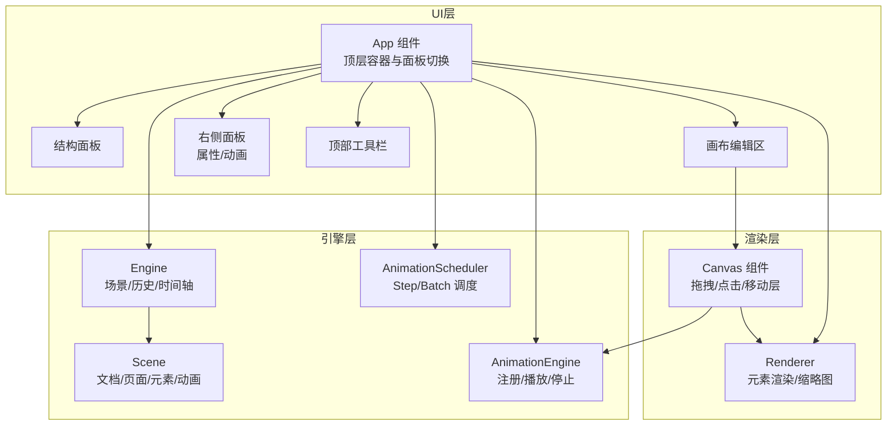
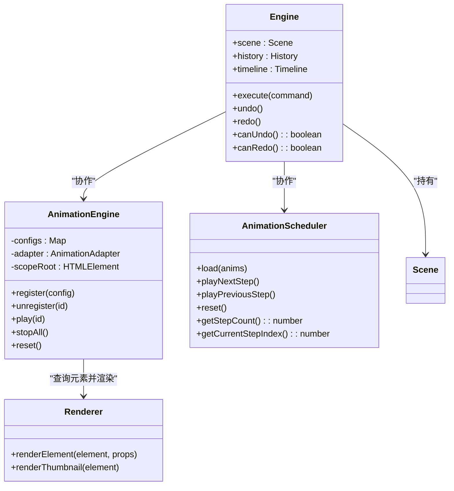
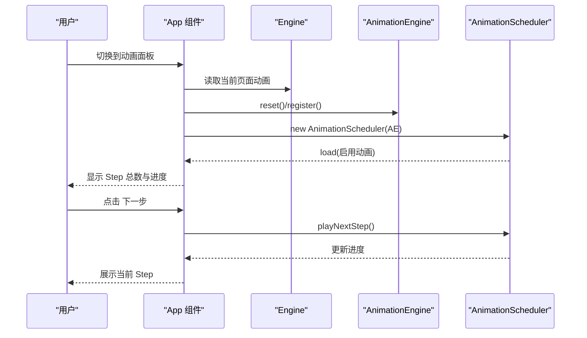
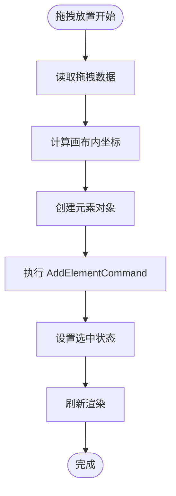
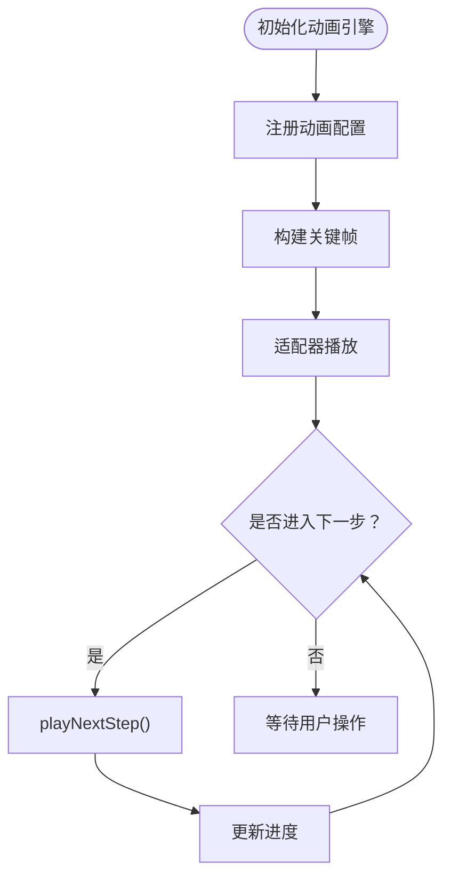
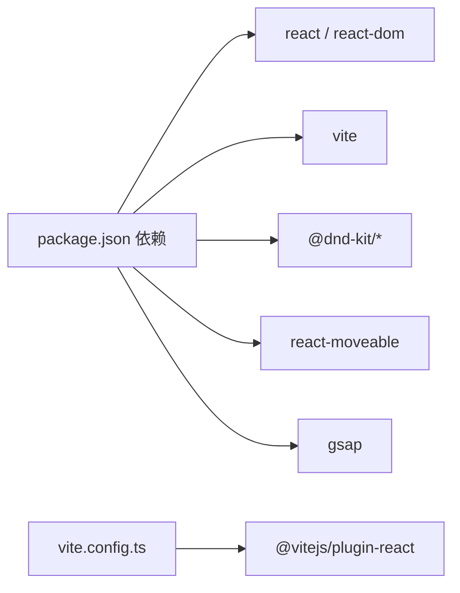

# 项目概述

<cite>
**本文引用的文件**
- [README.md](file://README.md)
- [spec.md](file://spec.md)
- [package.json](file://package.json)
- [vite.config.ts](file://vite.config.ts)
- [src/main.tsx](file://src/main.tsx)
- [src/App.tsx](file://src/App.tsx)
- [src/engine/index.ts](file://src/engine/index.ts)
- [src/engine/engine.ts](file://src/engine/engine.ts)
- [src/animation/index.ts](file://src/animation/index.ts)
- [src/animation/engine.ts](file://src/animation/engine.ts)
- [src/components/Canvas.tsx](file://src/components/Canvas.tsx)
- [src/renderer/index.tsx](file://src/renderer/index.tsx)
- [src/types/index.ts](file://src/types/index.ts)
</cite>

## 目录
1. [引言](#引言)
2. [项目结构](#项目结构)
3. [核心组件](#核心组件)
4. [架构总览](#架构总览)
5. [详细组件分析](#详细组件分析)
6. [依赖关系分析](#依赖关系分析)
7. [性能考虑](#性能考虑)
8. [故障排查指南](#故障排查指南)
9. [结论](#结论)
10. [附录](#附录)

## 引言
Slides Editor（课件编辑器）是一个以场景图（Scene Graph）为核心的数据驱动编辑器，专注于多页课件的可视化编辑与时间轴动画编排。项目通过“步骤/批次”（Step/Batch）模型实现预览态的进度控制，强调“所有操作必须修改数据、渲染层必须是纯函数、动画必须是时间驱动”的设计原则。其业务价值在于帮助教师与内容创作者以低门槛构建具有动画表现力的课件，支持从基础元素到复杂路径动画的全链路创作流程。

## 项目结构
项目采用前后端一体化的单页应用架构，前端基于 React + Vite，核心逻辑分为三层：
- UI层：左侧结构面板、中间画布编辑区、右侧属性/动画面板、顶部工具栏与预览入口
- 引擎层：场景数据模型（Scene Graph）、编辑器引擎（命令与历史）、动画引擎（适配器与调度）
- 渲染层：基于 React 的 DOM 渲染器，按元素类型输出对应节点

图表来源
- [src/App.tsx:11-344](file://src/App.tsx#L11-L344)
- [src/engine/engine.ts:7-54](file://src/engine/engine.ts#L7-L54)
- [src/animation/engine.ts:9-120](file://src/animation/engine.ts#L9-L120)
- [src/components/Canvas.tsx:22-191](file://src/components/Canvas.tsx#L22-L191)
- [src/renderer/index.tsx:189-202](file://src/renderer/index.tsx#L189-L202)

章节来源
- [src/App.tsx:11-344](file://src/App.tsx#L11-L344)
- [src/engine/index.ts:1-16](file://src/engine/index.ts#L1-L16)
- [src/animation/index.ts:1-8](file://src/animation/index.ts#L1-L8)
- [src/components/Canvas.tsx:22-191](file://src/components/Canvas.tsx#L22-L191)
- [src/renderer/index.tsx:189-202](file://src/renderer/index.tsx#L189-L202)

## 核心组件
- 应用入口与顶层容器
  - React 根节点挂载于 index.html 的 root 容器，顶层 App 负责组织面板、工具栏、动画调度与预览模态。
- 场景与编辑器引擎
  - Engine 封装 Scene、History、Timeline 与 EditorState，提供命令执行、撤销/重做与编辑态状态管理。
- 动画引擎与调度
  - AnimationEngine 负责动画配置注册、关键帧构建与适配器播放；AnimationScheduler 基于 Step/Batch 模型驱动预览态进度。
- 画布与渲染
  - Canvas 组件承载页面元素渲染、拖拽放置、点击选择与移动层集成；Renderer 提供元素到 React 节点的映射。

章节来源
- [src/main.tsx:1-10](file://src/main.tsx#L1-L10)
- [src/App.tsx:11-344](file://src/App.tsx#L11-L344)
- [src/engine/engine.ts:7-54](file://src/engine/engine.ts#L7-L54)
- [src/animation/engine.ts:9-120](file://src/animation/engine.ts#L9-L120)
- [src/components/Canvas.tsx:22-191](file://src/components/Canvas.tsx#L22-L191)
- [src/renderer/index.tsx:189-202](file://src/renderer/index.tsx#L189-L202)

## 架构总览
系统遵循“数据驱动 + 渲染抽象 + 可扩展渲染器”的设计：
- 数据模型优先：以 Scene Graph 为核心，所有 UI 行为最终落回到数据变更
- 渲染层纯函数：renderElement 将数据转换为 React 节点，保证可预测性
- 动画时间驱动：AnimationEngine 与 AnimationScheduler 以时间推进动画状态
- 可扩展渲染：预留 Canvas Renderer 的可能性，当前以 DOM Renderer 为主

图表来源
- [src/engine/engine.ts:7-54](file://src/engine/engine.ts#L7-L54)
- [src/animation/engine.ts:9-120](file://src/animation/engine.ts#L9-L120)
- [src/renderer/index.tsx:189-202](file://src/renderer/index.tsx#L189-L202)

## 详细组件分析

### 应用与顶层控制流
- 顶层 App 初始化引擎与动画引擎，维护右侧面板标签、预览开关与 Step 进度
- 在动画面板激活时，根据当前页面动画列表构建 AnimationScheduler 并同步进度
- 键盘快捷键支持撤销/重做与删除选中元素
- 全屏预览按钮打开 PreviewModal，隔离动画作用域

图表来源
- [src/App.tsx:28-74](file://src/App.tsx#L28-L74)
- [src/App.tsx:87-105](file://src/App.tsx#L87-L105)
- [src/animation/engine.ts:114-119](file://src/animation/engine.ts#L114-L119)

章节来源
- [src/App.tsx:11-344](file://src/App.tsx#L11-L344)

### 画布与元素渲染
- Canvas 负责：
  - 设置动画作用域根节点，确保编辑态下动画目标元素正确
  - 处理拖拽放置：接收来自组件面板的元素类型，计算画布内坐标并创建元素
  - 点击选择与画布空白处取消选择
- Renderer 提供：
  - renderElement：按元素类型输出 React 节点，包含选择框与事件透传
  - renderThumbnail：用于缩略图等无交互场景

图表来源
- [src/components/Canvas.tsx:39-69](file://src/components/Canvas.tsx#L39-L69)
- [src/engine/engine.ts:29-32](file://src/engine/engine.ts#L29-L32)
- [src/renderer/index.tsx:189-202](file://src/renderer/index.tsx#L189-L202)

章节来源
- [src/components/Canvas.tsx:22-191](file://src/components/Canvas.tsx#L22-L191)
- [src/renderer/index.tsx:14-27](file://src/renderer/index.tsx#L14-L27)
- [src/renderer/index.tsx:189-202](file://src/renderer/index.tsx#L189-L202)

### 动画系统与时间轴
- AnimationEngine
  - 注册/注销动画配置，查询元素并构建关键帧，委托适配器播放
  - 支持按元素批量播放/停止/暂停/恢复
- AnimationScheduler
  - 基于 Step/Batch 模型：Step 由用户点击触发，Batch 为 Step 内串行批次，Batch 内动画并行
  - 提供前进/后退/重置与进度查询

图表来源
- [src/animation/engine.ts:32-70](file://src/animation/engine.ts#L32-L70)
- [src/animation/engine.ts:114-119](file://src/animation/engine.ts#L114-L119)
- [README.md:6-15](file://README.md#L6-L15)

章节来源
- [src/animation/engine.ts:9-120](file://src/animation/engine.ts#L9-L120)
- [README.md:6-15](file://README.md#L6-L15)

### 数据模型与类型定义
- 元素类型：基础元素（形状/图片/文本）与分组
- 页面与文档：页面包含元素与动画字典，文档包含页面与结构项
- 编辑态状态：选中元素、视口、工具模式、悬停元素
- 动画与关键帧：动画配置包含起止时间、缓动与关键帧序列

章节来源
- [src/types/index.ts:10-54](file://src/types/index.ts#L10-L54)
- [src/types/index.ts:64-84](file://src/types/index.ts#L64-L84)
- [src/types/index.ts:144-159](file://src/types/index.ts#L144-L159)
- [src/types/index.ts:118-130](file://src/types/index.ts#L118-L130)

## 依赖关系分析
- 前端框架与工具
  - React 18 与 React DOM 18 作为 UI 基础
  - Vite 作为构建与开发服务器
  - ESLint 与 TypeScript 提供代码质量与类型保障
- 交互与动画
  - react-moveable 用于元素拖拽/缩放/旋转
  - GSAP 与 WebAnimation API 作为动画适配器（通过 AnimationEngine 适配）

图表来源
- [package.json:12-32](file://package.json#L12-L32)
- [vite.config.ts:1-7](file://vite.config.ts#L1-L7)

章节来源
- [package.json:12-32](file://package.json#L12-L32)
- [vite.config.ts:1-7](file://vite.config.ts#L1-L7)

## 性能考虑
- 渲染层纯函数与最小重绘
  - renderElement 仅依据数据生成节点，避免副作用，减少不必要重渲染
- 动画作用域限定
  - 通过 setScopeRoot 将 DOM 查询限制在画布容器内，降低选择器开销
- 关键帧构建与适配器复用
  - buildKeyframes 与适配器播放分离，便于缓存与复用
- 事件与状态管理
  - 使用 useMemo/useCallback 降低顶层组件重渲染频率

## 故障排查指南
- 动画未生效
  - 检查动画是否启用且已注册至 AnimationEngine
  - 确认元素存在且 data-element-id 匹配
  - 若在预览态，确认 AnimationScheduler 是否已加载当前页面动画
- 拖拽放置无效
  - 确认拖拽数据格式为合法 JSON
  - 检查画布容器是否正确设置作用域根节点
- 删除元素失败
  - 确认当前焦点不在输入框，否则键盘事件会被输入框拦截
  - 检查选中元素 ID 是否存在

章节来源
- [src/animation/engine.ts:19-30](file://src/animation/engine.ts#L19-L30)
- [src/components/Canvas.tsx:39-69](file://src/components/Canvas.tsx#L39-L69)
- [src/App.tsx:108-150](file://src/App.tsx#L108-L150)

## 结论
Slides Editor 以 Scene Graph 为数据核心，结合数据驱动的渲染与时间轴动画系统，提供了从基础元素到复杂路径动画的完整创作链路。通过“步骤/批次”预览模型与可扩展渲染器设计，项目既满足教学场景的易用性，也为后续增强（如 Canvas 渲染、更丰富的时间轴 UI）预留了空间。

## 附录

### 快速开始
- 安装与启动
  - 使用包管理器安装依赖后，运行开发服务器
  - 构建产物输出至 dist 目录，可通过预览命令查看
- 基本使用
  - 从左侧组件面板拖拽元素到画布，点击元素进行选择
  - 在右侧属性面板调整尺寸、位置、旋转与样式
  - 切换到动画面板，为元素添加动画并使用“下一步/上一步”逐步预览
- 核心功能演示
  - 拖拽放置：将形状/文本/图片拖入画布
  - 选择与变换：使用移动层进行拖拽/缩放/旋转
  - 动画编排：设置入场/强调动画，观察 Step/Batch 预览进度

章节来源
- [package.json:6-11](file://package.json#L6-L11)
- [src/App.tsx:155-341](file://src/App.tsx#L155-L341)
- [README.md:6-15](file://README.md#L6-L15)